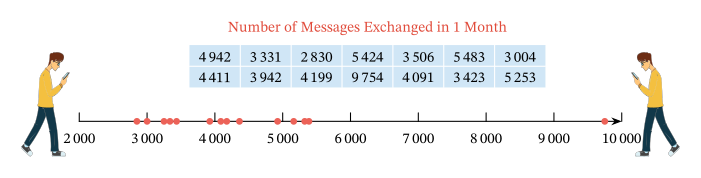
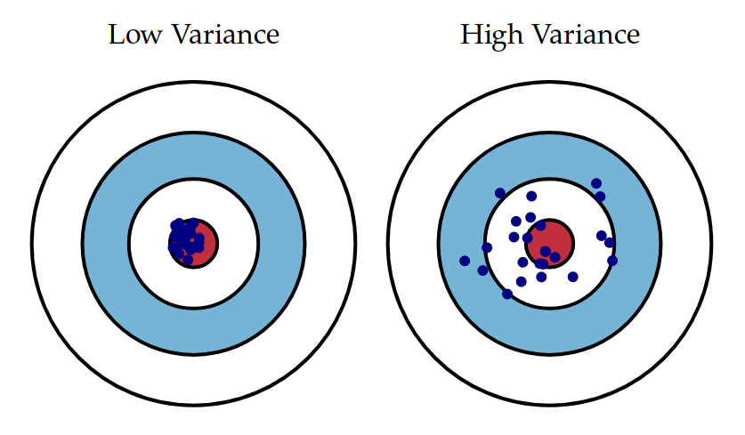

# Introduction to statistics

---
## Agenda

- **Where:**
  - Mar 4: AULA GALILEO - MBC
  - Mar 5: AULA DARWIN - MBC
  - Mar 6 : Online

- **When:**
  - 14-17
  - 1 coffee break

- **Who:**
    
    - Paola Dalmasso paola.dalmasso@unito.it
    - Alessia Visconti alessia.visconti@unito.it

- **How (to pass):**
    - Attend at least 2 lessons

---
## How to ask questions/give feedback

- Interrupt me
- Take advantage of end/start/breaks
- Send emails alessia.visconti@unito.it
- Use the shared pad: https://etherpad.wikimedia.org/p/intro_stats_2024_specialita

---

# Introduction

---
## Why are we here?

---
## &nbsp;

---
## Florence Nightingale

<!-- Florence Nightingale era un'infermiera britannica che e' considerata la madre dell'infermieristica come la intendiamo oggi, un titolo che si e' guadagnato durante la guerra di Crimea, quando era sovrintendente di un ospedale di Instambul. 

Appena arrivata ad Instabul, Florence, si accorge subito delle pessime condizioni di sovraffollameto e pulizia, ma oltre a cercare di mettere una pezza, pulendo e disinfettando tutto con le sue infermiere, si mette anche a raccogliere dati, soprattutto sulle cause di morte dei soldati. -->

---
## Florence Nightingale

<!-- E questi dati non solo li raccoglie, ma li riassume e presenta anche sotto forma di polar diagram, che spedisce regolarmente al governo britannico. 

Come si legge il grafico. Blu = malattie infettive, Rosso = ferite riportate in battaglia, nero = altre cause

E cosa concludiamo? 
Che migliorare le condizioni igenice (pulizia, luce, ventilazione, ...) degli ospedali, aumenta le possibilita' di salvare il paziente. 

E se questo e' ovvio oggi, lo dobbiamo alla sua abilita' nel raccogliere e presentare i dati, e nel prendere delle decisioni basate su di essi. Insomma, grazie alla statistica. -->

---
## What is Statistics?

* The collection, organisation, summarisation, and analysis of data   &nbsp;&nbsp;&nbsp; &rarr; *Descriptive* &nbsp;statistics

* The drawing of inferences about a body of data when only a part of the data is observed   &nbsp;&nbsp;&nbsp; &rarr; *Inferential* &nbsp;statistics

<!-- - Individuare in maniera efficiente i tratti importanti delle informazioni che sono state raccolte

- Partire dal particolare per capire come le informazioni si possono estendere alla totalità -->

---
## What will we learn?

- How to collect data
- How to summarise data
- How to make decision with data

<!-- - Come raccogliere i dati, che andranno scelti oculatamente per far si' che il particolare che ossserviamo si estenda alla totalita' della popolazione

- Come sintetizzarli, utilizzando vari indici, ma anche qualche rappresentazione grafica

- come usare approcci statistici per stimare valori della popolazione, e definire e verificare ipotesi -->

---
## What will we learn?

Tomazini, B.M., et al. Effect of dexamethasone on days alive and ventilator-free in patients with moderate or severe acute respiratory distress syndrome and COVID-19: the CoDEX randomized clinical trial.", Jama, 2020, doi:10.1001/jama.2020.17021

<!-- Andremo per esempio a capire come disegnare un piano di raccolta e analisi dei dati che ci permetta di capire se Nei pazienti con COVID-19 e sindrome da distress respiratorio acuto moderato o grave (ARDS), desametasone è efficace nell’aumentare il numero di giorni di respirazione autonoma? -->

---
## Topics covered

- How to sample from a population
- How to use measure of centrality and dispersion
- How to make estimation from a sample
- How to interpret confidence intervals
- How to make and test hypotheses

<!-- Qui un elenco piu' formale dei topics. Ci saranno anche delle formule matematiche, ma non preoccupatevi: andremo a spiegarle e saranno un aiuto per svolgere gli esercizi e in generale capire cosa stiamo facendo (si', ci sono anche degli esercizi!) -->

---

# Sampling

---
## Learning objectives

- Understand the difference between population and sample
- Understand the difference between sampling strategies
- Understand sampling error and bias

<!-- ---
## Sources of Data

- Routinely kept records
- Surveys
- Experiments
- External sources

<!-- L'attivita' statistica e' motivata dalla necessita' di rispondere ad una domanda (perche' i soldati in Crimea muoiono?)

Dopo aver scelto la domanda e il modo (statistico) piu' appropriato per rispondere, dobbiamo iniziare a a raccogliere i dati  

1) dati amministrativi su ricoveri, procedure, medicinali somministrati
2) informazioni che non vengono raccolte di routine (esempio: aiuto a casa per pazienti fragili) 
3) clinical trial, si provano su diversi pazienti diversi approcci clinici per decidere qual e' il migliore
4) dati disponibili pubblicamente da altri studi, o che sono stati raccolti per rispondere a domande diverse ma che sono utili anche a noi --> -->

--- 
## Population *vs*  &nbsp;sample

<!-- Popolazione e' l'insieme di tutti gli individui per cui vogliamo studiare un fenomeno, e.g., popolazione italiana

Il modo tradizionale per studiare una popolazione e' il censimento, che pero' ha diversi svantaggi, tra cui il costo

Avveniva ogni 10 anni, ultimo nel 2011 -> dal 2018 permanent census, sotto gruppo della popolazione, quindi quello che chiamiamo un campione statistico 

Altro svantaggio , e b) non e' possibile raccogliere tutte le informazioni possiboli e immaginabili (trauma cranico al nido)
-->

---
## Population *vs*  &nbsp;sample (in the clinic)

<!-- Nella ricerca clinica, la popolazione e' l'insieme di tutti i pazienti che ci interessano

Campione sono quelli che siamo andati a reclutare .

Ovviamente questi campioni devono essere scelti con procedimenti e regole che garantiscano la capacità del campione di rappresentare la popolazione
-->

---
## Opportunity *vs*  &nbsp;random sample

:dart: &nbsp;&nbsp;&nbsp; An **opportunity** sample is the sample drawn from the part of 
&nbsp;&nbsp;&nbsp;&nbsp;&nbsp;&nbsp;&nbsp;&nbsp;&nbsp; the population that is close to hand (and which may not 
&nbsp;&nbsp;&nbsp;&nbsp;&nbsp;&nbsp;&nbsp;&nbsp;&nbsp; represent the whole population)

:pushpin: &nbsp;&nbsp;&nbsp; All the patients presenting to a given clinic in a given period of 
&nbsp;&nbsp;&nbsp;&nbsp;&nbsp;&nbsp;&nbsp;&nbsp;&nbsp; time are enrolled

<!-- Iniziamo con il distinguere il campionamento probabilistico da quello non propabilistico.

Nel campionamento non-probabilistico, o opportunustico, la selezione del campione avviene in base a criteri di comodo o di praticità, per esempio perché certi individui sono più facilmente contattabili, o per ragioni di costo -->

---
## Opportunity *vs*  &nbsp;random sample

:dart: &nbsp;&nbsp;&nbsp; A **random** sample is the sample in which the probability of 
&nbsp;&nbsp;&nbsp;&nbsp;&nbsp;&nbsp;&nbsp;&nbsp;&nbsp; getting any particular sample may be calculated (and which 
&nbsp;&nbsp;&nbsp;&nbsp;&nbsp;&nbsp;&nbsp;&nbsp;&nbsp; should represent the whole population)

:pushpin: &nbsp;&nbsp;&nbsp; A randomly selected set of patients with the disease is enrolled

<!-- Nel campionamento probabilistico ogni unità della popolazione in studio ha una probabilità NOTA di essere estratta (non distorto o viziato) -->

---
## Strategy 1: Simple random sampling

:dart: &nbsp;&nbsp;&nbsp; A sample of size $n$ drawn from a 
&nbsp;&nbsp;&nbsp;&nbsp;&nbsp;&nbsp;&nbsp;&nbsp;&nbsp; population of size $N$ ensuring 
&nbsp;&nbsp;&nbsp;&nbsp;&nbsp;&nbsp;&nbsp;&nbsp;&nbsp; that every possible sample of 
&nbsp;&nbsp;&nbsp;&nbsp;&nbsp;&nbsp;&nbsp;&nbsp;&nbsp; size $n$ is equally likely

<!-- Nel campionamento casuale semplice tutte le unità della popolazione hanno la stessa probabilità di essere estratte:

data una popolazione di N individui ed un campione di dimensione n  la probabilità che l’i-esimo individuo entri nel campione è “n/N” -->

---
## Strategy 1: Simple random sampling

:pushpin: &nbsp;&nbsp;&nbsp;  $N=90$
&nbsp;&nbsp;&nbsp;&nbsp;&nbsp;&nbsp;&nbsp;&nbsp;&nbsp; $n=10$ 
&nbsp;&nbsp;&nbsp;&nbsp;&nbsp;&nbsp;&nbsp;&nbsp;&nbsp; without replacement

<!-- Disporre di un elenco completo di tutti i soggetti della popolazione e una loro numerazione

Decidere quante unità si vogliono selezionare e calcolare la frazione di campionamento -->

---
## Strategy 1: Simple random sampling

:pushpin: &nbsp;&nbsp;&nbsp;  $N=90$
&nbsp;&nbsp;&nbsp;&nbsp;&nbsp;&nbsp;&nbsp;&nbsp;&nbsp; $n=10$ 
&nbsp;&nbsp;&nbsp;&nbsp;&nbsp;&nbsp;&nbsp;&nbsp;&nbsp; without replacement

&nbsp;&nbsp;&nbsp;&nbsp;&nbsp;&nbsp;&nbsp;&nbsp;&nbsp; $49, 65, 25, 74, 18$
&nbsp;&nbsp;&nbsp;&nbsp;&nbsp;&nbsp;&nbsp;&nbsp;&nbsp; $90, 47, 24, 71, 37$

<!--  Estrarre le unità tramite sorteggio casuale o tavole dei numeri casuali (costruite in modo da non avere vizi sistematici. Sono delle serie di numeri tra 0 e 9 disposti a caso e caratterizzati dall’avere una distribuzione uniforme) -->

---
## Strategy 2: Systematic Sampling

:pushpin: &nbsp;&nbsp;&nbsp;  $N=90$
&nbsp;&nbsp;&nbsp;&nbsp;&nbsp;&nbsp;&nbsp;&nbsp;&nbsp; $n=10$

&nbsp;&nbsp;&nbsp;&nbsp;&nbsp;&nbsp;&nbsp;&nbsp;&nbsp; $x = 42$ 

&nbsp;&nbsp;&nbsp;&nbsp;&nbsp;&nbsp;&nbsp;&nbsp;&nbsp; $step = N/n = 90/10=9$ 

<!-- Estraggo a caso una prima unita'
Mi calcolo il passo di campionamento, ovvero una distanza costante tra gli individui estratti  -->

---
## Strategy 2: Systematic Sampling

:pushpin: &nbsp;&nbsp;&nbsp;  $N=90$
&nbsp;&nbsp;&nbsp;&nbsp;&nbsp;&nbsp;&nbsp;&nbsp;&nbsp; $n=10$

&nbsp;&nbsp;&nbsp;&nbsp;&nbsp;&nbsp;&nbsp;&nbsp;&nbsp; $x = 42$ 

&nbsp;&nbsp;&nbsp;&nbsp;&nbsp;&nbsp;&nbsp;&nbsp;&nbsp; $step = N/n = 90/10=9$ 

<!--  dopo la prima estrazione casuale si estrae una unità ogni N/n-->

---
## Strategy 3: Stratified Random Sampling

:dart: &nbsp;&nbsp;&nbsp; The population is divided into homogenous group (strata) and 
&nbsp;&nbsp;&nbsp;&nbsp;&nbsp;&nbsp;&nbsp;&nbsp;&nbsp; a simple random sample is drawn from each stratum

&nbsp;&nbsp;&nbsp;&nbsp;&nbsp;&nbsp;&nbsp;&nbsp;&nbsp; Variation #1: stratified systematic sample 
&nbsp;&nbsp;&nbsp;&nbsp;&nbsp;&nbsp;&nbsp;&nbsp;&nbsp; Variation #2: stratified sampling proportional to size

---
## Strategy 3: Stratified Random Sampling

:pushpin: &nbsp;&nbsp;&nbsp;  $M=90$
&nbsp;&nbsp;&nbsp;&nbsp;&nbsp;&nbsp;&nbsp;&nbsp;&nbsp; $N_{female}=60$
&nbsp;&nbsp;&nbsp;&nbsp;&nbsp;&nbsp;&nbsp;&nbsp;&nbsp; $N_{male}=30$

&nbsp;&nbsp;&nbsp;&nbsp;&nbsp;&nbsp;&nbsp;&nbsp;&nbsp; $n=9$ 
&nbsp;&nbsp;&nbsp;&nbsp;&nbsp;&nbsp;&nbsp;&nbsp;&nbsp; $n_{female} = 6$
&nbsp;&nbsp;&nbsp;&nbsp;&nbsp;&nbsp;&nbsp;&nbsp;&nbsp; $n_{male} = 3$

&nbsp;&nbsp;&nbsp;&nbsp;&nbsp;&nbsp;&nbsp;&nbsp;&nbsp; $Females: 46, 20, 26,$
&nbsp;&nbsp;&nbsp;&nbsp;&nbsp;&nbsp;&nbsp;&nbsp;&nbsp;&nbsp;&nbsp;&nbsp;&nbsp;&nbsp;&nbsp;&nbsp;&nbsp;&nbsp;&nbsp;&nbsp;&nbsp;&nbsp;&nbsp;&nbsp;&nbsp;&nbsp;&nbsp;&nbsp;&nbsp;&nbsp;&nbsp;&nbsp;&nbsp; $50, 47,  3$
&nbsp;&nbsp;&nbsp;&nbsp;&nbsp;&nbsp;&nbsp;&nbsp;&nbsp;&nbsp;&nbsp;&nbsp;&nbsp;&nbsp; $Males: 69, 85, 87$

<!-- Esempi di strata : sesso, eta', condizione sociale -->

---
## Strategy 4: Cluster sampling

:dart: &nbsp;&nbsp;&nbsp; The population is divided into clusters, and a simple random 
&nbsp;&nbsp;&nbsp;&nbsp;&nbsp;&nbsp;&nbsp;&nbsp;&nbsp; sample is drawn
 
&nbsp;&nbsp;&nbsp;&nbsp;&nbsp;&nbsp;&nbsp;&nbsp;&nbsp; Variation: one stage (observing everything) *vs* 
&nbsp;&nbsp;&nbsp;&nbsp;&nbsp;&nbsp;&nbsp;&nbsp;&nbsp;&nbsp;&nbsp;&nbsp;&nbsp;&nbsp;&nbsp;&nbsp;&nbsp;&nbsp;&nbsp;&nbsp;&nbsp;&nbsp;&nbsp;&nbsp;&nbsp;&nbsp;&nbsp;&nbsp;&nbsp;&nbsp;&nbsp; two stage (sampling within clusters)

<!-- Le unità della popolazione sono suddivise in CLUSTER o GRAPPOLI in base a circostanze organizzative, strutturali, geografiche.
All’interno dei cluster le unità possono essere molto diverse tra di loro.

Il campione si forma estraendo casualmente un numero prestabilito di cluster, dopodichè si possono includere tutte le unità che appartengono al cluster (1 stadio) o solo una parte (2 stadi, usano campionamento semplice o stratificato)
 -->

---
## Strategy 4: Cluster sampling

--- 
## Sampling in the wild

https://hbsc.org

<!--  Studio internazionale che si tiene ogni 4 anni e che raccoglie informazioni sui ragazzi di 11, 13, 15 e, recentemente anche 17 anni (che sono la mia popolazione) 
Ma non li raccoglie tutti, ne raccoglie un campione.

Innanzitutto li devo dividere per regioni (stratificato), poi vado a identifcare le scuole (cluster)
All'interno delle scuole vado a fare un ulteriore strato per grado/eta' e poi prpcedo con un sistematic sampling all'interno di ciascuno strato per identiicare le classi (di cui scelgo TUTTI gli studenti della classe)

Countries may choose to stratify their samples to ensure representation by, for example, geographic location,
ethnic group or school type.
-->

---
### Exercise #1

:question: &nbsp;&nbsp;&nbsp; A representative of a cheese factory is asking questions 
&nbsp;&nbsp;&nbsp;&nbsp;&nbsp;&nbsp;&nbsp;&nbsp;&nbsp;  on cheese consumption to every 5th customer entering
&nbsp;&nbsp;&nbsp;&nbsp;&nbsp;&nbsp;&nbsp;&nbsp;&nbsp;  the supermarket

&nbsp;&nbsp;&nbsp;&nbsp;&nbsp;&nbsp;&nbsp;&nbsp;&nbsp; Which kind of sampling strategy are they using?

&nbsp;&nbsp;&nbsp;&nbsp;&nbsp;&nbsp;&nbsp;&nbsp;&nbsp; a) simple random sampling
&nbsp;&nbsp;&nbsp;&nbsp;&nbsp;&nbsp;&nbsp;&nbsp;&nbsp; b) systematic sampling
&nbsp;&nbsp;&nbsp;&nbsp;&nbsp;&nbsp;&nbsp;&nbsp;&nbsp; c) stratified sampling
&nbsp;&nbsp;&nbsp;&nbsp;&nbsp;&nbsp;&nbsp;&nbsp;&nbsp; d) none of the above 

---
### Exercise #1 -- Solution

:question: &nbsp;&nbsp;&nbsp; A representative of a cheese factory is asking questions 
&nbsp;&nbsp;&nbsp;&nbsp;&nbsp;&nbsp;&nbsp;&nbsp;&nbsp;  on cheese consumption to every 5th customer entering
&nbsp;&nbsp;&nbsp;&nbsp;&nbsp;&nbsp;&nbsp;&nbsp;&nbsp;  the supermarket

&nbsp;&nbsp;&nbsp;&nbsp;&nbsp;&nbsp;&nbsp;&nbsp;&nbsp; Which kind of sampling strategy are they using?

&nbsp;&nbsp;&nbsp;&nbsp;&nbsp;&nbsp;&nbsp;&nbsp;&nbsp; a) simple random sampling
&nbsp;&nbsp;&nbsp;&nbsp;&nbsp;&nbsp;&nbsp;&nbsp;&nbsp; b) systematic sampling
&nbsp;&nbsp;&nbsp;&nbsp;&nbsp;&nbsp;&nbsp;&nbsp;&nbsp; c) stratified sampling
&nbsp;&nbsp;&nbsp;&nbsp;&nbsp;&nbsp;&nbsp;&nbsp;&nbsp; d) none of the above :white_check_mark: 

---
## Selection bias

- Survivor bias
- Volunteer bias
- Lost to follow up bias
- $\dots$

<!-- Anche se facciamo attenzione i nostri sample possono avere delle distorsioni

- voglio andare a vedere dove gli aerei da guerra vengono colpiti per rinforzarli
- - volontari alsop SES e soprattuto donne
- sto testando un nuovo farmaco, le persone che hanno i side effect peggiori possono interromperlo, o quelli per cui non funziona possono morire -->

---
## Selection bias in the wild

<!-- Persino in un campione di 0.5M di persone come la UKBB, si osserva che non rispondere o rispondere non lo so a questionari (109 domande, in questo studio) non e' casuale e dipende da foattori genetici e ambientali -->

---
### Exercise #2

:question: &nbsp;&nbsp;&nbsp; Researchers send pensioners a snail mail to ask about their 
&nbsp;&nbsp;&nbsp;&nbsp;&nbsp;&nbsp;&nbsp;&nbsp;&nbsp;  mental health  after the COVID-19 lockdown. Pensioners are  
&nbsp;&nbsp;&nbsp;&nbsp;&nbsp;&nbsp;&nbsp;&nbsp;&nbsp;  then asked to post their  answer back

&nbsp;&nbsp;&nbsp;&nbsp;&nbsp;&nbsp;&nbsp;&nbsp;&nbsp; Will their study suffer any bias?

&nbsp;&nbsp;&nbsp;&nbsp;&nbsp;&nbsp;&nbsp;&nbsp;&nbsp; a) No
&nbsp;&nbsp;&nbsp;&nbsp;&nbsp;&nbsp;&nbsp;&nbsp;&nbsp; b) Yes, volunteer bias
&nbsp;&nbsp;&nbsp;&nbsp;&nbsp;&nbsp;&nbsp;&nbsp;&nbsp; c) Yes, survivor bias
&nbsp;&nbsp;&nbsp;&nbsp;&nbsp;&nbsp;&nbsp;&nbsp;&nbsp; d) Both b) and c)

---
### Exercise #2 -- Solution

:question: &nbsp;&nbsp;&nbsp; Researchers send pensioners a snail mail to ask about their 
&nbsp;&nbsp;&nbsp;&nbsp;&nbsp;&nbsp;&nbsp;&nbsp;&nbsp;  mental health  after the COVID-19 lockdown. Pensioners are  
&nbsp;&nbsp;&nbsp;&nbsp;&nbsp;&nbsp;&nbsp;&nbsp;&nbsp;  then asked to post their  answer back

&nbsp;&nbsp;&nbsp;&nbsp;&nbsp;&nbsp;&nbsp;&nbsp;&nbsp; Will their study suffer any bias?

&nbsp;&nbsp;&nbsp;&nbsp;&nbsp;&nbsp;&nbsp;&nbsp;&nbsp; a) No
&nbsp;&nbsp;&nbsp;&nbsp;&nbsp;&nbsp;&nbsp;&nbsp;&nbsp; b) Yes, volunteer bias
&nbsp;&nbsp;&nbsp;&nbsp;&nbsp;&nbsp;&nbsp;&nbsp;&nbsp; c) Yes, survivor bias
&nbsp;&nbsp;&nbsp;&nbsp;&nbsp;&nbsp;&nbsp;&nbsp;&nbsp; d) Both b) and c) :white_check_mark: 

---

## Summary

- When can't study a population, we select a representative sample
- There are different sampling strategies
- Samples may suffer from biases

---

# Summarise data

---
## Learning objectives

- Understand the differences between data types
- Be able to summarise each data type using measure of centrality and dispersion
- Understand the difference between statistics and parameters
- Understand why visualise your data is important

---
# Type of data

<!-- Andiamo a dividere i dati in variabili quantitative (o numeriche) o qualitative (o categorighe) 

Numeriche: 
- continue (altezza, peso, BMI, temperatura corporea)
- discrete (numero di pazienti ammessi in PS)

Categoriche:
- Nominali -> due categorie binarie (diabete si/no), piu' categorie (gruppo sanguigno)
- Ordinali -> dati che rappresentano categorie ordinate (ECOG performance status [0-4], giudizi scolastici ("Insufficiente", "Sufficiente", "Buono", "Ottimo:")) -->

---
### Exercise #3

:question: &nbsp;&nbsp;&nbsp; Which types of data are 
&nbsp;&nbsp;&nbsp;&nbsp;&nbsp;&nbsp;&nbsp;&nbsp;&nbsp; included in this table?

Visconti A., et al., Total serum *N*‐glycans associate with response to immune checkpoint inhibition therapy and survival in patients with advanced melanoma, BMC Cancer, 2023 doi:10.1186/s12885-023-10511-3

<!-- Sesso: Binaria
Eta'/BMI: continua
BRAF: binaria
Metastatic stage: Ordinale
ECOG score: ordinale
ICI teraphy: categorico (con piu' categorie) 
N: discreto
-->

--- 
## Why do  we care?

Visconti A., et al., Total serum *N*‐glycans associate with response to immune checkpoint inhibition therapy and survival in patients with advanced melanoma, BMC Cancer, 2023 doi:10.1186/s12885-023-10511-3

<!-- Perche' il modo in cui andiamo prima a presentare e poi ad analizzare una variabile dipende dal suop tipo.

Numeriche media/SD, categoriche N/% -->

---
## Measures of centrality and dispersion

<!--  E cosa sono poi queste media, SD? Sono due delle proprieta' che descrivono i dati

Tendenza centrale (o posizione) -> Individuano il valore intorno al quale i dati sono raggruppati

Dispersione o variabilita'  -> Forniscono un’indicazione della dispersione delle osservazioni intorno al valore centrale -->

---
## Measure of centrality: mode

:dart: &nbsp;&nbsp;&nbsp; The most frequent item

:pushpin: &nbsp;&nbsp;&nbsp; $x= \{1, 1, 1, 3, 4, 4, 7, 8, 8, 9, 9\}$
&nbsp;&nbsp;&nbsp;&nbsp;&nbsp;&nbsp;&nbsp;&nbsp;&nbsp; $\text{mode}(x)=1$

&nbsp;&nbsp;&nbsp;&nbsp;&nbsp;&nbsp;&nbsp;&nbsp;&nbsp;  $x= \{1, 1, 1, 3, 4, 4, 4, 7, 8, 8, 9, 9\}$
&nbsp;&nbsp;&nbsp;&nbsp;&nbsp;&nbsp;&nbsp;&nbsp;&nbsp; $\text{mode}(x)=1 \land   4$

<!-- se ciascun valore si presenta una volta sola, le nostre osservazioni non hanno moda

Si usa soprattutto per i dati categorici -->

---
## Measure of centrality: median

:dart: &nbsp;&nbsp;&nbsp;The "middle" value

:warning: Data should be sorted!

<!-- Divide l'insieme di dati in due parti uguali, con il numero osservazioni <= mediana uguale a quello >= -->

---
## Measure of centrality: median

:dart: &nbsp;&nbsp;&nbsp;The "middle" value

:pushpin: &nbsp;&nbsp;&nbsp;  $n=7,  x= \{1, 3, 3, 6, 7, 8, 9\}$ 

&nbsp;&nbsp;&nbsp;&nbsp;&nbsp;&nbsp;&nbsp;&nbsp;&nbsp; $\text{median}(x)=x_{(n+1)/2} = x_{(7+1)/2}=x_4=6$ 

:pushpin: &nbsp;&nbsp;&nbsp;  $n=8,  x= \{1, 2, 3, 4, 5, 6, 8, 9\}$

&nbsp;&nbsp;&nbsp;&nbsp;&nbsp;&nbsp;&nbsp;&nbsp;&nbsp; $\text{median}(x)={\frac {x_{(n/2)}+x_{((n/2)+1)}}{2}} = {\frac {x_{(8/2)}+x_{((8/2)+1)}}{2}}$
&nbsp;&nbsp;&nbsp;&nbsp;&nbsp;&nbsp;&nbsp;&nbsp;&nbsp;&nbsp;&nbsp;&nbsp;&nbsp;&nbsp;&nbsp;&nbsp;&nbsp;&nbsp;&nbsp;&nbsp;&nbsp;&nbsp;&nbsp;&nbsp;&nbsp;&nbsp;&nbsp;&nbsp;&nbsp;&nbsp;&nbsp;&nbsp;&nbsp; $={\frac {x_{4}+x_{5}}{2}} = {\frac {4+5}{2}} = 4.5$ 

:warning: Data should be sorted!

<!-- Quando il numero di osservazioni e' pari, ci sono due valori mediani, e in questo caso si prende la loro media aritmetica -->

---
## Measure of centrality: median

:dart: &nbsp;&nbsp;&nbsp; Robust to outliers

:pushpin: &nbsp;&nbsp;&nbsp;  $n=7,  x= \{1, 3, 3, 6, 7, 8, 9\}$ 

&nbsp;&nbsp;&nbsp;&nbsp;&nbsp;&nbsp;&nbsp;&nbsp;&nbsp; $\text{median}(x)=x_{(n+1)/2} = x_{(7+1)/2}=x_4=6$ 

:pushpin: &nbsp;&nbsp;&nbsp;  $n=7,  x= \{1, 3, 3, 6, 7, 8, 109\}$ 

&nbsp;&nbsp;&nbsp;&nbsp;&nbsp;&nbsp;&nbsp;&nbsp;&nbsp; $\text{median}(x)=x_{(n+1)/2} = x_{(7+1)/2}=x_4=6$ 

:warning: Data should be sorted!

<!-- La mediana non e' influenzata da valori anomali o estremi (outliers) -->

---
## Quartiles

<!-- Mentre la mediana divide i dati in due meta' esatte, molto usati sono anche i quartili, che dividono i dati in 4 parti uguali -->

:warning: Data should be sorted!

---
## Quartiles

:pushpin: &nbsp;&nbsp;&nbsp;  $n=11, x= \{6, 7, 15, 36, 39, \underline{40}, 41, 42, 43, 47, 49\}$ 

&nbsp;&nbsp;&nbsp;&nbsp;&nbsp;&nbsp;&nbsp;&nbsp;&nbsp; $Q2(x)=\text{median}(x)=x_{(n+1)/2} = x_{(11+1)/2}=x_6=40$ 

&nbsp;&nbsp;&nbsp;&nbsp;&nbsp;&nbsp;&nbsp;&nbsp;&nbsp; $Q1(x_{1:5})= x_{(5+1)/2}=x_3=15$

&nbsp;&nbsp;&nbsp;&nbsp;&nbsp;&nbsp;&nbsp;&nbsp;&nbsp; $Q3(x_{7:11})= x_{(5+1)/2}=x_9=43$

:warning: Data should be sorted!

---
## Percentiles

<!-- Il percentile invece divide i dati in 100 intervalli, e dato una percentile, per esempio il decimo, sappiamo che il 10% dei valori assunti dalla variabile sono inferiori o uguali a quel valore -->

---
## Measure of centrality: mean

:dart: &nbsp;&nbsp;&nbsp; Arithmetic mean

$$
{\bar {x}}= {\frac {1}{n}}\left(\sum _{i=1}^{n}{x_{i}}\right)=
{\frac {x_{1}+x_{2}+\dots +x_{n}}{n}}
$$

:pushpin: &nbsp;&nbsp;&nbsp;  $x= \{4, 36, 45, 50, 75\}$ 

&nbsp;&nbsp;&nbsp;&nbsp;&nbsp;&nbsp;&nbsp;&nbsp;&nbsp; ${\bar {x}} = {\frac{1}{n}}\left(\sum _{i=1}^{n}{x_{i}}\right) = \frac{4 + 36 + 45 + 50 + 75}{5} = 42$

<!-- Somma dei singoli valori diviso il numero di osservazioni  -->

---
## Measure of centrality: mean

:dart: &nbsp;&nbsp;&nbsp; Not really robust to outliers

:pushpin: &nbsp;&nbsp;&nbsp;  $x= \{4, 36, 45, 50, 175\}$ 

&nbsp;&nbsp;&nbsp;&nbsp;&nbsp;&nbsp;&nbsp;&nbsp;&nbsp; ${\bar {x}} = {\frac {1}{n}}\left(\sum _{i=1}^{n}{x_{i}}\right) = \frac{4 + 36 + 45 + 50 + 175}{5} = 62$

<!-- Mentre la media e' la misura piu' usata per descrivere la tendenza centrale per la sua unicita' (c'e' solo una media) e semplicita', non e' particolarmente robusta rispetto agli outliers. Il valore atipico SOVRADIMENSIONA la media.

Vedremo piu' avanti, con le misure di dispersione, come accopagnare altri valori alla media per evidenziare queste situazioni  -->

---
## Mode *vs* &nbsp;median *vs* &nbsp;mean

<!-- La moda e' la parte piu' alta della curva, la mediana divide l'area in 2 parti uguali e la media e' il "balance point", quello in cui starebbe in equilibrio se fosse fatta di un materiale solido -->

---
## The shape of a distribution

<!-- Asimmetrica a destra/sinistra -->

---
## Measures of dispersion

---
## Measures of dispersion

---
## Measure of dispersion: range

:dart: &nbsp;&nbsp;&nbsp; ${\text{range}(x)}= \text{max}(x)-\text{min}(x)$

:pushpin: &nbsp;&nbsp;&nbsp;  $x= \{6, 7, 15, 36, 39, 40, 41, 42, 43, 47, 49\}$ 

&nbsp;&nbsp;&nbsp;&nbsp;&nbsp;&nbsp;&nbsp;&nbsp;&nbsp; ${\text{range}(x)}= \text{max}(x)-\text{min}(x)=49-6=43$

<!-- INTERVALLO di VARIAZIONE. Il range pero' si basa solo sui due valori estremi, senza indicare come si distribuiscono i dati entro l’intervallo -->

---
## Measure of dispersion: range

:question: &nbsp;&nbsp;&nbsp; $\text{range}(x)= \text{?}$

<!-- Il range ha tuttavia un'utilita' limitata: tiene conto solo di due valori, e non e' robusta quando ci sono valori anomali

14 osservazioni -->

---
## Measure of dispersion: range

:question: &nbsp;&nbsp;&nbsp; $\text{range}(x)= \text{max}(x)-\text{min}(x)=9,754-2,830=6,924$

<!-- Il range ha tuttavia un'utilita' limitata: tiene conto solo di due valori, e non e' robusta quando ci sono valori anomali -->

---
## Measure of dispersion: interquartile range

---
## Measure of dispersion: interquartile range

:dart: &nbsp;&nbsp;&nbsp; ${\text{IQR}(x)}= \text{Q3}(x)-\text{Q1}(x)$

:pushpin: &nbsp;&nbsp;&nbsp;  $x= \{6, 7, \underline{15}, 36, 39, \underline{40}, 41, 42, \underline{{43}}, 47, 49\}$ 

&nbsp;&nbsp;&nbsp;&nbsp;&nbsp;&nbsp;&nbsp;&nbsp;&nbsp; ${\text{IQR}(x)}= \text{Q3}(x)-\text{Q1}(x)=43-15=28$

<!-- Non sono considerati i valori estremi, ma sappiamo come si distribuisce la meta dei dati rispetto al valore centrale -->

---
## Measure of dispersion: interquartile range

:pushpin: &nbsp;&nbsp;&nbsp; $\text{range}(x) = \text{max}(x)-\text{min}(x)=9,754-2,830=6,924$
:pushpin: &nbsp;&nbsp;&nbsp; $\text{IQR}(x) \text{ }\text{ } = \text{Q3}(x)-\text{Q1}(x) \text{ }\text{ }\text{ }\text{ } =5,253-3,423=1,830$

---
## Measure of dispersion: variance

<!-- Misura la distanza media tra le osservazioni e la media del campione. Piu' bassa e' la varianza, piu' le osservazioni saranno vicine alla media  -->

---
## Measure of dispersion: variance

:dart: &nbsp;&nbsp;&nbsp; $s^2 = \frac{1}{n-1}\sum _{i=1}^{n}(x_{i}-\bar {x} )^{2}$

&nbsp;&nbsp;&nbsp;&nbsp;&nbsp;&nbsp;&nbsp;&nbsp;&nbsp; where &nbsp;&nbsp;&nbsp; ${\bar {x}}= {\frac {1}{n}}\left(\sum _{i=1}^{n}{x_{i}}\right)$ 

:pushpin: &nbsp;&nbsp;&nbsp;  $x= \{1, 2, 3\}$ &nbsp;&nbsp;&nbsp; $\bar{x}=\frac{1+2+3}{3}=2$

&nbsp;&nbsp;&nbsp;&nbsp;&nbsp;&nbsp;&nbsp;&nbsp;&nbsp; $s = \frac{1}{3-1}\times [(1-2)^2+ (2-2)^2+(3-2)^2] =$
&nbsp;&nbsp;&nbsp;&nbsp;&nbsp;&nbsp;&nbsp;&nbsp;&nbsp;&nbsp;&nbsp;&nbsp;&nbsp; $= \frac{1}{2}\times [1^2+ 0^2+1^2 ]=  \frac{1}{2}\times 2 = 1$

<!-- Andiamo a fare la distanza (differenza) tra ciascun valore e la media, la eleviamo al quatrato, la sommiamo e andiamo a dividerla per la dimensione del campione - 1 -->

---
## Measure of dispersion: variance

:dart: &nbsp;&nbsp;&nbsp; $s^2 = \frac{1}{n-1}\sum _{i=1}^{n}(x_{i}-\bar {x} )^{2}$

&nbsp;&nbsp;&nbsp;&nbsp;&nbsp;&nbsp;&nbsp;&nbsp;&nbsp; why &nbsp; $\frac{1}{n-1}$ &nbsp; ?  &nbsp;&nbsp;&nbsp;&nbsp;&nbsp;&nbsp;&nbsp;&nbsp;&nbsp;&nbsp;&nbsp;&nbsp; $\rightarrow$ &nbsp;&nbsp;&nbsp;&nbsp;&nbsp;&nbsp;&nbsp;&nbsp;&nbsp;&nbsp;&nbsp;&nbsp; $\sum _{i=1}^{n}(x_{i}-\bar {x} ) = 0$

:pushpin: &nbsp;&nbsp;&nbsp;  $x= \{1, 2, 3\}$ &nbsp;&nbsp;&nbsp; $\bar{x}=\frac{1+2+3}{3}=2$

&nbsp;&nbsp;&nbsp;&nbsp;&nbsp;&nbsp;&nbsp;&nbsp;&nbsp; $\sum _{i=1}^{n}(x_{i}-\bar {x} ) = (1-2) + (2-2) + (3-2) =$
&nbsp;&nbsp;&nbsp;&nbsp;&nbsp;&nbsp;&nbsp;&nbsp;&nbsp;&nbsp;&nbsp;&nbsp;&nbsp;&nbsp;&nbsp;&nbsp;&nbsp;&nbsp;&nbsp;&nbsp;&nbsp;&nbsp;&nbsp;&nbsp;&nbsp;&nbsp;&nbsp;&nbsp;&nbsp;&nbsp;&nbsp;&nbsp;&nbsp;&nbsp;&nbsp;&nbsp;&nbsp;&nbsp;&nbsp; $= -1 + 0 + 1 = 0$

<!-- Perche' si divide per (n-1) e non n, come ci aspetteremmo? 

Dipende dal fatto che La somma degli scarti dalla media aritmetica è nulla
Qundi se conosco i primi (n-1) valori, conosco anche l'ultimo

n-1 rappresenta quindi i gradi di liberta', il cui numero e' uguale al nuerio di dati (n) meno il numero di costanti gia' calcolate dai dati (in questo caso 1, la media) -->

---
## Measure of dispersion: standard deviation

:dart: &nbsp;&nbsp;&nbsp; $s = \sqrt{s^2} = \sqrt {{\frac {1}{n-1}}\sum _{i=1}^{n}(x_{i}-\bar {x} )^{2}}$

&nbsp;&nbsp;&nbsp;&nbsp;&nbsp;&nbsp;&nbsp;&nbsp;&nbsp; where &nbsp;&nbsp;&nbsp; ${\bar {x}}= {\frac {1}{n}}\left(\sum _{i=1}^{n}{x_{i}}\right)$ 

:pushpin: &nbsp;&nbsp;&nbsp;  $x= \{1, 2, 3\}$ &nbsp;&nbsp;&nbsp; $\bar{x}=\frac{1+2+3}{3}=2$

&nbsp;&nbsp;&nbsp;&nbsp;&nbsp;&nbsp;&nbsp;&nbsp;&nbsp; $s = \sqrt {\frac{1}{3-1}\times [(1-2)^2+ (2-2)^2+(3-2)^2] }=$
&nbsp;&nbsp;&nbsp;&nbsp;&nbsp;&nbsp;&nbsp;&nbsp;&nbsp;&nbsp;&nbsp;&nbsp;&nbsp; $= \sqrt {\frac{1}{2}\times [1^2+ 0^2+1^2 }]= \sqrt {\frac{1}{2}\times 2}= \sqrt {1} = 1$

<!-- che nella varianza l'unità di misura è diversa da quella della variabile su cui è calcolata (abbiamo fatto il quadrato delle fifferenze, ricordate?), si utilizza la sua radice quadrata detta SCARTO QUADRATICO MEDIO o deviazione standard. -->

---
## Centrality, dispersion, and data types

| Data type | Centrality Measure | Dispersion Measure |
| ---- | ----- | ---- |
| Nominal | Mode | - |
| Ordinal | Median, Mode | Range, IQR |
| Numeric | Mean, Median, Mode | Range, IQR, standard deviation

---
## Parameters *vs*  &nbsp;statistics

- Parameters: calculated on the population ($\mu, \sigma$)

- Statistics: calculated on the sample ($\bar{x}, s$)

<!-- Una cosa che non vi ho detto, ma che ci tornera' utile in seguito e' che la media e la SD di una popolazione si chiamano PARAMETRI e si indicano con le lettere greche media e SD misurati su un campione si chiamano invece STATISTICHE e sono indicati con lettere latine -->

---
### Exercise #4

:question: &nbsp;&nbsp;&nbsp; Which curve has the larger 
&nbsp;&nbsp;&nbsp;&nbsp;&nbsp;&nbsp;&nbsp;&nbsp;&nbsp; mean?

&nbsp;&nbsp;&nbsp;&nbsp;&nbsp;&nbsp;&nbsp;&nbsp;&nbsp; a) blue
&nbsp;&nbsp;&nbsp;&nbsp;&nbsp;&nbsp;&nbsp;&nbsp;&nbsp; b) green
&nbsp;&nbsp;&nbsp;&nbsp;&nbsp;&nbsp;&nbsp;&nbsp;&nbsp; c) red

---
### Exercise #4 -- Solution

:question: &nbsp;&nbsp;&nbsp; Which curve has the larger 
&nbsp;&nbsp;&nbsp;&nbsp;&nbsp;&nbsp;&nbsp;&nbsp;&nbsp; mean?

&nbsp;&nbsp;&nbsp;&nbsp;&nbsp;&nbsp;&nbsp;&nbsp;&nbsp; a) blue
&nbsp;&nbsp;&nbsp;&nbsp;&nbsp;&nbsp;&nbsp;&nbsp;&nbsp; b) green
&nbsp;&nbsp;&nbsp;&nbsp;&nbsp;&nbsp;&nbsp;&nbsp;&nbsp; c) red :white_check_mark: 

---
### Exercise #5

:question: &nbsp;&nbsp;&nbsp; Which curve has the larger 
&nbsp;&nbsp;&nbsp;&nbsp;&nbsp;&nbsp;&nbsp;&nbsp;&nbsp; standard deviation?

&nbsp;&nbsp;&nbsp;&nbsp;&nbsp;&nbsp;&nbsp;&nbsp;&nbsp; a) blue
&nbsp;&nbsp;&nbsp;&nbsp;&nbsp;&nbsp;&nbsp;&nbsp;&nbsp; b) green
&nbsp;&nbsp;&nbsp;&nbsp;&nbsp;&nbsp;&nbsp;&nbsp;&nbsp; c) red

---
### Exercise #5 -- Solution

:question: &nbsp;&nbsp;&nbsp; Which curve has the larger 
&nbsp;&nbsp;&nbsp;&nbsp;&nbsp;&nbsp;&nbsp;&nbsp;&nbsp; standard deviation?

&nbsp;&nbsp;&nbsp;&nbsp;&nbsp;&nbsp;&nbsp;&nbsp;&nbsp; a) blue
&nbsp;&nbsp;&nbsp;&nbsp;&nbsp;&nbsp;&nbsp;&nbsp;&nbsp; b) green
&nbsp;&nbsp;&nbsp;&nbsp;&nbsp;&nbsp;&nbsp;&nbsp;&nbsp; c) red  :white_check_mark: 

---
### Exercise #6

:question: &nbsp;&nbsp;&nbsp; Researchers have collected age, sex, lipid levels
&nbsp;&nbsp;&nbsp;&nbsp;&nbsp;&nbsp;&nbsp;&nbsp;&nbsp; How should they summarise their data?

&nbsp;&nbsp;&nbsp;&nbsp;&nbsp;&nbsp;&nbsp;&nbsp;&nbsp; a) Age: mean (SD), sex: N (%), lipid levels: mean (SD)
&nbsp;&nbsp;&nbsp;&nbsp;&nbsp;&nbsp;&nbsp;&nbsp;&nbsp; b) Age: median (IQR), sex: N (%), lipid levels: median (IQR)
&nbsp;&nbsp;&nbsp;&nbsp;&nbsp;&nbsp;&nbsp;&nbsp;&nbsp; c) Age: mean (SD), sex: mean (SD), lipid levels: mean (SD) 
&nbsp;&nbsp;&nbsp;&nbsp;&nbsp;&nbsp;&nbsp;&nbsp;&nbsp; d) Either a) or b)
&nbsp;&nbsp;&nbsp;&nbsp;&nbsp;&nbsp;&nbsp;&nbsp;&nbsp; e) Either a) or c)

---
### Exercise #6 -- Solution

:question: &nbsp;&nbsp;&nbsp; Researchers have collected age, sex, lipid levels
&nbsp;&nbsp;&nbsp;&nbsp;&nbsp;&nbsp;&nbsp;&nbsp;&nbsp; How should they summarise their data?

&nbsp;&nbsp;&nbsp;&nbsp;&nbsp;&nbsp;&nbsp;&nbsp;&nbsp; a) Age: mean (SD), sex: N (%), lipid levels: mean (SD)
&nbsp;&nbsp;&nbsp;&nbsp;&nbsp;&nbsp;&nbsp;&nbsp;&nbsp; b) Age: median (IQR), sex: N (%), lipid levels: median (IQR)
&nbsp;&nbsp;&nbsp;&nbsp;&nbsp;&nbsp;&nbsp;&nbsp;&nbsp; c) Age: mean (SD), sex: mean (SD), lipid levels: mean (SD) 
&nbsp;&nbsp;&nbsp;&nbsp;&nbsp;&nbsp;&nbsp;&nbsp;&nbsp; d) Either a) or b) :white_check_mark: 
&nbsp;&nbsp;&nbsp;&nbsp;&nbsp;&nbsp;&nbsp;&nbsp;&nbsp; e) Either a) or c)

---
## Data visualisation: boxplots

<!-- boxplot consente di rappresentare visivamente alcune caratteristiche di una distribuzione statistica: 

- il grado di dispersione dei dati (via IQR)
-  la misura di tendenza centrale (via mediana)
- la forma della distribuzione (con i "baffi")
- la presenza di valori anomali -->

---
## Boxplots in the wild

Visconti A., et al., Total serum *N*‐glycans associate with response to immune checkpoint inhibition therapy and survival in patients with advanced melanoma, BMC Cancer, 2023 doi:10.1186/s12885-023-10511-3

<!-- 50% dei dati sta tra -0.6 e 1, la mediana e' circa 0.3, il baffo ci dice che e' assimmetrica a dx, non ci sono outliers

conrontare due distribuzioni, simile IQR, ma diverse mediane

Mediana, quartili (ma anche percentili) si dicono misure di posizionamento perche' ci fanno "posizionare" i dati -->

---
## Data visualisation: DataSaurus Dozen

---

## Summary

- Data come in different types
- Data are described with measures of centrality and dispersion
- Visualising your data is always a good idea

---

# The Normal Distribution & 
# the Central Limit Theorem

---
## Learning objectives

- Know the characteristics of the Normal distribution
- Understand the Central Limit Theorem

---
## The Normal distribution

- Symmetrical
- $\mathcal{N} = (\mu, \sigma^2)$

$$
{\displaystyle f(x)={\frac {1}{\sigma {\sqrt {2\pi }}}}e^{-{\frac {1}{2}}\left({\frac {x-\mu }{\sigma }}\right)^{2}}} 
$$

<!-- La distribuzione GAUSSIANA è una distribuzione caratterizzata da una forma a campana.
E' simmetrica.
Definita in maniera univoca dalla media e dalla deviazione standard -->

---
## The Normal distribution

- Symmetrical
- $\mathcal{N} = (\mu, \sigma^2)$

$$
{\displaystyle f(x)={\frac {1}{\sigma {\sqrt {2\pi }}}}e^{-{\frac {1}{2}}\left({\frac {x-\mu }{\sigma }}\right)^{2}}} 
$$

<!-- A diverse combinazioni di mu/sigma corrispondono diverse (e infinte) ditribuzioni normali 

e = costante matematica che e' circa 2.718
-->

---
## The Normal distribution

- Symmetrical
- $\mathcal{N} = (\mu, \sigma^2)$
- $\text{Area under the curve} = 1$

:question: &nbsp;&nbsp;&nbsp; What is the area left of the 
&nbsp;&nbsp;&nbsp;&nbsp;&nbsp;&nbsp;&nbsp;&nbsp;&nbsp; median? And right?

$$
{\displaystyle f(x)={\frac {1}{\sigma {\sqrt {2\pi }}}}e^{-{\frac {1}{2}}\left({\frac {x-\mu }{\sigma }}\right)^{2}}} 
$$

<!-- il fatto che l'area e' 1 dipende dal fatto che la normale sia una distribuzione di probabilita' -->

---
## The  Normal distribution

- Symmetrical
- $\mathcal{N} = (\mu, \sigma^2)$
- $\text{Area under the curve} = 1$

---
## The Standard Normal distribution

- $\mathcal{N} = Z = (0, 1)$

<!-- Distribuzione normale standardizzata -->

---
## The Standard Normal distribution

- $\mathcal{N} = (\mu, \sigma^2) \rightarrow Z = (0, 1)$

<!-- Magenta: mu=4, sd=1.5 -->

---
## The Standard Normal distribution

- $\mathcal{N} = (\mu, \sigma^2) \rightarrow Z = (0, 1)$

- $z = \frac{x - \mu}{}$

---
## The Standard Normal distribution

- $\mathcal{N} = (\mu, \sigma^2) \rightarrow Z = (0, 1)$

- $z = \frac{x - \mu}{\sigma}$

---
## The Standard Normal distribution

- $\mathcal{N} = (\mu, \sigma^2) \rightarrow Z = (0, 1)$

- $z = \frac{x - \mu}{\sigma}$

<!-- E perche la SND ci piace? Perche' esistono delle tavole che ci dicono qual e' l'area sottesa  ad una certa porzione della curva, che corrispondono alla probabilita' di trovare (nel caso di queste tavole) un valore < di quello osservato (area colorata)

Ci sono diverse versioni di queste tabelle, per esempio quella complementare che riporta l'area per la zona bianca (probabilita' di osservare valori piu' estremi) -->

---
## The Standard Normal distribution in practice

:pushpin: &nbsp;&nbsp;&nbsp; $\mu=170 \text{ cm}$ &nbsp;&nbsp;&nbsp; $\sigma=9.5 \text{ cm}$

&nbsp;&nbsp;&nbsp;&nbsp;&nbsp;&nbsp;&nbsp;&nbsp;&nbsp; $\mathcal{P}(x \geq 176) = ?$

---
## The Standard Normal distribution in practice

:pushpin: &nbsp;&nbsp;&nbsp; $\mu=170 \text{ cm}$ &nbsp;&nbsp;&nbsp; $\sigma=9.5 \text{ cm}$

&nbsp;&nbsp;&nbsp;&nbsp;&nbsp;&nbsp;&nbsp;&nbsp;&nbsp; $\mathcal{z} = \frac{x - \mu}{\sigma} =  \frac{176 - 170}{9.5} = 0.63$

&nbsp;&nbsp;&nbsp;&nbsp;&nbsp;&nbsp;&nbsp;&nbsp;&nbsp; $\mathcal{P}(x \geq 176) = 1 - 0.7357 =$
&nbsp;&nbsp;&nbsp;&nbsp;&nbsp;&nbsp;&nbsp;&nbsp;&nbsp;&nbsp;&nbsp;&nbsp;&nbsp;&nbsp;&nbsp;&nbsp;&nbsp;&nbsp;&nbsp;&nbsp;&nbsp;&nbsp;&nbsp;&nbsp;&nbsp; $= 0.26$

	

--- 
## The Standard Normal distribution in practice

:pushpin: &nbsp;&nbsp;&nbsp; $n=6,705$ &nbsp;&nbsp;&nbsp;15 y.o. males
&nbsp;&nbsp;&nbsp;&nbsp;&nbsp;&nbsp;&nbsp;&nbsp;&nbsp; $\bar{x}_{\text{BMI}} = 21.5 \text{ kg}/\text{m}^2$
&nbsp;&nbsp;&nbsp;&nbsp;&nbsp;&nbsp;&nbsp;&nbsp;&nbsp; $s_{\text{BMI}}  = 3.1 \text{ kg}/\text{m}^2$

&nbsp;&nbsp;&nbsp;&nbsp;&nbsp;&nbsp;&nbsp;&nbsp;&nbsp; What percentage of 15 y.o. 
&nbsp;&nbsp;&nbsp;&nbsp;&nbsp;&nbsp;&nbsp;&nbsp;&nbsp; males have $BMI > 25$ in the
&nbsp;&nbsp;&nbsp;&nbsp;&nbsp;&nbsp;&nbsp;&nbsp;&nbsp; population?

https://hbsc.org

---
## The Standard Normal distribution in practice

:pushpin: &nbsp;&nbsp;&nbsp; $n=6,705$ &nbsp;&nbsp;&nbsp;15 y.o. males
&nbsp;&nbsp;&nbsp;&nbsp;&nbsp;&nbsp;&nbsp;&nbsp;&nbsp; $\mu_{\text{BMI}} = 21.5 \text{ kg}/\text{m}^2$
&nbsp;&nbsp;&nbsp;&nbsp;&nbsp;&nbsp;&nbsp;&nbsp;&nbsp; $\sigma_{\text{BMI}}  = 3.1 \text{ kg}/\text{m}^2$

&nbsp;&nbsp;&nbsp;&nbsp;&nbsp;&nbsp;&nbsp;&nbsp;&nbsp; What percentage of 15 y.o. 
&nbsp;&nbsp;&nbsp;&nbsp;&nbsp;&nbsp;&nbsp;&nbsp;&nbsp; males have  $BMI > 25$ in the
&nbsp;&nbsp;&nbsp;&nbsp;&nbsp;&nbsp;&nbsp;&nbsp;&nbsp; population?

$$
{\displaystyle f(x)={\frac {1}{\sigma {\sqrt {2\pi }}}}e^{-{\frac {1}{2}}\left({\frac {x-\mu }{\sigma }}\right)^{2}}} 
$$

<!-- Professione di fede, e andiamo a stimare i parametri della popolazione andandoli a eguagliare alle statistiche

ricordiamo
- statistiche se calcolate su un campione di dati
- parametri se descrivono la popolazione

Adiamo a calcolare la funzione corrispondente e sovvraporla al valore della popolazione
 -->

---
## The Standard Normal distribution in practice

:pushpin: &nbsp;&nbsp;&nbsp; $n=6,705$ &nbsp;&nbsp;&nbsp;15 y.o. males
&nbsp;&nbsp;&nbsp;&nbsp;&nbsp;&nbsp;&nbsp;&nbsp;&nbsp; $\mu_{\text{BMI}} = 21.5 \text{ kg}/\text{m}^2$
&nbsp;&nbsp;&nbsp;&nbsp;&nbsp;&nbsp;&nbsp;&nbsp;&nbsp; $\sigma_{\text{BMI}}  = 3.1 \text{ kg}/\text{m}^2$

&nbsp;&nbsp;&nbsp;&nbsp;&nbsp;&nbsp;&nbsp;&nbsp;&nbsp; What percentage of 15 y.o. 
&nbsp;&nbsp;&nbsp;&nbsp;&nbsp;&nbsp;&nbsp;&nbsp;&nbsp; males have  $BMI > 25$ in the
&nbsp;&nbsp;&nbsp;&nbsp;&nbsp;&nbsp;&nbsp;&nbsp;&nbsp; population?

$$
z = \frac{x - \mu}{\sigma} = \frac{25 - 21.5}{3.1} = 1.12
$$

---
## The Standard Normal distribution in practice

:pushpin: &nbsp;&nbsp;&nbsp; $n=6,705$ &nbsp;&nbsp;&nbsp;15 y.o. males
&nbsp;&nbsp;&nbsp;&nbsp;&nbsp;&nbsp;&nbsp;&nbsp;&nbsp; $\mu_{\text{BMI}} = 21.5 \text{ kg}/\text{m}^2$
&nbsp;&nbsp;&nbsp;&nbsp;&nbsp;&nbsp;&nbsp;&nbsp;&nbsp; $\sigma_{\text{BMI}}  = 3.1 \text{ kg}/\text{m}^2$

&nbsp;&nbsp;&nbsp;&nbsp;&nbsp;&nbsp;&nbsp;&nbsp;&nbsp; What percentage of 15 y.o. 
&nbsp;&nbsp;&nbsp;&nbsp;&nbsp;&nbsp;&nbsp;&nbsp;&nbsp; males have  $BMI > 25$ in the
&nbsp;&nbsp;&nbsp;&nbsp;&nbsp;&nbsp;&nbsp;&nbsp;&nbsp; population?

$$
z = \frac{x - \mu}{\sigma} = \frac{25 - 21.5}{3.1} = 1.12
$$

&nbsp;&nbsp;&nbsp;&nbsp;&nbsp;&nbsp;&nbsp;&nbsp;&nbsp; $\mathcal{P}(\text{BMI}>25) = (1 - 0.8686) = 0.1314 = 13.1\%$

<!-- Quello che abbiamo fatto e' un INFERENZA, non sappiamo quanti sono i 15enni sovrappeso, ma se il nostro campione e' rappresentativo, stimiamo che siano il 13.1% della popolazione -->

---
### Exercise #6

:pushpin: &nbsp;&nbsp;&nbsp; $n=6,705$ &nbsp;&nbsp;&nbsp;15 y.o. males
&nbsp;&nbsp;&nbsp;&nbsp;&nbsp;&nbsp;&nbsp;&nbsp;&nbsp; $\bar{x}_{\text{BMI}} = 21.5 \text{ kg}/\text{m}^2$
&nbsp;&nbsp;&nbsp;&nbsp;&nbsp;&nbsp;&nbsp;&nbsp;&nbsp; $s_{\text{BMI}}  = 3.1 \text{ kg}/\text{m}^2$

&nbsp;&nbsp;&nbsp;&nbsp;&nbsp;&nbsp;&nbsp;&nbsp;&nbsp; What percentage of 15 y.o. 
&nbsp;&nbsp;&nbsp;&nbsp;&nbsp;&nbsp;&nbsp;&nbsp;&nbsp; males have $BMI > 30$ in the
&nbsp;&nbsp;&nbsp;&nbsp;&nbsp;&nbsp;&nbsp;&nbsp;&nbsp; population?

---
### Exercise #6 -- Solution

:pushpin: &nbsp;&nbsp;&nbsp; $n=6,705$ &nbsp;&nbsp;&nbsp;15 y.o. males
&nbsp;&nbsp;&nbsp;&nbsp;&nbsp;&nbsp;&nbsp;&nbsp;&nbsp; $\bar{x}_{\text{BMI}} = 21.5 \text{ kg}/\text{m}^2$
&nbsp;&nbsp;&nbsp;&nbsp;&nbsp;&nbsp;&nbsp;&nbsp;&nbsp; $s_{\text{BMI}}  = 3.1 \text{ kg}/\text{m}^2$

&nbsp;&nbsp;&nbsp;&nbsp;&nbsp;&nbsp;&nbsp;&nbsp;&nbsp; What percentage of 15 y.o. 
&nbsp;&nbsp;&nbsp;&nbsp;&nbsp;&nbsp;&nbsp;&nbsp;&nbsp; males have $BMI > 30$ in the
&nbsp;&nbsp;&nbsp;&nbsp;&nbsp;&nbsp;&nbsp;&nbsp;&nbsp; population?

&nbsp;&nbsp;&nbsp;&nbsp;&nbsp;&nbsp;&nbsp;&nbsp;&nbsp; $z = \frac{x - \mu}{\sigma} = \frac{30 - 21.5}{3.1} = 2.74$
&nbsp;&nbsp;&nbsp;&nbsp;&nbsp;&nbsp;&nbsp;&nbsp;&nbsp; $1 - 0.9969 = 0.0031 = 0.31\%$

---
### Exercise #7

:pushpin: &nbsp;&nbsp;&nbsp; $n=6,705$ &nbsp;&nbsp;&nbsp;15 y.o. males
&nbsp;&nbsp;&nbsp;&nbsp;&nbsp;&nbsp;&nbsp;&nbsp;&nbsp; $\bar{x}_{\text{BMI}} = 21.5 \text{ kg}/\text{m}^2$
&nbsp;&nbsp;&nbsp;&nbsp;&nbsp;&nbsp;&nbsp;&nbsp;&nbsp; $s_{\text{BMI}}  = 3.1 \text{ kg}/\text{m}^2$

&nbsp;&nbsp;&nbsp;&nbsp;&nbsp;&nbsp;&nbsp;&nbsp;&nbsp; What percentage of 15 y.o. 
&nbsp;&nbsp;&nbsp;&nbsp;&nbsp;&nbsp;&nbsp;&nbsp;&nbsp; males have $18.5<BMI<25$ 
&nbsp;&nbsp;&nbsp;&nbsp;&nbsp;&nbsp;&nbsp;&nbsp;&nbsp; in the population?

---
### Exercise #7 -- Solution

:pushpin: &nbsp;&nbsp;&nbsp; $n=6,705$ &nbsp;&nbsp;&nbsp;15 y.o. males
&nbsp;&nbsp;&nbsp;&nbsp;&nbsp;&nbsp;&nbsp;&nbsp;&nbsp; $\bar{x}_{\text{BMI}} = 21.5 \text{ kg}/\text{m}^2$
&nbsp;&nbsp;&nbsp;&nbsp;&nbsp;&nbsp;&nbsp;&nbsp;&nbsp; $s_{\text{BMI}}  = 3.1 \text{ kg}/\text{m}^2$

&nbsp;&nbsp;&nbsp;&nbsp;&nbsp;&nbsp;&nbsp;&nbsp;&nbsp; What percentage of 15 y.o. 
&nbsp;&nbsp;&nbsp;&nbsp;&nbsp;&nbsp;&nbsp;&nbsp;&nbsp; males have $18.5<BMI<25$ 
&nbsp;&nbsp;&nbsp;&nbsp;&nbsp;&nbsp;&nbsp;&nbsp;&nbsp; in the population?

&nbsp;&nbsp;&nbsp;&nbsp;&nbsp;&nbsp;&nbsp;&nbsp;&nbsp; $z_1 = \frac{x - \mu}{\sigma} = \frac{25 - 21.5}{3.1} = 1.12$
&nbsp;&nbsp;&nbsp;&nbsp;&nbsp;&nbsp;&nbsp;&nbsp;&nbsp; $1 - 0.8686 = 0.131 = 13.1\%$

&nbsp;&nbsp;&nbsp;&nbsp;&nbsp;&nbsp;&nbsp;&nbsp;&nbsp; $z_2 = \frac{x - \mu}{\sigma} = \frac{18.5 - 21.5}{3.1} = -0.97$
&nbsp;&nbsp;&nbsp;&nbsp;&nbsp;&nbsp;&nbsp;&nbsp;&nbsp; $1 - 0.8340 = 0.166 = 16.6\%$

&nbsp;&nbsp;&nbsp;&nbsp;&nbsp;&nbsp;&nbsp;&nbsp;&nbsp; $1-0.131-0.166=0.703=70.3\%$

---
## The Normal distribution in the wild

- Several natural phenomena approximate a Normal distribution

<!-- Come per esempio il peso corporeo, l'altezza, il BMI, il quoziente inteellettivo... -->

---
## The Normal distribution in the wild

- Several natural phenomena approximate a Normal distribution
- Several probability distributions approximate a Normal distribution

<!-- Istogramma mostra il numero di volte in cui e' uscito testa in 1000 esperimenti in ognuno dei quali e' stata lanciata una monetina 100 volte.

Questo esempio ci permette di introdurre un nuovo, utuilissimo concetto che e' quello della distribuzione campionaria -->

---
## Sampling distribution

<!-- Distribuzione campionaria e' la distribuzione di tutti i possibile valori che possono essere assunti da qualche statistica (e.g., la media) calcolata da campioni della stessa dimenzione ed estratti casualmente dalla stessa popolazione 

Come si costruisce? 
1. Estraggo tutti i possibili capioni di dimensione n
2. Calcolo la statistica di interesse
3. Tego traccia di ciascun valore della statistica e della sua frequenza 

La forma della distribuzione delle medie campionarie è approssimativamente normale,  indipendentemente dalla distribuzione dei valori della popolazione d’origine dalla quale i campioni sono estratti, per n sufficientemente grande.-->

---
## The Central Limit Theorem (CLT)

:dart: &nbsp;&nbsp;&nbsp; As the sample size gets larger, the sampling distribution of the 
&nbsp;&nbsp;&nbsp;&nbsp;&nbsp;&nbsp;&nbsp;&nbsp;&nbsp; sample means approaches a normal distribution $\mathcal{N} = (\mu, \frac{\sigma^2}{n})$

&nbsp;&nbsp;&nbsp;&nbsp;&nbsp;&nbsp;&nbsp;&nbsp;&nbsp; $\sqrt{ \frac{\sigma^2}{n}} = \frac{\sigma}{\sqrt{n}} \rightarrow$ &nbsp; standard error (SE)

<!-- e per la legge dei grandi numeri, quando n tende all'infinito, la media del campioname è uguale alla media della popolazione

La varianza della distribuzione campionaria  è il rapporto tra tra la varianza della popolazione e la dimenzione del campione usato per calcolarla 

La radice quastrada della varianza della distribizione campionaria e' l'errore standard della media

L'errore standard diminuisce al crescere di N e al decresere della varianza

Quanto deve essere grande il campione perche' la distribuzione sia normale? 
Nella maggior parte delle situazioni pratiche, n=30 e' soddisfacente, ma l'approssimazione migliora all'aumentare di n -->

---
## The Central Limit Theorem (CLT)

:dart: &nbsp;&nbsp;&nbsp; As the sample size gets larger, the sampling distribution of the 
&nbsp;&nbsp;&nbsp;&nbsp;&nbsp;&nbsp;&nbsp;&nbsp;&nbsp; sample means approaches a normal distribution $\mathcal{N} = (\mu, \frac{\sigma^2}{n})$

&nbsp;&nbsp;&nbsp;&nbsp;&nbsp;&nbsp;&nbsp;&nbsp;&nbsp; $\sqrt{ \frac{\sigma^2}{n}} = \frac{\sigma}{\sqrt{n}} \rightarrow$ &nbsp; standard error (SE)

:dart: &nbsp;&nbsp;&nbsp;  standard error $\neq$ standard deviation
&nbsp;&nbsp;&nbsp;&nbsp;&nbsp;&nbsp;&nbsp;&nbsp;&nbsp; standard deviation (SD) &nbsp; $\rightarrow$ &nbsp; spread in the collected data
&nbsp;&nbsp;&nbsp;&nbsp;&nbsp;&nbsp;&nbsp;&nbsp;&nbsp; standard error (SE) &nbsp; $\rightarrow$ &nbsp; error in the sample estimation

<!-- Standard deviation: Si riferisce alle osservazioni, misura la variabilita' delle osservazioni

Standard error: si riferosce alla stima di un parametro, misure l'incertezza nella statistica ottenuta da un campione
 -->

---
## The Standard Error

:dart: &nbsp;&nbsp;&nbsp; 95\% of the sample means 
&nbsp;&nbsp;&nbsp;&nbsp;&nbsp;&nbsp;&nbsp;&nbsp;&nbsp; are within 1.96 SE from the
&nbsp;&nbsp;&nbsp;&nbsp;&nbsp;&nbsp;&nbsp;&nbsp;&nbsp; population mean

<!-- Approssimando una Normale, la distribizione campionaria ha le stesse (utili) caratteristiche della normale:
- e' simmetrica
- ha area 1
- 95% delle medie campionarie sono a 2 SE dalla vera media della popolazione 

Tutti concetti che ci torneranno utili tra poco
-->

--- 
## The Standard Error

<!-- Piu; lo SE e' piccolo, piu' la media campionaria osservata sara' vicina alla vera media della popolazione -->

---

## Summary

- Multiple phenomena and statistical distributions are normally distributed
- Using the standard normal distribution we can calculate the probability of an observation
- For large samples, the sampling distribution of the sample means will be normally distributed (CLT)

<!-- Ok, ora abbiamo le basi per affrontare il prossimo argomento, la statistica inferenziale -->

---

# Inferential statistics

---
## Learning objectives

- Understanding how to move from empirical to theoretical distributions
- Be able to calculate and interpret point and interval estimates (confidence intervals)

---
## From sample to population

<!-- Ricapitoliamo: quando non possiamo studiare una popolazione ne usiamo un campione rappresentativo -->

---
## From sample to population

<!-- e poi usiamo le informazioni raccolte dal campione per trarre delle conclusioni sulla popolazione 
Questo processo si chiama statistica inferenziale,

Procedimento induttivo che ha lo scopo di stimare i parametri (caratteristiche) sconosciuti della popolazione a partire dalle statistiche (stime conosciute) del campione 

Sulla base di un campione estratto casualmente da 1 popolazione cosa può essere detto circa la popolazione da cui il campione è stato estratto? -->

---
## Point estimates

:pushpin: &nbsp;&nbsp;&nbsp; $n=6,705$ &nbsp;&nbsp;&nbsp;15 y.o. males
&nbsp;&nbsp;&nbsp;&nbsp;&nbsp;&nbsp;&nbsp;&nbsp;&nbsp; $\mu_{\text{BMI}} = 21.5 \text{ kg}/\text{m}^2$
&nbsp;&nbsp;&nbsp;&nbsp;&nbsp;&nbsp;&nbsp;&nbsp;&nbsp; $\sigma_{\text{BMI}}  = 3.1 \text{ kg}/\text{m}^2$

&nbsp;&nbsp;&nbsp;&nbsp;&nbsp;&nbsp;&nbsp;&nbsp;&nbsp; What percentage of 15 y.o. 
&nbsp;&nbsp;&nbsp;&nbsp;&nbsp;&nbsp;&nbsp;&nbsp;&nbsp; males have $BMI > 25$ in the
&nbsp;&nbsp;&nbsp;&nbsp;&nbsp;&nbsp;&nbsp;&nbsp;&nbsp; population?

<!-- In realta' una stima puntuale l'abbiamo gia' fatta in passato, vi ricordate quando vi ho detto della processione di fede? Siao andati a la stima ottenuta nel campione per inferire il parametro della popolazione.

Quello che abbiamo fatto e' una STIMA PUNTUALE. Abbiamo preso due statistiche del campione e siamo andati ad usarli per stimare due parametri della popolazione

Questo paramentro ha pero' un errore e il suo grado di attendibilita' viene valutato in termini di probabilita'
-->

--- 
## Confidence intervals

:dart: &nbsp;&nbsp;&nbsp; A confidence interval (CI) is a
&nbsp;&nbsp;&nbsp;&nbsp;&nbsp;&nbsp;&nbsp;&nbsp;&nbsp; range of values which includes   
&nbsp;&nbsp;&nbsp;&nbsp;&nbsp;&nbsp;&nbsp;&nbsp;&nbsp; the estimated parameter with
&nbsp;&nbsp;&nbsp;&nbsp;&nbsp;&nbsp;&nbsp;&nbsp;&nbsp; a given degree of confidence

<!-- E come? Attraverso gli CI, che stimano il parametro della popolazione tramite un intervallo di valori che, con una probabilità prefissata, comprende il vero valore del parametro sconosciuto. 

Per esempio il 95% delle medie campionarie sono a 2 SE dalla vera media della popolazione, quindi i valori che finiscono nell'intervallo di 2 SE dalla media hanno il 95% di probabilita' di inclidere il vero parametro sconosciuto 

I CI vengono costruti attorno alla stima puntuale 

Infatti non abbiamo mu e non abbiamo sigma, ma abbiamo la media e la varianza campionaria (le nostre stime puntuali).
-->

---
##  Confidence intervals for means

:pushpin: &nbsp;&nbsp;&nbsp; $n=6,705$ &nbsp;&nbsp;&nbsp;15 y.o. males
&nbsp;&nbsp;&nbsp;&nbsp;&nbsp;&nbsp;&nbsp;&nbsp;&nbsp; $\bar{x}_{\text{BMI}} = 21.5 \text{ kg}/\text{m}^2$
&nbsp;&nbsp;&nbsp;&nbsp;&nbsp;&nbsp;&nbsp;&nbsp;&nbsp; $s_{\text{BMI}}  = 3.1 \text{ kg}/\text{m}^2$

https://hbsc.org

<!-- Calcoliamo il 95% CI per la nostra stima -->

---
##  Confidence intervals for means

:pushpin: &nbsp;&nbsp;&nbsp; $n=6,705$ &nbsp;&nbsp;&nbsp;15 y.o. males
&nbsp;&nbsp;&nbsp;&nbsp;&nbsp;&nbsp;&nbsp;&nbsp;&nbsp; $\bar{x}_{\text{BMI}} = 21.5 \text{ kg}/\text{m}^2$
&nbsp;&nbsp;&nbsp;&nbsp;&nbsp;&nbsp;&nbsp;&nbsp;&nbsp; $s_{\text{BMI}}  = 3.1 \text{ kg}/\text{m}^2$

&nbsp;&nbsp;&nbsp;&nbsp;&nbsp;&nbsp;&nbsp;&nbsp;&nbsp; $\text{SE}=\sigma/\sqrt{n}$, &nbsp; where $\sigma=\text{?}$
&nbsp;&nbsp;&nbsp;&nbsp;&nbsp;&nbsp;&nbsp;&nbsp;&nbsp; $\hat{\text{SE}}=s/\sqrt{n} = \frac{3.1}{\sqrt(6,705)}=0.038$

https://hbsc.org

---
## Confidence intervals for means

:pushpin: &nbsp;&nbsp;&nbsp; $n=6,705$ &nbsp;&nbsp;&nbsp;15 y.o. males
&nbsp;&nbsp;&nbsp;&nbsp;&nbsp;&nbsp;&nbsp;&nbsp;&nbsp; $\bar{x}_{\text{BMI}} = 21.5 \text{ kg}/\text{m}^2$
&nbsp;&nbsp;&nbsp;&nbsp;&nbsp;&nbsp;&nbsp;&nbsp;&nbsp; $s_{\text{BMI}}  = 3.1 \text{ kg}/\text{m}^2$

&nbsp;&nbsp;&nbsp;&nbsp;&nbsp;&nbsp;&nbsp;&nbsp;&nbsp; $\hat{\text{SE}}=s/\sqrt{n} = \frac{3.1}{\sqrt(6,705)}=0.038$

&nbsp;&nbsp;&nbsp;&nbsp;&nbsp;&nbsp;&nbsp;&nbsp;&nbsp;&nbsp;&nbsp;&nbsp;&nbsp;&nbsp;&nbsp;&nbsp;&nbsp;&nbsp;&nbsp;&nbsp;&nbsp;&nbsp;&nbsp;&nbsp;&nbsp;&nbsp;&nbsp;&nbsp;&nbsp;&nbsp; $\mathcal{P}(\bar{x} -1.96 \times SE \leq \mu \leq \bar{x} + 1.96 \times \hat{SE} ) = 95\%$

<!-- 1,96 e' il coefficiente di attendibilita', ci dice entro quanti errori standard si trova il 95% di tutti i possibili valori della media campionaria

Stima intervallare devinita come stimatore +/- il prodotto tra coeff di attendibilita' e SE. Questa quantita' si chiama anche PRECISIONE della STIMA o MARGINE DI ERRORE -->

---
## Confidence intervals for means

:pushpin: &nbsp;&nbsp;&nbsp; $n=6,705$ &nbsp;&nbsp;&nbsp;15 y.o. males
&nbsp;&nbsp;&nbsp;&nbsp;&nbsp;&nbsp;&nbsp;&nbsp;&nbsp; $\bar{x}_{\text{BMI}} = 21.5 \text{ kg}/\text{m}^2$
&nbsp;&nbsp;&nbsp;&nbsp;&nbsp;&nbsp;&nbsp;&nbsp;&nbsp; $s_{\text{BMI}}  = 3.1 \text{ kg}/\text{m}^2$

&nbsp;&nbsp;&nbsp;&nbsp;&nbsp;&nbsp;&nbsp;&nbsp;&nbsp; $\hat{\text{SE}}=s/\sqrt{n} = \frac{3.1}{\sqrt(6,705)}=0.038$

&nbsp;&nbsp;&nbsp;&nbsp;&nbsp;&nbsp;&nbsp;&nbsp;&nbsp; $\mathcal{P}(\bar{x} -1.96 \times \hat{SE} \leq \mu \leq \bar{x} + 1.96 \times \hat{SE} ) =$
&nbsp;&nbsp;&nbsp;&nbsp;&nbsp;&nbsp;&nbsp;&nbsp;&nbsp; $=\mathcal{P}(21.5 - 1.96 \times 0.038 \leq \mu \leq 21.5 + 1.96 \times 0.038 ) =$
&nbsp;&nbsp;&nbsp;&nbsp;&nbsp;&nbsp;&nbsp;&nbsp;&nbsp; $=\mathcal{P}(21.42 \leq \mu \leq 21.58) =95\%$ 

&nbsp;&nbsp;&nbsp;&nbsp;&nbsp;&nbsp;&nbsp;&nbsp;&nbsp;&nbsp;&nbsp;&nbsp;&nbsp;&nbsp;&nbsp;&nbsp;&nbsp;&nbsp;&nbsp;&nbsp;&nbsp;&nbsp;&nbsp;&nbsp;&nbsp;&nbsp;&nbsp;&nbsp;&nbsp;&nbsp;&nbsp;&nbsp;&nbsp;&nbsp;&nbsp;&nbsp; $\rightarrow 95\% \text{ Confidence Interval (CI)} = (21.42; 21.58)$

<!-- Questo esempio ci dice che abbiamo un grado di fiducia (o LIVELLO DI CONFIDENZA) del 95% che la media della popolazione si trovi tra 21.42 e 21.58 kg/m2.

Abbiao un confidence interval molto stretto perche' si sono verificate due condinzioni che, indipendentemente, migliorano la stima intervallare:
- un'alta numerosita' campionaria e
- una bassa variabilita s tra le osservazioni -->

---
## Interpreting confidence intervals 

:pushpin: &nbsp;&nbsp;&nbsp; Population: Italian women 25-74 years old
&nbsp;&nbsp;&nbsp;&nbsp;&nbsp;&nbsp;&nbsp;&nbsp;&nbsp; $\mu=123 \text{ mmHg}$

<!-- Cosa rappresentano quindi i CI? Che dati 100 campioni estratti dalla popolazione, 95 stimano un IC al cui interno è compresa la media reale della popolazione e solo 5 stimano un ic che non include la media reale -->

---
### Exercise #8

:question: &nbsp;&nbsp;&nbsp; We take a random sample of 500 Italian women aged 25-74
&nbsp;&nbsp;&nbsp;&nbsp;&nbsp;&nbsp;&nbsp;&nbsp;&nbsp; with the following summary statistics

&nbsp;&nbsp;&nbsp;&nbsp;&nbsp;&nbsp;&nbsp;&nbsp;&nbsp; $\bar{x}=122.1 \text{ mmHg}$
&nbsp;&nbsp;&nbsp;&nbsp;&nbsp;&nbsp;&nbsp;&nbsp;&nbsp; $s=19.8 \text{ mmHg}$

&nbsp;&nbsp;&nbsp;&nbsp;&nbsp;&nbsp;&nbsp;&nbsp;&nbsp; What is the 95% CI for the true mean $\mu$?

---
### Exercise #8 -- Solution

:question: &nbsp;&nbsp;&nbsp; $n=500$
&nbsp;&nbsp;&nbsp;&nbsp;&nbsp;&nbsp;&nbsp;&nbsp;&nbsp; $\bar{x}=122.1 \text{ mmHg}$
&nbsp;&nbsp;&nbsp;&nbsp;&nbsp;&nbsp;&nbsp;&nbsp;&nbsp; $s=19.8 \text{ mmHg}$

&nbsp;&nbsp;&nbsp;&nbsp;&nbsp;&nbsp;&nbsp;&nbsp;&nbsp; What is the 95% CI for the true mean $\mu$?

&nbsp;&nbsp;&nbsp;&nbsp;&nbsp;&nbsp;&nbsp;&nbsp;&nbsp; $\hat{\text{SE}}=s/\sqrt{n} = \frac{19.8}{\sqrt(500)}=0.89$
&nbsp;&nbsp;&nbsp;&nbsp;&nbsp;&nbsp;&nbsp;&nbsp;&nbsp; $\text{95\% CI} = (\bar{x} - 1.96 \times \hat{SE} \text{ ; } \bar{x} + 1.96 \times \hat{SE}) =$
&nbsp;&nbsp;&nbsp;&nbsp;&nbsp;&nbsp;&nbsp;&nbsp;&nbsp;&nbsp;&nbsp;&nbsp;&nbsp;&nbsp;&nbsp;&nbsp;&nbsp;&nbsp;&nbsp;&nbsp;&nbsp;&nbsp;&nbsp;&nbsp;&nbsp;&nbsp;&nbsp; $= (122.1 - 1.96 \times 0.89 \text{ ; }  122.1 + 1.96 \times 0.89)$
&nbsp;&nbsp;&nbsp;&nbsp;&nbsp;&nbsp;&nbsp;&nbsp;&nbsp;&nbsp;&nbsp;&nbsp;&nbsp;&nbsp;&nbsp;&nbsp;&nbsp;&nbsp;&nbsp;&nbsp;&nbsp;&nbsp;&nbsp;&nbsp;&nbsp;&nbsp;&nbsp; $= (120.34; 123.86)$

<!-- stima +/- prodotto tra il coefficiente di attendibilita' e l'errore standard 

Abbiamo un grado di confidenza del 95% che la proporzione del della popolazione p sia compresa tra questi valori -->

---
## The $\alpha$ level

:dart: &nbsp;&nbsp;&nbsp; $\text{95\% CI} = (\bar{x} - 1.96 \times \hat{SE} \text{ ; }  \bar{x} + 1.96 \times \hat{SE})$
&nbsp;&nbsp;&nbsp;&nbsp;&nbsp;&nbsp;&nbsp;&nbsp;&nbsp;  &nbsp; $1.96$ &nbsp; ?

| Confidence Level | $\alpha$ | $\alpha/2$ | $z_{\alpha/2}$ |
| ----: | ----- | ---- | ----|
| 95% | 5% | 2.5% |  |

<!-- L’intervallo di confidenza (IC) al 95% è il più usato e intuitivamente abbiamo gia' capito da dove deirva il fattore 1.96 (circa 2SE contengono il 95% dei campioni), ma vediamolo in modo piu' formale 

Quando accettiamo un livello di confidenza del 95% accettiamo implicitamente un errore del 5%, distribuito equamente a dx e sx dell'intrevallo di confidenza (in verde), quindi 2.5% per parte -->

---
## The $\alpha$ level

:dart: &nbsp;&nbsp;&nbsp; $\text{95\% CI} = (\bar{x} - 1.96 \times \hat{SE} \text{ ; }  \bar{x} + 1.96 \times \hat{SE})$
&nbsp;&nbsp;&nbsp;&nbsp;&nbsp;&nbsp;&nbsp;&nbsp;&nbsp;  &nbsp; $1.96$ &nbsp; ?

| Confidence Level | $\alpha$ | $\alpha/2$ | $z_{\alpha/2}$ |
| ----: | ----- | ---- | ----|
| 95% | 5% | 2.5% | 1.96 |

$100\% - 2.5\% = 97.5\% \rightarrow \mathcal{z} = 1.96$  

<!--  e qual e' l'aera di questa parte bianca? E' la totalita' dell'area (1, o 100%) meno l'area bianca (2.5%), quindi 97.5%

E' qual e' il valore di z per cui la curva sottende un'area del 97.5%? 1.96 (le tavole si possono anche leggere al contrario, non solo da z all'area, ma anche dall'area a z) -->

---
## The $\alpha$ level

| Confidence Level | $\alpha$ | $\alpha/2$ | $z_{\alpha/2}$ |
| ----: | -----: | ---- | ----:|
| 95% | 5% | 2.5% | 1.96 |
| 90% | 10% | 5.0% | 1.65 |
| 99% | 1% | 0.5% | 2.58 |

$100\% - 2.5\% = 97.5\% \rightarrow \mathcal{z} = 1.96$ 
$100\% - 5.0\% = 95.0\% \rightarrow \mathcal{z} = 1.65$ 
$100\% - 0.5\% = 99.5\% \rightarrow \mathcal{z} = 2.58$ 

<!-- 95% e' il valore piu' usato, ma altri comuni sono 90 e 99%, a cui corrispondono fattori di attendibilita' di 1.65 e 2.58

Faremo piu' avanti degli esercizi in cui ci calcoleremo 90 e 99$ CI, ma ora proviamo a fare una domanda piu' teorica -->

---
### Exercise #9

:question: &nbsp;&nbsp;&nbsp; If the CI is large we are...

&nbsp;&nbsp;&nbsp;&nbsp;&nbsp;&nbsp;&nbsp;&nbsp;&nbsp; a) more likely of including $\mu$
&nbsp;&nbsp;&nbsp;&nbsp;&nbsp;&nbsp;&nbsp;&nbsp;&nbsp; b) less likely of including $\mu$
&nbsp;&nbsp;&nbsp;&nbsp;&nbsp;&nbsp;&nbsp;&nbsp;&nbsp; c) there is no difference

---
### Exercise #9 -- Solution

:question: &nbsp;&nbsp;&nbsp; If the CI is large we are...

&nbsp;&nbsp;&nbsp;&nbsp;&nbsp;&nbsp;&nbsp;&nbsp;&nbsp; a) more likely of including $\mu$ :white_check_mark:
&nbsp;&nbsp;&nbsp;&nbsp;&nbsp;&nbsp;&nbsp;&nbsp;&nbsp; b) less likely of including $\mu$
&nbsp;&nbsp;&nbsp;&nbsp;&nbsp;&nbsp;&nbsp;&nbsp;&nbsp; c) there is no difference

---
### Exercise #10

:question: &nbsp;&nbsp;&nbsp; If the CI is large we are...

&nbsp;&nbsp;&nbsp;&nbsp;&nbsp;&nbsp;&nbsp;&nbsp;&nbsp; a) more precise
&nbsp;&nbsp;&nbsp;&nbsp;&nbsp;&nbsp;&nbsp;&nbsp;&nbsp; b) less precise
&nbsp;&nbsp;&nbsp;&nbsp;&nbsp;&nbsp;&nbsp;&nbsp;&nbsp; c) there is no difference

---
### Exercise #10 -- Solution

:question: &nbsp;&nbsp;&nbsp; If the CI is large we are...

&nbsp;&nbsp;&nbsp;&nbsp;&nbsp;&nbsp;&nbsp;&nbsp;&nbsp; a) more precise
&nbsp;&nbsp;&nbsp;&nbsp;&nbsp;&nbsp;&nbsp;&nbsp;&nbsp; b) less precise :white_check_mark:
&nbsp;&nbsp;&nbsp;&nbsp;&nbsp;&nbsp;&nbsp;&nbsp;&nbsp; c) there is no difference

---
## Confidence intervals for differences of means

:pushpin: &nbsp;&nbsp;&nbsp; Are the intervention (i) and the control (c) group different?

<!-- Ci sono casi in cui vogliamo stimare la differenza tra medie di una popolazione (per esempio tra i pazienti che hanno ricevuto un nuovo trattamento e quelli che hanno avuto la cura standard o il placebo) -->

---
## Confidence intervals for differences of means

:pushpin: &nbsp;&nbsp;&nbsp; Are the intervention (i) and the control (c) group different?

&nbsp;&nbsp;&nbsp;&nbsp;&nbsp;&nbsp;&nbsp;&nbsp;&nbsp; $n_{\text{i}}=151, \bar{x}_{\text{i}}=6.6, s_{\text{i}}=10.0$ 
&nbsp;&nbsp;&nbsp;&nbsp;&nbsp;&nbsp;&nbsp;&nbsp;&nbsp; $n_{\text{c}}=148, \bar{x}_{\text{c}}=4.0, s_{\text{c}}=8.7$ 

&nbsp;&nbsp;&nbsp;&nbsp;&nbsp;&nbsp;&nbsp;&nbsp;&nbsp; $\mathcal{N} = (\mu_{\text{i}} - \mu_{\text{c}}, \sqrt{\frac{\sigma_\text{i}^2}{n_\text{i}} + \frac{\sigma_\text{i}^2}{n_\text{i}}})$ 
&nbsp;&nbsp;&nbsp;&nbsp;&nbsp;&nbsp;&nbsp;&nbsp;&nbsp;&nbsp;&nbsp;&nbsp;&nbsp;&nbsp;&nbsp;&nbsp;&nbsp;&nbsp;&nbsp;&nbsp;&nbsp;&nbsp; $\rightarrow \text{CLT}$

&nbsp;&nbsp;&nbsp;&nbsp;&nbsp;&nbsp;&nbsp;&nbsp;&nbsp; $\text{SE} \approx \hat{\text{SE}} = \sqrt{\frac{s_\text{i}^2}{n_\text{i}} + \frac{s_\text{i}^2}{n_\text{i}}}$

<!-- Non lo abbiamo vistp in dettaglio in precedenza, ma, per il CLT la differenza tra le medie campionarie e' una stima non distorta della differenza delle medie delle due popolazioni 

Abbiamo due gruppo di pazienti con COVID-19 e sindrome da distress respiratorio acuto moderato o grave (ARDS
uno con lo standard of care e uno a cui abbiamo somministrati desametasone endovenoso. 

Qual e' il CI per la differenza delle medie dei due gruppi aumentare per il numero di giorni di respirazione autonoma?
-->

---
## Confidence intervals for differences of means

:pushpin: &nbsp;&nbsp;&nbsp;  $n_{\text{i}}=151, \bar{x}_{\text{i}}=6.6, s_{\text{i}}=10.0$ 
&nbsp;&nbsp;&nbsp;&nbsp;&nbsp;&nbsp;&nbsp;&nbsp;&nbsp; $n_{\text{c}}=148, \bar{x}_{\text{c}}=4.0, s_{\text{c}}=8.7$ 

&nbsp;&nbsp;&nbsp;&nbsp;&nbsp;&nbsp;&nbsp;&nbsp;&nbsp; $\bar{x}_{\text{i}} - \bar{x}_{\text{c}} = 6.6-4.0=2.6$
&nbsp;&nbsp;&nbsp;&nbsp;&nbsp;&nbsp;&nbsp;&nbsp;&nbsp; $\hat{\text{SE}}  = \sqrt{\frac{s_\text{i}^2}{n_\text{i}} + \frac{s_\text{i}^2}{n_\text{i}}} = \sqrt{\frac{10.0^2}{151} + \frac{8.7^2}{148}} = 1.08$

&nbsp;&nbsp;&nbsp;&nbsp;&nbsp;&nbsp;&nbsp;&nbsp;&nbsp; $\text{95\% CI} = (\bar{x}_{\text{i}} - \bar{x}_{\text{c}}) - 1.96 \times \hat{SE}; \text{ } (\bar{x}_{\text{i}} - \bar{x}_{\text{c}}) + 1.96 \times \hat{SE}) =$
&nbsp;&nbsp;&nbsp;&nbsp;&nbsp;&nbsp;&nbsp;&nbsp;&nbsp;&nbsp;&nbsp;&nbsp;&nbsp;&nbsp;&nbsp;&nbsp;&nbsp;&nbsp;&nbsp;&nbsp;&nbsp;&nbsp;&nbsp;&nbsp;&nbsp;&nbsp; $= (2.6 - 1.96 \times 1.08 ; \text{ } 2.6 + 1.96 \times 1.08) =$
&nbsp;&nbsp;&nbsp;&nbsp;&nbsp;&nbsp;&nbsp;&nbsp;&nbsp;&nbsp;&nbsp;&nbsp;&nbsp;&nbsp;&nbsp;&nbsp;&nbsp;&nbsp;&nbsp;&nbsp;&nbsp;&nbsp;&nbsp;&nbsp;&nbsp;&nbsp; $= (0.48; \text{ } 4.72)$

<!--  stima +/- prodotto tra il coefficiente di attendibilita' e l'errore standard 

Abbiamo un grado di confidenza del 95% che la proporzione del della popolazione p sia compresa tra questi valori -->

---
### Exercise #11

:question: &nbsp;&nbsp;&nbsp;  $n_{\text{i}}=151, \bar{x}_{\text{i}}=6.6, s_{\text{i}}=10.0$ 
&nbsp;&nbsp;&nbsp;&nbsp;&nbsp;&nbsp;&nbsp;&nbsp;&nbsp; $n_{\text{c}}=148, \bar{x}_{\text{c}}=4.0, s_{\text{c}}=8.7$ 

&nbsp;&nbsp;&nbsp;&nbsp;&nbsp;&nbsp;&nbsp;&nbsp;&nbsp; $\bar{x}_{\text{i}} - \bar{x}_{\text{c}} = 6.6-4.0=2.6$
&nbsp;&nbsp;&nbsp;&nbsp;&nbsp;&nbsp;&nbsp;&nbsp;&nbsp; $\hat{\text{SE}}  = \sqrt{\frac{s_\text{i}^2}{n_\text{i}} + \frac{s_\text{i}^2}{n_\text{i}}} = \sqrt{\frac{10.0^2}{151} + \frac{8.7^2}{148}} = 1.08$

&nbsp;&nbsp;&nbsp;&nbsp;&nbsp;&nbsp;&nbsp;&nbsp;&nbsp; $\text{90\% CI} = \text{?}$ &nbsp;&nbsp;&nbsp;&nbsp;&nbsp;&nbsp;&nbsp;&nbsp; ($z_{\alpha/2}$=$z_{5/2}$=1.65)

&nbsp;&nbsp;&nbsp;&nbsp;&nbsp;&nbsp;&nbsp;&nbsp;&nbsp; $\text{99\% CI} = \text{?}$ &nbsp;&nbsp;&nbsp;&nbsp;&nbsp;&nbsp;&nbsp;&nbsp; ($z_{\alpha/2}$=$z_{0.5/2}$=2.58)

<!-- Vi ho riportato i coefficienti di attendibilita' -->

---
### Exercise #11 -- Solution

:question: &nbsp;&nbsp;&nbsp;  $n_{\text{i}}=151, \bar{x}_{\text{i}}=6.6, s_{\text{i}}=10.0$ 
&nbsp;&nbsp;&nbsp;&nbsp;&nbsp;&nbsp;&nbsp;&nbsp;&nbsp; $n_{\text{c}}=148, \bar{x}_{\text{c}}=4.0, s_{\text{c}}=8.7$ 

&nbsp;&nbsp;&nbsp;&nbsp;&nbsp;&nbsp;&nbsp;&nbsp;&nbsp; $\bar{x}_{\text{i}} - \bar{x}_{\text{c}} = 6.6-4.0=2.6$
&nbsp;&nbsp;&nbsp;&nbsp;&nbsp;&nbsp;&nbsp;&nbsp;&nbsp; $\hat{\text{SE}}  = \sqrt{\frac{s_\text{i}^2}{n_\text{i}} + \frac{s_\text{i}^2}{n_\text{i}}} = \sqrt{\frac{10.0^2}{151} + \frac{8.7^2}{148}} = 1.08$

&nbsp;&nbsp;&nbsp;&nbsp;&nbsp;&nbsp;&nbsp;&nbsp;&nbsp; $\text{90\% CI} = (2.6 - 1.65 \times 1.08 ; \text{ } 2.6 + 1.65 \times 1.08) = (0.82; \text{ } 4.38)$

&nbsp;&nbsp;&nbsp;&nbsp;&nbsp;&nbsp;&nbsp;&nbsp;&nbsp; $\text{90\% CI} = (2.6 - 2.58 \times 1.08 ; \text{ } 2.6 + 2.58 \times 1.08) = (-0.19; \text{ } 5.39)$

<!--  stima +/- prodotto tra il coefficiente di attendibilita' e l'errore standard  

Abbiamo un grado di confidenza del X% che la differenza delle medie delle due popolazioni sia compresa tra il X e X  -->

---
## CTL and small sample size

- CTL works for large sample size
- $\mathcal{t}$ distribution
  

<!-- Quando la dimensione campionaria e' grande la nostra fiducia nell'approssimare sigma con la varianza campionaria e' ben riposta  e possiamo usare la normale per il calcolo dei CI, ma cosa succede quando i campioni soo piccoli? Usiamo la distribuzione  di Student

Come la normale:
- ha media 0
- e' simmetrica
- ha varianza >1 che si avvicina a 1 al crescere di N
- e' una famiglia di distribuzioni, 1 per ogni valore campionario n-1

Meno appuntita al centro e code piu' alte
 -->

---
## CTL and small sample size

- CTL works for large sample size
- $\mathcal{t}$ distribution
  - keeps into account the degree of freedom $(\mathcal{df})$
  - one sample of size $n \rightarrow \mathcal{df} = n -1$
  - two samples of size $n_1 \land n_2 \rightarrow \mathcal{df} = n_1 -1 + n_2 - 1 =$
   &nbsp;&nbsp;&nbsp;&nbsp;&nbsp;&nbsp;&nbsp;&nbsp;&nbsp;&nbsp;&nbsp;&nbsp;&nbsp;&nbsp;&nbsp;&nbsp;&nbsp;&nbsp;&nbsp;&nbsp;&nbsp;&nbsp;&nbsp;&nbsp;&nbsp;&nbsp;&nbsp;&nbsp; $= n_1 + n_2 -2$

<!-- infatti la t-dist tiene conto dei valori campionari n-1, detti anche Gradi di liberta', che misurano la quantità di informazione disponibile nei dati che può essere usata per stimare sigma (affidabilità della stima s)

All’aumentare di n (e dei GdL) la stima di sigma attraverso s è sempre più affidabile: con n grande la distribuzione t si avvicina alla distribuzione normale
 -->

---
## CTL and small sample size

- CTL works for large sample size
- $\mathcal{t}$ distribution
  - keeps into account the degree of freedom $(\mathcal{df})$
  - one sample of size $n \rightarrow \mathcal{df} = n -1$
  - two samples of size $n_1 \land n_2 \rightarrow \mathcal{df} = n_1 -1 + n_2 - 1 =$
   &nbsp;&nbsp;&nbsp;&nbsp;&nbsp;&nbsp;&nbsp;&nbsp;&nbsp;&nbsp;&nbsp;&nbsp;&nbsp;&nbsp;&nbsp;&nbsp;&nbsp;&nbsp;&nbsp;&nbsp;&nbsp;&nbsp;&nbsp;&nbsp;&nbsp;&nbsp;&nbsp;&nbsp; $= n_1 + n_2 -2$
   &nbsp;&nbsp;&nbsp;&nbsp;&nbsp;&nbsp;&nbsp;&nbsp;&nbsp;&nbsp;&nbsp;&nbsp; $\text{95\% CI} = (\bar{x} - \mathcal{t} \times \hat{SE}; \text{ } \bar{x} + \mathcal{t} \times \hat{SE})$

<!-- Il procedimento per la costruzione dei CI e' lo stesso, quello che cambia e' la tavola da dove andiamo ad estrare il coefficiente di attendibilita' (t) 

Attenzione sempre al fattop che la distribuzione di t è diversa per ciascuno dei gl: usare le tavole corrette!!! -->

---
## CTL and small sample size

:pushpin: &nbsp;&nbsp;&nbsp; $n=58$ &nbsp;&nbsp;&nbsp; patients with T2D
&nbsp;&nbsp;&nbsp;&nbsp;&nbsp;&nbsp;&nbsp;&nbsp;&nbsp; $\bar{x}_{\text{BMI}} = 25.0 \text{ kg}/\text{m}^2$
&nbsp;&nbsp;&nbsp;&nbsp;&nbsp;&nbsp;&nbsp;&nbsp;&nbsp; $s_{\text{BMI}}  = 2.7 \text{ kg}/\text{m}^2$

&nbsp;&nbsp;&nbsp;&nbsp;&nbsp;&nbsp;&nbsp;&nbsp;&nbsp; $\text{95\% CI} = \text{?}$ 

---
## CTL and small sample size

:pushpin: &nbsp;&nbsp;&nbsp; $n=58$ &nbsp;&nbsp;&nbsp; patients with T2D
&nbsp;&nbsp;&nbsp;&nbsp;&nbsp;&nbsp;&nbsp;&nbsp;&nbsp; $\bar{x}_{\text{BMI}} = 25.0 \text{ kg}/\text{m}^2$
&nbsp;&nbsp;&nbsp;&nbsp;&nbsp;&nbsp;&nbsp;&nbsp;&nbsp; $s_{\text{BMI}}  = 2.7 \text{ kg}/\text{m}^2$

&nbsp;&nbsp;&nbsp;&nbsp;&nbsp;&nbsp;&nbsp;&nbsp;&nbsp; $\hat{\text{SE}}=s/\sqrt{n} = \frac{2.7}{\sqrt(58)}=0.36$
&nbsp;&nbsp;&nbsp;&nbsp;&nbsp;&nbsp;&nbsp;&nbsp;&nbsp; $\text{df} = n-1 = 58 - 1 =57$

&nbsp;&nbsp;&nbsp;&nbsp;&nbsp;&nbsp;&nbsp;&nbsp;&nbsp;&nbsp;&nbsp;&nbsp; $\text{95\% CI} = (\bar{x} - \mathcal{t} \times \hat{SE}; \text{ } \bar{x} + \mathcal{t} \times \hat{SE}) =$ 
&nbsp;&nbsp;&nbsp;&nbsp;&nbsp;&nbsp;&nbsp;&nbsp;&nbsp;&nbsp;&nbsp;&nbsp;&nbsp; $= (25.0 - \mathcal{t} \times 0.36; \text{ } 25.0 + \mathcal{t} \times 0.36) =$
&nbsp;&nbsp;&nbsp;&nbsp;&nbsp;&nbsp;&nbsp;&nbsp;&nbsp;&nbsp;&nbsp;&nbsp;&nbsp; $= (25.0 - 2 \times 0.36; \text{ } 25.0 + 2 \times 0.36) =$
&nbsp;&nbsp;&nbsp;&nbsp;&nbsp;&nbsp;&nbsp;&nbsp;&nbsp;&nbsp;&nbsp;&nbsp;&nbsp; $= (25.0 - 0.72; \text{ } 25.0 + 0.72) =$
&nbsp;&nbsp;&nbsp;&nbsp;&nbsp;&nbsp;&nbsp;&nbsp;&nbsp;&nbsp;&nbsp;&nbsp;&nbsp; $= (24.28; 25.72)$

<!-- Abbiamo un grado di confidenza del 95% che la media della popolazione p sia compresa tra 24.28 e 25.72 -->

---
## Confidence intervals for proportions

:pushpin: &nbsp;&nbsp;&nbsp; How many patients show gastrointestinal side effects from a   
&nbsp;&nbsp;&nbsp;&nbsp;&nbsp;&nbsp;&nbsp;&nbsp;&nbsp; new medication?

&nbsp;&nbsp;&nbsp;&nbsp;&nbsp;&nbsp;&nbsp;&nbsp;&nbsp; $n=100$, &nbsp; $m=69$

&nbsp;&nbsp;&nbsp;&nbsp;&nbsp;&nbsp;&nbsp;&nbsp;&nbsp; $\mathcal{N} = (\pi, \frac{\pi \times (1-\pi)}{n})$ &nbsp; $\rightarrow \text{CLT}$

&nbsp;&nbsp;&nbsp;&nbsp;&nbsp;&nbsp;&nbsp;&nbsp;&nbsp; $\hat{SE} = \sqrt{\frac{\bar{p}\times(1-\bar{p})}{n}}$, &nbsp; where $\bar{p} = \frac{m}{n}$

<!-- In campo medico ci sono molte questioni legate alla proporzione di pazienti con una certa caratteristica. Per esempio la proporzione di pazienti con una malattia, la proporzione di pazienti che necessita un ricovero, o quella che soffre di effetti collaterali dopo l'assunzione di un farmaco

Per il teorema del limite centrale, di nuovo, la proporzione campionaria e' una stima non distorta della proporzione della popolazione e la distribuzione campionaria si approssima ad una normale  -->

---
## Confidence intervals for proportions

:pushpin: &nbsp;&nbsp;&nbsp;  $n=100$, &nbsp; $m=69$

&nbsp;&nbsp;&nbsp;&nbsp;&nbsp;&nbsp;&nbsp;&nbsp;&nbsp; $\bar{p} = \frac{m}{n} = \frac{69}{100} = 0.69$
&nbsp;&nbsp;&nbsp;&nbsp;&nbsp;&nbsp;&nbsp;&nbsp;&nbsp; $\hat{SE} = \sqrt{\frac{\bar{p}\times(1-\bar{p})}{n}} = \sqrt{\frac{0.69\times(1-0.69)}{100}} = 0.046$

&nbsp;&nbsp;&nbsp;&nbsp;&nbsp;&nbsp;&nbsp;&nbsp;&nbsp; $\text{95\% CI} = (\hat{p} - 1.96 \times \hat{SE}; \text{ } \hat{p} + 1.96 \times \hat{SE}) =$
&nbsp;&nbsp;&nbsp;&nbsp;&nbsp;&nbsp;&nbsp;&nbsp;&nbsp;&nbsp;&nbsp;&nbsp;&nbsp;&nbsp;&nbsp;&nbsp;&nbsp;&nbsp;&nbsp;&nbsp;&nbsp;&nbsp;&nbsp;&nbsp;&nbsp;&nbsp; $= (0.69 - 1.96 \times 0.046 ; \text{ } 0.69 + 1.96 \times 0.046) =$
&nbsp;&nbsp;&nbsp;&nbsp;&nbsp;&nbsp;&nbsp;&nbsp;&nbsp;&nbsp;&nbsp;&nbsp;&nbsp;&nbsp;&nbsp;&nbsp;&nbsp;&nbsp;&nbsp;&nbsp;&nbsp;&nbsp;&nbsp;&nbsp;&nbsp;&nbsp; $= (0.60; \text{ } 0.78)$

<!-- stima +/- prodotto tra il coefficiente di attendibilita' e l'errore standard.

Abbiamo un grado di confidenza del 95% che la proporzione del della popolazione p sia compresa tra il 60 e il 78% -->

---
### Exercise #12

:question: &nbsp;&nbsp;&nbsp;  $n=100$, &nbsp; $m=69$

&nbsp;&nbsp;&nbsp;&nbsp;&nbsp;&nbsp;&nbsp;&nbsp;&nbsp; $\bar{p} = \frac{m}{n} = \frac{69}{100} = 0.69$
&nbsp;&nbsp;&nbsp;&nbsp;&nbsp;&nbsp;&nbsp;&nbsp;&nbsp; $\hat{SE} = \sqrt{\frac{\bar{p}\times(1-\bar{p})}{n}} = \sqrt{\frac{0.69\times(1-0.69)}{100}} = 0.046$

&nbsp;&nbsp;&nbsp;&nbsp;&nbsp;&nbsp;&nbsp;&nbsp;&nbsp; $\text{90\% CI} = \text{?}$ &nbsp;&nbsp;&nbsp;&nbsp;&nbsp;&nbsp;&nbsp;&nbsp; ($z_{\alpha/2}$=$z_{5/2}$=1.65)
&nbsp;&nbsp;&nbsp;&nbsp;&nbsp;&nbsp;&nbsp;&nbsp;&nbsp;&nbsp;&nbsp;&nbsp;&nbsp;&nbsp;&nbsp;&nbsp;&nbsp;&nbsp;&nbsp;&nbsp;&nbsp;&nbsp;&nbsp;&nbsp;&nbsp;&nbsp; 

&nbsp;&nbsp;&nbsp;&nbsp;&nbsp;&nbsp;&nbsp;&nbsp;&nbsp; $\text{99\% CI} = \text{?}$ &nbsp;&nbsp;&nbsp;&nbsp;&nbsp;&nbsp;&nbsp;&nbsp; ($z_{\alpha/2}$=$z_{0.5/2}$=2.58)

&nbsp;&nbsp;&nbsp;&nbsp;&nbsp;&nbsp;&nbsp;&nbsp;&nbsp;&nbsp;&nbsp;&nbsp;&nbsp;&nbsp;&nbsp;&nbsp;&nbsp;&nbsp;&nbsp;&nbsp;&nbsp;&nbsp;&nbsp;&nbsp;&nbsp;&nbsp;  

<!-- vi ho riportato i coefficienti di attendibilita' -->

---
### Exercise #12 -- Solution

:question: &nbsp;&nbsp;&nbsp;  $n=100$, &nbsp; $m=69$

&nbsp;&nbsp;&nbsp;&nbsp;&nbsp;&nbsp;&nbsp;&nbsp;&nbsp; $\bar{p} = \frac{m}{n} = \frac{69}{100} = 0.69$
&nbsp;&nbsp;&nbsp;&nbsp;&nbsp;&nbsp;&nbsp;&nbsp;&nbsp; $\hat{SE} = \sqrt{\frac{\bar{p}\times(1-\bar{p})}{n}} = \sqrt{\frac{0.69\times(1-0.69)}{100}} = 0.046$

&nbsp;&nbsp;&nbsp;&nbsp;&nbsp;&nbsp;&nbsp;&nbsp;&nbsp; $\text{90\% CI} = (\hat{p} - 1.65 \times \hat{SE}; \text{ } \hat{p} + 1.65 \times \hat{SE}) =$
&nbsp;&nbsp;&nbsp;&nbsp;&nbsp;&nbsp;&nbsp;&nbsp;&nbsp;&nbsp;&nbsp;&nbsp;&nbsp;&nbsp;&nbsp;&nbsp;&nbsp;&nbsp;&nbsp;&nbsp;&nbsp;&nbsp;&nbsp;&nbsp;&nbsp;&nbsp; $= (0.69 - 1.65 \times 0.046 ; \text{ } 0.69 + 1.65 \times 0.046) = (0.61; \text{ } 0.77)$

&nbsp;&nbsp;&nbsp;&nbsp;&nbsp;&nbsp;&nbsp;&nbsp;&nbsp; $\text{99\% CI} = (\hat{p} - 2.58 \times \hat{SE}; \text{ } \hat{p} + 2.58 \times \hat{SE}) =$
&nbsp;&nbsp;&nbsp;&nbsp;&nbsp;&nbsp;&nbsp;&nbsp;&nbsp;&nbsp;&nbsp;&nbsp;&nbsp;&nbsp;&nbsp;&nbsp;&nbsp;&nbsp;&nbsp;&nbsp;&nbsp;&nbsp;&nbsp;&nbsp;&nbsp;&nbsp; $= (0.69 - 2.58 \times 0.046 ; \text{ } 0.69 + 2.58 \times 0.046) = (0.57; \text{ } 0.81)$

<!--  stima +/- prodotto tra il coefficiente di attendibilita' e l'errore standard  

Abbiamo un grado di confidenza del X% che la proporzione del della popolazione p sia compresa tra il x e x%
-->

---
### Confidence intervals for differences of proportion

:pushpin: &nbsp;&nbsp;&nbsp; Are the intervention (i) and the control (c) group different?

&nbsp;&nbsp;&nbsp;&nbsp;&nbsp;&nbsp;&nbsp;&nbsp;&nbsp; $n_{\text{i}}=180, m_{\text{i}}=13$ 
&nbsp;&nbsp;&nbsp;&nbsp;&nbsp;&nbsp;&nbsp;&nbsp;&nbsp; $n_{\text{c}}=183, m_{\text{c}}=40$ 
&nbsp;&nbsp;&nbsp;&nbsp;&nbsp;&nbsp;&nbsp;&nbsp;&nbsp; $\alpha = 0.05$

<!-- Spesso, nella clinica, siamo interessati a confrontare le proporzioni di pazienti con una certa caratteristica che provengono da due diverse popolazioi, come la proporzione di uomini e donne che soffrono di una qualche malattia, o due gruppi di persone che rispondono o meno ad un farmaco. 

Randomized Trial on the efficacy of AZT in reducing the risk of maternal-infant HIV transmission
HIV positive pregnant women randomized to receive AZT or placebo -->

---
### Confidence intervals for differences of proportion

:pushpin: &nbsp;&nbsp;&nbsp; Are the intervention (i) and the control (c) group different?

&nbsp;&nbsp;&nbsp;&nbsp;&nbsp;&nbsp;&nbsp;&nbsp;&nbsp; $n_{\text{i}}=180, m_{\text{i}}=13$ 
&nbsp;&nbsp;&nbsp;&nbsp;&nbsp;&nbsp;&nbsp;&nbsp;&nbsp; $n_{\text{c}}=183, m_{\text{c}}=40$ 
&nbsp;&nbsp;&nbsp;&nbsp;&nbsp;&nbsp;&nbsp;&nbsp;&nbsp; $\alpha = 0.05$

$\mathcal{N} = (\pi_{\text{i}} - \pi_{\text{c}}, \frac{\pi_i \times (1-\pi_i)}{n_i}+\frac{\pi_c \times (1-\pi_c)}{n_c})$ 
&nbsp;&nbsp;&nbsp;&nbsp;&nbsp;&nbsp;&nbsp;&nbsp;&nbsp;&nbsp;&nbsp;&nbsp;&nbsp;&nbsp;&nbsp;&nbsp;&nbsp; $\rightarrow \text{CLT}$ 

$\hat{\text{SE}} = \sqrt{\frac{\hat{p}_i \times (1-\hat{p}_i)}{n_i}+\frac{\hat{p}_c \times (1-\hat{p}_c)}{n_c}}$

<!-- Per il teorema del limite centrale, di nuovo, la differenza tra le proporzioni campionarie e' una stima non distorta della differenza di proporzioni nella popolazione e la distribuzione campionaria si approssima ad una normale  -->

---
### Confidence intervals for differences of proportion

:pushpin: &nbsp;&nbsp;&nbsp; Are the intervention (i) and the control (c) group different?

&nbsp;&nbsp;&nbsp;&nbsp;&nbsp;&nbsp;&nbsp;&nbsp;&nbsp; $n_{\text{i}}=180, m_{\text{i}}=13$ 
&nbsp;&nbsp;&nbsp;&nbsp;&nbsp;&nbsp;&nbsp;&nbsp;&nbsp; $n_{\text{c}}=183, m_{\text{c}}=40$ 
&nbsp;&nbsp;&nbsp;&nbsp;&nbsp;&nbsp;&nbsp;&nbsp;&nbsp; $\alpha = 0.05$

&nbsp;&nbsp;&nbsp;&nbsp;&nbsp;&nbsp;&nbsp;&nbsp;&nbsp; $\hat{p}_{\text{i}} - \hat{p}_{\text{c}} = \frac{m_i}{tot_i} - \frac{m_c}{tot_c} = \frac{13}{180} - \frac{40}{183} = 0.07 - 0.22 = -0.15$
&nbsp;&nbsp;&nbsp;&nbsp;&nbsp;&nbsp;&nbsp;&nbsp;&nbsp;  $\hat{SE} = \sqrt{\frac{0.07 \times (1-0.07)}{180}+\frac{0.22 \times (1-0.22)}{183}} = 0.036$

&nbsp;&nbsp;&nbsp;&nbsp;&nbsp;&nbsp;&nbsp;&nbsp;&nbsp; $\text{95\% CI} = (\hat{p}_{\text{i}} - \hat{p}_{\text{c}} -1.96 \times \hat{SE}; \text{ } \hat{p}_{\text{i}} - \hat{p}_{\text{c}} +1.96 \times \hat{SE}) =$
&nbsp;&nbsp;&nbsp;&nbsp;&nbsp;&nbsp;&nbsp;&nbsp;&nbsp;&nbsp;&nbsp;&nbsp;&nbsp;&nbsp;&nbsp;&nbsp;&nbsp;&nbsp;&nbsp;&nbsp;&nbsp;&nbsp;&nbsp;&nbsp;&nbsp;&nbsp; $= (-0.15 - 0.007; \text{ }  -0.015 + 0.07) = (-0.22 ; -0.08)$ 

<!--  stima +/- prodotto tra il coefficiente di attendibilita' e l'errore standard  

Abbiamo un grado di confidenza del X% che la proporzione del della popolazione p sia compresa tra il x e x%
-->

---

## Summary

- We use statistics to estimate parameters (point estimates)
- We can take advantage of the CLT to calculate interval estimates (CI) 
- 95% confidence intervals tell us the the true value has 95% probability of being inside the given range

<!-- Abbiamo un grado di confidenza del X% che la proporzione del della popolazione p sia compresa tra il x e x% -->

---

# Making decision with data

<!-- Sino ad adesso siamo andati a raccogliere i dati, descriverli e fare stime di paramentri di popolazione partendo da campioni, ma fare stime non basta. Dobbiamo anche prendere decisioni. Se Florence Nightingale si fosse limitata a fare stime dei soldiati morti, il governo non avrebbe stanziato fondi per migliorare la situazione non solo dei soldati, ma anche dei malati in tempo di pace.

Vediamo quindi ora come usare dell'evidenza dai dati per prendere delle decisioni -->

---
## Learning objectives

- Make and test hypotheses
- Interpret P values
- Understand Type I and II errors and the power of a study

---
## Making hypotheses

:pushpin: &nbsp;&nbsp;&nbsp; Is using Dexamethasone better than standard care?

<!-- 
Vogliamo rispondere a questa domanda perche' dobbiamo decidere se dobbiamo iniziare ad aggiungere dexametasone endovenoso per trattare i nostri pazienti con COVID.

Un'ipotesi puo' essere definita come una congettura su una o piu' popplaioni

Ogni studio inizia con un'ipotesi, quella che viene chiamata "domanda di ricerca"

Questo e' cosa ci aspettiamo di poter concludere come risultato del nostro test statistico -->

---
## Making hypotheses

:pushpin: &nbsp;&nbsp;&nbsp; Is Dexamethasone the same as standard care?

<!-- Tuttavia quello che andiamo a testaere e' un'affermazione diversa, il suo opposto: sono dexamethasone e la cura standard uguali? 

È più semplice trovare evidenze contro un’ipotesi piuttosto che evidenze a favore

Il metodo scientifico si basa sulla falsificazione delle ipotesi (K. Popper), infatti il fatto di aver trovato dell'evidenza in favore di un'ipotesi non vuold dire che non sara' mai possibile trovare ulteriore evidenza che la renda falsa -->

---
## Making hypotheses

:pushpin: &nbsp;&nbsp;&nbsp; Is Dexamethasone the same as standard care?

&nbsp;&nbsp;&nbsp;&nbsp;&nbsp;&nbsp;&nbsp;&nbsp;&nbsp; $n_{\text{i}}=151, \bar{x}_{\text{i}}=6.6, s_{\text{i}}=10.0$ 
&nbsp;&nbsp;&nbsp;&nbsp;&nbsp;&nbsp;&nbsp;&nbsp;&nbsp; $n_{\text{c}}=148, \bar{x}_{\text{c}}=4.0, s_{\text{c}}=8.7$ 

&nbsp;&nbsp;&nbsp;&nbsp;&nbsp;&nbsp;&nbsp;&nbsp;&nbsp; $\mu_{\text{i}} - \mu_{\text{c}} = 0$ 
&nbsp;&nbsp;&nbsp;&nbsp;&nbsp;&nbsp;&nbsp;&nbsp;&nbsp;&nbsp;&nbsp;&nbsp;&nbsp;&nbsp;&nbsp;&nbsp;&nbsp;&nbsp;&nbsp;&nbsp;&nbsp;&nbsp; $\rightarrow \text{Null hypothesis} \text{ } (\mathcal{H}_0)$

<!-- Il metodo statistico formalizza questa idea valutando evidenze contro un’ipotesi nulla, quindi, quello che andiamo a testare sono l'ipotesi nulla (non ci sono differenze). Dexamethasome ha la stessa efficacia della terapia standard
Dexamethasome non aumenta il numero di giorni di respirazione autonoma.

L’ipotesi nulla (𝐻_0 )  è l’ipotesi considerata vera finché non vengono presentate delle prove (evidenza empirica) per mostrare che non lo è

Diciamo che si e' innocenti sino a prova contraria: in corte, non e' l'imputato che deve convincere il giudice di essere innocente, ma l'accusa che deve portare abbastanza prove per dimostrare la colpevolezza.

analogamente, non possiamo provare una teoria, ma possiamo falsificare delle affermazioni -->

---
## Making hypotheses

:pushpin: &nbsp;&nbsp;&nbsp; Is Dexamethasone the same as standard care?

&nbsp;&nbsp;&nbsp;&nbsp;&nbsp;&nbsp;&nbsp;&nbsp;&nbsp; $n_{\text{i}}=151, \bar{x}_{\text{i}}=6.6, s_{\text{i}}=10.0$ 
&nbsp;&nbsp;&nbsp;&nbsp;&nbsp;&nbsp;&nbsp;&nbsp;&nbsp; $n_{\text{c}}=148, \bar{x}_{\text{c}}=4.0, s_{\text{c}}=8.7$ 

&nbsp;&nbsp;&nbsp;&nbsp;&nbsp;&nbsp;&nbsp;&nbsp;&nbsp; $\mu_{\text{i}} - \mu_{\text{c}}  = 0$
&nbsp;&nbsp;&nbsp;&nbsp;&nbsp;&nbsp;&nbsp;&nbsp;&nbsp;&nbsp;&nbsp;&nbsp;&nbsp;&nbsp;&nbsp;&nbsp;&nbsp;&nbsp;&nbsp;&nbsp;&nbsp;&nbsp; $\rightarrow \text{Null hypothesis} \text{ } (\mathcal{H}_0)$

&nbsp;&nbsp;&nbsp;&nbsp;&nbsp;&nbsp;&nbsp;&nbsp;&nbsp; $\mu_{\text{i}} - \mu_{\text{c}} \neq 0$ 
&nbsp;&nbsp;&nbsp;&nbsp;&nbsp;&nbsp;&nbsp;&nbsp;&nbsp;&nbsp;&nbsp;&nbsp;&nbsp;&nbsp;&nbsp;&nbsp;&nbsp;&nbsp;&nbsp;&nbsp;&nbsp;&nbsp; $\rightarrow \text{Alternative hypothesis} \text{ } (\mathcal{H}_1)$

<!-- e l'ipotesti alternativa (la nostra congettura).
Le due ipotesi sono complementari: insieme esauriscono tutte i possibili valori assunti dal parametro studiato

ATtENZIONE: com il test di ipotesi non si fa la DIMOSTRAZIONE di un'ipotesi, si ha semplicemente un'indicazione sul fatto che l'ipotesi sia o meno supportata dai dati.

Non rifiutando l'ipotesi nulla, non diciamo che essa sia vera, ma che potrebbe essere vera 

ATTENZIONE ad un ultimo punto: i dati su cui andiamo a testare la nostra ipotesi sono quelli di un campione, ma l'ipotesi viene fatta sull'intera popolazione -->

---
## Testing hypotheses

:pushpin: &nbsp;&nbsp;&nbsp; Is Dexamethasone the same as standard care?

&nbsp;&nbsp;&nbsp;&nbsp;&nbsp;&nbsp;&nbsp;&nbsp;&nbsp; $n_{\text{i}}=151, \bar{x}_{\text{i}}=6.6, s_{\text{i}}=10.0$ 
&nbsp;&nbsp;&nbsp;&nbsp;&nbsp;&nbsp;&nbsp;&nbsp;&nbsp; $n_{\text{c}}=148, \bar{x}_{\text{c}}=4.0, s_{\text{c}}=8.7$ 

&nbsp;&nbsp;&nbsp;&nbsp;&nbsp;&nbsp;&nbsp;&nbsp;&nbsp; $\mu_{\text{i}} - \mu_{\text{c}} = 0$ &nbsp;&nbsp;&nbsp; $\leftarrow$
&nbsp;&nbsp;&nbsp;&nbsp;&nbsp;&nbsp;&nbsp;&nbsp;&nbsp; $\mu_{\text{i}} - \mu_{\text{c}} \neq 0$ 

---
## Testing hypotheses

:pushpin: &nbsp;&nbsp;&nbsp; Is Dexamethasone the same as standard care?

&nbsp;&nbsp;&nbsp;&nbsp;&nbsp;&nbsp;&nbsp;&nbsp;&nbsp; $n_{\text{i}}=151, \bar{x}_{\text{i}}=6.6, s_{\text{i}}=10.0$ 
&nbsp;&nbsp;&nbsp;&nbsp;&nbsp;&nbsp;&nbsp;&nbsp;&nbsp; $n_{\text{c}}=148, \bar{x}_{\text{c}}=4.0, s_{\text{c}}=8.7$ 

&nbsp;&nbsp;&nbsp;&nbsp;&nbsp;&nbsp;&nbsp;&nbsp;&nbsp; $\bar{X} = \bar{x}_i - \bar{x}_c = 2.6$
&nbsp;&nbsp;&nbsp;&nbsp;&nbsp;&nbsp;&nbsp;&nbsp;&nbsp; $\hat{\text{SE}} = \sqrt{\frac{s_\text{i}^2}{n_\text{i}} + \frac{s_\text{i}^2}{n_\text{i}}} = 1.08$

&nbsp;&nbsp;&nbsp;&nbsp;&nbsp;&nbsp;&nbsp;&nbsp;&nbsp; How far from $\mu = 0$ is too far to accept the null hypothesis with less 
&nbsp;&nbsp;&nbsp;&nbsp;&nbsp;&nbsp;&nbsp;&nbsp;&nbsp; than 5% chance?

<!-- A questo punto andiamo a calcolarci la nostra statistica di interesse X (qui la differenza delle medie) e il suo errore standard. 

Quindi andiamo a chiederci se questo valore e' troppo lontano dalla nostra ipotesi (che in questo caso e' che non ci sia differenza, quindi che X sia zero). Piu' nel dettaglio ci chiediamo quanto lontano e' troppo lontano, se vogliamo un livello di significativita' (per esempio) del 5%?  -->

---
## Testing hypotheses

:pushpin: &nbsp;&nbsp;&nbsp; Is Dexamethasone the same as standard care?

&nbsp;&nbsp;&nbsp;&nbsp;&nbsp;&nbsp;&nbsp;&nbsp;&nbsp; $n_{\text{i}}=151, \bar{x}_{\text{i}}=6.6, s_{\text{i}}=10.0$ 
&nbsp;&nbsp;&nbsp;&nbsp;&nbsp;&nbsp;&nbsp;&nbsp;&nbsp; $n_{\text{c}}=148, \bar{x}_{\text{c}}=4.0, s_{\text{c}}=8.7$ 

&nbsp;&nbsp;&nbsp;&nbsp;&nbsp;&nbsp;&nbsp;&nbsp;&nbsp; $\bar{X} = \bar{x}_i - \bar{x}_c = 2.6$
&nbsp;&nbsp;&nbsp;&nbsp;&nbsp;&nbsp;&nbsp;&nbsp;&nbsp; $\hat{\text{SE}} = \sqrt{\frac{s_\text{i}^2}{n_\text{i}} + \frac{s_\text{i}^2}{n_\text{i}}} = 1.08$

&nbsp;&nbsp;&nbsp;&nbsp;&nbsp;&nbsp;&nbsp;&nbsp;&nbsp; $\alpha = 0.05$
&nbsp;&nbsp;&nbsp;&nbsp;&nbsp;&nbsp;&nbsp;&nbsp;&nbsp;&nbsp;&nbsp;&nbsp;&nbsp;&nbsp;&nbsp;&nbsp;&nbsp;&nbsp;&nbsp;&nbsp;&nbsp;&nbsp;&nbsp; $\rightarrow 1.96 \times \hat{SE} = 2.12$

<!-- Un livello di significicativita' (o alfa) del 5%, come nel nostro esempio, ci dice qual e' la probabilita; di rifiutare l'ipotesi nulla nel caso questa sia vera (identificare un falso positivo, vedremo questo piu' avanti) 

Quant'e' quindi troppo lontano dallo zero per rispettare un livello di significativita' del 5%? Lo abbiamo gia' visto che gli intervalli di confidenza: il rapporto tra il coefficiente di attendibilita' e l'errore standard, che indica la regione di non rifiuto (o accettazione, in verde) che si contrappone alla regione di rifiuto (in bianco) -->

---
## Testing hypotheses

:pushpin: &nbsp;&nbsp;&nbsp; Is Dexamethasone the same as standard care?

&nbsp;&nbsp;&nbsp;&nbsp;&nbsp;&nbsp;&nbsp;&nbsp;&nbsp; $n_{\text{i}}=151, \bar{x}_{\text{i}}=6.6, s_{\text{i}}=10.0$ 
&nbsp;&nbsp;&nbsp;&nbsp;&nbsp;&nbsp;&nbsp;&nbsp;&nbsp; $n_{\text{c}}=148, \bar{x}_{\text{c}}=4.0, s_{\text{c}}=8.7$ 

&nbsp;&nbsp;&nbsp;&nbsp;&nbsp;&nbsp;&nbsp;&nbsp;&nbsp; $\bar{X} = \bar{x}_i - \bar{x}_c = 2.6$
&nbsp;&nbsp;&nbsp;&nbsp;&nbsp;&nbsp;&nbsp;&nbsp;&nbsp; $\hat{\text{SE}} = \sqrt{\frac{s_\text{i}^2}{n_\text{i}} + \frac{s_\text{i}^2}{n_\text{i}}} = 1.08$

&nbsp;&nbsp;&nbsp;&nbsp;&nbsp;&nbsp;&nbsp;&nbsp;&nbsp; $\alpha = 0.05$
&nbsp;&nbsp;&nbsp;&nbsp;&nbsp;&nbsp;&nbsp;&nbsp;&nbsp;&nbsp;&nbsp;&nbsp;&nbsp;&nbsp;&nbsp;&nbsp;&nbsp;&nbsp;&nbsp;&nbsp;&nbsp;&nbsp;&nbsp; $\rightarrow 1.96 \times \hat{SE} = 2.12$ 

&nbsp;&nbsp;&nbsp;&nbsp;&nbsp;&nbsp;&nbsp;&nbsp;&nbsp;&nbsp;&nbsp;&nbsp;&nbsp;&nbsp;&nbsp;&nbsp;&nbsp;&nbsp; $z = \frac{\bar{X}-\mu}{\hat{SE}} = \frac{2.6}{1.08} = 2.4$

<!-- Andiamo quindi a calcolarci la statistica del test, o RAPPORTO CRITICO, per vedere se e' incluso nella regione di non rifuto e... non lo e'  

Osservare questo valore e' una prova, un'evidenza, che la nostra ipotesi nulla non e' vera -->

---
## Testing hypotheses

:pushpin: &nbsp;&nbsp;&nbsp; Is Dexamethasone the same as standard care?

&nbsp;&nbsp;&nbsp;&nbsp;&nbsp;&nbsp;&nbsp;&nbsp;&nbsp; $n_{\text{i}}=151, \bar{x}_{\text{i}}=6.6, s_{\text{i}}=10.0$ 
&nbsp;&nbsp;&nbsp;&nbsp;&nbsp;&nbsp;&nbsp;&nbsp;&nbsp; $n_{\text{c}}=148, \bar{x}_{\text{c}}=4.0, s_{\text{c}}=8.7$ 

&nbsp;&nbsp;&nbsp;&nbsp;&nbsp;&nbsp;&nbsp;&nbsp;&nbsp; $\bar{X} = \bar{x}_i - \bar{x}_c = 2.6$
&nbsp;&nbsp;&nbsp;&nbsp;&nbsp;&nbsp;&nbsp;&nbsp;&nbsp; $\hat{\text{SE}} = \sqrt{\frac{s_\text{i}^2}{n_\text{i}} + \frac{s_\text{i}^2}{n_\text{i}}} = 1.08$

&nbsp;&nbsp;&nbsp;&nbsp;&nbsp;&nbsp;&nbsp;&nbsp;&nbsp;&nbsp;&nbsp;&nbsp;&nbsp;&nbsp;&nbsp;&nbsp;&nbsp;&nbsp;&nbsp;&nbsp;&nbsp;&nbsp;&nbsp; $\rightarrow 1.96 \times \hat{SE} = 2.12$ 

&nbsp;&nbsp;&nbsp;&nbsp;&nbsp;&nbsp;&nbsp;&nbsp;&nbsp;&nbsp;&nbsp;&nbsp;&nbsp;&nbsp;&nbsp;&nbsp;&nbsp;&nbsp; $z = \frac{\bar{X}-\mu}{\hat{SE}} = \frac{2.6}{1.08} = 2.4$ &nbsp;&nbsp;&nbsp;&nbsp;&nbsp;&nbsp;&nbsp;&nbsp;&nbsp;&nbsp;&nbsp;&nbsp;&nbsp;&nbsp;&nbsp;&nbsp;&nbsp;&nbsp;&nbsp;&nbsp; We refuse the null hypothesis

<!-- Quindi  rifutiamo l'ipotesti nulla. Di conseguenza possiamo comcludere che l'ipotesi alternativa (le due medie sono diverse) e' vera.

Nel caso H0 non fosse stata rifiutata, invece, avremmo concluso che H0 potrebbe essere vera.

In entrambi i casi, dobbiamo tenere a mente che stiamo facendo un ragionamento di tipo probabilistico
-->

---
## Significance

:pushpin: &nbsp;&nbsp;&nbsp; How likely is that we made a 
&nbsp;&nbsp;&nbsp;&nbsp;&nbsp;&nbsp;&nbsp;&nbsp;&nbsp; mistake, *i.e.*, Dexamethasone 
&nbsp;&nbsp;&nbsp;&nbsp;&nbsp;&nbsp;&nbsp;&nbsp;&nbsp; differs from standard care, if 
&nbsp;&nbsp;&nbsp;&nbsp;&nbsp;&nbsp;&nbsp;&nbsp;&nbsp; we accepted $\mathcal{H}_0$?

&nbsp;&nbsp;&nbsp;&nbsp;&nbsp;&nbsp;&nbsp;&nbsp;&nbsp; $\bar{X} = \bar{x}_i - \bar{x}_c = 2.6$
&nbsp;&nbsp;&nbsp;&nbsp;&nbsp;&nbsp;&nbsp;&nbsp;&nbsp; $\hat{\text{SE}} = \sqrt{\frac{s_\text{i}^2}{n_\text{i}} + \frac{s_\text{i}^2}{n_\text{i}}} = 1.08$

&nbsp;&nbsp;&nbsp;&nbsp;&nbsp;&nbsp;&nbsp;&nbsp;&nbsp; $z = \frac{\bar{X}-\mu}{\hat{SE}} = \frac{2.6}{1.08} = 2.4$

&nbsp;&nbsp;&nbsp;&nbsp;&nbsp;&nbsp;&nbsp;&nbsp;&nbsp; $\mathcal{P}(\bar{X} > 2.4) = 1 - 0.9918 =$
&nbsp;&nbsp;&nbsp;&nbsp;&nbsp;&nbsp;&nbsp;&nbsp;&nbsp;&nbsp;&nbsp;&nbsp;&nbsp;&nbsp;&nbsp;&nbsp;&nbsp;&nbsp;&nbsp;&nbsp;&nbsp;&nbsp;&nbsp;&nbsp;&nbsp;&nbsp;&nbsp;&nbsp;&nbsp;&nbsp;&nbsp;&nbsp;&nbsp;&nbsp;&nbsp; $= 0.0082$

<!-- La regione di non rifiuto include i valori che hanno un probabilita' maggioore di verificarsi se H0 e' vera. Viceversa la regione di rifiuto include i valori che hanno una probabilita' minore di verificarsi se H1 e' vera.

E come la misuriamo questa probabilita'? Unsando il p value, che ci dice quanto sono improbabili i risultati ottenuti da questo campione dato che l'ipotesi nulla e' vera.

Un p value molto piccolo ci dice quindi che sia molto improbabile che H0 sia vera dandoci una forte ragione per dubitare che le due medie siano uguali 

In modo molto informale. L’espressione statisticamente significativo vuol dire che sono state raccolte prove sufficienti per rifiutare l’ipotesi nulla -->

---
## Significance

:pushpin: &nbsp;&nbsp;&nbsp; How likely is that we made a 
&nbsp;&nbsp;&nbsp;&nbsp;&nbsp;&nbsp;&nbsp;&nbsp;&nbsp; mistake, *i.e.*, Dexamethasone 
&nbsp;&nbsp;&nbsp;&nbsp;&nbsp;&nbsp;&nbsp;&nbsp;&nbsp; differs from standard care, if 
&nbsp;&nbsp;&nbsp;&nbsp;&nbsp;&nbsp;&nbsp;&nbsp;&nbsp; we accepted $\mathcal{H}_0$?

&nbsp;&nbsp;&nbsp;&nbsp;&nbsp;&nbsp;&nbsp;&nbsp;&nbsp; $\mu_{\text{i}} - \mu_{\text{c}} = 0$

&nbsp;&nbsp;&nbsp;&nbsp;&nbsp;&nbsp;&nbsp;&nbsp;&nbsp; $\mathcal{P}(|\bar{X}| > 2.4) = 2 \times 0.0082 = 0.0164$ &nbsp;&nbsp;&nbsp;&nbsp; $\leftarrow$ P value

<!--Se p-value = 0.02
Se l’ipotesi nulla fosse vera, la probabilità di osservare il risultato che abbiamo ottenuto, o una differenza ancora maggiore, sarebbe solo dell’2%
Se il farmaco non fosse efficace (ipotesi nulla fosse vera) solo in 2 campione ogni 100 avremmo il risultato osservato -->

---
## One- and two-tailed tests

:dart: &nbsp;&nbsp;&nbsp; $\mathcal{H}_1$: &nbsp;&nbsp;&nbsp; $\mu_{\text{i}} - \mu_{\text{c}} \neq 0$   
&nbsp;&nbsp;&nbsp;&nbsp;&nbsp;&nbsp;&nbsp;&nbsp;&nbsp;&nbsp;&nbsp;&nbsp;&nbsp;&nbsp;&nbsp;&nbsp;&nbsp;&nbsp;&nbsp;&nbsp;&nbsp;&nbsp;&nbsp;&nbsp;&nbsp;&nbsp;&nbsp; $\rightarrow$ two-tailed test

&nbsp;&nbsp;&nbsp;&nbsp;&nbsp;&nbsp;&nbsp;&nbsp;&nbsp; $\mathcal{H}_1$: &nbsp;&nbsp;&nbsp; $\mu_{\text{i}} - \mu_{\text{c}} > 0$   
&nbsp;&nbsp;&nbsp;&nbsp;&nbsp;&nbsp;&nbsp;&nbsp;&nbsp;&nbsp;&nbsp;&nbsp;&nbsp;&nbsp;&nbsp;&nbsp;&nbsp;&nbsp;&nbsp;&nbsp;&nbsp;&nbsp; $\mu_{\text{i}} - \mu_{\text{c}} < 0$
&nbsp;&nbsp;&nbsp;&nbsp;&nbsp;&nbsp;&nbsp;&nbsp;&nbsp;&nbsp;&nbsp;&nbsp;&nbsp;&nbsp;&nbsp;&nbsp;&nbsp;&nbsp;&nbsp;&nbsp;&nbsp;&nbsp;&nbsp;&nbsp;&nbsp;&nbsp;&nbsp; $\rightarrow$ one-tailed test

---
## Making decision

:dart: &nbsp;&nbsp;&nbsp; $p < \alpha \rightarrow \text{reject } \mathcal{H}_0$
&nbsp;&nbsp;&nbsp;&nbsp;&nbsp;&nbsp;&nbsp;&nbsp;&nbsp; $p \geq \alpha \rightarrow \text{fail  to reject } \mathcal{H}_0$

&nbsp;&nbsp;&nbsp;&nbsp;&nbsp;&nbsp;&nbsp;&nbsp;&nbsp; $\alpha= 0.05 \rightarrow P < 0.05 \rightarrow |\bar{X}| > 1.96 \times \hat{SE}$
&nbsp;&nbsp;&nbsp;&nbsp;&nbsp;&nbsp;&nbsp;&nbsp;&nbsp; $\alpha= 0.01 \rightarrow P < 0.01 \rightarrow |\bar{X}| > 2.58 \times \hat{SE}$
&nbsp;&nbsp;&nbsp;&nbsp;&nbsp;&nbsp;&nbsp;&nbsp;&nbsp; $\alpha= 0.1 \text{ }\text{ } \rightarrow P < 0.1 \text{ } \text{ } \rightarrow |\bar{X}| > 1.65 \times \hat{SE}$

<!-- il p value ci dice quanto sono improbabili i risultati ottenuti da questo campione dato che l'ipotesi nulla e' vera

Un p value molto piccolo ci dice quindi che sia molto improbabile che H0 sia vera dandoci una forte ragione per dubitare che le due medie siano uguali 

0.05 e; una solta di standard, ma altri valori usati sono 0.01 

P value di 0.01 ci dice che se l’ipotesi nulla fosse vera, la probabilità di osservare il risultato che abbiamo ottenuto, o una differenza ancora maggiore, sarebbe solo dell’1%
Se il farmaco non fosse efficace (ipotesi nulla fosse vera) solo in 1 campione ogni 100 avremmo il risultato osservato 
-->

---
## Multiple testing correction

:pushpin: &nbsp;&nbsp;&nbsp; We tested the mean ventilator-free days to day 28, but 
&nbsp;&nbsp;&nbsp;&nbsp;&nbsp;&nbsp;&nbsp;&nbsp;&nbsp; what if we tested $M$ multiple outcomes?

---
## Multiple testing correction

:pushpin: &nbsp;&nbsp;&nbsp; We tested the mean ventilator-free days to day 28, but 
&nbsp;&nbsp;&nbsp;&nbsp;&nbsp;&nbsp;&nbsp;&nbsp;&nbsp; what if we tested $M$ multiple outcomes?

&nbsp;&nbsp;&nbsp;&nbsp;&nbsp;&nbsp;&nbsp;&nbsp;&nbsp; - Bonferroni correction:  $\alpha = \alpha/M$
&nbsp;&nbsp;&nbsp;&nbsp;&nbsp;&nbsp;&nbsp;&nbsp;&nbsp; - False discovery rate (FDR)

<!-- FDR intuitivamente ci dice quale proporzione di falso positivi andiamo ad accettare (FDR = FP/(FP+TP) ) 
Un FDR del 5%, per esempio, ci dice che accettiamo che oni 100 volte che "chiamiamo" un risultato (diciamo che un test e' significativo), in 5 stiamo facendo un errore-->

---
## Hypothesis testing (in steps)

&nbsp;&nbsp;&nbsp; 1. Set $\mathcal{H}_0$ and $\mathcal{H}_1$

&nbsp;&nbsp;&nbsp; 2. Define $\alpha$

&nbsp;&nbsp;&nbsp; 3. Calculate the test statistics and the P value

&nbsp;&nbsp;&nbsp; 4. Make a decision about $\mathcal{H}_0$

<!-- alpha = livello di significativita' 
test statistic= RAPPORT CRITICO -->

---
### Exercise 13

:question: &nbsp;&nbsp;&nbsp; Does the birth weight of babies born from smoking mothers differ 
&nbsp;&nbsp;&nbsp;&nbsp;&nbsp;&nbsp;&nbsp;&nbsp;&nbsp; from that of babies  born from non-smoking mothers?

&nbsp;&nbsp;&nbsp;&nbsp;&nbsp;&nbsp;&nbsp;&nbsp;&nbsp; $n_{\text{s}}=5065, \bar{x}_{\text{i}}=3241.6, s_{\text{i}}=476.5$ 
&nbsp;&nbsp;&nbsp;&nbsp;&nbsp;&nbsp;&nbsp;&nbsp;&nbsp; $n_{\text{c}}=8143, \bar{x}_{\text{c}}=3424.1, s_{\text{c}}=474.6$ 

---
### Exercise 13 -- Solution

:question: &nbsp;&nbsp;&nbsp; Does the birth weight of babies born from smoking mothers differ 
&nbsp;&nbsp;&nbsp;&nbsp;&nbsp;&nbsp;&nbsp;&nbsp;&nbsp; from that of babies  born from non-smoking mothers?

&nbsp;&nbsp;&nbsp;&nbsp;&nbsp;&nbsp;&nbsp;&nbsp;&nbsp; $n_{\text{s}}=5065, \bar{x}_{\text{i}}=3241.6, s_{\text{i}}=476.5$ 
&nbsp;&nbsp;&nbsp;&nbsp;&nbsp;&nbsp;&nbsp;&nbsp;&nbsp; $n_{\text{c}}=8143, \bar{x}_{\text{c}}=3424.1, s_{\text{c}}=474.6$ 

&nbsp;&nbsp;&nbsp;&nbsp;&nbsp;&nbsp;&nbsp;&nbsp;&nbsp; 1. Set $\mathcal{H}_0$ and $\mathcal{H}_1$ &nbsp; $\rightarrow$ &nbsp; $\mathcal{H}_0: \mu_s - \mu_c = 0 \text{, } \mathcal{H}_1: \mu_s - \mu_c \neq 0$

<!-- Primo passo, andiamo a costruire la nostra ipotesi nulla. Notiamo che H1 e' la conclusione a cui vogliamo arrivare.  -->

---
### Exercise 13 -- Solution

:question: &nbsp;&nbsp;&nbsp; Does the birth weight of babies born from smoking mothers differ 
&nbsp;&nbsp;&nbsp;&nbsp;&nbsp;&nbsp;&nbsp;&nbsp;&nbsp; from that of babies  born from non-smoking mothers?

&nbsp;&nbsp;&nbsp;&nbsp;&nbsp;&nbsp;&nbsp;&nbsp;&nbsp; $n_{\text{s}}=5065, \bar{x}_{\text{i}}=3241.6, s_{\text{i}}=476.5$ 
&nbsp;&nbsp;&nbsp;&nbsp;&nbsp;&nbsp;&nbsp;&nbsp;&nbsp; $n_{\text{c}}=8143, \bar{x}_{\text{c}}=3424.1, s_{\text{c}}=474.6$ 

&nbsp;&nbsp;&nbsp;&nbsp;&nbsp;&nbsp;&nbsp;&nbsp;&nbsp; 1. $\mathcal{H}_0: \mu_s - \mu_c = 0$

&nbsp;&nbsp;&nbsp;&nbsp;&nbsp;&nbsp;&nbsp;&nbsp;&nbsp; 2. Define $\alpha$ &nbsp; $\rightarrow$ &nbsp; $\alpha = 0.05$

<!-- Decisiamo per un livello di significativita; di 0.05. Non vi ho detto nulla, quindi anche 0.01 o 0.1 vanno benissimo. -->

---
### Exercise 13 -- Solution

:question: &nbsp;&nbsp;&nbsp; $n_{\text{s}}=5065, \bar{x}_{\text{i}}=3241.6, s_{\text{i}}=476.5$ 
&nbsp;&nbsp;&nbsp;&nbsp;&nbsp;&nbsp;&nbsp;&nbsp;&nbsp; $n_{\text{c}}=8143, \bar{x}_{\text{c}}=3424.1, s_{\text{c}}=474.6$ 

&nbsp;&nbsp;&nbsp;&nbsp;&nbsp;&nbsp;&nbsp;&nbsp;&nbsp; 1. $\mathcal{H}_0: \mu_s - \mu_c = 0$
&nbsp;&nbsp;&nbsp;&nbsp;&nbsp;&nbsp;&nbsp;&nbsp;&nbsp; 2. $\alpha = 0.05$

&nbsp;&nbsp;&nbsp;&nbsp;&nbsp;&nbsp;&nbsp;&nbsp;&nbsp; 3. Calculate the test statistics &nbsp; $\downarrow$ 

&nbsp;&nbsp;&nbsp;&nbsp;&nbsp;&nbsp;&nbsp;&nbsp;&nbsp; $\bar{X} = \bar{x}_s - \bar{x}_c = 3241.6 - 3424.1 = -182.5$
&nbsp;&nbsp;&nbsp;&nbsp;&nbsp;&nbsp;&nbsp;&nbsp;&nbsp; $\hat{\text{SE}} = \sqrt{\frac{s_\text{s}^2}{n_\text{s}} + \frac{s_\text{i}^2}{n_\text{i}}} = \sqrt{\frac{476.5^2}{5065} + \frac{474.6^2}{8143}} = 8.51$
&nbsp;&nbsp;&nbsp;&nbsp;&nbsp;&nbsp;&nbsp;&nbsp;&nbsp;&nbsp;&nbsp;&nbsp;&nbsp;&nbsp;&nbsp;&nbsp;&nbsp;&nbsp;&nbsp;&nbsp;&nbsp;&nbsp;&nbsp; $\rightarrow \pm 1.96 \times \hat{SE} = \pm 1.96 \times 8.51 = \pm 16.68$

<!-- Per quello che ci siamo detti sul C:T e sulle distribuzioni campuionarie, sappiamo che la media campionaria e' una normale com media 0 e SD = varianza devinita da questa formula, e che l'area di accettazione (o non rifiuto) corrisponde a 1.96 x SE. 

Quindi andiamo ad accettare H0 se la statistica del test cade nella regione +/- 16.68 -->

---
### Exercise 13 -- Solution

:question: &nbsp;&nbsp;&nbsp; $n_{\text{s}}=5065, \bar{x}_{\text{i}}=3241.6, s_{\text{i}}=476.5$ 
&nbsp;&nbsp;&nbsp;&nbsp;&nbsp;&nbsp;&nbsp;&nbsp;&nbsp; $n_{\text{c}}=8143, \bar{x}_{\text{c}}=3424.1, s_{\text{c}}=474.6$ 

&nbsp;&nbsp;&nbsp;&nbsp;&nbsp;&nbsp;&nbsp;&nbsp;&nbsp; 1. $\mathcal{H}_0: \mu_s - \mu_c = 0$
&nbsp;&nbsp;&nbsp;&nbsp;&nbsp;&nbsp;&nbsp;&nbsp;&nbsp; 2. $\alpha = 0.05$

&nbsp;&nbsp;&nbsp;&nbsp;&nbsp;&nbsp;&nbsp;&nbsp;&nbsp; 3. Calculate the test statistics &nbsp; $\downarrow$ 

&nbsp;&nbsp;&nbsp;&nbsp;&nbsp;&nbsp;&nbsp;&nbsp;&nbsp; $\bar{X} = \bar{x}_s - \bar{x}_c = 3241.6 - 3424.1 = -182.5$
&nbsp;&nbsp;&nbsp;&nbsp;&nbsp;&nbsp;&nbsp;&nbsp;&nbsp; $\hat{\text{SE}} = \sqrt{\frac{s_\text{s}^2}{n_\text{s}} + \frac{s_\text{i}^2}{n_\text{i}}} = \sqrt{\frac{476.5^2}{5065} + \frac{474.6^2}{8143}} = 8.51$
&nbsp;&nbsp;&nbsp;&nbsp;&nbsp;&nbsp;&nbsp;&nbsp;&nbsp;&nbsp;&nbsp;&nbsp;&nbsp;&nbsp;&nbsp;&nbsp;&nbsp;&nbsp;&nbsp;&nbsp;&nbsp;&nbsp;&nbsp; $\rightarrow \pm 1.96 \times \hat{SE} = \pm 1.96 \times 8.51 = \pm 16.68$
&nbsp;&nbsp;&nbsp;&nbsp;&nbsp;&nbsp;&nbsp;&nbsp;&nbsp; $z = \frac{\bar{X} - \mu}{\hat{\text{SE}}} = \frac{-182.5 - 0}{8.51}=-21.44$ 
&nbsp;&nbsp;&nbsp;&nbsp;&nbsp;&nbsp;&nbsp;&nbsp;&nbsp; $P(\bar{X} < -21.44) +  P(\bar{X} > 21.44)= 0 \times 2 = 0$

<!-- Ma il nostro valore critico cade molto piu' in la', cade nella regione di rifiuto. e con un p calue molto basso. 

Ricordiamo che il p value ci dice quanto sono improbabili i risultati ottenuti da questo campione dato che l'ipotesi nulla e' vera -->

---
### Exercise 13 -- Solution

:question: &nbsp;&nbsp;&nbsp; $n_{\text{s}}=5065, \bar{x}_{\text{i}}=3241.6, s_{\text{i}}=476.5$ 
&nbsp;&nbsp;&nbsp;&nbsp;&nbsp;&nbsp;&nbsp;&nbsp;&nbsp; $n_{\text{c}}=8143, \bar{x}_{\text{c}}=3424.1, s_{\text{c}}=474.6$ 

&nbsp;&nbsp;&nbsp;&nbsp;&nbsp;&nbsp;&nbsp;&nbsp;&nbsp; 1. $\mathcal{H}_0: \mu_s - \mu_c = 0$
&nbsp;&nbsp;&nbsp;&nbsp;&nbsp;&nbsp;&nbsp;&nbsp;&nbsp; 2. $\alpha = 0.05$
&nbsp;&nbsp;&nbsp;&nbsp;&nbsp;&nbsp;&nbsp;&nbsp;&nbsp; 3. &nbsp;&nbsp;&nbsp;&nbsp; $\pm 1.96 \times \hat{SE} = 1.96 \times 8.51 = \pm 16.68$
&nbsp;&nbsp;&nbsp;&nbsp;&nbsp;&nbsp;&nbsp;&nbsp;&nbsp;&nbsp;&nbsp;&nbsp;&nbsp;&nbsp;&nbsp;&nbsp;&nbsp;&nbsp; $z = \frac{\bar{X} - \mu}{\hat{\text{SE}}} = \frac{-182.5 - 0}{8.51}=-21.44$ 
&nbsp;&nbsp;&nbsp;&nbsp;&nbsp;&nbsp;&nbsp;&nbsp;&nbsp;&nbsp;&nbsp;&nbsp;&nbsp;&nbsp;&nbsp;&nbsp;&nbsp;&nbsp; $P(\bar{X} < -21.44) +  P(\bar{X} > 21.44)= 0 \times 2 = 0$

&nbsp;&nbsp;&nbsp;&nbsp;&nbsp;&nbsp;&nbsp;&nbsp;&nbsp; 4. Make a decision about $\mathcal{H}_0$ &nbsp; $\rightarrow$ We refuse $\mathcal{H}_0$

---
## Testing differences in proportion

:pushpin: &nbsp;&nbsp;&nbsp; Is zidovudine the same as standard care?

	
&nbsp;&nbsp;&nbsp;&nbsp;&nbsp;&nbsp;&nbsp;&nbsp;&nbsp; $n_{\text{i}}=180, m_{\text{i}}=13$ 
&nbsp;&nbsp;&nbsp;&nbsp;&nbsp;&nbsp;&nbsp;&nbsp;&nbsp; $n_{\text{c}}=183, m_{\text{c}}=40$ 

<!-- Randomized Trial on the efficacy of AZT in reducing the risk of maternal-infant HIV transmission
HIV positive pregnant women randomized to receive AZT or placebo 

Research hypothesis: efficay of zidovudine (AZT) in reducing the risk of maternal-infant HIV transmission -->

---
## Testing differences in proportion

:pushpin: &nbsp;&nbsp;&nbsp; Is zidovudine the same as standard care?

&nbsp;&nbsp;&nbsp;&nbsp;&nbsp;&nbsp;&nbsp;&nbsp;&nbsp; $n_{\text{i}}=180, m_{\text{i}}=13$ 
&nbsp;&nbsp;&nbsp;&nbsp;&nbsp;&nbsp;&nbsp;&nbsp;&nbsp; $n_{\text{c}}=183, m_{\text{c}}=40$ 

&nbsp;&nbsp;&nbsp;&nbsp;&nbsp;&nbsp;&nbsp;&nbsp;&nbsp; $\mathcal{H}_0: \pi_{\text{i}} - \pi_{\text{c}}  = 0$ &nbsp;&nbsp;&nbsp; 
&nbsp;&nbsp;&nbsp;&nbsp;&nbsp;&nbsp;&nbsp;&nbsp;&nbsp; $\mathcal{H}_1: \pi_{\text{i}} - \pi_{\text{c}}  \neq 0$  

&nbsp;&nbsp;&nbsp;&nbsp;&nbsp;&nbsp;&nbsp;&nbsp;&nbsp; $\alpha = 0.05$

<!-- Andiamo a definire le nostre ipotesi (notiamo che H1 e' la nostra congettura) e il livello di significativita' -->

---
## Testing differences in proportion

:pushpin: &nbsp;&nbsp;&nbsp; Is zidovudine the same as standard care?

&nbsp;&nbsp;&nbsp;&nbsp;&nbsp;&nbsp;&nbsp;&nbsp;&nbsp; $n_{\text{i}}=180, m_{\text{i}}=13$ 
&nbsp;&nbsp;&nbsp;&nbsp;&nbsp;&nbsp;&nbsp;&nbsp;&nbsp; $n_{\text{c}}=183, m_{\text{c}}=40$ 
&nbsp;&nbsp;&nbsp;&nbsp;&nbsp;&nbsp;&nbsp;&nbsp;&nbsp; $\alpha = 0.05$
&nbsp;&nbsp;&nbsp;&nbsp;&nbsp;&nbsp;&nbsp;&nbsp;&nbsp; $\mathcal{H}_0: \pi_{\text{i}} - \pi_{\text{c}}  = 0$, &nbsp;&nbsp;&nbsp; $\alpha = 0.05$

&nbsp;&nbsp;&nbsp;&nbsp;&nbsp;&nbsp;&nbsp;&nbsp;&nbsp; $\bar{P} =  \hat{p}_{\text{i}} - \hat{p}_{\text{c}} = \frac{13}{180} - \frac{40}{183} = 0.07 - 0.22 = -0.15 = -15\%$

&nbsp;&nbsp;&nbsp;&nbsp;&nbsp;&nbsp;&nbsp;&nbsp;&nbsp;  $\hat{\text{SE}} = \sqrt{\frac{\bar{P} \times (1-\bar{P})}{n_i}+\frac{\bar{P} \times (1-\bar{P})}{n_c}} = \sqrt{\frac{0.15 \times (1-0.15)}{180}+\frac{0.15 \times (1-0.15)}{183}} = 0.037$
&nbsp;&nbsp;&nbsp;&nbsp;&nbsp;&nbsp;&nbsp;&nbsp;&nbsp;&nbsp;&nbsp;&nbsp;&nbsp;&nbsp;&nbsp;&nbsp;&nbsp;&nbsp;&nbsp;&nbsp;&nbsp;&nbsp;&nbsp; $\rightarrow \pm 1.96 \times \hat{SE} = \pm 1.96 \times 0.037 = \pm 0.073$

<!-- Sappiamo che per il CLT, la distribuzione delle differenze di proporzioni ha media P e SE cosi.

Andiamo a calcolare la nostra area di accettazione o non rifiuto al livello di significativita; scelto-->

---
## Testing differences in proportion

:pushpin: &nbsp;&nbsp;&nbsp; Is zidovudine the same as standard care?

&nbsp;&nbsp;&nbsp;&nbsp;&nbsp;&nbsp;&nbsp;&nbsp;&nbsp; $n_{\text{i}}=180, m_{\text{i}}=13$ 
&nbsp;&nbsp;&nbsp;&nbsp;&nbsp;&nbsp;&nbsp;&nbsp;&nbsp; $n_{\text{c}}=183, m_{\text{c}}=40$ 
&nbsp;&nbsp;&nbsp;&nbsp;&nbsp;&nbsp;&nbsp;&nbsp;&nbsp; $\alpha = 0.05$
&nbsp;&nbsp;&nbsp;&nbsp;&nbsp;&nbsp;&nbsp;&nbsp;&nbsp; $\mathcal{H}_0: \pi_{\text{i}} - \pi_{\text{c}}  = 0$, &nbsp;&nbsp;&nbsp; $\alpha = 0.05$

&nbsp;&nbsp;&nbsp;&nbsp;&nbsp;&nbsp;&nbsp;&nbsp;&nbsp; $\bar{P} = -0.15$, &nbsp;&nbsp;&nbsp; $\hat{\text{SE}} = 0.037$
&nbsp;&nbsp;&nbsp;&nbsp;&nbsp;&nbsp;&nbsp;&nbsp;&nbsp;&nbsp;&nbsp;&nbsp;&nbsp;&nbsp;&nbsp;&nbsp;&nbsp;&nbsp;&nbsp;&nbsp;&nbsp;&nbsp;&nbsp; $\rightarrow \pm 1.96 \times \hat{SE} = \pm 1.96 \times 0.037 = \pm 0.073$

&nbsp;&nbsp;&nbsp;&nbsp;&nbsp;&nbsp;&nbsp;&nbsp;&nbsp; $\mathcal{z} = \frac{\hat{P}-0}{\hat{SE}} = \frac{0.15}{0.037} = 4.06 > 0.073 \text{ } \rightarrow$ &nbsp; we reject $\mathcal{H}_0$

<!-- Andiamo quindi a calcolarci il valore critico , che cade nella regione di non rifiuto.-->

---
## Testing differences in proportion

:pushpin: &nbsp;&nbsp;&nbsp; Is zidovudine the same as standard care?

&nbsp;&nbsp;&nbsp;&nbsp;&nbsp;&nbsp;&nbsp;&nbsp;&nbsp; $n_{\text{i}}=180, m_{\text{i}}=13$ 
&nbsp;&nbsp;&nbsp;&nbsp;&nbsp;&nbsp;&nbsp;&nbsp;&nbsp; $n_{\text{c}}=183, m_{\text{c}}=40$ 
&nbsp;&nbsp;&nbsp;&nbsp;&nbsp;&nbsp;&nbsp;&nbsp;&nbsp; $\alpha = 0.05$
&nbsp;&nbsp;&nbsp;&nbsp;&nbsp;&nbsp;&nbsp;&nbsp;&nbsp; $\mathcal{H}_0: \pi_{\text{i}} - \pi_{\text{c}}  = 0$, &nbsp;&nbsp;&nbsp; $\alpha = 0.05$

&nbsp;&nbsp;&nbsp;&nbsp;&nbsp;&nbsp;&nbsp;&nbsp;&nbsp; $\rightarrow \pm 1.96 \times \hat{SE} = \pm 1.96 \times 0.037 = \pm 0.073$
&nbsp;&nbsp;&nbsp;&nbsp;&nbsp;&nbsp;&nbsp;&nbsp;&nbsp; $\mathcal{z} = \frac{\hat{P}-0}{\hat{SE}} = \frac{0.15}{0.037} = 4.06 > 0.073 \text{ } \rightarrow$ &nbsp; we reject $\mathcal{H}_0$

&nbsp;&nbsp;&nbsp;&nbsp;&nbsp;&nbsp;&nbsp;&nbsp;&nbsp; $\mathcal{P}(|\bar{P}| > 4.06) = 2 \times (1 - 0.999975) = 0.00005 = 5 \times 10^{-5} \leftarrow$ P value

---
## Pearson's $\chi^2$ test

:pushpin: &nbsp;&nbsp;&nbsp; Is zidovudine the same as standard care?

&nbsp;&nbsp;&nbsp;&nbsp;&nbsp;&nbsp;&nbsp;&nbsp;&nbsp; $n_{\text{i}}=180, m_{\text{i}}=13$ 
&nbsp;&nbsp;&nbsp;&nbsp;&nbsp;&nbsp;&nbsp;&nbsp;&nbsp; $n_{\text{c}}=183, m_{\text{c}}=40$ 

&nbsp;&nbsp;&nbsp;&nbsp;&nbsp;&nbsp;&nbsp;&nbsp;&nbsp; $\alpha = 0.05$

<!-- Proviamo ora a calcolare se l'uso di zidovudine influisce sulla trasmissione del virus dell'HIV da madre a bambino usando un test diverso, il Pearson\s chi2, un testo usato comunemente per testare le differenze tra variabili categoriche

Di nuovo andiamo a definire H0 come proporzione di bambini che contraggio il virus essere la stessa tra chi ha assunto il medicinale e chi no (ipotesi di indipendenza) e H1 proporzione di infetti diversi tra chi a preso il farmaco o meno (ipotesi di associazione)

non le riporto nelle slide perche' tra poco diventeranno parecchio piene! -->

---
## Pearson's $\chi^2$ test

:pushpin: &nbsp;&nbsp;&nbsp; Is zidovudine the same as standard care?

&nbsp;&nbsp;&nbsp;&nbsp;&nbsp;&nbsp;&nbsp;&nbsp;&nbsp; $n_{\text{i}}=180, m_{\text{i}}=13$ 
&nbsp;&nbsp;&nbsp;&nbsp;&nbsp;&nbsp;&nbsp;&nbsp;&nbsp; $n_{\text{c}}=183, m_{\text{c}}=40$ 

&nbsp;&nbsp;&nbsp;&nbsp;&nbsp;&nbsp;&nbsp;&nbsp;&nbsp; $\alpha = 0.05$

| | Int | Cnt | Tot
| :---- | -----: | ----: | ----: |
HIV+ |
HIV- |
Total | 180 | 183 | 363 |

<!-- Andiamo innanzitutto a costruirci una tabella di contigenza, dove andiamo ad indicare le dimensioni dei due campioni -->

---
## Pearson's $\chi^2$ test

:pushpin: &nbsp;&nbsp;&nbsp; Is zidovudine the same as standard care?

&nbsp;&nbsp;&nbsp;&nbsp;&nbsp;&nbsp;&nbsp;&nbsp;&nbsp; $n_{\text{i}}=180, m_{\text{i}}=13$ 
&nbsp;&nbsp;&nbsp;&nbsp;&nbsp;&nbsp;&nbsp;&nbsp;&nbsp; $n_{\text{c}}=183, m_{\text{c}}=40$ 

&nbsp;&nbsp;&nbsp;&nbsp;&nbsp;&nbsp;&nbsp;&nbsp;&nbsp; $\alpha = 0.05$

| | Int | Cnt | Tot
| :---- | -----: | ----: | ----: |
HIV+ | 13 | 40 | 53 | 
HIV- |
Total | 180 | 183 | 363 |

<!-- Anduiamo poi a riportare di casi di infezione nei due campioni -->

---
## Pearson's $\chi^2$ test

:pushpin: &nbsp;&nbsp;&nbsp; Is zidovudine the same as standard care?

&nbsp;&nbsp;&nbsp;&nbsp;&nbsp;&nbsp;&nbsp;&nbsp;&nbsp; $n_{\text{i}}=180, m_{\text{i}}=13$ 
&nbsp;&nbsp;&nbsp;&nbsp;&nbsp;&nbsp;&nbsp;&nbsp;&nbsp; $n_{\text{c}}=183, m_{\text{c}}=40$ 

&nbsp;&nbsp;&nbsp;&nbsp;&nbsp;&nbsp;&nbsp;&nbsp;&nbsp; $\alpha = 0.05$

| | Int | Cnt | Tot
| :---- | -----: | ----: | ----: |
HIV+ | 13 | 40 | 53 | 
HIV- | 167 | 143 | 310
Total | 180 | 183 | 363 |

<!-- Andiamo poi a completare la differenza per indicare anche il numero di infanti che non ha contratto l'infezione -->

---
## Pearson's $\chi^2$ test

:pushpin: &nbsp;&nbsp;&nbsp; Is zidovudine the same as standard care?

&nbsp;&nbsp;&nbsp;&nbsp;&nbsp;&nbsp;&nbsp;&nbsp;&nbsp; $n_{\text{i}}=180, m_{\text{i}}=13$ 
&nbsp;&nbsp;&nbsp;&nbsp;&nbsp;&nbsp;&nbsp;&nbsp;&nbsp; $n_{\text{c}}=183, m_{\text{c}}=40$ 

&nbsp;&nbsp;&nbsp;&nbsp;&nbsp;&nbsp;&nbsp;&nbsp;&nbsp; $\alpha = 0.05$

&nbsp;&nbsp;&nbsp;&nbsp;&nbsp;&nbsp;&nbsp;&nbsp;&nbsp; $\Pi = \frac{\text{tot}^+}{tot}=\frac{53}{363}=0.146$

| | Int | Cnt | Tot
| :---- | -----: | ----: | ----: |
HIV+ | 13 | 40 | 53 | 
HIV- | 167 | 143 | 310
Total | 180 | 183 | 363 |

<!-- Se non ci fosse differenza tra i due gruppi (ovvero se H0 fosse vera), la proporzione di infetti nei due campioni sarebbe la stessa, e sarebbe la stessa osservata nel totale -->

---
## Pearson's $\chi^2$ test

:pushpin: &nbsp;&nbsp;&nbsp; Is zidovudine the same as standard care?

&nbsp;&nbsp;&nbsp;&nbsp;&nbsp;&nbsp;&nbsp;&nbsp;&nbsp; $n_{\text{i}}=180, m_{\text{i}}=13$ 
&nbsp;&nbsp;&nbsp;&nbsp;&nbsp;&nbsp;&nbsp;&nbsp;&nbsp; $n_{\text{c}}=183, m_{\text{c}}=40$ 

&nbsp;&nbsp;&nbsp;&nbsp;&nbsp;&nbsp;&nbsp;&nbsp;&nbsp; $\alpha = 0.05$

&nbsp;&nbsp;&nbsp;&nbsp;&nbsp;&nbsp;&nbsp;&nbsp;&nbsp; $\Pi = \frac{\text{tot}^+}{tot}=\frac{53}{363}=0.146$

| | Int | Cnt | Tot
| :---- | -----: | ----: | ----: |
HIV+ | 13 | 40 | 53 | 
HIV- | 167 | 143 | 310
Total | 180 | 183 | 363 |

| | Int | Cnt | Tot
| :---- | -----: | ----: | ----: |
HIV+ | 180 $\times$  0.146 | 183 $\times$  0.146 | 53 | 
HIV- |  |  | 310
Total | 180 | 183 | 363 |

<!-- Andiamo quindi a costruire una nuova tabella di contingenza, che non rappresenta piu' le condizioni osservate ma quelle attese se la nosrra ipotesi fosse vera -->

---
## Pearson's $\chi^2$ test

:pushpin: &nbsp;&nbsp;&nbsp; Is zidovudine the same as standard care?

&nbsp;&nbsp;&nbsp;&nbsp;&nbsp;&nbsp;&nbsp;&nbsp;&nbsp; $n_{\text{i}}=180, m_{\text{i}}=13$ 
&nbsp;&nbsp;&nbsp;&nbsp;&nbsp;&nbsp;&nbsp;&nbsp;&nbsp; $n_{\text{c}}=183, m_{\text{c}}=40$ 

&nbsp;&nbsp;&nbsp;&nbsp;&nbsp;&nbsp;&nbsp;&nbsp;&nbsp; $\alpha = 0.05$

&nbsp;&nbsp;&nbsp;&nbsp;&nbsp;&nbsp;&nbsp;&nbsp;&nbsp; $\Pi = \frac{\text{tot}^+}{tot}=\frac{53}{363}=0.146$

| | Int | Cnt | Tot
| :---- | -----: | ----: | ----: |
HIV+ | 13 | 40 | 53 | 
HIV- | 167 | 143 | 310
Total | 180 | 183 | 363 |

| | Int | Cnt | Tot
| :---- | -----: | ----: | ----: |
HIV+ | 26.28 | 27.72 | 53 | 
HIV- |  |   | 
Total | 180 | 183 | 363 |

---
## Pearson's $\chi^2$ test

:pushpin: &nbsp;&nbsp;&nbsp; Is zidovudine the same as standard care?

&nbsp;&nbsp;&nbsp;&nbsp;&nbsp;&nbsp;&nbsp;&nbsp;&nbsp; $n_{\text{i}}=180, m_{\text{i}}=13$ 
&nbsp;&nbsp;&nbsp;&nbsp;&nbsp;&nbsp;&nbsp;&nbsp;&nbsp; $n_{\text{c}}=183, m_{\text{c}}=40$ 

&nbsp;&nbsp;&nbsp;&nbsp;&nbsp;&nbsp;&nbsp;&nbsp;&nbsp; $\alpha = 0.05$

&nbsp;&nbsp;&nbsp;&nbsp;&nbsp;&nbsp;&nbsp;&nbsp;&nbsp; $\Pi = \frac{\text{tot}^+}{tot}=\frac{53}{363}=0.146$

| | Int | Cnt | Tot
| :---- | -----: | ----: | ----: |
HIV+ | 13 | 40 | 53 | 
HIV- | 167 | 143 | 310
Total | 180 | 183 | 363 |

| | Int | Cnt | Tot
| :---- | -----: | ----: | ----: |
HIV+ | 26.28 | 27.72 | 53 | 
HIV- | 153.72 | 155.28  | 310
Total | 180 | 183 | 363 |

<!-- L'idea alla ase del chi2 test e' che Tanto maggiore è la differenza tra frequenze osservate ed attese, tanto meno plausibile è l'ipotesi nulla, cioè tanto più improbabile è che la frequenza di infezione sia indipendente dall’utilizzo del farmaco -->

---
## Pearson's $\chi^2$ test

:pushpin: &nbsp;&nbsp;&nbsp; Is zidovudine the same as standard care?

&nbsp;&nbsp;&nbsp;&nbsp;&nbsp;&nbsp;&nbsp;&nbsp;&nbsp; $n_{\text{i}}=180, m_{\text{i}}=13$ 
&nbsp;&nbsp;&nbsp;&nbsp;&nbsp;&nbsp;&nbsp;&nbsp;&nbsp; $n_{\text{c}}=183, m_{\text{c}}=40$ 

&nbsp;&nbsp;&nbsp;&nbsp;&nbsp;&nbsp;&nbsp;&nbsp;&nbsp; $\alpha = 0.05$

&nbsp;&nbsp;&nbsp;&nbsp;&nbsp;&nbsp;&nbsp;&nbsp;&nbsp; $\chi^2 = \sum \frac{(Observed- Expected)^2}{Expected} =$

	
&nbsp;&nbsp;&nbsp;&nbsp;&nbsp;&nbsp;&nbsp;&nbsp;&nbsp;&nbsp;&nbsp;&nbsp;&nbsp;&nbsp;&nbsp;&nbsp;&nbsp;&nbsp; $= \frac{(13-16.28)^2}{26.28} + \frac{(167-153.72)^2}{153.72} +$ 
&nbsp;&nbsp;&nbsp;&nbsp;&nbsp;&nbsp;&nbsp;&nbsp;&nbsp;&nbsp;&nbsp;&nbsp;&nbsp;&nbsp;&nbsp;&nbsp;&nbsp;&nbsp; $+\frac{(40-27.2)^2}{27.2} + \frac{(143-155.26)^2}{155.26} =$
&nbsp;&nbsp;&nbsp;&nbsp;&nbsp;&nbsp;&nbsp;&nbsp;&nbsp;&nbsp;&nbsp;&nbsp;&nbsp;&nbsp;&nbsp;&nbsp;&nbsp;&nbsp; $= 14.85$

| | Int | Cnt | Tot
| :---- | -----: | ----: | ----: |
HIV+ | 13 | 40 | 53 | 
HIV- | 167 | 143 | 310
Total | 180 | 183 | 363 |

| | Int | Cnt | Tot
| :---- | -----: | ----: | ----: |
HIV+ | 26.28 | 27.72 | 53 | 
HIV- | 153.72 | 155.28  | 310
Total | 180 | 183 | 363 |

<!-- Andiamo quindi a calcolarci queste differenze rra la i valori attesi e quelli osservati secondo questa formula -->

---
## Pearson's $\chi^2$ test

:pushpin: &nbsp;&nbsp;&nbsp; Is zidovudine the same as standard care?

&nbsp;&nbsp;&nbsp;&nbsp;&nbsp;&nbsp;&nbsp;&nbsp;&nbsp; $n_{\text{i}}=180, m_{\text{i}}=13$ 
&nbsp;&nbsp;&nbsp;&nbsp;&nbsp;&nbsp;&nbsp;&nbsp;&nbsp; $n_{\text{c}}=183, m_{\text{c}}=40$ 

&nbsp;&nbsp;&nbsp;&nbsp;&nbsp;&nbsp;&nbsp;&nbsp;&nbsp; $\alpha = 0.05$

&nbsp;&nbsp;&nbsp;&nbsp;&nbsp;&nbsp;&nbsp;&nbsp;&nbsp; $\chi^2 = 14.85$ &nbsp;&nbsp;&nbsp; $\text{df} = 1$
&nbsp;&nbsp;&nbsp;&nbsp;&nbsp;&nbsp;&nbsp;&nbsp;&nbsp; $\chi^2_\alpha = 3.84 < 14.85$
&nbsp;&nbsp;&nbsp;&nbsp;&nbsp;&nbsp;&nbsp;&nbsp;&nbsp;&nbsp;&nbsp;&nbsp;&nbsp;&nbsp;&nbsp;&nbsp;&nbsp; $\rightarrow$ reject $\mathcal{H}_0$

&nbsp;&nbsp;&nbsp;&nbsp;&nbsp;&nbsp;&nbsp;&nbsp;&nbsp; $\mathcal{P}(\chi^2 > 14.85) = 1.2 \times 10^{-4}$

<!-- Il chi2 e' di nuovo una distribuzione di probabilita' per cui esistono delle tavole. Come la distribuzione t, amche la chi2 e' una famiglia di distribuzioni, 1 per ogni grado di liberta'. Nel nostro caso, in cui abbiamo uan tabella 2x2 abbiamo 1 grado di liberta'. Infatti dobbiamo definire il valore di solo 3 celle perche' tutte e 4 siano definite 

I GdL sono numero di righe -1 * numero di colonne -1

E' pressoche' equivalente al z-test per confrontare due popolazioni, ,a puo' essere esteso a piu' di due gruppi e con piu' di due categorie (anche se qui ci siamo limitati ad usarne 2 per comodita' e per confronto con z-test)

ATTENSIONE: funziona bene con "grandi" sample size (>5 in each cell) -> se meno di questo uso il Fisher's test 
-->

---
### Exercise 14

:question: &nbsp;&nbsp;&nbsp; Does using seatbelt when driving reduces death during car accidents?

&nbsp;&nbsp;&nbsp;&nbsp;&nbsp;&nbsp;&nbsp;&nbsp;&nbsp; $n_{\text{s}}=250, m_{\text{s}}=3$ 
&nbsp;&nbsp;&nbsp;&nbsp;&nbsp;&nbsp;&nbsp;&nbsp;&nbsp; $n_{\text{c}}=290, m_{\text{c}}=13$ 

&nbsp;&nbsp;&nbsp;&nbsp;&nbsp;&nbsp;&nbsp;&nbsp;&nbsp;&nbsp;&nbsp;&nbsp;&nbsp;&nbsp;&nbsp;&nbsp;&nbsp;&nbsp;&nbsp;&nbsp;&nbsp;&nbsp;&nbsp;&nbsp;&nbsp;&nbsp;&nbsp; Use the $\chi^2$ test, $\alpha = 0.05$

---
### Exercise 14 -- Solution

:question: &nbsp;&nbsp;&nbsp; Does using seatbelt when driving reduces death during car accidents?

&nbsp;&nbsp;&nbsp;&nbsp;&nbsp;&nbsp;&nbsp;&nbsp;&nbsp; $n_{\text{s}}=250, m_{\text{s}}=3$ 
&nbsp;&nbsp;&nbsp;&nbsp;&nbsp;&nbsp;&nbsp;&nbsp;&nbsp; $n_{\text{c}}=290, m_{\text{c}}=13$ 

&nbsp;&nbsp;&nbsp;&nbsp;&nbsp;&nbsp;&nbsp;&nbsp;&nbsp; 1. Set $\mathcal{H}_0$ and $\mathcal{H}_1$ &nbsp; $\rightarrow$ &nbsp; $\mathcal{H}_0: \pi_s - \pi_c = 0 \text{, } \mathcal{H}_1: \pi_s - \pi_c \neq 0$

<!-- H0 la proporzione di soggetti deceduti e' uguale tra coloro che usavano e non usavano le cinture di sicurezza (indipendenza) 

H1: la proporzione di deceduti e' diversa (associazione)
-->

---
### Exercise 14 -- Solution

:question: &nbsp;&nbsp;&nbsp; Does using seatbelt when driving reduces death during car accidents?

&nbsp;&nbsp;&nbsp;&nbsp;&nbsp;&nbsp;&nbsp;&nbsp;&nbsp; $n_{\text{s}}=250, m_{\text{s}}=3$ 
&nbsp;&nbsp;&nbsp;&nbsp;&nbsp;&nbsp;&nbsp;&nbsp;&nbsp; $n_{\text{c}}=290, m_{\text{c}}=13$ 

&nbsp;&nbsp;&nbsp;&nbsp;&nbsp;&nbsp;&nbsp;&nbsp;&nbsp; 1. $\mathcal{H}_0: \pi_s - \pi_c = 0 \text{, } \mathcal{H}_1: \pi_s - \pi_c \neq 0$

&nbsp;&nbsp;&nbsp;&nbsp;&nbsp;&nbsp;&nbsp;&nbsp;&nbsp; 2. Define $\alpha$ &nbsp; $\rightarrow$ &nbsp; $\alpha = 0.05$

<!-- Livello di significativita' -->

---
### Exercise 14 -- Solution

&nbsp;&nbsp;&nbsp;&nbsp;&nbsp;&nbsp;&nbsp;&nbsp;&nbsp; $n_{\text{s}}=250, m_{\text{s}}=3$ 
&nbsp;&nbsp;&nbsp;&nbsp;&nbsp;&nbsp;&nbsp;&nbsp;&nbsp; $n_{\text{c}}=290, m_{\text{c}}=13$ 

&nbsp;&nbsp;&nbsp;&nbsp;&nbsp;&nbsp;&nbsp;&nbsp;&nbsp; 1. $\mathcal{H}_0: \pi_s - \pi_c = 0 \text{, } \mathcal{H}_1: \pi_s - \pi_c \neq 0$
&nbsp;&nbsp;&nbsp;&nbsp;&nbsp;&nbsp;&nbsp;&nbsp;&nbsp; 2. $\alpha = 0.05$

&nbsp;&nbsp;&nbsp;&nbsp;&nbsp;&nbsp;&nbsp;&nbsp;&nbsp; 3. Calculate the test statistics &nbsp; $\downarrow$ 

| | Seatbelt | No seatbelt | Total
| ---- | ---- | ---- | ---- | 
| Death | 3 | 13 | 16 |
| Survived | 247 | 277 | 524 |
| Total | 250 | 290 |  540 |

&nbsp;&nbsp;&nbsp;&nbsp;&nbsp;&nbsp;&nbsp;&nbsp;&nbsp; $\Pi = \frac{tot_\text{death}}{tot} = \frac{15}{540} = 0.03$

<!--  Andiamo a calcolare le frequenze osservate con la tabella di contingenza

Se non ci fosse differenza tra i due gruppi, la proporzione di infetti nei due campioni sarebbe la stessa, e sarebbe la stessa osservata nel totale -->

---
### Exercise 14 -- Solution

&nbsp;&nbsp;&nbsp;&nbsp;&nbsp;&nbsp;&nbsp;&nbsp;&nbsp; $n_{\text{s}}=250, m_{\text{s}}=3$ 
&nbsp;&nbsp;&nbsp;&nbsp;&nbsp;&nbsp;&nbsp;&nbsp;&nbsp; $n_{\text{c}}=290, m_{\text{c}}=13$ 

&nbsp;&nbsp;&nbsp;&nbsp;&nbsp;&nbsp;&nbsp;&nbsp;&nbsp; 1. $\mathcal{H}_0: \pi_s - \pi_c = 0 \text{, } \mathcal{H}_1: \pi_s - \pi_c \neq 0$
&nbsp;&nbsp;&nbsp;&nbsp;&nbsp;&nbsp;&nbsp;&nbsp;&nbsp; 2. $\alpha = 0.05$

&nbsp;&nbsp;&nbsp;&nbsp;&nbsp;&nbsp;&nbsp;&nbsp;&nbsp; 3. Calculate the test statistics &nbsp; $\downarrow$ 

| | Seatbelt | No seatbelt | Total
| ---- | ---- | ---- | ---- | 
| Death | 3 | 13 | 16 |
| Survived | 247 | 277 | 524 |
| Total | 250 | 290 |  540 |

&nbsp;&nbsp;&nbsp;&nbsp;&nbsp;&nbsp;&nbsp;&nbsp;&nbsp; $\Pi = \frac{tot_\text{death}}{tot} = \frac{15}{540} = 0.03$

| | Seatbelt | No seatbelt | Total
| ---- | ---- | ---- | ---- | 
| Death | 7.5 | 8.7 | 16 |
| Survived | 242.5 | 281.3 | 524 |
| Total | 250 | 290 |  540 |

&nbsp;&nbsp;&nbsp;&nbsp;&nbsp;&nbsp;&nbsp;&nbsp;&nbsp; $\chi^2 = \sum \frac{(Observed- Expected)^2}{Expected}$

<!-- Andiamo quindi a calcolare le frequenze attese, sottp H0 e il valre del chi2-->

---
### Exercise 14 -- Solution

&nbsp;&nbsp;&nbsp;&nbsp;&nbsp;&nbsp;&nbsp;&nbsp;&nbsp; $n_{\text{s}}=250, m_{\text{s}}=3$ 
&nbsp;&nbsp;&nbsp;&nbsp;&nbsp;&nbsp;&nbsp;&nbsp;&nbsp; $n_{\text{c}}=290, m_{\text{c}}=13$ 

&nbsp;&nbsp;&nbsp;&nbsp;&nbsp;&nbsp;&nbsp;&nbsp;&nbsp; 1. $\mathcal{H}_0: \pi_s - \pi_c = 0 \text{, } \mathcal{H}_1: \pi_s - \pi_c \neq 0$
&nbsp;&nbsp;&nbsp;&nbsp;&nbsp;&nbsp;&nbsp;&nbsp;&nbsp; 2. $\alpha = 0.05$

&nbsp;&nbsp;&nbsp;&nbsp;&nbsp;&nbsp;&nbsp;&nbsp;&nbsp; 3. Calculate the test statistics &nbsp; $\downarrow$ 

| | Seatbelt | No seatbelt | Total
| ---- | ---- | ---- | ---- | 
| Death | 3 | 13 | 16 |
| Survived | 247 | 277 | 524 |
| Total | 250 | 290 |  540 |

| | Seatbelt | No seatbelt | Total
| ---- | ---- | ---- | ---- | 
| Death | 7.5 | 8.7 | 16 |
| Survived | 242.5 | 281.3 | 524 |
| Total | 250 | 290 |  540 |

$\chi^2=\frac{(3-7.5)^2}{7.5} + \frac{(13-8.7)^2}{8.7} + \frac{(247-242.5)^2}{242.5} + \frac{(277-281.3)^2}{281.3} = 4.98$
 

---
### Exercise 14 -- Solution

&nbsp;&nbsp;&nbsp;&nbsp;&nbsp;&nbsp;&nbsp;&nbsp;&nbsp; $n_{\text{s}}=250, m_{\text{s}}=3$ 
&nbsp;&nbsp;&nbsp;&nbsp;&nbsp;&nbsp;&nbsp;&nbsp;&nbsp; $n_{\text{c}}=290, m_{\text{c}}=13$ 

&nbsp;&nbsp;&nbsp;&nbsp;&nbsp;&nbsp;&nbsp;&nbsp;&nbsp; 1. $\mathcal{H}_0: \pi_s - \pi_c = 0 \text{, } \mathcal{H}_1: \pi_s - \pi_c \neq 0$
&nbsp;&nbsp;&nbsp;&nbsp;&nbsp;&nbsp;&nbsp;&nbsp;&nbsp; 2. $\alpha = 0.05$

&nbsp;&nbsp;&nbsp;&nbsp;&nbsp;&nbsp;&nbsp;&nbsp;&nbsp; 3. Calculate the test statistics &nbsp; $\downarrow$ 

&nbsp;&nbsp;&nbsp;&nbsp;&nbsp;&nbsp;&nbsp;&nbsp;&nbsp;&nbsp;&nbsp;&nbsp;&nbsp;&nbsp;&nbsp;&nbsp;&nbsp;&nbsp; $\chi^2 = 4.98$ &nbsp;&nbsp; $\text{df}=1$
&nbsp;&nbsp;&nbsp;&nbsp;&nbsp;&nbsp;&nbsp;&nbsp;&nbsp;&nbsp;&nbsp;&nbsp;&nbsp;&nbsp;&nbsp;&nbsp;&nbsp;&nbsp; $\chi^2_\alpha = 3.84 < 4.98$
&nbsp;&nbsp;&nbsp;&nbsp;&nbsp;&nbsp;&nbsp;&nbsp;&nbsp;&nbsp;&nbsp;&nbsp;&nbsp;&nbsp;&nbsp;&nbsp;&nbsp;&nbsp; $\mathcal{P}(\chi^2 > 4.98) = 0.03$

<!-- Abbiamo ora il nostro valore xhi, il GdL, con alpga == 00.5 il rapporto critico sarebbe 3.84, che e' meno estremo di quello che osserviamo nei nostri dati, che infatti corrisponde a un pvalue di 0.03 

P value di 0.03 ci dice che se l’ipotesi nulla fosse vera, la probabilità di osservare il risultato che abbiamo ottenuto, o una differenza ancora maggiore, sarebbe solo dell’3% -->

---
### Exercise 14 -- Solution

&nbsp;&nbsp;&nbsp;&nbsp;&nbsp;&nbsp;&nbsp;&nbsp;&nbsp; $n_{\text{s}}=250, m_{\text{s}}=3$ 
&nbsp;&nbsp;&nbsp;&nbsp;&nbsp;&nbsp;&nbsp;&nbsp;&nbsp; $n_{\text{c}}=290, m_{\text{c}}=13$ 

&nbsp;&nbsp;&nbsp;&nbsp;&nbsp;&nbsp;&nbsp;&nbsp;&nbsp; 1. $\mathcal{H}_0: \pi_s - \pi_c = 0 \text{, } \mathcal{H}_1: \pi_s - \pi_c \neq 0$
&nbsp;&nbsp;&nbsp;&nbsp;&nbsp;&nbsp;&nbsp;&nbsp;&nbsp; 2. $\alpha = 0.05$

&nbsp;&nbsp;&nbsp;&nbsp;&nbsp;&nbsp;&nbsp;&nbsp;&nbsp; 3. Calculate the test statistics &nbsp; $\downarrow$ 

&nbsp;&nbsp;&nbsp;&nbsp;&nbsp;&nbsp;&nbsp;&nbsp;&nbsp;&nbsp;&nbsp;&nbsp;&nbsp;&nbsp;&nbsp;&nbsp;&nbsp;&nbsp; $\chi^2 = 4.98$ &nbsp;&nbsp; $\text{df}=1$
&nbsp;&nbsp;&nbsp;&nbsp;&nbsp;&nbsp;&nbsp;&nbsp;&nbsp;&nbsp;&nbsp;&nbsp;&nbsp;&nbsp;&nbsp;&nbsp;&nbsp;&nbsp; $\chi^2_\alpha = 3.84 < 4.98$
&nbsp;&nbsp;&nbsp;&nbsp;&nbsp;&nbsp;&nbsp;&nbsp;&nbsp;&nbsp;&nbsp;&nbsp;&nbsp;&nbsp;&nbsp;&nbsp;&nbsp;&nbsp; $\mathcal{P}(\chi^2 > 4.98) = 0.03$

&nbsp;&nbsp;&nbsp;&nbsp;&nbsp;&nbsp;&nbsp;&nbsp;&nbsp; 4. Make a decision about $\mathcal{H}_0$ &nbsp; $\rightarrow$ We refuse  $\mathcal{H}_0$

<!-- andiamo percho' a rifiutare H0 -->

---
## Pearson's $\chi^2$ test -- Yates' correction

:dart: &nbsp;&nbsp;&nbsp; $\chi^2 = \sum \frac{(Observed- Expected)^2}{Expected}$

&nbsp;&nbsp;&nbsp;&nbsp;&nbsp;&nbsp;&nbsp;&nbsp;&nbsp;&nbsp;&nbsp;&nbsp;&nbsp;&nbsp;&nbsp;&nbsp;&nbsp;&nbsp;&nbsp;&nbsp;&nbsp;&nbsp;&nbsp;&nbsp;&nbsp;&nbsp;&nbsp;&nbsp;&nbsp;&nbsp;&nbsp;&nbsp;&nbsp;&nbsp;&nbsp;&nbsp;&nbsp;&nbsp;&nbsp;&nbsp;&nbsp;&nbsp;&nbsp;&nbsp;&nbsp; $\downarrow$

&nbsp;&nbsp;&nbsp;&nbsp;&nbsp;&nbsp;&nbsp;&nbsp;&nbsp; $\chi^2 = \sum \frac{(|Observed- Expected|-0.5)^2}{Expected}$

<!-- I valori osservati in una tabella sono frequenze (valori interi) La distribuzione chi-quadrato è invece una distribuzione continua. E’ stata proposta una correzione  -->

---
## Errors in decision making 

:dart: &nbsp;&nbsp;&nbsp; $p < \alpha \rightarrow \text{reject } \mathcal{H}_0$
&nbsp;&nbsp;&nbsp;&nbsp;&nbsp;&nbsp;&nbsp;&nbsp;&nbsp; $p \geq \alpha \rightarrow \text{fail  to reject } \mathcal{H}_0$

---
## Errors in decision making 

:dart: &nbsp;&nbsp;&nbsp; $p < \alpha \rightarrow \text{reject } \mathcal{H}_0$
&nbsp;&nbsp;&nbsp;&nbsp;&nbsp;&nbsp;&nbsp;&nbsp;&nbsp; $p \geq \alpha \rightarrow \text{fail  to reject } \mathcal{H}_0$

| $\mathcal{H}_0 \text{ is}$ | TRUE | FALSE | 
| :---- | -----: | ----: | 
Rejected | &nbsp;&nbsp;&nbsp;&nbsp;&nbsp;&nbsp;&nbsp;&nbsp;&nbsp;&nbsp;&nbsp;&nbsp;&nbsp;&nbsp;&nbsp;&nbsp;&nbsp;&nbsp;&nbsp;&nbsp;&nbsp;&nbsp;&nbsp;&nbsp; | &nbsp;&nbsp;&nbsp;&nbsp;&nbsp;&nbsp;&nbsp;&nbsp;&nbsp;&nbsp;&nbsp;&nbsp;&nbsp;&nbsp;&nbsp;&nbsp;&nbsp;&nbsp;&nbsp;&nbsp;&nbsp;&nbsp;&nbsp;&nbsp; |  
Non rejected |  |   | 

---
## Errors in decision making 

&nbsp;&nbsp;&nbsp; 
&nbsp;&nbsp;&nbsp;&nbsp;&nbsp;&nbsp;&nbsp;&nbsp;&nbsp; 

| $\mathcal{H}_0 \text{ is}$ | TRUE | FALSE | 
| :---- | -----: | ----: | 
Rejected | false positive | &nbsp;&nbsp;&nbsp;&nbsp;&nbsp;&nbsp;&nbsp;&nbsp;&nbsp;&nbsp;&nbsp;&nbsp;&nbsp;&nbsp;&nbsp;&nbsp;&nbsp;&nbsp;&nbsp;&nbsp;&nbsp;&nbsp;&nbsp;&nbsp; |  
Non rejected | &nbsp;&nbsp;&nbsp;&nbsp;&nbsp;&nbsp;&nbsp;&nbsp;&nbsp;&nbsp;&nbsp;&nbsp;&nbsp;&nbsp;&nbsp;&nbsp;&nbsp;&nbsp;&nbsp;&nbsp;&nbsp;&nbsp;&nbsp;&nbsp; |  false negative | 

<!-- Un falso positivo (o errore del primo tipo) occorre quando H0 e' corretta, ma il test conduce a un risultato significativo. E quanto e' probabile questo errore?

Se usiamo un livello si significativita' del 5% abbiamo 5% di possibilita' di dichiarare nulla H0 quando non lo e'. 

SLIDE INDIETRO: ma cosa succed se accettiamo l'ipotesi nulla? ricordamoci che accettare H0 non e' una prova formaale che non c'e' differenza tra i due gruppi, ma solo che questa ipotesi non e' supportata dai dati: in questo caso avremmo identificato un falso negativo (o errore del secondo tipo)
-->

---
## Errors in decision making 

:dart: &nbsp;&nbsp;&nbsp; $\alpha$ &nbsp; is the level of significance, or Type I error
&nbsp;&nbsp;&nbsp;&nbsp;&nbsp;&nbsp;&nbsp;&nbsp;&nbsp; $\beta$ &nbsp; is the Type II error

| $\mathcal{H}_0 \text{ is}$ | TRUE | FALSE | 
| :---- | -----: | ----: | 
Rejected | $\alpha$ | &nbsp;&nbsp;&nbsp;&nbsp;&nbsp;&nbsp;&nbsp;&nbsp;&nbsp;&nbsp;&nbsp;&nbsp;&nbsp;&nbsp;&nbsp;&nbsp;&nbsp;&nbsp;&nbsp;&nbsp;&nbsp;&nbsp;&nbsp;&nbsp; |  
Non rejected |  | $\beta$ | 

<!-- Quindi l'errore del primo tipo e' il livello di significativita' alfa. 
Come controllo per T1E? Scegliendo un alfa sufficientemente piccolo 

INDIETRO CON LE SLIDE

Quello che facciamo in questo caso e' un errore del secondo tipo, che viene indicato con beta. Non e' cosi' facile controllare per T2E, e vedremo in un secndo come e' possibile mitigarlo -->

---
## Specificity *vs* &nbsp;sensitivity

<!-- Un altro modo di vedere questi errori e' in termine di Specificita' e sensitivita. Un test che e' specifico e' un test che ha pochi falsi positivi (se il test e' positivo, molto probabilmente ho il COVID). Un test che e' sensibile, invece ha pochi falsi negativi (se e' negativo molto probabilmente non ho preso il covid). Qiesto test e' invece molto specifico (pochi falsi positivi) ma anche poco sensibile (molti falsi negativim, in cui il test e' negativo ma io il COVID ce l'ho)   -->

---
## Errors in decision making 

&nbsp;&nbsp;&nbsp; 
&nbsp;&nbsp;&nbsp;&nbsp;&nbsp;&nbsp;&nbsp;&nbsp;&nbsp; 

| $\mathcal{H}_0 \text{ is}$ | TRUE | FALSE | 
| :---- | -----: | ----: | 
Rejected | &nbsp;&nbsp;&nbsp;&nbsp;&nbsp;&nbsp;&nbsp;&nbsp;&nbsp;&nbsp;&nbsp;&nbsp;&nbsp;&nbsp;&nbsp;&nbsp;&nbsp;&nbsp;&nbsp;&nbsp;&nbsp;&nbsp;&nbsp;&nbsp; | true positive |  
Non rejected | true negative | &nbsp;&nbsp;&nbsp;&nbsp;&nbsp;&nbsp;&nbsp;&nbsp;&nbsp;&nbsp;&nbsp;&nbsp;&nbsp;&nbsp;&nbsp;&nbsp;&nbsp;&nbsp;&nbsp;&nbsp;&nbsp;&nbsp;&nbsp;&nbsp;  | 

<!-- Sino ad adesso abbiamo parlato di "errori" ma ci sono ancora due caselle da riempire: quelle delle cose giuste, ovvero i TN/TP, che possono essere definiti come -->

---
## Power of a study

:dart: &nbsp;&nbsp;&nbsp; $1 -  \beta$ &nbsp; is the power of a statistical test
&nbsp;&nbsp;&nbsp;&nbsp;&nbsp;&nbsp;&nbsp;&nbsp;&nbsp; (Acceptable power: $80\%$)

| $\mathcal{H}_0 \text{ is}$ | TRUE | FALSE | 
| :---- | -----: | ----: | 
Rejected | &nbsp;&nbsp;&nbsp;&nbsp;&nbsp;&nbsp;&nbsp;&nbsp;&nbsp;&nbsp;&nbsp;&nbsp;&nbsp;&nbsp;&nbsp;&nbsp;&nbsp;&nbsp;&nbsp;&nbsp;&nbsp;&nbsp;&nbsp;&nbsp; | $1 -  \beta$ |  
Non rejected | $1 -  \alpha$ | &nbsp;&nbsp;&nbsp;&nbsp;&nbsp;&nbsp;&nbsp;&nbsp;&nbsp;&nbsp;&nbsp;&nbsp;&nbsp;&nbsp;&nbsp;&nbsp;&nbsp;&nbsp;&nbsp;&nbsp;&nbsp;&nbsp;&nbsp;&nbsp;  | 

<!-- quello interessante e' il TP, op 1-beta, che e' anche la potenza di uno studio, ovvero la probabilita' di rifiutare G0 quando e' falsa -->

---
## Power of a study

:dart: &nbsp;&nbsp;&nbsp;  The power is increased by:

&nbsp;&nbsp;&nbsp;&nbsp;&nbsp;&nbsp;&nbsp;&nbsp;&nbsp;&nbsp;&nbsp;&nbsp; - larger $\alpha$
&nbsp;&nbsp;&nbsp;&nbsp;&nbsp;&nbsp;&nbsp;&nbsp;&nbsp;&nbsp;&nbsp;&nbsp; - larger  $\mu_i - \mu_c$
&nbsp;&nbsp;&nbsp;&nbsp;&nbsp;&nbsp;&nbsp;&nbsp;&nbsp;&nbsp;&nbsp;&nbsp; - smaller $\sigma^2$
&nbsp;&nbsp;&nbsp;&nbsp;&nbsp;&nbsp;&nbsp;&nbsp;&nbsp;&nbsp;&nbsp;&nbsp; - larger sample size $n$

<!-- Blu e' H0, Rossa e' H1. alfa e' nostro valore critico. La zona blu indica i falsi positivi, qunado rigettiamo l'ipotesi nulla anche se e' vera. la zona rossa indica i falsi negativi. Se il nostro scopo e' limitare i falsi negativi (e quindi la zona rossa), quello che possiamo fare e':
- scegliere alfa piu' grande (sposta il valore critico a sx)
- spostare la curva rossa a dx (ovvero aumentare la differenz tra le medie)
- avere le curve meno sovvrapposte, quindi con una standard deviation piu bassa -> gruppi piu' omogenei (e eterogenei tra di loro)
- avere campioni piu' grandi (piu' informazioni sulla popolazione, SE piu' piccolo, piu' precisione nelle conclusioni)

 -->

--- 
### Exercise #15

:question: &nbsp;&nbsp;&nbsp; There was a shepherd boy who repeatedly cried wolf when there was  
&nbsp;&nbsp;&nbsp;&nbsp;&nbsp;&nbsp;&nbsp;&nbsp;&nbsp;  no wolf. Yet, each time, villagers went to help him. Then, the wolf 
&nbsp;&nbsp;&nbsp;&nbsp;&nbsp;&nbsp;&nbsp;&nbsp;&nbsp;  arrived, but, when the boy cried wolf, no villager helped.

&nbsp;&nbsp;&nbsp;&nbsp;&nbsp;&nbsp;&nbsp;&nbsp;&nbsp; Which kind of errors are the villagers making? 

&nbsp;&nbsp;&nbsp;&nbsp;&nbsp;&nbsp;&nbsp;&nbsp;&nbsp; a) Type I error, then Type II error
&nbsp;&nbsp;&nbsp;&nbsp;&nbsp;&nbsp;&nbsp;&nbsp;&nbsp; b) Type II error, then Type I error
&nbsp;&nbsp;&nbsp;&nbsp;&nbsp;&nbsp;&nbsp;&nbsp;&nbsp; c) Null error, then alternative error
&nbsp;&nbsp;&nbsp;&nbsp;&nbsp;&nbsp;&nbsp;&nbsp;&nbsp; d) None of the above 

---
### Exercise #15 -- Solution

:question: &nbsp;&nbsp;&nbsp; There was a shepherd boy who repeatedly cried wolf when there was  
&nbsp;&nbsp;&nbsp;&nbsp;&nbsp;&nbsp;&nbsp;&nbsp;&nbsp;  no wolf. Yet, each time, villagers went to help him. Then, the wolf 
&nbsp;&nbsp;&nbsp;&nbsp;&nbsp;&nbsp;&nbsp;&nbsp;&nbsp;  arrived, but, when the boy cried wolf, no villager helped.

&nbsp;&nbsp;&nbsp;&nbsp;&nbsp;&nbsp;&nbsp;&nbsp;&nbsp; Which kind of errors are the villagers making? 

&nbsp;&nbsp;&nbsp;&nbsp;&nbsp;&nbsp;&nbsp;&nbsp;&nbsp; a) Type I error, then Type II error :white_check_mark: 
&nbsp;&nbsp;&nbsp;&nbsp;&nbsp;&nbsp;&nbsp;&nbsp;&nbsp; b) Type II error, then Type I error
&nbsp;&nbsp;&nbsp;&nbsp;&nbsp;&nbsp;&nbsp;&nbsp;&nbsp; c) Null error, then alternative error
&nbsp;&nbsp;&nbsp;&nbsp;&nbsp;&nbsp;&nbsp;&nbsp;&nbsp; d) None of the above 

--- 
### Exercise #16

:question: &nbsp;&nbsp;&nbsp; I want to increase the power of my study, what factors are
&nbsp;&nbsp;&nbsp;&nbsp;&nbsp;&nbsp;&nbsp;&nbsp;&nbsp;  under my control?

&nbsp;&nbsp;&nbsp;&nbsp;&nbsp;&nbsp;&nbsp;&nbsp;&nbsp;&nbsp;&nbsp;&nbsp; a) the level of significance $\alpha$
&nbsp;&nbsp;&nbsp;&nbsp;&nbsp;&nbsp;&nbsp;&nbsp;&nbsp;&nbsp;&nbsp;&nbsp; b) the difference $\mu_i - \mu_c$
&nbsp;&nbsp;&nbsp;&nbsp;&nbsp;&nbsp;&nbsp;&nbsp;&nbsp;&nbsp;&nbsp;&nbsp; c) the samples' $\sigma^2$
&nbsp;&nbsp;&nbsp;&nbsp;&nbsp;&nbsp;&nbsp;&nbsp;&nbsp;&nbsp;&nbsp;&nbsp; d) the samples' size $n$
&nbsp;&nbsp;&nbsp;&nbsp;&nbsp;&nbsp;&nbsp;&nbsp;&nbsp;&nbsp;&nbsp;&nbsp; e) Both a) and d)  
&nbsp;&nbsp;&nbsp;&nbsp;&nbsp;&nbsp;&nbsp;&nbsp;&nbsp;&nbsp;&nbsp;&nbsp; f) Both a) and c)

--- 
### Exercise #16 -- Solution

:question: &nbsp;&nbsp;&nbsp; I want to increase the power of my study, what factors are
&nbsp;&nbsp;&nbsp;&nbsp;&nbsp;&nbsp;&nbsp;&nbsp;&nbsp;  under my control?

&nbsp;&nbsp;&nbsp;&nbsp;&nbsp;&nbsp;&nbsp;&nbsp;&nbsp;&nbsp;&nbsp;&nbsp; a) the level of significance $\alpha$
&nbsp;&nbsp;&nbsp;&nbsp;&nbsp;&nbsp;&nbsp;&nbsp;&nbsp;&nbsp;&nbsp;&nbsp; b) the difference $\mu_i - \mu_c$
&nbsp;&nbsp;&nbsp;&nbsp;&nbsp;&nbsp;&nbsp;&nbsp;&nbsp;&nbsp;&nbsp;&nbsp; c) the samples' $\sigma^2$
&nbsp;&nbsp;&nbsp;&nbsp;&nbsp;&nbsp;&nbsp;&nbsp;&nbsp;&nbsp;&nbsp;&nbsp; d) the samples' size $n$
&nbsp;&nbsp;&nbsp;&nbsp;&nbsp;&nbsp;&nbsp;&nbsp;&nbsp;&nbsp;&nbsp;&nbsp; e) Both a) and d) :white_check_mark:
&nbsp;&nbsp;&nbsp;&nbsp;&nbsp;&nbsp;&nbsp;&nbsp;&nbsp;&nbsp;&nbsp;&nbsp; f) Both a) and c)

<!--  Cosa vuol dire in pratica? Che per raggiunger una data potenza (80%) devo andare a decidere un livello di significativita; alfa dato le differenze in media e std delle mie popolazioni e poi a calcolare quante persone mi servono per raggiungere la potenza prefissata -->

---
## Independent and paired samples

<!-- Sino ad ora abbiamo lavorato su Campioni indipendenti: non vi è relazione tra osservazioni appartenenti a campioni diversi

Esistiono pero' anche campioni appaiati, in cui dati di un campione sono associati con quelli dell’altro. Ad ogni osservazione nel primo gruppo corrisponde un’osservazione nel secondo

Indipendenti> peso nei pazienti diabetici e nei sani
Appaiati: peso nei pazienti diabetici alla diagnosi e dopo 10 anni -->

---
## Independent and paired samples

<!-- I capioni appaiati possono anche essere essere persone diverse ma matchate per caratteristiche salienti (eta', sesso, peso corporeo, ...)  -->

---
## Non-parametric tests

<!-- I test studiati finora sulle variabili quantitative partono dal presupposto che i dati si distribuiscano nei campioni studiati seguendo una certa distribuzione (normale, di Student)

Sono detti parametrici perché dipendono da determinati parametri (media, deviazione standard, varianza …) che devo stimare nel campione e che devo “inferire” alla popolazione
 -->

---
## Non-parametric tests

| Sample | Data type | $\mathcal{H}_0$ | Parametric test | Non-parametric test |
| ---- | ---- |  ----- | ---- | ---- |
| Independent | Numerical | $\mu_1 = \mu_2$ | Student's t-test | Mann-Whitney's test |
| Paired | Numerical | $\mu_1 = \mu_2$ | Student's t-test | Wilcoxon's test |
| Independent | Categorical | $\pi_1 = \pi_2$ | Z-test, $\chi^2$ | Fisher's test |
| Paired | Categorical | $\pi_1 = \pi_2$ | &nbsp;&nbsp;&nbsp;&nbsp;&nbsp;&nbsp;&nbsp;&nbsp;&nbsp;&nbsp;&nbsp;&nbsp;- | McNemar's test |

---

## Summary

- We can make and test hypotheses, and use the obtained results to make decision 
- We are aware that we can make different types of errors
- We know what is the power of a study and on what it depends

---

# Wrap up

---
## The PARACHUTE trial 

---
## The PARACHUTE trial 

<!-- Significativita' clinica \neq significativita' statistica -->

---
## Closing remarks

> *To consult the statistician after an experiment is finished is often merely to ask him to conduct a post mortem examination. He can perhaps say what the experiment died of.*

R. Fisher

---

# Thank you!
