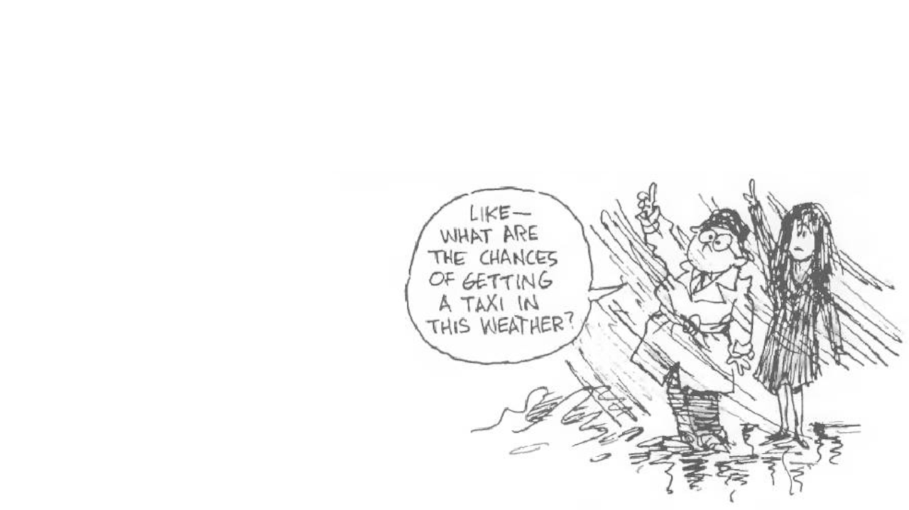
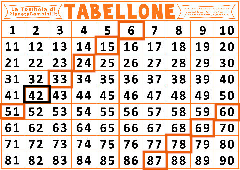
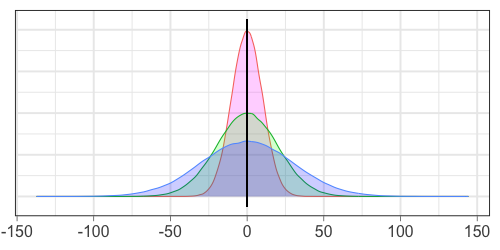

# Introduction to statistics

### (Day 1)

---
## Agenda

- **Where:**
  - Mar 4: AULA GALILEO - MBC
  - Mar 5: AULA DARWIN - MBC
  - Mar 6 : Online

- **When:**
  - 14-17
  - 1 coffee break

- **Who:**
    
    - Paola Dalmasso paola.dalmasso@unito.it
    - Alessia Visconti alessia.visconti@unito.it

- **How (to pass):**
    - Attend at least 2 lessons

---
## How to ask questions/give feedback

- Interrupt me
- Take advantage of start/end/breaks
- Send emails alessia.visconti@unito.it
- Use the shared pad: https://etherpad.wikimedia.org/p/intro_stats_2024_specialita   (or https://t.ly/vRbvy)

---

# Introduction

---
## Why are we here?

---
## &nbsp;

---
## Florence Nightingale

<!-- Florence Nightingale era un'infermiera britannica che e' considerata la madre dell'infermieristica come la intendiamo oggi, un titolo che si e' guadagnato durante la guerra di Crimea, quando era sovrintendente di un ospedale di Instambul. 

Appena arrivata ad Instabul, Florence, si accorge subito delle pessime condizioni di sovraffollameto e pulizia, ma oltre a cercare di mettere una pezza, pulendo e disinfettando tutto con le sue infermiere, si mette anche a raccogliere dati, soprattutto sulle cause di morte dei soldati. -->

---
## Florence Nightingale

<!-- E questi dati non solo li raccoglie, ma li riassume e presenta anche sotto forma di polar diagram, che spedisce regolarmente al governo britannico. 

Come si legge il grafico. Blu = malattie infettive, Rosso = ferite riportate in battaglia, nero = altre cause

E cosa concludiamo? 
Che migliorare le condizioni igenice (pulizia, luce, ventilazione, ...) degli ospedali, aumenta le possibilita' di salvare il paziente. 

E se questo e' ovvio oggi, lo dobbiamo alla sua abilita' nel raccogliere e presentare i dati, e nel prendere delle decisioni basate su di essi. Insomma, grazie alla statistica. -->

---
## What is Statistics?

* The collection, organisation, summarisation, and analysis of data   &nbsp;&nbsp;&nbsp; &rarr; *Descriptive* &nbsp;statistics

* The drawing of inferences about a body of data when only a part of the data is observed   &nbsp;&nbsp;&nbsp; &rarr; *Inferential* &nbsp;statistics

<!-- - Individuare in maniera efficiente i tratti importanti delle informazioni che sono state raccolte

- Partire dal particolare per capire come le informazioni si possono estendere alla totalità -->

---
## What will we learn?

- How to collect data
- How to summarise data
- How to make decision with data

<!-- - Come raccogliere i dati, che andranno scelti oculatamente per far si' che il particolare che ossserviamo si estenda alla totalita' della popolazione

- Come sintetizzarli, utilizzando vari indici, ma anche qualche rappresentazione grafica

- come usare approcci statistici per stimare valori della popolazione, e definire e verificare ipotesi -->

---
## What will we learn?

	
Tomazini, B.M., *et al.*, Effect of dexamethasone on days alive and ventilator-free in patients with moderate or severe acute respiratory distress syndrome and COVID-19: the CoDEX randomized clinical trial.", JAMA, 2020, doi:10.1001/jama.2020.17021

<!-- Andremo per esempio a capire come disegnare un piano di raccolta e analisi dei dati che ci permetta di capire se Nei pazienti con COVID-19 e sindrome da distress respiratorio acuto moderato o grave (ARDS), desametasone è efficace nell’aumentare il numero di giorni di respirazione autonoma? -->

---
## Topics covered

- How to sample from a population
- How to use measure of centrality and dispersion
- How to make estimation from a sample
- How to interpret confidence intervals
- How to make and test hypotheses

<!-- Qui un elenco piu' formale dei topics. Ci saranno anche delle formule matematiche, ma non preoccupatevi: andremo a spiegarle e saranno un aiuto per svolgere gli esercizi e in generale capire cosa stiamo facendo (si', ci sono anche degli esercizi!) -->

---

# Sampling

---
## Learning objectives

- Understand the difference between population and sample
- Understand the difference between sampling strategies
- Understand sampling error and bias

--- 
## Population *vs*  &nbsp;sample

<!-- Popolazione e' l'insieme di tutti gli individui per cui vogliamo studiare un fenomeno, e.g., popolazione italiana

Il modo tradizionale per studiare una popolazione e' il censimento, che pero' ha diversi svantaggi, tra cui il costo

Avveniva ogni 10 anni, ultimo nel 2011 -> dal 2018 permanent census, sotto gruppo della popolazione, quindi quello che chiamiamo un campione statistico 

Altro svantaggio , e b) non e' possibile raccogliere tutte le informazioni possiboli e immaginabili (trauma cranico al nido)
-->

---
## Population *vs*  &nbsp;sample (in the clinic)

<!-- Nella ricerca clinica, la popolazione e' l'insieme di tutti i pazienti che ci interessano

Campione sono quelli che siamo andati a reclutare .

Ovviamente questi campioni devono essere scelti con procedimenti e regole che garantiscano la capacità del campione di rappresentare la popolazione
-->

---
## Opportunity *vs*  &nbsp;random sample

:dart: &nbsp;&nbsp;&nbsp; An **opportunity** sample is the sample drawn from the part of 
&nbsp;&nbsp;&nbsp;&nbsp;&nbsp;&nbsp;&nbsp;&nbsp;&nbsp; the population that is close to hand (and which may not 
&nbsp;&nbsp;&nbsp;&nbsp;&nbsp;&nbsp;&nbsp;&nbsp;&nbsp; represent the whole population)

:pushpin: &nbsp;&nbsp;&nbsp; All the patients presenting to a given clinic in a given period of 
&nbsp;&nbsp;&nbsp;&nbsp;&nbsp;&nbsp;&nbsp;&nbsp;&nbsp; time are enrolled

<!-- Iniziamo con il distinguere il campionamento probabilistico da quello non propabilistico.

Nel campionamento non-probabilistico, o opportunustico, la selezione del campione avviene in base a criteri di comodo o di praticità, per esempio perché certi individui sono più facilmente contattabili, o per ragioni di costo -->

---
## Opportunity *vs*  &nbsp;random sample

:dart: &nbsp;&nbsp;&nbsp; A **random** sample is the sample in which the probability of 
&nbsp;&nbsp;&nbsp;&nbsp;&nbsp;&nbsp;&nbsp;&nbsp;&nbsp; getting any particular sample may be calculated (and which 
&nbsp;&nbsp;&nbsp;&nbsp;&nbsp;&nbsp;&nbsp;&nbsp;&nbsp; should represent the whole population)

:pushpin: &nbsp;&nbsp;&nbsp; A randomly selected set of patients with the disease is enrolled

<!-- Nel campionamento probabilistico ogni unità della popolazione in studio ha una probabilità NOTA di essere estratta (non distorto o viziato) -->

---
## Strategy 1: Simple random sampling

:dart: &nbsp;&nbsp;&nbsp; A sample of size $n$ drawn from a 
&nbsp;&nbsp;&nbsp;&nbsp;&nbsp;&nbsp;&nbsp;&nbsp;&nbsp; population of size $N$ ensuring 
&nbsp;&nbsp;&nbsp;&nbsp;&nbsp;&nbsp;&nbsp;&nbsp;&nbsp; that every possible sample of 
&nbsp;&nbsp;&nbsp;&nbsp;&nbsp;&nbsp;&nbsp;&nbsp;&nbsp; size $n$ is equally likely

<!-- Nel campionamento casuale semplice tutte le unità della popolazione hanno la stessa probabilità di essere estratte:

data una popolazione di N individui ed un campione di dimensione n  la probabilità che l’i-esimo individuo entri nel campione è “n/N” -->

---
## Strategy 1: Simple random sampling

:pushpin: &nbsp;&nbsp;&nbsp;  $N=90$
&nbsp;&nbsp;&nbsp;&nbsp;&nbsp;&nbsp;&nbsp;&nbsp;&nbsp; $n=10$ 

<!-- Disporre di un elenco completo di tutti i soggetti della popolazione e una loro numerazione

Decidere quante unità si vogliono selezionare e calcolare la frazione di campionamento -->

---
## Strategy 1: Simple random sampling

:pushpin: &nbsp;&nbsp;&nbsp;  $N=90$
&nbsp;&nbsp;&nbsp;&nbsp;&nbsp;&nbsp;&nbsp;&nbsp;&nbsp; $n=10$ 

&nbsp;&nbsp;&nbsp;&nbsp;&nbsp;&nbsp;&nbsp;&nbsp;&nbsp; $49, 65, 25, 74, 18$
&nbsp;&nbsp;&nbsp;&nbsp;&nbsp;&nbsp;&nbsp;&nbsp;&nbsp; $90, 47, 24, 71, 37$

<!--  Estrarre le unità tramite sorteggio casuale o tavole dei numeri casuali (costruite in modo da non avere vizi sistematici. Sono delle serie di numeri tra 0 e 9 disposti a caso e caratterizzati dall’avere una distribuzione uniforme) -->

---
## Strategy 2: Systematic Sampling

:pushpin: &nbsp;&nbsp;&nbsp;  $N=90$
&nbsp;&nbsp;&nbsp;&nbsp;&nbsp;&nbsp;&nbsp;&nbsp;&nbsp; $n=10$

&nbsp;&nbsp;&nbsp;&nbsp;&nbsp;&nbsp;&nbsp;&nbsp;&nbsp; $x = 42$ 

&nbsp;&nbsp;&nbsp;&nbsp;&nbsp;&nbsp;&nbsp;&nbsp;&nbsp; $step = N/n = 90/10=9$ 

<!-- Estraggo a caso una prima unita'
Mi calcolo il passo di campionamento, ovvero una distanza costante tra gli individui estratti  -->

---
## Strategy 2: Systematic Sampling

:pushpin: &nbsp;&nbsp;&nbsp;  $N=90$
&nbsp;&nbsp;&nbsp;&nbsp;&nbsp;&nbsp;&nbsp;&nbsp;&nbsp; $n=10$

&nbsp;&nbsp;&nbsp;&nbsp;&nbsp;&nbsp;&nbsp;&nbsp;&nbsp; $x = 42$ 

&nbsp;&nbsp;&nbsp;&nbsp;&nbsp;&nbsp;&nbsp;&nbsp;&nbsp; $step = N/n = 90/10=9$ 

<!--  dopo la prima estrazione casuale si estrae una unità ogni N/n-->

---
## Strategy 3: Stratified Random Sampling

:dart: &nbsp;&nbsp;&nbsp; The population is divided into homogenous group (strata) and 
&nbsp;&nbsp;&nbsp;&nbsp;&nbsp;&nbsp;&nbsp;&nbsp;&nbsp; a simple random sample is drawn from each stratum

&nbsp;&nbsp;&nbsp;&nbsp;&nbsp;&nbsp;&nbsp;&nbsp;&nbsp; Variation #1: stratified systematic sample 
&nbsp;&nbsp;&nbsp;&nbsp;&nbsp;&nbsp;&nbsp;&nbsp;&nbsp; Variation #2: stratified sampling proportional to size

---
## Strategy 3: Stratified Random Sampling

:pushpin: &nbsp;&nbsp;&nbsp;  $N=90$
&nbsp;&nbsp;&nbsp;&nbsp;&nbsp;&nbsp;&nbsp;&nbsp;&nbsp; $N_{female}=60$
&nbsp;&nbsp;&nbsp;&nbsp;&nbsp;&nbsp;&nbsp;&nbsp;&nbsp; $N_{male}=30$

&nbsp;&nbsp;&nbsp;&nbsp;&nbsp;&nbsp;&nbsp;&nbsp;&nbsp; $n=9$ 
&nbsp;&nbsp;&nbsp;&nbsp;&nbsp;&nbsp;&nbsp;&nbsp;&nbsp; $n_{female} = 6$
&nbsp;&nbsp;&nbsp;&nbsp;&nbsp;&nbsp;&nbsp;&nbsp;&nbsp; $n_{male} = 3$

&nbsp;&nbsp;&nbsp;&nbsp;&nbsp;&nbsp;&nbsp;&nbsp;&nbsp; $Females: 46, 20, 26,$
&nbsp;&nbsp;&nbsp;&nbsp;&nbsp;&nbsp;&nbsp;&nbsp;&nbsp;&nbsp;&nbsp;&nbsp;&nbsp;&nbsp;&nbsp;&nbsp;&nbsp;&nbsp;&nbsp;&nbsp;&nbsp;&nbsp;&nbsp;&nbsp;&nbsp;&nbsp;&nbsp;&nbsp;&nbsp;&nbsp;&nbsp;&nbsp;&nbsp; $50, 47,  3$
&nbsp;&nbsp;&nbsp;&nbsp;&nbsp;&nbsp;&nbsp;&nbsp;&nbsp;&nbsp;&nbsp;&nbsp;&nbsp;&nbsp; $Males: 69, 85, 87$

<!-- Esempi di strata : sesso, eta', condizione sociale -->

---
## Strategy 4: Cluster sampling

:dart: &nbsp;&nbsp;&nbsp; The population is divided into clusters, and a simple random 
&nbsp;&nbsp;&nbsp;&nbsp;&nbsp;&nbsp;&nbsp;&nbsp;&nbsp; sample is drawn
 
&nbsp;&nbsp;&nbsp;&nbsp;&nbsp;&nbsp;&nbsp;&nbsp;&nbsp; Variation: one stage (observing everything) *vs* 
&nbsp;&nbsp;&nbsp;&nbsp;&nbsp;&nbsp;&nbsp;&nbsp;&nbsp;&nbsp;&nbsp;&nbsp;&nbsp;&nbsp;&nbsp;&nbsp;&nbsp;&nbsp;&nbsp;&nbsp;&nbsp;&nbsp;&nbsp;&nbsp;&nbsp;&nbsp;&nbsp;&nbsp;&nbsp;&nbsp;&nbsp; two stage (sampling within clusters)

<!-- Le unità della popolazione sono suddivise in CLUSTER o GRAPPOLI in base a circostanze organizzative, strutturali, geografiche.
All’interno dei cluster le unità possono essere molto diverse tra di loro.

Il campione si forma estraendo casualmente un numero prestabilito di cluster, dopodichè si possono includere tutte le unità che appartengono al cluster (1 stadio) o solo una parte (2 stadi, usano campionamento semplice o stratificato)
 -->

---
## Strategy 4: Cluster sampling

--- 
## Sampling in the wild

https://hbsc.org

<!--  Health beavious in school aged children 
Studio internazionale che si tiene ogni 4 anni e che raccoglie informazioni sui ragazzi di 11, 13, 15 e, recentemente anche 17 anni (che sono la mia popolazione) 
Ma non li raccoglie tutti, ne raccoglie un campione.

Innanzitutto li devo dividere per regioni (stratificato), poi vado a identifcare le scuole (cluster)
All'interno delle scuole vado a fare un ulteriore strato per grado/eta' e poi prpcedo con un sistematic sampling all'interno di ciascuno strato per identiicare le classi (di cui scelgo TUTTI gli studenti della classe)

Countries may choose to stratify their samples to ensure representation by, for example, geographic location,
ethnic group or school type.
-->

---
### Exercise #1

:question: &nbsp;&nbsp;&nbsp; A representative of a cheese factory is asking questions 
&nbsp;&nbsp;&nbsp;&nbsp;&nbsp;&nbsp;&nbsp;&nbsp;&nbsp;  on cheese consumption to every 5th customer entering
&nbsp;&nbsp;&nbsp;&nbsp;&nbsp;&nbsp;&nbsp;&nbsp;&nbsp;  the supermarket

&nbsp;&nbsp;&nbsp;&nbsp;&nbsp;&nbsp;&nbsp;&nbsp;&nbsp; Which kind of sampling strategy are they using?

&nbsp;&nbsp;&nbsp;&nbsp;&nbsp;&nbsp;&nbsp;&nbsp;&nbsp; a) simple random sampling
&nbsp;&nbsp;&nbsp;&nbsp;&nbsp;&nbsp;&nbsp;&nbsp;&nbsp; b) systematic sampling
&nbsp;&nbsp;&nbsp;&nbsp;&nbsp;&nbsp;&nbsp;&nbsp;&nbsp; c) stratified sampling
&nbsp;&nbsp;&nbsp;&nbsp;&nbsp;&nbsp;&nbsp;&nbsp;&nbsp; d) none of the above 

---
### Exercise #1 -- Solution

:question: &nbsp;&nbsp;&nbsp; A representative of a cheese factory is asking questions 
&nbsp;&nbsp;&nbsp;&nbsp;&nbsp;&nbsp;&nbsp;&nbsp;&nbsp;  on cheese consumption to every 5th customer entering
&nbsp;&nbsp;&nbsp;&nbsp;&nbsp;&nbsp;&nbsp;&nbsp;&nbsp;  the supermarket

&nbsp;&nbsp;&nbsp;&nbsp;&nbsp;&nbsp;&nbsp;&nbsp;&nbsp; Which kind of sampling strategy are they using?

&nbsp;&nbsp;&nbsp;&nbsp;&nbsp;&nbsp;&nbsp;&nbsp;&nbsp; a) simple random sampling
&nbsp;&nbsp;&nbsp;&nbsp;&nbsp;&nbsp;&nbsp;&nbsp;&nbsp; b) systematic sampling
&nbsp;&nbsp;&nbsp;&nbsp;&nbsp;&nbsp;&nbsp;&nbsp;&nbsp; c) stratified sampling
&nbsp;&nbsp;&nbsp;&nbsp;&nbsp;&nbsp;&nbsp;&nbsp;&nbsp; d) none of the above :white_check_mark: 

---
## Selection bias

* Survivor bias
* Volunteer bias
* Lost to follow up bias
* $\dots$

<!-- Anche se facciamo attenzione i nostri sample possono avere delle distorsioni

- voglio andare a vedere dove gli aerei da guerra vengono colpiti per rinforzarli
- - volontari alsop SES e soprattuto donne
- sto testando un nuovo farmaco, le persone che hanno i side effect peggiori possono interromperlo, o quelli per cui non funziona possono morire -->

---
## Selection bias in the wild

<!-- Persino in un campione di 0.5M di persone come la UKBB, si osserva che non rispondere o rispondere non lo so a questionari (109 domande, in questo studio) non e' casuale e dipende da foattori genetici e ambientali -->

---
### Exercise #2

:question: &nbsp;&nbsp;&nbsp; Researchers send pensioners a snail mail to ask about their 
&nbsp;&nbsp;&nbsp;&nbsp;&nbsp;&nbsp;&nbsp;&nbsp;&nbsp;  mental health  after the COVID-19 lockdown. Pensioners are  
&nbsp;&nbsp;&nbsp;&nbsp;&nbsp;&nbsp;&nbsp;&nbsp;&nbsp;  then asked to post their  answer back

&nbsp;&nbsp;&nbsp;&nbsp;&nbsp;&nbsp;&nbsp;&nbsp;&nbsp; Will their study suffer any bias?

&nbsp;&nbsp;&nbsp;&nbsp;&nbsp;&nbsp;&nbsp;&nbsp;&nbsp; a) No
&nbsp;&nbsp;&nbsp;&nbsp;&nbsp;&nbsp;&nbsp;&nbsp;&nbsp; b) Yes, volunteer bias
&nbsp;&nbsp;&nbsp;&nbsp;&nbsp;&nbsp;&nbsp;&nbsp;&nbsp; c) Yes, survivor bias
&nbsp;&nbsp;&nbsp;&nbsp;&nbsp;&nbsp;&nbsp;&nbsp;&nbsp; d) Both b) and c)

---
### Exercise #2 -- Solution

:question: &nbsp;&nbsp;&nbsp; Researchers send pensioners a snail mail to ask about their 
&nbsp;&nbsp;&nbsp;&nbsp;&nbsp;&nbsp;&nbsp;&nbsp;&nbsp;  mental health  after the COVID-19 lockdown. Pensioners are  
&nbsp;&nbsp;&nbsp;&nbsp;&nbsp;&nbsp;&nbsp;&nbsp;&nbsp;  then asked to post their  answer back

&nbsp;&nbsp;&nbsp;&nbsp;&nbsp;&nbsp;&nbsp;&nbsp;&nbsp; Will their study suffer any bias?

&nbsp;&nbsp;&nbsp;&nbsp;&nbsp;&nbsp;&nbsp;&nbsp;&nbsp; a) No
&nbsp;&nbsp;&nbsp;&nbsp;&nbsp;&nbsp;&nbsp;&nbsp;&nbsp; b) Yes, volunteer bias
&nbsp;&nbsp;&nbsp;&nbsp;&nbsp;&nbsp;&nbsp;&nbsp;&nbsp; c) Yes, survivor bias
&nbsp;&nbsp;&nbsp;&nbsp;&nbsp;&nbsp;&nbsp;&nbsp;&nbsp; d) Both b) and c) :white_check_mark: 

---

## Summary

- When can't study a population, we select a representative sample
- There are different sampling strategies
- Samples may suffer from biases

---

# Summarise data

---
## Learning objectives

- Understand the differences between data types
- Be able to summarise each data type using measure of centrality and dispersion
- Understand the difference between parameters and statistics
- Understand why visualise your data is important

---
# Type of data

<!-- Andiamo a dividere i dati in variabili quantitative (o numeriche) o qualitative (o categorighe) 

Numeriche: 
- continue (altezza, peso, BMI, temperatura corporea)
- discrete (numero di pazienti ammessi in PS)

Categoriche si dividono in 2 classi
- Nominali (categorie che non possono essere ordinate) -> due categorie binarie (diabete si/no), piu' categorie (gruppo sanguigno)
- Ordinali (categorie che non possono essere ordinate) -> dati che rappresentano categorie ordinate (giudizi scolastici ("Insufficiente", "Sufficiente", "Buono", "Ottimo:"), "Sottopeso", "Normopeso" ...) -->

---
### Exercise #3

:question: &nbsp;&nbsp;&nbsp; Which types of data are 
&nbsp;&nbsp;&nbsp;&nbsp;&nbsp;&nbsp;&nbsp;&nbsp;&nbsp; included in this table?

	
Visconti A., *et al.*, Total serum *N*‐glycans associate with response to immune checkpoint inhibition therapy and survival in patients with advanced melanoma, BMC Cancer, 2023 doi:10.1186/s12885-023-10511-3

<!-- Sesso: Binaria
Eta'/BMI: continua
BRAF: binaria
Metastatic stage: Ordinale
ECOG score: ordinale (o fully active  5 morto, 4 completamente disabile, 3 capable of only limited selfcare)
ICI teraphy: categorico (con piu' categorie) 
N: discreto

Lactate dehydrogenase, dichotomized according to the upper limit of normal for each centre.
-->

--- 
## Why do  we care?

	
Visconti A., *et al.*, Total serum *N*‐glycans associate with response to immune checkpoint inhibition therapy and survival in patients with advanced melanoma, BMC Cancer, 2023 doi:10.1186/s12885-023-10511-3

<!-- Perche' il modo in cui andiamo prima a presentare e poi ad analizzare una variabile dipende dal suop tipo.

Numeriche media/SD, categoriche N/% -->

---
## Measures of centrality and dispersion

<!--  E cosa sono poi queste media, SD? Sono due delle proprieta' che descrivono i dati

Tendenza centrale (o posizione) -> Individuano il valore intorno al quale i dati sono raggruppati

Dispersione o variabilita'  -> Forniscono un’indicazione della dispersione delle osservazioni intorno al valore centrale -->

---
## Measure of centrality: mode

:dart: &nbsp;&nbsp;&nbsp; The most frequent item

:pushpin: &nbsp;&nbsp;&nbsp; $x= \{1, 1, 1, 3, 4, 4, 7, 8, 8, 9, 9\}$
&nbsp;&nbsp;&nbsp;&nbsp;&nbsp;&nbsp;&nbsp;&nbsp;&nbsp; $\text{mode}(x)=1$

&nbsp;&nbsp;&nbsp;&nbsp;&nbsp;&nbsp;&nbsp;&nbsp;&nbsp;  $x= \{1, 1, 1, 3, 4, 4, 4, 7, 8, 8, 9, 9\}$
&nbsp;&nbsp;&nbsp;&nbsp;&nbsp;&nbsp;&nbsp;&nbsp;&nbsp; $\text{mode}(x)=1 \land   4$

<!-- se ciascun valore si presenta una volta sola, le nostre osservazioni non hanno moda

Si usa soprattutto per i dati categorici -->

---
## Measure of centrality: median

:dart: &nbsp;&nbsp;&nbsp;The "middle" value

:warning: Data should be sorted!

<!-- Divide l'insieme di dati in due parti uguali, con il numero osservazioni <= mediana uguale a quello >= -->

---
## Measure of centrality: median

:dart: &nbsp;&nbsp;&nbsp;The "middle" value

:pushpin: &nbsp;&nbsp;&nbsp;  $n=7,  x= \{1, 3, 3, 6, 7, 8, 9\}$ 

&nbsp;&nbsp;&nbsp;&nbsp;&nbsp;&nbsp;&nbsp;&nbsp;&nbsp; $\text{median}(x)=x_{(n+1)/2} = x_{(7+1)/2}=x_4=6$ 

:pushpin: &nbsp;&nbsp;&nbsp;  $n=8,  x= \{1, 2, 3, 4, 5, 6, 8, 9\}$

&nbsp;&nbsp;&nbsp;&nbsp;&nbsp;&nbsp;&nbsp;&nbsp;&nbsp; $\text{median}(x)={\frac {x_{(n/2)}+x_{((n/2)+1)}}{2}} = {\frac {x_{(8/2)}+x_{((8/2)+1)}}{2}}$
&nbsp;&nbsp;&nbsp;&nbsp;&nbsp;&nbsp;&nbsp;&nbsp;&nbsp;&nbsp;&nbsp;&nbsp;&nbsp;&nbsp;&nbsp;&nbsp;&nbsp;&nbsp;&nbsp;&nbsp;&nbsp;&nbsp;&nbsp;&nbsp;&nbsp;&nbsp;&nbsp;&nbsp;&nbsp;&nbsp;&nbsp;&nbsp;&nbsp; $={\frac {x_{4}+x_{5}}{2}} = {\frac {4+5}{2}} = 4.5$ 

:warning: Data should be sorted!

<!-- Quando il numero di osservazioni e' pari, ci sono due valori mediani, e in questo caso si prende la loro media aritmetica -->

---
## Measure of centrality: median

:dart: &nbsp;&nbsp;&nbsp; Robust to outliers

:pushpin: &nbsp;&nbsp;&nbsp;  $n=7,  x= \{1, 3, 3, 6, 7, 8, 9\}$ 

&nbsp;&nbsp;&nbsp;&nbsp;&nbsp;&nbsp;&nbsp;&nbsp;&nbsp; $\text{median}(x)=x_{(n+1)/2} = x_{(7+1)/2}=x_4=6$ 

:pushpin: &nbsp;&nbsp;&nbsp;  $n=7,  x= \{1, 3, 3, 6, 7, 8, 109\}$ 

&nbsp;&nbsp;&nbsp;&nbsp;&nbsp;&nbsp;&nbsp;&nbsp;&nbsp; $\text{median}(x)=x_{(n+1)/2} = x_{(7+1)/2}=x_4=6$ 

:warning: Data should be sorted!

<!-- La mediana non e' influenzata da valori anomali o estremi (outliers) -->

---
## Quartiles

<!-- Mentre la mediana divide i dati in due meta' esatte, molto usati sono anche i quartili, che dividono i dati in 4 parti uguali -->

:warning: Data should be sorted!

---
## Percentiles

<!-- Il percentile invece divide i dati in 100 intervalli, e dato una percentile, per esempio il decimo, sappiamo che il 10% dei valori assunti dalla variabile sono inferiori o uguali a quel valore -->

---
## Measure of centrality: mean

:dart: &nbsp;&nbsp;&nbsp; Arithmetic mean

$$
{\bar {x}}= {\frac {1}{n}}\left(\sum _{i=1}^{n}{x_{i}}\right)=
{\frac {x_{1}+x_{2}+\dots +x_{n}}{n}}
$$

:pushpin: &nbsp;&nbsp;&nbsp;  $x= \{4, 36, 45, 50, 75\}$ 

&nbsp;&nbsp;&nbsp;&nbsp;&nbsp;&nbsp;&nbsp;&nbsp;&nbsp; ${\bar {x}} = {\frac{1}{n}}\left(\sum _{i=1}^{n}{x_{i}}\right) = \frac{4 + 36 + 45 + 50 + 75}{5} = 42$

<!-- Somma dei singoli valori diviso il numero di osservazioni  -->

---
## Measure of centrality: mean

:dart: &nbsp;&nbsp;&nbsp; Not really robust to outliers

:pushpin: &nbsp;&nbsp;&nbsp;  $x= \{4, 36, 45, 50, 175\}$ 

&nbsp;&nbsp;&nbsp;&nbsp;&nbsp;&nbsp;&nbsp;&nbsp;&nbsp; ${\bar {x}} = {\frac {1}{n}}\left(\sum _{i=1}^{n}{x_{i}}\right) = \frac{4 + 36 + 45 + 50 + 175}{5} = 62$

<!-- Mentre la media e' la misura piu' usata per descrivere la tendenza centrale per la sua unicita' (c'e' solo una media) e semplicita', non e' particolarmente robusta rispetto agli outliers. Il valore atipico SOVRADIMENSIONA la media.

Vedremo piu' avanti, con le misure di dispersione, come accopagnare altri valori alla media per evidenziare queste situazioni  -->

---
## Mode *vs* &nbsp;median *vs* &nbsp;mean

<!-- La moda e' la parte piu' alta della curva, la mediana divide l'area in 2 parti uguali e la media e' il "balance point", quello in cui starebbe in equilibrio se fosse fatta di un materiale solido -->

---
## The shape of a distribution

<!-- Asimmetrica a destra/sinistra -->

---
## Measures of dispersion

---
## Measures of dispersion

---
## Measure of dispersion: range

:dart: &nbsp;&nbsp;&nbsp; ${\text{range}(x)}= \text{max}(x)-\text{min}(x)$

:pushpin: &nbsp;&nbsp;&nbsp;  $x= \{6, 7, 15, 36, 39, 40, 41, 42, 43, 47, 49\}$ 

&nbsp;&nbsp;&nbsp;&nbsp;&nbsp;&nbsp;&nbsp;&nbsp;&nbsp; ${\text{range}(x)}= \text{max}(x)-\text{min}(x)=49-6=43$

<!-- INTERVALLO di VARIAZIONE. Il range pero' si basa solo sui due valori estremi, senza indicare come si distribuiscono i dati entro l’intervallo -->

---
## Measure of dispersion: range

:question: &nbsp;&nbsp;&nbsp; $\text{range}(x)= \text{ ?}$

<!-- Il range ha tuttavia un'utilita' limitata: tiene conto solo di due valori, e non e' robusta quando ci sono valori anomali

14 osservazioni -->

---
## Measure of dispersion: range

:question: &nbsp;&nbsp;&nbsp; $\text{range}(x)= \text{max}(x)-\text{min}(x)=9,754-2,830=6,924$

<!-- Il range ha tuttavia un'utilita' limitata: tiene conto solo di due valori, e non e' robusta quando ci sono valori anomali -->

---
## Measure of dispersion: interquartile range

:dart: &nbsp;&nbsp;&nbsp; ${\text{IQR}(x)}= \text{Q3}(x)-\text{Q1}(x)$

---
## Measure of dispersion: interquartile range

:pushpin: &nbsp;&nbsp;&nbsp; $\text{range}(x) = \text{max}(x)-\text{min}(x)=9,754-2,830=6,924$
:pushpin: &nbsp;&nbsp;&nbsp; $\text{IQR}(x) \text{ }\text{ } = \text{Q3}(x)-\text{Q1}(x) \text{ }\text{ }\text{ }\text{ } =5,253-3,423=1,830$

<!-- Non sono considerati i valori estremi, ma sappiamo come si distribuisce la meta dei dati rispetto al valore centrale -->

---
## Measure of dispersion: variance

<!-- Misura la distanza media tra le osservazioni e la media del campione. Piu' bassa e' la varianza, piu' le osservazioni saranno vicine alla media  -->

---
## Measure of dispersion: variance

:dart: &nbsp;&nbsp;&nbsp; $s^2 = \frac{1}{n-1}\sum _{i=1}^{n}(x_{i}-\bar {x} )^{2}$

&nbsp;&nbsp;&nbsp;&nbsp;&nbsp;&nbsp;&nbsp;&nbsp;&nbsp; where &nbsp;&nbsp;&nbsp; ${\bar {x}}= {\frac {1}{n}}\left(\sum _{i=1}^{n}{x_{i}}\right)$ 

:pushpin: &nbsp;&nbsp;&nbsp;  $x= \{1, 2, 3\}$ &nbsp;&nbsp;&nbsp; $\bar{x}=\frac{1+2+3}{3}=2$

&nbsp;&nbsp;&nbsp;&nbsp;&nbsp;&nbsp;&nbsp;&nbsp;&nbsp; $s = \frac{1}{3-1}\times [(1-2)^2+ (2-2)^2+(3-2)^2] =$
&nbsp;&nbsp;&nbsp;&nbsp;&nbsp;&nbsp;&nbsp;&nbsp;&nbsp;&nbsp;&nbsp;&nbsp;&nbsp; $= \frac{1}{2}\times [1^2+ 0^2+1^2 ]=  \frac{1}{2}\times 2 = 1$

<!-- Andiamo a fare la distanza (differenza) tra ciascun valore e la media, la eleviamo al quatrato, la sommiamo e andiamo a dividerla per la dimensione del campione - 1 -->

---
## Measure of dispersion: variance

:dart: &nbsp;&nbsp;&nbsp; $s^2 = \frac{1}{n-1}\sum _{i=1}^{n}(x_{i}-\bar {x} )^{2}$

&nbsp;&nbsp;&nbsp;&nbsp;&nbsp;&nbsp;&nbsp;&nbsp;&nbsp; why &nbsp; $\frac{1}{n-1}$ &nbsp; ?  &nbsp;&nbsp;&nbsp;&nbsp;&nbsp;&nbsp;&nbsp;&nbsp;&nbsp;&nbsp;&nbsp;&nbsp; $\rightarrow$ &nbsp;&nbsp;&nbsp;&nbsp;&nbsp;&nbsp;&nbsp;&nbsp;&nbsp;&nbsp;&nbsp;&nbsp; $\sum _{i=1}^{n}(x_{i}-\bar {x} ) = 0$

:pushpin: &nbsp;&nbsp;&nbsp;  $x= \{1, 2, 3\}$ &nbsp;&nbsp;&nbsp; $\bar{x}=\frac{1+2+3}{3}=2$

&nbsp;&nbsp;&nbsp;&nbsp;&nbsp;&nbsp;&nbsp;&nbsp;&nbsp; $\sum _{i=1}^{n}(x_{i}-\bar {x} ) = (1-2) + (2-2) + (3-2) =$
&nbsp;&nbsp;&nbsp;&nbsp;&nbsp;&nbsp;&nbsp;&nbsp;&nbsp;&nbsp;&nbsp;&nbsp;&nbsp;&nbsp;&nbsp;&nbsp;&nbsp;&nbsp;&nbsp;&nbsp;&nbsp;&nbsp;&nbsp;&nbsp;&nbsp;&nbsp;&nbsp;&nbsp;&nbsp;&nbsp;&nbsp;&nbsp;&nbsp;&nbsp;&nbsp;&nbsp;&nbsp;&nbsp;&nbsp; $= -1 + 0 + 1 = 0$

<!-- Perche' si divide per (n-1) e non n, come ci aspetteremmo? 

Dipende dal fatto che La somma degli scarti dalla media aritmetica è nulla
Qundi se conosco i primi (n-1) valori, conosco anche l'ultimo

n-1 rappresenta quindi i gradi di liberta', il cui numero e' uguale al nuerio di dati (n) meno il numero di costanti gia' calcolate dai dati (in questo caso 1, la media) -->

---
## Measure of dispersion: standard deviation

:dart: &nbsp;&nbsp;&nbsp; $s = \sqrt{s^2} = \sqrt {{\frac {1}{n-1}}\sum _{i=1}^{n}(x_{i}-\bar {x} )^{2}}$

&nbsp;&nbsp;&nbsp;&nbsp;&nbsp;&nbsp;&nbsp;&nbsp;&nbsp; where &nbsp;&nbsp;&nbsp; ${\bar {x}}= {\frac {1}{n}}\left(\sum _{i=1}^{n}{x_{i}}\right)$ 

:pushpin: &nbsp;&nbsp;&nbsp;  $x= \{1, 2, 3\}$ &nbsp;&nbsp;&nbsp; $\bar{x}=\frac{1+2+3}{3}=2$

&nbsp;&nbsp;&nbsp;&nbsp;&nbsp;&nbsp;&nbsp;&nbsp;&nbsp; $s = \sqrt {\frac{1}{3-1}\times [(1-2)^2+ (2-2)^2+(3-2)^2] }=$
&nbsp;&nbsp;&nbsp;&nbsp;&nbsp;&nbsp;&nbsp;&nbsp;&nbsp;&nbsp;&nbsp;&nbsp;&nbsp; $= \sqrt {\frac{1}{2}\times [1^2+ 0^2+1^2 }]= \sqrt {\frac{1}{2}\times 2}= \sqrt {1} = 1$

<!-- che nella varianza l'unità di misura è diversa da quella della variabile su cui è calcolata (abbiamo fatto il quadrato delle fifferenze, ricordate?), si utilizza la sua radice quadrata detta SCARTO QUADRATICO MEDIO o deviazione standard. -->

---
## Centrality, dispersion, and data types

| Data type | Centrality Measure | Dispersion Measure |
| ---- | ----- | ---- |
| Nominal | Mode | - |
| Ordinal | Mode, Median | Range, IQR |
| Numeric | Mode, Median, Mean | Range, IQR, standard deviation |

---
## Parameters *vs*  &nbsp;statistics

- Parameters: calculated on the population ($\mu, \sigma$)

- Statistics: calculated on the sample ($\bar{x}, s$)

<!-- Una cosa che non vi ho detto, ma che ci tornera' utile in seguito e' che la media e la SD di una popolazione si chiamano PARAMETRI e si indicano con le lettere greche media e SD misurati su un campione si chiamano invece STATISTICHE e sono indicati con lettere latine -->

---
### Exercise #4

:question: &nbsp;&nbsp;&nbsp; Which curve has the larger 
&nbsp;&nbsp;&nbsp;&nbsp;&nbsp;&nbsp;&nbsp;&nbsp;&nbsp; mean?

&nbsp;&nbsp;&nbsp;&nbsp;&nbsp;&nbsp;&nbsp;&nbsp;&nbsp; a) blue
&nbsp;&nbsp;&nbsp;&nbsp;&nbsp;&nbsp;&nbsp;&nbsp;&nbsp; b) green
&nbsp;&nbsp;&nbsp;&nbsp;&nbsp;&nbsp;&nbsp;&nbsp;&nbsp; c) red

---
### Exercise #4 -- Solution

:question: &nbsp;&nbsp;&nbsp; Which curve has the larger 
&nbsp;&nbsp;&nbsp;&nbsp;&nbsp;&nbsp;&nbsp;&nbsp;&nbsp; mean?

&nbsp;&nbsp;&nbsp;&nbsp;&nbsp;&nbsp;&nbsp;&nbsp;&nbsp; a) blue
&nbsp;&nbsp;&nbsp;&nbsp;&nbsp;&nbsp;&nbsp;&nbsp;&nbsp; b) green
&nbsp;&nbsp;&nbsp;&nbsp;&nbsp;&nbsp;&nbsp;&nbsp;&nbsp; c) red :white_check_mark: 

---
### Exercise #5

:question: &nbsp;&nbsp;&nbsp; Which curve has the larger 
&nbsp;&nbsp;&nbsp;&nbsp;&nbsp;&nbsp;&nbsp;&nbsp;&nbsp; standard deviation?

&nbsp;&nbsp;&nbsp;&nbsp;&nbsp;&nbsp;&nbsp;&nbsp;&nbsp; a) blue
&nbsp;&nbsp;&nbsp;&nbsp;&nbsp;&nbsp;&nbsp;&nbsp;&nbsp; b) green
&nbsp;&nbsp;&nbsp;&nbsp;&nbsp;&nbsp;&nbsp;&nbsp;&nbsp; c) red

---
### Exercise #5 -- Solution

:question: &nbsp;&nbsp;&nbsp; Which curve has the larger 
&nbsp;&nbsp;&nbsp;&nbsp;&nbsp;&nbsp;&nbsp;&nbsp;&nbsp; standard deviation?

&nbsp;&nbsp;&nbsp;&nbsp;&nbsp;&nbsp;&nbsp;&nbsp;&nbsp; a) blue
&nbsp;&nbsp;&nbsp;&nbsp;&nbsp;&nbsp;&nbsp;&nbsp;&nbsp; b) green
&nbsp;&nbsp;&nbsp;&nbsp;&nbsp;&nbsp;&nbsp;&nbsp;&nbsp; c) red  :white_check_mark: 

---
### Exercise #6

:question: &nbsp;&nbsp;&nbsp; Researchers have collected age, sex, and cholesterol
&nbsp;&nbsp;&nbsp;&nbsp;&nbsp;&nbsp;&nbsp;&nbsp;&nbsp; How should they summarise their data?

&nbsp;&nbsp;&nbsp;&nbsp;&nbsp;&nbsp;&nbsp;&nbsp;&nbsp; a) Age: mean (SD), sex: N (%), cholesterol: mean (SD)
&nbsp;&nbsp;&nbsp;&nbsp;&nbsp;&nbsp;&nbsp;&nbsp;&nbsp; b) Age: median (IQR), sex: N (%), cholesterol: median (IQR)
&nbsp;&nbsp;&nbsp;&nbsp;&nbsp;&nbsp;&nbsp;&nbsp;&nbsp; c) Age: mean (SD), sex: mean (SD), cholesterol: mean (SD) 
&nbsp;&nbsp;&nbsp;&nbsp;&nbsp;&nbsp;&nbsp;&nbsp;&nbsp; d) Either a) or b)
&nbsp;&nbsp;&nbsp;&nbsp;&nbsp;&nbsp;&nbsp;&nbsp;&nbsp; e) Either a) or c)

---
### Exercise #6 -- Solution

:question: &nbsp;&nbsp;&nbsp; Researchers have collected age, sex, and cholesterol
&nbsp;&nbsp;&nbsp;&nbsp;&nbsp;&nbsp;&nbsp;&nbsp;&nbsp; How should they summarise their data?

&nbsp;&nbsp;&nbsp;&nbsp;&nbsp;&nbsp;&nbsp;&nbsp;&nbsp; a) Age: mean (SD), sex: N (%), cholesterol: mean (SD)
&nbsp;&nbsp;&nbsp;&nbsp;&nbsp;&nbsp;&nbsp;&nbsp;&nbsp; b) Age: median (IQR), sex: N (%), cholesterol: median (IQR)
&nbsp;&nbsp;&nbsp;&nbsp;&nbsp;&nbsp;&nbsp;&nbsp;&nbsp; c) Age: mean (SD), sex: mean (SD), cholesterol: mean (SD) 
&nbsp;&nbsp;&nbsp;&nbsp;&nbsp;&nbsp;&nbsp;&nbsp;&nbsp; d) Either a) or b) :white_check_mark: 
&nbsp;&nbsp;&nbsp;&nbsp;&nbsp;&nbsp;&nbsp;&nbsp;&nbsp; e) Either a) or c)

---
## Data visualisation: boxplots

<!-- boxplot consente di rappresentare visivamente alcune caratteristiche di una distribuzione statistica: 

- il grado di dispersione dei dati (via IQR)
-  la misura di tendenza centrale (via mediana)
- la forma della distribuzione (con i "baffi")
- la presenza di valori anomali -->

---
## Boxplots in the wild

Visconti A., *et al.*, Total serum *N*‐glycans associate with response to immune checkpoint inhibition therapy and survival in patients with advanced melanoma, BMC Cancer, 2023 doi:10.1186/s12885-023-10511-3

<!-- 50% dei dati sta tra -0.6 e 1, la mediana e' circa 0.3, il baffo ci dice che e' assimmetrica a dx, non ci sono outliers

conrontare due distribuzioni, simile IQR, ma diverse mediane

Mediana, quartili (ma anche percentili) si dicono misure di posizionamento perche' ci fanno "posizionare" i dati -->

---
## Data visualisation: DataSaurus Dozen

---

## Summary

- Data come in different types
- Data are described with measures of centrality and dispersion
- Visualising your data is always a good idea

---

# See you tomorrow
