

# Introduction to statistics

### (Day 1)

---
## Housekeeping

- **Who:**
    
    - Paola Dalmasso paola.dalmasso@unito.it
    - Alessia Visconti alessia.visconti@unito.it

- **Exam:**
    - Multiple-choice questions  (*via* Moodle)

---
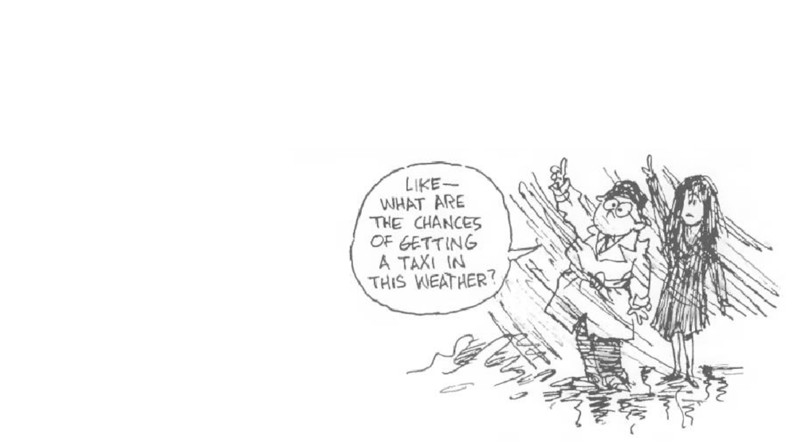

# Introduction

---
## Why are we here?

---
## Would you buy this mouthwash?

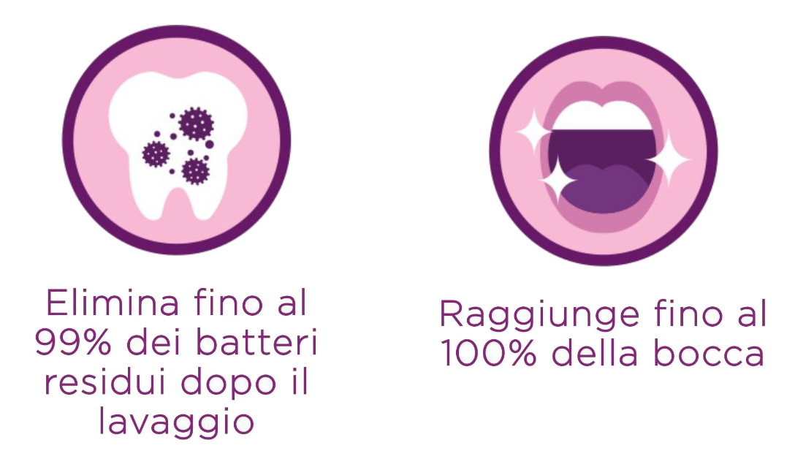

<!-- CHIEDERE SEMPRE Perch&eacute; RISPONDONO COSI'

Cosa vuol dire "fino al"? Se eliminasse il 10% dei batteri e raggiungesse il 20% della bocca, questo annuncio sarebbe ancora vero, o lo dobbiamo segnalare per pubblicita' ingannevole? Unico modo per renderlo falso e' che elimini tutti batteri e raggiunga piu' di tutta la bocca (due condizioni abbastanza improbabili, nel primo caso, o impossibili, nel secondo) -->

---
## Storks and babies

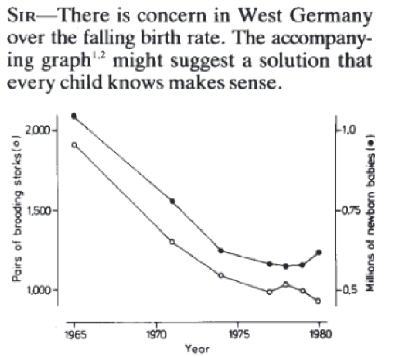

  Sies, H., *A new parameter for sex education*. Nature, 1988, doi:10.1038/332495a0

<!-- 
DESCRIVERE BENE IL GRAFICO.

Qual e' lo scopo di questo grafico? Convincerci che c'e' una relazione tra questi due valori

Artefatto dovuto alla doppia scala, vado a trasformare le due distribuzioni empiriche (ovvero la collezione di valori raccolti) in modo che "sembrino" di avere lo stesso andamento. C'e' un sito che ne raccoglie centinaia di questi esempi
-->

---
## Milk and tumours

- English women, who consume large quantities of milk, develop some types of tumours 18 times more frequently than Japanese women, who rarely drink it
* Tumours usually appear late in life.
* British women live, on average, 12 years longer than Japanese women

  Huff, D., *How to lie with statistics*. W. W. Norton & Company, 1954

<!-- Chiedere cosa ne pensano mano a mano che aggiungo informazione.

Quello che viene fatto qui e' un post-hoc fallacy. (in latino: Post hoc ergo propter hoc, Dopo di ci`o, quindi a causa di ci`o) `e un’argomentazione apparentemente valida ma fondata su un errore logico in cui si crede che, perch ́e l’evento Y accade dopo l’evento X, allora X debba aver causato Y . L’errore logico consiste nel concludere che ci sia un nesso causale quando `e presente solo un nesso temporale (prima bevo tanto latte, poi mi viene un tumore) 

Per tornare a vaccino e autismo
La maggioranza delle malattie che secondo alcuni (profani) sarebbero sorte "a causa del vaccino" iniziano a manifestarsi (o sono diagnosticate) proprio nell'età in cui ci si vaccina. Scientificamente smentita, una delle affermazioni che si ripetono continuamente è: "il bambino stava bene, dopo la vaccinazione è diventato autistico".

Correlation is not causation, Correlazione non e' causalita', "dopo di" non significa "a causa di"
-->

---
## Why are we here?

- Because “numbers” (or rather, the way they are presented) can sometimes be misleading

&nbsp;&nbsp;&nbsp;&nbsp;&nbsp;&nbsp;&nbsp;&nbsp; 

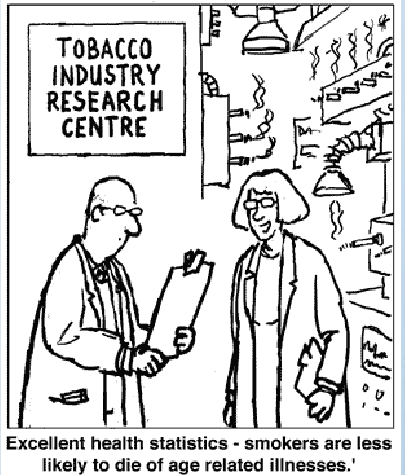

<!-- Statisticulation `e un termine inventato da Darrell Huff nel suo libro “How to lie with statistics” (pubblicato nel 1954). Viene usato per descrivere tutti quei casi un cui le Scienze statistiche vengono usate in modo fuorviante, sia accidentalmente (il ricercatore non si accorge che l'eta' media in Inghilterra e Giappone e' diversa) ma anche volontariamente (l'autismo viene dopo il vaccino, il vaccino causa l'autismo). Vedi anche Framing.

The numbers have no way of speaking for themselves. We speak for them. We imbue them with meaning.

— Nate Silver, The Signal and the Nois
-->

---
## Why are we here?

- Why do soldiers die?

<!-- Ma i numeri non ci ingannano solo, ci permettono anche di rispondere a delle domande e prendere delle decisioni -->

---
## Who is this person?

<!-- Serve qualcuno che non solo si ponga la domanda, ma sappia anche come rispondere. 

Sapete chi e questa persona?

Florence Nightingale era un'infermiera britannica che e' considerata la madre dell'infermieristica come la intendiamo oggi, un titolo che si e' guadagnato durante la guerra di Crimea, quando era sovrintendente di un ospedale di Instambul. 

Appena arrivata ad Instabul, Florence, si accorge subito delle pessime condizioni di sovraffollameto e pulizia, ma oltre a cercare di mettere una pezza, pulendo e disinfettando tutto con le sue infermiere,  si mette anche a raccogliere dati, soprattutto sulle cause di morte dei soldati -->

---
## Why do soldiers die?

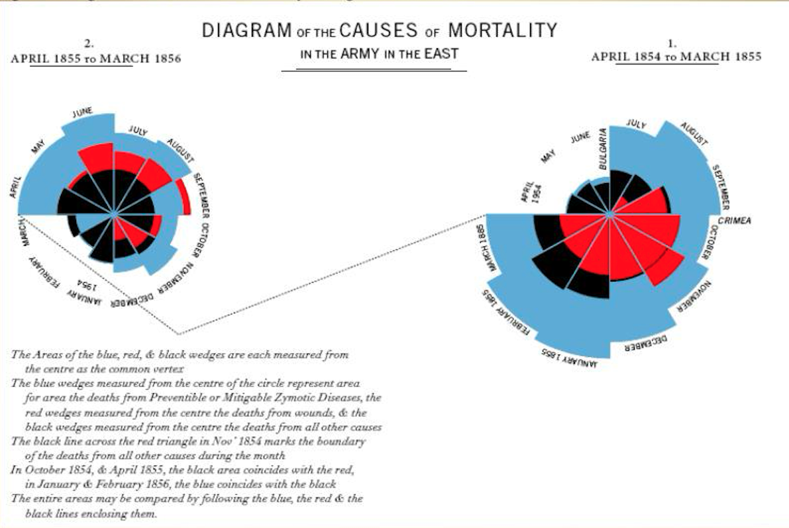

<!-- E questi dati non solo li raccoglie, ma li riassume e presenta anche sotto forma di polar diagram, che spedisce regolarmente al governo britannico. 

Come si legge il grafico. Blu = malattie infettive, Rosso = ferite riportate in battaglia, nero = altre cause

E cosa concludiamo? 
Che migliorare le condizioni igenice (pulizia, luce, ventilazione, ...) degli ospedali, aumenta le possibilita' di salvare il paziente. 

E se questo e' ovvio oggi, lo dobbiamo alla sua abilita' nel raccogliere e presentare i dati, e nel prendere delle decisioni basate su di essi. Insomma, grazie alla statistica. -->

---
## Why are we here?

- Because “numbers” (or rather, the way they are presented) can sometimes be misleading
- Because “numbers” (and the way they are presented) help us describe, understand, and change the world

---
## Why are we here?

- To learn how to read, understand, and critically analyse scientific papers
- To be able to carry out research involving the acquisition, processing, and analysis of data

<!-- 

<b>Statistica ma anche data literacy</b>

 -->

---

## Scientific research

<!-- Iniziamo a spostarci piu' verso il terreno che ci interessa, ma prima facciamo un'escursus in un argomento un po' trasversale, ovvero come avviene la ricerca scientifica e che ruolo gioca la statistica -->

---
## Problem

- Why do soldiers die?

---
## Plan

- The study protocol

<!-- Decido di andare in un ospedale da campo per raccogliere dati 

 In the wise words of Dale Carnegie, 'An hour of planning can save you 10 hours of doing'.
-->

---
## Data

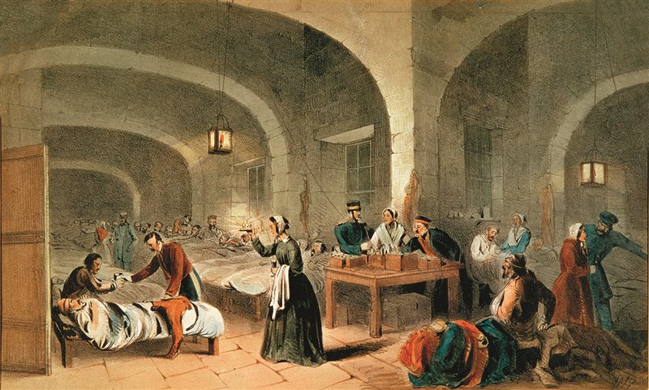

                   Scutari Hospital. J.A. Benwell. about 1856

<!-- Poi si raccolgono i dati -->

---
## Analysis 

<!-- Questo vuol dire anche andarli a presentare con altri numeri (statistiche) o con rappresentazioni grafiche, come vedremo la prossima lezione -->

---
## Conclusions

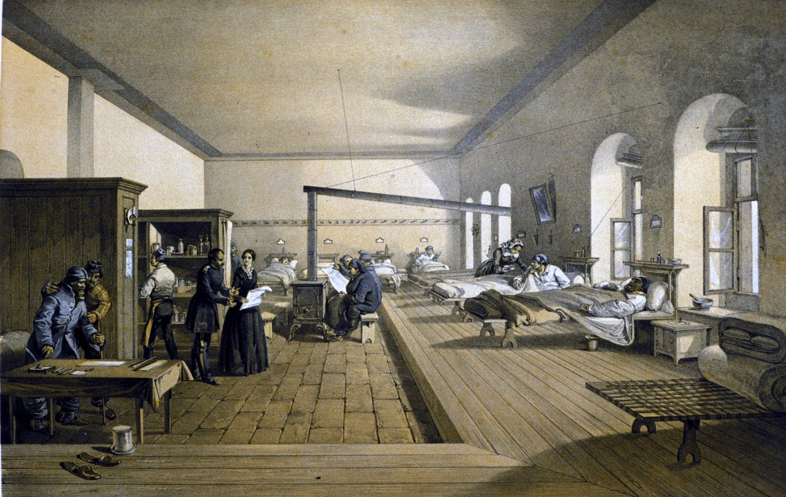

                     Florence Nightingale (1820 - 1910) at Scutari Hospital in Turkey around 1855, unknown artist

<!-- E cosa concludiamo? 
Che migliorare le condizioni igenice (pulizia, luce, ventilazione, ...) degli ospedali, aumenta le possibilita' di salvare il paziente.  -->

---
## The data problem-solving cycle 

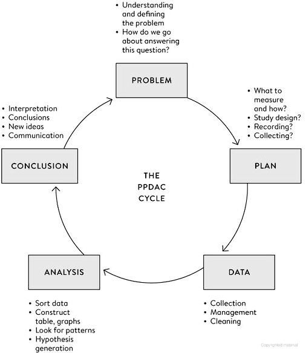

Spiegelhalter, D., *The Art of Statistics: Learning From Data*, Pelican, 2019

<!-- e' il processo circolare che definisce i passi necessari per risolvere un problema scientifico attraverso l’analisi statistica dei dati. Un esempio `e il PPDAC cycle.

 Problem-Plan-Data-Analysis-Conclusion cycle. 
 
 Nella prima fase si definisce un problema, solitamente formulato come una domanda di ricerca. 
 Nella parte di Planning, il ricercatore decide come rispondere alla domanda di ricerca. Solitamente ignorata, ma assoulutamente cruciale, GARBACE IN, GARBACE OUT. Questo include, 
 i) verificare se esiste una collezione di dati di alta qualit`a che pu`o essere usata, ii) decidere e giustificare perch ́e sia necessario raccogliere nuove collezioni di dati, e quali dati siano necessari e come debbano essere raccolti 
 iii) decidere e giustificare da qua- le Popolazione i dati verranno raccolti, tenendo anche in considerazione considerazione etiche e logistiche (per esempio, questionari che richiedano un tempo troppo lungo per essere completati), 
 iv) decidere e giustificare quando e dove la raccolta dati debba iniziare e finire, 
 v) decidere e giustifi- care i metodi analitici che verranno utilizzati, e 
 vi) definire delle probabili risposte alla domanda di ricerca (ipotesi)
 
 Nella terza fase, i dati vengono raccolti, organizzati, puliti e verificati. 
 Nella quarta fase, i dati vengono esplora- ti, visualizzati e analizzati, per esempio attraverso la creazione di tabelle e/o grafici, di statistiche descrittive. In questo contesto si inseriscono anche il Test di ipotesi e il calcolo e l’interpretazione di un Intervallo di confidenza di una Statistica. 
 Nell’ultima fase, i risultati vengono interpre- tati e comunicati e usati per formulare nuove domande di ricerca la cui risposta verr`a ricercata nel prossimo PPDAC cycle.
-->

---
## Inductive reasoning

Derive a general rule from observations

<!-- 

Deduttivo: tutti gli uomini sono mortali, Pinco Pallo e' un uomo, Pinco Pallo e' mortale.
Induttivo: vedo che diversi uomini muoiono, tutti gli uomini sono mortali,

Dedittivo: per imparare una lingua prima imparo la grammatica, poi il vocabolario, poi la sintassi e poi parlo
Induttivo: ascolto gli altri parlare e mi arrangio
Insieme: in realta' nella vita usiamo insieme sia induttivo che deduttivom per esempio impariamo delle regole a scuola e dei modi di dire nel paese

Quello che abbiamo fatto e' stato in taking particular instances and trying to work out general conclusions.

we don’t know the customs in a community about kissing female friends on the cheek, and we have to try to work it out by observing whether people kiss once, twice, three times, or not at all.

Questo e' il contrario del ragionamento deduttivo, using the rules of cold logic to work from general premises to particular conclusions. 

If the law of the country is that cars should drive on the right, then we can deduce that on any particular occasion it is best to drive on the right. But induction works the other way,  -->

---
## What is Statistics?

* The collection, organisation, summarisation, and analysis of data   &nbsp;&nbsp;&nbsp; &rarr; *Descriptive* &nbsp;statistics

* The drawing of inferences about a body of data when only a part of the data is observed   &nbsp;&nbsp;&nbsp; &rarr; *Inferential* &nbsp;statistics

<!-- - Individuare in maniera efficiente i tratti importanti delle informazioni che sono state raccolte

- Partire dal particolare per capire come le informazioni si possono estendere alla totalità -->

---
## What will we learn?

- How to collect data
- How to summarise data
- How to make decision with data

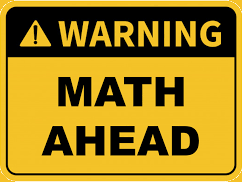

<!-- - Come raccogliere i dati, che andranno scelti oculatamente per far si' che il particolare che ossserviamo si estenda alla totalita' della popolazione

- Come sintetizzarli, utilizzando vari indici, ma anche qualche rappresentazione grafica

- come usare approcci statistici per stimare valori della popolazione, e definire e verificare ipotesi 

Ci saranno anche delle formule matematiche, ma non preoccupatevi: andremo a spiegarle e saranno un aiuto per svolgere gli esercizi e in generale capire cosa stiamo facendo (si', ci sono anche degli esercizi!)
-->

---

# Sampling

---
## Learning objectives

- Understand the difference between populations and samples
- Recognize the different sampling strategies
- Acknowledge sampling error and bias

<!-- Nella parte di Planning, il ricercatore decide come rispondere alla domanda di ricerca. Solitamente ignorata, ma assoulutamente cruciale, GARBACE IN, GARBACE OUT. Questo include, 
 i) verificare se esiste una collezione di dati di alta qualit`a che pu`o essere usata, ii) decidere e giustificare perch ́e sia necessario raccogliere nuove collezioni di dati, e quali dati siano necessari e come debbano essere raccolti 
 iii) decidere e giustificare da qua- le Popolazione i dati verranno raccolti, tenendo anche in considerazione considerazione etiche e logistiche (per esempio, questionari che richiedano un tempo troppo lungo per essere completati), 
 iv) decidere e giustificare quando e dove la raccolta dati debba iniziare e finire, 
 v) decidere e giustifi- care i metodi analitici che verranno utilizzati, e 
 vi) definire delle probabili risposte alla domanda di ricerca (ipotesi) -->

--- 
## Population *vs*  &nbsp;sample

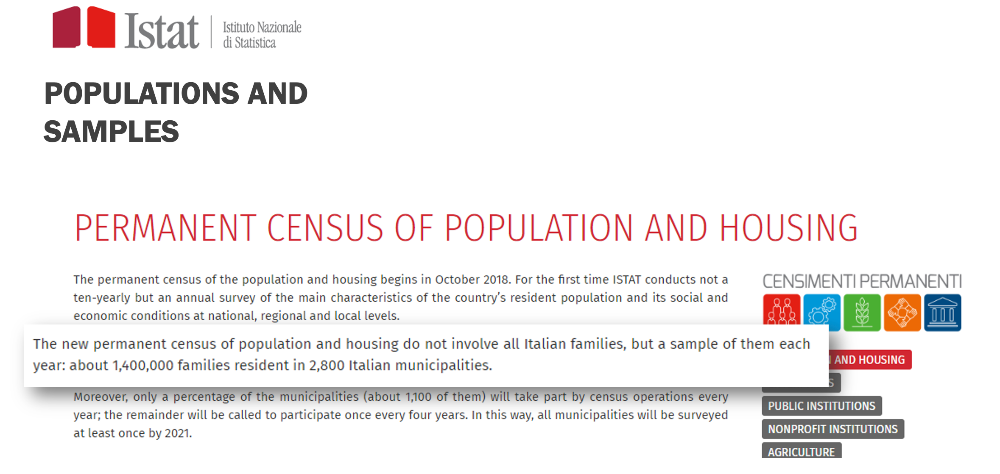

<!-- Popolazione e' l'insieme di tutti gli individui per cui vogliamo studiare un fenomeno, e.g., popolazione italiana

Il modo tradizionale per studiare una popolazione e' il censimento, che pero' ha diversi svantaggi, tra cui il costo

Avveniva ogni 10 anni, ultimo nel 2011 -> dal 2018 permanent census, sotto gruppo della popolazione, quindi quello che chiamiamo un campione statistico 

Altro svantaggio , e b) non e' possibile raccogliere tutte le informazioni possiboli e immaginabili (trauma cranico al nido)
-->

---
## Population *vs*  &nbsp;sample (in the clinic)

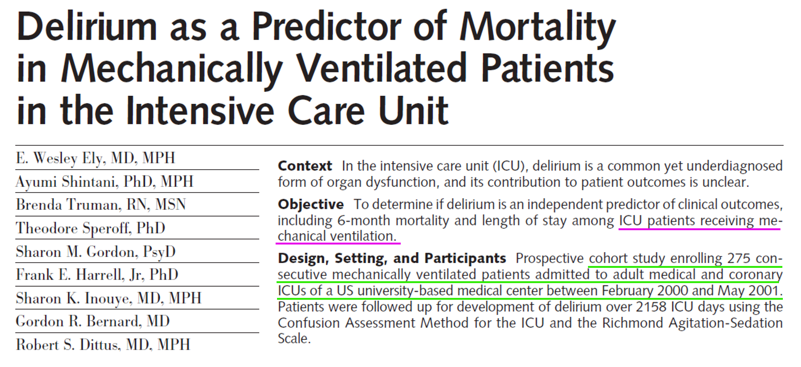

<!-- Nella ricerca clinica, la popolazione e' l'insieme di tutti i pazienti che ci interessano

Campione sono quelli che siamo andati a reclutare .

Ovviamente questi campioni devono essere scelti con procedimenti e regole che garantiscano la capacità del campione di rappresentare la popolazione
-->

---
### Exercise #1

:question: &nbsp;&nbsp;&nbsp; Which is the population of this study?

&nbsp;&nbsp;&nbsp;&nbsp;&nbsp;&nbsp;&nbsp;&nbsp; a) Patients with Acute respiratory distress syndrome (ARDS) 
&nbsp;&nbsp;&nbsp;&nbsp;&nbsp;&nbsp;&nbsp;&nbsp; b) Patients with COVID-19–associated ARDS
&nbsp;&nbsp;&nbsp;&nbsp;&nbsp;&nbsp;&nbsp;&nbsp; c) Patients with COVID-19–associated ARDS in the Brazilian ICUs involved in the study
&nbsp;&nbsp;&nbsp;&nbsp;&nbsp;&nbsp;&nbsp;&nbsp; d) Patients without COVID-19–associated ARDS

   Tomazini, B.M., *et al.*, Effect of dexamethasone on days alive and ventilator-free in patients with moderate or severe acute respiratory distress syndrome and COVID-19: the CoDEX randomized clinical trial.", JAMA, 2020, doi:10.1001/jama.2020.17021

---
### Exercise #2

:question: &nbsp;&nbsp;&nbsp; Which is the sample used in this study?

&nbsp;&nbsp;&nbsp;&nbsp;&nbsp;&nbsp;&nbsp;&nbsp; a) Patients with Acute respiratory distress syndrome (ARDS) 
&nbsp;&nbsp;&nbsp;&nbsp;&nbsp;&nbsp;&nbsp;&nbsp; b) Patients with COVID-19–associated ARDS &nbsp;&nbsp; 
&nbsp;&nbsp;&nbsp;&nbsp;&nbsp;&nbsp;&nbsp;&nbsp; c) Patients with COVID-19–associated ARDS in the Brazilian ICUs involved in the study
&nbsp;&nbsp;&nbsp;&nbsp;&nbsp;&nbsp;&nbsp;&nbsp; d) Patients without COVID-19–associated ARDS

   Tomazini, B.M., *et al.*, Effect of dexamethasone on days alive and ventilator-free in patients with moderate or severe acute respiratory distress syndrome and COVID-19: the CoDEX randomized clinical trial.", JAMA, 2020, doi:10.1001/jama.2020.17021

   Tomazini, B.M., *et al.*, Effect of dexamethasone on days alive and ventilator-free in patients with moderate or severe acute respiratory distress syndrome and COVID-19: the CoDEX randomized clinical trial.", JAMA, 2020, doi:10.1001/jama.2020.17021

---
## Opportunity *vs*  &nbsp;random sample

:dart: &nbsp;&nbsp;&nbsp; An **opportunity** sample is the sample drawn from the part of the
&nbsp;&nbsp;&nbsp;&nbsp;&nbsp;&nbsp;&nbsp;&nbsp;  population that is most readily available (and which may not 
&nbsp;&nbsp;&nbsp;&nbsp;&nbsp;&nbsp;&nbsp;&nbsp; represent the entire population)

* **Example**: we enrol all patients who present to a given clinic during a specified period

<!-- Iniziamo con il distinguere il campionamento probabilistico da quello non propabilistico.

Nel campionamento non-probabilistico, o opportunustico, la selezione del campione avviene in base a criteri di comodo o di praticità, per esempio perché certi individui sono più facilmente contattabili, o per ragioni di costo -->

---
## Opportunity *vs*  &nbsp;random sample

:dart: &nbsp;&nbsp;&nbsp;A random sample is one in which the probability of selecting any 
&nbsp;&nbsp;&nbsp;&nbsp;&nbsp;&nbsp;&nbsp; particular member can be calculated (and which should represent 
&nbsp;&nbsp;&nbsp;&nbsp;&nbsp;&nbsp;&nbsp; the entire population)

* **Example**: we enrol a randomly selected group of patients with the disease 

<!-- Nel campionamento probabilistico ogni unità della popolazione in studio ha una probabilità NOTA di essere estratta (non distorto o viziato) -->

---
## Strategy 1: Simple random sampling

:dart: &nbsp;&nbsp;&nbsp; A sample of size $n$ is drawn from a  population of 
&nbsp;&nbsp;&nbsp;&nbsp;&nbsp;&nbsp;&nbsp;&nbsp; size $N$  ensuring that  every possible sample of 
&nbsp;&nbsp;&nbsp;&nbsp;&nbsp;&nbsp;&nbsp;&nbsp; size $n$ is equally likely

<!-- Nel campionamento casuale semplice tutte le unità della popolazione hanno la stessa probabilità di essere estratte:

data una popolazione di N individui ed un campione di dimensione n  la probabilità che l’i-esimo individuo entri nel campione è “n/N” -->

---
## Strategy 1: Simple random sampling

:pushpin: &nbsp;&nbsp;&nbsp;  $N=90$
&nbsp;&nbsp;&nbsp;&nbsp;&nbsp;&nbsp;&nbsp;&nbsp; $n=10$ 

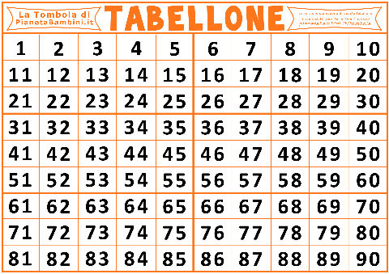

<!-- Disporre di un elenco completo di tutti i soggetti della popolazione e una loro numerazione

Decidere quante unità si vogliono selezionare e calcolare la frazione di campionamento -->

---
## Strategy 1: Simple random sampling

:pushpin: &nbsp;&nbsp;&nbsp;  $N=90$
&nbsp;&nbsp;&nbsp;&nbsp;&nbsp;&nbsp;&nbsp;&nbsp; $n=10$ 

&nbsp;&nbsp;&nbsp;&nbsp;&nbsp;&nbsp;&nbsp;&nbsp; $49, 65, 25, 74, 18$
&nbsp;&nbsp;&nbsp;&nbsp;&nbsp;&nbsp;&nbsp;&nbsp; $90, 47, 24, 71, 37$

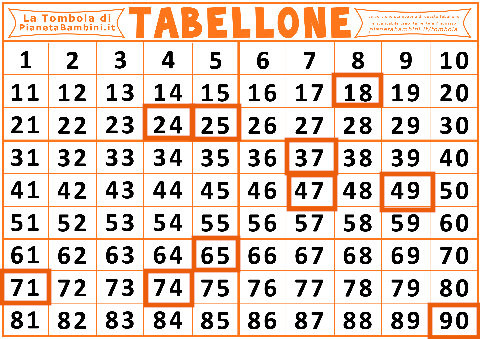

<!--  Estrarre le unità tramite sorteggio casuale o tavole dei numeri casuali (costruite in modo da non avere vizi sistematici. Sono delle serie di numeri tra 0 e 9 disposti a caso e caratterizzati dall’avere una distribuzione uniforme) -->

---
## Strategy 2: Stratified Random Sampling

:dart: &nbsp;&nbsp;&nbsp; The population is divided into homogeneous group (strata)  
&nbsp;&nbsp;&nbsp;&nbsp;&nbsp;&nbsp;&nbsp;&nbsp; and a simple random sample is drawn from each stratum

&nbsp;&nbsp;&nbsp;&nbsp;&nbsp;&nbsp;&nbsp;&nbsp; **Variation**: stratified sampling proportional to size

---
## Strategy 2: Stratified Random Sampling

:pushpin: &nbsp;&nbsp;&nbsp;  $N=90$
&nbsp;&nbsp;&nbsp;&nbsp;&nbsp;&nbsp;&nbsp;&nbsp; $N_{female}=60$
&nbsp;&nbsp;&nbsp;&nbsp;&nbsp;&nbsp;&nbsp;&nbsp; $N_{male}=30$

&nbsp;&nbsp;&nbsp;&nbsp;&nbsp;&nbsp;&nbsp;&nbsp; $n=9$ 
&nbsp;&nbsp;&nbsp;&nbsp;&nbsp;&nbsp;&nbsp;&nbsp; $n_{female} = 6$
&nbsp;&nbsp;&nbsp;&nbsp;&nbsp;&nbsp;&nbsp;&nbsp; $n_{male} = 3$

&nbsp;&nbsp;&nbsp;&nbsp;&nbsp;&nbsp;&nbsp;&nbsp; $Females: 46, 20, 26,$
&nbsp;&nbsp;&nbsp;&nbsp;&nbsp;&nbsp;&nbsp;&nbsp;&nbsp;&nbsp;&nbsp;&nbsp;&nbsp;&nbsp;&nbsp;&nbsp;&nbsp;&nbsp;&nbsp;&nbsp;&nbsp;&nbsp;&nbsp;&nbsp;&nbsp; $50, 47,  3$
&nbsp;&nbsp;&nbsp;&nbsp;&nbsp;&nbsp;&nbsp;&nbsp;&nbsp;&nbsp;&nbsp;&nbsp; $Males: 69, 85, 87$

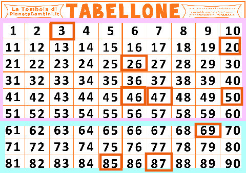

<!-- Esempi di strata : sesso, eta', condizione sociale -->

---
## Strategy 3: Cluster sampling

:dart: &nbsp;&nbsp;&nbsp; The population is divided into clusters, and a simple random 
&nbsp;&nbsp;&nbsp;&nbsp;&nbsp;&nbsp;&nbsp;&nbsp; sample is drawn
 
&nbsp;&nbsp;&nbsp;&nbsp;&nbsp;&nbsp;&nbsp;&nbsp; **Variations**
&nbsp;&nbsp;&nbsp;&nbsp;&nbsp;&nbsp;&nbsp;&nbsp; - one-stage: observing everything within selected clusters
&nbsp;&nbsp;&nbsp;&nbsp;&nbsp;&nbsp;&nbsp;&nbsp; - two-stage: taking a further random sample within the 
&nbsp;&nbsp;&nbsp;&nbsp;&nbsp;&nbsp;&nbsp;&nbsp;&nbsp;&nbsp; selected clusters

<!-- Le unità della popolazione sono suddivise in CLUSTER o GRAPPOLI in base a circostanze organizzative, strutturali, geografiche.
All’interno dei cluster le unità possono essere molto diverse tra di loro.

Il campione si forma estraendo casualmente un numero prestabilito di cluster, dopodichè si possono includere tutte le unità che appartengono al cluster (1 stadio) o solo una parte (2 stadi, usano campionamento semplice o stratificato)
 -->

---
## Strategy 3: Cluster sampling

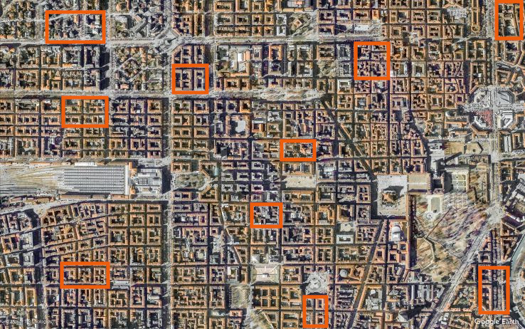

--- 
## Sampling in the wild

https://hbsc.org

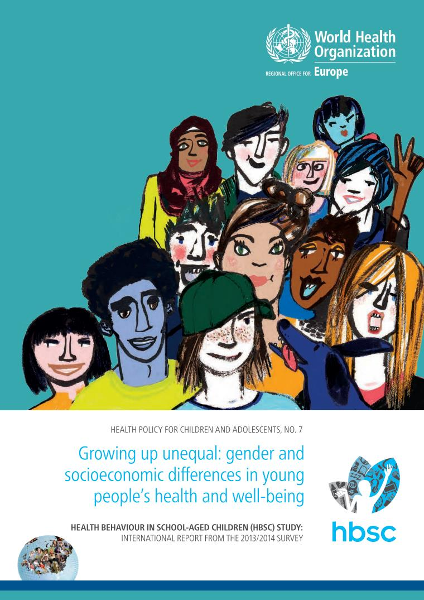

<!--  Health beavious in school aged children 
Studio internazionale che si tiene ogni 4 anni e che raccoglie informazioni sui ragazzi di 11, 13, 15 e, recentemente anche 17 anni (che sono la mia popolazione) 
Ma non li raccoglie tutti, ne raccoglie un campione.

Innanzitutto li devo dividere per regioni (stratificato), poi vado a identifcare le scuole (cluster)
All'interno delle scuole vado a fare un ulteriore strato per grado/eta' e poi prpcedo con un sistematic sampling all'interno di ciascuno strato per identiicare le classi (di cui scelgo TUTTI gli studenti della classe)

Countries may choose to stratify their samples to ensure representation by, for example, geographic location,
ethnic group or school type.
-->

---
### Exercise #3

:question: &nbsp;&nbsp;&nbsp; A representative is conducting a survey on the popularity of a 
&nbsp;&nbsp;&nbsp;&nbsp;&nbsp;&nbsp;&nbsp;&nbsp; new product by interviewing every fifth customer who enters 
&nbsp;&nbsp;&nbsp;&nbsp;&nbsp;&nbsp;&nbsp;&nbsp; the supermarket near the company they work for

&nbsp;&nbsp;&nbsp;&nbsp;&nbsp;&nbsp;&nbsp;&nbsp; What type of sampling strategy are they using?

&nbsp;&nbsp;&nbsp;&nbsp;&nbsp;&nbsp;&nbsp;&nbsp; a) simple random sampling
&nbsp;&nbsp;&nbsp;&nbsp;&nbsp;&nbsp;&nbsp;&nbsp; b) cluster sampling
&nbsp;&nbsp;&nbsp;&nbsp;&nbsp;&nbsp;&nbsp;&nbsp; c) stratified sampling
&nbsp;&nbsp;&nbsp;&nbsp;&nbsp;&nbsp;&nbsp;&nbsp; d) none of the above 

---
## What if the sample is not representative?

<!--  -->

- The conclusions **cannot** be generalized

<!-- Per anni il manichino e' stato solo male, nonostante le donne comprino il 62% delle auto in nord-america e il "female" dummy e' un downsize del male e provato solo nel sedile del passeggero 

Le donne soffrono maggiori colpi di frusta

primo test con vero manichino donna nel 2023

consider a vaccine trial carried out using student volunteers. If it is reasonable to assume that in their response to the vaccine and exposure to disease students are typical of the community at large, the results will have general applicability. If, on the other hand, students differ in any respect which may materially affect their response to the vaccine or exposure to disease, the conclusions from the trial are restricted to the population of students and do not have general applicability. Deciding whether or not ‘students are typical’ is not a statistical issue, but depends on an informed judgement taking into account relevant biological and epidemiological knowledge.
-->

Caroline Criado-Perez, *Invisible Women: Exposing Data Bias in a World Designed for Men*, Ballantine Books, 2019

---
## In practice: from the target population...

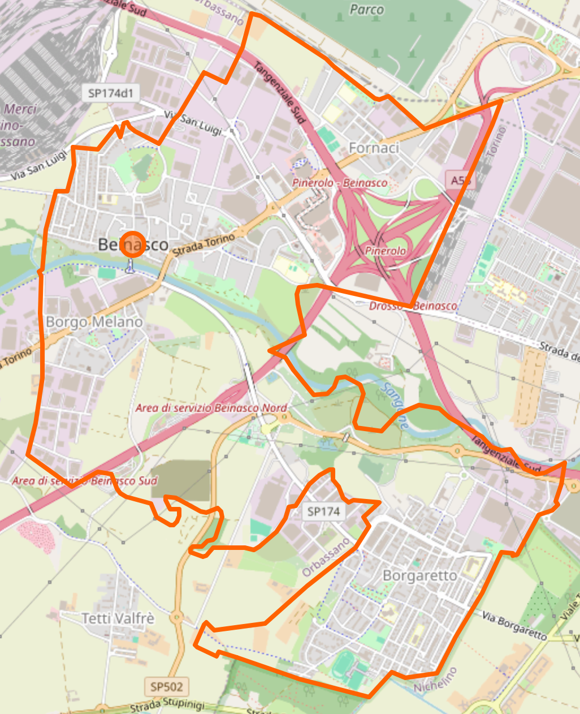

<!-- Supponiamo che tu debba valutare il gradimento di un centro di salute mentale che ha aperto, in via sperimentale, lo scorso anno a Beinasco. 

Beinasco ha una \textbf{popolazione} di circa 18,000 abitanti e hai accesso ad un estratto dell'elenco telefonico
 -->
---
## ... through the sampling frame ...

<!-- e l'elenco di tutti gli individui in una popolazione da cui si scelgono soggetti che faranno parte del campione 

Come facciamo a scegliere chi estrarre?

-->

---
## ... to the sample

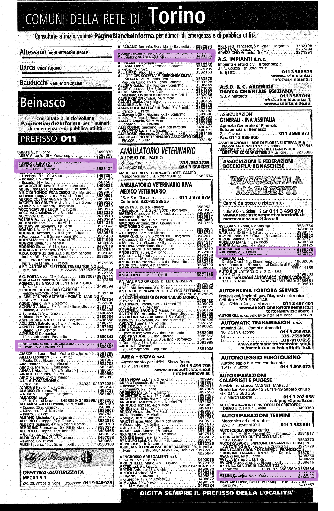

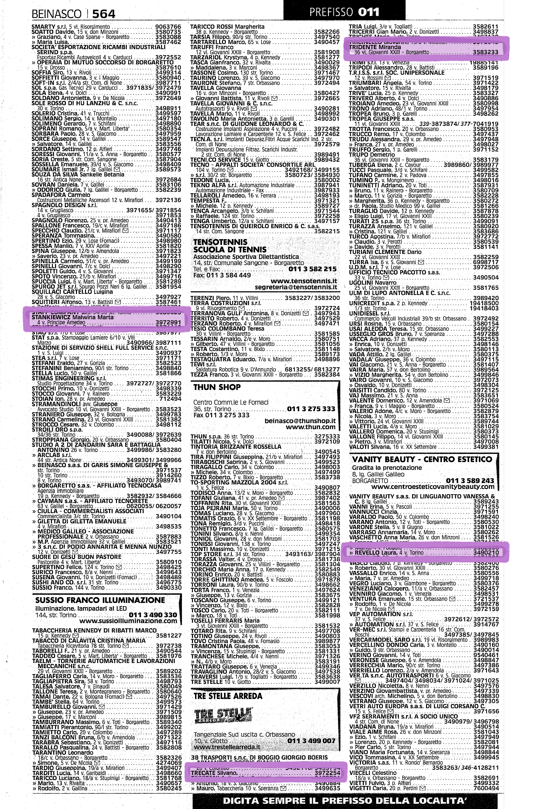

---
## All done?

- who is ineligible?

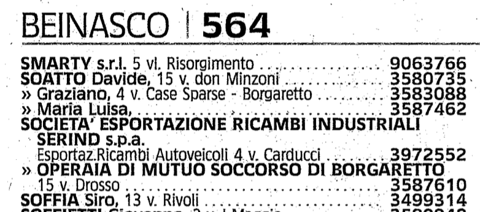

<!-- An ineligible sampling unit is an individual or entity selected through a sampling process but does not meet the specific eligibility criteria for the survey or study. These units are identified during data collection, often through a screening process, and are then removed from the sample so they do not skew results. Reasons for ineligibility include being outside a geographic boundary, failing to meet demographic requirements (e.g., age), or being a business when the survey targets individuals -->

---
## All done?

- who is ineligible?
- who does not respond?

---
## All done?

- who is ineligible?
- who does not respond?

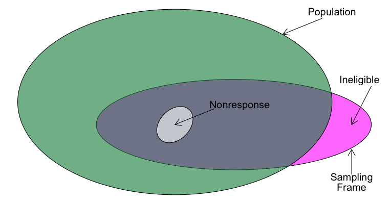

---
## Selection bias

- **Non-response bias**

<!-- Faccio domande molto personali (uso di cannabis) 

Surveys asking for personal, legal, or other sensitive information are prone to non-response bias, simply because there is some information respondents don’t feel comfortable disclosing.
-->

---
## Selection bias

- **Survivor bias**

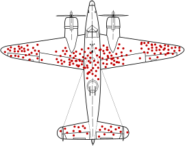

<!-- Anche se facciamo attenzione i nostri sample possono avere delle distorsioni

- voglio andare a vedere dove gli aerei da guerra vengono colpiti per rinforzarli
e l’errore logico che si commette quando si prendano in considerazione solo gli elementi che hanno superato un determinato pro- cesso di selezione, trascurando i restanti; tipicamente ci`o avviene poich ́e i primi sono fisicamente disponibili/visibili e i secondi no. -->

---
## Selection bias

- **Survivor bias**

&nbsp;&nbsp;&nbsp;&nbsp;&nbsp;&nbsp;&nbsp;&nbsp; *"Buildings used to be more beautiful/longer-lasting"*

<!-- Just as new buildings are being built every day and older structures are constantly torn down, the story of most civil and urban architecture involves a process of constant renewal, renovation, and revolution. Only the most beautiful, useful, and structurally sound buildings survive from one generation to the next. This creates a selection effect where the ugliest and weakest buildings of history have been eradicated (disappearing from public view, leaving the visible impression that all earlier buildings were more beautiful and better built).
-->

---
## Selection bias

- **Survivor bias**

&nbsp;&nbsp;&nbsp;&nbsp;&nbsp;&nbsp;&nbsp;&nbsp; *"Buildings used to be more beautiful/longer-lasting"*

&nbsp;&nbsp;&nbsp;&nbsp;&nbsp;&nbsp;&nbsp;&nbsp; *"I don't understand why, nowadays, one should do X. 
&nbsp;&nbsp;&nbsp;&nbsp;&nbsp;&nbsp;&nbsp;&nbsp;&nbsp; I never did it, and I'm still here to tell the tale."*

<!-- 

X indossare una cintura di sicurezza, mettere le sicurezze sul lavoro... when helmets became standard gear, the amount of people being treated for head wounds skyrocketed. But thats because they would have been killed without the helmet. 
-->

---
## Selection bias

- **Volunteer bias**

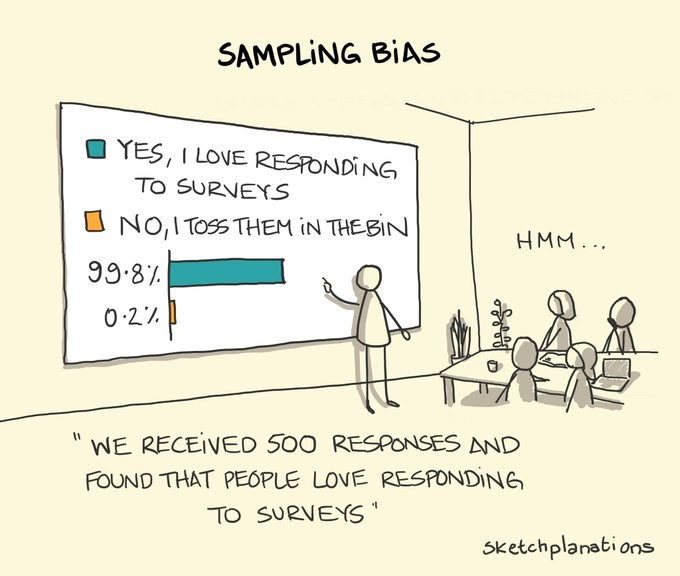

<!-- - occorre quando i volontari hanno caratteristiche diverse rispet- to alla Popolazione che si vuole studiare.  volontari alsop SES e soprattuto donne
- occorre quando uno o piu` soggetti di uno studio di- ventano irreperibili durante lo studio stesso sto testando un nuovo farmaco, le persone che hanno i side effect peggiori possono interromperlo, o quelli per cui non funziona possono morire -->

---
## Selection bias

- **Volunteer bias**

&nbsp;&nbsp;&nbsp;&nbsp;&nbsp;&nbsp;&nbsp;&nbsp;  A teacher wonders if extra lessons improve exam performance.
&nbsp;&nbsp;&nbsp;&nbsp;&nbsp;&nbsp;&nbsp;&nbsp; She prepares them, inviting interested students to sign up. 

<!-- Self-selection bias is likely because students who are more serious about school are more likely to sign up  -->

---
## Selection bias

- **Lost to follow up bias**

---
## Selection bias

- **Lost to follow up bias**

&nbsp;&nbsp;&nbsp;&nbsp;&nbsp;&nbsp;&nbsp;&nbsp; A pharma company is testing a new drug on a cohort of 100 cancer patients
&nbsp;&nbsp;&nbsp;&nbsp;&nbsp;&nbsp;&nbsp;&nbsp; recruited at a center of excellence. 30 did not show up for the follow-up.
&nbsp;&nbsp;&nbsp;&nbsp;&nbsp;&nbsp;&nbsp;&nbsp;  What can we conclude about this new drug if we know that these 30 patients...

---
## Selection bias

- **Lost to follow up bias**

&nbsp;&nbsp;&nbsp;&nbsp;&nbsp;&nbsp;&nbsp;&nbsp; A pharma company is testing a new drug on a cohort of 100 cancer patients
&nbsp;&nbsp;&nbsp;&nbsp;&nbsp;&nbsp;&nbsp;&nbsp; recruited at a center of excellence. 30 did not show up for the follow-up.
&nbsp;&nbsp;&nbsp;&nbsp;&nbsp;&nbsp;&nbsp;&nbsp;  What can we conclude about this new drug if we know that these 30 patients...

&nbsp;&nbsp;&nbsp;&nbsp;&nbsp;&nbsp;&nbsp;&nbsp;&nbsp;&nbsp;&nbsp;&nbsp;&nbsp; - died?

---
## Selection bias

- **Lost to follow up bias**

&nbsp;&nbsp;&nbsp;&nbsp;&nbsp;&nbsp;&nbsp;&nbsp; A pharma company is testing a new drug on a cohort of 100 cancer patients
&nbsp;&nbsp;&nbsp;&nbsp;&nbsp;&nbsp;&nbsp;&nbsp; recruited at a center of excellence. 30 did not show up for the follow-up.
&nbsp;&nbsp;&nbsp;&nbsp;&nbsp;&nbsp;&nbsp;&nbsp;  What can we conclude about this new drug if we know that these 30 patients...

&nbsp;&nbsp;&nbsp;&nbsp;&nbsp;&nbsp;&nbsp;&nbsp;&nbsp;&nbsp;&nbsp;&nbsp;&nbsp; - died?
&nbsp;&nbsp;&nbsp;&nbsp;&nbsp;&nbsp;&nbsp;&nbsp;&nbsp;&nbsp;&nbsp;&nbsp;&nbsp; - stopped taking the drug?

---
## Selection bias

- **Lost to follow up bias**

&nbsp;&nbsp;&nbsp;&nbsp;&nbsp;&nbsp;&nbsp;&nbsp; A pharma company is testing a new drug on a cohort of 100 cancer patients
&nbsp;&nbsp;&nbsp;&nbsp;&nbsp;&nbsp;&nbsp;&nbsp; recruited at a center of excellence. 30 did not show up for the follow-up.
&nbsp;&nbsp;&nbsp;&nbsp;&nbsp;&nbsp;&nbsp;&nbsp;  What can we conclude about this new drug if we know that these 30 patients...

&nbsp;&nbsp;&nbsp;&nbsp;&nbsp;&nbsp;&nbsp;&nbsp;&nbsp;&nbsp;&nbsp;&nbsp;&nbsp; - died?
&nbsp;&nbsp;&nbsp;&nbsp;&nbsp;&nbsp;&nbsp;&nbsp;&nbsp;&nbsp;&nbsp;&nbsp;&nbsp; - stopped taking the drug?
&nbsp;&nbsp;&nbsp;&nbsp;&nbsp;&nbsp;&nbsp;&nbsp;&nbsp;&nbsp;&nbsp;&nbsp;&nbsp; -  went back home?

---
## Independent and paired samples

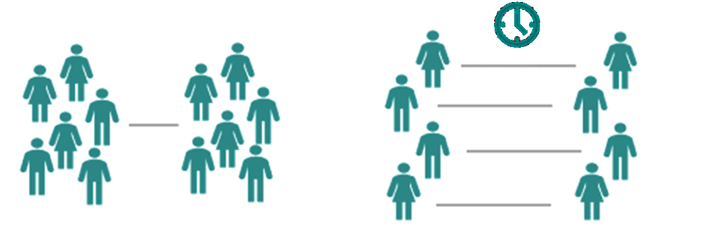

<!-- Sino ad ora abbiamo lavorato su Campioni indipendenti: non vi è relazione tra osservazioni appartenenti a campioni diversi

Esistiono pero' anche campioni appaiati, in cui dati di un campione sono associati con quelli dell’altro. Ad ogni osservazione nel primo gruppo corrisponde un’osservazione nel secondo

Indipendenti> peso nei pazienti diabetici e nei sani
Appaiati: peso nei pazienti diabetici alla diagnosi e dopo 10 anni -->

---
## Independent and paired samples

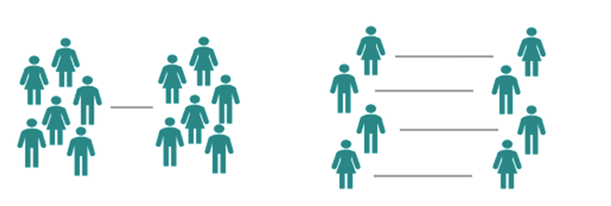

<!-- I capioni appaiati possono anche essere essere persone diverse ma matchate per caratteristiche salienti (eta', sesso, peso corporeo, ...)  -->

---

## Summary

- The population is the set of all individuals for whom we want to study a phenomenon and is, theoretically, infinite.
- The sample is a (representative?) subset of the population.
- The more representative a sample is of the population, the more robust our conclusions.
- Even representative (random) samples can suffer from bias.
- There are different experimental designs.

<!-- - La popolazione &egrave; l'insieme di tutti gli individui per cui vogliamo studiare un fenomeno ed è, teoricamente, infinita
- Il campione &egrave; un sotto insieme (rappresentativo?) della popolazione
- Anche con campioni rappresentativi (casuali) possono esserci errori e/o bias -->

---

# Summarise data

---
## Learning objectives

- Define what a variable is
- Identify the causes of an observation's variability
- Understand the differences between data types
- Be able to summarise each data type with the correct statistics
- Understand the difference between parameters and statistics
- Understand why visualise your data is important

---
## A variable...

- They record information about a characteristic of interest

* They are imperfect: they don’t always measure what we care about 
  - knowledge of a subject $\neq$ exam grade
  <!-- - benessere di un Paese $\neq$ prodotto interno lordo -->

* They vary: from person to person, from moment to moment, $\dots$ seemingly at random

<!-- 

Dato informazione su una variabile di interesse

Un dato corrisponde a un'informazione su un membro di una popolazione (sesso, altezza, numero dei battiti cardiaci, titolo di studio, età,…) , viene codificata in variabili. 

Proxy: chiedendo alla gente quanto si sentisse felice la settimana
scorsa in una scala da 0 a 10 non si coglie piú di tanto il benessere emotivo
del Paese. 

La variabilita' di tali variabili (differenze che vediamo tra le osservazioni) ci dice come le caratteristiche di una paopolazione (eta', sesso, altezza... ) differiscano da individuo a individuo 

Questa variabilita' dipende sia da fattori conosciuti o conoscibili sia da effetti casuali (random noise)
 -->

---
## What causes this variability?

- In a study on neonatal age, 18 paediatricians measure the head circumference of a doll simulating a three-month-old baby

&nbsp;&nbsp;&nbsp;&nbsp;&nbsp;&nbsp;&nbsp; Why do the collected 
&nbsp;&nbsp;&nbsp;&nbsp;&nbsp;&nbsp;&nbsp; data vary?

<!-- Given that all nurses were measuring the head of the same doll, all of the head circumference measurements should be the same. In other words, there should be no variability in the measurements. However, the above graph clearly illustrates that there was variability in the measurements. Why was there variability in the measurements of the doll’s head circumference? (Select all that apply.)

Some nurses held the tape measure tighter around the infants head while others held it looser.
Each nurse put the tape measure in a slightly different place on the doll’s head
Some nurses may have misread the tape measure.
The doll’s head changed size between measurements. -->

<!--  the above question, all of the variability in scores was created by measurement error because everyone was measuring the same thing and, therefore, should have obtained the same score. Unfortunately, measurement error is always present. No matter what you are measuring, you will never be able to measure it perfectly every time. You can, however, reduce the amount of measurement error. In the context of measuring an infant’s head circumference, how could the developmental psychologist and/or nurses reduce the variability in scores created by measurement error (i.e., what could they do to increase the accuracy/reliability of each measurement?). Select all that apply.

Give the nurses a lot of practice measuring different dolls’ heads.
Train the nurses to use a consistent degree of tension in the tape measure. -->

---
## What causes this variability?

- In the same study, a paediatrician measure the head circumference of 35 three-month-old babies

&nbsp;&nbsp;&nbsp;&nbsp;&nbsp;&nbsp;&nbsp; Why do the collected 
&nbsp;&nbsp;&nbsp;&nbsp;&nbsp;&nbsp;&nbsp; data vary?

<!-- Anche qui rimangono errori di misurazione -->

---
## What causes this variability?

- In the same study, a paediatrician measure the head circumference of other 35 three-month-old babies exposed to second-hand smoke

&nbsp;&nbsp;&nbsp;&nbsp;&nbsp;&nbsp;&nbsp; Why do the collected 
&nbsp;&nbsp;&nbsp;&nbsp;&nbsp;&nbsp;&nbsp; data vary?

<!-- Anche qui rimangono errori di misurazione e variabilita' individuale -->

---
## Why should we know the difference?

- We will see how to determine whether the variability depends on the experimental conditions or whether it is due to individual differences and/or measurement errors.

 

---
# Type of data

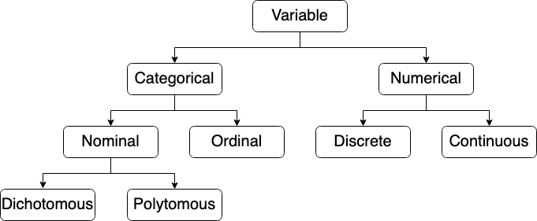

<!-- Andiamo a dividere i dati in variabili quantitative (o numeriche) o qualitative (o categorighe) 

Numeriche: 
- continue (altezza, peso, BMI, temperatura corporea)
- discrete (numero di pazienti ammessi in PS)

Categoriche si dividono in 2 classi
- Nominali (categorie che non possono essere ordinate) -> due categorie binarie (diabete si/no), piu' categorie (gruppo sanguigno)
- Ordinali (categorie che non possono essere ordinate) -> dati che rappresentano categorie ordinate (giudizi scolastici ("Insufficiente", "Sufficiente", "Buono", "Ottimo:"), "Sottopeso", "Normopeso" ...) -->

---
## What type of data is this?

---
## What type of data is this?

:question: &nbsp;&nbsp;&nbsp; The size of a T-shirt

---
## What type of data is this?

:question: &nbsp;&nbsp;&nbsp; The number of patients in ICU

---
## What type of data is this?

:question: &nbsp;&nbsp;&nbsp; One's nationality

---
## What type of data is this?

:question: &nbsp;&nbsp;&nbsp; Body temperature

---
## What type of data is this?

:question: &nbsp;&nbsp;&nbsp; The result of a coin toss

---
## A single variable, many types

:pushpin: &nbsp;&nbsp;&nbsp;  Example: age

---
## A single variable, many types

:pushpin: &nbsp;&nbsp;&nbsp;  Example: age
&nbsp;&nbsp;&nbsp;&nbsp;&nbsp;&nbsp;&nbsp;&nbsp; - Date of birth + date of visit

---
## A single variable, many types

:pushpin: &nbsp;&nbsp;&nbsp;  Example: age
&nbsp;&nbsp;&nbsp;&nbsp;&nbsp;&nbsp;&nbsp;&nbsp; - Date of birth + date of visit
&nbsp;&nbsp;&nbsp;&nbsp;&nbsp;&nbsp;&nbsp;&nbsp; - How old are you?

---
## A single variable, many types

:pushpin: &nbsp;&nbsp;&nbsp;  Example: age
&nbsp;&nbsp;&nbsp;&nbsp;&nbsp;&nbsp;&nbsp;&nbsp; - Date of birth + date of visit
&nbsp;&nbsp;&nbsp;&nbsp;&nbsp;&nbsp;&nbsp;&nbsp; - How old are you?
&nbsp;&nbsp;&nbsp;&nbsp;&nbsp;&nbsp;&nbsp;&nbsp; - Which of these age groups do you belong to?

---
## Discretization

- From a series of continuous values to intervals (or classes)
- The choice of the number of classes and their boundaries is arbitrary
- The classes must be mutually exclusive

<!-- - Riportate anche le classi nulle (frequenza zero) -->

 &nbsp;&nbsp;&nbsp;&nbsp;&nbsp;&nbsp;&nbsp;&nbsp; $\text{BMI} = \frac{\text{weight}_\text{kg}}{\text{height}_m^2}$

| BMI | Classification
| ----: | -----: |
|< 18,5 | Underweight
18,5 – 24, 9 | Healthy Weight
25,0 – 29,9 | Overweight
30,0 – 34,9  | Class 1 Obesity
35,0 – 39,9 | Class 2 Obesity
| > 39,9 | Class 3 Obesity

<!-- Frequenze si usato per dati qualitativi, ma cosa facciamo se abbiamo dati quantitativi?

In questo caso si possono ancora usare, ma la frequenza non è riferita ad un singolo valore, ma ad intervalli (o classi) di valori. 

ESEMPIO QUI DEL BMI

La scelta del numero di classi e degli estremi è arbitraria. Entrambi vengono determinati in base a criteri di convenienza.

Il numero di classi può oscillare e dipende dalla numerosità dei dati (in genere utilizzare da 5 a 20 classi).

Scegliere estremi che siano clinicamente/biologicamente significativi o naturali e, preferibilmente, di uguale ampiezza.

Le classi debbono essere mutuamente esclusive (fate attenzione agli estremi!!).

-->

---
### Exercise #4

:question: &nbsp;&nbsp;&nbsp; Which types of data are 
&nbsp;&nbsp;&nbsp;&nbsp;&nbsp;&nbsp;&nbsp;&nbsp; included in this table?

	
Visconti A., *et al.*, Total serum *N*‐glycans associate with response to immune checkpoint inhibition therapy and survival in patients with advanced melanoma, BMC Cancer, 2023 doi:10.1186/s12885-023-10511-3

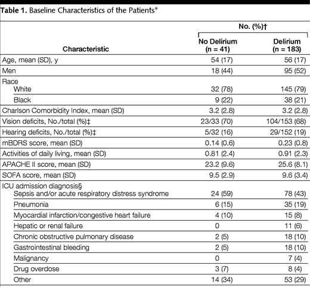

<!-- Sesso: Binaria
Eta'/BMI: continua
BRAF: binaria
Metastatic stage: Ordinale
ECOG score: ordinale (o fully active  5 morto, 4 completamente disabile, 3 capable of only limited selfcare)
ICI teraphy: categorico (con piu' categorie) 
N: discreto

Lactate dehydrogenase, dichotomized according to the upper limit of normal for each centre.
-->

--- 
## Why is it important?

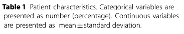

	
Visconti A., *et al.*, Total serum *N*‐glycans associate with response to immune checkpoint inhibition therapy and survival in patients with advanced melanoma, BMC Cancer, 2023 doi:10.1186/s12885-023-10511-3

<!-- Perche' il modo in cui andiamo prima a presentare e poi ad analizzare una variabile dipende dal suop tipo.

Numeriche media/SD, categoriche N/% -->

---

# Categorical variables

---
## Frequency table

- absolute frequency (the number)
- relative frequency (the percentage)

 
Visconti A., *et al.*, *Total serum *N*‐glycans associate with response to immune checkpoint inhibition therapy and survival in patients with advanced melanoma*, BMC Cancer, 2023 doi:10.1186/s12885-023-10511-3

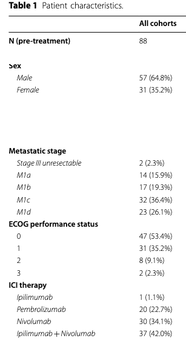

<!-- AssolutaL: numero di volte in cui una certa modalità si manifesta nel campione  
possono assumere valori compresi tra 0 e n (dimensione del campione)
la loro somma è pari a n

Relativa: rapporto tra la frequenza assoluta con cui si manifesta una modalità e la numerosità Total del campione
possono assumere valori compresi tra 0 e 1 (o 0 e 100)
la loro somma è pari a 1

Frequenze assolute e relative forniscono le stesse informazioni sulla distribuzione. 

-->

---
### Exercise #5

:question: &nbsp;&nbsp;&nbsp; Which sex is more frequent?
&nbsp;&nbsp;&nbsp;&nbsp;&nbsp;&nbsp;&nbsp;&nbsp;

 
Visconti A., *et al.*, *Total serum *N*‐glycans associate with response to immune checkpoint inhibition therapy and survival in patients with advanced melanoma*, BMC Cancer, 2023 doi:10.1186/s12885-023-10511-3

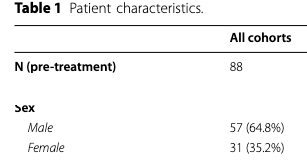

<!-- Le frequenze relative: facilitano la percezione del peso delle modalità -->

---
## Contingency table

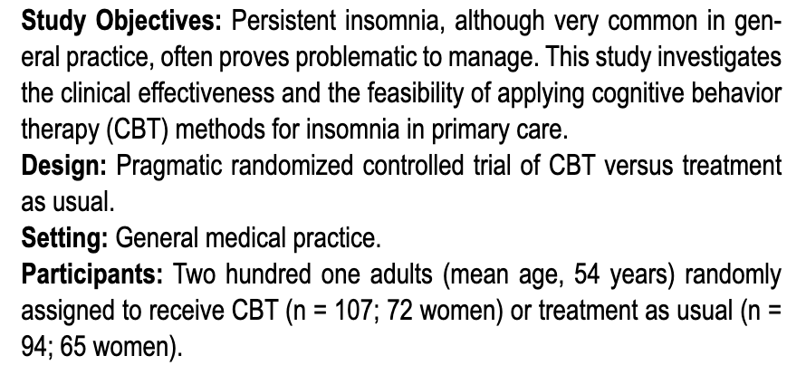

 
Espie. CA, *et al.*, *Randomized Clinical Effectiveness Trial of Nurse-Administered Small-Group Cognitive Behavior Therapy for Persistent Insomnia in General Practice*, Sleep, 2007, doi:10.1186/s12885-023-10511-3

<!-- SPIEGARE CHE SI TRATTA DI UN RCT E COSA DIAVOLO E' UN RCT -- Useremo questo studio per costruire e capire cos'e' una tabelle di contingenza 

 `e una tabella a doppia entrata (con righe e colon- ne) in cui si riportano le frequenze congiunte di due variabili.
-->

---
### Exercise #6

:question: &nbsp;&nbsp;&nbsp; Complete the table with the correct absolute and relative frequencies$^*$
&nbsp;&nbsp;&nbsp;&nbsp;&nbsp;&nbsp;&nbsp;&nbsp;  using the information contained in the abstract

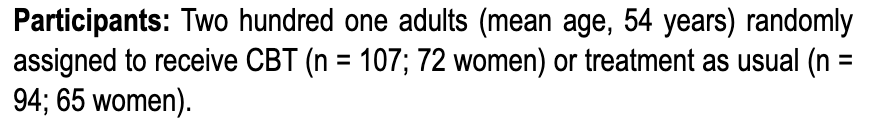

|  | Men | Women | Total |
| ----: | ----- | ---- | ----|
| CBT |  |  |  |
| Standard |  |  |  |
| Total |  |  |  |

$^*$ By convention, relative frequencies are calculated per row

<!--  `e una tabella a doppia entrata (con righe e colon- ne) in cui si riportano le frequenze congiunte di due variabili. 

La CBT (in italiano: terapia cognitivo-comportamentale) è una forma di psicoterapia "focalizzata sul problema" e "orientata all'azione". Essa si concentra sul cambiamento delle distorsioni cognitive (come pensieri, convinzioni e atteggiamenti) e sui comportamenti ad esse associati, per migliorare la regolazione emotiva[1][2] e sviluppare adeguate strategie di coping. 
-->

---
### Exercise #7

:question: &nbsp;&nbsp;&nbsp; Is the proportion of men and women in the sample similar?
&nbsp;&nbsp;&nbsp;&nbsp;&nbsp;&nbsp;&nbsp;&nbsp; a) True &nbsp;&nbsp;&nbsp;&nbsp; b) False

:question: &nbsp;&nbsp;&nbsp; Is the proportion of men similar in the two arms?
&nbsp;&nbsp;&nbsp;&nbsp;&nbsp;&nbsp;&nbsp;&nbsp; a) True &nbsp;&nbsp;&nbsp;&nbsp; b) False 

|  | Men | Women | Total |
| ----: | ----- | ---- | ----|
| CBT |  |  |  |
| Standard |  |  |  |
| Total |  |  |  |

<!-- Le frequenze relative consentono di confrontare la distribuzione di una variabile in campioni di diversa numerosità 

LEGGERE PRIMA DI DARE LA Solution Nel campione, quindi vado a vedere la colonna dei totali, Le donne sono il doppio degli uomini. No, non sono uguali
-->

---

# Numerical variables

---
### Measures of central tendency and dispersion

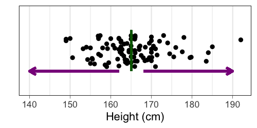

<!--  E cosa sono poi queste media, SD? Sono due delle proprieta' che descrivono i dati

Tendenza centrale (o posizione) -> Individuano il valore intorno al quale i dati sono raggruppati

Dispersione o variabilita'  -> Forniscono un’indicazione della dispersione delle osservazioni intorno al valore centrale -->

---
## Measure of central tendency: mode

:dart: &nbsp;&nbsp;&nbsp; The most frequent item

&nbsp;&nbsp;&nbsp;&nbsp;&nbsp;&nbsp;&nbsp;&nbsp; mode = 26

<!-- se ciascun valore si presenta una volta sola, le nostre osservazioni non hanno moda

Si usa soprattutto per i dati categorici -->

---
### Exercise #8

:question: &nbsp;&nbsp;&nbsp; Calculate the mode of the following data sets

&nbsp;&nbsp;&nbsp;&nbsp;&nbsp;&nbsp;&nbsp;&nbsp;  $y= \{1, 1, 1, 3, 4, 4, 4, 7, 8, 8, 9, 9\}$
&nbsp;&nbsp;&nbsp;&nbsp;&nbsp;&nbsp;&nbsp;&nbsp; $\text{mode}(y)= \text{ } ?$

&nbsp;&nbsp;&nbsp;&nbsp;&nbsp;&nbsp;&nbsp;&nbsp;  $z= \{1, 3, 4, 7, 8, 9, 11, 17, 21, 42\}$
&nbsp;&nbsp;&nbsp;&nbsp;&nbsp;&nbsp;&nbsp;&nbsp; $\text{mode}(z)= \text{ } ?$

<!-- se ciascun valore si presenta una volta sola, le nostre osservazioni non hanno moda

Si usa soprattutto per i dati categorici -->

---
## Measure of central tendency: median

:dart: &nbsp;&nbsp;&nbsp;The "middle" value

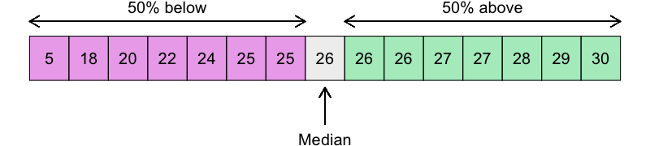

:warning: Data should be sorted!

<!-- Divide l'insieme di dati in due parti uguali, con il numero osservazioni <= mediana uguale a quello >= -->

---
### Exercise #9

:question: &nbsp;&nbsp;&nbsp; Calculate the median of the following data sets

&nbsp;&nbsp;&nbsp;&nbsp;&nbsp;&nbsp;&nbsp;&nbsp;  $x= \{40, 6, 75, 55, 34\}$ 
&nbsp;&nbsp;&nbsp;&nbsp;&nbsp;&nbsp;&nbsp;&nbsp; $\text{median}(x)= \text{ ?}$ 

&nbsp;&nbsp;&nbsp;&nbsp;&nbsp;&nbsp;&nbsp;&nbsp; $y= \{40, 6, 175, 55, 34\}$
&nbsp;&nbsp;&nbsp;&nbsp;&nbsp;&nbsp;&nbsp;&nbsp; $\text{median}(y)=\text{ ?}$ 

<!-- La mediana non e' influenzata da valori anomali o estremi (outliers) -->

---
## Median and outliers

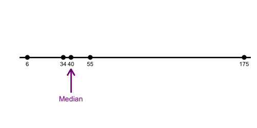

:dart: &nbsp;&nbsp;&nbsp; Robust to outliers

---
## Quartiles

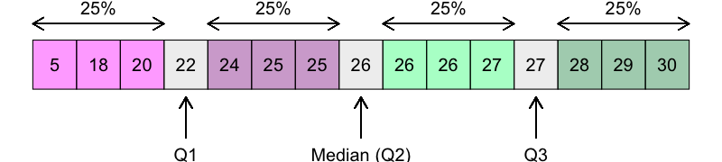

<!-- Mentre la mediana divide i dati in due meta' esatte, molto usati sono anche i quartili, che dividono i dati in 4 parti uguali -->

:warning: Data should be sorted!

---
## Percentiles

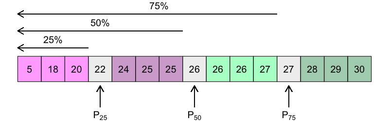

<!-- Mentre la mediana divide i dati in due meta' esatte, molto usati sono anche i quartili, che dividono i dati in 4 parti uguali -->

:warning: Data should be sorted!

<!-- I quartili sono robusti rispetto ai valori anomal, anche se l'ultimo fosse 1000 e il primo -1000 non cambierebbero -->

---
## Measure of central tendency: mean

:dart: &nbsp;&nbsp;&nbsp; (Arithmetic) Mean

$$
{\bar {x}}= {\frac {1}{n}}\left(\sum _{i=1}^{n}{x_{i}}\right)=
{\frac {x_{1}+x_{2}+\dots +x_{n}}{n}}
$$

&nbsp;&nbsp;&nbsp;&nbsp;&nbsp;&nbsp;&nbsp;&nbsp; ${\bar {x}}= \frac{5+18+20+22+24+25+25+26+26+26+27+27+28+29+30}{15}=23.9$

<!-- Somma dei singoli valori diviso il numero di osservazioni  -->

---
### Exercise #10

:question: &nbsp;&nbsp;&nbsp; Calculate the mean of the following data sets

&nbsp;&nbsp;&nbsp;&nbsp;&nbsp;&nbsp;&nbsp;&nbsp;  $x= \{40, 6, 75, 55, 34\}$ 
&nbsp;&nbsp;&nbsp;&nbsp;&nbsp;&nbsp;&nbsp;&nbsp; ${\bar {x}} = \text{ ?}$

&nbsp;&nbsp;&nbsp;&nbsp;&nbsp;&nbsp;&nbsp;&nbsp; $y= \{40, 6, 175, 55, 34\}$ 
&nbsp;&nbsp;&nbsp;&nbsp;&nbsp;&nbsp;&nbsp;&nbsp; ${\bar {y}} = \text{ ?}$

<!-- La media non e' particolarmente robusta rispetto agli outliers. Il valore atipico SOVRADIMENSIONA la media.

Vedremo piu' avanti, con le misure di dispersione, come accopagnare altri valori alla media per evidenziare queste situazioni  -->

<!-- La media non e' particolarmente robusta rispetto agli outliers. Il valore atipico SOVRADIMENSIONA la media.

Vedremo piu' avanti, con le misure di dispersione, come accopagnare altri valori alla media per evidenziare queste situazioni  -->

---
## Mean and outliers

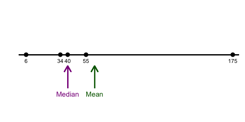

:dart: &nbsp;&nbsp;&nbsp; Sensitive to outliers

---
## The shape of a distribution

<!-- La posizione di moda media e mediana va a definire anche quella che e' la forma della distribuzione, che descrive come una Distribuzione empirica e/o Di- stribuzione di popolazione si distribuisce. 

Si dice che una distribuzione abbia una forma simmetrica quando Moda, Mediana e Media coincidono e dividono la distribuzione stessa in due parti identiche. 

Qualora que- sta condizione non si verificasse, la forma della distribuzione viene detta asimmetrica. 
Una distribuzione asimmetrica positiva `e caratterizzata da una curva in cui i valori sono raggruppati nella parte sinistra, con una lunga coda a destra (anche detta: asimmetrica a destra). 
Viceversa, una distribuzione asimmetrica negativa `e caratterizzata da una curva in cui i valori sono raggruppati nella parte destra, con una lunga coda a sinistra (anche detta: asimmetrica a sinistra). --->

---
## The shape of a distribution

<!-- Si dice che una distribuzione sia bi- o multi-modale quando presenta due o piu` gobbe corrispondenti ai diversi valori che la moda puo` assumere nel campione.
 -->

---
## The shape of a distribution

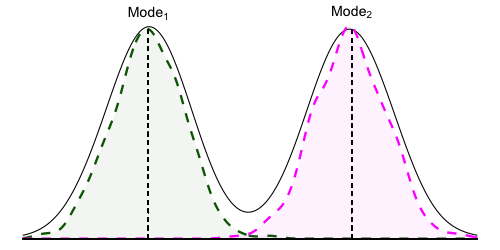

<!-- Solitamente una distribuzione con piu' mode e' l'unione di due distribuzioni distinti (per esempio la circonferenza cranica dei bambini esposti o non esposti al fumo passivo, o i voti di chi ha frequentato o non ha frequentato le lezioni di statistica)
 -->

---
### Exercise #11

:question: &nbsp;&nbsp;&nbsp; In the results section, the authors reported the following

&nbsp;&nbsp;&nbsp;&nbsp;&nbsp;&nbsp;&nbsp;&nbsp; *The mean length of stay was 22.4 days (median: 14 days).*

&nbsp;&nbsp;&nbsp;&nbsp;&nbsp;&nbsp;&nbsp;&nbsp; The shape of the distribution is...

&nbsp;&nbsp;&nbsp;&nbsp;&nbsp;&nbsp;&nbsp;&nbsp; a) symmetric
&nbsp;&nbsp;&nbsp;&nbsp;&nbsp;&nbsp;&nbsp;&nbsp; b) positive skewed 
&nbsp;&nbsp;&nbsp;&nbsp;&nbsp;&nbsp;&nbsp;&nbsp; c) negative skewed
&nbsp;&nbsp;&nbsp;&nbsp;&nbsp;&nbsp;&nbsp;&nbsp; d) I need more information to answer

---
## Measures of dispersion

---
## Measures of dispersion

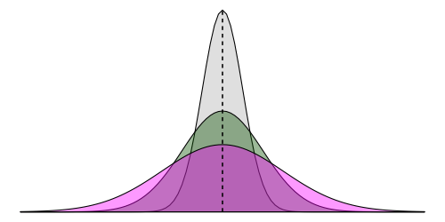

---
## Measure of dispersion: range

:dart: &nbsp;&nbsp;&nbsp; ${\text{range}}= \text{max}-\text{min}$

&nbsp;&nbsp;&nbsp;&nbsp;&nbsp;&nbsp;&nbsp;&nbsp; $\text{range}= 30-5=25$

<!-- INTERVALLO di VARIAZIONE. Il range ha tuttavia un'utilita' limitata, si basa solo sui due valori estremi, senza indicare come si distribuiscono i dati entro l’intervallo e non e' robusta quando ci sono valori anomali 

piu; semplice, meno informativo  Il range ha tuttavia un'utilita' limitata: tiene conto solo di due valori, e non e' robusta quando ci sono valori anomali 

 Non fornisce però informazioni sulla distribuzione delle osservazioni: non è ad esempio possibile capire se i valori siano dispersi o raggruppati in un’estremità…

14 osservazioni-->

---
## Measure of dispersion: interquartile range

:dart: &nbsp;&nbsp;&nbsp; ${\text{IQR}}= \text{Q1}-\text{Q3}$

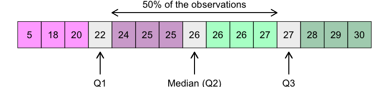

&nbsp;&nbsp;&nbsp;&nbsp;&nbsp;&nbsp;&nbsp;&nbsp; $\text{IQR}= 22 - 27$

<!-- Non sono considerati i valori estremi, ma sappiamo come si distribuisce la meta dei dati rispetto al valore centrale -->

---
## Measure of dispersion: variance

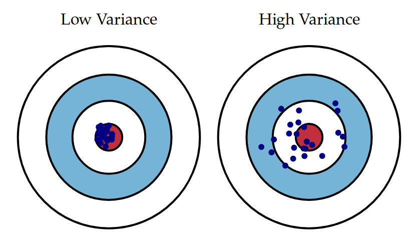

<!-- Misura la distanza media tra le osservazioni e la media del campione. Piu' bassa e' la varianza, piu' le osservazioni saranno vicine alla media  -->

---
## Measure of dispersion: variance

:dart: &nbsp;&nbsp;&nbsp; $s^2 = \frac{1}{n-1}\sum _{i=1}^{n}(x_{i}-\bar {x} )^{2}$ &nbsp;&nbsp;&nbsp;&nbsp;&nbsp;&nbsp;&nbsp;&nbsp; dove &nbsp;&nbsp;&nbsp; ${\bar {x}}= {\frac {1}{n}}\left(\sum _{i=1}^{n}{x_{i}}\right)$ 

${\bar {x}}= 23.9$
$s^2= \frac{(5-23.9)^2+(18-23.9)^2+(20-23.9)^2+ \text{ } \dots \text{ } +(28-23.9)^2+(29-23.9)^2+(30-23.9)^2}{(15-1)}=37.6$

<!-- Andiamo a fare la distanza (differenza) tra ciascun valore e la media, la eleviamo al quatrato, la sommiamo e andiamo a dividerla per la dimensione del campione - 1 -->

---
## Measure of dispersion: standard deviation

:dart: &nbsp;&nbsp;&nbsp; $s = \sqrt{s^2} = \sqrt {{\frac {1}{n-1}}\sum _{i=1}^{n}(x_{i}-\bar {x} )^{2}}$ &nbsp;&nbsp;&nbsp;&nbsp;&nbsp;&nbsp;&nbsp;&nbsp; dove &nbsp;&nbsp;&nbsp; ${\bar {x}}= {\frac {1}{n}}\left(\sum _{i=1}^{n}{x_{i}}\right)$ 

${\bar {x}}= 23.9$
$s= \sqrt{\frac{(5-23.9)^2+(18-23.9)^2+ \text{ } \dots \text{ } +(29-23.9)^2+(30-23.9)^2}{(15-1)}} = \sqrt{37.6}=6.1$

---
## Standard deviation and outliers

:question: &nbsp;&nbsp;&nbsp; What are the standard deviations of these datasets?

&nbsp;&nbsp;&nbsp;&nbsp;&nbsp;&nbsp;&nbsp;&nbsp;  $x= \{40, 6, 75, 55, 34\}$ &nbsp;&nbsp;&nbsp;&nbsp; $\bar{x} = 42$
&nbsp;&nbsp;&nbsp;&nbsp;&nbsp;&nbsp;&nbsp;&nbsp; ${s_{x}} = 25.6$

&nbsp;&nbsp;&nbsp;&nbsp;&nbsp;&nbsp;&nbsp;&nbsp; $y= \{40, 6, 175, 55, 34\}$ &nbsp;&nbsp;&nbsp; $\bar{y} = 62$
&nbsp;&nbsp;&nbsp;&nbsp;&nbsp;&nbsp;&nbsp;&nbsp; ${s_{y}} = 65.6$

:dart: &nbsp;&nbsp;&nbsp; Sensitive to outliers

<!-- che nella varianza l'unità di misura è diversa da quella della variabile su cui è calcolata (abbiamo fatto il quadrato delle fifferenze, ricordate?), si utilizza la sua radice quadrata detta SCARTO QUADRATICO MEDIO o deviazione standard. -->

---
### Exercise #12

:question: &nbsp;&nbsp;&nbsp; In the results section, the authors reported the following

&nbsp;&nbsp;&nbsp;&nbsp;&nbsp;&nbsp;&nbsp;&nbsp; *Coronary-artery calcium scores averaged 68.9&plusmn;244.2 (range 0 to 
&nbsp;&nbsp;&nbsp;&nbsp;&nbsp;&nbsp;&nbsp;&nbsp;  1526) in  patients and 8.8&plusmn;41.8 (range 0 to 243.4) in controls.*

&nbsp;&nbsp;&nbsp;&nbsp;&nbsp;&nbsp;&nbsp;&nbsp; Which measures do we use to describe this variable?

&nbsp;&nbsp;&nbsp;&nbsp;&nbsp;&nbsp;&nbsp;&nbsp; a) mean and standard deviation
&nbsp;&nbsp;&nbsp;&nbsp;&nbsp;&nbsp;&nbsp;&nbsp; b) median and interquartile range 
&nbsp;&nbsp;&nbsp;&nbsp;&nbsp;&nbsp;&nbsp;&nbsp; c) median and standard deviation
&nbsp;&nbsp;&nbsp;&nbsp;&nbsp;&nbsp;&nbsp;&nbsp; d) I need more information to answer

<!-- Valutando i valori numerici (media e DS), come 
con la media e la deviazione standard (come per tutte le altre variabili in tabella) 
con la mediana e il range interquartile (perché la variabile non ha una distribuzione normale) -->

--- 
## Outliers in the wild

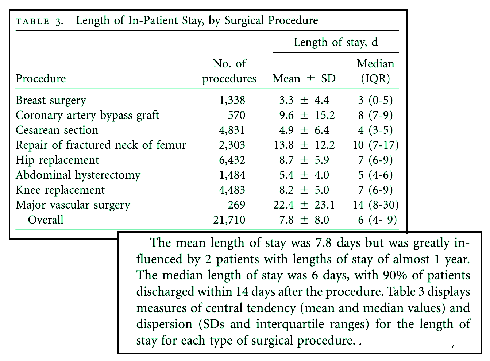

Reilly, J. *et al.*. *Procedure‐Specific Surgical Site Infection Rates and Postdischarge Surveillance in Scotland*,  Infection Control and Hospital Epidemiology, 2006, doi:10.1086/509839  

---
## Parameters *vs*  &nbsp;statistics

- Parameters: calculated on the population 
- Statistics: calculated on the sample 

|  | Parameter| Statistic |
| ----: | :-----: | :----: | 
| Size | $N$ | $n$ |
| Mean | $\mu$ | $\bar{x}$ |
| Standard deviation | $\sigma$ | $s$ |
| Proportion | $\pi$ | $p$ |

<!-- Una cosa che non vi ho detto, ma che ci tornera' utile in seguito e' che la media e la SD di una popolazione si chiamano PARAMETRI e si indicano con le lettere greche media e SD misurati su un campione si chiamano invece STATISTICHE e sono indicati con lettere latine -->

---

# Notes on data visualization

---
## Bar chart

- **Categorical data**
  - absolute frequency
  - relative frequency

 
Visconti A., *et al.*, Total serum *N*‐glycans associate with response to immune checkpoint inhibition therapy and survival in patients with advanced melanoma, BMC Cancer, 2023 doi:10.1186/s12885-023-10511-3

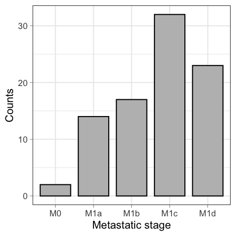

<!-- Diagramma a barre 

Qui vi mostro lo stage metastatico della corte dell'esempio precedente, che e' divisa in 5 classi.

E` considerata uno delle visualizzazioni piu` efficaci per rappresentare dati categorici, anche se noiso

Ciascuna Modalit`a viene rappresentata da una barra, la cui dimensione `e proporzionale alla sua frequenza, assoluta o relativa. 

NON DIRLO: Perch ́e le dimensioni delle barre siano esattamente proporzionali, `e necessario che l’asse delle ordinate inizi dallo zero e non da un punto arbitrario (a questo riguardo vedi anche: Statisticulation).

Sorting bars often add insight.
Avoid filling with color palettes.

Long labels? Think of an horizontal version.
-->

---
## Horizontal bar chart

- **Categorical data**
  - absolute frequency
  - relative frequency

Visconti A., *et al.*, *Total serum *N*‐glycans associate with response to immune checkpoint inhibition therapy and survival in patients with advanced melanoma*, BMC Cancer, 2023 doi:10.1186/s12885-023-10511-3

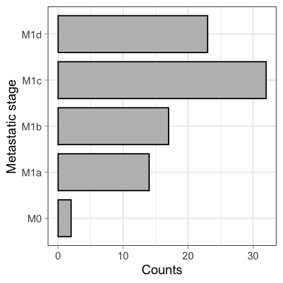

<!-- Diagramma a barre orizzontali 
variazione ulteriore: Circular bar chart, lollipop -->

---
## Horizontal bar chart

- **Categorical data**
  - absolute frequency
  - relative frequency

Visconti A., *et al.*, *Total serum *N*‐glycans associate with response to immune checkpoint inhibition therapy and survival in patients with advanced melanoma*, BMC Cancer, 2023 doi:10.1186/s12885-023-10511-3

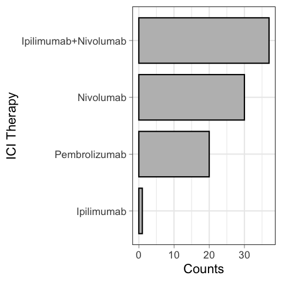

<!-- Diagramma a barre orizzontali 
variazione ulteriore: Circular bar chart, lollipop -->

<!-- ---
## Circular bar chart

- categorical data
  - absolute frequency
  - relative frequency

Visconti, A., *et al.*. *The genetics and epidemiology of N-and O-immunoglobulin A glycomics.*, 2024, doi:10.1186/s13073-024-01369-6

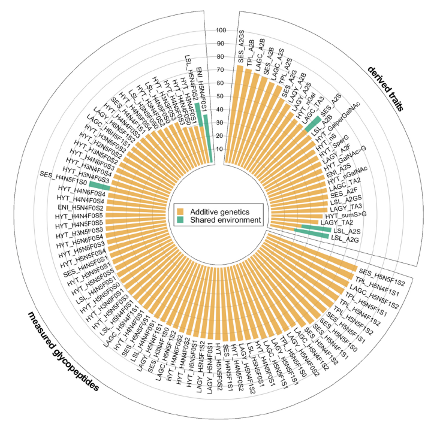

 -->

---
## What information does this graph convey?

- On a scale from 1 to 10, how happy did you feel yesterday?

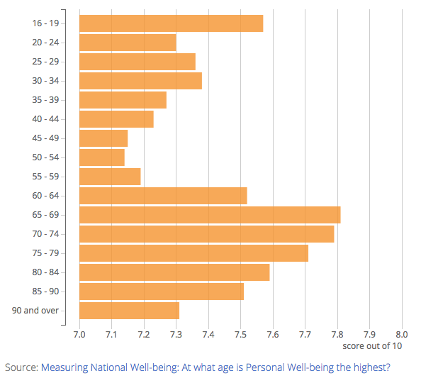

<!-- To demonstrate, let’s take a look at the 16 to 19 and 20 to 24 age groups. It’s natural for people to compare lengths so looking at these two bars you might think that 16 to 19 year olds were almost twice as happy as 20 to 14 year olds, when actually they’re pretty similar – only a difference of 0.27. -->

---

## What information does this graph convey?

- On a scale from 1 to 10, how happy did you feel yesterday?

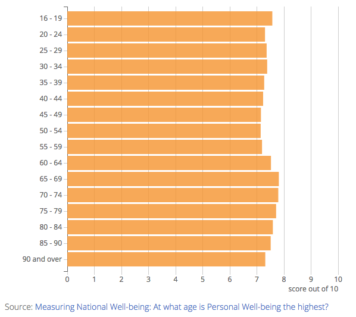

<!-- 
16 to 19 year olds were almost twice as happy as 20 to 14 year olds, when actually they’re pretty similar – only a difference of 0.27.

Ciascuna Modalit`a viene rappresentata da una barra, la cui dimensione `e proporzionale alla sua frequenza, assoluta o relativa. 

Perch ́e le dimensioni delle barre siano esattamente proporzionali, `e necessario che l’asse delle ordinate inizi dallo zero e non da un punto arbitrario (a questo riguardo vedi anche: Statisticulation).

Non e' necessariamente fatto per ingannare, ma i grafici pensavano di migliorare la visualizzazione

Wow, that’s a lot of orange. Any patterns in the data just seem to be dominated the fact that there are lots of bars. So what can we do to focus more on the pattern in the data? 

 -->
---
## What information does this graph convey?

- On a scale from 1 to 10, how happy did you feel yesterday?

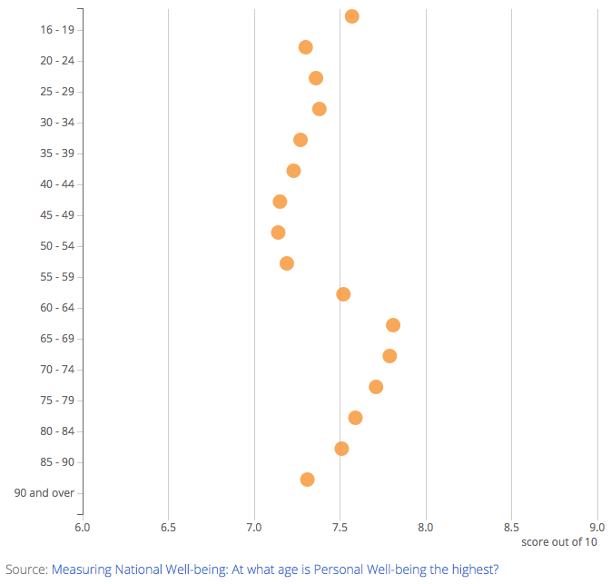

<!-- ne way of managing this would be to move away from using bars entirely, for example, using the position of a dot to mark each data point. The length aspect no longer exists and the reader is forced to look at the position of the data point relative to the x-axis in order to make a comparison between categories. -->

---
### The y-axis should start from 0, but not like this

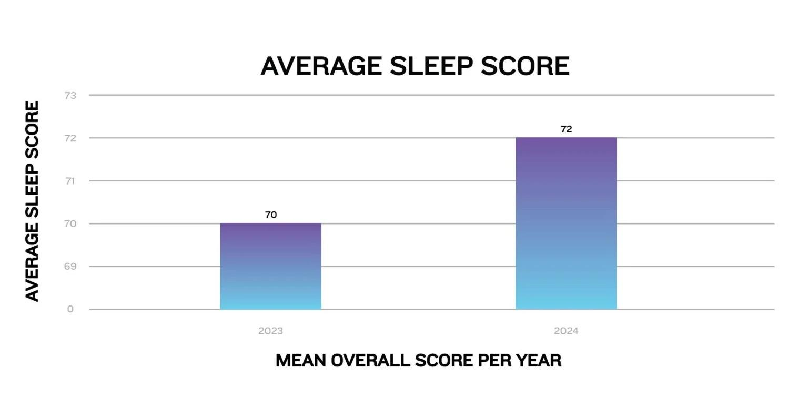

---
## Lollipop chart

- **Categorical data**
  - absolute frequency
  - relative frequency

 
Visconti A., *et al.*, *Total serum *N*‐glycans associate with response to immune checkpoint inhibition therapy and survival in patients with advanced melanoma*, BMC Cancer, 2023 doi:10.1186/s12885-023-10511-3

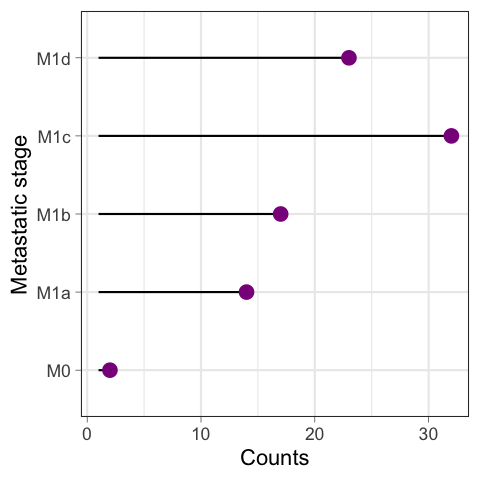

---
## Pie chart

- **Categorical data**
  - relative frequency

 
Visconti A., *et al.*, *Total serum *N*‐glycans associate with response to immune checkpoint inhibition therapy and survival in patients with advanced melanoma*, BMC Cancer, 2023 doi:10.1186/s12885-023-10511-3

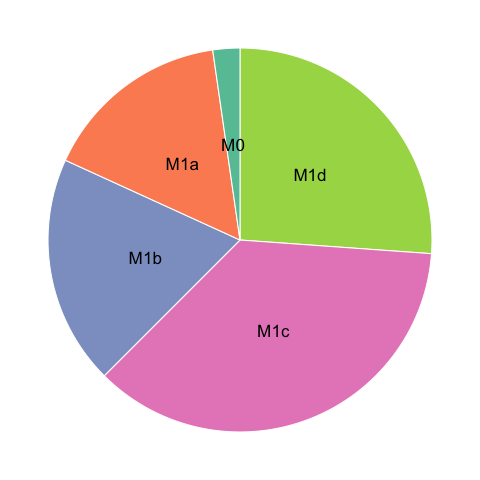

<!-- Diagramma a torta

A pie chart is a circle divided into sectors that each represent a proportion of the whole. It is often used to show proportion, where the sum of the sectors equal 100%.

Pie charts are highly critized and must be avoided as much as possible. Human is very bad at translating angles towards values. 

Don't use it
Don't use 3D.
Don't use a legend, annotate directly each slice.
If displaying proportion, sum must add up to 100.
Don't put several pie charts one beside each other to compare them.

-->

---
## Donut chart

- **Categorical data**
  - relative frequency

 
Visconti A., *et al.*, *Total serum *N*‐glycans associate with response to immune checkpoint inhibition therapy and survival in patients with advanced melanoma*, BMC Cancer, 2023 doi:10.1186/s12885-023-10511-3

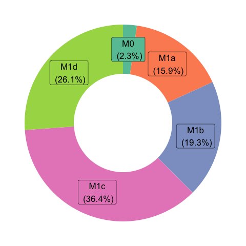

<!-- Diagramma a ciambella - cugino di primo grado. 
Ho migliorato la grafica andando ad annotare le percentuali -->

---
## Waffle chart

- **Categorical data**
  - relative frequency

 
*Visconti A., *et al.*, Total serum *N*‐glycans associate with response to immune checkpoint inhibition therapy and survival in patients with advanced melanoma*, BMC Cancer, 2023 doi:10.1186/s12885-023-10511-3

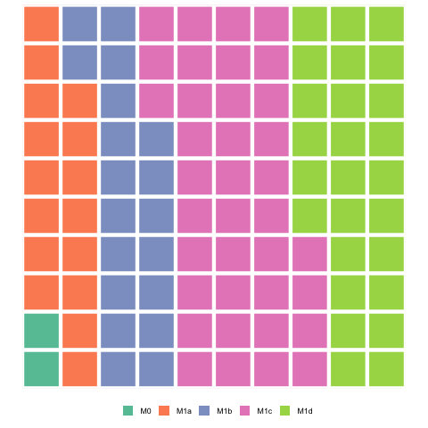

<!-- A Waffle Chart visually represents categorical data through a grid of small squares, resembling a waffle. Each category is assigned a unique color, and the number of squares allocated to each category corresponds to its proportional share of the total data count. 

They are often 10 by 10 grids, where each cell represents 1%. Despite the name, circles, pictograms (such as of people), and other shapes may be used instead of squares. One major benefit to square charts is that smaller percentages, difficult to see on traditional pie charts, can be easily depicted.

Common Mistakes
 sum must add up to 100.

 Possiamo anche farlo con i pittogrammi
 -->

---
## Infographics

Spiegelhalter, D., *The Art of Statistics: Learning From Data*, Pelican, 2019

<!-- Figure 1.4 uses icon arrays to directly represent the expected frequencies of bowel cancer in 100 people.

In Figure 1.4 the ‘cancer’ icons are randomly scattered among the 100. While such scatter has been shown to increase the impression of unpredictability, it should only be used when there is a single additional highlighted icon. There should be no need to count icons in order to make a quick visual comparison.

 -->

---
## Mosaic plot

- **Categorical data**
  - joint relative frequency

 
*Visconti A., *et al.*, Total serum *N*‐glycans associate with response to immune checkpoint inhibition therapy and survival in patients with advanced melanoma*, BMC Cancer, 2023 doi:10.1186/s12885-023-10511-3

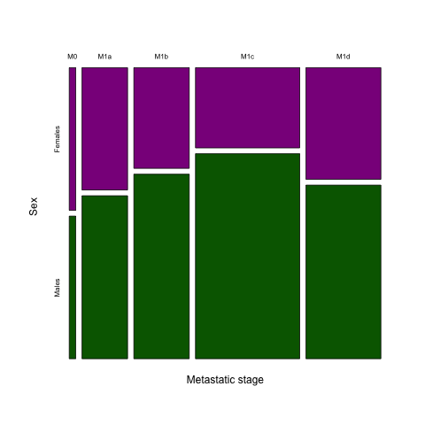

<!-- Mosaic plots provide an ideal method both for visualizing contingency tables.

Sono la proporzione sul Total.  

round(prop.table(freq_a)*100, 0)

      Females Males
  M0        1     1
  M1a       7     9
  M1b       7    12
  M1c      10    26
  M1d      10    16
 -->

---
## Histogram

- **Numerical data**

 
Visconti A., *et al.*, *Total serum *N*‐glycans associate with response to immune checkpoint inhibition therapy and survival in patients with advanced melanoma*, BMC Cancer, 2023 doi:10.1186/s12885-023-10511-3

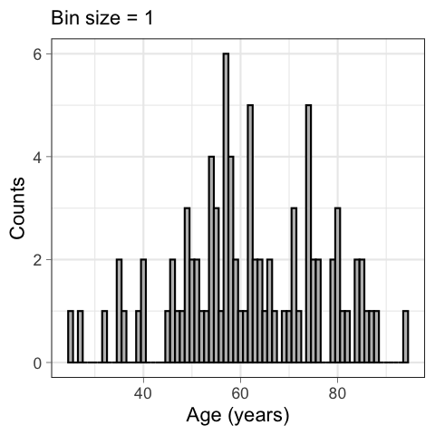

<!-- Un istogramma prende in input una variabile numerica che viene discretizzata in classi (o bins)
and the number of observation per bin is represented by the height of the bar.
.
Play with the bin size, it can give different insight.
 -->

---
## Histogram

- **Numerical data**

 
Visconti A., *et al.*, *Total serum *N*‐glycans associate with response to immune checkpoint inhibition therapy and survival in patients with advanced melanoma*, BMC Cancer, 2023 doi:10.1186/s12885-023-10511-3

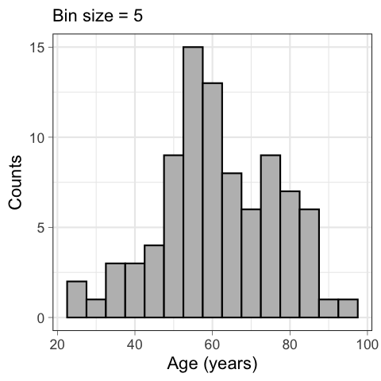

<!-- 
Play with the bin size, it can give different insight.

Avoid filling with color palettes. anche se 
 -->

---
## Histogram

- **Numerical data**

 
Visconti A., *et al.*, *Total serum *N*‐glycans associate with response to immune checkpoint inhibition therapy and survival in patients with advanced melanoma*, BMC Cancer, 2023 doi:10.1186/s12885-023-10511-3

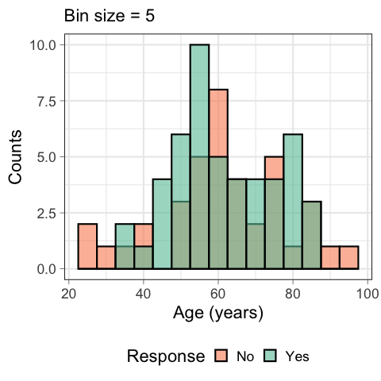

<!--  il colore e' utile per rappresentare la distribution of several variable on the same axis , cosa possibile using this technique.

Anche se a volte pou' essere confuso
 -->

---
## Frequency polygon

- **Numerical data**

 
Visconti A., *et al.*, *Total serum *N*‐glycans associate with response to immune checkpoint inhibition therapy and survival in patients with advanced melanoma*, BMC Cancer, 2023 doi:10.1186/s12885-023-10511-3

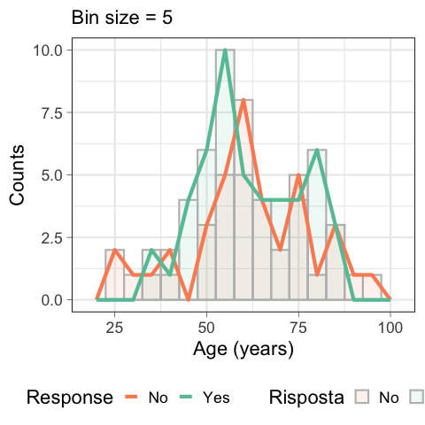

---
## Miami plot/Mirror histogram

- **Numerical data**

 
Visconti A., *et al.*, *Total serum *N*‐glycans associate with response to immune checkpoint inhibition therapy and survival in patients with advanced melanoma*, BMC Cancer, 2023 doi:10.1186/s12885-023-10511-3

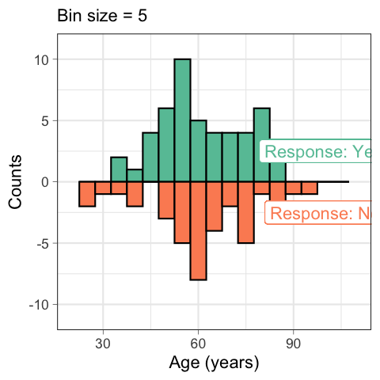

<!-- No legenda, uso i colori, ho fissato gli assi 
Ovviamente si puo' usare solo se ci sono due variabili, ne avessimo 3 o piu' ricadremmo nel caso precedente
-->

---
## Boxplot

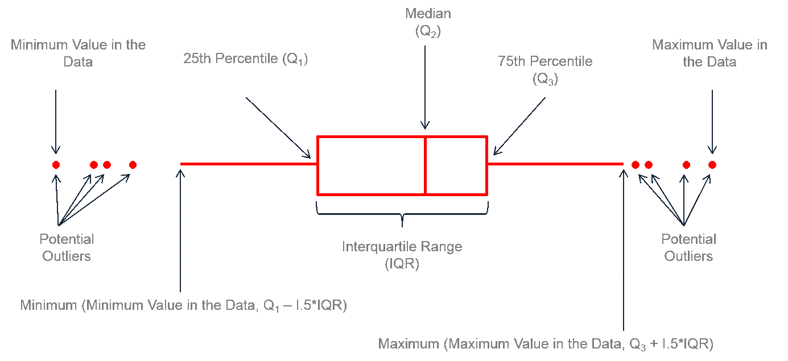

https://r-graph-gallery.com/boxplot

<!-- o box and whiskers plot, o diagramma a scatola e baffi o diagram- ma degli estremi e dei quartili, `e una rappresentazione grafica utilizzata per descrivere la distribuzione di una Variabile continua o una Variabi- le discreta utilizzando sia indici di dispersione (Inter-quartile range) sia di posizione (Mediana e Quartile). Viene rappresentato da un rettangolo (box) e da due segmenti (whiskers o baffi). Il rettangolo `e delimitato dal primo e dal terzo quartile e diviso al suo interno dalla mediana (o secondo quartile). La lunghezza dei segmenti rappresenta 1.5 volte l’interquarti- le range. I punti oltre il segmento rappresentano dei (possibili) Valori estremi. 

Non usare colori
-->

---
## Boxplot

- **Numerical data**

 
Visconti A., *et al.*, Total serum *N*‐glycans associate with response to immune checkpoint inhibition therapy and survival in patients with advanced melanoma, BMC Cancer, 2023 doi:10.1186/s12885-023-10511-3

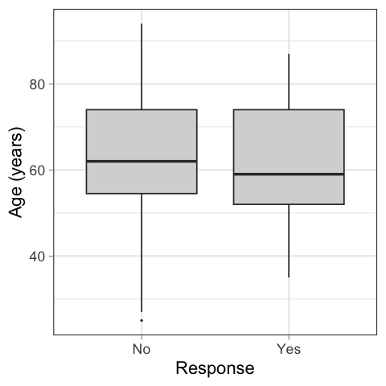

<!-- 
Boxplot hides the sample size of each group, show it with annotation or box width.

Boxplot hides the underlying distribution. Use jitter if low number of data points, or use violin with bigger data.
 -->

---
## Boxplot

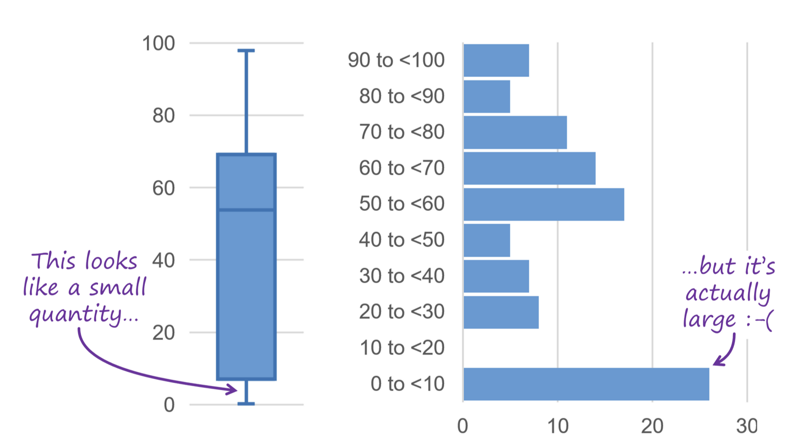

https://nightingaledvs.com/ive-stopped-using-box-plots-should-you/

<!-- 
Boxplot hides the sample size of each group, show it with annotation or box width.

Boxplot hides the underlying distribution. Use jitter if low number of data points, or use violin with bigger data.
 -->

---
## Boxplot

- **Numerical data**

 
Visconti A., *et al.*, *Total serum *N*‐glycans associate with response to immune checkpoint inhibition therapy and survival in patients with advanced melanoma*, BMC Cancer, 2023 doi:10.1186/s12885-023-10511-3

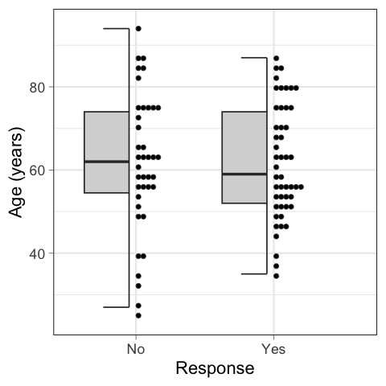

<!-- Boxplot hides the sample size of each group, show it with annotation or box width.

Boxplot hides the underlying distribution. Use jitter if low number of data points, or use violin with bigger data. Leggermente bimodale -->

---
## Data visualisation: DataSaurus Dozen

---
#### The (linear) relationship between two numerical variables

What happened to children who underwent cardiac surgery in certain British hospitals between 1991 and 1995?

Hospital | Surgery | Survivors (N) | Deaths (N) | Survivors (%) | Deaths (%) |
----:    | ----: | ----: | ----: | ----: | ----: |
Bristol |        143 |       102 |     41 |              71.3 |            28.7 |
Leicester |        187 |       162 |     25 |              86.6 |            13.4 |
Leeds |        323 |       299 |     24 |              92.6 |             7.4 |
Oxford |        122 |        99 |     23 |              81.1 |            18.9 |
Guys |        164 |       139 |     25 |              84.8 |            15.2 |
Liverpool |        405 |       363 |     42 |              89.6 |            10.4 |
Southampton |        239 |       215 |     24 |              90.0 |            10.0 |
Great Ormond St |        482 |       429 |     53 |              89.0 |            11.0 |
Newcastle |        195 |       169 |     26 |              86.7 |            13.3 |
Harefield |        177 |       152 |     25 |              85.9 |            14.1 |
Birmingham |        581 |       523 |     58 |              90.0 |            10.0 |
Brompton |        301 |       270 |     31 |              89.7 |            10.3 |

D.J. Spiegelhalter *et al.*, *Commissioned Analysis of Surgical Performance Using Routine Data:   Lessons from the Bristol Inquiry*, 2002, Journal of the Royal Statistical Society Series A: Statistics in Society

<!-- Public concern did not die down, and an official inquiry was ordered: this brought in a team of statisticians who were given the grim task of comparing the survival rates in Bristol with elsewhere in the UK between 1984 and 1995. 

Sto mostrando sia morti che sopravvissuti per evirare positive/negative framing, che abbiamo visto nella lezione introduttiva

Non facile da capire cosa succede, una tabella con molte righe e colonne
 -->

---
## Let's visualize the data

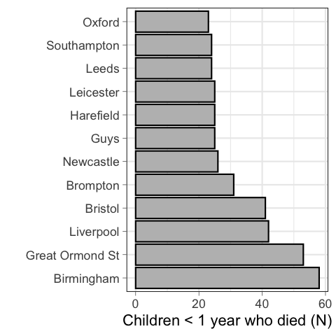

<!-- Come si chiama questa rappresentazione grafica? 
Istogramma 

- label lunghe, meglio in orizzontale
- ordinati per frequenza, cosi' a colpo d'occhio si capisce chi ha piu' o meno morti

Da questo plot, sembrerebbe che Bristol non sia il posto piu' problematico
-->

---
## Let's visualize the data

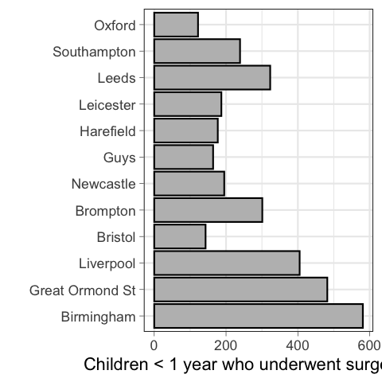

<!-- 
Andiamo ora a metterci il numero totale di interventi

Qui si vede gia' la differenza con Bristol. 
Notate che questa volta li ho ordinati secondo l'ordine utilizzato nel primo plot, per facilitare la comparazione.

Da questa doppia visualizzazione sembrerebbe che ci sia anche una relazione tra le due variabili: piu' unterventi si fanno, piu' morti ci sono

Ma c'e' una visualizzazione (e una statistica) migliore che mi per riassumere questi due aspetti
 -->

---
#### The (linear) relationship between two numerical variables

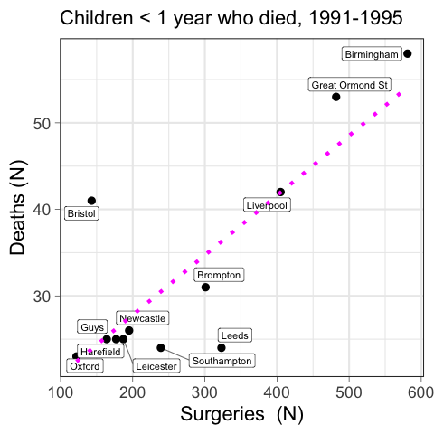

---
#### The (linear) relationship between two numerical variables

Correlation coefficient$^1$

- $r = 0.82$
* $r_\text{no Bristol} = 0.93$

$^1$ Here, Pearson's (originally formulated by Galton). &nbsp;&nbsp; Another correlation coefficients is Spearman's.

<!-- 
A scatterplot displays the relationship between 2 numeric variables. For each data point, the value of its first variable is represented on the X axis, the second on the Y axis
Notare assi non a zero. Per lo scatter va bene.

Correlazione `e una relazione tra due variabili in cui a ciascun valore di una corrisponda un valore dell’altra. 
Pearson correlation coefficient o indice di correlazione di Pearson, `e un in- dice che misura l’esistenza di una relazione lineare (o Correlazione) tra due variabili. Ha un valore compreso tra +1 e −1 , dove +1 corrispon- de alla perfetta correlazione lineare positiva, 0 corrisponde a un’assenza di correlazione lineare e −1 corrisponde alla perfetta correlazione lineare negativa.

There is a considerable interest in the so-called ‘volume effect’ in surgery – the claim that busier hospitals get better survival rates, possibly since they achieve greater efficiency and have more experience.

Attenzione alla causalita':
Osservare una correlazione non implica un nesso di Causalit`a ma segnala la tendenza di una variabile a cambiare in funzione dell’altra (“correlazione non significa causazione”). 
- the high correlation showed that bigger hospitals were associated with lower mortality. But we could not conclude that bigger hospitals caused the lower mortality.
- piccoli ospedali hanno magari casi piu' semplici, che spiegano Leeds & Co 
- oppure better hospitals simply attracted more patients.

launched an investigation after complaints from Joshua’s and other bereaved parents, and in 1998 two surgeons and the ex-chief executive were found guilty of serious medical misconduct. 
-->

---
### Correlation coefficients

- **Do not indicate causality**
- Ranges between $-1$ and  $1$
- The sign indicates the direction of the **linear** relationship
- The absolute value indicates the strenght of the **linear** relationship

| $\|r\|$ | Interpretation |
| ----:    | :---- |
0-0.25 | None or very weak correlation
0.25-0.50 | Moderate correlation
0.50-0.75 | Good correlation
0.75-0.99 | Excellent correlation
1| Perfect correlation

---
### Correlation coefficients

- $r^2 \times 100 = R^2$ (or coefficient of determination) indicates the percentage of variability in one variable that is predicted by the variability of the other variable

&nbsp;&nbsp;&nbsp;&nbsp;&nbsp;&nbsp;&nbsp;&nbsp; $R^2 = r^2 \times 100 = 0.82^2 \times 100 = 0.67 \times 100$  
&nbsp;&nbsp;&nbsp;&nbsp;&nbsp;&nbsp;&nbsp;&nbsp;&nbsp;&nbsp;&nbsp;&nbsp;&nbsp;&nbsp;&nbsp;&nbsp;&nbsp;&nbsp;&nbsp;&nbsp;&nbsp;&nbsp;&nbsp;&nbsp;&nbsp;&nbsp;&nbsp;&nbsp;&nbsp;&nbsp;&nbsp;&nbsp;&nbsp;&nbsp;&nbsp;&nbsp;&nbsp;&nbsp;&nbsp;&nbsp;&nbsp;&nbsp;&nbsp;&nbsp;&nbsp;&nbsp;&nbsp;&nbsp;&nbsp;&nbsp;&nbsp;&nbsp;&nbsp; $\rightarrow$  &nbsp; $67\%$ of the variability

---
## Correlation and outliers

Height (cm) and mean number of points scored

- $r = 0.72$

<!--  -->

<!-- 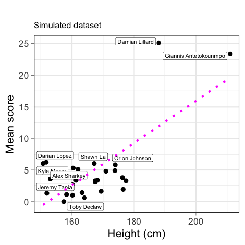 -->

<!-- Lillard 1.88
Adetokumbo 2.11 -->

---
## Correlation and outliers

Height (cm) and mean number of points scored

- $r = 0.72$

<!-- Lillard 1.88
Adetokumbo 2.11 -->

---
## Correlation and outliers

Height (cm) and mean number of points scored

- $r = 0.72$
- $r_\text{no outliers} = 0.07$

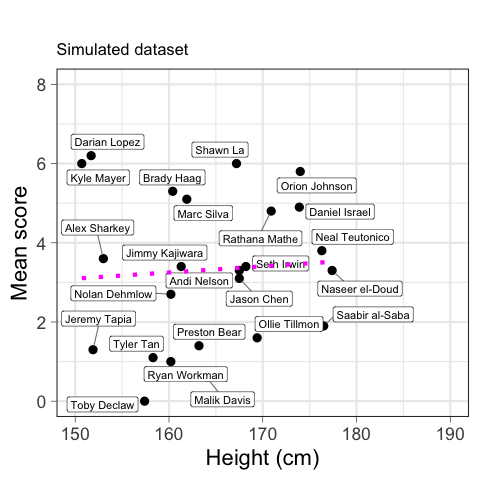

---
## From correlation to linear regression

$y = \alpha + \beta x$

 

$\text{Deaths} = 14 + 0.07 \times \text{Surgeries}$

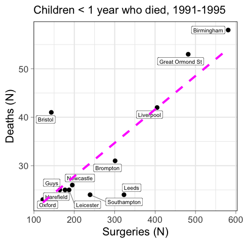

<!-- $\alpha \rightarrow$ intercetta
$\beta \rightarrow$ coefficiente angolare -->

---
## From correlation to linear regression

$y = \alpha + \beta x$

 

$\text{Deaths} = 14 + 0.07 \times \text{Surgeries}$

$\text{Surgeries} = 500$
$\text{Deaths} = 14 + 0.07 \times 500 = 49$

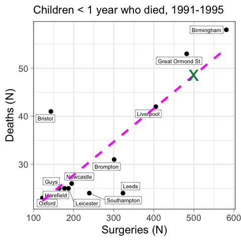

<!-- $\alpha \rightarrow$ intercetta
$\beta \rightarrow$ coefficiente angolare -->

---
### Linear regression: interpolation and extrapolation

 

:question: &nbsp;&nbsp;&nbsp; How many girls named Emma were born in 2004, 2010, 2015, and 2020?

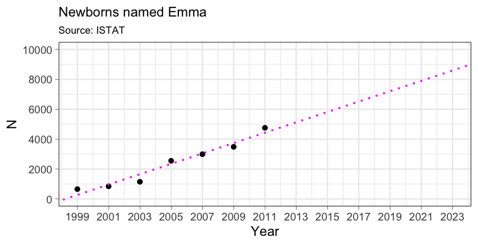

https://www.istat.it/dati/calcolatori/contanomi/

---
### Linear regression: interpolation and extrapolation

 

:question: &nbsp;&nbsp;&nbsp; How many girls named Emma were born in 2004, 2010, 2015, and 2020?

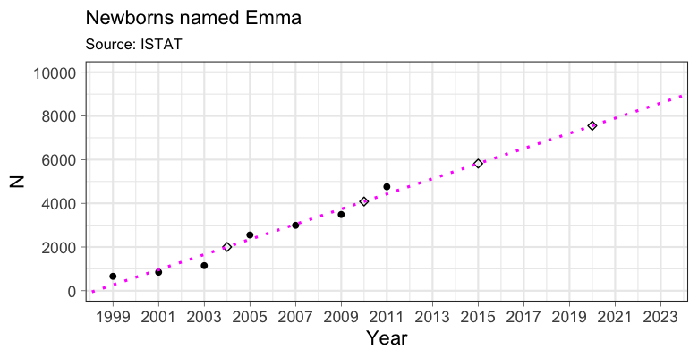

https://www.istat.it/dati/calcolatori/contanomi/

---
### Linear regression: interpolation and extrapolation

 

:question: &nbsp;&nbsp;&nbsp; How many girls named Emma were born in 2004, 2010, 2015, and 2020?

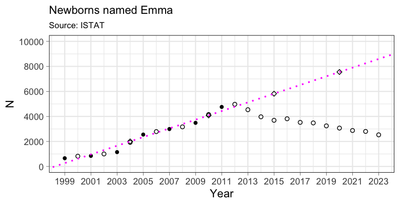

https://www.istat.it/dati/calcolatori/contanomi/

---
## Regression to the mean

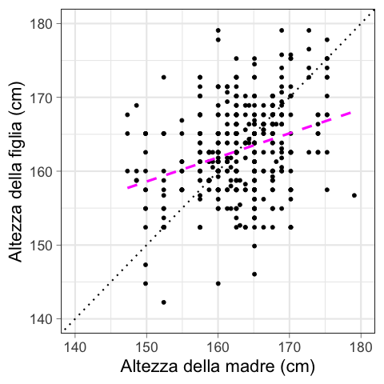

F. Galton, *Regression Towards Mediocrity in Hereditary Stature*, The Journal of the 
Anthropological Institute of Great Britain and Ireland, 1886, https://doi.org/10.2307/2841583

---

## Summary

- Variables describe characteristics of interest
- Their variability depends both on known or knowable factors (such as individual differences and experimental conditions) and on random effects (statistical noise, such as measurement errors).
- Variables can be of different types
- Categorical variables can be summarized with absolute and relative frequencies 
- Numerical variables can be summarized using measures of central tendency, dispersion, and correlation, which can be misleading when empirical distributions are asymmetric 
- Variables can be summarised with multiple graphical representations (but some are better than others), and visualising your data is always a good idea
- Samples are summarised by statistics, populations by parameters

---

# See you tomorrow
