

# Introduction to statistics

### (Day 2)

---

# Recap

---
## Recap

- The collection, organisation, summarisation, and analysis of data   &nbsp;&nbsp;&nbsp; &rarr; *Descriptive* &nbsp;statistics

- The drawing of inferences about a body of data when only a part of the data is observed   &nbsp;&nbsp;&nbsp; &rarr; *Inferential* &nbsp;statistics

- When can't study a population, we select a representative sample
- There are different sampling strategies

<!-- - Individuare in maniera efficiente i tratti importanti delle informazioni che sono state raccolte

- Partire dal particolare per capire come le informazioni si possono estendere alla totalità -->

---
## Recap

- There are different types of variables
- Categorical variables  are described with absolute and relative frequencies
- Numerical variables are described with measures of central tendency, dispersion, and correlation
- Variables can be summarised with multiple graphical representations 
- Parameters (calculated on the population) *vs*&nbsp; statistics (calculated on the sample)

---

# The Normal Distribution 

---
## Learning objectives

- Understand the characteristics of the Normal and the Standard Normal distributions
- Calculate and interpret $z$-scores
- Determine the proportion of individuals in a population who exhibits a certain characteristic
- Calculate the probability that an individual in a population exhibits a certain characteristic

---
## Population distribution

What is the distribution of birth weight among English twins?

$N=1 \text{M}$
$median = 2400\text{ g}$
$\mu = 2400\text{ g}; \text{ } \sigma = 580\text{ g}$

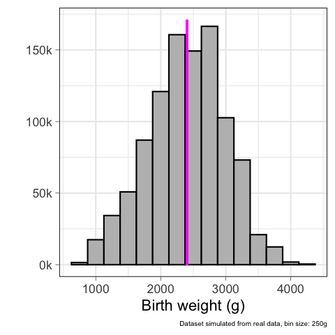

<!-- The population distribution is the pattern made by the birth weights of all these babies, which we can obtain from TwinsUK data on the weights for 1M twins born in the UK from 1917 to 1998 to non-Hispanic white women – although this is not the entire set of twin births, it is such a large sample that we can take it as the population. (sono dati simulati a partire da dati reali) -->

---
## Population distribution

What is the distribution of birth weight among English twins?

$N=1 \text{M}$
$median = 2400\text{ g}$
$\mu = 2400\text{ g}; \text{ } \sigma = 580\text{ g}$

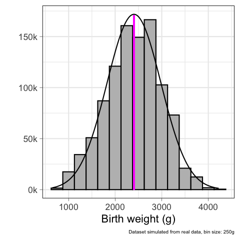

<!-- The shape of this distribution is important. Measurements such as weight, income, height, and so on can, at least in principle, be as fine-grained as desired, and so can be considered ‘continuous’ quantities whose population distributions are smooth. The classic example is the ‘bell-shaped curve’, or normal distribution, first explored in detail by Carl Friedrich Gauss.

Theory shows that the normal distribution can be expected to occur for phenomena that are driven by large numbers of small influences, for example a complex physical trait that is not influenced by just a few genes. 

Figure shows a normal curve with the same mean and standard deviation as the recorded weights. The smooth normal curve and the histogram are gratifyingly close, and other complex traits such as height and cognitive skills also have approximately normal population distributions. 
-->

---
## The Normal distribution

- $\mathcal{N} = (\mu, \sigma^2)$
- $\text{mode} \equiv \text{mean} \equiv \text{median}$
- Symmetrical

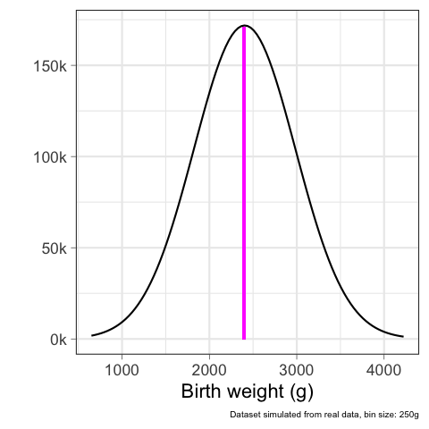

<!-- The normal distribution is characterized by its mean, or expectation, and its standard deviation.

It is an impressive achievement to be able to summarize over a million births by just these two quantities. 
 -->

---
### Exercise #1

:question: &nbsp;&nbsp;&nbsp; Which curve has the largest 
&nbsp;&nbsp;&nbsp;&nbsp;&nbsp;&nbsp;&nbsp;&nbsp; mean?

&nbsp;&nbsp;&nbsp;&nbsp;&nbsp;&nbsp;&nbsp;&nbsp; a) Green
&nbsp;&nbsp;&nbsp;&nbsp;&nbsp;&nbsp;&nbsp;&nbsp; b) Blue
&nbsp;&nbsp;&nbsp;&nbsp;&nbsp;&nbsp;&nbsp;&nbsp; c) Yellow
&nbsp;&nbsp;&nbsp;&nbsp;&nbsp;&nbsp;&nbsp;&nbsp; d) None of the above

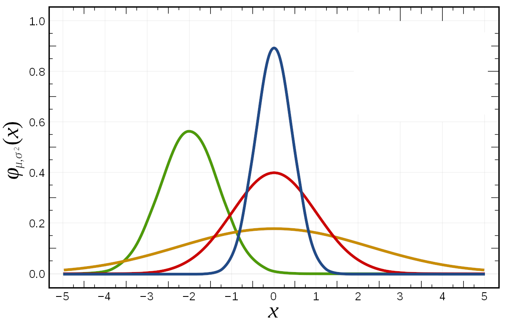

<button id="countdown_exercise_1"></button>

---
### Exercise #1 -- Solution

:question: &nbsp;&nbsp;&nbsp; Which curve has the largest 
&nbsp;&nbsp;&nbsp;&nbsp;&nbsp;&nbsp;&nbsp;&nbsp; mean?

&nbsp;&nbsp;&nbsp;&nbsp;&nbsp;&nbsp;&nbsp;&nbsp; a) Green
&nbsp;&nbsp;&nbsp;&nbsp;&nbsp;&nbsp;&nbsp;&nbsp; b) Blue
&nbsp;&nbsp;&nbsp;&nbsp;&nbsp;&nbsp;&nbsp;&nbsp; c) Yellow
&nbsp;&nbsp;&nbsp;&nbsp;&nbsp;&nbsp;&nbsp;&nbsp; d) None of the above &nbsp; :white_check_mark:

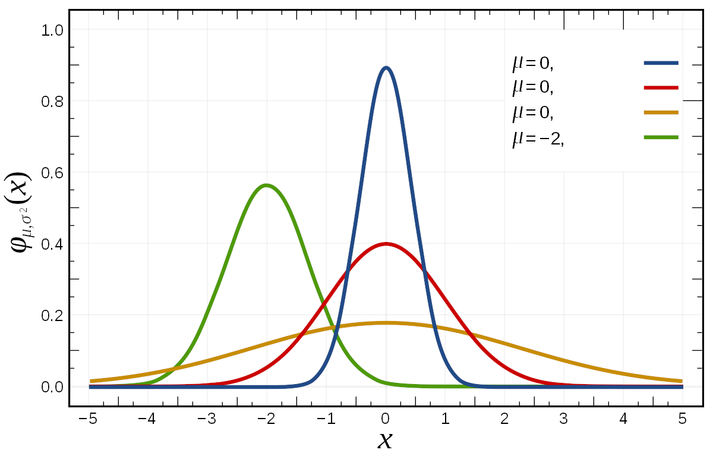

---
### Exercise #2

:question: &nbsp;&nbsp;&nbsp; Which curve has the largest 
&nbsp;&nbsp;&nbsp;&nbsp;&nbsp;&nbsp;&nbsp;&nbsp; standard deviation?

&nbsp;&nbsp;&nbsp;&nbsp;&nbsp;&nbsp;&nbsp;&nbsp; a) Green
&nbsp;&nbsp;&nbsp;&nbsp;&nbsp;&nbsp;&nbsp;&nbsp; b) Blue
&nbsp;&nbsp;&nbsp;&nbsp;&nbsp;&nbsp;&nbsp;&nbsp; c) Yellow
&nbsp;&nbsp;&nbsp;&nbsp;&nbsp;&nbsp;&nbsp;&nbsp; d) None of the above

<button id="countdown_exercise_2"></button>

---
### Exercise #2 -- Solution

:question: &nbsp;&nbsp;&nbsp; Which curve has the largest 
&nbsp;&nbsp;&nbsp;&nbsp;&nbsp;&nbsp;&nbsp;&nbsp; mean?

&nbsp;&nbsp;&nbsp;&nbsp;&nbsp;&nbsp;&nbsp;&nbsp; a) Green
&nbsp;&nbsp;&nbsp;&nbsp;&nbsp;&nbsp;&nbsp;&nbsp; b) Blue
&nbsp;&nbsp;&nbsp;&nbsp;&nbsp;&nbsp;&nbsp;&nbsp; c) Yellow &nbsp;&nbsp;&nbsp; :white_check_mark:
&nbsp;&nbsp;&nbsp;&nbsp;&nbsp;&nbsp;&nbsp;&nbsp; d) None of the above

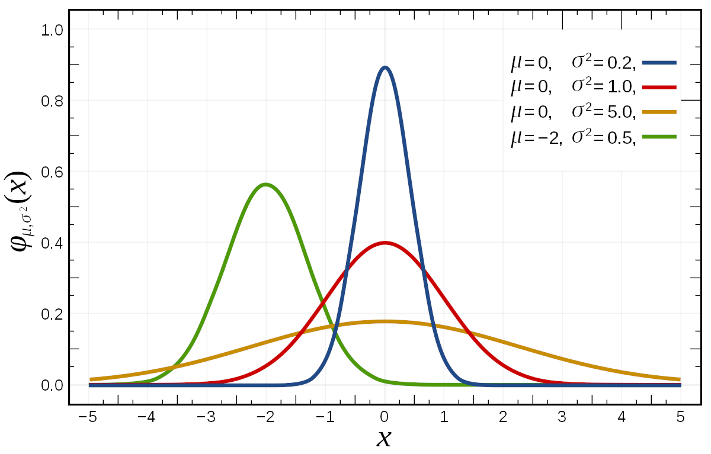

<!-- A diverse combinazioni di mu/sigma corrispondono diverse (e infinte) distribuzioni normali 
-->

---
## Three-sigma rule

- approximately 68% of the values lie within one standard deviations (1 $\sigma$) of the mean

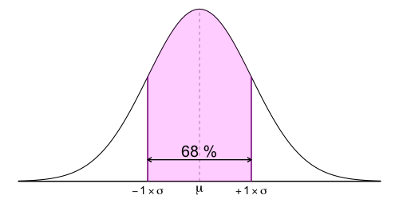

<!-- From the mathematical properties of the normal distribution, we know that roughly 95% of the population will be contained in the interval given by the mean ± two standard deviations, and 99.8% in the central ± three standard deviations. 

68% at 1SD -> valori comuni vs valori inusuali -->

---
## Three-sigma rule

- approximately 68% of the values lie within one standard deviations (1 $\sigma$) of the mean
- approximately 95% lie within 2 $\sigma$ 

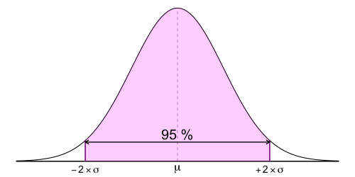

---
## Three-sigma rule

- approximately 68% of the values lie within one standard deviations (1 $\sigma$) of the mean
- approximately 95% lie within 2 $\sigma$ 

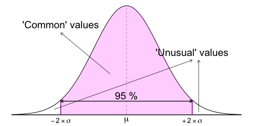

---
## Three-sigma rule

- approximately 68% of the values lie within one standard deviations (1 $\sigma$) of the mean
- approximately 95% lie within 2 $\sigma$ 
- approximately 99.7% lie within 3 $\sigma$ 

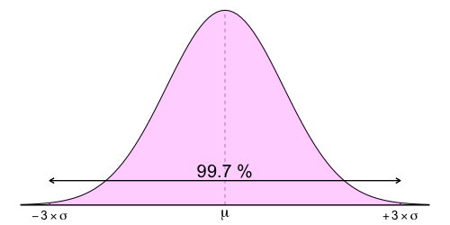

---
## Three-sigma rule

- approximately 68% of the values lie within one standard deviations (1 $\sigma$) of the mean
- approximately 95% lie within 2 $\sigma$ 
- approximately 99.7% lie within 3 $\sigma$ 

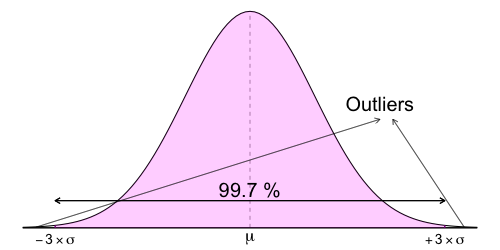

---
## Back to the boxplot.

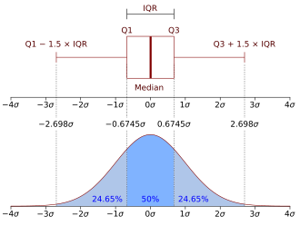

<!-- Se i dati sono distribuiti normalmente c'e' una corrispondenza tra 1.5IQR dal 1o e 3o quartile e le standard deviation dalla media 
1.5 IQR (fence of the boxplot) -> If the data are normally distributed, the fence will be 2.7 standard deviations from the mean, so cases outside of it will be quite rare (0.4%)
-->
-->

---
### Exercise #3

:question: &nbsp;&nbsp;&nbsp; The height of the Italian male population follows a Normal distribution  
&nbsp;&nbsp;&nbsp;&nbsp;&nbsp;&nbsp;&nbsp;&nbsp; with a mean of 170 cm and a standard deviation of 9.5 cm.

&nbsp;&nbsp;&nbsp;&nbsp;&nbsp;&nbsp;&nbsp;&nbsp; Calculate the following values, when possible

&nbsp;&nbsp;&nbsp;&nbsp;&nbsp;&nbsp;&nbsp;&nbsp; a) The median height
&nbsp;&nbsp;&nbsp;&nbsp;&nbsp;&nbsp;&nbsp;&nbsp; b) The proportion of Italian men taller than $170 \text{ cm}$
&nbsp;&nbsp;&nbsp;&nbsp;&nbsp;&nbsp;&nbsp;&nbsp; c) The values considered unusual and/or outliers
&nbsp;&nbsp;&nbsp;&nbsp;&nbsp;&nbsp;&nbsp;&nbsp; d) The most common height
&nbsp;&nbsp;&nbsp;&nbsp;&nbsp;&nbsp;&nbsp;&nbsp; e) The range that includes 68% of the individuals
&nbsp;&nbsp;&nbsp;&nbsp;&nbsp;&nbsp;&nbsp;&nbsp; f) The height of the tallest Italian man

<button id="countdown_exercise_3"></button>

---
### Exercise #3 -- Solution

:question: &nbsp;&nbsp;&nbsp;  The height of the Italian male population follows a Normal distribution  
&nbsp;&nbsp;&nbsp;&nbsp;&nbsp;&nbsp;&nbsp;&nbsp; with a mean of 170 cm and a standard deviation of 9.5 cm.

&nbsp;&nbsp;&nbsp;&nbsp;&nbsp;&nbsp;&nbsp;&nbsp; Calculate the following values, when possible

&nbsp;&nbsp;&nbsp;&nbsp;&nbsp;&nbsp;&nbsp;&nbsp; a) The median height $\rightarrow$ coincide with the mean $= 170 \text{ cm}$
&nbsp;&nbsp;&nbsp;&nbsp;&nbsp;&nbsp;&nbsp;&nbsp; b) The proportion of Italian men taller than $170 \text{ cm}$

---
### Exercise #3 -- Solution

:question: &nbsp;&nbsp;&nbsp;  The height of the Italian male population follows a Normal distribution  
&nbsp;&nbsp;&nbsp;&nbsp;&nbsp;&nbsp;&nbsp;&nbsp; with a mean of 170 cm and a standard deviation of 9.5 cm.

&nbsp;&nbsp;&nbsp;&nbsp;&nbsp;&nbsp;&nbsp;&nbsp; Calculate the following values, when possible

&nbsp;&nbsp;&nbsp;&nbsp;&nbsp;&nbsp;&nbsp;&nbsp; a) The median height $\rightarrow$ 170cm
&nbsp;&nbsp;&nbsp;&nbsp;&nbsp;&nbsp;&nbsp;&nbsp; b) The proportion of Italian men taller than $170 \text{ cm}$ $\rightarrow$ 
&nbsp;&nbsp;&nbsp;&nbsp;&nbsp;&nbsp;&nbsp;&nbsp;&nbsp;&nbsp;&nbsp;&nbsp;&nbsp; those at the right of the median, half of the area under the curve 
&nbsp;&nbsp;&nbsp;&nbsp;&nbsp;&nbsp;&nbsp;&nbsp;&nbsp;&nbsp;&nbsp;&nbsp;&nbsp; $= 50\%$
&nbsp;&nbsp;&nbsp;&nbsp;&nbsp;&nbsp;&nbsp;&nbsp; c) The values considered unusual and/or outliers

---
### Exercise #3 -- Solution

:question: &nbsp;&nbsp;&nbsp;  The height of the Italian male population follows a Normal distribution  
&nbsp;&nbsp;&nbsp;&nbsp;&nbsp;&nbsp;&nbsp;&nbsp; with a mean of 170 cm and a standard deviation of 9.5 cm.

&nbsp;&nbsp;&nbsp;&nbsp;&nbsp;&nbsp;&nbsp;&nbsp; Calculate the following values, when possible

&nbsp;&nbsp;&nbsp;&nbsp;&nbsp;&nbsp;&nbsp;&nbsp; a) The median height $\rightarrow$ 170cm
&nbsp;&nbsp;&nbsp;&nbsp;&nbsp;&nbsp;&nbsp;&nbsp; b) The proportion of Italian men taller than $170 \text{ cm}$ $\rightarrow 50\%$
&nbsp;&nbsp;&nbsp;&nbsp;&nbsp;&nbsp;&nbsp;&nbsp; c) The values considered unusual and/or outliers $\rightarrow$ those $>2$  
&nbsp;&nbsp;&nbsp;&nbsp;&nbsp;&nbsp;&nbsp;&nbsp;&nbsp;&nbsp;&nbsp;&nbsp; standard deviation from the mean $= 170 - 2 \times 9.5  = 151 \text{ cm }$
&nbsp;&nbsp;&nbsp;&nbsp;&nbsp;&nbsp;&nbsp;&nbsp;&nbsp;&nbsp;&nbsp;&nbsp; $\text{and } 170 + 2\times 9.5  = 189 \text{ cm}$
&nbsp;&nbsp;&nbsp;&nbsp;&nbsp;&nbsp;&nbsp;&nbsp; d) The most common height

---
### Exercise #3 -- Solution

:question: &nbsp;&nbsp;&nbsp;  The height of the Italian male population follows a Normal distribution  
&nbsp;&nbsp;&nbsp;&nbsp;&nbsp;&nbsp;&nbsp;&nbsp; with a mean of 170 cm and a standard deviation of 9.5 cm.

&nbsp;&nbsp;&nbsp;&nbsp;&nbsp;&nbsp;&nbsp;&nbsp; Calculate the following values, when possible

&nbsp;&nbsp;&nbsp;&nbsp;&nbsp;&nbsp;&nbsp;&nbsp; a) The median height $\rightarrow$ 170cm
&nbsp;&nbsp;&nbsp;&nbsp;&nbsp;&nbsp;&nbsp;&nbsp; b) The proportion of Italian men taller than $170 \text{ cm}$ $\rightarrow 50\%$
&nbsp;&nbsp;&nbsp;&nbsp;&nbsp;&nbsp;&nbsp;&nbsp; c) The values considered unusual and/or outliers
&nbsp;&nbsp;&nbsp;&nbsp;&nbsp;&nbsp;&nbsp;&nbsp;&nbsp;&nbsp;&nbsp;&nbsp; $\rightarrow \text{ } <151 \text{ cm and }  >189 \text{ cm}$
&nbsp;&nbsp;&nbsp;&nbsp;&nbsp;&nbsp;&nbsp;&nbsp; d) The most common height $\rightarrow$ the mode, which coincides with the 
&nbsp;&nbsp;&nbsp;&nbsp;&nbsp;&nbsp;&nbsp;&nbsp;&nbsp;&nbsp;&nbsp;&nbsp; mean and the median $= 170 \text{ cm}$
&nbsp;&nbsp;&nbsp;&nbsp;&nbsp;&nbsp;&nbsp;&nbsp; e) The range that includes 68% of the individuals

---
### Exercise #3 -- Solution

:question: &nbsp;&nbsp;&nbsp;  The height of the Italian male population follows a Normal distribution  
&nbsp;&nbsp;&nbsp;&nbsp;&nbsp;&nbsp;&nbsp;&nbsp; with a mean of 170 cm and a standard deviation of 9.5 cm.

&nbsp;&nbsp;&nbsp;&nbsp;&nbsp;&nbsp;&nbsp;&nbsp; Calculate the following values, when possible

&nbsp;&nbsp;&nbsp;&nbsp;&nbsp;&nbsp;&nbsp;&nbsp; a) The median height $\rightarrow$ 170cm
&nbsp;&nbsp;&nbsp;&nbsp;&nbsp;&nbsp;&nbsp;&nbsp; b) The proportion of Italian men taller than $170 \text{ cm}$ $\rightarrow 50\%$
&nbsp;&nbsp;&nbsp;&nbsp;&nbsp;&nbsp;&nbsp;&nbsp; c) The values considered unusual and/or outliers
&nbsp;&nbsp;&nbsp;&nbsp;&nbsp;&nbsp;&nbsp;&nbsp;&nbsp;&nbsp;&nbsp;&nbsp; $\rightarrow \text{ } <151 \text{ cm and} >189 \text{ cm}$
&nbsp;&nbsp;&nbsp;&nbsp;&nbsp;&nbsp;&nbsp;&nbsp; d) The most common height $\rightarrow 170 \text{ cm}$
&nbsp;&nbsp;&nbsp;&nbsp;&nbsp;&nbsp;&nbsp;&nbsp; e) The range that includes 68% of the individuals $\rightarrow$  that included 
&nbsp;&nbsp;&nbsp;&nbsp;&nbsp;&nbsp;&nbsp;&nbsp;&nbsp;&nbsp;&nbsp;&nbsp; between $\pm 1$   standard deviation from the mean 
&nbsp;&nbsp;&nbsp;&nbsp;&nbsp;&nbsp;&nbsp;&nbsp;&nbsp;&nbsp;&nbsp;&nbsp; $= 170 - 9.5 \text{ to } 170 + 9.5 \text{ cm } = 160.5 \text{ to } 179.5$
&nbsp;&nbsp;&nbsp;&nbsp;&nbsp;&nbsp;&nbsp;&nbsp; f) The height of the tallest Italian man 

---
### Exercise #3 -- Solution

:question: &nbsp;&nbsp;&nbsp;  The height of the Italian male population follows a Normal distribution  
&nbsp;&nbsp;&nbsp;&nbsp;&nbsp;&nbsp;&nbsp;&nbsp; with a mean of 170 cm and a standard deviation of 9.5 cm.

&nbsp;&nbsp;&nbsp;&nbsp;&nbsp;&nbsp;&nbsp;&nbsp; Calculate the following values, when possible

&nbsp;&nbsp;&nbsp;&nbsp;&nbsp;&nbsp;&nbsp;&nbsp; a) The median height $\rightarrow$ 170cm
&nbsp;&nbsp;&nbsp;&nbsp;&nbsp;&nbsp;&nbsp;&nbsp; b) The proportion of Italian men taller than $170 \text{ cm}$ $\rightarrow 50\%$
&nbsp;&nbsp;&nbsp;&nbsp;&nbsp;&nbsp;&nbsp;&nbsp; c) The values considered unusual and/or outliers
&nbsp;&nbsp;&nbsp;&nbsp;&nbsp;&nbsp;&nbsp;&nbsp;&nbsp;&nbsp;&nbsp;&nbsp; $\rightarrow \text{ } <151 \text{ cm and} >189 \text{ cm}$
&nbsp;&nbsp;&nbsp;&nbsp;&nbsp;&nbsp;&nbsp;&nbsp; d) The most common height $\rightarrow 170 \text{ cm}$
&nbsp;&nbsp;&nbsp;&nbsp;&nbsp;&nbsp;&nbsp;&nbsp; e) The range that includes 68% of the individuals $\rightarrow$  $160.5 \text{ to } 179.5 \text{ cm}$
&nbsp;&nbsp;&nbsp;&nbsp;&nbsp;&nbsp;&nbsp;&nbsp; f) The height of the tallest Italian man $\rightarrow$ we can't calculate this!

---
## Characterize a single observation

Suppose we are caring for a newborn twin who weighs 1450g. 

How can this newborn’s weight be characterized   in relation to the overall population?

---
## Let’s take a step back…

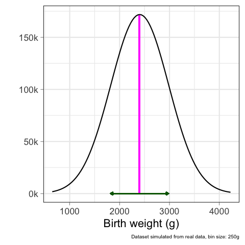

- The mean indicates the center of a distribution
- The standard deviation indicates the "typical" distance from the mean

---
## Characterize a single observation

Suppose we are caring for a newborn twin who weighs 1450g

- The mean indicates the center of a distribution

&nbsp;&nbsp;&nbsp;&nbsp;&nbsp;&nbsp;&nbsp;&nbsp; $x = 1450\text{ g} < \mu = 2400\text{ g}$ &nbsp;&nbsp; $\rightarrow$ &nbsp;&nbsp; $x - \mu = 1450\text{ g}-2400\text{ g}=-950\text{ g}$
&nbsp;&nbsp;&nbsp;&nbsp;&nbsp;&nbsp;&nbsp;&nbsp;&nbsp;&nbsp;&nbsp;&nbsp;&nbsp;&nbsp;&nbsp;&nbsp; $\rightarrow$ The newborn weighs below the mean

---
## Characterize a single observation

Suppose we are caring for a newborn twin who weighs 1450g

- The mean indicates the center of a distribution

&nbsp;&nbsp;&nbsp;&nbsp;&nbsp;&nbsp;&nbsp;&nbsp; $x = 1450\text{ g} < \mu = 2400\text{ g}$ &nbsp;&nbsp; $\rightarrow$ &nbsp;&nbsp; $x - \mu = 1450\text{ g}-2400\text{ g}=-950\text{ g}$
&nbsp;&nbsp;&nbsp;&nbsp;&nbsp;&nbsp;&nbsp;&nbsp;&nbsp;&nbsp;&nbsp;&nbsp;&nbsp;&nbsp;&nbsp;&nbsp; $\rightarrow$ The newborn weighs below the mean

- The standard deviation indicates the "typical" distance from the mean

&nbsp;&nbsp;&nbsp;&nbsp;&nbsp;&nbsp;&nbsp;&nbsp; $|x - \mu| = 950\text{ g} > \sigma = 580\text{ g}$ 
&nbsp;&nbsp;&nbsp;&nbsp;&nbsp;&nbsp;&nbsp;&nbsp;&nbsp;&nbsp;&nbsp;&nbsp;&nbsp;&nbsp;&nbsp;&nbsp; $\rightarrow$ The weight is "atypically" far from the mean
&nbsp;&nbsp;&nbsp;&nbsp;&nbsp;&nbsp;&nbsp;&nbsp;&nbsp;&nbsp;&nbsp;&nbsp;&nbsp;&nbsp;&nbsp;&nbsp; 

---
## Characterize a single observation

Suppose we are caring for a newborn twin who weighs 1450g

- The mean indicates the center of a distribution

&nbsp;&nbsp;&nbsp;&nbsp;&nbsp;&nbsp;&nbsp;&nbsp; $x = 1450\text{ g} < \mu = 2400\text{ g}$ &nbsp;&nbsp; $\rightarrow$ &nbsp;&nbsp; $x - \mu = 1450\text{ g}-2400\text{ g}=-950\text{ g}$
&nbsp;&nbsp;&nbsp;&nbsp;&nbsp;&nbsp;&nbsp;&nbsp;&nbsp;&nbsp;&nbsp;&nbsp;&nbsp;&nbsp;&nbsp;&nbsp; $\rightarrow$ The newborn weighs below the mean

- The standard deviation indicates the "typical" distance from the mean

&nbsp;&nbsp;&nbsp;&nbsp;&nbsp;&nbsp;&nbsp;&nbsp; $|x - \mu| = 950\text{ g} > \sigma = 580\text{ g}$ &nbsp;&nbsp; $\rightarrow$ &nbsp;&nbsp; $\frac{x - \mu}{\sigma} = \frac{-950\text{ g}}{580\text{ g}} = -1.87$
&nbsp;&nbsp;&nbsp;&nbsp;&nbsp;&nbsp;&nbsp;&nbsp;&nbsp;&nbsp;&nbsp;&nbsp;&nbsp;&nbsp;&nbsp;&nbsp; $\rightarrow$ The weight is "atypically" far from the mean
&nbsp;&nbsp;&nbsp;&nbsp;&nbsp;&nbsp;&nbsp;&nbsp;&nbsp;&nbsp;&nbsp;&nbsp;&nbsp;&nbsp;&nbsp;&nbsp; $\rightarrow$ It is an (almost) "unusual" weight

---
## Characterize a single observation

Suppose we are caring for a newborn twin who weighs 1450g

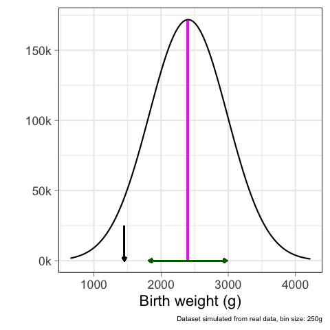

- The mean indicates the center of a distribution
&nbsp;&nbsp;&nbsp;&nbsp; $\rightarrow$ The newborn weighs below the mean

- The standard deviation indicates the "typical" distance from the mean
&nbsp;&nbsp;&nbsp;&nbsp; $\rightarrow$ The weight is "atypically" far from the mean
&nbsp;&nbsp;&nbsp;&nbsp; $\rightarrow$ It is an (almost) "unusual" weight

---
## The $z$-score

&nbsp;&nbsp;&nbsp;&nbsp;&nbsp;&nbsp;&nbsp;&nbsp;&nbsp;&nbsp;&nbsp;&nbsp;&nbsp;&nbsp;&nbsp;&nbsp;&nbsp;&nbsp;&nbsp;&nbsp;&nbsp;&nbsp;&nbsp;&nbsp;&nbsp;&nbsp;&nbsp;&nbsp;&nbsp;&nbsp;&nbsp;&nbsp;&nbsp;&nbsp;&nbsp; $z= \frac{x - \mu}{\sigma}$

- Indicates whether an observation is above or below the population mean
- Indicates whether an observation’s deviation from the mean is large or small relative to the population’s typical deviation

---
### Exercise #4 

:question: &nbsp;&nbsp;&nbsp; Maria suffered a traumatic brain injury following an accident, and the neurologist  
&nbsp;&nbsp;&nbsp;&nbsp;&nbsp;&nbsp;&nbsp;&nbsp; caring for her administered three tests.

&nbsp;&nbsp;&nbsp;&nbsp;&nbsp;&nbsp;&nbsp;&nbsp; $1.$ Memory test: Maria heard words and had to repeat them. She recalled 6 words;
&nbsp;&nbsp;&nbsp;&nbsp;&nbsp;&nbsp;&nbsp;&nbsp;&nbsp;&nbsp;&nbsp;&nbsp; the general population recalls a mean of 7 objects, with a standard deviation of 
&nbsp;&nbsp;&nbsp;&nbsp;&nbsp;&nbsp;&nbsp;&nbsp;&nbsp;&nbsp;&nbsp;&nbsp; 1.3 words.

&nbsp;&nbsp;&nbsp;&nbsp;&nbsp;&nbsp;&nbsp;&nbsp;  $2.$ Object naming test: Maria had to identify objects from drawings. She recognized
&nbsp;&nbsp;&nbsp;&nbsp;&nbsp;&nbsp;&nbsp;&nbsp;&nbsp;&nbsp;&nbsp;&nbsp; 7; the general population recognizes a mean of 10 objects, with a standard deviation 
&nbsp;&nbsp;&nbsp;&nbsp;&nbsp;&nbsp;&nbsp;&nbsp;&nbsp;&nbsp;&nbsp;&nbsp; of 0.59 objects.

&nbsp;&nbsp;&nbsp;&nbsp;&nbsp;&nbsp;&nbsp;&nbsp; $3.$ Stroop test: Maria was given a list of colours written in different inks and had to 
&nbsp;&nbsp;&nbsp;&nbsp;&nbsp;&nbsp;&nbsp;&nbsp;&nbsp;&nbsp;&nbsp;&nbsp; name the ink colour as quickly as possible. She took 15.7 seconds; the general 
&nbsp;&nbsp;&nbsp;&nbsp;&nbsp;&nbsp;&nbsp;&nbsp;&nbsp;&nbsp;&nbsp;&nbsp; population  takes a mean of 16.2 seconds, with a standard deviation of 1.3 seconds.

&nbsp;&nbsp;&nbsp;&nbsp;&nbsp;&nbsp;&nbsp;&nbsp; Based on these results, should the neurologist focus on Maria’s memory, 
&nbsp;&nbsp;&nbsp;&nbsp;&nbsp;&nbsp;&nbsp;&nbsp; object naming ability, or attention in future visits?

<button id="countdown_exercise_4"></button>

---
### Exercise #4 -- Solution

:question: &nbsp;&nbsp;&nbsp; Maria suffered a traumatic brain injury following an accident, and the neurologist  
&nbsp;&nbsp;&nbsp;&nbsp;&nbsp;&nbsp;&nbsp;&nbsp; caring for her administered three tests.

&nbsp;&nbsp;&nbsp;&nbsp;&nbsp;&nbsp;&nbsp;&nbsp; $1.$ Memory test. &nbsp;&nbsp; $x = 6$; &nbsp;&nbsp;  $\mu=7$, &nbsp;&nbsp; $\sigma=1.3$
&nbsp;&nbsp;&nbsp;&nbsp;&nbsp;&nbsp;&nbsp;&nbsp;&nbsp;&nbsp;&nbsp;&nbsp;&nbsp;&nbsp;&nbsp; $z = \frac{6-7}{1.3} = -0.77$

&nbsp;&nbsp;&nbsp;&nbsp;&nbsp;&nbsp;&nbsp;&nbsp;  $2.$ Object naming test. &nbsp;&nbsp; $x = 7$; &nbsp;&nbsp;  $\mu=10$, &nbsp;&nbsp; $\sigma=0.59$
&nbsp;&nbsp;&nbsp;&nbsp;&nbsp;&nbsp;&nbsp;&nbsp;&nbsp;&nbsp;&nbsp;&nbsp;&nbsp;&nbsp;&nbsp; $z = \frac{7-10}{0.59} = -5.09$

&nbsp;&nbsp;&nbsp;&nbsp;&nbsp;&nbsp;&nbsp;&nbsp; $3.$ Stroop test. &nbsp;&nbsp; $x = 15.7$; &nbsp;&nbsp;  $\mu=16.2$, &nbsp;&nbsp; $\sigma=1.3$
&nbsp;&nbsp;&nbsp;&nbsp;&nbsp;&nbsp;&nbsp;&nbsp;&nbsp;&nbsp;&nbsp;&nbsp;&nbsp;&nbsp;&nbsp; $z = \frac{15.7-16.2}{1.3} = -0.39$

&nbsp;&nbsp;&nbsp;&nbsp;&nbsp;&nbsp;&nbsp;&nbsp; Based on these results, should the neurologist focus on Maria’s memory, 
&nbsp;&nbsp;&nbsp;&nbsp;&nbsp;&nbsp;&nbsp;&nbsp; object naming ability, or attention in future visits?

---
### Exercise #4 -- Solution

:question: &nbsp;&nbsp;&nbsp; Maria suffered a traumatic brain injury following an accident, and the neurologist  
&nbsp;&nbsp;&nbsp;&nbsp;&nbsp;&nbsp;&nbsp;&nbsp; caring for her administered three tests.

&nbsp;&nbsp;&nbsp;&nbsp;&nbsp;&nbsp;&nbsp;&nbsp; $1.$ Memory test. &nbsp;&nbsp; $x = 6$; &nbsp;&nbsp;  $\mu=7$, &nbsp;&nbsp; $\sigma=1.3$
&nbsp;&nbsp;&nbsp;&nbsp;&nbsp;&nbsp;&nbsp;&nbsp;&nbsp;&nbsp;&nbsp;&nbsp;&nbsp;&nbsp;&nbsp; $z = \frac{6-7}{1.3} = -0.77$

&nbsp;&nbsp;&nbsp;&nbsp;&nbsp;&nbsp;&nbsp;&nbsp;  $2.$ Object naming test. &nbsp;&nbsp; $x = 7$; &nbsp;&nbsp;  $\mu=10$, &nbsp;&nbsp; $\sigma=0.59$
&nbsp;&nbsp;&nbsp;&nbsp;&nbsp;&nbsp;&nbsp;&nbsp;&nbsp;&nbsp;&nbsp;&nbsp;&nbsp;&nbsp;&nbsp; $z = \frac{7-10}{0.59} = -5.09$

&nbsp;&nbsp;&nbsp;&nbsp;&nbsp;&nbsp;&nbsp;&nbsp; $3.$ Stroop test. &nbsp;&nbsp; $x = 15.7$; &nbsp;&nbsp;  $\mu=16.2$, &nbsp;&nbsp; $\sigma=1.3$
&nbsp;&nbsp;&nbsp;&nbsp;&nbsp;&nbsp;&nbsp;&nbsp;&nbsp;&nbsp;&nbsp;&nbsp;&nbsp;&nbsp;&nbsp; $z = \frac{15.7-16.2}{1.3} = -0.39$

&nbsp;&nbsp;&nbsp;&nbsp;&nbsp;&nbsp;&nbsp;&nbsp; Based on these results, should the neurologist focus on Maria’s memory, 
&nbsp;&nbsp;&nbsp;&nbsp;&nbsp;&nbsp;&nbsp;&nbsp; object naming ability, or attention in future visits?

&nbsp;&nbsp;&nbsp;&nbsp;&nbsp;&nbsp;&nbsp;&nbsp;&nbsp;&nbsp;&nbsp;&nbsp;&nbsp;&nbsp;&nbsp; $\rightarrow$ object naming ability

---
## The Standard Normal distribution

- $z = \frac{x - \mu}{\sigma}$
- $\mathcal{N} = (\mu, \sigma^2) \rightarrow Z = (0, 1)$

</duv>

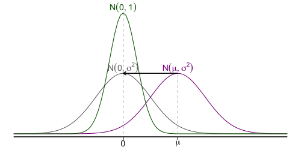

---
## The Standard Normal distribution

- $Z = (0, 1)$
- Area under the curve. $= 1$
- proportion $\equiv$ probability

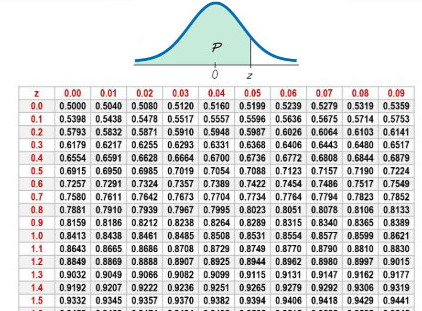

<!-- 
this is also known as her Z-score, which simply measures how many standard deviations a data-point is from the mean.

E perche la SND ci piace? Perche' esistono delle tavole che ci dicono qual e' l'area sottesa  ad una certa porzione della curva, che corrispondono alla probabilita' di trovare (nel caso di queste tavole) un valore < di quello osservato (area colorata)

Ci sono diverse versioni di queste tabelle, per esempio quella complementare che riporta l'area per la zona bianca (probabilita' di osservare valori piu' estremi) -->

---
## Proportion $\equiv$ probability

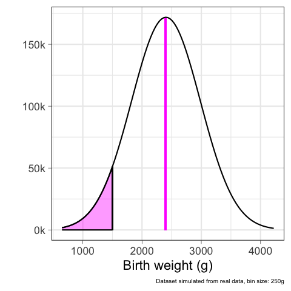

- 6% of twins are born with very low birth weight (< 1500g)
- The probability of being born with very low birth weight is 0.06

But how was it calculated? &nbsp;&nbsp;&nbsp;&nbsp;&nbsp;&nbsp;&nbsp;&nbsp; 

---
## Let’s calculate the probability/proportion.

&nbsp;&nbsp;&nbsp; What is the probability that a twin is born with very low birth weight?

&nbsp;&nbsp;&nbsp;&nbsp;&nbsp;&nbsp;&nbsp;&nbsp; $\mathcal{N} = (2400, 580^2)$

---
## Let’s calculate the probability/proportion.

&nbsp;&nbsp;&nbsp; What is the probability that a twin is born with very low birth weight?

&nbsp;&nbsp;&nbsp;&nbsp;&nbsp;&nbsp;&nbsp;&nbsp; $\mathcal{N} = (2400, 580^2)$

&nbsp;&nbsp;&nbsp;&nbsp;&nbsp;&nbsp;&nbsp;&nbsp; 1. Compute the $z$-score
&nbsp;&nbsp;&nbsp;&nbsp;&nbsp;&nbsp;&nbsp;&nbsp;&nbsp;&nbsp;&nbsp; $z = \frac{x - \mu}{\sigma} = \frac{1500-2400}{580} = \frac{-900}{580} = -1.55$

---
## Let’s calculate the probability/proportion.

&nbsp;&nbsp;&nbsp; What is the probability that a twin is born with very low birth weight?

&nbsp;&nbsp;&nbsp;&nbsp;&nbsp;&nbsp;&nbsp;&nbsp; $\mathcal{N} = (2400, 580^2)$

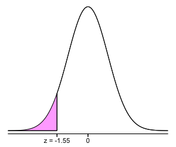

&nbsp;&nbsp;&nbsp;&nbsp;&nbsp;&nbsp;&nbsp;&nbsp; 1. Compute the $z$-score
&nbsp;&nbsp;&nbsp;&nbsp;&nbsp;&nbsp;&nbsp;&nbsp;&nbsp;&nbsp;&nbsp; $z = \frac{x - \mu}{\sigma} = \frac{1500-2400}{580} = \frac{-900}{580} = -1.55$

&nbsp;&nbsp;&nbsp;&nbsp;&nbsp;&nbsp;&nbsp;&nbsp; 2. Draw a Normal Distribution, and 
&nbsp;&nbsp;&nbsp;&nbsp;&nbsp;&nbsp;&nbsp;&nbsp;&nbsp;&nbsp;&nbsp;&nbsp;  shade the area we are interested in

---
## Let’s calculate the probability/proportion.

&nbsp;&nbsp;&nbsp; What is the probability that a twin is born with very low birth weight?

&nbsp;&nbsp;&nbsp;&nbsp;&nbsp;&nbsp;&nbsp;&nbsp; $\mathcal{N} = (2400, 580^2)$

&nbsp;&nbsp;&nbsp;&nbsp;&nbsp;&nbsp;&nbsp;&nbsp; 1. Compute the $z$-score
&nbsp;&nbsp;&nbsp;&nbsp;&nbsp;&nbsp;&nbsp;&nbsp;&nbsp;&nbsp;&nbsp; $z = \frac{x - \mu}{\sigma} = \frac{1500-2400}{580} = \frac{-900}{580} = -1.55$

&nbsp;&nbsp;&nbsp;&nbsp;&nbsp;&nbsp;&nbsp;&nbsp; 2. Draw a Normal Distribution, and 
&nbsp;&nbsp;&nbsp;&nbsp;&nbsp;&nbsp;&nbsp;&nbsp;&nbsp;&nbsp;&nbsp;&nbsp;  shade the area we are interested in

&nbsp;&nbsp;&nbsp;&nbsp;&nbsp;&nbsp;&nbsp;&nbsp; 3. Use a Unit Normal Table to find 
&nbsp;&nbsp;&nbsp;&nbsp;&nbsp;&nbsp;&nbsp;&nbsp;&nbsp;&nbsp;&nbsp;&nbsp; the area of the shaded curve

---
## Let’s calculate the probability/proportion.

&nbsp;&nbsp;&nbsp; What is the probability that a twin is born with very low birth weight?

&nbsp;&nbsp;&nbsp;&nbsp;&nbsp;&nbsp;&nbsp;&nbsp; $\mathcal{N} = (2400, 580^2)$

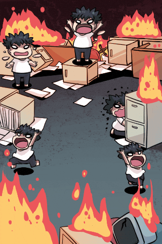

&nbsp;&nbsp;&nbsp;&nbsp;&nbsp;&nbsp;&nbsp;&nbsp; 1. Compute the $z$-score
&nbsp;&nbsp;&nbsp;&nbsp;&nbsp;&nbsp;&nbsp;&nbsp;&nbsp;&nbsp;&nbsp; $z = \frac{x - \mu}{\sigma} = \frac{1500-2400}{580} = \frac{-900}{580} = -1.55$

&nbsp;&nbsp;&nbsp;&nbsp;&nbsp;&nbsp;&nbsp;&nbsp; 2. Draw a Normal Distribution, and 
&nbsp;&nbsp;&nbsp;&nbsp;&nbsp;&nbsp;&nbsp;&nbsp;&nbsp;&nbsp;&nbsp;&nbsp;  shade the area we are interested in

&nbsp;&nbsp;&nbsp;&nbsp;&nbsp;&nbsp;&nbsp;&nbsp; 3. Use a Unit Normal Table to find 
&nbsp;&nbsp;&nbsp;&nbsp;&nbsp;&nbsp;&nbsp;&nbsp;&nbsp;&nbsp;&nbsp;&nbsp; the area of the shaded curve
&nbsp;&nbsp;&nbsp;&nbsp;&nbsp;&nbsp;&nbsp;&nbsp;&nbsp;&nbsp;&nbsp;&nbsp;&nbsp; $\rightarrow$ There are no negative z-scores

---
## Find the area of the shaded curve

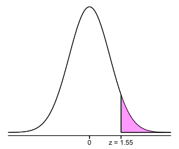

---
## Find the area of the shaded curve

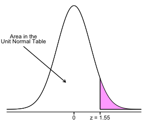

---
## Compute the probability/proportion

&nbsp;&nbsp;&nbsp; What is the probability that a twin is born with very low birth weight?

&nbsp;&nbsp;&nbsp;&nbsp;&nbsp;&nbsp;&nbsp;&nbsp; $\mathcal{N} = (2400, 580^2)$

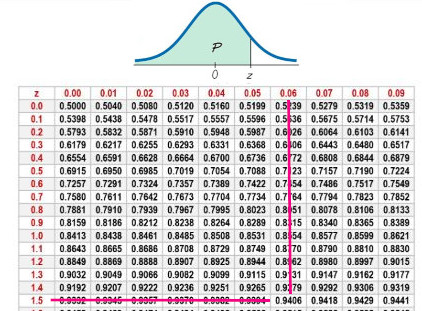

&nbsp;&nbsp;&nbsp;&nbsp;&nbsp;&nbsp;&nbsp;&nbsp; 1. Compute the $z$-score
&nbsp;&nbsp;&nbsp;&nbsp;&nbsp;&nbsp;&nbsp;&nbsp;&nbsp;&nbsp;&nbsp; $z = \frac{x - \mu}{\sigma} = \frac{1500-2400}{580} = \frac{-900}{580} = -1.55$

&nbsp;&nbsp;&nbsp;&nbsp;&nbsp;&nbsp;&nbsp;&nbsp; 2. Draw a Normal Distribution, and 
&nbsp;&nbsp;&nbsp;&nbsp;&nbsp;&nbsp;&nbsp;&nbsp;&nbsp;&nbsp;&nbsp;&nbsp;  shade the area we are interested in

&nbsp;&nbsp;&nbsp;&nbsp;&nbsp;&nbsp;&nbsp;&nbsp; 3. Use a Unit Normal Table to find 
&nbsp;&nbsp;&nbsp;&nbsp;&nbsp;&nbsp;&nbsp;&nbsp;&nbsp;&nbsp;&nbsp;&nbsp; the area of the shaded curve

&nbsp;&nbsp;&nbsp;&nbsp;&nbsp;&nbsp;&nbsp;&nbsp;&nbsp;&nbsp;&nbsp; $\mathcal{P} = 1 - 0.9394 = 0.0606 \rightarrow 6.06\%$

<!-- Fare vedere che la curva e' simmetrica quindi possiamo usare 1.56 per conoscere l'area -->

---
### Exercise #5

:question: &nbsp;&nbsp;&nbsp;  Not knowing that the baby is a twin, the pediatrician tells the mother that 
&nbsp;&nbsp;&nbsp;&nbsp;&nbsp;&nbsp;&nbsp;&nbsp; a birth weight below 2500 g is unusual. Is it really unusual?

&nbsp;&nbsp;&nbsp;&nbsp;&nbsp;&nbsp;&nbsp;&nbsp; $\mu = 2404\text{ g}; \text{ } \sigma = 580\text{ g}$

<button id="countdown_Exercise_5"></button>

 

<!-- For medical rather than statistical reasons, babies below 2,500 g are considered ‘low birth weight’, and those below 1,500 g ‘very low birth weight’.  -->

---
### Exercise #5 -- Solution

:question: &nbsp;&nbsp;&nbsp;  Not knowing that the baby is a twin, the pediatrician tells the mother that 
&nbsp;&nbsp;&nbsp;&nbsp;&nbsp;&nbsp;&nbsp;&nbsp; a birth weight below 2500 g is unusual. Is it really unusual?

&nbsp;&nbsp;&nbsp;&nbsp;&nbsp;&nbsp;&nbsp;&nbsp; $\mu = 2404\text{ g}; \text{ } \sigma = 580\text{ g}$

&nbsp;&nbsp;&nbsp;&nbsp;&nbsp;&nbsp;&nbsp;&nbsp; $\mathcal{z} = \frac{x - \mu}{\sigma} =  \frac{2500 - 2404}{580} = 0.17$

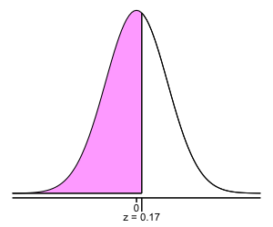

 

---
### Exercise #5 -- Solution

:question: &nbsp;&nbsp;&nbsp;  Not knowing that the baby is a twin, the pediatrician tells the mother that 
&nbsp;&nbsp;&nbsp;&nbsp;&nbsp;&nbsp;&nbsp;&nbsp; a birth weight below 2500 g is unusual. Is it really unusual?

&nbsp;&nbsp;&nbsp;&nbsp;&nbsp;&nbsp;&nbsp;&nbsp; $\mu = 2404\text{ g}; \text{ } \sigma = 580\text{ g}$

&nbsp;&nbsp;&nbsp;&nbsp;&nbsp;&nbsp;&nbsp;&nbsp; $\mathcal{z} = \frac{x - \mu}{\sigma} =  \frac{2500 - 2404}{580} = 0.17$

&nbsp;&nbsp;&nbsp;&nbsp;&nbsp;&nbsp;&nbsp;&nbsp; $\mathcal{P}(x < 2500) = 0.5675 \rightarrow 56.75\%$

 

---
## Percentiles

<!-- Mentre la median divide i dati in due meta' esatte, molto usati sono anche i quartili, che dividono i dati in 4 parti uguali -->

&nbsp;&nbsp;&nbsp;&nbsp;&nbsp;&nbsp;&nbsp;&nbsp;&nbsp;&nbsp;&nbsp; $\mathcal{P} = 0.57$ tells us that our newborn twin is in the 57th percentile

---
## Summary

- Many natural phenomena follow a Normal distribution
- The Normal distribution is defined by the mean and standard deviation and corresponds to a probability distribution
- A population’s Normal distribution allows us to determine both the probability of observing a certain value and its expected frequency
- If the data follow a Normal distribution, approximately 68% of values lie within 1 standard deviation of the mean, 95% within 2, and 99.7% within 3
- The z-score allows us to position an observation relative to the reference population and to compare data from very different distributions

---

# Estimates and Confidence Intervals 

<!--- Partire dal particolare per capire come le informazioni si possono estendere alla totalità -->

---
## Learning objectives

- Be able to use sample statistics to infer population parameters
- Be able to communicate the uncertainty of a statistic
- Be able to calculate and interpret a confidence interval

---
## &nbsp;&nbsp;&nbsp; :warning:  Disclaimer  :warning:

&nbsp;&nbsp;&nbsp;&nbsp;&nbsp;&nbsp;&nbsp;&nbsp; If this part seems complex, it’s because it really is.

&nbsp;&nbsp;&nbsp;&nbsp;&nbsp;&nbsp;&nbsp;&nbsp; You may need to spend some time fully understanding it
&nbsp;&nbsp;&nbsp;&nbsp;&nbsp;&nbsp;&nbsp;&nbsp; Don’t worry, we’ve all been there!

---
## From sample to population

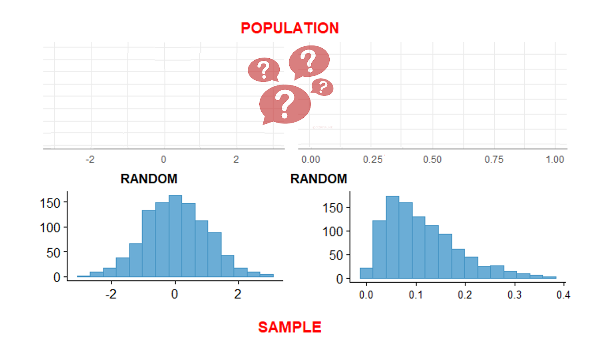

<!-- Ricapitoliamo: quando non possiamo studiare una popolazione ne usiamo un campione rappresentativo -->

---
## From sample to population

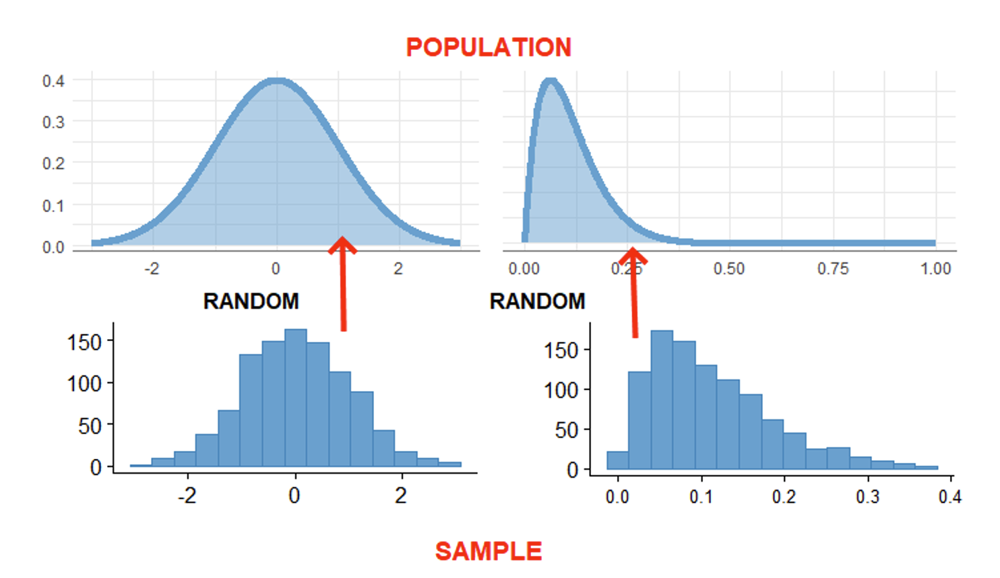

<!-- e poi usiamo le informazioni raccolte dal campione per trarre delle conclusioni sulla popolazione 
Questo processo si chiama statistica inferenziale,

Procedimento induttivo che ha lo scopo di stimare i parametri (caratteristiche) sconosciuti della popolazione a partire dalle statistiche (stime conosciute) del campione 

Sulla base di un campione estratto casualmente da 1 popolazione cosa può essere detto circa la popolazione da cui il campione è stato estratto? -->

---
##  Sampling error

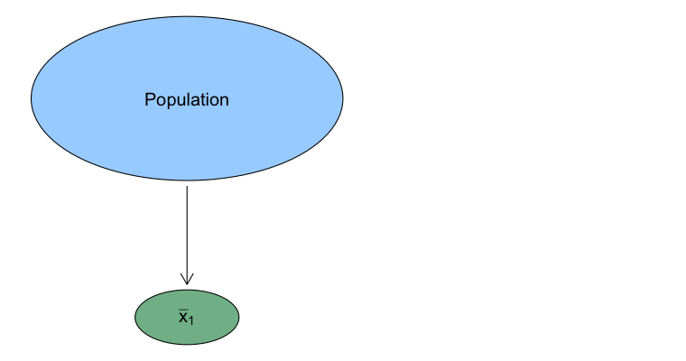

<!--  Sampling error occurs when the sample’s characteristics differ from the population’s characteristics. The greater the discrepancy, the greater the sampling error.  

If a sample had dramatically different characteristics than the population, it would provide sample statistics that are dramatically different from the population, creating a lot of sampling error. If you are trying to represent a specific population and get a poor sample,  even if the rest of the study is executed perfectly, the sample results will not represent those of the population, and the entire purpose for doing the study is compromised. Therefore, obtaining a representative sample that minimizes sampling error is critically important. Researchers minimize sampling error with good sampling procedures.
-->

---
##  Sampling error

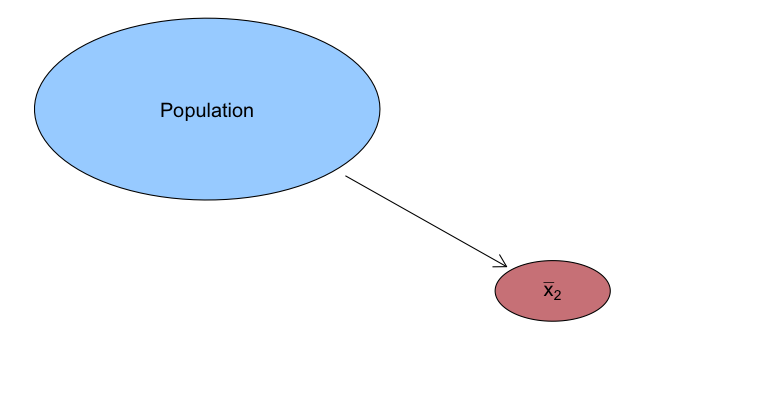

---
##  Sampling error

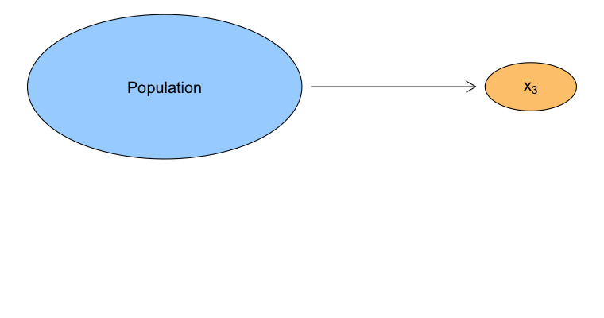

---
##  Sampling error

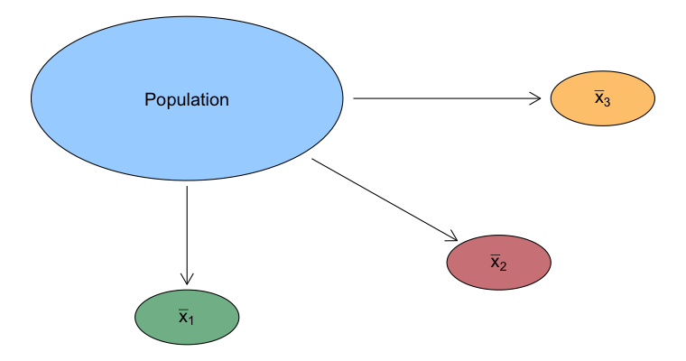

---
## The sampling distribution

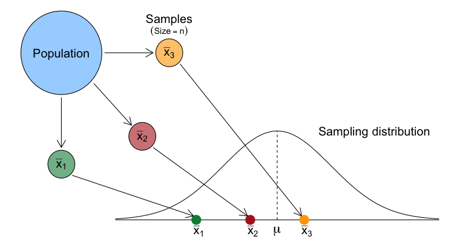

---
## The Central Limit Theorem

- There is variability in the estimate of a parameter that depends on the sample (the sampling distribution).

- We would like to have a range of plausible ("common") values for the population parameter

- The shape of the sampling distribution does not depend on the shape of the empirical distribution and, for large samples, can be approximated by a Normal distribution

<!-- 
- the variability in statistics based on samples

- the fact that the shape of the distribution of the statistics does not depend on the shape of the original distribution from which the individual data-points are drawn

- bootstrapping data when we do not want to make assumptions about the shape of the population

Rather remarkably, this has all been accomplished without any mathematics except the idea of drawing observations at random. -->

---
## Let’s put the jigsaw together

- The sampling distribution can be approximated by a Normal distribution
- In a Normal distribution, about 95% of the values (those "common") lie within two standard deviations of the mean
- A 95% confidence interval (CI) lies (approximately) $\pm \text{} 2 \times SE$ from the mean of the sampling distribution

<!-- Approssimando una Normale, la distribuzione campionaria ha le stesse (utili) caratteristiche della normale:
- &egrave; simmetrica
- ha area 1
- 95% delle medie campionarie sono a 2 SE dalla vera media della popolazione 

Tutti concetti che ci torneranno utili tra poco
-->

---
## Computing a Confidence Interval

:dart: &nbsp; A 95% CI lies ± 2 × SE from the sampling distribution mean ($\bar{x}$)

&nbsp;&nbsp;&nbsp;&nbsp;&nbsp;&nbsp;&nbsp; 1. Compute the SE
&nbsp;&nbsp;&nbsp;&nbsp;&nbsp;&nbsp;&nbsp; 2. Compute $2 \times \text{SE}$, *i.e.*, 
&nbsp;&nbsp;&nbsp;&nbsp;&nbsp;&nbsp;&nbsp;&nbsp;&nbsp;&nbsp;&nbsp; $95\%$ Margin of Error (ME)
&nbsp;&nbsp;&nbsp;&nbsp;&nbsp;&nbsp;&nbsp; 3. Compute the $95\% \text{ CI}$ as 
&nbsp;&nbsp;&nbsp;&nbsp;&nbsp;&nbsp;&nbsp;&nbsp;&nbsp;&nbsp;&nbsp;  $(\bar{x} - \text{ ME} \text{ } ; \text{ } \bar{x} + \text{ ME} )$

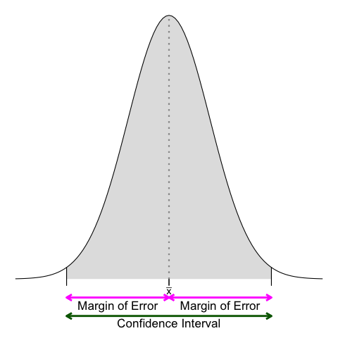

---
### Confidence intervals for the mean

:pushpin: &nbsp;&nbsp;&nbsp; $\mathcal{N} = (\mu, \frac{\sigma^2}{n})$ with
&nbsp;&nbsp;&nbsp;&nbsp;&nbsp;&nbsp;&nbsp;&nbsp; $\sqrt{ \frac{\sigma^2}{n}} = \frac{\sigma}{\sqrt{n}} = \text{standard error (SE)}$ 

&nbsp;&nbsp;&nbsp;&nbsp;&nbsp;&nbsp;&nbsp;&nbsp; $\sigma =$? $\longrightarrow \hat{SE} = \frac{s}{\sqrt{n}}$

---
### Exercise #6

In a sample of 403 Italian 11-year-old girls, the mean BMI is $18.4 \pm  3.3 \text{ kg}/\text{m}^2$

:question: &nbsp; What is the 95% CI for the true population mean ?

<button id="countdown_exercise_6"></button>

---
### Exercise #6 -- Solution

In a sample of 403 Italian 11-year-old girls, the mean BMI is $18.4 \pm  3.3 \text{ kg}/\text{m}^2$

:question: &nbsp; What is the 95% CI for the true population mean?

&nbsp;&nbsp;&nbsp;&nbsp;&nbsp;&nbsp;&nbsp;&nbsp; 1. &nbsp; $\hat{\text{SE}}=s/\sqrt{n} = 3.3/\sqrt{403}=0.16$

---
### Exercise #6 -- Solution

In a sample of 403 Italian 11-year-old girls, the mean BMI is $18.4 \pm  3.3 \text{ kg}/\text{m}^2$

:question: &nbsp; What is the 95% CI for the true population mean?

&nbsp;&nbsp;&nbsp;&nbsp;&nbsp;&nbsp;&nbsp;&nbsp; 1. &nbsp; $\hat{\text{SE}}=s/\sqrt{n} = 3.3/\sqrt{403}=0.16$

&nbsp;&nbsp;&nbsp;&nbsp;&nbsp;&nbsp;&nbsp;&nbsp; 2. &nbsp; $95\% \text{ ME} = 2 \times \hat{\text{SE}} = 2 \times 0.16 = 0.32$

<!-- Per il CTL e per la legge dei grandi numeri, la media del campione e' la media della popolazione. Se io prendo 2SE a sx della media e 2SE a destra (quindi x +/- 2 SE) ho il 95% di probabilta' di includere il vero valore mu, la media della popolazione

1,96 e' il coefficiente di attendibilita', ci dice entro quanti errori standard si trova il 95% di tutti i possibili valori della media campionaria

Stima intervallare definita come stimatore +/- il prodotto tra coeff di attendibilita' e SE. Questa quantita' si chiama anche PRECISIONE della STIMA o MARGINE DI ERRORE -->

---
### Exercise #6 -- Solution

In a sample of 403 Italian 11-year-old girls, the mean BMI is $18.4 \pm  3.3 \text{ kg}/\text{m}^2$

:question: &nbsp; What is the 95% CI for the true population mean?

&nbsp;&nbsp;&nbsp;&nbsp;&nbsp;&nbsp;&nbsp;&nbsp; 1. &nbsp; $\hat{\text{SE}}=s/\sqrt{n} = 3.3/\sqrt{403}=0.16$

&nbsp;&nbsp;&nbsp;&nbsp;&nbsp;&nbsp;&nbsp;&nbsp; 2. &nbsp; $95\% \text{ ME} = 2 \times \hat{\text{SE}} = 2 \times 0.16 = 0.32$

&nbsp;&nbsp;&nbsp;&nbsp;&nbsp;&nbsp;&nbsp;&nbsp; 3.   &nbsp; $95\% \text{CI} =  (\bar{x} - 95\% \text{ ME} \text{ } ; \text{ } \bar{x} + 95\% \text{ ME} ) =$
&nbsp;&nbsp;&nbsp;&nbsp;&nbsp;&nbsp;&nbsp;&nbsp;&nbsp;&nbsp;&nbsp;&nbsp;&nbsp;&nbsp;&nbsp;&nbsp;&nbsp;&nbsp;&nbsp;&nbsp;&nbsp;&nbsp;&nbsp;&nbsp;&nbsp; $=(18.4 - 0.32 \text{ } ; \text{ } 18.4 + 0.32) =$
&nbsp;&nbsp;&nbsp;&nbsp;&nbsp;&nbsp;&nbsp;&nbsp;&nbsp;&nbsp;&nbsp;&nbsp;&nbsp;&nbsp;&nbsp;&nbsp;&nbsp;&nbsp;&nbsp;&nbsp;&nbsp;&nbsp;&nbsp;&nbsp;&nbsp; $= (18.08 \text{ } ; \text{ }   18.72)$

<!-- Per il CTL e per la legge dei grandi numeri, la media del campione e' la media della popolazione. Se io prendo 2SE a sx della media e 2SE a destra (quindi x +/- 2 SE) ho il 95% di probabilta' di includere il vero valore mu, la media della popolazione

1,96 e' il coefficiente di attendibilita', ci dice entro quanti errori standard si trova il 95% di tutti i possibili valori della media campionaria

Stima intervallare definita come stimatore +/- il prodotto tra coeff di attendibilita' e SE. Questa quantita' si chiama anche PRECISIONE della STIMA o MARGINE DI ERRORE -->

---
## Interpreting confidence intervals 

- If we could sample the population 100 times and compute the corresponding 100 CIs, 95 of them would include the true population parameter
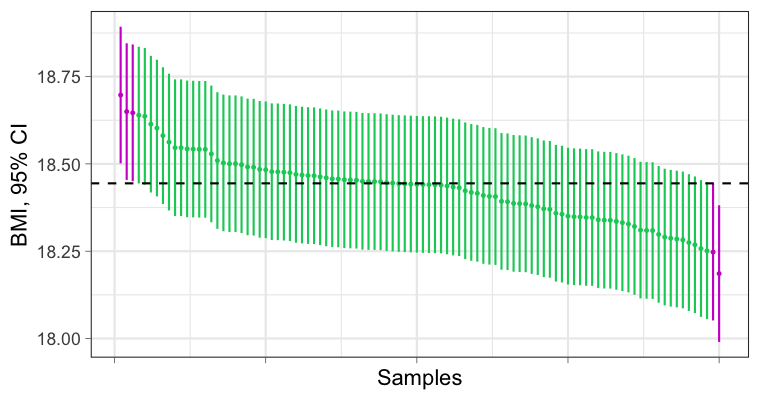

:pushpin: &nbsp;&nbsp;&nbsp; Population: Italian 
&nbsp;&nbsp;&nbsp;&nbsp;&nbsp;&nbsp;&nbsp;&nbsp; 11-year-old girls
&nbsp;&nbsp;&nbsp;&nbsp;&nbsp;&nbsp;&nbsp;&nbsp; $\mu=18.4  \text{ kg}/\text{m}^2$

<!-- Cosa rappresentano quindi i CI? Che dati 100 campioni estratti dalla popolazione, 95 stimano un IC al cui interno è compresa la media reale della popolazione e solo 5 stimano un ic che non include la media reale 

a confidence interval is the range of population parameters for which our observed statistic is a plausible consequence.
-->

---
### Exercise #7

:question: &nbsp;&nbsp;&nbsp; In the Results section, the authors reported the following

&nbsp;&nbsp;&nbsp;&nbsp;&nbsp;&nbsp;&nbsp;&nbsp; *In Mexican Americans, the mean age at menarche was 12.09 years*
&nbsp;&nbsp;&nbsp;&nbsp;&nbsp;&nbsp;&nbsp;&nbsp; *(95% CI = 11.81 to 12.37 years old)*

&nbsp;&nbsp;&nbsp;&nbsp;&nbsp;&nbsp;&nbsp;&nbsp; This means that...

&nbsp;&nbsp;&nbsp;&nbsp;&nbsp;&nbsp;&nbsp;&nbsp; a) The age at menarche for Mexican American girls lies between 11.81
&nbsp;&nbsp;&nbsp;&nbsp;&nbsp;&nbsp;&nbsp;&nbsp;&nbsp;&nbsp;&nbsp;&nbsp; and 12.37 years old
&nbsp;&nbsp;&nbsp;&nbsp;&nbsp;&nbsp;&nbsp;&nbsp; b) 95% of Mexican American girls experience menarche between 11.81 
&nbsp;&nbsp;&nbsp;&nbsp;&nbsp;&nbsp;&nbsp;&nbsp;&nbsp;&nbsp;&nbsp;&nbsp; and 12.37 years old
&nbsp;&nbsp;&nbsp;&nbsp;&nbsp;&nbsp;&nbsp;&nbsp; c) The mean age at menarche for Mexican American girls has a 95% 
&nbsp;&nbsp;&nbsp;&nbsp;&nbsp;&nbsp;&nbsp;&nbsp;&nbsp;&nbsp;&nbsp;&nbsp; probability of being between 11.81 and 12.37 years.

<!-- Questa differenza di 200 euro a dx e sx della media e' il margine di errore del 95% -->

<button id="countdown_exercise_7"></button>

---
### Exercise #7 -- Solution

:question: &nbsp;&nbsp;&nbsp; In the Results section, the authors reported the following

&nbsp;&nbsp;&nbsp;&nbsp;&nbsp;&nbsp;&nbsp;&nbsp; *In Mexican Americans, the mean age at menarche was 12.09 years*
&nbsp;&nbsp;&nbsp;&nbsp;&nbsp;&nbsp;&nbsp;&nbsp; *(95% CI = 11.81 to 12.37 years old)*

&nbsp;&nbsp;&nbsp;&nbsp;&nbsp;&nbsp;&nbsp;&nbsp; This means that...

&nbsp;&nbsp;&nbsp;&nbsp;&nbsp;&nbsp;&nbsp;&nbsp; a) The age at menarche for Mexican American girls lies between 11.81
&nbsp;&nbsp;&nbsp;&nbsp;&nbsp;&nbsp;&nbsp;&nbsp;&nbsp;&nbsp;&nbsp;&nbsp; and 12.37 years old
&nbsp;&nbsp;&nbsp;&nbsp;&nbsp;&nbsp;&nbsp;&nbsp; b) 95% of Mexican American girls experience menarche between 11.81 
&nbsp;&nbsp;&nbsp;&nbsp;&nbsp;&nbsp;&nbsp;&nbsp;&nbsp;&nbsp;&nbsp;&nbsp; and 12.37 years old
&nbsp;&nbsp;&nbsp;&nbsp;&nbsp;&nbsp;&nbsp;&nbsp; c) The mean age at menarche for Mexican American girls has a 95% 
&nbsp;&nbsp;&nbsp;&nbsp;&nbsp;&nbsp;&nbsp;&nbsp;&nbsp;&nbsp;&nbsp;&nbsp; probability of being between 11.81 and 12.37 years &nbsp; :white_check_mark:

---
## The confidence on the confidence intervals 

- A confidence interval is a range of values which includes the
 estimated parameter with a given level of confidence (*e.g.*, 95%)
- Its width depends on the margin of error
- The margin of error is evaluated as:

&nbsp;&nbsp;&nbsp;&nbsp;&nbsp;&nbsp;&nbsp;&nbsp; $2 \times \text{SE}$ (at a confidence level of 95%)

But why do we multiply by 2? &nbsp;&nbsp;&nbsp;&nbsp;&nbsp;&nbsp;

---
## The confidence level

:dart: &nbsp; We multiply by the critical value from the Normal distribution $z$
&nbsp;&nbsp;&nbsp;&nbsp;&nbsp;&nbsp;  that corresponds to our confidence level

| Confidence Level | $\alpha$ | $\alpha/2$ | 
| ----: | ----- | ---- | 
| 95% | 5% | 2.5% |  

<!-- L’intervallo di confidenza (IC) al 95% è il più usato e intuitivamente abbiamo gia' capito da dove deirva il fattore 1.96 (circa 2SE contengono il 95% dei campioni), ma vediamolo in modo piu' formale 

Quando accettiamo un livello di confidenza del 95% accettiamo implicitamente un errore del 5%, distribuito equamente a dx e sx dell'intrevallo di confidenza (in verde), quindi 2.5% per parte -->

---
## The confidence level

:dart: &nbsp; We multiply by the critical value from the Normal distribution $z$
&nbsp;&nbsp;&nbsp;&nbsp;&nbsp;&nbsp;  that corresponds to our confidence level

| Confidence Level | $\alpha$ | $\alpha/2$ | 
| ----: | ----- | ---- | 
| 95% | 5% | 2.5% |

$100\% - 2.5\% = 97.5\%$ 

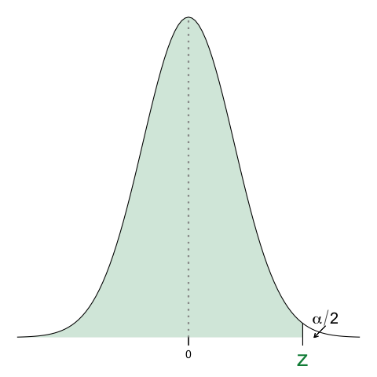

<!--  e qual e' l'aera di questa parte bianca? E' la totalita' dell'area (1, o 100%) meno l'area bianca (2.5%), quindi 97.5%-->

---
## The confidence level

:dart: &nbsp; We multiply by the critical value from the Normal distribution $z$
&nbsp;&nbsp;&nbsp;&nbsp;&nbsp;&nbsp;  that corresponds to our confidence level

| Confidence Level | $\alpha$ | $\alpha/2$ | 
| ----: | ----- | ---- | 
| 95% | 5% | 2.5% |

$100\% - 2.5\% = 97.5\% \rightarrow \mathcal{z} = 1.96$  

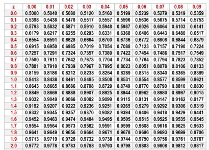

<!--  E' qual e' il valore di z per cui la curva sottende un'area del 97.5%? 1.96 (le tavole si possono anche leggere al contrario, non solo da z all'area, ma anche dall'area a z) 

coefficiente di attendibilita'-->

---
## The confidence level

:dart: &nbsp; We multiply by the critical value from the Normal distribution $z$
&nbsp;&nbsp;&nbsp;&nbsp;&nbsp;&nbsp;  that corresponds to our confidence level

| Confidence Level | $\alpha$ | $\alpha/2$ | 
| ----: | ----- | ---- | 
| 95% | 5% | 2.5% |
| 90% | 10% | 5.0% | 
| 99% | 1% | 0.5% | 

$100\% - 2.5\% = 97.5\% \rightarrow \mathcal{z} = 1.96$ 
$100\% - 5.0\% = 95.0\% \rightarrow \mathcal{z} = 1.65$ 
$100\% - 0.5\% = 99.5\% \rightarrow \mathcal{z} = 2.58$ 

<!-- 95% e' il valore piu' usato, ma altri comuni sono 90 e 99%, a cui corrispondono fattori di attendibilita' di 1.65 e 2.58

Faremo piu' avanti degli esercizi in cui ci calcoleremo 90 e 99% CI -->

---
### Exercise #8

:question: &nbsp;&nbsp;&nbsp; Given that $\mathcal{N} = (\mu, \frac{\sigma^2}{n})$ with $\sqrt{ \frac{\sigma^2}{n}} = \frac{\sigma}{\sqrt{n}} \rightarrow$ &nbsp; standard error (SE), 
&nbsp;&nbsp;&nbsp;&nbsp;&nbsp;&nbsp;&nbsp;&nbsp;  how can one reduce the width of the confidence interval?

&nbsp;&nbsp;&nbsp;&nbsp;&nbsp;&nbsp;&nbsp;&nbsp; a) increasing $n$
&nbsp;&nbsp;&nbsp;&nbsp;&nbsp;&nbsp;&nbsp;&nbsp; b) decreasing $n$
&nbsp;&nbsp;&nbsp;&nbsp;&nbsp;&nbsp;&nbsp;&nbsp; c) increasing $\sigma$
&nbsp;&nbsp;&nbsp;&nbsp;&nbsp;&nbsp;&nbsp;&nbsp; d) decreasing $\sigma$
&nbsp;&nbsp;&nbsp;&nbsp;&nbsp;&nbsp;&nbsp;&nbsp; e) increasing the confidence level
&nbsp;&nbsp;&nbsp;&nbsp;&nbsp;&nbsp;&nbsp;&nbsp; f) decreasing the confidence level

<button id="countdown_exercise_8"></button>

---
### Exercise #8 -- Solution

:question: &nbsp;&nbsp;&nbsp; Given that $\mathcal{N} = (\mu, \frac{\sigma^2}{n})$ with $\sqrt{ \frac{\sigma^2}{n}} = \frac{\sigma}{\sqrt{n}} \rightarrow$ &nbsp; standard error (SE), 
&nbsp;&nbsp;&nbsp;&nbsp;&nbsp;&nbsp;&nbsp;&nbsp;  how can one reduce the width of the confidence interval?

&nbsp;&nbsp;&nbsp;&nbsp;&nbsp;&nbsp;&nbsp;&nbsp; a) increasing $n$ &nbsp; :white_check_mark:
&nbsp;&nbsp;&nbsp;&nbsp;&nbsp;&nbsp;&nbsp;&nbsp; b) decreasing $n$
&nbsp;&nbsp;&nbsp;&nbsp;&nbsp;&nbsp;&nbsp;&nbsp; c) increasing $\sigma$
&nbsp;&nbsp;&nbsp;&nbsp;&nbsp;&nbsp;&nbsp;&nbsp; d) decreasing $\sigma$ &nbsp; :ballot_box_with_check:
&nbsp;&nbsp;&nbsp;&nbsp;&nbsp;&nbsp;&nbsp;&nbsp; e) increasing the confidence level
&nbsp;&nbsp;&nbsp;&nbsp;&nbsp;&nbsp;&nbsp;&nbsp; f) decreasing the confidence level &nbsp; :white_check_mark:

<!-- Abbiamo un confidence interval molto stretto perche' si sono verificate due condizioni che, indipendentemente, migliorano la stima intervallare:
- un'alta numerosit&agrave; campionaria e
- una bassa variabilita s tra le osservazioni 

Peccato che sigma non la possiamo controllare :) 
-->

---
### Exercise #9

:question: &nbsp;&nbsp;&nbsp; If the CI is large we are...

&nbsp;&nbsp;&nbsp;&nbsp;&nbsp;&nbsp;&nbsp;&nbsp; a) more likely of including $\mu$
&nbsp;&nbsp;&nbsp;&nbsp;&nbsp;&nbsp;&nbsp;&nbsp; b) less likely of including $\mu$
&nbsp;&nbsp;&nbsp;&nbsp;&nbsp;&nbsp;&nbsp;&nbsp; c) there is no difference

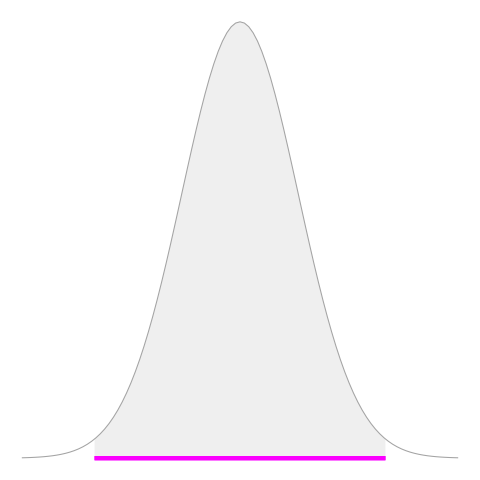

<button id="countdown_exercise_9"></button>

---
### Exercise #9 -- Solution

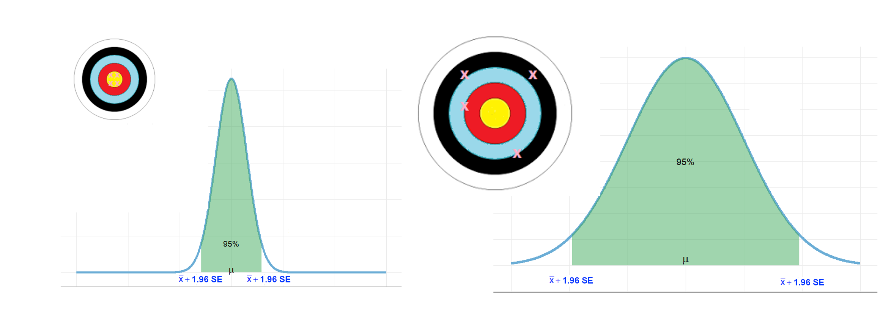

---
### Exercise #9 -- Solution

:question: &nbsp;&nbsp;&nbsp; If the CI is large we are...

&nbsp;&nbsp;&nbsp;&nbsp;&nbsp;&nbsp;&nbsp;&nbsp; a) more likely of including $\mu$ :white_check_mark:
&nbsp;&nbsp;&nbsp;&nbsp;&nbsp;&nbsp;&nbsp;&nbsp; b) less likely of including $\mu$
&nbsp;&nbsp;&nbsp;&nbsp;&nbsp;&nbsp;&nbsp;&nbsp; c) there is no difference

---
### Exercise #10

:question: &nbsp;&nbsp;&nbsp; If the CI is large we are...

&nbsp;&nbsp;&nbsp;&nbsp;&nbsp;&nbsp;&nbsp;&nbsp; a) more precise
&nbsp;&nbsp;&nbsp;&nbsp;&nbsp;&nbsp;&nbsp;&nbsp; b) less precise
&nbsp;&nbsp;&nbsp;&nbsp;&nbsp;&nbsp;&nbsp;&nbsp; c) there is no difference

<button id="countdown_exercise_10"></button>

---
### Exercise #10 -- Solution

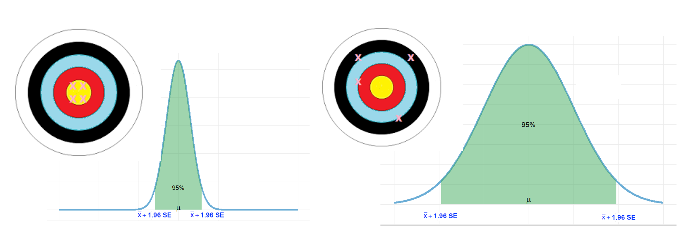

---
### Exercise #10 -- Solution

:question: &nbsp;&nbsp;&nbsp; If the CI is large we are...

&nbsp;&nbsp;&nbsp;&nbsp;&nbsp;&nbsp;&nbsp;&nbsp; a) more precise 
&nbsp;&nbsp;&nbsp;&nbsp;&nbsp;&nbsp;&nbsp;&nbsp; b) less precise :white_check_mark:
&nbsp;&nbsp;&nbsp;&nbsp;&nbsp;&nbsp;&nbsp;&nbsp; c) there is no difference

---
## The Central Limit Theorem

- There is variability in the estimate of a parameter that depends on the sample (the sampling distribution).

- We would like to have a range of plausible ("common") values for the population parameter

- The shape of the sampling distribution does not depend on the shape of the empirical distribution and, **<u>for large samples</u>**, can be approximated by a Normal distribution

How large is “large”? &nbsp;&nbsp;&nbsp;&nbsp;

---
## The Central Limit Theorem

- There is variability in the estimate of a parameter that depends on the sample (the sampling distribution).

- We would like to have a range of plausible ("common") values for the population parameter

- The shape of the sampling distribution does not depend on the shape of the empirical distribution and, **<u>for large samples</u>**, can be approximated by a Normal distribution

What if our sample is "small"?

---
## What if our sample is "small"?

- Cannot approximated with a Normal distribution
- One should use the Student’s $\mathcal{t}$ distribution
  

<!-- Quando la dimensione campionaria e' grande la nostra fiducia nell'approssimare sigma con la varianza campionaria e' ben riposta  e possiamo usare la normale per il calcolo dei CI, ma cosa succede quando i campioni soo piccoli? Usiamo la distribuzione  di Student
 -->

---
## The Student's $\mathcal{t}$ distribution 

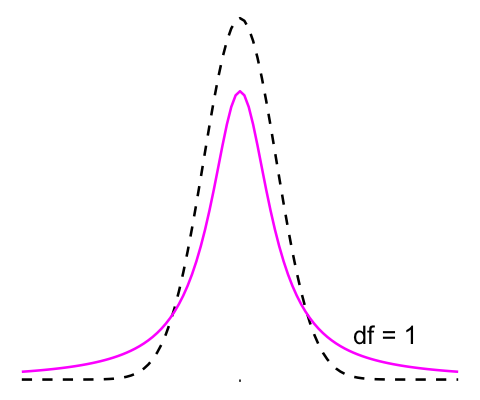

- It takes into account the degrees of freedom (df)

<!-- 
- &egrave; una famiglia di distribuzioni, 1 per ogni valore campionario n-1

Come la normale:
- ha media 0
- &egrave; simmetrica
- ha varianza >1 che si avvicina a 1 al crescere di N

Meno appuntita al centro e code pi&ugrave; alte
 -->

---
## The Student's $\mathcal{t}$ distribution 

- It takes into account the degrees of freedom (df)
  - In a sample of size $n$  $\rightarrow \text{df} = n -1$
  - In two samples of size $n_1$ and $n_2$  $\rightarrow$ &nbsp; $\text{df} = n_1 + n_2 - 2$

 ---
## The Student's $\mathcal{t}$ distribution 

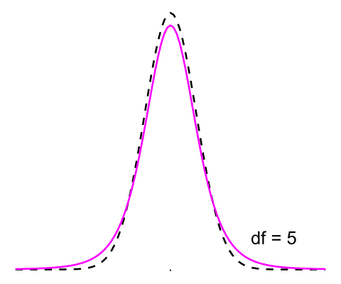

- It takes into account the degrees of freedom (df)
  - In a sample of size $n$  $\rightarrow \text{df} = n -1$
  - In two samples of size $n_1$ and $n_2$  $\rightarrow$ &nbsp; $\text{df} = n_1 + n_2 - 2$
  

<!-- 
- &egrave; una famiglia di distribuzioni, 1 per ogni valore campionario n-1

Come la normale:
- ha media 0
- &egrave; simmetrica
- ha varianza >1 che si avvicina a 1 al crescere di N

Meno appuntita al centro e code pi&ugrave; alte
 -->

 ---
## The Student's $\mathcal{t}$ distribution 

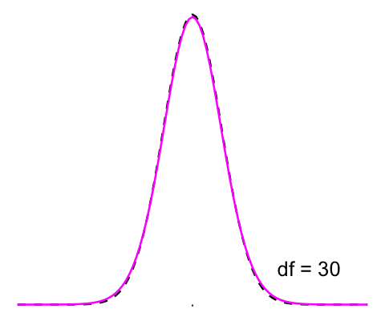

- It takes into account the degrees of freedom (df)
  - In a sample of size $n$  $\rightarrow \text{df} = n -1$
  - In two samples of size $n_1$ and $n_2$  $\rightarrow$ &nbsp; $\text{df} = n_1 + n_2 - 2$

<!-- 
- &egrave; una famiglia di distribuzioni, 1 per ogni valore campionario n-1

Come la normale:
- ha media 0
- &egrave; simmetrica
- ha varianza >1 che si avvicina a 1 al crescere di N

Meno appuntita al centro e code pi&ugrave; alte
 -->

---
## The Student's $\mathcal{t}$ distribution 

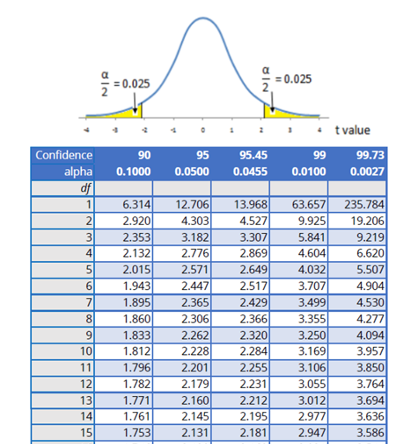

- It takes into account the degrees of freedom (df)
  - In a sample of size $n$  $\rightarrow \text{df} = n -1$
  - In two samples of size $n_1$ and $n_2$  $\rightarrow$ &nbsp; $\text{df} = n_1 + n_2 - 2$

&nbsp;&nbsp;&nbsp;&nbsp;&nbsp;&nbsp;&nbsp; $\longrightarrow \text{95\% ME} = \mathcal{t} \times \hat{SE}$ 

---
### Exercise #11

:question: &nbsp;&nbsp;&nbsp; $n=15$
&nbsp;&nbsp;&nbsp;&nbsp;&nbsp;&nbsp;&nbsp;&nbsp; $\bar{x}_{\text{BMI}} = 25.0 \text{ kg}/\text{m}^2$
&nbsp;&nbsp;&nbsp;&nbsp;&nbsp;&nbsp;&nbsp;&nbsp; $s_{\text{BMI}}  = 2.7 \text{ kg}/\text{m}^2$

&nbsp;&nbsp;&nbsp;&nbsp;&nbsp;&nbsp;&nbsp;&nbsp; $\hat{\text{SE}}=s/\sqrt{n} = \text{ ?}$
&nbsp;&nbsp;&nbsp;&nbsp;&nbsp;&nbsp;&nbsp;&nbsp; $\text{df} = n-1 = \text{ ?}$

&nbsp;&nbsp;&nbsp;&nbsp;&nbsp;&nbsp;&nbsp;&nbsp; $\text{95\% CI} = \text{ ?}$ 

<button id="countdown_exercise_11"></button>

<!-- coefficiente di attendibilita' -->

---
### Exercise #11 -- Solution

:question: &nbsp;&nbsp;&nbsp; $n=15$ 
&nbsp;&nbsp;&nbsp;&nbsp;&nbsp;&nbsp;&nbsp;&nbsp; $\bar{x}_{\text{BMI}} = 25.0 \text{ kg}/\text{m}^2$
&nbsp;&nbsp;&nbsp;&nbsp;&nbsp;&nbsp;&nbsp;&nbsp; $s_{\text{BMI}}  = 2.7 \text{ kg}/\text{m}^2$

&nbsp;&nbsp;&nbsp;&nbsp;&nbsp;&nbsp;&nbsp;&nbsp; $\hat{\text{SE}}=s/\sqrt{n} = \frac{2.7}{\sqrt{15}}= 0.7$
&nbsp;&nbsp;&nbsp;&nbsp;&nbsp;&nbsp;&nbsp;&nbsp; $\text{df} = n-1 = 15 - 1 = 14$

---
### Exercise #11 -- Solution

:question: &nbsp;&nbsp;&nbsp; $n=15$
&nbsp;&nbsp;&nbsp;&nbsp;&nbsp;&nbsp;&nbsp;&nbsp; $\bar{x}_{\text{BMI}} = 25.0 \text{ kg}/\text{m}^2$
&nbsp;&nbsp;&nbsp;&nbsp;&nbsp;&nbsp;&nbsp;&nbsp; $s_{\text{BMI}}  = 2.7 \text{ kg}/\text{m}^2$

&nbsp;&nbsp;&nbsp;&nbsp;&nbsp;&nbsp;&nbsp;&nbsp; $\hat{\text{SE}}=s/\sqrt{n} = \frac{2.7}{\sqrt{15}}= 0.7$
&nbsp;&nbsp;&nbsp;&nbsp;&nbsp;&nbsp;&nbsp;&nbsp; $\text{df} = n-1 = 15 - 1 = 14$

&nbsp;&nbsp;&nbsp;&nbsp;&nbsp;&nbsp;&nbsp;&nbsp; $\text{95\% ME} = \mathcal{t} \times \hat{SE} =$ 
&nbsp;&nbsp;&nbsp;&nbsp;&nbsp;&nbsp;&nbsp;&nbsp;&nbsp;&nbsp;&nbsp;&nbsp;&nbsp;&nbsp;&nbsp;&nbsp;&nbsp;&nbsp;&nbsp;&nbsp;&nbsp; $= 2.145 \times 0.7 = 1.5$

<!-- Abbiamo un grado di confidenza del 95% che la media della popolazione p sia compresa tra 24.28 e 25.72 -->

---
### Exercise #11 -- Solution

:question: &nbsp;&nbsp;&nbsp; $n=15$ 
&nbsp;&nbsp;&nbsp;&nbsp;&nbsp;&nbsp;&nbsp;&nbsp; $\bar{x}_{\text{BMI}} = 25.0 \text{ kg}/\text{m}^2$
&nbsp;&nbsp;&nbsp;&nbsp;&nbsp;&nbsp;&nbsp;&nbsp; $s_{\text{BMI}}  = 2.7 \text{ kg}/\text{m}^2$

&nbsp;&nbsp;&nbsp;&nbsp;&nbsp;&nbsp;&nbsp;&nbsp; $\hat{\text{SE}}=s/\sqrt{n} = \frac{2.7}{\sqrt{15}}= 0.7$
&nbsp;&nbsp;&nbsp;&nbsp;&nbsp;&nbsp;&nbsp;&nbsp; $\text{df} = n-1 = 15 - 1 = 14$

&nbsp;&nbsp;&nbsp;&nbsp;&nbsp;&nbsp;&nbsp;&nbsp;&nbsp; $\text{95\% ME} = 1.5$

&nbsp;&nbsp;&nbsp;&nbsp;&nbsp;&nbsp;&nbsp;&nbsp;&nbsp; $\text{95\% CI} = (\bar{x} - \text{95\% ME} \text{ } ; \text{ } \bar{x} + \text{95\% ME}) =$ 
&nbsp;&nbsp;&nbsp;&nbsp;&nbsp;&nbsp;&nbsp;&nbsp;&nbsp;&nbsp;&nbsp;&nbsp;&nbsp;&nbsp;&nbsp;&nbsp;&nbsp;&nbsp;&nbsp;&nbsp;&nbsp; $= (25.0 - 1.5; \text{ } 25.0 + 1.5) =$
&nbsp;&nbsp;&nbsp;&nbsp;&nbsp;&nbsp;&nbsp;&nbsp;&nbsp;&nbsp;&nbsp;&nbsp;&nbsp;&nbsp;&nbsp;&nbsp;&nbsp;&nbsp;&nbsp;&nbsp;&nbsp; $= (23.5; 26.5)$

<!-- Abbiamo un grado di confidenza del 95% che la media della popolazione p sia compresa tra 24.28 e 25.72 -->

---
### Confidence intervals for differences of means

<!-- :pushpin: &nbsp;&nbsp;&nbsp;  -->
<!-- Which is the *true* difference in mean between two groups? -->

:pushpin: &nbsp;&nbsp;&nbsp; $\mathcal{N} = (\mu_{\text{i}} - \mu_{\text{c}}, \sqrt{\frac{\sigma_\text{i}^2}{n_\text{i}} + \frac{\sigma_\text{c}^2}{n_\text{c}}})$ 
&nbsp;&nbsp;&nbsp;&nbsp;&nbsp;&nbsp;&nbsp;&nbsp; $\hat{\text{SE}} = \sqrt{\frac{s_\text{i}^2}{n_\text{i}} + \frac{s_\text{c}^2}{n_\text{c}}}$

<!-- 
Ci sono casi in cui vogliamo stimare la differenza tra medie di una popolazione (per esempio tra i pazienti che hanno ricevuto un nuovo trattamento e quelli che hanno avuto la cura standard o il placebo)

Non lo abbiamo vistp in dettaglio in precedenza, ma, per il CLT la differenza tra le medie campionarie e' una stima non distorta della differenza delle medie delle due popolazioni -->

---
### Exercise #12

:question: &nbsp;&nbsp;&nbsp; Which is the *true* difference in mean between the two groups?

&nbsp;&nbsp;&nbsp;&nbsp;&nbsp;&nbsp;&nbsp;&nbsp; $n_{\text{i}}= \text{ ?}, \text{ } \text{ } \text{ } \text{ } \bar{x}_{\text{i}}= \text{ ?}, \text{ } \text{ } \text{ }  s_\text{i} = 10.0$ 
&nbsp;&nbsp;&nbsp;&nbsp;&nbsp;&nbsp;&nbsp;&nbsp; $n_{\text{c}}= \text{ ?}, \text{ } \text{ }  \text{ } \text{ }  \bar{x}_{\text{c}}= \text{ ?}, \text{ } \text{ }  s_\text{c} = 8.7$ 

&nbsp;&nbsp;&nbsp;&nbsp;&nbsp;&nbsp;&nbsp;&nbsp; $\hat{\text{SE}} = \sqrt{\frac{s_\text{i}^2}{n_\text{i}} + \frac{s_\text{c}^2}{n_\text{c}}} = \text{ ?}$

<button id="countdown_exercise_12"></button>

  Tomazini B.M., *et al.*, *Effect of Dexamethasone on Days Alive and Ventilator-Free in Patients With Moderate or Severe Acute Respiratory Distress Syndrome and COVID-19*, JAMA, 2020

<!-- Abbiamo due gruppo di pazienti con COVID-19 e sindrome da distress respiratorio acuto moderato o grave (ARDS
uno con lo standard of care e uno a cui abbiamo somministrati desametasone endovenoso. 

Il numero di giorni di respirazione autonoma????

Qual e' il CI per la differenza delle medie dei due gruppi?
-->

---
### Exercise #12 -- Solution

:question: &nbsp;&nbsp;&nbsp; Which is the *true* difference in mean between the two groups?

&nbsp;&nbsp;&nbsp;&nbsp;&nbsp;&nbsp;&nbsp;&nbsp; $n_{\text{i}}= 151, \text{ } \text{ } \text{ } \text{ } \bar{x}_{\text{i}}= 6.6, \text{ } \text{ } \text{ }  s_\text{i} = 10.0$ 
&nbsp;&nbsp;&nbsp;&nbsp;&nbsp;&nbsp;&nbsp;&nbsp; $n_{\text{c}}= 148, \text{ } \text{ }  \text{ } \text{ }  \bar{x}_{\text{c}}= 4.0, \text{ } \text{ }  s_\text{c} = 8.7$ 

&nbsp;&nbsp;&nbsp;&nbsp;&nbsp;&nbsp;&nbsp;&nbsp; $\hat{\text{SE}} = \sqrt{\frac{s_\text{i}^2}{n_\text{i}} + \frac{s_\text{c}^2}{n_\text{c}}} = \sqrt{\frac{10.0^2}{151} + \frac{8.7^2}{148}} = 1.08$

<!--  CTL differenza tra le medie campionarie e' la diffeenza tra le medie della popolazione
SE lo calcoliamo cosi' -->

---
### Exercise #12 -- Solution

:question: &nbsp;&nbsp;&nbsp; Which is the *true* difference in mean between the two groups?

&nbsp;&nbsp;&nbsp;&nbsp;&nbsp;&nbsp;&nbsp;&nbsp; $n_{\text{i}}= 151, \text{ } \text{ } \text{ } \text{ } \bar{x}_{\text{i}}= 6.6, \text{ } \text{ } \text{ }  s_\text{i} = 10.0$ 
&nbsp;&nbsp;&nbsp;&nbsp;&nbsp;&nbsp;&nbsp;&nbsp; $n_{\text{c}}= 148, \text{ } \text{ }  \text{ } \text{ }  \bar{x}_{\text{c}}= 4.0, \text{ } \text{ }  s_\text{c} = 8.7$ 

&nbsp;&nbsp;&nbsp;&nbsp;&nbsp;&nbsp;&nbsp;&nbsp; $\hat{\text{SE}} = \sqrt{\frac{s_\text{i}^2}{n_\text{i}} + \frac{s_\text{c}^2}{n_\text{c}}} = \sqrt{\frac{10.0^2}{151} + \frac{8.7^2}{148}} = 1.08$

&nbsp;&nbsp;&nbsp;&nbsp;&nbsp;&nbsp;&nbsp;&nbsp; $\text{95\% ME} = 2 \times \hat{SE} = 2 \times 1.08 = 2.16$

---
### Exercise #12 -- Solution

:question: &nbsp;&nbsp;&nbsp; Which is the *true* difference in mean between the two groups?

&nbsp;&nbsp;&nbsp;&nbsp;&nbsp;&nbsp;&nbsp;&nbsp; $n_{\text{i}}= 151, \text{ } \text{ } \text{ } \text{ } \bar{x}_{\text{i}}= 6.6, \text{ } \text{ } \text{ }  s_\text{i} = 10.0$ 
&nbsp;&nbsp;&nbsp;&nbsp;&nbsp;&nbsp;&nbsp;&nbsp; $n_{\text{c}}= 148, \text{ } \text{ }  \text{ } \text{ }  \bar{x}_{\text{c}}= 4.0, \text{ } \text{ }  s_\text{c} = 8.7$ 

&nbsp;&nbsp;&nbsp;&nbsp;&nbsp;&nbsp;&nbsp;&nbsp; $\hat{\text{SE}} = \sqrt{\frac{s_\text{i}^2}{n_\text{i}} + \frac{s_\text{c}^2}{n_\text{c}}} = \sqrt{\frac{10.0^2}{151} + \frac{8.7^2}{148}} = 1.08$

&nbsp;&nbsp;&nbsp;&nbsp;&nbsp;&nbsp;&nbsp;&nbsp; $\text{95\% ME} = 2 \times \hat{SE} = 2 \times 1.08 = 2.16$

&nbsp;&nbsp;&nbsp;&nbsp;&nbsp;&nbsp;&nbsp;&nbsp; $\text{95\% CI} = (\bar{x}_{\text{i}} - \bar{x}_{\text{c}}) - \text{95\% ME} \text{ } ; \text{ } (\bar{x}_{\text{i}} - \bar{x}_{\text{c}}) + \text{95\% ME} =$
&nbsp;&nbsp;&nbsp;&nbsp;&nbsp;&nbsp;&nbsp;&nbsp;&nbsp;&nbsp;&nbsp;&nbsp;&nbsp;&nbsp;&nbsp;&nbsp;&nbsp;&nbsp;&nbsp;&nbsp; $= ((6.6-4.0) - 2.16 \text{ } ; \text{ } (6.6-4.0) + 2.16) =$
&nbsp;&nbsp;&nbsp;&nbsp;&nbsp;&nbsp;&nbsp;&nbsp;&nbsp;&nbsp;&nbsp;&nbsp;&nbsp;&nbsp;&nbsp;&nbsp;&nbsp;&nbsp;&nbsp;&nbsp; $= (2.6 - 2.16 \text{ } ; \text{ } 2.6+2.16 ) = (0.44 \text{ } ; \text{ } 4.78)$

<!--  stima +/- prodotto tra il coefficiente di attendibilita' e l'errore standard 

Abbiamo un grado di confidenza del 95% che la differenza delle medie delle due popolazioni sia compresa tra questi valori -->

---
## Confidence intervals for proportions

<!-- :pushpin: &nbsp;&nbsp;&nbsp;  Which is the *true* proportion of individuals with a given    
&nbsp;&nbsp;&nbsp;&nbsp;&nbsp;&nbsp;&nbsp;&nbsp; characteristic in a population? -->

:pushpin: &nbsp;&nbsp;&nbsp;  $\mathcal{N} = (\pi, \frac{\pi \times (1-\pi)}{n})$
&nbsp;&nbsp;&nbsp;&nbsp;&nbsp;&nbsp;&nbsp;&nbsp; $\hat{SE} = \sqrt{\frac{\bar{p}\times(1-\bar{p})}{n}}$, &nbsp; where $\bar{p} = \frac{m}{n}$

<!-- 
In campo medico ci sono molte questioni legate alla proporzione di pazienti con una certa caratteristica. Per esempio la proporzione di pazienti con una malattia, la proporzione di pazienti che necessita un ricovero, o quella che soffre di effetti collaterali dopo l'assunzione di un farmaco

Per il teorema del limite centrale, di nuovo, la proporzione campionaria e' una stima non distorta della proporzione della popolazione e la distribuzione campionaria si approssima ad una normale 

 -->

---
### Exercise #13

:question: &nbsp;&nbsp;&nbsp; Which is the *true* proportion of women with endometriosis in the population?

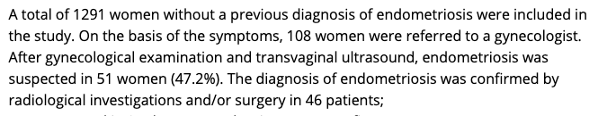

&nbsp;&nbsp;&nbsp;&nbsp;&nbsp;&nbsp;&nbsp;&nbsp; $n= \text{ ?}, \text{ } \text{ } \text{ } \text{ } m = \text{ ?}$
&nbsp;&nbsp;&nbsp;&nbsp;&nbsp;&nbsp;&nbsp;&nbsp; $\bar{p} = \frac{m}{n} = \text{ ?}$ 

&nbsp;&nbsp;&nbsp;&nbsp;&nbsp;&nbsp;&nbsp;&nbsp; $\hat{SE} = \sqrt{\frac{\bar{p}\times(1-\bar{p})}{n}} = \text{ ?}$

<button id="countdown_exercise_13"></button>

  Ferrero S.., *et al.*, *Prevalence of newly diagnosed endometriosis in women attending the general practitioner*,    Int J Gynaecol Obstet, 2020

---
### Exercise #13 -- Solution

:question: &nbsp;&nbsp;&nbsp; Which is the *true* proportion of women with endometriosis in the population?

&nbsp;&nbsp;&nbsp;&nbsp;&nbsp;&nbsp;&nbsp;&nbsp; $n= 1291, \text{ } \text{ } \text{ } \text{ } m = 46$
&nbsp;&nbsp;&nbsp;&nbsp;&nbsp;&nbsp;&nbsp;&nbsp; $\bar{p} = \frac{m}{n} = \frac{46}{1291} = 0.036 = 3.6\%$ 

&nbsp;&nbsp;&nbsp;&nbsp;&nbsp;&nbsp;&nbsp;&nbsp; $\hat{SE} = \sqrt{\frac{\bar{p}\times(1-\bar{p})}{n}} = \sqrt{\frac{0.036\times(1-0.036)}{1291}} = 0.005$

---
### Exercise #13 -- Solution

:question: &nbsp;&nbsp;&nbsp; Which is the *true* proportion of women with endometriosis in the population?

&nbsp;&nbsp;&nbsp;&nbsp;&nbsp;&nbsp;&nbsp;&nbsp; $n= 1291, \text{ } \text{ } \text{ } \text{ } m = 46$
&nbsp;&nbsp;&nbsp;&nbsp;&nbsp;&nbsp;&nbsp;&nbsp; $\bar{p} = \frac{m}{n} = \frac{46}{1291} = 0.036 = 3.6\%$ 

&nbsp;&nbsp;&nbsp;&nbsp;&nbsp;&nbsp;&nbsp;&nbsp; $\hat{SE} = \sqrt{\frac{\bar{p}\times(1-\bar{p})}{n}} = \sqrt{\frac{0.036\times(1-0.036)}{1291}} = 0.005$

&nbsp;&nbsp;&nbsp;&nbsp;&nbsp;&nbsp;&nbsp;&nbsp; $\text{95\% ME} = 2 \times \hat{SE} = 2 \times 0.005 = 0.01$

---
### Exercise #13 -- Solution

:question: &nbsp;&nbsp;&nbsp; Which is the *true* proportion of women with endometriosis in the population?

&nbsp;&nbsp;&nbsp;&nbsp;&nbsp;&nbsp;&nbsp;&nbsp; $n= 1291, \text{ } \text{ } \text{ } \text{ } m = 46$
&nbsp;&nbsp;&nbsp;&nbsp;&nbsp;&nbsp;&nbsp;&nbsp; $\bar{p} = \frac{m}{n} = \frac{46}{1291} = 0.036 = 3.6\%$ 

&nbsp;&nbsp;&nbsp;&nbsp;&nbsp;&nbsp;&nbsp;&nbsp; $\hat{SE} = \sqrt{\frac{\bar{p}\times(1-\bar{p})}{n}} = \sqrt{\frac{0.036\times(1-0.036)}{1291}} = 0.005$

&nbsp;&nbsp;&nbsp;&nbsp;&nbsp;&nbsp;&nbsp;&nbsp; $\text{95\% ME} = 2 \times \hat{SE} = 2 \times 0.005 = 0.01$

&nbsp;&nbsp;&nbsp;&nbsp;&nbsp;&nbsp;&nbsp;&nbsp; $\text{95\% CI} = (\bar{p} - \text{95\% ME} \text{ } ; \text{ } \bar{p} + \text{95\% ME} =$
&nbsp;&nbsp;&nbsp;&nbsp;&nbsp;&nbsp;&nbsp;&nbsp;&nbsp;&nbsp;&nbsp;&nbsp;&nbsp;&nbsp;&nbsp;&nbsp;&nbsp;&nbsp;&nbsp;&nbsp; $= (0.036 - 0.01 \text{ } ; \text{ } 0.036 + 0.01 ) =$
&nbsp;&nbsp;&nbsp;&nbsp;&nbsp;&nbsp;&nbsp;&nbsp;&nbsp;&nbsp;&nbsp;&nbsp;&nbsp;&nbsp;&nbsp;&nbsp;&nbsp;&nbsp;&nbsp;&nbsp; $= (0.026 \text{ } ; \text{ } 0.046 ) = (2.6\% \text{ } ; \text{ } 4.6\%)$

---
### Confidence intervals for differences of proportion

<!-- :pushpin: &nbsp;&nbsp;&nbsp; Which is the *true* difference in proportion between two groups? -->

:pushpin: &nbsp;&nbsp;&nbsp; $\mathcal{N} = (\pi_{\text{i}} - \pi_{\text{c}}, \frac{\pi_i \times (1-\pi_i)}{n_i}+\frac{\pi_c \times (1-\pi_c)}{n_c})$ 
&nbsp;&nbsp;&nbsp;&nbsp;&nbsp;&nbsp;&nbsp;&nbsp; $\hat{\text{SE}} = \sqrt{\frac{\bar{p}_i \times (1-\bar{p}_i)}{n_i}+\frac{\bar{p}_c \times (1-\bar{p}_c)}{n_c}}$

<!--
Spesso, nella clinica, siamo interessati a confrontare le proporzioni di pazienti con una certa caratteristica che provengono da due diverse popolazioi, come la proporzione di uomini e donne che soffrono di una qualche malattia, o due gruppi di persone che rispondono o meno ad un farmaco

 Per il teorema del limite centrale, di nuovo, la differenza tra le proporzioni campionarie e' una stima non distorta della differenza di proporzioni nella popolazione e la distribuzione campionaria si approssima ad una normale  -->

---
### Exercise #14

:question: &nbsp;&nbsp;&nbsp; Which is the *true* difference in proportion between two groups?

&nbsp;&nbsp;&nbsp;&nbsp;&nbsp;&nbsp;&nbsp;&nbsp; $n_{\text{i}}= \text{ ?}, \text{ } \text{ } \text{ } \text{ } m_{\text{i}}= \text{ ?}, \text{ } \text{ } \text{ }  p_\text{i} = \frac{m_\text{i}}{n_\text{i}} = \text{ ?}$ 
&nbsp;&nbsp;&nbsp;&nbsp;&nbsp;&nbsp;&nbsp;&nbsp; $n_{\text{c}}= \text{ ?}, \text{ } \text{ }  \text{ } \text{ }  m_{\text{c}}= \text{ ?}, \text{ } \text{ }  p_\text{c} = \frac{m_\text{c}}{n_\text{c}} = \text{ ?}$ 

&nbsp;&nbsp;&nbsp;&nbsp;&nbsp;&nbsp;&nbsp;&nbsp; $\hat{\text{SE}} = \sqrt{\frac{\bar{p}_\text{i} \times (1-\bar{p}_\text{i})}{n_\text{i}}+\frac{\bar{p}_\text{c} \times (1-\bar{p}_\text{c})}{n_\text{c}}} = \text{ ?}$

<button id="countdown_exercise_14"></button>

  Connor, E.M. *et al.*, *Reduction of Maternal-Infant Transmission of Human Immunodeficiency Virus Type 1 with Zidovudine Treatment*, NEJM, 1994

<!-- 
Randomized Trial on the efficacy of AZT in reducing the risk of maternal-infant HIV transmission
HIV positive pregnant women randomized to receive AZT or placebo -->

---
### Exercise #14 -- Solution

:question: &nbsp;&nbsp;&nbsp; Which is the *true* difference in proportion between two groups?

&nbsp;&nbsp;&nbsp;&nbsp;&nbsp;&nbsp;&nbsp;&nbsp; $n_{\text{i}}= 180, \text{ } \text{ } \text{ } \text{ } m_{\text{i}}= 13, \text{ } \text{ } \text{ }  p_\text{i} = \frac{m_\text{i}}{n_\text{i}} = \frac{13}{180} = 0.07$ 
&nbsp;&nbsp;&nbsp;&nbsp;&nbsp;&nbsp;&nbsp;&nbsp; $n_{\text{c}}= 183, \text{ } \text{ }  \text{ } \text{ }  m_{\text{c}}= 40, \text{ } \text{ }  p_\text{c} = \frac{m_\text{c}}{n_\text{c}} = \frac{40}{183} = 0.22$ 

&nbsp;&nbsp;&nbsp;&nbsp;&nbsp;&nbsp;&nbsp;&nbsp; $\hat{\text{SE}} = \sqrt{\frac{\bar{p}_\text{i} \times (1-\bar{p}_\text{i})}{n_\text{i}}+\frac{\bar{p}_\text{c} \times (1-\bar{p}_\text{c})}{n_\text{c}}} = \sqrt{\frac{0.07 \times (1-0.07)}{180}+\frac{0.22 \times (1-0.22)}{183}} = 0.036$

<!--  differenza tra le proporzioni campionarie-->

---
### Exercise #14 -- Solution

:question: &nbsp;&nbsp;&nbsp; Which is the *true* difference in proportion between two groups?

&nbsp;&nbsp;&nbsp;&nbsp;&nbsp;&nbsp;&nbsp;&nbsp; $n_{\text{i}}= 180, \text{ } \text{ } \text{ } \text{ } m_{\text{i}}= 13, \text{ } \text{ } \text{ }  p_\text{i} = \frac{m_\text{i}}{n_\text{i}} = \frac{13}{180} = 0.07$ 
&nbsp;&nbsp;&nbsp;&nbsp;&nbsp;&nbsp;&nbsp;&nbsp; $n_{\text{c}}= 183, \text{ } \text{ }  \text{ } \text{ }  m_{\text{c}}= 40, \text{ } \text{ }  p_\text{c} = \frac{m_\text{c}}{n_\text{c}} = \frac{40}{183} = 0.22$ 

&nbsp;&nbsp;&nbsp;&nbsp;&nbsp;&nbsp;&nbsp;&nbsp; $\hat{\text{SE}} = \sqrt{\frac{\bar{p}_\text{i} \times (1-\bar{p}_\text{i})}{n_\text{i}}+\frac{\bar{p}_\text{c} \times (1-\bar{p}_\text{c})}{n_\text{c}}} = \sqrt{\frac{0.07 \times (1-0.07)}{180}+\frac{0.22 \times (1-0.22)}{183}} = 0.036$

&nbsp;&nbsp;&nbsp;&nbsp;&nbsp;&nbsp;&nbsp;&nbsp; $\text{95\% ME} = 2 \times \hat{SE} = 2 \times 0.036 = 0.072$

---
### Exercise #14 -- Solution

:question: &nbsp;&nbsp;&nbsp; Which is the *true* difference in proportion between two groups?

&nbsp;&nbsp;&nbsp;&nbsp;&nbsp;&nbsp;&nbsp;&nbsp; $n_{\text{i}}= 180, \text{ } \text{ } \text{ } \text{ } m_{\text{i}}= 13, \text{ } \text{ } \text{ }  p_\text{i} = \frac{m_\text{i}}{n_\text{i}} = \frac{13}{180} = 0.07$ 
&nbsp;&nbsp;&nbsp;&nbsp;&nbsp;&nbsp;&nbsp;&nbsp; $n_{\text{c}}= 183, \text{ } \text{ }  \text{ } \text{ }  m_{\text{c}}= 40, \text{ } \text{ }  p_\text{c} = \frac{m_\text{c}}{n_\text{c}} = \frac{40}{183} = 0.22$ 

&nbsp;&nbsp;&nbsp;&nbsp;&nbsp;&nbsp;&nbsp;&nbsp; $\hat{\text{SE}} = \sqrt{\frac{\bar{p}_\text{i} \times (1-\bar{p}_\text{i})}{n_\text{i}}+\frac{\bar{p}_\text{c} \times (1-\bar{p}_\text{c})}{n_\text{c}}} = \sqrt{\frac{0.07 \times (1-0.07)}{180}+\frac{0.22 \times (1-0.22)}{183}} = 0.036$

&nbsp;&nbsp;&nbsp;&nbsp;&nbsp;&nbsp;&nbsp;&nbsp; $\text{95\% ME} = 2 \times \hat{SE} = 2 \times 0.036 = 0.072$

&nbsp;&nbsp;&nbsp;&nbsp;&nbsp;&nbsp;&nbsp;&nbsp; $\text{95\% CI} = ((\bar{p}_{\text{i}} - \bar{p}_{\text{c}}) - \text{95\% ME}  \text{ } ; \text{ } (\bar{p}_{\text{i}} - \bar{p}_{\text{c}}) + \text{95\% ME} ) =$
&nbsp;&nbsp;&nbsp;&nbsp;&nbsp;&nbsp;&nbsp;&nbsp;&nbsp;&nbsp;&nbsp;&nbsp;&nbsp;&nbsp;&nbsp;&nbsp;&nbsp;&nbsp;&nbsp;&nbsp; $= (-0.15 - 0.072 \text{ } ; \text{ }  -0.15 + 0.072) =$
&nbsp;&nbsp;&nbsp;&nbsp;&nbsp;&nbsp;&nbsp;&nbsp;&nbsp;&nbsp;&nbsp;&nbsp;&nbsp;&nbsp;&nbsp;&nbsp;&nbsp;&nbsp;&nbsp;&nbsp; $= (-0.222 ; -0.078)$ 

<!--  stima +/- prodotto tra il coefficiente di attendibilita' e l'errore standard  

Abbiamo un grado di confidenza del X% che la proporzione del della popolazione p sia compresa tra il x e x%
-->

---

## Summary

- We use statistics to estimate parameters (point estimates)
- Interval estimates (CI or ME) should be communicated along with the point estimates 
- Sample size influences the width of CIs
- The Central Limit Theorem states that sampling distributions tend toward a normal distribution for large samples, and it provides formulas for calculating confidence intervals
- A 95% confidence interval results from a procedure that, in 95% of cases, contains the true population value.
- For small samples, the sampling distribution is approximated by the Student’s t distribution

<!-- Abbiamo un grado di confidenza del X% che la proporzione del della popolazione p sia compresa tra il x e x% -->

---

# See you tomorrow
