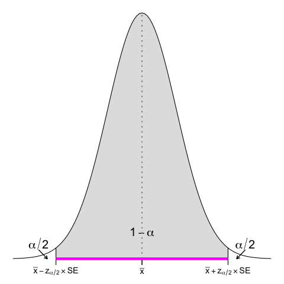
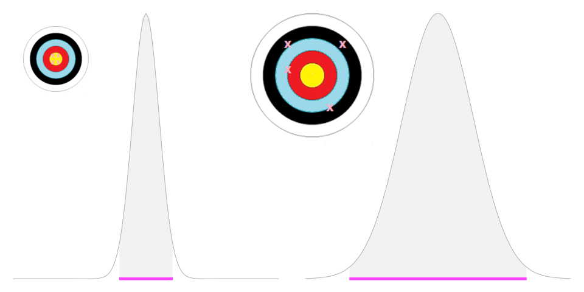
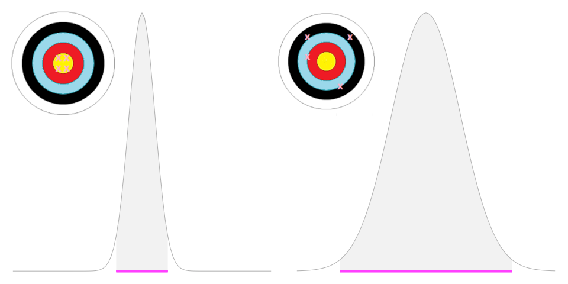

# Introduction to statistics

### (Day 2)

---
## Agenda

- **Where:**
  - Mar 4: :white_check_mark:
  - Mar 5: AULA DARWIN - MBC
  - Mar 6 : Online

- **When:**
  - 14-17
  - 1 coffee break

- **Who:**
    
    - Paola Dalmasso paola.dalmasso@unito.it
    - Alessia Visconti alessia.visconti@unito.it

- **How (to pass):**
    - Attend at least 2 lessons

---
## How to ask questions/give feedback

- Interrupt me
- Take advantage of end/start/breaks
- Send emails alessia.visconti@unito.it
- Use the shared pad: https://etherpad.wikimedia.org/p/intro_stats_2024_specialita (or https://t.ly/vRbvy)

---

# Recap

---
## Recap

- The collection, organisation, summarisation, and analysis of data   &nbsp;&nbsp;&nbsp; &rarr; *Descriptive* &nbsp;statistics

- The drawing of inferences about a body of data when only a part of the data is observed   &nbsp;&nbsp;&nbsp; &rarr; *Inferential* &nbsp;statistics

<!-- - Individuare in maniera efficiente i tratti importanti delle informazioni che sono state raccolte

- Partire dal particolare per capire come le informazioni si possono estendere alla totalità -->

---
## Recap

- When can't study a population, we select a representative sample
- There are different sampling strategies

- Data are described with measures of centrality (mode, median, mean) and dispersion (range, IQR, standard deviation)
- Parameters (calculated on the population) *vs*&nbsp; statistics (calculated on the sample)

---

# The Normal Distribution & 
# the Central Limit Theorem

---
## Learning objectives

- Know the characteristics of the Normal distribution
- Understand the Central Limit Theorem

---
## The Normal distribution

- Symmetrical
- $\mathcal{N} = (\mu, \sigma^2)$

$$
{\displaystyle f(x)={\frac {1}{\sigma {\sqrt {2\pi }}}}e^{-{\frac {1}{2}}\left({\frac {x-\mu }{\sigma }}\right)^{2}}} 
$$

<!-- La distribuzione GAUSSIANA è una distribuzione caratterizzata da una forma a campana.
E' simmetrica.
Definita in maniera univoca dalla media e dalla deviazione standard 

sigma^2 e' la varianza -->

---
## The Normal distribution

- Symmetrical
- $\mathcal{N} = (\mu, \sigma^2)$

$$
{\displaystyle f(x)={\frac {1}{\sigma {\sqrt {2\pi }}}}e^{-{\frac {1}{2}}\left({\frac {x-\mu }{\sigma }}\right)^{2}}} 
$$

<!-- A diverse combinazioni di mu/sigma corrispondono diverse (e infinte) ditribuzioni normali 

e = costante matematica che e' circa 2.718
-->

---
## The Normal distribution

- Symmetrical
- $\mathcal{N} = (\mu, \sigma^2)$
- $\text{Area under the curve} = 1$

:question: &nbsp;&nbsp;&nbsp; What is the area left of the 
&nbsp;&nbsp;&nbsp;&nbsp;&nbsp;&nbsp;&nbsp;&nbsp;&nbsp; median? And right?

$$
{\displaystyle f(x)={\frac {1}{\sigma {\sqrt {2\pi }}}}e^{-{\frac {1}{2}}\left({\frac {x-\mu }{\sigma }}\right)^{2}}} 
$$

<!-- il fatto che l'area e' 1 dipende dal fatto che la normale sia una distribuzione di probabilita' -->

---
## The  Normal distribution

- Symmetrical
- $\mathcal{N} = (\mu, \sigma^2)$
- $\text{Area under the curve} = 1$
- *3-sigma* (or *68–95–99.7*) rule

<!-- Ci dice che il 68,27%, il 95,45% e il 99,73% dei valori si trovano rispettivamente all'interno di una, due e tre deviazioni standard della media 

Perche' questo ci e' utile? Lo vedremo tra poco quando parleremo degli intervalli di confidenza, ma possiamo anticipare che puo' essere usata per ottenere rapidamente una stima approssimativa della probabilità di qualcosa o come semplice test empirico per individuare valori anomali 
-->

---
## The Standard Normal distribution

- $\mathcal{N} = Z = (0, 1)$

<!-- Distribuzione normale standardizzata -->

---
## The Standard Normal distribution

- $\mathcal{N} = (\mu, \sigma^2) \rightarrow Z = (0, 1)$

<!-- Magenta: mu=4, sd=1.5 -->

---
## The Standard Normal distribution

- $\mathcal{N} = (\mu, \sigma^2) \rightarrow Z = (0, 1)$

- $z = \frac{x - \mu}{}$

---
## The Standard Normal distribution

- $\mathcal{N} = (\mu, \sigma^2) \rightarrow Z = (0, 1)$

- $z = \frac{x - \mu}{\sigma}$

---
## The Standard Normal distribution

- $\mathcal{N} = (\mu, \sigma^2) \rightarrow Z = (0, 1)$

- $z = \frac{x - \mu}{\sigma}$

<!-- E perche la SND ci piace? Perche' esistono delle tavole che ci dicono qual e' l'area sottesa  ad una certa porzione della curva, che corrispondono alla probabilita' di trovare (nel caso di queste tavole) un valore < di quello osservato (area colorata)

Ci sono diverse versioni di queste tabelle, per esempio quella complementare che riporta l'area per la zona bianca (probabilita' di osservare valori piu' estremi) -->

---
## The Standard Normal distribution in practice

:pushpin: &nbsp;&nbsp;&nbsp; $\mu=170 \text{ cm}$ &nbsp;&nbsp;&nbsp; $\sigma=9.5 \text{ cm}$

&nbsp;&nbsp;&nbsp;&nbsp;&nbsp;&nbsp;&nbsp;&nbsp;&nbsp; $\mathcal{P}(x \geq 176) = \text{ ?}$

---
## The Standard Normal distribution in practice

:pushpin: &nbsp;&nbsp;&nbsp; $\mu=170 \text{ cm}$ &nbsp;&nbsp;&nbsp; $\sigma=9.5 \text{ cm}$

&nbsp;&nbsp;&nbsp;&nbsp;&nbsp;&nbsp;&nbsp;&nbsp;&nbsp; $\mathcal{z} = \frac{x - \mu}{\sigma} =  \frac{176 - 170}{9.5} = 0.63$

&nbsp;&nbsp;&nbsp;&nbsp;&nbsp;&nbsp;&nbsp;&nbsp;&nbsp; $\mathcal{P}(x \geq 176) = 1 - 0.7357 =$
&nbsp;&nbsp;&nbsp;&nbsp;&nbsp;&nbsp;&nbsp;&nbsp;&nbsp;&nbsp;&nbsp;&nbsp;&nbsp;&nbsp;&nbsp;&nbsp;&nbsp;&nbsp;&nbsp;&nbsp;&nbsp;&nbsp;&nbsp;&nbsp;&nbsp; $= 0.26$

	

---
### Exercise #7

:pushpin: &nbsp;&nbsp;&nbsp; $\mu=170 \text{ cm}$ &nbsp;&nbsp;&nbsp; $\sigma=9.5 \text{ cm}$

&nbsp;&nbsp;&nbsp;&nbsp;&nbsp;&nbsp;&nbsp;&nbsp;&nbsp; $\mathcal{P}(x \geq 179.5) = \text{ ?}$

	

---
### Exercise #7 -- Solution

:pushpin: &nbsp;&nbsp;&nbsp; $\mu=170 \text{ cm}$ &nbsp;&nbsp;&nbsp; $\sigma=9.5 \text{ cm}$

&nbsp;&nbsp;&nbsp;&nbsp;&nbsp;&nbsp;&nbsp;&nbsp;&nbsp; $\mathcal{z} = \frac{x - \mu}{\sigma} =  \frac{179.5 - 170}{9.5} = 1$

&nbsp;&nbsp;&nbsp;&nbsp;&nbsp;&nbsp;&nbsp;&nbsp;&nbsp; $\mathcal{P}(x \geq 179.5) = 1 - 0.8413 =$
&nbsp;&nbsp;&nbsp;&nbsp;&nbsp;&nbsp;&nbsp;&nbsp;&nbsp;&nbsp;&nbsp;&nbsp;&nbsp;&nbsp;&nbsp;&nbsp;&nbsp;&nbsp;&nbsp;&nbsp;&nbsp;&nbsp;&nbsp;&nbsp;&nbsp; $= 0.16$

	

--- 
## The Standard Normal distribution in practice

:pushpin: &nbsp;&nbsp;&nbsp; $n=6,705$ &nbsp;&nbsp;&nbsp;15 y.o. males
&nbsp;&nbsp;&nbsp;&nbsp;&nbsp;&nbsp;&nbsp;&nbsp;&nbsp; $\bar{x}_{\text{BMI}} = 21.5 \text{ kg}/\text{m}^2$
&nbsp;&nbsp;&nbsp;&nbsp;&nbsp;&nbsp;&nbsp;&nbsp;&nbsp; $s_{\text{BMI}}  = 3.1 \text{ kg}/\text{m}^2$

&nbsp;&nbsp;&nbsp;&nbsp;&nbsp;&nbsp;&nbsp;&nbsp;&nbsp; What percentage of 15 y.o. 
&nbsp;&nbsp;&nbsp;&nbsp;&nbsp;&nbsp;&nbsp;&nbsp;&nbsp; males have $\text{BMI} > 25$ in the
&nbsp;&nbsp;&nbsp;&nbsp;&nbsp;&nbsp;&nbsp;&nbsp;&nbsp; population?

https://hbsc.org

<!-- Studio internazionale che si tiene ogni 4 anni e che raccoglie informazioni sui ragazzi di 11, 13, 15 e, recentemente anche 17 anni (che sono la mia popolazione) 
Ma non li raccoglie tutti, ne raccoglie un campione. -->

---
## The Standard Normal distribution in practice

:pushpin: &nbsp;&nbsp;&nbsp; $n=6,705$ &nbsp;&nbsp;&nbsp;15 y.o. males
&nbsp;&nbsp;&nbsp;&nbsp;&nbsp;&nbsp;&nbsp;&nbsp;&nbsp; $\mu_{\text{BMI}} = 21.5 \text{ kg}/\text{m}^2$
&nbsp;&nbsp;&nbsp;&nbsp;&nbsp;&nbsp;&nbsp;&nbsp;&nbsp; $\sigma_{\text{BMI}}  = 3.1 \text{ kg}/\text{m}^2$

&nbsp;&nbsp;&nbsp;&nbsp;&nbsp;&nbsp;&nbsp;&nbsp;&nbsp; What percentage of 15 y.o. 
&nbsp;&nbsp;&nbsp;&nbsp;&nbsp;&nbsp;&nbsp;&nbsp;&nbsp; males have  $\text{BMI} > 25$ in the
&nbsp;&nbsp;&nbsp;&nbsp;&nbsp;&nbsp;&nbsp;&nbsp;&nbsp; population?

$$
{\displaystyle f(x)={\frac {1}{\sigma {\sqrt {2\pi }}}}e^{-{\frac {1}{2}}\left({\frac {x-\mu }{\sigma }}\right)^{2}}} 
$$

<!-- Professione di fede, e andiamo a stimare i parametri della popolazione andandoli a eguagliare alle statistiche

ricordiamo
- statistiche se calcolate su un campione di dati
- parametri se descrivono la popolazione

Adiamo a calcolare la funzione corrispondente e sovvraporla al valore della popolazione
 -->

---
## The Standard Normal distribution in practice

:pushpin: &nbsp;&nbsp;&nbsp; $n=6,705$ &nbsp;&nbsp;&nbsp;15 y.o. males
&nbsp;&nbsp;&nbsp;&nbsp;&nbsp;&nbsp;&nbsp;&nbsp;&nbsp; $\mu_{\text{BMI}} = 21.5 \text{ kg}/\text{m}^2$
&nbsp;&nbsp;&nbsp;&nbsp;&nbsp;&nbsp;&nbsp;&nbsp;&nbsp; $\sigma_{\text{BMI}}  = 3.1 \text{ kg}/\text{m}^2$

&nbsp;&nbsp;&nbsp;&nbsp;&nbsp;&nbsp;&nbsp;&nbsp;&nbsp; What percentage of 15 y.o. 
&nbsp;&nbsp;&nbsp;&nbsp;&nbsp;&nbsp;&nbsp;&nbsp;&nbsp; males have  $\text{BMI} > 25$ in the
&nbsp;&nbsp;&nbsp;&nbsp;&nbsp;&nbsp;&nbsp;&nbsp;&nbsp; population?

$$
z = \frac{x - \mu}{\sigma} = \frac{25 - 21.5}{3.1} = 1.12
$$

---
## The Standard Normal distribution in practice

:pushpin: &nbsp;&nbsp;&nbsp; $n=6,705$ &nbsp;&nbsp;&nbsp;15 y.o. males
&nbsp;&nbsp;&nbsp;&nbsp;&nbsp;&nbsp;&nbsp;&nbsp;&nbsp; $\mu_{\text{BMI}} = 21.5 \text{ kg}/\text{m}^2$
&nbsp;&nbsp;&nbsp;&nbsp;&nbsp;&nbsp;&nbsp;&nbsp;&nbsp; $\sigma_{\text{BMI}}  = 3.1 \text{ kg}/\text{m}^2$

&nbsp;&nbsp;&nbsp;&nbsp;&nbsp;&nbsp;&nbsp;&nbsp;&nbsp; What percentage of 15 y.o. 
&nbsp;&nbsp;&nbsp;&nbsp;&nbsp;&nbsp;&nbsp;&nbsp;&nbsp; males have  $\text{BMI} > 25$ in the
&nbsp;&nbsp;&nbsp;&nbsp;&nbsp;&nbsp;&nbsp;&nbsp;&nbsp; population?

$$
z = \frac{x - \mu}{\sigma} = \frac{25 - 21.5}{3.1} = 1.12
$$

&nbsp;&nbsp;&nbsp;&nbsp;&nbsp;&nbsp;&nbsp;&nbsp;&nbsp; $\mathcal{P}(\text{BMI}>25) = 1 - 0.8686 = 0.1314 \rightarrow 13.1\%$

<!-- Quello che abbiamo fatto e' un INFERENZA, non sappiamo quanti sono i 15enni sovrappeso, ma se il nostro campione e' rappresentativo, stimiamo che siano il 13.1% della popolazione -->

---
### Exercise #8

:pushpin: &nbsp;&nbsp;&nbsp; $n=6,705$ &nbsp;&nbsp;&nbsp;15 y.o. males
&nbsp;&nbsp;&nbsp;&nbsp;&nbsp;&nbsp;&nbsp;&nbsp;&nbsp; $\mu_{\text{BMI}} = 21.5 \text{ kg}/\text{m}^2$
&nbsp;&nbsp;&nbsp;&nbsp;&nbsp;&nbsp;&nbsp;&nbsp;&nbsp; $\sigma_{\text{BMI}}  = 3.1 \text{ kg}/\text{m}^2$

&nbsp;&nbsp;&nbsp;&nbsp;&nbsp;&nbsp;&nbsp;&nbsp;&nbsp; What percentage of 15 y.o. 
&nbsp;&nbsp;&nbsp;&nbsp;&nbsp;&nbsp;&nbsp;&nbsp;&nbsp; males have $\text{BMI} > 30$ in the
&nbsp;&nbsp;&nbsp;&nbsp;&nbsp;&nbsp;&nbsp;&nbsp;&nbsp; population?

---
### Exercise #8 -- Solution

:pushpin: &nbsp;&nbsp;&nbsp; $n=6,705$ &nbsp;&nbsp;&nbsp;15 y.o. males
&nbsp;&nbsp;&nbsp;&nbsp;&nbsp;&nbsp;&nbsp;&nbsp;&nbsp; $\mu_{\text{BMI}} = 21.5 \text{ kg}/\text{m}^2$
&nbsp;&nbsp;&nbsp;&nbsp;&nbsp;&nbsp;&nbsp;&nbsp;&nbsp; $\sigma_{\text{BMI}}  = 3.1 \text{ kg}/\text{m}^2$

&nbsp;&nbsp;&nbsp;&nbsp;&nbsp;&nbsp;&nbsp;&nbsp;&nbsp; What percentage of 15 y.o. 
&nbsp;&nbsp;&nbsp;&nbsp;&nbsp;&nbsp;&nbsp;&nbsp;&nbsp; males have $\text{BMI} > 30$ in the
&nbsp;&nbsp;&nbsp;&nbsp;&nbsp;&nbsp;&nbsp;&nbsp;&nbsp; population?

&nbsp;&nbsp;&nbsp;&nbsp;&nbsp;&nbsp;&nbsp;&nbsp;&nbsp; $z = \frac{x - \mu}{\sigma} = \frac{30 - 21.5}{3.1} = 2.74$
&nbsp;&nbsp;&nbsp;&nbsp;&nbsp;&nbsp;&nbsp;&nbsp;&nbsp; $\mathcal{P}(\text{BMI}>30) = 1 - 0.9969$
&nbsp;&nbsp;&nbsp;&nbsp;&nbsp;&nbsp;&nbsp;&nbsp;&nbsp;&nbsp;&nbsp;&nbsp;&nbsp;&nbsp;&nbsp;&nbsp;&nbsp;&nbsp;&nbsp;&nbsp;&nbsp;&nbsp;&nbsp;&nbsp;&nbsp;&nbsp;&nbsp;&nbsp;&nbsp;&nbsp;&nbsp;&nbsp;&nbsp;&nbsp;&nbsp;&nbsp;&nbsp;&nbsp; $= 0.0031 \rightarrow 0.31\%$

---
### Exercise #9

:pushpin: &nbsp;&nbsp;&nbsp; $n=6,705$ &nbsp;&nbsp;&nbsp;15 y.o. males
&nbsp;&nbsp;&nbsp;&nbsp;&nbsp;&nbsp;&nbsp;&nbsp;&nbsp; $\mu_{\text{BMI}} = 21.5 \text{ kg}/\text{m}^2$
&nbsp;&nbsp;&nbsp;&nbsp;&nbsp;&nbsp;&nbsp;&nbsp;&nbsp; $\sigma_{\text{BMI}}  = 3.1 \text{ kg}/\text{m}^2$

&nbsp;&nbsp;&nbsp;&nbsp;&nbsp;&nbsp;&nbsp;&nbsp;&nbsp; What percentage of 15 y.o. 
&nbsp;&nbsp;&nbsp;&nbsp;&nbsp;&nbsp;&nbsp;&nbsp;&nbsp; males have $18.5< \text{BMI} <25$ 
&nbsp;&nbsp;&nbsp;&nbsp;&nbsp;&nbsp;&nbsp;&nbsp;&nbsp; in the population?

---
### Exercise #9 -- Solution

:pushpin: &nbsp;&nbsp;&nbsp; $n=6,705$ &nbsp;&nbsp;&nbsp;15 y.o. males
&nbsp;&nbsp;&nbsp;&nbsp;&nbsp;&nbsp;&nbsp;&nbsp;&nbsp; $\mu_{\text{BMI}} = 21.5 \text{ kg}/\text{m}^2$
&nbsp;&nbsp;&nbsp;&nbsp;&nbsp;&nbsp;&nbsp;&nbsp;&nbsp; $\sigma_{\text{BMI}}  = 3.1 \text{ kg}/\text{m}^2$

&nbsp;&nbsp;&nbsp;&nbsp;&nbsp;&nbsp;&nbsp;&nbsp;&nbsp; What percentage of 15 y.o. 
&nbsp;&nbsp;&nbsp;&nbsp;&nbsp;&nbsp;&nbsp;&nbsp;&nbsp; males have $18.5< \text{BMI} <25$ 
&nbsp;&nbsp;&nbsp;&nbsp;&nbsp;&nbsp;&nbsp;&nbsp;&nbsp; in the population?

<!-- Io voglio sapere quant' e' l'area colorata, che posso calcolare come 1-parte bianca <18.5 e poi -parte bianca >25 -->

---
### Exercise #9 -- Solution

:pushpin: &nbsp;&nbsp;&nbsp; $n=6,705$ &nbsp;&nbsp;&nbsp;15 y.o. males
&nbsp;&nbsp;&nbsp;&nbsp;&nbsp;&nbsp;&nbsp;&nbsp;&nbsp; $\mu_{\text{BMI}} = 21.5 \text{ kg}/\text{m}^2$
&nbsp;&nbsp;&nbsp;&nbsp;&nbsp;&nbsp;&nbsp;&nbsp;&nbsp; $\sigma_{\text{BMI}}  = 3.1 \text{ kg}/\text{m}^2$

&nbsp;&nbsp;&nbsp;&nbsp;&nbsp;&nbsp;&nbsp;&nbsp;&nbsp; What percentage of 15 y.o. 
&nbsp;&nbsp;&nbsp;&nbsp;&nbsp;&nbsp;&nbsp;&nbsp;&nbsp; males have $18.5< \text{BMI} <25$ 
&nbsp;&nbsp;&nbsp;&nbsp;&nbsp;&nbsp;&nbsp;&nbsp;&nbsp; in the population?

&nbsp;&nbsp;&nbsp;&nbsp;&nbsp;&nbsp;&nbsp;&nbsp;&nbsp; $z_{25} = \frac{x - \mu}{\sigma} = \frac{25 - 21.5}{3.1} = 1.12$
&nbsp;&nbsp;&nbsp;&nbsp;&nbsp;&nbsp;&nbsp;&nbsp;&nbsp; $\mathcal{P}(\text{BMI}>25) = 1 - 0.8686 =$
&nbsp;&nbsp;&nbsp;&nbsp;&nbsp;&nbsp;&nbsp;&nbsp;&nbsp;&nbsp;&nbsp;&nbsp;&nbsp;&nbsp;&nbsp;&nbsp;&nbsp;&nbsp;&nbsp;&nbsp;&nbsp;&nbsp;&nbsp;&nbsp;&nbsp;&nbsp;&nbsp;&nbsp;&nbsp;&nbsp;&nbsp;&nbsp;&nbsp;&nbsp;&nbsp;&nbsp;&nbsp;&nbsp;&nbsp; $= 0.131$

<!-- L'area bianca a dx di z_25 l'abbiamo appena calcolata -->

---
### Exercise #9 -- Solution

:pushpin: &nbsp;&nbsp;&nbsp; $n=6,705$ &nbsp;&nbsp;&nbsp;15 y.o. males
&nbsp;&nbsp;&nbsp;&nbsp;&nbsp;&nbsp;&nbsp;&nbsp;&nbsp; $\mu_{\text{BMI}} = 21.5 \text{ kg}/\text{m}^2$
&nbsp;&nbsp;&nbsp;&nbsp;&nbsp;&nbsp;&nbsp;&nbsp;&nbsp; $\sigma_{\text{BMI}}  = 3.1 \text{ kg}/\text{m}^2$

&nbsp;&nbsp;&nbsp;&nbsp;&nbsp;&nbsp;&nbsp;&nbsp;&nbsp; What percentage of 15 y.o. 
&nbsp;&nbsp;&nbsp;&nbsp;&nbsp;&nbsp;&nbsp;&nbsp;&nbsp; males have $18.5< \text{BMI} <25$ 
&nbsp;&nbsp;&nbsp;&nbsp;&nbsp;&nbsp;&nbsp;&nbsp;&nbsp; in the population?

&nbsp;&nbsp;&nbsp;&nbsp;&nbsp;&nbsp;&nbsp;&nbsp;&nbsp; $\mathcal{P}(\text{BMI}>25) = 0.131$

&nbsp;&nbsp;&nbsp;&nbsp;&nbsp;&nbsp;&nbsp;&nbsp;&nbsp; $z_{18.5} = \frac{x - \mu}{\sigma} = \frac{18.5 - 21.5}{3.1} = -0.97$

<!-- Nelle tavoole non abbiamo -0.97 -->

---
### Exercise #9 -- Solution

:pushpin: &nbsp;&nbsp;&nbsp; $n=6,705$ &nbsp;&nbsp;&nbsp;15 y.o. males
&nbsp;&nbsp;&nbsp;&nbsp;&nbsp;&nbsp;&nbsp;&nbsp;&nbsp; $\mu_{\text{BMI}} = 21.5 \text{ kg}/\text{m}^2$
&nbsp;&nbsp;&nbsp;&nbsp;&nbsp;&nbsp;&nbsp;&nbsp;&nbsp; $\sigma_{\text{BMI}}  = 3.1 \text{ kg}/\text{m}^2$

&nbsp;&nbsp;&nbsp;&nbsp;&nbsp;&nbsp;&nbsp;&nbsp;&nbsp; What percentage of 15 y.o. 
&nbsp;&nbsp;&nbsp;&nbsp;&nbsp;&nbsp;&nbsp;&nbsp;&nbsp; males have $18.5< \text{BMI} <25$ 
&nbsp;&nbsp;&nbsp;&nbsp;&nbsp;&nbsp;&nbsp;&nbsp;&nbsp; in the population?

&nbsp;&nbsp;&nbsp;&nbsp;&nbsp;&nbsp;&nbsp;&nbsp;&nbsp; $\mathcal{P}(\text{BMI}>25) = 0.131$

&nbsp;&nbsp;&nbsp;&nbsp;&nbsp;&nbsp;&nbsp;&nbsp;&nbsp; $z_{18.5} = \frac{x - \mu}{\sigma} = \frac{18.5 - 21.5}{3.1} = -0.97$

<!-- Nelle tavoole non abbiamo -0.97, ma sappiamo che la normale e' simmetrica rispetto alla mediana/media/moda, quindi sappiamo che area > 0.97 == area < -0.97 -->

---
### Exercise #9 -- Solution

:pushpin: &nbsp;&nbsp;&nbsp; $n=6,705$ &nbsp;&nbsp;&nbsp;15 y.o. males
&nbsp;&nbsp;&nbsp;&nbsp;&nbsp;&nbsp;&nbsp;&nbsp;&nbsp; $\mu_{\text{BMI}} = 21.5 \text{ kg}/\text{m}^2$
&nbsp;&nbsp;&nbsp;&nbsp;&nbsp;&nbsp;&nbsp;&nbsp;&nbsp; $\sigma_{\text{BMI}}  = 3.1 \text{ kg}/\text{m}^2$

&nbsp;&nbsp;&nbsp;&nbsp;&nbsp;&nbsp;&nbsp;&nbsp;&nbsp; What percentage of 15 y.o. 
&nbsp;&nbsp;&nbsp;&nbsp;&nbsp;&nbsp;&nbsp;&nbsp;&nbsp; males have $18.5< \text{BMI} <25$ 
&nbsp;&nbsp;&nbsp;&nbsp;&nbsp;&nbsp;&nbsp;&nbsp;&nbsp; in the population?

&nbsp;&nbsp;&nbsp;&nbsp;&nbsp;&nbsp;&nbsp;&nbsp;&nbsp; $\mathcal{P}(\text{BMI}>30) = 0.131$

&nbsp;&nbsp;&nbsp;&nbsp;&nbsp;&nbsp;&nbsp;&nbsp;&nbsp; $z_{18.5} = \frac{x - \mu}{\sigma} = \frac{18.5 - 21.5}{3.1} = -0.97$
&nbsp;&nbsp;&nbsp;&nbsp;&nbsp;&nbsp;&nbsp;&nbsp;&nbsp; $\mathcal{P}(\text{BMI}<18.5) = 1 - 0.8340 =$
&nbsp;&nbsp;&nbsp;&nbsp;&nbsp;&nbsp;&nbsp;&nbsp;&nbsp;&nbsp;&nbsp;&nbsp;&nbsp;&nbsp;&nbsp;&nbsp;&nbsp;&nbsp;&nbsp;&nbsp;&nbsp;&nbsp;&nbsp;&nbsp;&nbsp;&nbsp;&nbsp;&nbsp;&nbsp;&nbsp;&nbsp;&nbsp;&nbsp;&nbsp;&nbsp;&nbsp;&nbsp;&nbsp;&nbsp;&nbsp;&nbsp;&nbsp;&nbsp; $= 0.166$

<!-- Andiamo quindi a vedere l'area fino a 0.97 e poi a calcolare quella oltre 0.97 facendo 1- -->

---
### Exercise #9 -- Solution

:pushpin: &nbsp;&nbsp;&nbsp; $n=6,705$ &nbsp;&nbsp;&nbsp;15 y.o. males
&nbsp;&nbsp;&nbsp;&nbsp;&nbsp;&nbsp;&nbsp;&nbsp;&nbsp; $\mu_{\text{BMI}} = 21.5 \text{ kg}/\text{m}^2$
&nbsp;&nbsp;&nbsp;&nbsp;&nbsp;&nbsp;&nbsp;&nbsp;&nbsp; $\sigma_{\text{BMI}}  = 3.1 \text{ kg}/\text{m}^2$

&nbsp;&nbsp;&nbsp;&nbsp;&nbsp;&nbsp;&nbsp;&nbsp;&nbsp; What percentage of 15 y.o. 
&nbsp;&nbsp;&nbsp;&nbsp;&nbsp;&nbsp;&nbsp;&nbsp;&nbsp; males have $18.5< \text{BMI} <25$ 
&nbsp;&nbsp;&nbsp;&nbsp;&nbsp;&nbsp;&nbsp;&nbsp;&nbsp; in the population?

&nbsp;&nbsp;&nbsp;&nbsp;&nbsp;&nbsp;&nbsp;&nbsp;&nbsp; $\mathcal{P}(\text{BMI}>30) = 0.131$
&nbsp;&nbsp;&nbsp;&nbsp;&nbsp;&nbsp;&nbsp;&nbsp;&nbsp; $\mathcal{P}(\text{BMI}<18.5) = 0.166$

&nbsp;&nbsp;&nbsp;&nbsp;&nbsp;&nbsp;&nbsp;&nbsp;&nbsp; $\mathcal{P}(18.5 < \text{BMI}<25) = 1-0.131-0.166 = 0.703 \rightarrow 70.3\%$

<!-- Non ci resta che fare ultimo passo, ovvero calcolare l'area colorata in mezzo come 1-due aree bianche -->

---
## The Normal distribution in the wild

- Several natural phenomena approximate a Normal distribution

<!-- Come per esempio il peso corporeo, l'altezza, il BMI, il quoziente inteellettivo... -->

---
## The Normal distribution in the wild

- Several natural phenomena approximate a Normal distribution
- Several probability distributions approximate a Normal distribution

<!-- Supponiamo di aver fatto un esperimento, di aver preso una monetina, lanciata 5 volte e contato il numero di volte che e' venuto testa. A volte ne verranno 0/5, a volte 5/5 ma (visto che la monentina e' bilanciata) e' piu' probabile che ne vengano 2/ o 3/5.  Se questi 5 lanci li facciamo per 1000 volte e poi andiamo a rappresentarli con un istogramma, otteniamo questa figura, che ha, come ci aspettiamo, una media di 2.5, anche se ci sono due "mode". 

Questo esempio ci permette di introdurre un nuovo, utuilissimo concetto che e' quello della distribuzione campionaria -->

---
## Sampling distribution

<!-- Distribuzione campionaria e' la distribuzione di tutti i possibile valori che possono essere assunti da qualche statistica (e.g., la media) calcolata da campioni della stessa dimenzione ed estratti casualmente dalla stessa popolazione 

Come si costruisce? 
1. Estraggo tutti i possibili capioni di dimensione n
2. Calcolo la statistica di interesse
3. Tego traccia di ciascun valore della statistica e della sua frequenza 

La forma della distribuzione delle medie campionarie è approssimativamente normale,  indipendentemente dalla distribuzione dei valori della popolazione d’origine dalla quale i campioni sono estratti, per n sufficientemente grande.-->

---
## The Central Limit Theorem (CLT)

:dart: &nbsp;&nbsp;&nbsp; As the sample size gets larger, the sampling distribution of the 
&nbsp;&nbsp;&nbsp;&nbsp;&nbsp;&nbsp;&nbsp;&nbsp;&nbsp; sample means approaches a normal distribution $\mathcal{N} = (\mu, \frac{\sigma^2}{n})$

&nbsp;&nbsp;&nbsp;&nbsp;&nbsp;&nbsp;&nbsp;&nbsp;&nbsp; $\sqrt{ \frac{\sigma^2}{n}} = \frac{\sigma}{\sqrt{n}} \rightarrow$ &nbsp; standard error (SE)

<!-- e per la legge dei grandi numeri, quando n tende all'infinito, la media del campioname è uguale alla media della popolazione.

SE per esempio nei nostri lanci di monetine l'esperimento lo avessimo fatto non per 1000 ma per 100k volte, avremmo visto un'approssimazione piu' normale e meno bi-modale

La varianza della distribuzione campionaria  è il rapporto tra tra la varianza della popolazione e la dimenzione del campione usato per calcolarla 

La radice quastrada della varianza della distribizione campionaria e' l'errore standard della media

L'errore standard diminuisce al crescere di N e al decresere della varianza

Quanto deve essere grande il campione perche' la distribuzione sia normale? 
Nella maggior parte delle situazioni pratiche, n=30 e' soddisfacente, ma l'approssimazione migliora all'aumentare di n -->

---
## The Central Limit Theorem (CLT)

:dart: &nbsp;&nbsp;&nbsp; As the sample size gets larger, the sampling distribution of the 
&nbsp;&nbsp;&nbsp;&nbsp;&nbsp;&nbsp;&nbsp;&nbsp;&nbsp; sample means approaches a normal distribution $\mathcal{N} = (\mu, \frac{\sigma^2}{n})$

&nbsp;&nbsp;&nbsp;&nbsp;&nbsp;&nbsp;&nbsp;&nbsp;&nbsp; $\sqrt{ \frac{\sigma^2}{n}} = \frac{\sigma}{\sqrt{n}} \rightarrow$ &nbsp; standard error (SE)

:dart: &nbsp;&nbsp;&nbsp;  standard error $\neq$ standard deviation
&nbsp;&nbsp;&nbsp;&nbsp;&nbsp;&nbsp;&nbsp;&nbsp;&nbsp; standard deviation (SD) &nbsp; $\rightarrow$ &nbsp; spread in the collected data
&nbsp;&nbsp;&nbsp;&nbsp;&nbsp;&nbsp;&nbsp;&nbsp;&nbsp; standard error (SE) &nbsp; $\rightarrow$ &nbsp; error in the estimation

<!-- Standard deviation: Si riferisce alle osservazioni, misura la variabilita' delle osservazioni

Standard error: si riferosce alla stima di un parametro, misure l'incertezza nella statistica ottenuta da un campione
 -->

---
## The Standard Error

:dart: &nbsp;&nbsp;&nbsp; 95\% of the sample means 
&nbsp;&nbsp;&nbsp;&nbsp;&nbsp;&nbsp;&nbsp;&nbsp;&nbsp; are within 1.96 SE from the
&nbsp;&nbsp;&nbsp;&nbsp;&nbsp;&nbsp;&nbsp;&nbsp;&nbsp; population mean

<!-- Approssimando una Normale, la distribizione campionaria ha le stesse (utili) caratteristiche della normale:
- e' simmetrica
- ha area 1
- 95% delle medie campionarie sono a 2 SE dalla vera media della popolazione 

Tutti concetti che ci torneranno utili tra poco
-->

--- 
## The Standard Error

<!-- Piu; lo SE e' piccolo, piu' la media campionaria osservata sara' vicina alla vera media della popolazione -->

---

## Summary

- Multiple phenomena and statistical distributions are normally distributed
- Using the standard normal distribution we can calculate the probability of an observation
- For large samples, the sampling distribution of the sample means will be normally distributed (CLT)

<!-- Ok, ora abbiamo le basi per affrontare il prossimo argomento, la statistica inferenziale -->

---

# Inferential statistics

<!--- Partire dal particolare per capire come le informazioni si possono estendere alla totalità -->

---
## Learning objectives

- Understanding how to move from empirical to theoretical distributions
- Be able to calculate and interpret point and interval estimates (confidence intervals)

---
## From sample to population

<!-- Ricapitoliamo: quando non possiamo studiare una popolazione ne usiamo un campione rappresentativo -->

---
## From sample to population

<!-- e poi usiamo le informazioni raccolte dal campione per trarre delle conclusioni sulla popolazione 
Questo processo si chiama statistica inferenziale,

Procedimento induttivo che ha lo scopo di stimare i parametri (caratteristiche) sconosciuti della popolazione a partire dalle statistiche (stime conosciute) del campione 

Sulla base di un campione estratto casualmente da 1 popolazione cosa può essere detto circa la popolazione da cui il campione è stato estratto? -->

---
## Point estimates

:pushpin: &nbsp;&nbsp;&nbsp; $n=6,705$ &nbsp;&nbsp;&nbsp;15 y.o. males
&nbsp;&nbsp;&nbsp;&nbsp;&nbsp;&nbsp;&nbsp;&nbsp;&nbsp; $\mu_{\text{BMI}} = 21.5 \text{ kg}/\text{m}^2$
&nbsp;&nbsp;&nbsp;&nbsp;&nbsp;&nbsp;&nbsp;&nbsp;&nbsp; $\sigma_{\text{BMI}}  = 3.1 \text{ kg}/\text{m}^2$

&nbsp;&nbsp;&nbsp;&nbsp;&nbsp;&nbsp;&nbsp;&nbsp;&nbsp; What percentage of 15 y.o. 
&nbsp;&nbsp;&nbsp;&nbsp;&nbsp;&nbsp;&nbsp;&nbsp;&nbsp; males have $\text{BMI} > 25$ in the
&nbsp;&nbsp;&nbsp;&nbsp;&nbsp;&nbsp;&nbsp;&nbsp;&nbsp; population?

<!-- In realta' una stima puntuale l'abbiamo gia' fatta in passato, vi ricordate quando vi ho detto della processione di fede? Siao andati a la stima ottenuta nel campione per inferire il parametro della popolazione.

Quello che abbiamo fatto e' una STIMA PUNTUALE. Abbiamo preso due statistiche del campione e siamo andati ad usarli per stimare due parametri della popolazione

Questo paramentro ha pero' un errore e il suo grado di attendibilita' viene valutato in termini di probabilita'
-->

--- 
## Confidence intervals

:dart: &nbsp;&nbsp;&nbsp; A confidence interval (CI) is a
&nbsp;&nbsp;&nbsp;&nbsp;&nbsp;&nbsp;&nbsp;&nbsp;&nbsp; range of values which includes   
&nbsp;&nbsp;&nbsp;&nbsp;&nbsp;&nbsp;&nbsp;&nbsp;&nbsp; the estimated parameter with
&nbsp;&nbsp;&nbsp;&nbsp;&nbsp;&nbsp;&nbsp;&nbsp;&nbsp; a given degree of confidence

<!-- E come? Attraverso gli CI, che stimano il parametro della popolazione tramite un intervallo di valori che, con una probabilità prefissata, comprende il vero valore del parametro sconosciuto. 

Per esempio il 95% delle medie campionarie sono a 2 SE dalla vera media della popolazione, quindi i valori che finiscono nell'intervallo di 2 SE dalla media hanno il 95% di probabilita' di inclidere il vero parametro sconosciuto 

I CI vengono costruti attorno alla stima puntuale 

Infatti non abbiamo mu e non abbiamo sigma, ma abbiamo la media e la varianza campionaria (le nostre stime puntuali).
-->

---
##  Confidence intervals for means

:pushpin: &nbsp;&nbsp;&nbsp; $n=6,705$ &nbsp;&nbsp;&nbsp;15 y.o. males
&nbsp;&nbsp;&nbsp;&nbsp;&nbsp;&nbsp;&nbsp;&nbsp;&nbsp; $\bar{x}_{\text{BMI}} = 21.5 \text{ kg}/\text{m}^2$
&nbsp;&nbsp;&nbsp;&nbsp;&nbsp;&nbsp;&nbsp;&nbsp;&nbsp; $s_{\text{BMI}}  = 3.1 \text{ kg}/\text{m}^2$

https://hbsc.org

<!-- Calcoliamo il 95% CI per la nostra stima -->

---
##  Confidence intervals for means

:pushpin: &nbsp;&nbsp;&nbsp; $n=6,705$ &nbsp;&nbsp;&nbsp;15 y.o. males
&nbsp;&nbsp;&nbsp;&nbsp;&nbsp;&nbsp;&nbsp;&nbsp;&nbsp; $\bar{x}_{\text{BMI}} = 21.5 \text{ kg}/\text{m}^2$
&nbsp;&nbsp;&nbsp;&nbsp;&nbsp;&nbsp;&nbsp;&nbsp;&nbsp; $s_{\text{BMI}}  = 3.1 \text{ kg}/\text{m}^2$

&nbsp;&nbsp;&nbsp;&nbsp;&nbsp;&nbsp;&nbsp;&nbsp;&nbsp; $\text{SE}=\sigma/\sqrt{n}$, &nbsp; where $\sigma=\text{ ?}$
&nbsp;&nbsp;&nbsp;&nbsp;&nbsp;&nbsp;&nbsp;&nbsp;&nbsp; $\hat{\text{SE}}=s/\sqrt{n} = \frac{3.1}{\sqrt(6,705)}=0.038$

https://hbsc.org

---
## Confidence intervals for means

:pushpin: &nbsp;&nbsp;&nbsp; $n=6,705$ &nbsp;&nbsp;&nbsp;15 y.o. males
&nbsp;&nbsp;&nbsp;&nbsp;&nbsp;&nbsp;&nbsp;&nbsp;&nbsp; $\bar{x}_{\text{BMI}} = 21.5 \text{ kg}/\text{m}^2$
&nbsp;&nbsp;&nbsp;&nbsp;&nbsp;&nbsp;&nbsp;&nbsp;&nbsp; $s_{\text{BMI}}  = 3.1 \text{ kg}/\text{m}^2$

&nbsp;&nbsp;&nbsp;&nbsp;&nbsp;&nbsp;&nbsp;&nbsp;&nbsp; $\hat{\text{SE}}=s/\sqrt{n} = \frac{3.1}{\sqrt(6,705)}=0.038$

&nbsp;&nbsp;&nbsp;&nbsp;&nbsp;&nbsp;&nbsp;&nbsp;&nbsp;&nbsp;&nbsp;&nbsp;&nbsp;&nbsp;&nbsp;&nbsp;&nbsp;&nbsp;&nbsp;&nbsp;&nbsp;&nbsp;&nbsp;&nbsp;&nbsp;&nbsp;&nbsp;&nbsp;&nbsp;&nbsp; $\mathcal{P}(\bar{x} -1.96 \times SE \leq \mu \leq \bar{x} + 1.96 \times \hat{SE} ) = 95\%$

<!-- 1,96 e' il coefficiente di attendibilita', ci dice entro quanti errori standard si trova il 95% di tutti i possibili valori della media campionaria

Stima intervallare devinita come stimatore +/- il prodotto tra coeff di attendibilita' e SE. Questa quantita' si chiama anche PRECISIONE della STIMA o MARGINE DI ERRORE -->

---
## Confidence intervals for means

:pushpin: &nbsp;&nbsp;&nbsp; $n=6,705$ &nbsp;&nbsp;&nbsp;15 y.o. males
&nbsp;&nbsp;&nbsp;&nbsp;&nbsp;&nbsp;&nbsp;&nbsp;&nbsp; $\bar{x}_{\text{BMI}} = 21.5 \text{ kg}/\text{m}^2$
&nbsp;&nbsp;&nbsp;&nbsp;&nbsp;&nbsp;&nbsp;&nbsp;&nbsp; $s_{\text{BMI}}  = 3.1 \text{ kg}/\text{m}^2$

&nbsp;&nbsp;&nbsp;&nbsp;&nbsp;&nbsp;&nbsp;&nbsp;&nbsp; $\hat{\text{SE}}=s/\sqrt{n} = \frac{3.1}{\sqrt(6,705)}=0.038$

&nbsp;&nbsp;&nbsp;&nbsp;&nbsp;&nbsp;&nbsp;&nbsp;&nbsp; $\mathcal{P}(\bar{x} -1.96 \times \hat{SE} \leq \mu \leq \bar{x} + 1.96 \times \hat{SE} ) =$
&nbsp;&nbsp;&nbsp;&nbsp;&nbsp;&nbsp;&nbsp;&nbsp;&nbsp; $=\mathcal{P}(21.5 - 1.96 \times 0.038 \leq \mu \leq 21.5 + 1.96 \times 0.038 ) =$
&nbsp;&nbsp;&nbsp;&nbsp;&nbsp;&nbsp;&nbsp;&nbsp;&nbsp; $=\mathcal{P}(21.42 \leq \mu \leq 21.58) =95\%$ 

&nbsp;&nbsp;&nbsp;&nbsp;&nbsp;&nbsp;&nbsp;&nbsp;&nbsp;&nbsp;&nbsp;&nbsp;&nbsp;&nbsp;&nbsp;&nbsp;&nbsp;&nbsp;&nbsp;&nbsp;&nbsp;&nbsp;&nbsp;&nbsp;&nbsp;&nbsp;&nbsp;&nbsp;&nbsp;&nbsp;&nbsp;&nbsp;&nbsp;&nbsp;&nbsp;&nbsp; $\rightarrow 95\% \text{ Confidence Interval (CI)} = (21.42; 21.58)$

<!-- Questo esempio ci dice che abbiamo un grado di fiducia (o LIVELLO DI CONFIDENZA) del 95% che la media della popolazione si trovi tra 21.42 e 21.58 kg/m2.

Abbiao un confidence interval molto stretto perche' si sono verificate due condinzioni che, indipendentemente, migliorano la stima intervallare:
- un'alta numerosita' campionaria e
- una bassa variabilita s tra le osservazioni -->

---
## Interpreting confidence intervals 

:pushpin: &nbsp;&nbsp;&nbsp; Population: Italian women 25-74 years old
&nbsp;&nbsp;&nbsp;&nbsp;&nbsp;&nbsp;&nbsp;&nbsp;&nbsp; $\mu=123 \text{ mmHg}$

<!-- Cosa rappresentano quindi i CI? Che dati 100 campioni estratti dalla popolazione, 95 stimano un IC al cui interno è compresa la media reale della popolazione e solo 5 stimano un ic che non include la media reale -->

---
### Exercise #10

:question: &nbsp;&nbsp;&nbsp; We take a random sample of 500 Italian women aged 25-74
&nbsp;&nbsp;&nbsp;&nbsp;&nbsp;&nbsp;&nbsp;&nbsp;&nbsp; with the following summary statistics

&nbsp;&nbsp;&nbsp;&nbsp;&nbsp;&nbsp;&nbsp;&nbsp;&nbsp; $\bar{x}=122.1 \text{ mmHg}$
&nbsp;&nbsp;&nbsp;&nbsp;&nbsp;&nbsp;&nbsp;&nbsp;&nbsp; $s=19.8 \text{ mmHg}$

&nbsp;&nbsp;&nbsp;&nbsp;&nbsp;&nbsp;&nbsp;&nbsp;&nbsp; What is the 95% CI for the true mean $\mu$?

---
### Exercise #10 -- Solution

:question: &nbsp;&nbsp;&nbsp; $n=500$
&nbsp;&nbsp;&nbsp;&nbsp;&nbsp;&nbsp;&nbsp;&nbsp;&nbsp; $\bar{x}=122.1 \text{ mmHg}$
&nbsp;&nbsp;&nbsp;&nbsp;&nbsp;&nbsp;&nbsp;&nbsp;&nbsp; $s=19.8 \text{ mmHg}$

&nbsp;&nbsp;&nbsp;&nbsp;&nbsp;&nbsp;&nbsp;&nbsp;&nbsp; What is the 95% CI for the true mean $\mu$?

&nbsp;&nbsp;&nbsp;&nbsp;&nbsp;&nbsp;&nbsp;&nbsp;&nbsp; $\hat{\text{SE}}=s/\sqrt{n} = \frac{19.8}{\sqrt(500)}=0.89$
&nbsp;&nbsp;&nbsp;&nbsp;&nbsp;&nbsp;&nbsp;&nbsp;&nbsp; $\text{95\% CI} = (\bar{x} - 1.96 \times \hat{SE} \text{ ; } \bar{x} + 1.96 \times \hat{SE}) =$
&nbsp;&nbsp;&nbsp;&nbsp;&nbsp;&nbsp;&nbsp;&nbsp;&nbsp;&nbsp;&nbsp;&nbsp;&nbsp;&nbsp;&nbsp;&nbsp;&nbsp;&nbsp;&nbsp;&nbsp;&nbsp;&nbsp;&nbsp;&nbsp;&nbsp;&nbsp;&nbsp; $= (122.1 - 1.96 \times 0.89 \text{ ; }  122.1 + 1.96 \times 0.89)$
&nbsp;&nbsp;&nbsp;&nbsp;&nbsp;&nbsp;&nbsp;&nbsp;&nbsp;&nbsp;&nbsp;&nbsp;&nbsp;&nbsp;&nbsp;&nbsp;&nbsp;&nbsp;&nbsp;&nbsp;&nbsp;&nbsp;&nbsp;&nbsp;&nbsp;&nbsp;&nbsp; $= (120.34; 123.86)$

<!-- stima +/- prodotto tra il coefficiente di attendibilita' e l'errore standard 

Abbiamo un grado di confidenza del 95% che la proporzione del della popolazione p sia compresa tra questi valori -->

---
## The $\alpha$ level

:dart: &nbsp;&nbsp;&nbsp; $\text{95\% CI} = (\bar{x} - 1.96 \times \hat{SE} \text{ ; }  \bar{x} + 1.96 \times \hat{SE})$
&nbsp;&nbsp;&nbsp;&nbsp;&nbsp;&nbsp;&nbsp;&nbsp;&nbsp;  &nbsp; $1.96$ &nbsp; ?

| Confidence Level | $\alpha$ | $\alpha/2$ | $z_{\alpha/2}$ |
| ----: | ----- | ---- | ----|
| 95% | 5% | 2.5% |  |

<!-- L’intervallo di confidenza (IC) al 95% è il più usato e intuitivamente abbiamo gia' capito da dove deirva il fattore 1.96 (circa 2SE contengono il 95% dei campioni), ma vediamolo in modo piu' formale 

Quando accettiamo un livello di confidenza del 95% accettiamo implicitamente un errore del 5%, distribuito equamente a dx e sx dell'intrevallo di confidenza (in verde), quindi 2.5% per parte -->

---
## The $\alpha$ level

:dart: &nbsp;&nbsp;&nbsp; $\text{95\% CI} = (\bar{x} - 1.96 \times \hat{SE} \text{ ; }  \bar{x} + 1.96 \times \hat{SE})$
&nbsp;&nbsp;&nbsp;&nbsp;&nbsp;&nbsp;&nbsp;&nbsp;&nbsp;  &nbsp; $1.96$ &nbsp; ?

| Confidence Level | $\alpha$ | $\alpha/2$ | $z_{\alpha/2}$ |
| ----: | ----- | ---- | ----|
| 95% | 5% | 2.5% |  |

$100\% - 2.5\% = 97.5\%$ 

<!--  e qual e' l'aera di questa parte bianca? E' la totalita' dell'area (1, o 100%) meno l'area bianca (2.5%), quindi 97.5%-->

---
## The $\alpha$ level

:dart: &nbsp;&nbsp;&nbsp; $\text{95\% CI} = (\bar{x} - 1.96 \times \hat{SE} \text{ ; }  \bar{x} + 1.96 \times \hat{SE})$
&nbsp;&nbsp;&nbsp;&nbsp;&nbsp;&nbsp;&nbsp;&nbsp;&nbsp;  &nbsp; $1.96$ &nbsp; ?

| Confidence Level | $\alpha$ | $\alpha/2$ | $z_{\alpha/2}$ |
| ----: | ----- | ---- | ----|
| 95% | 5% | 2.5% | 1.96 |

$100\% - 2.5\% = 97.5\% \rightarrow \mathcal{z} = 1.96$  

<!--  E' qual e' il valore di z per cui la curva sottende un'area del 97.5%? 1.96 (le tavole si possono anche leggere al contrario, non solo da z all'area, ma anche dall'area a z) 

coefficiente di attendibilita'-->

---
## The $\alpha$ level

| Confidence Level | $\alpha$ | $\alpha/2$ | $z_{\alpha/2}$ |
| ----: | -----: | ---- | ----:|
| 95% | 5% | 2.5% | 1.96 |
| 90% | 10% | 5.0% | 1.65 |
| 99% | 1% | 0.5% | 2.58 |

$100\% - 2.5\% = 97.5\% \rightarrow \mathcal{z} = 1.96$ 
$100\% - 5.0\% = 95.0\% \rightarrow \mathcal{z} = 1.65$ 
$100\% - 0.5\% = 99.5\% \rightarrow \mathcal{z} = 2.58$ 

<!-- 95% e' il valore piu' usato, ma altri comuni sono 90 e 99%, a cui corrispondono fattori di attendibilita' di 1.65 e 2.58

Faremo piu' avanti degli esercizi in cui ci calcoleremo 90 e 99% CI -->

---
### Exercise #11

:question: &nbsp;&nbsp;&nbsp; If the CI is large we are...

&nbsp;&nbsp;&nbsp;&nbsp;&nbsp;&nbsp;&nbsp;&nbsp;&nbsp; a) more likely of including $\mu$
&nbsp;&nbsp;&nbsp;&nbsp;&nbsp;&nbsp;&nbsp;&nbsp;&nbsp; b) less likely of including $\mu$
&nbsp;&nbsp;&nbsp;&nbsp;&nbsp;&nbsp;&nbsp;&nbsp;&nbsp; c) there is no difference

---
### Exercise #11 -- Solution

:question: &nbsp;&nbsp;&nbsp; If the CI is large we are...

&nbsp;&nbsp;&nbsp;&nbsp;&nbsp;&nbsp;&nbsp;&nbsp;&nbsp; a) more likely of including $\mu$ :white_check_mark:
&nbsp;&nbsp;&nbsp;&nbsp;&nbsp;&nbsp;&nbsp;&nbsp;&nbsp; b) less likely of including $\mu$
&nbsp;&nbsp;&nbsp;&nbsp;&nbsp;&nbsp;&nbsp;&nbsp;&nbsp; c) there is no difference

---
### Exercise #11 -- Solution

---
### Exercise #12

:question: &nbsp;&nbsp;&nbsp; If the CI is large we are...

&nbsp;&nbsp;&nbsp;&nbsp;&nbsp;&nbsp;&nbsp;&nbsp;&nbsp; a) more precise
&nbsp;&nbsp;&nbsp;&nbsp;&nbsp;&nbsp;&nbsp;&nbsp;&nbsp; b) less precise
&nbsp;&nbsp;&nbsp;&nbsp;&nbsp;&nbsp;&nbsp;&nbsp;&nbsp; c) there is no difference

---
### Exercise #12 -- Solution

:question: &nbsp;&nbsp;&nbsp; If the CI is large we are...

&nbsp;&nbsp;&nbsp;&nbsp;&nbsp;&nbsp;&nbsp;&nbsp;&nbsp; a) more precise
&nbsp;&nbsp;&nbsp;&nbsp;&nbsp;&nbsp;&nbsp;&nbsp;&nbsp; b) less precise :white_check_mark:
&nbsp;&nbsp;&nbsp;&nbsp;&nbsp;&nbsp;&nbsp;&nbsp;&nbsp; c) there is no difference

---
### Exercise #12 -- Solution

---
## Confidence intervals for differences of means

:pushpin: &nbsp;&nbsp;&nbsp; Are the intervention (i) and the control (c) group different?

<!-- Ci sono casi in cui vogliamo stimare la differenza tra medie di una popolazione (per esempio tra i pazienti che hanno ricevuto un nuovo trattamento e quelli che hanno avuto la cura standard o il placebo) -->

---
## Confidence intervals for differences of means

:pushpin: &nbsp;&nbsp;&nbsp; Are the intervention (i) and the control (c) group different?

&nbsp;&nbsp;&nbsp;&nbsp;&nbsp;&nbsp;&nbsp;&nbsp;&nbsp; $\mathcal{N} = (\mu_{\text{i}} - \mu_{\text{c}}, \sqrt{\frac{\sigma_\text{i}^2}{n_\text{i}} + \frac{\sigma_\text{c}^2}{n_\text{c}}})$ 
&nbsp;&nbsp;&nbsp;&nbsp;&nbsp;&nbsp;&nbsp;&nbsp;&nbsp;&nbsp;&nbsp;&nbsp;&nbsp;&nbsp;&nbsp;&nbsp;&nbsp;&nbsp;&nbsp;&nbsp;&nbsp;&nbsp; $\rightarrow \text{CLT}$

&nbsp;&nbsp;&nbsp;&nbsp;&nbsp;&nbsp;&nbsp;&nbsp;&nbsp; $\hat{\text{SE}} = \sqrt{\frac{s_\text{i}^2}{n_\text{i}} + \frac{s_\text{c}^2}{n_\text{c}}}$

<!-- Non lo abbiamo vistp in dettaglio in precedenza, ma, per il CLT la differenza tra le medie campionarie e' una stima non distorta della differenza delle medie delle due popolazioni -->

---
## Confidence intervals for differences of means

:pushpin: &nbsp;&nbsp;&nbsp; Are the intervention (i) and the control (c) group different?

&nbsp;&nbsp;&nbsp;&nbsp;&nbsp;&nbsp;&nbsp;&nbsp;&nbsp; $n_{\text{i}}=151, \bar{x}_{\text{i}}=6.6, s_{\text{i}}=10.0$ 
&nbsp;&nbsp;&nbsp;&nbsp;&nbsp;&nbsp;&nbsp;&nbsp;&nbsp; $n_{\text{c}}=148, \bar{x}_{\text{c}}=4.0, s_{\text{c}}=8.7$ 

&nbsp;&nbsp;&nbsp;&nbsp;&nbsp;&nbsp;&nbsp;&nbsp;&nbsp; $\text{95\% CI} = \text{ ?}$ 

<!-- Abbiamo due gruppo di pazienti con COVID-19 e sindrome da distress respiratorio acuto moderato o grave (ARDS
uno con lo standard of care e uno a cui abbiamo somministrati desametasone endovenoso. 

Il numero di giorni di respirazione autonoma????

Qual e' il CI per la differenza delle medie dei due gruppi?
-->

---
## Confidence intervals for differences of means

:pushpin: &nbsp;&nbsp;&nbsp;  $n_{\text{i}}=151, \bar{x}_{\text{i}}=6.6, s_{\text{i}}=10.0$ 
&nbsp;&nbsp;&nbsp;&nbsp;&nbsp;&nbsp;&nbsp;&nbsp;&nbsp; $n_{\text{c}}=148, \bar{x}_{\text{c}}=4.0, s_{\text{c}}=8.7$ 

&nbsp;&nbsp;&nbsp;&nbsp;&nbsp;&nbsp;&nbsp;&nbsp;&nbsp; $\bar{x}_{\text{i}} - \bar{x}_{\text{c}} = 6.6-4.0=2.6$
&nbsp;&nbsp;&nbsp;&nbsp;&nbsp;&nbsp;&nbsp;&nbsp;&nbsp; $\hat{\text{SE}}  = \sqrt{\frac{s_\text{i}^2}{n_\text{i}} + \frac{s_\text{c}^2}{n_\text{c}}} = \sqrt{\frac{10.0^2}{151} + \frac{8.7^2}{148}} = 1.08$

<!--  CTL differenza tra le medie campionarie e' la diffeenza tra le medie della popolazione
SE lo calcoliamo cosi' -->

---
## Confidence intervals for differences of means

:pushpin: &nbsp;&nbsp;&nbsp;  $n_{\text{i}}=151, \bar{x}_{\text{i}}=6.6, s_{\text{i}}=10.0$ 
&nbsp;&nbsp;&nbsp;&nbsp;&nbsp;&nbsp;&nbsp;&nbsp;&nbsp; $n_{\text{c}}=148, \bar{x}_{\text{c}}=4.0, s_{\text{c}}=8.7$ 

&nbsp;&nbsp;&nbsp;&nbsp;&nbsp;&nbsp;&nbsp;&nbsp;&nbsp; $\bar{x}_{\text{i}} - \bar{x}_{\text{c}} = 6.6-4.0=2.6$
&nbsp;&nbsp;&nbsp;&nbsp;&nbsp;&nbsp;&nbsp;&nbsp;&nbsp; $\hat{\text{SE}}  = \sqrt{\frac{s_\text{i}^2}{n_\text{i}} + \frac{s_\text{i}^2}{n_\text{i}}} = \sqrt{\frac{10.0^2}{151} + \frac{8.7^2}{148}} = 1.08$

&nbsp;&nbsp;&nbsp;&nbsp;&nbsp;&nbsp;&nbsp;&nbsp;&nbsp; $\text{95\% CI} = (\bar{x}_{\text{i}} - \bar{x}_{\text{c}}) - 1.96 \times \hat{SE}; \text{ } (\bar{x}_{\text{i}} - \bar{x}_{\text{c}}) + 1.96 \times \hat{SE}) =$
&nbsp;&nbsp;&nbsp;&nbsp;&nbsp;&nbsp;&nbsp;&nbsp;&nbsp;&nbsp;&nbsp;&nbsp;&nbsp;&nbsp;&nbsp;&nbsp;&nbsp;&nbsp;&nbsp;&nbsp;&nbsp;&nbsp;&nbsp;&nbsp;&nbsp;&nbsp; $= (2.6 - 1.96 \times 1.08 ; \text{ } 2.6 + 1.96 \times 1.08) =$
&nbsp;&nbsp;&nbsp;&nbsp;&nbsp;&nbsp;&nbsp;&nbsp;&nbsp;&nbsp;&nbsp;&nbsp;&nbsp;&nbsp;&nbsp;&nbsp;&nbsp;&nbsp;&nbsp;&nbsp;&nbsp;&nbsp;&nbsp;&nbsp;&nbsp;&nbsp; $= (0.48; \text{ } 4.72)$

<!--  stima +/- prodotto tra il coefficiente di attendibilita' e l'errore standard 

Abbiamo un grado di confidenza del 95% che la differenza delle medie delle due popolazioni sia compresa tra questi valori -->

---
### Exercise #13

:question: &nbsp;&nbsp;&nbsp;  $n_{\text{i}}=151, \bar{x}_{\text{i}}=6.6, s_{\text{i}}=10.0$ 
&nbsp;&nbsp;&nbsp;&nbsp;&nbsp;&nbsp;&nbsp;&nbsp;&nbsp; $n_{\text{c}}=148, \bar{x}_{\text{c}}=4.0, s_{\text{c}}=8.7$ 

&nbsp;&nbsp;&nbsp;&nbsp;&nbsp;&nbsp;&nbsp;&nbsp;&nbsp; $\bar{x}_{\text{i}} - \bar{x}_{\text{c}} = 6.6-4.0=2.6$
&nbsp;&nbsp;&nbsp;&nbsp;&nbsp;&nbsp;&nbsp;&nbsp;&nbsp; $\hat{\text{SE}}  = \sqrt{\frac{s_\text{i}^2}{n_\text{i}} + \frac{s_\text{i}^2}{n_\text{i}}} = \sqrt{\frac{10.0^2}{151} + \frac{8.7^2}{148}} = 1.08$

&nbsp;&nbsp;&nbsp;&nbsp;&nbsp;&nbsp;&nbsp;&nbsp;&nbsp; $\text{90\% CI} = \text{ ?}$ &nbsp;&nbsp;&nbsp;&nbsp;&nbsp;&nbsp;&nbsp;&nbsp; ($z_{\alpha/2}$=$z_{5/2}$=1.65)

<!-- Vi ho riportato i coefficienti di attendibilita' -->

---
### Exercise #13 -- Solution

:question: &nbsp;&nbsp;&nbsp;  $n_{\text{i}}=151, \bar{x}_{\text{i}}=6.6, s_{\text{i}}=10.0$ 
&nbsp;&nbsp;&nbsp;&nbsp;&nbsp;&nbsp;&nbsp;&nbsp;&nbsp; $n_{\text{c}}=148, \bar{x}_{\text{c}}=4.0, s_{\text{c}}=8.7$ 

&nbsp;&nbsp;&nbsp;&nbsp;&nbsp;&nbsp;&nbsp;&nbsp;&nbsp; $\bar{x}_{\text{i}} - \bar{x}_{\text{c}} = 6.6-4.0=2.6$
&nbsp;&nbsp;&nbsp;&nbsp;&nbsp;&nbsp;&nbsp;&nbsp;&nbsp; $\hat{\text{SE}}  = \sqrt{\frac{s_\text{i}^2}{n_\text{i}} + \frac{s_\text{i}^2}{n_\text{i}}} = \sqrt{\frac{10.0^2}{151} + \frac{8.7^2}{148}} = 1.08$

&nbsp;&nbsp;&nbsp;&nbsp;&nbsp;&nbsp;&nbsp;&nbsp;&nbsp; $\text{90\% CI} = (2.6 - 1.65 \times 1.08 ; \text{ } 2.6 + 1.65 \times 1.08) = (0.82; \text{ } 4.38)$

<!--  stima +/- prodotto tra il coefficiente di attendibilita' e l'errore standard  

Abbiamo un grado di confidenza del X% che la differenza delle medie delle due popolazioni sia compresa tra il X e X  -->

---
## CTL and small sample size

- CTL works for large sample size
- $\mathcal{t}$ distribution
  

<!-- Quando la dimensione campionaria e' grande la nostra fiducia nell'approssimare sigma con la varianza campionaria e' ben riposta  e possiamo usare la normale per il calcolo dei CI, ma cosa succede quando i campioni soo piccoli? Usiamo la distribuzione  di Student

- e' una famiglia di distribuzioni, 1 per ogni valore campionario n-1

Come la normale:
- ha media 0
- e' simmetrica
- ha varianza >1 che si avvicina a 1 al crescere di N

Meno appuntita al centro e code piu' alte
 -->

---
## CTL and small sample size

- CTL works for large sample size
- $\mathcal{t}$ distribution
  - keeps into account the degree of freedom $(\mathcal{df})$
  - one sample of size $n \rightarrow \mathcal{df} = n -1$
  - two samples of size $n_1 \land n_2 \rightarrow \mathcal{df} = n_1 -1 + n_2 - 1 =$
   &nbsp;&nbsp;&nbsp;&nbsp;&nbsp;&nbsp;&nbsp;&nbsp;&nbsp;&nbsp;&nbsp;&nbsp;&nbsp;&nbsp;&nbsp;&nbsp;&nbsp;&nbsp;&nbsp;&nbsp;&nbsp;&nbsp;&nbsp;&nbsp;&nbsp;&nbsp;&nbsp;&nbsp; $= n_1 + n_2 -2$

<!-- una famiglia di distribuzioni, 1 per ogni valore campionario n-1

 infatti la t-dist tiene conto dei valori campionari n-1, detti anche Gradi di liberta', che misurano la quantità di informazione disponibile nei dati che può essere usata per stimare sigma (affidabilità della stima s)

All’aumentare di n (e dei GdL) la stima di sigma attraverso s è sempre più affidabile: con n grande la distribuzione t si avvicina alla distribuzione normale
 -->

---
## CTL and small sample size

- CTL works for large sample size
- $\mathcal{t}$ distribution
  - keeps into account the degree of freedom $(\mathcal{df})$
  - one sample of size $n \rightarrow \mathcal{df} = n -1$
  - two samples of size $n_1 \land n_2 \rightarrow \mathcal{df} = n_1 -1 + n_2 - 1 =$
   &nbsp;&nbsp;&nbsp;&nbsp;&nbsp;&nbsp;&nbsp;&nbsp;&nbsp;&nbsp;&nbsp;&nbsp;&nbsp;&nbsp;&nbsp;&nbsp;&nbsp;&nbsp;&nbsp;&nbsp;&nbsp;&nbsp;&nbsp;&nbsp;&nbsp;&nbsp;&nbsp;&nbsp; $= n_1 + n_2 -2$
   &nbsp;&nbsp;&nbsp;&nbsp;&nbsp;&nbsp;&nbsp;&nbsp;&nbsp;&nbsp;&nbsp;&nbsp; $\text{95\% CI} = (\bar{x} - \mathcal{t} \times \hat{SE}; \text{ } \bar{x} + \mathcal{t} \times \hat{SE})$

<!-- Il procedimento per la costruzione dei CI e' lo stesso, quello che cambia e' la tavola da dove andiamo ad estrare il coefficiente di attendibilita' (t) 

Attenzione sempre al fattop che la distribuzione di t è diversa per ciascuno dei gl: usare le tavole corrette!!! -->

---
## CTL and small sample size

:pushpin: &nbsp;&nbsp;&nbsp; $n=58$ &nbsp;&nbsp;&nbsp; patients with T2D
&nbsp;&nbsp;&nbsp;&nbsp;&nbsp;&nbsp;&nbsp;&nbsp;&nbsp; $\bar{x}_{\text{BMI}} = 25.0 \text{ kg}/\text{m}^2$
&nbsp;&nbsp;&nbsp;&nbsp;&nbsp;&nbsp;&nbsp;&nbsp;&nbsp; $s_{\text{BMI}}  = 2.7 \text{ kg}/\text{m}^2$

&nbsp;&nbsp;&nbsp;&nbsp;&nbsp;&nbsp;&nbsp;&nbsp;&nbsp; $\text{95\% CI} = \text{ ?}$ 

---
## CTL and small sample size

:pushpin: &nbsp;&nbsp;&nbsp; $n=58$ &nbsp;&nbsp;&nbsp; patients with T2D
&nbsp;&nbsp;&nbsp;&nbsp;&nbsp;&nbsp;&nbsp;&nbsp;&nbsp; $\bar{x}_{\text{BMI}} = 25.0 \text{ kg}/\text{m}^2$
&nbsp;&nbsp;&nbsp;&nbsp;&nbsp;&nbsp;&nbsp;&nbsp;&nbsp; $s_{\text{BMI}}  = 2.7 \text{ kg}/\text{m}^2$

&nbsp;&nbsp;&nbsp;&nbsp;&nbsp;&nbsp;&nbsp;&nbsp;&nbsp; $\hat{\text{SE}}=s/\sqrt{n} = \frac{2.7}{\sqrt(58)}=0.36$
&nbsp;&nbsp;&nbsp;&nbsp;&nbsp;&nbsp;&nbsp;&nbsp;&nbsp; $\text{df} = n-1 = 58 - 1 =57$

<!-- coefficiente di attendibilita' -->

---
## CTL and small sample size

:pushpin: &nbsp;&nbsp;&nbsp; $n=58$ &nbsp;&nbsp;&nbsp; patients with T2D
&nbsp;&nbsp;&nbsp;&nbsp;&nbsp;&nbsp;&nbsp;&nbsp;&nbsp; $\bar{x}_{\text{BMI}} = 25.0 \text{ kg}/\text{m}^2$
&nbsp;&nbsp;&nbsp;&nbsp;&nbsp;&nbsp;&nbsp;&nbsp;&nbsp; $s_{\text{BMI}}  = 2.7 \text{ kg}/\text{m}^2$

&nbsp;&nbsp;&nbsp;&nbsp;&nbsp;&nbsp;&nbsp;&nbsp;&nbsp; $\hat{\text{SE}}=s/\sqrt{n} = \frac{2.7}{\sqrt(58)}=0.36$
&nbsp;&nbsp;&nbsp;&nbsp;&nbsp;&nbsp;&nbsp;&nbsp;&nbsp; $\text{df} = n-1 = 58 - 1 =57$

&nbsp;&nbsp;&nbsp;&nbsp;&nbsp;&nbsp;&nbsp;&nbsp;&nbsp;&nbsp;&nbsp;&nbsp; $\text{95\% CI} = (\bar{x} - \mathcal{t} \times \hat{SE}; \text{ } \bar{x} + \mathcal{t} \times \hat{SE}) =$ 
&nbsp;&nbsp;&nbsp;&nbsp;&nbsp;&nbsp;&nbsp;&nbsp;&nbsp;&nbsp;&nbsp;&nbsp;&nbsp; $= (25.0 - \mathcal{t} \times 0.36; \text{ } 25.0 + \mathcal{t} \times 0.36) =$
&nbsp;&nbsp;&nbsp;&nbsp;&nbsp;&nbsp;&nbsp;&nbsp;&nbsp;&nbsp;&nbsp;&nbsp;&nbsp; $= (25.0 - 2 \times 0.36; \text{ } 25.0 + 2 \times 0.36) =$
&nbsp;&nbsp;&nbsp;&nbsp;&nbsp;&nbsp;&nbsp;&nbsp;&nbsp;&nbsp;&nbsp;&nbsp;&nbsp; $= (25.0 - 0.72; \text{ } 25.0 + 0.72) =$
&nbsp;&nbsp;&nbsp;&nbsp;&nbsp;&nbsp;&nbsp;&nbsp;&nbsp;&nbsp;&nbsp;&nbsp;&nbsp; $= (24.28; 25.72)$

<!-- Abbiamo un grado di confidenza del 95% che la media della popolazione p sia compresa tra 24.28 e 25.72 -->

---
## Confidence intervals for proportions

:pushpin: &nbsp;&nbsp;&nbsp; How many patients show gastrointestinal side effects from a   
&nbsp;&nbsp;&nbsp;&nbsp;&nbsp;&nbsp;&nbsp;&nbsp;&nbsp; new medication?

&nbsp;&nbsp;&nbsp;&nbsp;&nbsp;&nbsp;&nbsp;&nbsp;&nbsp; $\mathcal{N} = (\pi, \frac{\pi \times (1-\pi)}{n})$ &nbsp; $\rightarrow \text{CLT}$

&nbsp;&nbsp;&nbsp;&nbsp;&nbsp;&nbsp;&nbsp;&nbsp;&nbsp; $\hat{SE} = \sqrt{\frac{\bar{p}\times(1-\bar{p})}{n}}$, &nbsp; where $\bar{p} = \frac{m}{n}$

<!-- In campo medico ci sono molte questioni legate alla proporzione di pazienti con una certa caratteristica. Per esempio la proporzione di pazienti con una malattia, la proporzione di pazienti che necessita un ricovero, o quella che soffre di effetti collaterali dopo l'assunzione di un farmaco  

Per il teorema del limite centrale, di nuovo, la proporzione campionaria e' una stima non distorta della proporzione della popolazione e la distribuzione campionaria si approssima ad una normale -->

---
## Confidence intervals for proportions

:pushpin: &nbsp;&nbsp;&nbsp; How many patients show gastrointestinal side effects from a   
&nbsp;&nbsp;&nbsp;&nbsp;&nbsp;&nbsp;&nbsp;&nbsp;&nbsp; new medication?

&nbsp;&nbsp;&nbsp;&nbsp;&nbsp;&nbsp;&nbsp;&nbsp;&nbsp; $n=100$, &nbsp; $m=69$

&nbsp;&nbsp;&nbsp;&nbsp;&nbsp;&nbsp;&nbsp;&nbsp;&nbsp; $\text{95\% CI} = \text{ ?}$ 

---
## Confidence intervals for proportions

:pushpin: &nbsp;&nbsp;&nbsp;  $n=100$, &nbsp; $m=69$

&nbsp;&nbsp;&nbsp;&nbsp;&nbsp;&nbsp;&nbsp;&nbsp;&nbsp; $\bar{p} = \frac{m}{n} = \frac{69}{100} = 0.69$
&nbsp;&nbsp;&nbsp;&nbsp;&nbsp;&nbsp;&nbsp;&nbsp;&nbsp; $\hat{SE} = \sqrt{\frac{\bar{p}\times(1-\bar{p})}{n}} = \sqrt{\frac{0.69\times(1-0.69)}{100}} = 0.046$

<!-- proporzione campionaria -->

---
## Confidence intervals for proportions

:pushpin: &nbsp;&nbsp;&nbsp;  $n=100$, &nbsp; $m=69$

&nbsp;&nbsp;&nbsp;&nbsp;&nbsp;&nbsp;&nbsp;&nbsp;&nbsp; $\bar{p} = \frac{m}{n} = \frac{69}{100} = 0.69$
&nbsp;&nbsp;&nbsp;&nbsp;&nbsp;&nbsp;&nbsp;&nbsp;&nbsp; $\hat{SE} = \sqrt{\frac{\bar{p}\times(1-\bar{p})}{n}} = \sqrt{\frac{0.69\times(1-0.69)}{100}} = 0.046$

&nbsp;&nbsp;&nbsp;&nbsp;&nbsp;&nbsp;&nbsp;&nbsp;&nbsp; $\text{95\% CI} = (\bar{p} - 1.96 \times \hat{SE}; \text{ } \bar{p} + 1.96 \times \hat{SE}) =$
&nbsp;&nbsp;&nbsp;&nbsp;&nbsp;&nbsp;&nbsp;&nbsp;&nbsp;&nbsp;&nbsp;&nbsp;&nbsp;&nbsp;&nbsp;&nbsp;&nbsp;&nbsp;&nbsp;&nbsp;&nbsp;&nbsp;&nbsp;&nbsp;&nbsp;&nbsp; $= (0.69 - 1.96 \times 0.046 ; \text{ } 0.69 + 1.96 \times 0.046) =$
&nbsp;&nbsp;&nbsp;&nbsp;&nbsp;&nbsp;&nbsp;&nbsp;&nbsp;&nbsp;&nbsp;&nbsp;&nbsp;&nbsp;&nbsp;&nbsp;&nbsp;&nbsp;&nbsp;&nbsp;&nbsp;&nbsp;&nbsp;&nbsp;&nbsp;&nbsp; $= (0.60; \text{ } 0.78)$

<!-- stima +/- prodotto tra il coefficiente di attendibilita' e l'errore standard.

Abbiamo un grado di confidenza del 95% che la proporzione del della popolazione p sia compresa tra il 60 e il 78% -->

---
### Exercise #14

:question: &nbsp;&nbsp;&nbsp;  $n=100$, &nbsp; $m=69$

&nbsp;&nbsp;&nbsp;&nbsp;&nbsp;&nbsp;&nbsp;&nbsp;&nbsp; $\bar{p} = \frac{m}{n} = \frac{69}{100} = 0.69$
&nbsp;&nbsp;&nbsp;&nbsp;&nbsp;&nbsp;&nbsp;&nbsp;&nbsp; $\hat{SE} = \sqrt{\frac{\bar{p}\times(1-\bar{p})}{n}} = \sqrt{\frac{0.69\times(1-0.69)}{100}} = 0.046$

&nbsp;&nbsp;&nbsp;&nbsp;&nbsp;&nbsp;&nbsp;&nbsp;&nbsp; $\text{99\% CI} = \text{ ?}$ &nbsp;&nbsp;&nbsp;&nbsp;&nbsp;&nbsp;&nbsp;&nbsp; ($z_{\alpha/2}$=$z_{0.5/2}$=2.58)

&nbsp;&nbsp;&nbsp;&nbsp;&nbsp;&nbsp;&nbsp;&nbsp;&nbsp;&nbsp;&nbsp;&nbsp;&nbsp;&nbsp;&nbsp;&nbsp;&nbsp;&nbsp;&nbsp;&nbsp;&nbsp;&nbsp;&nbsp;&nbsp;&nbsp;&nbsp;  

<!-- Prima abbiamo fatto il 90% ora facciamo il 99%.
vi ho riportato i coefficienti di attendibilita' -->

---
### Exercise #14 -- Solution

:question: &nbsp;&nbsp;&nbsp;  $n=100$, &nbsp; $m=69$

&nbsp;&nbsp;&nbsp;&nbsp;&nbsp;&nbsp;&nbsp;&nbsp;&nbsp; $\bar{p} = \frac{m}{n} = \frac{69}{100} = 0.69$
&nbsp;&nbsp;&nbsp;&nbsp;&nbsp;&nbsp;&nbsp;&nbsp;&nbsp; $\hat{SE} = \sqrt{\frac{\bar{p}\times(1-\bar{p})}{n}} = \sqrt{\frac{0.69\times(1-0.69)}{100}} = 0.046$

&nbsp;&nbsp;&nbsp;&nbsp;&nbsp;&nbsp;&nbsp;&nbsp;&nbsp; $\text{99\% CI} = (\bar{p} - 2.58 \times \hat{SE}; \text{ } \bar{p} + 2.58 \times \hat{SE}) =$
&nbsp;&nbsp;&nbsp;&nbsp;&nbsp;&nbsp;&nbsp;&nbsp;&nbsp;&nbsp;&nbsp;&nbsp;&nbsp;&nbsp;&nbsp;&nbsp;&nbsp;&nbsp;&nbsp;&nbsp;&nbsp;&nbsp;&nbsp;&nbsp;&nbsp;&nbsp; $= (0.69 - 2.58 \times 0.046 ; \text{ } 0.69 + 2.58 \times 0.046) = (0.57; \text{ } 0.81)$

<!--  stima +/- prodotto tra il coefficiente di attendibilita' e l'errore standard  

Abbiamo un grado di confidenza del X% che la proporzione del della popolazione p sia compresa tra il x e x%
-->

---
### Confidence intervals for differences of proportion

:pushpin: &nbsp;&nbsp;&nbsp; Are the intervention (i) and the control (c) group different?

<!-- Spesso, nella clinica, siamo interessati a confrontare le proporzioni di pazienti con una certa caratteristica che provengono da due diverse popolazioi, come la proporzione di uomini e donne che soffrono di una qualche malattia, o due gruppi di persone che rispondono o meno ad un farmaco -->

---
### Confidence intervals for differences of proportion

:pushpin: &nbsp;&nbsp;&nbsp; Are the intervention (i) and the control (c) group different?

&nbsp;&nbsp;&nbsp;&nbsp;&nbsp;&nbsp;&nbsp;&nbsp;&nbsp; $\mathcal{N} = (\pi_{\text{i}} - \pi_{\text{c}}, \frac{\pi_i \times (1-\pi_i)}{n_i}+\frac{\pi_c \times (1-\pi_c)}{n_c})$ 
&nbsp;&nbsp;&nbsp;&nbsp;&nbsp;&nbsp;&nbsp;&nbsp;&nbsp;&nbsp;&nbsp;&nbsp;&nbsp;&nbsp;&nbsp;&nbsp;&nbsp; $\rightarrow \text{CLT}$ 

&nbsp;&nbsp;&nbsp;&nbsp;&nbsp;&nbsp;&nbsp;&nbsp;&nbsp; $\hat{\text{SE}} = \sqrt{\frac{\bar{p}_i \times (1-\bar{p}_i)}{n_i}+\frac{\bar{p}_c \times (1-\bar{p}_c)}{n_c}}$

<!-- Per il teorema del limite centrale, di nuovo, la differenza tra le proporzioni campionarie e' una stima non distorta della differenza di proporzioni nella popolazione e la distribuzione campionaria si approssima ad una normale  -->

---
### Confidence intervals for differences of proportion

:pushpin: &nbsp;&nbsp;&nbsp; Are the intervention (i) and the control (c) group different?

&nbsp;&nbsp;&nbsp;&nbsp;&nbsp;&nbsp;&nbsp;&nbsp;&nbsp; $n_{\text{i}}=180, m_{\text{i}}=13$ 
&nbsp;&nbsp;&nbsp;&nbsp;&nbsp;&nbsp;&nbsp;&nbsp;&nbsp; $n_{\text{c}}=183, m_{\text{c}}=40$ 

&nbsp;&nbsp;&nbsp;&nbsp;&nbsp;&nbsp;&nbsp;&nbsp;&nbsp; $\text{95\% CI} = \text{ ?}$ 

<!-- 
Randomized Trial on the efficacy of AZT in reducing the risk of maternal-infant HIV transmission
HIV positive pregnant women randomized to receive AZT or placebo -->

---
### Confidence intervals for differences of proportion

:pushpin: &nbsp;&nbsp;&nbsp; Are the intervention (i) and the control (c) group different?

&nbsp;&nbsp;&nbsp;&nbsp;&nbsp;&nbsp;&nbsp;&nbsp;&nbsp; $n_{\text{i}}=180, m_{\text{i}}=13$ 
&nbsp;&nbsp;&nbsp;&nbsp;&nbsp;&nbsp;&nbsp;&nbsp;&nbsp; $n_{\text{c}}=183, m_{\text{c}}=40$ 

&nbsp;&nbsp;&nbsp;&nbsp;&nbsp;&nbsp;&nbsp;&nbsp;&nbsp; $\bar{p}_{\text{i}} - \bar{p}_{\text{c}} = \frac{m_i}{n_i} - \frac{m_c}{n_c} = \frac{13}{180} - \frac{40}{183} = 0.07 - 0.22 = -0.15$
&nbsp;&nbsp;&nbsp;&nbsp;&nbsp;&nbsp;&nbsp;&nbsp;&nbsp;  $\hat{SE} = \sqrt{\frac{0.07 \times (1-0.07)}{180}+\frac{0.22 \times (1-0.22)}{183}} = 0.036$

<!--  differenza tra le proporzioni campionarie-->

---
### Confidence intervals for differences of proportion

:pushpin: &nbsp;&nbsp;&nbsp; Are the intervention (i) and the control (c) group different?

&nbsp;&nbsp;&nbsp;&nbsp;&nbsp;&nbsp;&nbsp;&nbsp;&nbsp; $n_{\text{i}}=180, m_{\text{i}}=13$ 
&nbsp;&nbsp;&nbsp;&nbsp;&nbsp;&nbsp;&nbsp;&nbsp;&nbsp; $n_{\text{c}}=183, m_{\text{c}}=40$ 

&nbsp;&nbsp;&nbsp;&nbsp;&nbsp;&nbsp;&nbsp;&nbsp;&nbsp; $\bar{p}_{\text{i}} - \bar{p}_{\text{c}} = \frac{m_i}{n_i} - \frac{m_c}{n_c} = \frac{13}{180} - \frac{40}{183} = 0.07 - 0.22 = -0.15$
&nbsp;&nbsp;&nbsp;&nbsp;&nbsp;&nbsp;&nbsp;&nbsp;&nbsp;  $\hat{SE} = \sqrt{\frac{0.07 \times (1-0.07)}{180}+\frac{0.22 \times (1-0.22)}{183}} = 0.036$

&nbsp;&nbsp;&nbsp;&nbsp;&nbsp;&nbsp;&nbsp;&nbsp;&nbsp; $\text{95\% CI} = (\bar{p}_{\text{i}} - \bar{p}_{\text{c}} -1.96 \times \hat{SE}; \text{ } \bar{p}_{\text{i}} - \bar{p}_{\text{c}} +1.96 \times \hat{SE}) =$
&nbsp;&nbsp;&nbsp;&nbsp;&nbsp;&nbsp;&nbsp;&nbsp;&nbsp;&nbsp;&nbsp;&nbsp;&nbsp;&nbsp;&nbsp;&nbsp;&nbsp;&nbsp;&nbsp;&nbsp;&nbsp;&nbsp;&nbsp;&nbsp;&nbsp;&nbsp; $= (-0.15 - 0.007; \text{ }  -0.015 + 0.07) = (-0.22 ; -0.08)$ 

<!--  stima +/- prodotto tra il coefficiente di attendibilita' e l'errore standard  

Abbiamo un grado di confidenza del X% che la proporzione del della popolazione p sia compresa tra il x e x%
-->

---

## Summary

- We use statistics to estimate parameters (point estimates)
- We can take advantage of the CLT to calculate interval estimates (CI) 
- 95% confidence intervals tell us the the true value has 95% probability of being inside the given range

<!-- Abbiamo un grado di confidenza del X% che la proporzione del della popolazione p sia compresa tra il x e x% -->

---

# See you tomorrow
