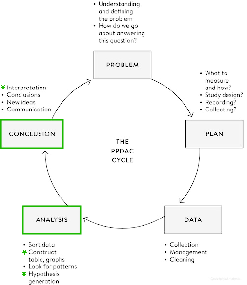
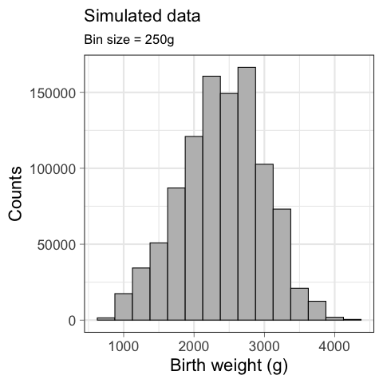
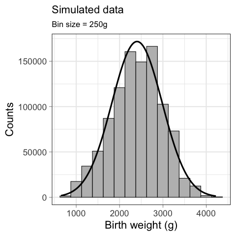
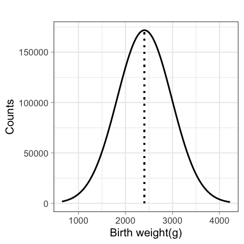
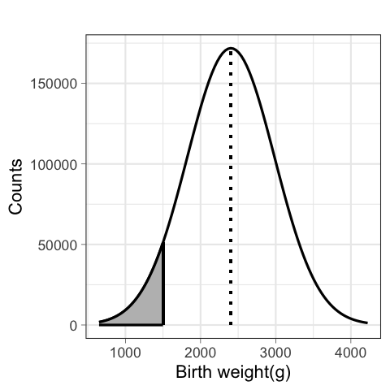
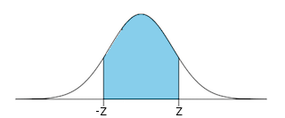
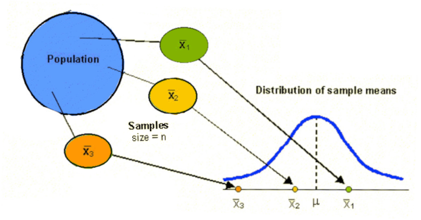
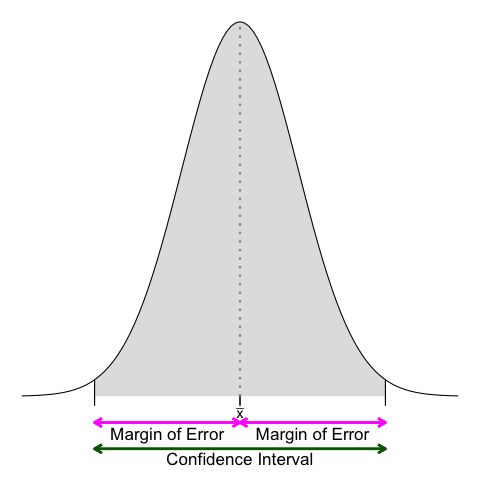

# Introduction to statistics

### (Day 2)

---

# Recap

---
## Recap

- The collection, organisation, summarisation, and analysis of data   &nbsp;&nbsp;&nbsp; &rarr; *Descriptive* &nbsp;statistics
- The drawing of inferences about a body of data when only a part of the data is observed   &nbsp;&nbsp;&nbsp; &rarr; *Inferential* &nbsp;statistics

- When can't study a population, we select a representative sample
- There are different sampling strategies

<!-- - Individuare in maniera efficiente i tratti importanti delle informazioni che sono state raccolte

- Partire dal particolare per capire come le informazioni si possono estendere alla totalità -->

---
## Recap

- There are different types of data
- Categorical variables  are described with absolute and relative frequencies
- Numerical variables are described with measures of central tendency (mode, median, mean) and dispersion (range, IQR, standard deviation)
- Parameters (calculated on the population) *vs*&nbsp; statistics (calculated on the sample)

---

# The Normal Distribution 

---
## Learning objectives

- Know the characteristics of the Normal distribution
- Know the characteristics of the Standard Normal distribution
- Know the characteristics of the Student's $\mathcal{t}$ distribution

---

Spiegelhalter, D., *The Art of Statistics: Learning From Data*, Pelican, 2019

---
## Let's go back to populations

Birth weight distribution for British twins

$N=1,000,000$
$\mu = 2404\text{ g}; \text{ } \sigma = 580\text{ g}$
$median = 2408\text{ g}$

<!-- The population distribution is the pattern made by the birth weights of all these babies, which we can obtain from TwinsUK data on the weights for 1M twins born in the UK from 1917 to 1998 to non-Hispanic white women – although this is not the entire set of twin births, it is such a large sample that we can take it as the population. (sono dati simulati a partire da dati reali) -->

---
## Let's go back to populations

Birth weight distribution for British twins

$N=1,000,000$
$\mu = 2404\text{ g}; \text{ } \sigma = 580\text{ g}$
$median = 2408\text{ g}$

<!-- The shape of this distribution is important. Measurements such as weight, income, height, and so on can, at least in principle, be as fine-grained as desired, and so can be considered ‘continuous’ quantities whose population distributions are smooth. The classic example is the ‘bell-shaped curve’, or normal distribution, first explored in detail by Carl Friedrich Gauss.

Theory shows that the normal distribution can be expected to occur for phenomena that are driven by large numbers of small influences, for example a complex physical trait that is not influenced by just a few genes. 

Figure shows a normal curve with the same mean and standard deviation as the recorded weights. The smooth normal curve and the histogram are gratifyingly close, and other complex traits such as height and cognitive skills also have approximately normal population distributions. 
-->

---
## The Normal distribution

- $\mathcal{N} = (\mu, \sigma^2)$
- $\text{mode} \equiv \text{median} \equiv \text{mean}$
- Symmetrical

$f(x)={\frac {1}{\sqrt {2\pi \sigma ^{2}}}}e^{-{\frac {(x-\mu )^{2}}{2\sigma ^{2}}}}$

<!-- La distribuzione GAUSSIANA è una distribuzione caratterizzata da una forma a campana.
E' simmetrica.
Definita in maniera univoca dalla media e dalla deviazione standard 

sigma^2 e' la varianza <!-- The normal distribution is characterized by its mean, or expectation, and its standard deviation.

It is an impressive achievement to be able to summarize over a million births by just these two quantities. 
 -->

---
## The Normal distribution

- $\text{Area under the curve} = 1$
- proportion $\equiv$ likelihood

$\text{very low birth weight (VLBW)} < 1500 \text{ g}$
$\text{Twins with VLBW} = 6\%$
$\mathcal{P}(\text{twins with VLBW}) = 0.06$

<!-- il fatto che l'area e' 1 dipende dal fatto che la normale sia una distribuzione di probabilita'

For medical rather than statistical reasons, babies below 1,500 g ‘very low birth weight’. Figure 3.2(d) shows that we would expect 6% of babies in this group to be very low birth weight – in fact the actual number is ~74K (0.7%), in close agreement with the prediction from the normal curve. 

 -->

---
### Exercise #1

:question: &nbsp;&nbsp;&nbsp; Which distributions has the 
&nbsp;&nbsp;&nbsp;&nbsp;&nbsp;&nbsp;&nbsp;&nbsp; largest mean?

&nbsp;&nbsp;&nbsp;&nbsp;&nbsp;&nbsp;&nbsp;&nbsp; a) Green
&nbsp;&nbsp;&nbsp;&nbsp;&nbsp;&nbsp;&nbsp;&nbsp; b) Blue
&nbsp;&nbsp;&nbsp;&nbsp;&nbsp;&nbsp;&nbsp;&nbsp; c) Yellow
&nbsp;&nbsp;&nbsp;&nbsp;&nbsp;&nbsp;&nbsp;&nbsp; d) None of the above

---
### Exercise #2

:question: &nbsp;&nbsp;&nbsp; Which distributions has the 
&nbsp;&nbsp;&nbsp;&nbsp;&nbsp;&nbsp;&nbsp;&nbsp; largest standard deviation?

&nbsp;&nbsp;&nbsp;&nbsp;&nbsp;&nbsp;&nbsp;&nbsp; a) Green
&nbsp;&nbsp;&nbsp;&nbsp;&nbsp;&nbsp;&nbsp;&nbsp; b) Blue
&nbsp;&nbsp;&nbsp;&nbsp;&nbsp;&nbsp;&nbsp;&nbsp; c) Yellow
&nbsp;&nbsp;&nbsp;&nbsp;&nbsp;&nbsp;&nbsp;&nbsp; d) None of the above

---
## The Normal distribution

- 3 $\sigma$ rule:
  - 68% of the observed values are at 1 $\sigma$ from the mean
  - 95% at 2 $\sigma$
  - 99.7% at 3 $\sigma$

- Empirical rule:
  - values $< 2 \sigma$ are *"common"*
  - values $> 2 \sigma$ are *"unusual"*  
  - values $> 3 \sigma$ are *"outliers"*  

<!-- From the mathematical properties of the normal distribution, we know that roughly 95% of the population will be contained in the interval given by the mean ± two standard deviations, and 99.8% in the central ± three standard deviations. 

68% at 1SD -> valori comuni vs valori inusuali -->

---
## Outliers

<!-- Se i dati sono distribuiti normalmente c'e' una corrispondenza tra 1.5IQR dal 1o e 3o quartile e le standard deviation dalla media 
1.5 IQR (fence of the boxplot) -> If the data are normally distributed, the fence will be 2.7 standard deviations from the mean, so cases outside of it will be quite rare (0.4%)
-->

---
### Exercise #3

:question: &nbsp;&nbsp;&nbsp; The height of the Italian male population is distributed according to
&nbsp;&nbsp;&nbsp;&nbsp;&nbsp;&nbsp;&nbsp;&nbsp; a Normal distribution with mean 170 cm and standard deviation 9.5 cm

&nbsp;&nbsp;&nbsp;&nbsp;&nbsp;&nbsp;&nbsp;&nbsp; Calculate the following values, when possible

&nbsp;&nbsp;&nbsp;&nbsp;&nbsp;&nbsp;&nbsp;&nbsp; a) The median height
&nbsp;&nbsp;&nbsp;&nbsp;&nbsp;&nbsp;&nbsp;&nbsp; b) The proportion of Italian men taller than $>170 \text{ cm}$
&nbsp;&nbsp;&nbsp;&nbsp;&nbsp;&nbsp;&nbsp;&nbsp; c) The values considered unusual and/or outliers
&nbsp;&nbsp;&nbsp;&nbsp;&nbsp;&nbsp;&nbsp;&nbsp; d) The most common height
&nbsp;&nbsp;&nbsp;&nbsp;&nbsp;&nbsp;&nbsp;&nbsp; e) The range that includes 68% of the individuals
&nbsp;&nbsp;&nbsp;&nbsp;&nbsp;&nbsp;&nbsp;&nbsp; f) The tallest Italian man's height

---
## Proportion $\equiv$ likelihood

- 6% of the twins have a very low birth weight
- The probability of being very low birth weight is 0.06

How did we get these numbers?

---
## The Standard Normal distribution

- $\mathcal{N} = Z = (0, 1)$

<!-- Distribuzione normale standardizzata -->

---
## The Standard Normal distribution

- $\mathcal{N} = (\mu, \sigma^2) \rightarrow Z = (0, 1)$

<!-- Magenta: mu=4, sd=1.5 -->

---
## The Standard Normal distribution

- $\mathcal{N} = (\mu, \sigma^2) \rightarrow Z = (0, 1)$

- $z = \frac{x - \mu}{}$

---
## The Standard Normal distribution

- $\mathcal{N} = (\mu, \sigma^2) \rightarrow Z = (0, 1)$

- $z = \frac{x - \mu}{\sigma}$

---
## The Standard Normal distribution

- $\mathcal{N} = (\mu, \sigma^2) \rightarrow Z = (0, 1)$

- $z = \frac{x - \mu}{\sigma}$

<!-- E perche la SND ci piace? Perche' esistono delle tavole che ci dicono qual e' l'area sottesa  ad una certa porzione della curva, che corrispondono alla probabilita' di trovare (nel caso di queste tavole) un valore < di quello osservato (area colorata)

Ci sono diverse versioni di queste tabelle, per esempio quella complementare che riporta l'area per la zona bianca (probabilita' di osservare valori piu' estremi) -->

---
### The Standard Normal distribution in practice

:pushpin: &nbsp;&nbsp;&nbsp; $\mu = 2404\text{ g}; \text{ } \sigma = 580\text{ g}$

&nbsp;&nbsp;&nbsp;&nbsp;&nbsp;&nbsp;&nbsp;&nbsp;

&nbsp;&nbsp;&nbsp;&nbsp;&nbsp;&nbsp;&nbsp;&nbsp; $\mathcal{P}(x < 1500 \text{ g}) = \text{ ?}$

---
### The Standard Normal distribution in practice

:pushpin: &nbsp;&nbsp;&nbsp; $\mu = 2404\text{ g}; \text{ } \sigma = 580\text{ g}$

&nbsp;&nbsp;&nbsp;&nbsp;&nbsp;&nbsp;&nbsp;&nbsp; $\mathcal{z} = \frac{x - \mu}{\sigma} =  \frac{1500\text{ g} - 2404\text{ g}}{580\text{ g}}$
&nbsp;&nbsp;&nbsp;&nbsp;&nbsp;&nbsp;&nbsp;&nbsp;&nbsp;&nbsp;&nbsp;&nbsp; $= -1.56$

&nbsp;&nbsp;&nbsp;&nbsp;&nbsp;&nbsp;&nbsp;&nbsp; $\mathcal{P}(x < 1500 \text{ g}) = \text{ ?}$

 

---
### The Standard Normal distribution in practice

:pushpin: &nbsp;&nbsp;&nbsp; $\mu = 2404\text{ g}; \text{ } \sigma = 580\text{ g}$

&nbsp;&nbsp;&nbsp;&nbsp;&nbsp;&nbsp;&nbsp;&nbsp; $\mathcal{z} = \frac{x - \mu}{\sigma} =  \frac{1500\text{ g} - 2404\text{ g}}{580\text{ g}}$
&nbsp;&nbsp;&nbsp;&nbsp;&nbsp;&nbsp;&nbsp;&nbsp;&nbsp;&nbsp;&nbsp;&nbsp; $= -1.56$

 

&nbsp;&nbsp;&nbsp;&nbsp;&nbsp;&nbsp;&nbsp;&nbsp; $\mathcal{P}(x < 1500 \text{ g}) = \text{ ?}$

<!-- Fare vedere che la curva e' simmetrica quindi possiamo usare 1.56 per conoscere l'area -->

---
### The Standard Normal distribution in practice

:pushpin: &nbsp;&nbsp;&nbsp; $\mu = 2404\text{ g}; \text{ } \sigma = 580\text{ g}$

&nbsp;&nbsp;&nbsp;&nbsp;&nbsp;&nbsp;&nbsp;&nbsp; $\mathcal{z} = \frac{x - \mu}{\sigma} =  \frac{1500\text{ g} - 2404\text{ g}}{580\text{ g}}$
&nbsp;&nbsp;&nbsp;&nbsp;&nbsp;&nbsp;&nbsp;&nbsp;&nbsp;&nbsp;&nbsp;&nbsp; $= -1.56$

 

&nbsp;&nbsp;&nbsp;&nbsp;&nbsp;&nbsp;&nbsp;&nbsp; $\mathcal{P}(x < 1500 \text{ g}) = 1 - 0.9406 = 0.0594 \rightarrow 5.94\%$

---
### Exercise #4

:question: &nbsp;&nbsp;&nbsp; Not knowing that the baby has a twin, the pediatrician tells to the mother that
&nbsp;&nbsp;&nbsp;&nbsp;&nbsp;&nbsp;&nbsp;&nbsp; a birth weight lower than $2500$ g is unusual. Should the mother be worried?

&nbsp;&nbsp;&nbsp;&nbsp;&nbsp;&nbsp;&nbsp;&nbsp; $\mu = 2404\text{ g}; \text{ } \sigma = 580\text{ g}$

 

<!-- For medical rather than statistical reasons, babies below 2,500 g are considered ‘low birth weight’, and those below 1,500 g ‘very low birth weight’.  -->

---
## The Student's $\mathcal{t}$ distribution

- When observations are too little to be approximated to a Normal distribution
  

<!-- Quando la dimensione campionaria e' grande la nostra fiducia nell'approssimare sigma con la varianza campionaria e' ben riposta  e possiamo usare la normale per il calcolo dei CI, ma cosa succede quando i campioni soo piccoli? Usiamo la distribuzione  di Student

- e' una famiglia di distribuzioni, 1 per ogni valore campionario n-1

Come la normale:
- ha media 0
- e' simmetrica
- ha varianza >1 che si avvicina a 1 al crescere di N

Meno appuntita al centro e code piu' alte
 -->

---
## The Student's $\mathcal{t}$ distribution

- When observations are too little to be approximated to a Normal distribution

- Student's $\mathcal{t}$ distribution
  - keeps into account the degree of freedom $(\mathcal{df})$
  - one sample of size $n \rightarrow \mathcal{df} = n -1$

<!-- una famiglia di distribuzioni, 1 per ogni valore campionario n-1

 infatti la t-dist tiene conto dei valori campionari n-1, detti anche Gradi di liberta', che misurano la quantità di informazione disponibile nei dati che può essere usata per stimare sigma (affidabilità della stima s)

All’aumentare di n (e dei GdL) la stima di sigma attraverso s è sempre più affidabile: con n grande la distribuzione t si avvicina alla distribuzione normale
 -->

---

# Estimates and Confidence Intervals 

<!--- Partire dal particolare per capire come le informazioni si possono estendere alla totalità -->

---
## Learning objectives

- Understanding how to move from empirical to theoretical distributions
- Be able to calculate and interpret point and interval estimates (confidence intervals)

---

Spiegelhalter, D., *The Art of Statistics: Learning From Data*, Pelican, 2019

---
## &nbsp;&nbsp;&nbsp; :warning:  Disclaimer  :warning:

&nbsp;&nbsp;&nbsp;&nbsp;&nbsp;&nbsp;&nbsp;&nbsp; If this part seems difficult to you, it's because it's really difficult.

&nbsp;&nbsp;&nbsp;&nbsp;&nbsp;&nbsp;&nbsp;&nbsp; You may have to spend quite a bit of time before understanding
&nbsp;&nbsp;&nbsp;&nbsp;&nbsp;&nbsp;&nbsp;&nbsp;  it completely. Don't worry, we've all been there!

---
## From sample to population

<!-- Ricapitoliamo: quando non possiamo studiare una popolazione ne usiamo un campione rappresentativo -->

---
## From sample to population

<!-- e poi usiamo le informazioni raccolte dal campione per trarre delle conclusioni sulla popolazione 
Questo processo si chiama statistica inferenziale,

Procedimento induttivo che ha lo scopo di stimare i parametri (caratteristiche) sconosciuti della popolazione a partire dalle statistiche (stime conosciute) del campione 

Sulla base di un campione estratto casualmente da 1 popolazione cosa può essere detto circa la popolazione da cui il campione è stato estratto? -->

---
## How accurate are we?

The mean BMI for Italian 11 years old girls is $18.4 \pm  3.3 \text{ kg}/\text{m}^2$

<!-- In the age band of 11 yo there were about 400 girls. Since we know the survey was based on a proper random-sampling scheme, it is fairly reasonable to assume that the study population matches the target population, which is the Italian adolescent population. The crucial question is: how close are these statistics to what we would have found had we been able to ask every 11yo in the country? 

Magenta dotted line is the mean

As an illustration of how the accuracy of statistics depends on sample size, we shall pretend for the moment that the men in the survey in fact represent the population in which we are interested. 
-->

---
## Sample size

&nbsp;&nbsp;&nbsp;&nbsp;&nbsp;&nbsp;&nbsp;&nbsp; $n = 10$

<!--
For illustration, we then take successive samples of individuals from this ‘population’ of 760 men, pausing when we reach 10, 50, 100, 200 and 380 men. 

The data distributions of these samples are shown 

it is clear that the smaller samples are ‘bumpier’, and the summary stats (mean here) is sensitive to single data-points

 Magenta dotted line is the mean
Density should use another scale -->

---
## Sample size

&nbsp;&nbsp;&nbsp;&nbsp;&nbsp;&nbsp;&nbsp;&nbsp; $n = 50$

<!-- the rather high number of partners  in the first sample of ten individuals gets steadily overwhelmed, as the statistics get closer and closer to those of the whole group of 796 men as the sample size increases. -->

---
## Sample size

&nbsp;&nbsp;&nbsp;&nbsp;&nbsp;&nbsp;&nbsp;&nbsp; $n = 100$

<!-- the rather high number of partners  in the first sample of ten individuals gets steadily overwhelmed, as the statistics get closer and closer to those of the whole group of 796 men as the sample size increases. -->

---
## Sample size

&nbsp;&nbsp;&nbsp;&nbsp;&nbsp;&nbsp;&nbsp;&nbsp; $n = 200$

<!-- the rather high number of partners  in the first sample of ten individuals gets steadily overwhelmed, as the statistics get closer and closer to those of the whole group of 796 men as the sample size increases. -->

---
## Sample size

&nbsp;&nbsp;&nbsp;&nbsp;&nbsp;&nbsp;&nbsp;&nbsp; $n = 300$

<!-- the rather high number of partners  in the first sample of ten individuals gets steadily overwhelmed, as the statistics get closer and closer to those of the whole group of 796 men as the sample size increases. -->

---
### Exercise #5

:question: &nbsp;&nbsp;&nbsp; When the sample size increases, an estimate of a parameter

&nbsp;&nbsp;&nbsp;&nbsp;&nbsp;&nbsp;&nbsp;&nbsp; a) improves
&nbsp;&nbsp;&nbsp;&nbsp;&nbsp;&nbsp;&nbsp;&nbsp; b) worsens
&nbsp;&nbsp;&nbsp;&nbsp;&nbsp;&nbsp;&nbsp;&nbsp; c) is sensitive to single data-points
&nbsp;&nbsp;&nbsp;&nbsp;&nbsp;&nbsp;&nbsp;&nbsp; d) there is no difference

---
## How accurate are we?

With this example, we introduced two ideas: 

  1. Larger samples improve population parameter estimation

  2. If we keep extracting (sub)samples, we get a feeling for ​​the variation (aka confidence interval) around the "plausible" value of the population parameter

and so, now?

---
## Estimates & confidence intervals

How does one estimate the variation around the true population parameter, if what they are looking for is the true population parameter?

<!--  
Now we come to a critical step. In order to work out how accurate these statistics might be, we need to think of how much our statistics might change if we (in our imagination) were to repeat the sampling process many times. In other words, if we repeatedly drew samples of 796 men from the country, how much would the calculated statistics vary?

If we knew how much these estimates would vary, then it would help tell us how accurate our actual estimate was. But unfortunately we could only work out the precise variability in our estimates if we knew precisely the details of the population. And this is exactly what we do not know.  -->

---
## Estimates & confidence intervals

1. Assuming that the population is similar to the sample   $\rightarrow$ *via* bootstrapping

2. Making mathematical assumptions about the shape of the population distribution   $\rightarrow$ *via* central limit theorem

<!-- There are two ways to resolve this circularity. The first is to make some mathematical assumptions about the shape of the population distribution, and use sophisticated probability theory to work out the variability we would expect in our estimate, and hence how far away we might expect, say, the average of our sample to be from the mean of the population. This is the traditional method that is taught in statistics textbooks, and we shall see how this works in Chapter 9. 

However, there is an alternative approach, based on the plausible assumption that the population should look roughly like the sample. Since we cannot repeatedly draw a new sample from the population, we instead repeatedly draw new samples from our sample! -->

---
## Estimates & confidence intervals

&nbsp;&nbsp;&nbsp;&nbsp;&nbsp;&nbsp;&nbsp;&nbsp; $N_\text{Bootstrapping} = 1000$

<!-- If we repeat this resampling, say, 1,000 times, we get 1,000 possible estimates of the mean. These are displayed as histograms, with each histogram showing the spread of bootstrap estimates around the mean of the original sample. These are known as sampling distributions of estimates, since they reflect the variability in estimates that arise from repeated sampling of data.

Figure displays some clear features. The first, and perhaps most notable, is that almost all trace of the skewness of the original samples has gone – the distributions of the estimates based on the resampled data are almost symmetric around the mean of the original data. This is a first glimpse of what is known as the Central Limit Theorem, which says that the distribution of sample means tends towards the form of a normal distribution with increasing sample size, almost regardless of the shape of the original data distribution. 

Additionally, is that the bootstrap distributions get narrower as the sample size increases
 -->

---
## Estimates & confidence intervals

&nbsp;&nbsp;&nbsp;&nbsp;&nbsp;&nbsp;&nbsp;&nbsp; Interval including 95% of the means obtained *via* bootstrapping

<!-- For example, we can find the range of values that contains 95% of the means of the bootstrap resamples, and call this a 95% uncertainty interval
for the original estimates, or alternatively they can be called margins of error. These are shown in Table 7.2 – the symmetry of the bootstrap distributions means the uncertainty intervals are roughly symmetric around the original estimate.

Per farlo sfruttiamo le proprieta' della distribuzione normale (indipendentemente dalla distribuzione del campione) 

Ma prima osserviamo ancora che the bootstrap distributions get narrower as the sample size increases, which is reflected in the steadily narrower 95% uncertainty intervals.
 -->

 ---
## Estimates & confidence intervals

&nbsp;&nbsp;&nbsp;&nbsp;&nbsp;&nbsp;&nbsp;&nbsp; Interval including 95% of the means obtained *via* bootstrapping

<!-- For example, we can find the range of values that contains 95% of the means of the bootstrap resamples, and call this a 95% uncertainty interval
for the original estimates, or alternatively they can be called margins of error. These are shown in Table 7.2 – the symmetry of the bootstrap distributions means the uncertainty intervals are roughly symmetric around the original estimate.

Per farlo sfruttiamo le proprieta' della distribuzione normale (indipendentemente dalla distribuzione del campione) 

Ma prima osserviamo ancora che the bootstrap distributions get narrower as the sample size increases, which is reflected in the steadily narrower 95% uncertainty intervals.
The second important feature of Figure 7.3 is that the bootstrap distributions get narrower as the sample size increases, which is reflected in the steadily narrower 95% uncertainty intervals. 

Bootstrapping provides an intuitive, computer-intensive way of assessing the uncertainty in our estimates, without making strong assumptions and without using probability theory. But the technique is not feasible when it comes to, say, working out the margins of error on unemployment surveys of 100,000 people. Although bootstrapping is a simple, brilliant and extraordinarily effective idea, it is just too clumsy to bootstrap such large quantities of data, especially when a convenient theory exists that can generate formulae for the width of uncertainty intervals.

-->

---
### Exercise #6

:question: &nbsp;&nbsp;&nbsp; When the sample size increases, the accuracy of a parameter 
&nbsp;&nbsp;&nbsp;&nbsp;&nbsp;&nbsp;&nbsp;&nbsp; estimate...

&nbsp;&nbsp;&nbsp;&nbsp;&nbsp;&nbsp;&nbsp;&nbsp; a) improves
&nbsp;&nbsp;&nbsp;&nbsp;&nbsp;&nbsp;&nbsp;&nbsp; b) worsens
&nbsp;&nbsp;&nbsp;&nbsp;&nbsp;&nbsp;&nbsp;&nbsp; c) there is no difference

---
## Let's stop for a minute

We introduced two difficult and important concepts:

  1. there is a variability in the estimate of a parameter that depends on the sample

  2. the shape of the sampling distribution doesn't depend on the shape of the empirical distribution, and can be approximate to a Normal distribution for large samples

We now have all the elements for facing the second approach that  can be used to calculate parameters estimates and confidence interval

<!-- 
- the variability in statistics based on samples

- the fact that the shape of the distribution of the statistics does not depend on the shape of the original distribution from which the individual data-points are drawn

- bootstrapping data when we do not want to make assumptions about the shape of the population

Rather remarkably, this has all been accomplished without any mathematics except the idea of drawing observations at random. -->

---
### The sampling distribution &   the central limit theorem

&nbsp;&nbsp;&nbsp;&nbsp;&nbsp;&nbsp;&nbsp;&nbsp;&nbsp;&nbsp;&nbsp;&nbsp;&nbsp;&nbsp;&nbsp;&nbsp;&nbsp;&nbsp;&nbsp;&nbsp;&nbsp; $\mathcal{N} = (\mu, \frac{\sigma^2}{n})$ with 
&nbsp;&nbsp;&nbsp;&nbsp;&nbsp;&nbsp;&nbsp;&nbsp;&nbsp;&nbsp;&nbsp;&nbsp;&nbsp;&nbsp;&nbsp;&nbsp;&nbsp;&nbsp;&nbsp;&nbsp;&nbsp; $\sqrt{ \frac{\sigma^2}{n}} = \frac{\sigma}{\sqrt{n}}$ 
&nbsp;&nbsp;&nbsp;&nbsp;&nbsp;&nbsp;&nbsp;&nbsp;&nbsp;&nbsp;&nbsp;&nbsp;&nbsp;&nbsp;&nbsp;&nbsp;&nbsp;&nbsp;&nbsp;&nbsp;&nbsp;&nbsp;&nbsp; $\rightarrow$ &nbsp; standard error (SE)

<!-- Distribuzione campionaria e' la distribuzione di tutti i possibile valori che possono essere assunti da qualche statistica (e.g., la media) calcolata da campioni della stessa dimensione ed estratti casualmente dalla stessa popolazione 

Come si costruisce? 
1. Estraggo tutti i possibili campioni di dimensione n
2. Calcolo la statistica di interesse
3. Tengo traccia di ciascun valore della statistica e della sua frequenza 

La forma della distribuzione delle medie campionarie è approssimativamente normale,  indipendentemente dalla distribuzione dei valori della popolazione d’origine dalla quale i campioni sono estratti, per n sufficientemente grande.

Teorema del limite centrale ci dice che la Distribuzione campionaria tende a presentare una Distribuzione Normale N = (μ, σ2 ), indipendentemente
dalla forma della distribuzione empirica osservata nel Campione quando
questo `e sufficientemente grande (≈ n > 30). La statistica misurata viene
considerata uno stimatore del Parametro μ della distribuzione campiona-
ria, mentre la sua Standard deviation è la radice quadrata del rapporto tra tra la varianza della popolazione e la dimensione del campione usato per calcolarla 
anche conosciuta come Errore standard della stima della statistica.

L'errore standard diminuisce al crescere di N e al decrescere della varianza

Quanto deve essere grande il campione perch&egrave; la distribuzione sia normale? 
Nella maggior parte delle situazioni pratiche, n=30 e' soddisfacente, ma l'approssimazione migliora all'aumentare di n (lo vedremo tra qualche slide) -->

---
## Let's put the pieces together...

- the sampling distribution is a Normal distribution
- in a Normal distrubution, 95% of the data are at (about) $2 \times \text{SD}$ from the mean
- a 95% confidence interval is at (about) $2 \times \text{SE}$ from the sampling distribution mean

<!-- Approssimando una Normale, la distribuzione campionaria ha le stesse (utili) caratteristiche della normale:
- &egrave; simmetrica
- ha area 1
- 95% delle medie campionarie sono a 2 SE dalla vera media della popolazione 

Tutti concetti che ci torneranno utili tra poco
-->

---
## Calculating confidence intervals

:dart: &nbsp; A 95% CI is at (about) $2 \times \text{SE}$ from the sampling distribution mean ($\bar{x}$)

&nbsp;&nbsp;&nbsp;&nbsp;&nbsp;&nbsp;&nbsp;&nbsp; 1. Calculate SE
&nbsp;&nbsp;&nbsp;&nbsp;&nbsp;&nbsp;&nbsp;&nbsp; 2. Calculate $2 \times \text{SE}$, *i.e.*, $95\%$
&nbsp;&nbsp;&nbsp;&nbsp;&nbsp;&nbsp;&nbsp;&nbsp;&nbsp;&nbsp;&nbsp;&nbsp; Margin of Error (ME)
&nbsp;&nbsp;&nbsp;&nbsp;&nbsp;&nbsp;&nbsp;&nbsp; 3. Calculate the $95\% \text{ CI}$ as 
&nbsp;&nbsp;&nbsp;&nbsp;&nbsp;&nbsp;&nbsp;&nbsp;&nbsp;&nbsp;&nbsp;&nbsp;  $(\bar{x} - \text{ ME} \text{ } ; \text{ } \bar{x} + \text{ ME} )$

---
### Exercise #7

The mean BMI for Italian 11 years old girls ($n=403$) is $18.4 \pm  3.3 \text{ kg}/\text{m}^2$

:question: &nbsp;&nbsp;&nbsp; Calculate the 95% CI for the true mean $\mu$

&nbsp;&nbsp;&nbsp;&nbsp;&nbsp;&nbsp;&nbsp;&nbsp; $\text{SE}=\sigma/\sqrt{n} = \text{ ?} \rightarrow$ &nbsp;&nbsp;&nbsp; $\hat{\text{SE}}=s/\sqrt{n} = \text{ ?}$

---
### Exercise #8

:question: &nbsp;&nbsp;&nbsp; Given that $\mathcal{N} = (\mu, \frac{\sigma^2}{n})$ with $\sqrt{ \frac{\sigma^2}{n}} = \frac{\sigma}{\sqrt{n}} \rightarrow$ &nbsp; standard error (SE), 
&nbsp;&nbsp;&nbsp;&nbsp;&nbsp;&nbsp;&nbsp;&nbsp;  how can one reduce the confidence interval?

&nbsp;&nbsp;&nbsp;&nbsp;&nbsp;&nbsp;&nbsp;&nbsp; a) increasing $n$
&nbsp;&nbsp;&nbsp;&nbsp;&nbsp;&nbsp;&nbsp;&nbsp; b) decreasing $n$
&nbsp;&nbsp;&nbsp;&nbsp;&nbsp;&nbsp;&nbsp;&nbsp; c) increasing $\sigma$
&nbsp;&nbsp;&nbsp;&nbsp;&nbsp;&nbsp;&nbsp;&nbsp; d) decreasing $\sigma$
&nbsp;&nbsp;&nbsp;&nbsp;&nbsp;&nbsp;&nbsp;&nbsp; e) none of the above

---
## Interpreting confidence intervals 

&nbsp;&nbsp;&nbsp; A confidence interval is a range of values which includes the
&nbsp;&nbsp;&nbsp; estimated parameter with a given degree of confidence

---
## Interpreting confidence intervals 

&nbsp;&nbsp;&nbsp; If we could sample the population 100 times, 95 would estimate a
&nbsp;&nbsp;&nbsp;  confidence interval which includes the true population parameter

:pushpin: &nbsp;&nbsp;&nbsp; Population: Italian women 
&nbsp;&nbsp;&nbsp;&nbsp;&nbsp;&nbsp;&nbsp;&nbsp; 25-74 years old
&nbsp;&nbsp;&nbsp;&nbsp;&nbsp;&nbsp;&nbsp;&nbsp; $\mu=123 \text{ mmHg}$

<!-- Cosa rappresentano quindi i CI? Che dati 100 campioni estratti dalla popolazione, 95 stimano un IC al cui interno è compresa la media reale della popolazione e solo 5 stimano un ic che non include la media reale 

a confidence interval is the range of population parameters for which our observed statistic is a plausible consequence.
-->

---
### Exercise #9

:question: &nbsp;&nbsp;&nbsp; In the Results section, the authors reported the following

&nbsp;&nbsp;&nbsp;&nbsp;&nbsp;&nbsp;&nbsp;&nbsp; *In Mexican Americans, the mean age at menarche was 12.09 years 
&nbsp;&nbsp;&nbsp;&nbsp;&nbsp;&nbsp;&nbsp;&nbsp; (95% CI = 11.81 to 12.37 years)*

&nbsp;&nbsp;&nbsp;&nbsp;&nbsp;&nbsp;&nbsp;&nbsp; this means that...

&nbsp;&nbsp;&nbsp;&nbsp;&nbsp;&nbsp;&nbsp;&nbsp; a) the age at menarche for Mexican American girls is included between 11.81 
&nbsp;&nbsp;&nbsp;&nbsp;&nbsp;&nbsp;&nbsp;&nbsp;&nbsp;&nbsp;&nbsp;&nbsp; and 12.37 years old
&nbsp;&nbsp;&nbsp;&nbsp;&nbsp;&nbsp;&nbsp;&nbsp; b) 95% of Mexican American girls experience menarche between 11.81 and
&nbsp;&nbsp;&nbsp;&nbsp;&nbsp;&nbsp;&nbsp;&nbsp;&nbsp;&nbsp;&nbsp;&nbsp;  12.37 years old
&nbsp;&nbsp;&nbsp;&nbsp;&nbsp;&nbsp;&nbsp;&nbsp; c) the mean age at menarche for Mexican American girls has a 95% probability 
&nbsp;&nbsp;&nbsp;&nbsp;&nbsp;&nbsp;&nbsp;&nbsp;&nbsp;&nbsp;&nbsp;&nbsp; of being included between 11.81 and 12.37 years old
&nbsp;&nbsp;&nbsp;&nbsp;&nbsp;&nbsp;&nbsp;&nbsp; d) none of the above

<!-- Questa differenza di 200 euro a dx e sx della media e' il margine di errore del 95% -->

---
## The $\alpha$ level

:dart: &nbsp;&nbsp;&nbsp; $\text{95\% CI} = (\bar{x} - \approx 2 \times \hat{SE} \text{ ; }  \bar{x} + \approx 2 \times \hat{SE})$
&nbsp;&nbsp;&nbsp;&nbsp;&nbsp;&nbsp;&nbsp;&nbsp;  &nbsp; $\approx 2$ &nbsp; ?

| Confidence Level | $\alpha$ | $\alpha/2$ | $z_{\alpha/2}$ |
| ----: | ----- | ---- | ----|
| 95% | 5% | 2.5% |  |

<!-- L’intervallo di confidenza (IC) al 95% è il più usato e intuitivamente abbiamo gia' capito da dove deirva il fattore 1.96 (circa 2SE contengono il 95% dei campioni), ma vediamolo in modo piu' formale 

Quando accettiamo un livello di confidenza del 95% accettiamo implicitamente un errore del 5%, distribuito equamente a dx e sx dell'intrevallo di confidenza (in verde), quindi 2.5% per parte -->

---
## The $\alpha$ level

:dart: &nbsp;&nbsp;&nbsp; $\text{95\% CI} = (\bar{x} - \approx 2 \times \hat{SE} \text{ ; }  \bar{x} + \approx 2 \times \hat{SE})$
&nbsp;&nbsp;&nbsp;&nbsp;&nbsp;&nbsp;&nbsp;&nbsp;  &nbsp; $\approx 2$ &nbsp; ?

| Confidence Level | $\alpha$ | $\alpha/2$ | $z_{\alpha/2}$ |
| ----: | ----- | ---- | ----|
| 95% | 5% | 2.5% |  |

$100\% - 2.5\% = 97.5\%$ 

<!--  e qual e' l'aera di questa parte bianca? E' la totalita' dell'area (1, o 100%) meno l'area bianca (2.5%), quindi 97.5%-->

---
## The $\alpha$ level

:dart: &nbsp;&nbsp;&nbsp; $\text{95\% CI} = (\bar{x} - \approx 2 \times \hat{SE} \text{ ; }  \bar{x} + \approx 2 \times \hat{SE})$
&nbsp;&nbsp;&nbsp;&nbsp;&nbsp;&nbsp;&nbsp;&nbsp;  &nbsp; $\approx 2$ &nbsp; $\rightarrow 1.96$

| Confidence Level | $\alpha$ | $\alpha/2$ | $z_{\alpha/2}$ |
| ----: | ----- | ---- | ----|
| 95% | 5% | 2.5% | 1.96 |

$100\% - 2.5\% = 97.5\% \rightarrow \mathcal{z} = 1.96$  

<!--  E' qual e' il valore di z per cui la curva sottende un'area del 97.5%? 1.96 (le tavole si possono anche leggere al contrario, non solo da z all'area, ma anche dall'area a z) 

coefficiente di attendibilita'-->

---
## The $\alpha$ level

| Confidence Level | $\alpha$ | $\alpha/2$ | $z_{\alpha/2}$ |
| ----: | -----: | ---- | ----:|
| 95% | 5% | 2.5% | 1.96 |
| 90% | 10% | 5.0% | 1.65 |
| 99% | 1% | 0.5% | 2.58 |

$100\% - 2.5\% = 97.5\% \rightarrow \mathcal{z} = 1.96$ 
$100\% - 5.0\% = 95.0\% \rightarrow \mathcal{z} = 1.65$ 
$100\% - 0.5\% = 99.5\% \rightarrow \mathcal{z} = 2.58$ 

<!-- 95% e' il valore piu' usato, ma altri comuni sono 90 e 99%, a cui corrispondono fattori di attendibilita' di 1.65 e 2.58

Faremo piu' avanti degli esercizi in cui ci calcoleremo 90 e 99% CI -->

---
### Exercise #10

:question: &nbsp;&nbsp;&nbsp; The larger the confidence level...

&nbsp;&nbsp;&nbsp;&nbsp;&nbsp;&nbsp;&nbsp;&nbsp; a) the larger the CI
&nbsp;&nbsp;&nbsp;&nbsp;&nbsp;&nbsp;&nbsp;&nbsp; b) the smaller the CI
&nbsp;&nbsp;&nbsp;&nbsp;&nbsp;&nbsp;&nbsp;&nbsp; c) there is no difference

---
### Exercise #11

:question: &nbsp;&nbsp;&nbsp; If the CI is large we are...

&nbsp;&nbsp;&nbsp;&nbsp;&nbsp;&nbsp;&nbsp;&nbsp; a) more likely of including $\mu$
&nbsp;&nbsp;&nbsp;&nbsp;&nbsp;&nbsp;&nbsp;&nbsp; b) less likely of including $\mu$
&nbsp;&nbsp;&nbsp;&nbsp;&nbsp;&nbsp;&nbsp;&nbsp; c) there is no difference

---
### Exercise #12

:question: &nbsp;&nbsp;&nbsp; If the CI is large we are...

&nbsp;&nbsp;&nbsp;&nbsp;&nbsp;&nbsp;&nbsp;&nbsp; a) more precise
&nbsp;&nbsp;&nbsp;&nbsp;&nbsp;&nbsp;&nbsp;&nbsp; b) less precise
&nbsp;&nbsp;&nbsp;&nbsp;&nbsp;&nbsp;&nbsp;&nbsp; c) there is no difference

---
## And for small samples?

:pushpin: &nbsp;&nbsp;&nbsp; $n=15$ &nbsp;&nbsp;&nbsp; patients with T2D
&nbsp;&nbsp;&nbsp;&nbsp;&nbsp;&nbsp;&nbsp;&nbsp; $\bar{x}_{\text{BMI}} = 25.0 \text{ kg}/\text{m}^2$
&nbsp;&nbsp;&nbsp;&nbsp;&nbsp;&nbsp;&nbsp;&nbsp; $s_{\text{BMI}}  = 2.7 \text{ kg}/\text{m}^2$

&nbsp;&nbsp;&nbsp;&nbsp;&nbsp;&nbsp;&nbsp;&nbsp; $\text{95\% CI} = \text{ ?}$ 

---
### Exercise #13

:question: &nbsp;&nbsp;&nbsp; $n=15$ &nbsp;&nbsp;&nbsp; patients with T2D
&nbsp;&nbsp;&nbsp;&nbsp;&nbsp;&nbsp;&nbsp;&nbsp; $\bar{x}_{\text{BMI}} = 25.0 \text{ kg}/\text{m}^2$
&nbsp;&nbsp;&nbsp;&nbsp;&nbsp;&nbsp;&nbsp;&nbsp; $s_{\text{BMI}}  = 2.7 \text{ kg}/\text{m}^2$

&nbsp;&nbsp;&nbsp;&nbsp;&nbsp;&nbsp;&nbsp;&nbsp; $\hat{\text{SE}}=s/\sqrt{n} = \text{ ?}$
&nbsp;&nbsp;&nbsp;&nbsp;&nbsp;&nbsp;&nbsp;&nbsp; $\text{df} = n-1 = \text{ ?}$

&nbsp;&nbsp;&nbsp;&nbsp;&nbsp;&nbsp;&nbsp;&nbsp; $\text{95\% CI} = \text{ ?}$ 

<!-- coefficiente di attendibilita' -->

---
### Confidence intervals for differences of means

<!-- :pushpin: &nbsp;&nbsp;&nbsp;  -->
<!-- Which is the *true* difference in mean between two groups? -->

:pushpin: &nbsp;&nbsp;&nbsp; $\mathcal{N} = (\mu_{\text{i}} - \mu_{\text{c}}, \sqrt{\frac{\sigma_\text{i}^2}{n_\text{i}} + \frac{\sigma_\text{c}^2}{n_\text{c}}})$ 
&nbsp;&nbsp;&nbsp;&nbsp;&nbsp;&nbsp;&nbsp;&nbsp; $\hat{\text{SE}} = \sqrt{\frac{s_\text{i}^2}{n_\text{i}} + \frac{s_\text{c}^2}{n_\text{c}}}$

<!-- 
Ci sono casi in cui vogliamo stimare la differenza tra medie di una popolazione (per esempio tra i pazienti che hanno ricevuto un nuovo trattamento e quelli che hanno avuto la cura standard o il placebo)

Non lo abbiamo vistp in dettaglio in precedenza, ma, per il CLT la differenza tra le medie campionarie e' una stima non distorta della differenza delle medie delle due popolazioni -->

---
### Exercise #14

:question: &nbsp;&nbsp;&nbsp; Which is the *true* difference in mean between the two groups?

&nbsp;&nbsp;&nbsp;&nbsp;&nbsp;&nbsp;&nbsp;&nbsp; $n_{\text{i}}= \text{ ?}, \text{ } \text{ } \text{ } \text{ } \bar{x}_{\text{i}}= \text{ ?}, \text{ } \text{ } \text{ }  s_\text{i} = 10.0$ 
&nbsp;&nbsp;&nbsp;&nbsp;&nbsp;&nbsp;&nbsp;&nbsp; $n_{\text{c}}= \text{ ?}, \text{ } \text{ }  \text{ } \text{ }  \bar{x}_{\text{c}}= \text{ ?}, \text{ } \text{ }  s_\text{c} = 8.7$ 

&nbsp;&nbsp;&nbsp;&nbsp;&nbsp;&nbsp;&nbsp;&nbsp; $\hat{\text{SE}} = \sqrt{\frac{s_\text{i}^2}{n_\text{i}} + \frac{s_\text{c}^2}{n_\text{c}}} = \text{ ?}$

  Tomazini B.M., *et al.*, *Effect of Dexamethasone on Days Alive and Ventilator-Free in Patients With Moderate or Severe Acute Respiratory Distress Syndrome and COVID-19*, JAMA, 2020

<!-- Abbiamo due gruppo di pazienti con COVID-19 e sindrome da distress respiratorio acuto moderato o grave (ARDS
uno con lo standard of care e uno a cui abbiamo somministrati desametasone endovenoso. 

Il numero di giorni di respirazione autonoma????

Qual e' il CI per la differenza delle medie dei due gruppi?
-->

---
## Confidence intervals for proportions

<!-- :pushpin: &nbsp;&nbsp;&nbsp;  Which is the *true* proportion of individuals with a given    
&nbsp;&nbsp;&nbsp;&nbsp;&nbsp;&nbsp;&nbsp;&nbsp; characteristic in a population? -->

:pushpin: &nbsp;&nbsp;&nbsp;  $\mathcal{N} = (\pi, \frac{\pi \times (1-\pi)}{n})$
&nbsp;&nbsp;&nbsp;&nbsp;&nbsp;&nbsp;&nbsp;&nbsp; $\hat{SE} = \sqrt{\frac{\bar{p}\times(1-\bar{p})}{n}}$, &nbsp; where $\bar{p} = \frac{m}{n}$

<!-- 
In campo medico ci sono molte questioni legate alla proporzione di pazienti con una certa caratteristica. Per esempio la proporzione di pazienti con una malattia, la proporzione di pazienti che necessita un ricovero, o quella che soffre di effetti collaterali dopo l'assunzione di un farmaco

Per il teorema del limite centrale, di nuovo, la proporzione campionaria e' una stima non distorta della proporzione della popolazione e la distribuzione campionaria si approssima ad una normale 

 -->

---
### Exercise #15

:question: &nbsp;&nbsp;&nbsp; Which is the *true* proportion of women with endometriosis in the population?

&nbsp;&nbsp;&nbsp;&nbsp;&nbsp;&nbsp;&nbsp;&nbsp; $n= \text{ ?}, \text{ } \text{ } \text{ } \text{ } m = \text{ ?}$
&nbsp;&nbsp;&nbsp;&nbsp;&nbsp;&nbsp;&nbsp;&nbsp; $\bar{p} = \frac{m}{n} = \text{ ?}$ 

&nbsp;&nbsp;&nbsp;&nbsp;&nbsp;&nbsp;&nbsp;&nbsp; $\hat{SE} = \sqrt{\frac{\bar{p}\times(1-\bar{p})}{n}} = \text{ ?}$

  Ferrero S.., *et al.*, *Prevalence of newly diagnosed endometriosis in women attending the general practitioner*,    Int J Gynaecol Obstet, 2020

---
### Confidence intervals for differences of proportion

<!-- :pushpin: &nbsp;&nbsp;&nbsp; Which is the *true* difference in proportion between two groups? -->

:pushpin: &nbsp;&nbsp;&nbsp; $\mathcal{N} = (\pi_{\text{i}} - \pi_{\text{c}}, \frac{\pi_i \times (1-\pi_i)}{n_i}+\frac{\pi_c \times (1-\pi_c)}{n_c})$ 
&nbsp;&nbsp;&nbsp;&nbsp;&nbsp;&nbsp;&nbsp;&nbsp; $\hat{\text{SE}} = \sqrt{\frac{\bar{p}_i \times (1-\bar{p}_i)}{n_i}+\frac{\bar{p}_c \times (1-\bar{p}_c)}{n_c}}$

<!--
Spesso, nella clinica, siamo interessati a confrontare le proporzioni di pazienti con una certa caratteristica che provengono da due diverse popolazioi, come la proporzione di uomini e donne che soffrono di una qualche malattia, o due gruppi di persone che rispondono o meno ad un farmaco

 Per il teorema del limite centrale, di nuovo, la differenza tra le proporzioni campionarie e' una stima non distorta della differenza di proporzioni nella popolazione e la distribuzione campionaria si approssima ad una normale  -->

---
### Exercise #16

:question: &nbsp;&nbsp;&nbsp; Which is the *true* difference in proportion between two groups?

&nbsp;&nbsp;&nbsp;&nbsp;&nbsp;&nbsp;&nbsp;&nbsp; $n_{\text{i}}= \text{ ?}, \text{ } \text{ } \text{ } \text{ } m_{\text{i}}= \text{ ?}, \text{ } \text{ } \text{ }  p_\text{i} = \frac{m_\text{i}}{n_\text{i}} = \text{ ?}$ 
&nbsp;&nbsp;&nbsp;&nbsp;&nbsp;&nbsp;&nbsp;&nbsp; $n_{\text{c}}= \text{ ?}, \text{ } \text{ }  \text{ } \text{ }  m_{\text{c}}= \text{ ?}, \text{ } \text{ }  p_\text{c} = \frac{m_\text{c}}{n_\text{c}} = \text{ ?}$ 

&nbsp;&nbsp;&nbsp;&nbsp;&nbsp;&nbsp;&nbsp;&nbsp; $\hat{\text{SE}} = \sqrt{\frac{\bar{p}_\text{i} \times (1-\bar{p}_\text{i})}{n_\text{i}}+\frac{\bar{p}_\text{c} \times (1-\bar{p}_\text{c})}{n_\text{c}}} = \text{ ?}$

  Connor, E.M. *et al.*, *Reduction of Maternal-Infant Transmission of Human Immunodeficiency Virus Type 1 with Zidovudine Treatment*, NEJM, 1994

<!-- 
Randomized Trial on the efficacy of AZT in reducing the risk of maternal-infant HIV transmission
HIV positive pregnant women randomized to receive AZT or placebo -->

---

## Summary

- We use statistics to estimate parameters (point estimates)
- Interval estimates (CI and/or ME) should be communicated along with the point estimates 
- The sample size influences the size of the CI
- Sampling distributions tend to show a normal distribution if the sample size is large enough (CLT)
- We can take advantage of the CLT to calculate interval estimates (CI) 
- For small sample size, the sampling distribution is approximated to a Student's $\mathcal{t}$ 
- 95% confidence intervals tell us the the true value has 95% probability of being inside the given range

<!-- Abbiamo un grado di confidenza del X% che la proporzione del della popolazione p sia compresa tra il x e x% -->

---

# See you tomorrow
