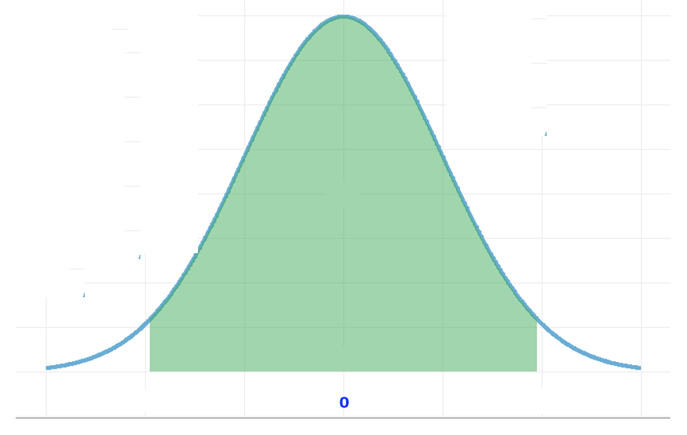

# Introduction to statistics

### (Day 3)

---
## Agenda

- **Where:**
  - Mar 4: :white_check_mark:
  - Mar 5: :white_check_mark:
  - Mar 6 : Online

- **When:**
  - 14-17
  - 1 coffee break

- **Who:**
    
    - Paola Dalmasso paola.dalmasso@unito.it
    - Alessia Visconti alessia.visconti@unito.it

- **How (to pass):**
    - Attend at least 2 lessons

---

# Recap

---
## Recap

- When can't study a population, we select a representative sample
- There are different sampling strategies

- There are different types of data
- Data are described with measures of centrality (mode, median, mean) and dispersion (range, IQR, standard deviation)
- Parameters (calculated on the population) *vs*&nbsp; statistics (calculated on the sample)

---
## Recap

- Using the standard normal distribution we can calculate the probability of an observation
- Multiple phenomena and statistical distributions are normally distributed (CLT)

- We use statistics to estimate parameters (point estimates)
- We use interval estimates (confidence intervals) to estimate point estimates' uncertainty  

<!-- 95% confidence intervals tell us the the true value has 95% probability of being inside the given range -->

---

# Making decision with data

<!-- Sino ad adesso siamo andati a raccogliere i dati, descriverli e fare stime di paramentri di popolazione partendo da campioni, ma fare stime non basta. Dobbiamo anche prendere decisioni. Se Florence Nightingale si fosse limitata a fare stime dei soldiati morti, il governo non avrebbe stanziato fondi per migliorare la situazione non solo dei soldati, ma anche dei malati in tempo di pace.

Vediamo quindi ora come usare dell'evidenza dai dati per prendere delle decisioni -->

---
## Learning objectives

- Make and test hypotheses
- Interpret P values
- Understand Type I and II errors 
- Understand the power of a study

---
## Making hypotheses

:pushpin: &nbsp;&nbsp;&nbsp; Is using Dexamethasone better than standard care?

<!-- 
Nei pazienti con COVID-19 e sindrome da distress respiratorio acuto moderato o grave (ARDS), desametasone è efficace nell’aumentare il numero di giorni di respirazione autonoma?

Vogliamo rispondere a questa domanda perche' dobbiamo decidere se dobbiamo iniziare ad aggiungere dexametasone endovenoso per trattare i nostri pazienti con COVID.

Ogni studio inizia con un'ipotesi, quella che viene chiamata "domanda di ricerca"
Questo e' cosa ci aspettiamo di poter concludere come risultato del nostro test statistico 

Un'ipotesi puo' essere definita come una congettura su una o piu' popplaioni -->

---
## Making hypotheses

:pushpin: &nbsp;&nbsp;&nbsp; Is Dexamethasone the same as standard care?

<!-- Tuttavia quello che andiamo a testaere e' un'affermazione diversa, il suo opposto: sono dexamethasone e la cura standard uguali? 

È più semplice trovare evidenze contro un’ipotesi piuttosto che evidenze a favore

Il metodo scientifico si basa sulla falsificazione delle ipotesi (K. Popper), infatti il fatto di aver trovato dell'evidenza in favore di un'ipotesi non vuold dire che non sara' mai possibile trovare ulteriore evidenza che la renda falsa -->

---
## The Falsification Principle

<!-- Per esempio non avendo mai trovato fossili che fossero compatibili con dinosauri con le piume, li abbiamo sempre immaginati come grossi lucertoloni coperti di squame -->

---
## The Falsification Principle

<!-- Ma poi abbiamo trovato dell'evidenza del contrario, abbiamo falsificato la nostra ipotesi.  -->

---
## Making hypotheses

:pushpin: &nbsp;&nbsp;&nbsp; Is Dexamethasone the same as standard care?

&nbsp;&nbsp;&nbsp;&nbsp;&nbsp;&nbsp;&nbsp;&nbsp;&nbsp; $n_{\text{i}}=151, \bar{x}_{\text{i}}=6.6, s_{\text{i}}=10.0$ 
&nbsp;&nbsp;&nbsp;&nbsp;&nbsp;&nbsp;&nbsp;&nbsp;&nbsp; $n_{\text{c}}=148, \bar{x}_{\text{c}}=4.0, s_{\text{c}}=8.7$ 

&nbsp;&nbsp;&nbsp;&nbsp;&nbsp;&nbsp;&nbsp;&nbsp;&nbsp; $\mu_{\text{i}} - \mu_{\text{c}} = 0$ 
&nbsp;&nbsp;&nbsp;&nbsp;&nbsp;&nbsp;&nbsp;&nbsp;&nbsp;&nbsp;&nbsp;&nbsp;&nbsp;&nbsp;&nbsp;&nbsp;&nbsp;&nbsp;&nbsp;&nbsp;&nbsp;&nbsp; $\rightarrow \text{Null hypothesis} \text{ } (\mathcal{H}_0)$

<!-- Il metodo statistico formalizza questa idea (È più semplice trovare evidenze contro un’ipotesi piuttosto che evidenze a favore) attraverso l’ipotesi nulla, 

HO ci dice che non ci sono differenze. Dexamethasome ha la stessa efficacia della terapia standard e non aumenta il numero di giorni di respirazione autonoma.

L’ipotesi nulla (𝐻_0 )  è l’ipotesi considerata vera finché non vengono presentate delle prove (evidenza empirica) per mostrare che non lo è

come per i dinosauri: non ganno piume sino a che non ne troviamo uno che ce l'ha

Non possiamo provare una teoria, ma possiamo falsificare delle affermazioni -->

---
## Making hypotheses

:pushpin: &nbsp;&nbsp;&nbsp; Is Dexamethasone the same as standard care?

&nbsp;&nbsp;&nbsp;&nbsp;&nbsp;&nbsp;&nbsp;&nbsp;&nbsp; $n_{\text{i}}=151, \bar{x}_{\text{i}}=6.6, s_{\text{i}}=10.0$ 
&nbsp;&nbsp;&nbsp;&nbsp;&nbsp;&nbsp;&nbsp;&nbsp;&nbsp; $n_{\text{c}}=148, \bar{x}_{\text{c}}=4.0, s_{\text{c}}=8.7$ 

&nbsp;&nbsp;&nbsp;&nbsp;&nbsp;&nbsp;&nbsp;&nbsp;&nbsp; $\mu_{\text{i}} - \mu_{\text{c}}  = 0$
&nbsp;&nbsp;&nbsp;&nbsp;&nbsp;&nbsp;&nbsp;&nbsp;&nbsp;&nbsp;&nbsp;&nbsp;&nbsp;&nbsp;&nbsp;&nbsp;&nbsp;&nbsp;&nbsp;&nbsp;&nbsp;&nbsp; $\rightarrow \text{Null hypothesis} \text{ } (\mathcal{H}_0)$

&nbsp;&nbsp;&nbsp;&nbsp;&nbsp;&nbsp;&nbsp;&nbsp;&nbsp; $\mu_{\text{i}} - \mu_{\text{c}} \neq 0$ 
&nbsp;&nbsp;&nbsp;&nbsp;&nbsp;&nbsp;&nbsp;&nbsp;&nbsp;&nbsp;&nbsp;&nbsp;&nbsp;&nbsp;&nbsp;&nbsp;&nbsp;&nbsp;&nbsp;&nbsp;&nbsp;&nbsp; $\rightarrow \text{Alternative hypothesis} \text{ } (\mathcal{H}_1/\mathcal{H}_A)$

<!-- e l'ipotesti alternativa (la nostra congettura).
Le due ipotesi sono complementari: insieme esauriscono tutte i possibili valori assunti dal parametro studiato

ATtENZIONE: com il test di ipotesi non si fa la DIMOSTRAZIONE di un'ipotesi, si ha semplicemente un'indicazione sul fatto che l'ipotesi sia o meno supportata dai dati.

Non rifiutando l'ipotesi nulla, non diciamo che essa sia vera, ma che potrebbe essere vera 

ATTENZIONE ad un ultimo punto: i dati su cui andiamo a testare la nostra ipotesi sono quelli di un campione, ma l'ipotesi viene fatta sull'intera popolazione -->

---
## Testing hypotheses

:pushpin: &nbsp;&nbsp;&nbsp; Is Dexamethasone the same as standard care?

&nbsp;&nbsp;&nbsp;&nbsp;&nbsp;&nbsp;&nbsp;&nbsp;&nbsp; $n_{\text{i}}=151, \bar{x}_{\text{i}}=6.6, s_{\text{i}}=10.0$ 
&nbsp;&nbsp;&nbsp;&nbsp;&nbsp;&nbsp;&nbsp;&nbsp;&nbsp; $n_{\text{c}}=148, \bar{x}_{\text{c}}=4.0, s_{\text{c}}=8.7$ 

&nbsp;&nbsp;&nbsp;&nbsp;&nbsp;&nbsp;&nbsp;&nbsp;&nbsp; $\mu_{\text{i}} - \mu_{\text{c}} = 0$ &nbsp;&nbsp;&nbsp; $\leftarrow$
&nbsp;&nbsp;&nbsp;&nbsp;&nbsp;&nbsp;&nbsp;&nbsp;&nbsp; $\mu_{\text{i}} - \mu_{\text{c}} \neq 0$ 

---
## Testing hypotheses

:pushpin: &nbsp;&nbsp;&nbsp; Is Dexamethasone the same as standard care?

&nbsp;&nbsp;&nbsp;&nbsp;&nbsp;&nbsp;&nbsp;&nbsp;&nbsp; $n_{\text{i}}=151, \bar{x}_{\text{i}}=6.6, s_{\text{i}}=10.0$ 
&nbsp;&nbsp;&nbsp;&nbsp;&nbsp;&nbsp;&nbsp;&nbsp;&nbsp; $n_{\text{c}}=148, \bar{x}_{\text{c}}=4.0, s_{\text{c}}=8.7$ 

&nbsp;&nbsp;&nbsp;&nbsp;&nbsp;&nbsp;&nbsp;&nbsp;&nbsp; $\bar{X} = \bar{x}_i - \bar{x}_c = 2.6$
&nbsp;&nbsp;&nbsp;&nbsp;&nbsp;&nbsp;&nbsp;&nbsp;&nbsp; $\hat{\text{SE}} = \sqrt{\frac{s_\text{i}^2}{n_\text{i}} + \frac{s_\text{c}^2}{n_\text{c}}} = 1.08$

&nbsp;&nbsp;&nbsp;&nbsp;&nbsp;&nbsp;&nbsp;&nbsp;&nbsp; $z = \frac{\bar{X}-\mu}{\hat{SE}} = \frac{2.6-0}{1.08} = 2.4$

<!-- A questo punto andiamo a calcolarci la nostra statistica di interesse X (qui la differenza delle medie) e il suo errore standard e andiamo a vedere a che valore corrisponde nella nostra normale standard.

RAPPORT CRITICO -->

---
## Testing hypotheses

:pushpin: &nbsp;&nbsp;&nbsp; Is Dexamethasone the same as standard care?

&nbsp;&nbsp;&nbsp;&nbsp;&nbsp;&nbsp;&nbsp;&nbsp;&nbsp; $n_{\text{i}}=151, \bar{x}_{\text{i}}=6.6, s_{\text{i}}=10.0$ 
&nbsp;&nbsp;&nbsp;&nbsp;&nbsp;&nbsp;&nbsp;&nbsp;&nbsp; $n_{\text{c}}=148, \bar{x}_{\text{c}}=4.0, s_{\text{c}}=8.7$ 

&nbsp;&nbsp;&nbsp;&nbsp;&nbsp;&nbsp;&nbsp;&nbsp;&nbsp; $\bar{X} = \bar{x}_i - \bar{x}_c = 2.6$
&nbsp;&nbsp;&nbsp;&nbsp;&nbsp;&nbsp;&nbsp;&nbsp;&nbsp; $\hat{\text{SE}} = \sqrt{\frac{s_\text{i}^2}{n_\text{i}} + \frac{s_\text{c}^2}{n_\text{c}}} = 1.08$

&nbsp;&nbsp;&nbsp;&nbsp;&nbsp;&nbsp;&nbsp;&nbsp;&nbsp; $z = \frac{\bar{X}-\mu}{\hat{SE}} = \frac{2.6-0}{1.08} = 2.4$

&nbsp;&nbsp;&nbsp;&nbsp;&nbsp;&nbsp;&nbsp;&nbsp;&nbsp; How far from $\mu = 0$ is too far to accept the null hypothesis with less 
&nbsp;&nbsp;&nbsp;&nbsp;&nbsp;&nbsp;&nbsp;&nbsp;&nbsp; than 5% chance?

<!-- Quindi andiamo a chiederci se questo valore e' troppo lontano dalla nostra ipotesi (che in questo caso e' che non ci sia differenza, quindi che X sia zero). 

Piu' nel dettaglio ci chiediamo quanto lontano e' troppo lontano, se vogliamo un livello di significativita' (per esempio) del 5%?  -->

---
## Testing hypotheses

:pushpin: &nbsp;&nbsp;&nbsp; Is Dexamethasone the same as standard care?

&nbsp;&nbsp;&nbsp;&nbsp;&nbsp;&nbsp;&nbsp;&nbsp;&nbsp; $n_{\text{i}}=151, \bar{x}_{\text{i}}=6.6, s_{\text{i}}=10.0$ 
&nbsp;&nbsp;&nbsp;&nbsp;&nbsp;&nbsp;&nbsp;&nbsp;&nbsp; $n_{\text{c}}=148, \bar{x}_{\text{c}}=4.0, s_{\text{c}}=8.7$ 

&nbsp;&nbsp;&nbsp;&nbsp;&nbsp;&nbsp;&nbsp;&nbsp;&nbsp; $\bar{X} = \bar{x}_i - \bar{x}_c = 2.6$
&nbsp;&nbsp;&nbsp;&nbsp;&nbsp;&nbsp;&nbsp;&nbsp;&nbsp; $\hat{\text{SE}} = \sqrt{\frac{s_\text{i}^2}{n_\text{i}} + \frac{s_\text{c}^2}{n_\text{c}}} = 1.08$
&nbsp;&nbsp;&nbsp;&nbsp;&nbsp;&nbsp;&nbsp;&nbsp;&nbsp; $z = \frac{\bar{X}-\mu}{\hat{SE}} = \frac{2.6-0}{1.08} = 2.4$

&nbsp;&nbsp;&nbsp;&nbsp;&nbsp;&nbsp;&nbsp;&nbsp;&nbsp; $\alpha = 0.05$
&nbsp;&nbsp;&nbsp;&nbsp;&nbsp;&nbsp;&nbsp;&nbsp;&nbsp;&nbsp;&nbsp;&nbsp;&nbsp;&nbsp;&nbsp;&nbsp;&nbsp;&nbsp;&nbsp;&nbsp;&nbsp;&nbsp;&nbsp; $\rightarrow \pm \text{} 1.96 \times \hat{SE} = \pm \text{} 2.12$

<!-- Un livello di significicativita' (o alfa) del 5%, come nel nostro esempio, ci dice qual e' la probabilita; di rifiutare l'ipotesi nulla nel caso questa sia vera (identificare un falso positivo, vedremo questo piu' avanti) 

Quant'e' quindi troppo lontano dallo zero per rispettare un livello di significativita' del 5%? Lo abbiamo gia' visto che gli intervalli di confidenza: il rapporto tra il coefficiente di attendibilita' e l'errore standard, che indica la regione di non rifiuto (o accettazione, in verde) che si contrappone alla regione di rifiuto (in bianco) 

Osservare questo valore e' una prova, un'evidenza, che la nostra ipotesi nulla non e' vera -->

---
## Testing hypotheses

:pushpin: &nbsp;&nbsp;&nbsp; Is Dexamethasone the same as standard care?

&nbsp;&nbsp;&nbsp;&nbsp;&nbsp;&nbsp;&nbsp;&nbsp;&nbsp; $n_{\text{i}}=151, \bar{x}_{\text{i}}=6.6, s_{\text{i}}=10.0$ 
&nbsp;&nbsp;&nbsp;&nbsp;&nbsp;&nbsp;&nbsp;&nbsp;&nbsp; $n_{\text{c}}=148, \bar{x}_{\text{c}}=4.0, s_{\text{c}}=8.7$ 

&nbsp;&nbsp;&nbsp;&nbsp;&nbsp;&nbsp;&nbsp;&nbsp;&nbsp; $\bar{X} = \bar{x}_i - \bar{x}_c = 2.6$
&nbsp;&nbsp;&nbsp;&nbsp;&nbsp;&nbsp;&nbsp;&nbsp;&nbsp; $\hat{\text{SE}} = \sqrt{\frac{s_\text{i}^2}{n_\text{i}} + \frac{s_\text{c}^2}{n_\text{c}}} = 1.08$
&nbsp;&nbsp;&nbsp;&nbsp;&nbsp;&nbsp;&nbsp;&nbsp;&nbsp; $z = \frac{\bar{X}-\mu}{\hat{SE}} = \frac{2.6-0}{1.08} = 2.4$

&nbsp;&nbsp;&nbsp;&nbsp;&nbsp;&nbsp;&nbsp;&nbsp;&nbsp; $\alpha = 0.05$
&nbsp;&nbsp;&nbsp;&nbsp;&nbsp;&nbsp;&nbsp;&nbsp;&nbsp;&nbsp;&nbsp;&nbsp;&nbsp;&nbsp;&nbsp;&nbsp;&nbsp;&nbsp;&nbsp;&nbsp;&nbsp;&nbsp;&nbsp; $\rightarrow \pm \text{} 1.96 \times \hat{SE} = \pm \text{} 2.12$

We refuse the null hypothesis
$\mathcal{H}_1: \mu_i - \mu_c \neq 0$

<!-- Quindi  rifutiamo l'ipotesti nulla. Di conseguenza possiamo comcludere che l'ipotesi alternativa (le due medie sono diverse) e' vera.

Nel caso H0 non fosse stata rifiutata, invece, avremmo concluso che H0 potrebbe essere vera.

In entrambi i casi, dobbiamo tenere a mente che stiamo facendo un ragionamento di tipo probabilistico
-->

---
## Significance

:pushpin: &nbsp;&nbsp;&nbsp; How likely is that we made a 
&nbsp;&nbsp;&nbsp;&nbsp;&nbsp;&nbsp;&nbsp;&nbsp;&nbsp; mistake, *i.e.*, Dexamethasone 
&nbsp;&nbsp;&nbsp;&nbsp;&nbsp;&nbsp;&nbsp;&nbsp;&nbsp; differs from standard care, if 
&nbsp;&nbsp;&nbsp;&nbsp;&nbsp;&nbsp;&nbsp;&nbsp;&nbsp; we accepted $\mathcal{H}_0$?

<!-- La regione di non rifiuto include i valori che hanno un probabilita' maggioore di verificarsi se H0 e' vera. Viceversa la regione di rifiuto include i valori che hanno una probabilita' minore di verificarsi se H1 e' vera. -->

---
## Significance

:pushpin: &nbsp;&nbsp;&nbsp; How likely is that we made a 
&nbsp;&nbsp;&nbsp;&nbsp;&nbsp;&nbsp;&nbsp;&nbsp;&nbsp; mistake, *i.e.*, Dexamethasone 
&nbsp;&nbsp;&nbsp;&nbsp;&nbsp;&nbsp;&nbsp;&nbsp;&nbsp; differs from standard care, if 
&nbsp;&nbsp;&nbsp;&nbsp;&nbsp;&nbsp;&nbsp;&nbsp;&nbsp; we accepted $\mathcal{H}_0$?

&nbsp;&nbsp;&nbsp;&nbsp;&nbsp;&nbsp;&nbsp;&nbsp;&nbsp; $\bar{X} = \bar{x}_i - \bar{x}_c = 2.6$
&nbsp;&nbsp;&nbsp;&nbsp;&nbsp;&nbsp;&nbsp;&nbsp;&nbsp; $\hat{\text{SE}} = \sqrt{\frac{s_\text{i}^2}{n_\text{i}} + \frac{s_\text{c}^2}{n_\text{c}}} = 1.08$

&nbsp;&nbsp;&nbsp;&nbsp;&nbsp;&nbsp;&nbsp;&nbsp;&nbsp; $z = \frac{\bar{X}-\mu}{\hat{SE}} = \frac{2.6}{1.08} = 2.4$

&nbsp;&nbsp;&nbsp;&nbsp;&nbsp;&nbsp;&nbsp;&nbsp;&nbsp; $\mathcal{P}(\bar{X} \geq 2.4) = 1 - 0.9918 =$
&nbsp;&nbsp;&nbsp;&nbsp;&nbsp;&nbsp;&nbsp;&nbsp;&nbsp;&nbsp;&nbsp;&nbsp;&nbsp;&nbsp;&nbsp;&nbsp;&nbsp;&nbsp;&nbsp;&nbsp;&nbsp;&nbsp;&nbsp;&nbsp;&nbsp;&nbsp;&nbsp;&nbsp;&nbsp;&nbsp;&nbsp;&nbsp;&nbsp;&nbsp;&nbsp; $= 0.0082$

<!-- E come la misuriamo questa probabilita'? -->

---
## Significance

:pushpin: &nbsp;&nbsp;&nbsp; How likely is that we made a 
&nbsp;&nbsp;&nbsp;&nbsp;&nbsp;&nbsp;&nbsp;&nbsp;&nbsp; mistake, *i.e.*, Dexamethasone 
&nbsp;&nbsp;&nbsp;&nbsp;&nbsp;&nbsp;&nbsp;&nbsp;&nbsp; differs from standard care, if 
&nbsp;&nbsp;&nbsp;&nbsp;&nbsp;&nbsp;&nbsp;&nbsp;&nbsp; we accepted $\mathcal{H}_0$?

&nbsp;&nbsp;&nbsp;&nbsp;&nbsp;&nbsp;&nbsp;&nbsp;&nbsp; $\mu_{\text{i}} - \mu_{\text{c}} = 0$ &nbsp; $\rightarrow$ &nbsp; $\mathcal{P}(|\bar{X}| \geq 2.4)$ 

<!-- Pero' quest'area non e' corretta (mu diversa, 2 zone bianche) -->

---
## Significance

:pushpin: &nbsp;&nbsp;&nbsp; How likely is that we made a 
&nbsp;&nbsp;&nbsp;&nbsp;&nbsp;&nbsp;&nbsp;&nbsp;&nbsp; mistake, *i.e.*, Dexamethasone 
&nbsp;&nbsp;&nbsp;&nbsp;&nbsp;&nbsp;&nbsp;&nbsp;&nbsp; differs from standard care, if 
&nbsp;&nbsp;&nbsp;&nbsp;&nbsp;&nbsp;&nbsp;&nbsp;&nbsp; we accepted $\mathcal{H}_0$?

&nbsp;&nbsp;&nbsp;&nbsp;&nbsp;&nbsp;&nbsp;&nbsp;&nbsp; $\mathcal{P}(|\bar{X}| \geq 2.4) = 2 \times (1 - 0.9918) = 2 \times 0.0082 = 0.0164$ &nbsp;&nbsp;&nbsp; $\leftarrow$ &nbsp; P value

<!--
Unsando il p value, che ci dice quanto sono improbabili i risultati ottenuti da questo campione dato che l'ipotesi nulla e' vera.

Un p value molto piccolo ci dice quindi che sia molto improbabile che H0 sia vera dandoci una forte ragione per dubitare che le due medie siano uguali 

Se p-value = 0.02
Se l’ipotesi nulla fosse vera, la probabilità di osservare il risultato che abbiamo ottenuto, o una differenza ancora maggiore, sarebbe solo dell’2%
Se il farmaco non fosse efficace (ipotesi nulla fosse vera) solo in 2 campione ogni 100 avremmo il risultato osservato 

In modo molto informale. L’espressione statisticamente significativo vuol dire che sono state raccolte prove sufficienti per rifiutare l’ipotesi nulla 
-->

---
## One- and two-tailed tests

:dart: &nbsp;&nbsp;&nbsp; $\mathcal{H}_1$: &nbsp;&nbsp;&nbsp; $\mu_{\text{i}} - \mu_{\text{c}} \neq 0$   
&nbsp;&nbsp;&nbsp;&nbsp;&nbsp;&nbsp;&nbsp;&nbsp;&nbsp;&nbsp;&nbsp;&nbsp;&nbsp;&nbsp;&nbsp;&nbsp;&nbsp;&nbsp;&nbsp;&nbsp;&nbsp;&nbsp;&nbsp;&nbsp;&nbsp;&nbsp;&nbsp; $\rightarrow$ two-tailed test

&nbsp;&nbsp;&nbsp;&nbsp;&nbsp;&nbsp;&nbsp;&nbsp;&nbsp; $\mathcal{H}_1$: &nbsp;&nbsp;&nbsp; $\mu_{\text{i}} - \mu_{\text{c}} > 0$   
&nbsp;&nbsp;&nbsp;&nbsp;&nbsp;&nbsp;&nbsp;&nbsp;&nbsp;&nbsp;&nbsp;&nbsp;&nbsp;&nbsp;&nbsp;&nbsp;&nbsp;&nbsp;&nbsp;&nbsp;&nbsp;&nbsp; $\mu_{\text{i}} - \mu_{\text{c}} < 0$
&nbsp;&nbsp;&nbsp;&nbsp;&nbsp;&nbsp;&nbsp;&nbsp;&nbsp;&nbsp;&nbsp;&nbsp;&nbsp;&nbsp;&nbsp;&nbsp;&nbsp;&nbsp;&nbsp;&nbsp;&nbsp;&nbsp;&nbsp;&nbsp;&nbsp;&nbsp;&nbsp; $\rightarrow$ one-tailed test

<!-- A one-tailed test looks for an “increase” or “decrease” in the parameter whereas a two-tailed test looks for a “change” (could be increase or decrease) in the parameter. -->

---
## Hypothesis testing (in steps)

&nbsp;&nbsp;&nbsp; 1. Set $\mathcal{H}_0$ and $\mathcal{H}_1$

&nbsp;&nbsp;&nbsp; 2. Define $\alpha$

&nbsp;&nbsp;&nbsp; 3. Calculate the test statistics and the P value

&nbsp;&nbsp;&nbsp; 4. Make a decision about $\mathcal{H}_0$

<!-- alpha = livello di significativita' 
test statistic= RAPPORT CRITICO -->

---
### Exercise 15

:question: &nbsp;&nbsp;&nbsp; Does the birth weight of babies born from smoking mothers differ 
&nbsp;&nbsp;&nbsp;&nbsp;&nbsp;&nbsp;&nbsp;&nbsp;&nbsp; from that of babies  born from non-smoking mothers?

&nbsp;&nbsp;&nbsp;&nbsp;&nbsp;&nbsp;&nbsp;&nbsp;&nbsp; $n_{\text{s}}=5065, \bar{x}_{\text{s}}=3241.6 \text{ g}, s_{\text{s}}=476.5 \text{ g}$ 
&nbsp;&nbsp;&nbsp;&nbsp;&nbsp;&nbsp;&nbsp;&nbsp;&nbsp; $n_{\text{c}}=8143, \bar{x}_{\text{c}}=3424.1 \text{ g}, s_{\text{c}}=474.6 \text{ g}$ 

---
### Exercise 15 -- Solution

:question: &nbsp;&nbsp;&nbsp; Does the birth weight of babies born from smoking mothers differ 
&nbsp;&nbsp;&nbsp;&nbsp;&nbsp;&nbsp;&nbsp;&nbsp;&nbsp; from that of babies  born from non-smoking mothers?

&nbsp;&nbsp;&nbsp;&nbsp;&nbsp;&nbsp;&nbsp;&nbsp;&nbsp; $n_{\text{s}}=5065, \bar{x}_{\text{s}}=3241.6 \text{ g}, s_{\text{s}}=476.5 \text{ g}$ 
&nbsp;&nbsp;&nbsp;&nbsp;&nbsp;&nbsp;&nbsp;&nbsp;&nbsp; $n_{\text{c}}=8143, \bar{x}_{\text{c}}=3424.1 \text{ g}, s_{\text{c}}=474.6 \text{ g}$ 

&nbsp;&nbsp;&nbsp;&nbsp;&nbsp;&nbsp;&nbsp;&nbsp;&nbsp; 1. Set $\mathcal{H}_0$ and $\mathcal{H}_1$ &nbsp; $\rightarrow$ &nbsp; $\mathcal{H}_0: \mu_s - \mu_c = 0 \text{, } \mathcal{H}_1: \mu_s - \mu_c \neq 0$

<!-- Primo passo, andiamo a costruire la nostra ipotesi nulla. Notiamo che H1 e' la conclusione a cui vogliamo arrivare.  -->

---
### Exercise 15 -- Solution

:question: &nbsp;&nbsp;&nbsp; Does the birth weight of babies born from smoking mothers differ 
&nbsp;&nbsp;&nbsp;&nbsp;&nbsp;&nbsp;&nbsp;&nbsp;&nbsp; from that of babies  born from non-smoking mothers?

&nbsp;&nbsp;&nbsp;&nbsp;&nbsp;&nbsp;&nbsp;&nbsp;&nbsp; $n_{\text{s}}=5065, \bar{x}_{\text{s}}=3241.6 \text{ g}, s_{\text{s}}=476.5 \text{ g}$ 
&nbsp;&nbsp;&nbsp;&nbsp;&nbsp;&nbsp;&nbsp;&nbsp;&nbsp; $n_{\text{c}}=8143, \bar{x}_{\text{c}}=3424.1 \text{ g}, s_{\text{c}}=474.6 \text{ g}$ 

&nbsp;&nbsp;&nbsp;&nbsp;&nbsp;&nbsp;&nbsp;&nbsp;&nbsp; 1. $\mathcal{H}_0: \mu_s - \mu_c = 0$

&nbsp;&nbsp;&nbsp;&nbsp;&nbsp;&nbsp;&nbsp;&nbsp;&nbsp; 2. Define $\alpha$ &nbsp; $\rightarrow$ &nbsp; $\alpha = 0.05$

<!-- Decisiamo per un livello di significativita; di 0.05. Non vi ho detto nulla, quindi anche 0.01 o 0.1 vanno benissimo. -->

---
### Exercise 15 -- Solution

:question: &nbsp;&nbsp;&nbsp; $n_{\text{s}}=5065, \bar{x}_{\text{s}}=3241.6 \text{ g}, s_{\text{s}}=476.5 \text{ g}$ 
&nbsp;&nbsp;&nbsp;&nbsp;&nbsp;&nbsp;&nbsp;&nbsp;&nbsp; $n_{\text{c}}=8143, \bar{x}_{\text{c}}=3424.1 \text{ g}, s_{\text{c}}=474.6 \text{ g}$ 

&nbsp;&nbsp;&nbsp;&nbsp;&nbsp;&nbsp;&nbsp;&nbsp;&nbsp; 1. $\mathcal{H}_0: \mu_s - \mu_c = 0$
&nbsp;&nbsp;&nbsp;&nbsp;&nbsp;&nbsp;&nbsp;&nbsp;&nbsp; 2. $\alpha = 0.05$

&nbsp;&nbsp;&nbsp;&nbsp;&nbsp;&nbsp;&nbsp;&nbsp;&nbsp; 3. Calculate the test statistics &nbsp; $\downarrow$ 

&nbsp;&nbsp;&nbsp;&nbsp;&nbsp;&nbsp;&nbsp;&nbsp;&nbsp; $\bar{X} = \bar{x}_s - \bar{x}_c = 3241.6 - 3424.1 = -182.5$
&nbsp;&nbsp;&nbsp;&nbsp;&nbsp;&nbsp;&nbsp;&nbsp;&nbsp; $\hat{\text{SE}} = \sqrt{\frac{s_\text{s}^2}{n_\text{s}} + \frac{s_\text{c}^2}{n_\text{c}}} = \sqrt{\frac{476.5^2}{5065} + \frac{474.6^2}{8143}} = 8.51$
&nbsp;&nbsp;&nbsp;&nbsp;&nbsp;&nbsp;&nbsp;&nbsp;&nbsp;&nbsp;&nbsp;&nbsp;&nbsp;&nbsp;&nbsp;&nbsp;&nbsp;&nbsp;&nbsp;&nbsp;&nbsp;&nbsp;&nbsp; $\rightarrow \pm 1.96 \times \hat{SE} = \pm 1.96 \times 8.51 = \pm 16.68$

<!-- Per quello che ci siamo detti sul C:T e sulle distribuzioni campuionarie, sappiamo che la media campionaria e' una normale com media 0 e SD = varianza devinita da questa formula, e che l'area di accettazione (o non rifiuto) corrisponde a 1.96 x SE. 

Quindi andiamo ad accettare H0 se la statistica del test cade nella regione +/- 16.68 -->

---
### Exercise 15 -- Solution

:question: &nbsp;&nbsp;&nbsp; $n_{\text{s}}=5065, \bar{x}_{\text{s}}=3241.6 \text{ g}, s_{\text{s}}=476.5 \text{ g}$ 
&nbsp;&nbsp;&nbsp;&nbsp;&nbsp;&nbsp;&nbsp;&nbsp;&nbsp; $n_{\text{c}}=8143, \bar{x}_{\text{c}}=3424.1 \text{ g}, s_{\text{c}}=474.6 \text{ g}$ 

&nbsp;&nbsp;&nbsp;&nbsp;&nbsp;&nbsp;&nbsp;&nbsp;&nbsp; 1. $\mathcal{H}_0: \mu_s - \mu_c = 0$
&nbsp;&nbsp;&nbsp;&nbsp;&nbsp;&nbsp;&nbsp;&nbsp;&nbsp; 2. $\alpha = 0.05$

&nbsp;&nbsp;&nbsp;&nbsp;&nbsp;&nbsp;&nbsp;&nbsp;&nbsp; 3. Calculate the test statistics &nbsp; $\downarrow$ 

&nbsp;&nbsp;&nbsp;&nbsp;&nbsp;&nbsp;&nbsp;&nbsp;&nbsp; $\bar{X} = \bar{x}_s - \bar{x}_c = 3241.6 - 3424.1 = -182.5$
&nbsp;&nbsp;&nbsp;&nbsp;&nbsp;&nbsp;&nbsp;&nbsp;&nbsp; $\hat{\text{SE}} = \sqrt{\frac{s_\text{s}^2}{n_\text{s}} + \frac{s_\text{c}^2}{n_\text{c}}} = \sqrt{\frac{476.5^2}{5065} + \frac{474.6^2}{8143}} = 8.51$
&nbsp;&nbsp;&nbsp;&nbsp;&nbsp;&nbsp;&nbsp;&nbsp;&nbsp;&nbsp;&nbsp;&nbsp;&nbsp;&nbsp;&nbsp;&nbsp;&nbsp;&nbsp;&nbsp;&nbsp;&nbsp;&nbsp;&nbsp; $\rightarrow \pm 1.96 \times \hat{SE} = \pm 1.96 \times 8.51 = \pm 16.68$
&nbsp;&nbsp;&nbsp;&nbsp;&nbsp;&nbsp;&nbsp;&nbsp;&nbsp; $z = \frac{\bar{X} - \mu}{\hat{\text{SE}}} = \frac{-182.5 - 0}{8.51}=-21.44$ 
&nbsp;&nbsp;&nbsp;&nbsp;&nbsp;&nbsp;&nbsp;&nbsp;&nbsp; $\mathcal{P}(|\bar{X}| \geq 21.44)= 0 \times 2 = 0$

<!-- Ma il nostro valore critico cade molto piu' in la', cade nella regione di rifiuto. e con un p calue molto basso. 

Ricordiamo che il p value ci dice quanto sono improbabili i risultati ottenuti da questo campione dato che l'ipotesi nulla e' vera -->

---
### Exercise 15 -- Solution

:question: &nbsp;&nbsp;&nbsp; $n_{\text{s}}=5065, \bar{x}_{\text{s}}=3241.6 \text{ g}, s_{\text{s}}=476.5 \text{ g}$ 
&nbsp;&nbsp;&nbsp;&nbsp;&nbsp;&nbsp;&nbsp;&nbsp;&nbsp; $n_{\text{c}}=8143, \bar{x}_{\text{c}}=3424.1 \text{ g}, s_{\text{c}}=474.6 \text{ g}$ 

&nbsp;&nbsp;&nbsp;&nbsp;&nbsp;&nbsp;&nbsp;&nbsp;&nbsp; 1. $\mathcal{H}_0: \mu_s - \mu_c = 0$
&nbsp;&nbsp;&nbsp;&nbsp;&nbsp;&nbsp;&nbsp;&nbsp;&nbsp; 2. $\alpha = 0.05$
&nbsp;&nbsp;&nbsp;&nbsp;&nbsp;&nbsp;&nbsp;&nbsp;&nbsp; 3. &nbsp;&nbsp;&nbsp;&nbsp; $\pm 1.96 \times \hat{SE} = 1.96 \times 8.51 = \pm 16.68$
&nbsp;&nbsp;&nbsp;&nbsp;&nbsp;&nbsp;&nbsp;&nbsp;&nbsp;&nbsp;&nbsp;&nbsp;&nbsp;&nbsp;&nbsp;&nbsp;&nbsp;&nbsp; $z = \frac{\bar{X} - \mu}{\hat{\text{SE}}} = \frac{-182.5 - 0}{8.51}=-21.44$ 
&nbsp;&nbsp;&nbsp;&nbsp;&nbsp;&nbsp;&nbsp;&nbsp;&nbsp;&nbsp;&nbsp;&nbsp;&nbsp;&nbsp;&nbsp;&nbsp;&nbsp;&nbsp; $\mathcal{P}(|\bar{X}| \geq 21.44)= 0 \times 2 = 0$

&nbsp;&nbsp;&nbsp;&nbsp;&nbsp;&nbsp;&nbsp;&nbsp;&nbsp; 4. Make a decision about $\mathcal{H}_0$ &nbsp; $\rightarrow$ We refuse $\mathcal{H}_0$

---
## Making decision

:dart: &nbsp;&nbsp;&nbsp; $p < \alpha \rightarrow \text{reject } \mathcal{H}_0$
&nbsp;&nbsp;&nbsp;&nbsp;&nbsp;&nbsp;&nbsp;&nbsp;&nbsp; $p \geq \alpha \rightarrow \text{fail  to reject } \mathcal{H}_0$

&nbsp;&nbsp;&nbsp;&nbsp;&nbsp;&nbsp;&nbsp;&nbsp;&nbsp; $\alpha= 0.10 \rightarrow P < 0.10 \rightarrow \pm \text{ } 1.65 \times \hat{SE}$
&nbsp;&nbsp;&nbsp;&nbsp;&nbsp;&nbsp;&nbsp;&nbsp;&nbsp; $\alpha= 0.05 \rightarrow P < 0.05 \rightarrow \pm \text{ }  1.96 \times \hat{SE}$
&nbsp;&nbsp;&nbsp;&nbsp;&nbsp;&nbsp;&nbsp;&nbsp;&nbsp; $\alpha= 0.01 \rightarrow P < 0.01 \rightarrow \pm \text{ } 2.58 \times \hat{SE}$

<!-- il p value ci dice quanto sono improbabili i risultati ottenuti da questo campione dato che l'ipotesi nulla e' vera

0.05 e; una solta di standard, ma altri valori usati sono 0.01 

P value di 0.01 ci dice che se l’ipotesi nulla fosse vera, la probabilità di osservare il risultato che abbiamo ottenuto, o una differenza ancora maggiore, sarebbe solo dell’1%
Se il farmaco non fosse efficace (ipotesi nulla fosse vera) solo in 1 campione ogni 100 avremmo il risultato osservato 
-->

---
## Multiple testing correction

:pushpin: &nbsp;&nbsp;&nbsp; We tested the mean ventilator-free days to day 28, but 
&nbsp;&nbsp;&nbsp;&nbsp;&nbsp;&nbsp;&nbsp;&nbsp;&nbsp; what if we tested $M$ multiple outcomes?

---
## Multiple testing correction

:pushpin: &nbsp;&nbsp;&nbsp; We tested the mean ventilator-free days to day 28, but 
&nbsp;&nbsp;&nbsp;&nbsp;&nbsp;&nbsp;&nbsp;&nbsp;&nbsp; what if we tested $M$ multiple outcomes?

&nbsp;&nbsp;&nbsp;&nbsp;&nbsp;&nbsp;&nbsp;&nbsp;&nbsp; - Bonferroni correction:  $\alpha = \alpha/M$
&nbsp;&nbsp;&nbsp;&nbsp;&nbsp;&nbsp;&nbsp;&nbsp;&nbsp; - False discovery rate (FDR)

<!-- livello di significicativita' alpha

FDR intuitivamente ci dice quale proporzione di falso positivi andiamo ad accettare (FDR = FP/(FP+TP) ) 
Un FDR del 5%, per esempio, ci dice che accettiamo che oni 100 volte che "chiamiamo" un risultato (diciamo che un test e' significativo), in 5 stiamo facendo un errore-->

---
## Testing differences in proportion

:pushpin: &nbsp;&nbsp;&nbsp; Is zidovudine the same as standard care?

	
&nbsp;&nbsp;&nbsp;&nbsp;&nbsp;&nbsp;&nbsp;&nbsp;&nbsp; $n_{\text{i}}=180, m_{\text{i}}=13$ 
&nbsp;&nbsp;&nbsp;&nbsp;&nbsp;&nbsp;&nbsp;&nbsp;&nbsp; $n_{\text{c}}=183, m_{\text{c}}=40$ 

<!-- Randomized Trial on the efficacy of AZT in reducing the risk of maternal-infant HIV transmission
HIV positive pregnant women randomized to receive AZT or placebo 

Research hypothesis: efficay of zidovudine (AZT) in reducing the risk of maternal-infant HIV transmission -->

---
## Testing differences in proportion

:pushpin: &nbsp;&nbsp;&nbsp; Is zidovudine the same as standard care?

&nbsp;&nbsp;&nbsp;&nbsp;&nbsp;&nbsp;&nbsp;&nbsp;&nbsp; $n_{\text{i}}=180, m_{\text{i}}=13$ 
&nbsp;&nbsp;&nbsp;&nbsp;&nbsp;&nbsp;&nbsp;&nbsp;&nbsp; $n_{\text{c}}=183, m_{\text{c}}=40$ 

&nbsp;&nbsp;&nbsp;&nbsp;&nbsp;&nbsp;&nbsp;&nbsp;&nbsp; $\mathcal{H}_0: \pi_{\text{i}} - \pi_{\text{c}}  = 0$ &nbsp;&nbsp;&nbsp; 
&nbsp;&nbsp;&nbsp;&nbsp;&nbsp;&nbsp;&nbsp;&nbsp;&nbsp; $\mathcal{H}_1: \pi_{\text{i}} - \pi_{\text{c}}  \neq 0$  

&nbsp;&nbsp;&nbsp;&nbsp;&nbsp;&nbsp;&nbsp;&nbsp;&nbsp; $\alpha = 0.05$

<!-- Andiamo a definire le nostre ipotesi (notiamo che H1 e' la nostra congettura) e il livello di significativita' -->

---
## Testing differences in proportion

:pushpin: &nbsp;&nbsp;&nbsp; Is zidovudine the same as standard care?

&nbsp;&nbsp;&nbsp;&nbsp;&nbsp;&nbsp;&nbsp;&nbsp;&nbsp; $n_{\text{i}}=180, m_{\text{i}}=13$ 
&nbsp;&nbsp;&nbsp;&nbsp;&nbsp;&nbsp;&nbsp;&nbsp;&nbsp; $n_{\text{c}}=183, m_{\text{c}}=40$ 

&nbsp;&nbsp;&nbsp;&nbsp;&nbsp;&nbsp;&nbsp;&nbsp;&nbsp; $\mathcal{H}_0: \pi_{\text{i}} - \pi_{\text{c}}  = 0$, &nbsp;&nbsp;&nbsp; $\alpha = 0.05$

&nbsp;&nbsp;&nbsp;&nbsp;&nbsp;&nbsp;&nbsp;&nbsp;&nbsp; $\bar{P} =  \hat{p}_{\text{i}} - \hat{p}_{\text{c}} = \frac{13}{180} - \frac{40}{183} = 0.07 - 0.22 = -0.15 = -15\%$

&nbsp;&nbsp;&nbsp;&nbsp;&nbsp;&nbsp;&nbsp;&nbsp;&nbsp;  $\hat{\text{SE}} = \sqrt{\frac{\bar{P} \times (1-\bar{P})}{n_i}+\frac{\bar{P} \times (1-\bar{P})}{n_c}} = \sqrt{\frac{0.15 \times (1-0.15)}{180}+\frac{0.15 \times (1-0.15)}{183}} = 0.037$
&nbsp;&nbsp;&nbsp;&nbsp;&nbsp;&nbsp;&nbsp;&nbsp;&nbsp;&nbsp;&nbsp;&nbsp;&nbsp;&nbsp;&nbsp;&nbsp;&nbsp;&nbsp;&nbsp;&nbsp;&nbsp;&nbsp;&nbsp; $\rightarrow \pm 1.96 \times \hat{SE} = \pm 1.96 \times 0.037 = \pm 0.073$

<!-- Sappiamo che per il CLT, la distribuzione delle differenze di proporzioni ha media P e SE cosi.

Andiamo a calcolare la nostra area di accettazione o non rifiuto al livello di significativita; scelto-->

---
## Testing differences in proportion

:pushpin: &nbsp;&nbsp;&nbsp; Is zidovudine the same as standard care?

&nbsp;&nbsp;&nbsp;&nbsp;&nbsp;&nbsp;&nbsp;&nbsp;&nbsp; $n_{\text{i}}=180, m_{\text{i}}=13$ 
&nbsp;&nbsp;&nbsp;&nbsp;&nbsp;&nbsp;&nbsp;&nbsp;&nbsp; $n_{\text{c}}=183, m_{\text{c}}=40$ 

&nbsp;&nbsp;&nbsp;&nbsp;&nbsp;&nbsp;&nbsp;&nbsp;&nbsp; $\mathcal{H}_0: \pi_{\text{i}} - \pi_{\text{c}}  = 0$, &nbsp;&nbsp;&nbsp; $\alpha = 0.05$

&nbsp;&nbsp;&nbsp;&nbsp;&nbsp;&nbsp;&nbsp;&nbsp;&nbsp; $\bar{P} = -0.15$, &nbsp;&nbsp;&nbsp; $\hat{\text{SE}} = 0.037$
&nbsp;&nbsp;&nbsp;&nbsp;&nbsp;&nbsp;&nbsp;&nbsp;&nbsp;&nbsp;&nbsp;&nbsp;&nbsp;&nbsp;&nbsp;&nbsp;&nbsp;&nbsp;&nbsp;&nbsp;&nbsp;&nbsp;&nbsp; $\rightarrow \pm 1.96 \times \hat{SE} = \pm 1.96 \times 0.037 = \pm 0.073$

&nbsp;&nbsp;&nbsp;&nbsp;&nbsp;&nbsp;&nbsp;&nbsp;&nbsp; $\mathcal{z} = \frac{\bar{P}-0}{\hat{SE}} = \frac{0.15}{0.037} = 4.06 > 0.073 \text{ } \rightarrow$ &nbsp; we reject $\mathcal{H}_0$

<!-- Andiamo quindi a calcolarci il valore critico , che cade nella regione di non rifiuto.-->

---
## Testing differences in proportion

:pushpin: &nbsp;&nbsp;&nbsp; Is zidovudine the same as standard care?

&nbsp;&nbsp;&nbsp;&nbsp;&nbsp;&nbsp;&nbsp;&nbsp;&nbsp; $n_{\text{i}}=180, m_{\text{i}}=13$ 
&nbsp;&nbsp;&nbsp;&nbsp;&nbsp;&nbsp;&nbsp;&nbsp;&nbsp; $n_{\text{c}}=183, m_{\text{c}}=40$ 

&nbsp;&nbsp;&nbsp;&nbsp;&nbsp;&nbsp;&nbsp;&nbsp;&nbsp; $\mathcal{H}_0: \pi_{\text{i}} - \pi_{\text{c}}  = 0$, &nbsp;&nbsp;&nbsp; $\alpha = 0.05$

&nbsp;&nbsp;&nbsp;&nbsp;&nbsp;&nbsp;&nbsp;&nbsp;&nbsp; $\rightarrow \pm 1.96 \times \hat{SE} = \pm 1.96 \times 0.037 = \pm 0.073$
&nbsp;&nbsp;&nbsp;&nbsp;&nbsp;&nbsp;&nbsp;&nbsp;&nbsp; $\mathcal{z} = \frac{\bar{P}-0}{\hat{SE}} = \frac{0.15}{0.037} = 4.06 > 0.073 \text{ } \rightarrow$ &nbsp; we reject $\mathcal{H}_0$

&nbsp;&nbsp;&nbsp;&nbsp;&nbsp;&nbsp;&nbsp;&nbsp;&nbsp; $\mathcal{P}(|\bar{P}| \geq 4.06) = 2 \times (1 - 0.999975) = 0.00005 = 5 \times 10^{-5} \leftarrow$ P value

---
## Pearson's $\chi^2$ test

:pushpin: &nbsp;&nbsp;&nbsp; Is zidovudine the same as standard care?

&nbsp;&nbsp;&nbsp;&nbsp;&nbsp;&nbsp;&nbsp;&nbsp;&nbsp; $n_{\text{i}}=180, m_{\text{i}}=13$ 
&nbsp;&nbsp;&nbsp;&nbsp;&nbsp;&nbsp;&nbsp;&nbsp;&nbsp; $n_{\text{c}}=183, m_{\text{c}}=40$ 

&nbsp;&nbsp;&nbsp;&nbsp;&nbsp;&nbsp;&nbsp;&nbsp;&nbsp; $\mathcal{H}_0: \pi_{\text{i}} - \pi_{\text{c}}  = 0$ &nbsp;&nbsp;&nbsp; 
&nbsp;&nbsp;&nbsp;&nbsp;&nbsp;&nbsp;&nbsp;&nbsp;&nbsp; $\mathcal{H}_1: \pi_{\text{i}} - \pi_{\text{c}}  \neq 0$

&nbsp;&nbsp;&nbsp;&nbsp;&nbsp;&nbsp;&nbsp;&nbsp;&nbsp; $\alpha = 0.05$

<!-- Proviamo ora a calcolare se l'uso di zidovudine influisce sulla trasmissione del virus dell'HIV da madre a bambino usando un test diverso, il Pearson\s chi2, un testo usato comunemente per testare le differenze tra variabili categoriche

Di nuovo andiamo a definire H0 come proporzione di bambini che contraggio il virus essere la stessa tra chi ha assunto il medicinale e chi no (ipotesi di indipendenza) e H1 proporzione di infetti diversi tra chi a preso il farmaco o meno (ipotesi di associazione)

non le riporto nelle slide perche' tra poco diventeranno parecchio piene! -->

---
## Pearson's $\chi^2$ test

:pushpin: &nbsp;&nbsp;&nbsp; Is zidovudine the same as standard care?

&nbsp;&nbsp;&nbsp;&nbsp;&nbsp;&nbsp;&nbsp;&nbsp;&nbsp; $n_{\text{i}}=180, m_{\text{i}}=13$ 
&nbsp;&nbsp;&nbsp;&nbsp;&nbsp;&nbsp;&nbsp;&nbsp;&nbsp; $n_{\text{c}}=183, m_{\text{c}}=40$ 

&nbsp;&nbsp;&nbsp;&nbsp;&nbsp;&nbsp;&nbsp;&nbsp;&nbsp; $\mathcal{H}_0: \pi_{\text{i}} - \pi_{\text{c}}  = 0$ &nbsp;&nbsp;&nbsp; 
&nbsp;&nbsp;&nbsp;&nbsp;&nbsp;&nbsp;&nbsp;&nbsp;&nbsp; $\mathcal{H}_1: \pi_{\text{i}} - \pi_{\text{c}}  \neq 0$

&nbsp;&nbsp;&nbsp;&nbsp;&nbsp;&nbsp;&nbsp;&nbsp;&nbsp; $\alpha = 0.05$

| | Int | Cnt | Tot
| :---- | -----: | ----: | ----: |
HIV+ |
HIV- |
Total | 180 | 183 | 363 |

<!-- Andiamo innanzitutto a costruirci una tabella di contigenza, dove andiamo ad indicare le dimensioni dei due campioni -->

---
## Pearson's $\chi^2$ test

:pushpin: &nbsp;&nbsp;&nbsp; Is zidovudine the same as standard care?

&nbsp;&nbsp;&nbsp;&nbsp;&nbsp;&nbsp;&nbsp;&nbsp;&nbsp; $n_{\text{i}}=180, m_{\text{i}}=13$ 
&nbsp;&nbsp;&nbsp;&nbsp;&nbsp;&nbsp;&nbsp;&nbsp;&nbsp; $n_{\text{c}}=183, m_{\text{c}}=40$ 

&nbsp;&nbsp;&nbsp;&nbsp;&nbsp;&nbsp;&nbsp;&nbsp;&nbsp; $\mathcal{H}_0: \pi_{\text{i}} - \pi_{\text{c}}  = 0$ &nbsp;&nbsp;&nbsp; 
&nbsp;&nbsp;&nbsp;&nbsp;&nbsp;&nbsp;&nbsp;&nbsp;&nbsp; $\mathcal{H}_1: \pi_{\text{i}} - \pi_{\text{c}}  \neq 0$

&nbsp;&nbsp;&nbsp;&nbsp;&nbsp;&nbsp;&nbsp;&nbsp;&nbsp; $\alpha = 0.05$

| | Int | Cnt | Tot
| :---- | -----: | ----: | ----: |
HIV+ | 13 | 40 | 53 | 
HIV- |
Total | 180 | 183 | 363 |

<!-- Anduiamo poi a riportare di casi di infezione nei due campioni -->

---
## Pearson's $\chi^2$ test

:pushpin: &nbsp;&nbsp;&nbsp; Is zidovudine the same as standard care?

&nbsp;&nbsp;&nbsp;&nbsp;&nbsp;&nbsp;&nbsp;&nbsp;&nbsp; $n_{\text{i}}=180, m_{\text{i}}=13$ 
&nbsp;&nbsp;&nbsp;&nbsp;&nbsp;&nbsp;&nbsp;&nbsp;&nbsp; $n_{\text{c}}=183, m_{\text{c}}=40$ 

&nbsp;&nbsp;&nbsp;&nbsp;&nbsp;&nbsp;&nbsp;&nbsp;&nbsp; $\mathcal{H}_0: \pi_{\text{i}} - \pi_{\text{c}}  = 0$ &nbsp;&nbsp;&nbsp; 
&nbsp;&nbsp;&nbsp;&nbsp;&nbsp;&nbsp;&nbsp;&nbsp;&nbsp; $\mathcal{H}_1: \pi_{\text{i}} - \pi_{\text{c}}  \neq 0$

&nbsp;&nbsp;&nbsp;&nbsp;&nbsp;&nbsp;&nbsp;&nbsp;&nbsp; $\alpha = 0.05$

| | Int | Cnt | Tot
| :---- | -----: | ----: | ----: |
HIV+ | 13 | 40 | 53 | 
HIV- | 167 | 143 | 310
Total | 180 | 183 | 363 |

<!-- Andiamo poi a completare la differenza per indicare anche il numero di infanti che non ha contratto l'infezione -->

---
## Pearson's $\chi^2$ test

:pushpin: &nbsp;&nbsp;&nbsp; Is zidovudine the same as standard care?

&nbsp;&nbsp;&nbsp;&nbsp;&nbsp;&nbsp;&nbsp;&nbsp;&nbsp; $n_{\text{i}}=180, m_{\text{i}}=13$ 
&nbsp;&nbsp;&nbsp;&nbsp;&nbsp;&nbsp;&nbsp;&nbsp;&nbsp; $n_{\text{c}}=183, m_{\text{c}}=40$ 

&nbsp;&nbsp;&nbsp;&nbsp;&nbsp;&nbsp;&nbsp;&nbsp;&nbsp; $\mathcal{H}_0: \pi_{\text{i}} - \pi_{\text{c}}  = 0$ &nbsp;&nbsp;&nbsp; 
&nbsp;&nbsp;&nbsp;&nbsp;&nbsp;&nbsp;&nbsp;&nbsp;&nbsp; $\mathcal{H}_1: \pi_{\text{i}} - \pi_{\text{c}}  \neq 0$

&nbsp;&nbsp;&nbsp;&nbsp;&nbsp;&nbsp;&nbsp;&nbsp;&nbsp; $\alpha = 0.05$

&nbsp;&nbsp;&nbsp;&nbsp;&nbsp;&nbsp;&nbsp;&nbsp;&nbsp; $\Pi = \frac{\text{tot}^+}{tot}=\frac{53}{363}=0.146$

| | Int | Cnt | Tot
| :---- | -----: | ----: | ----: |
HIV+ | 13 | 40 | 53 | 
HIV- | 167 | 143 | 310
Total | 180 | 183 | 363 |

<!-- Se non ci fosse differenza tra i due gruppi (ovvero se H0 fosse vera), la proporzione di infetti nei due campioni sarebbe la stessa, e sarebbe la stessa osservata nel totale -->

---
## Pearson's $\chi^2$ test

:pushpin: &nbsp;&nbsp;&nbsp; Is zidovudine the same as standard care?

&nbsp;&nbsp;&nbsp;&nbsp;&nbsp;&nbsp;&nbsp;&nbsp;&nbsp; $n_{\text{i}}=180, m_{\text{i}}=13$ 
&nbsp;&nbsp;&nbsp;&nbsp;&nbsp;&nbsp;&nbsp;&nbsp;&nbsp; $n_{\text{c}}=183, m_{\text{c}}=40$ 

&nbsp;&nbsp;&nbsp;&nbsp;&nbsp;&nbsp;&nbsp;&nbsp;&nbsp; $\mathcal{H}_0: \pi_{\text{i}} - \pi_{\text{c}}  = 0$ &nbsp;&nbsp;&nbsp; 
&nbsp;&nbsp;&nbsp;&nbsp;&nbsp;&nbsp;&nbsp;&nbsp;&nbsp; $\mathcal{H}_1: \pi_{\text{i}} - \pi_{\text{c}}  \neq 0$

&nbsp;&nbsp;&nbsp;&nbsp;&nbsp;&nbsp;&nbsp;&nbsp;&nbsp; $\alpha = 0.05$

&nbsp;&nbsp;&nbsp;&nbsp;&nbsp;&nbsp;&nbsp;&nbsp;&nbsp; $\Pi = \frac{\text{tot}^+}{tot}=\frac{53}{363}=0.146$

| | Int | Cnt | Tot
| :---- | -----: | ----: | ----: |
HIV+ | 13 | 40 | 53 | 
HIV- | 167 | 143 | 310
Total | 180 | 183 | 363 |

| | Int | Cnt | Tot
| :---- | -----: | ----: | ----: |
HIV+ | 180 $\times$  0.146 | 183 $\times$  0.146 | 53 | 
HIV- |  |  | 310
Total | 180 | 183 | 363 |

<!-- Andiamo quindi a costruire una nuova tabella di contingenza, che non rappresenta piu' le condizioni osservate ma quelle attese se la nosrra ipotesi fosse vera -->

---
## Pearson's $\chi^2$ test

:pushpin: &nbsp;&nbsp;&nbsp; Is zidovudine the same as standard care?

&nbsp;&nbsp;&nbsp;&nbsp;&nbsp;&nbsp;&nbsp;&nbsp;&nbsp; $n_{\text{i}}=180, m_{\text{i}}=13$ 
&nbsp;&nbsp;&nbsp;&nbsp;&nbsp;&nbsp;&nbsp;&nbsp;&nbsp; $n_{\text{c}}=183, m_{\text{c}}=40$ 

&nbsp;&nbsp;&nbsp;&nbsp;&nbsp;&nbsp;&nbsp;&nbsp;&nbsp; $\mathcal{H}_0: \pi_{\text{i}} - \pi_{\text{c}}  = 0$ &nbsp;&nbsp;&nbsp; 
&nbsp;&nbsp;&nbsp;&nbsp;&nbsp;&nbsp;&nbsp;&nbsp;&nbsp; $\mathcal{H}_1: \pi_{\text{i}} - \pi_{\text{c}}  \neq 0$

&nbsp;&nbsp;&nbsp;&nbsp;&nbsp;&nbsp;&nbsp;&nbsp;&nbsp; $\alpha = 0.05$

&nbsp;&nbsp;&nbsp;&nbsp;&nbsp;&nbsp;&nbsp;&nbsp;&nbsp; $\Pi = \frac{\text{tot}^+}{tot}=\frac{53}{363}=0.146$

| | Int | Cnt | Tot
| :---- | -----: | ----: | ----: |
HIV+ | 13 | 40 | 53 | 
HIV- | 167 | 143 | 310
Total | 180 | 183 | 363 |

| | Int | Cnt | Tot
| :---- | -----: | ----: | ----: |
HIV+ | 26.28 | 27.72 | 53 | 
HIV- |  |   | 
Total | 180 | 183 | 363 |

---
## Pearson's $\chi^2$ test

:pushpin: &nbsp;&nbsp;&nbsp; Is zidovudine the same as standard care?

&nbsp;&nbsp;&nbsp;&nbsp;&nbsp;&nbsp;&nbsp;&nbsp;&nbsp; $n_{\text{i}}=180, m_{\text{i}}=13$ 
&nbsp;&nbsp;&nbsp;&nbsp;&nbsp;&nbsp;&nbsp;&nbsp;&nbsp; $n_{\text{c}}=183, m_{\text{c}}=40$ 

&nbsp;&nbsp;&nbsp;&nbsp;&nbsp;&nbsp;&nbsp;&nbsp;&nbsp; $\mathcal{H}_0: \pi_{\text{i}} - \pi_{\text{c}}  = 0$ &nbsp;&nbsp;&nbsp; 
&nbsp;&nbsp;&nbsp;&nbsp;&nbsp;&nbsp;&nbsp;&nbsp;&nbsp; $\mathcal{H}_1: \pi_{\text{i}} - \pi_{\text{c}}  \neq 0$

&nbsp;&nbsp;&nbsp;&nbsp;&nbsp;&nbsp;&nbsp;&nbsp;&nbsp; $\alpha = 0.05$

&nbsp;&nbsp;&nbsp;&nbsp;&nbsp;&nbsp;&nbsp;&nbsp;&nbsp; $\Pi = \frac{\text{tot}^+}{tot}=\frac{53}{363}=0.146$

| | Int | Cnt | Tot
| :---- | -----: | ----: | ----: |
HIV+ | 13 | 40 | 53 | 
HIV- | 167 | 143 | 310
Total | 180 | 183 | 363 |

| | Int | Cnt | Tot
| :---- | -----: | ----: | ----: |
HIV+ | 26.28 | 27.72 | 53 | 
HIV- | 153.72 | 155.28  | 310
Total | 180 | 183 | 363 |

<!-- L'idea alla ase del chi2 test e' che Tanto maggiore è la differenza tra frequenze osservate ed attese, tanto meno plausibile è l'ipotesi nulla, cioè tanto più improbabile è che la frequenza di infezione sia indipendente dall’utilizzo del farmaco -->

---
## Pearson's $\chi^2$ test

:pushpin: &nbsp;&nbsp;&nbsp; Is zidovudine the same as standard care?

&nbsp;&nbsp;&nbsp;&nbsp;&nbsp;&nbsp;&nbsp;&nbsp;&nbsp; $n_{\text{i}}=180, m_{\text{i}}=13$ 
&nbsp;&nbsp;&nbsp;&nbsp;&nbsp;&nbsp;&nbsp;&nbsp;&nbsp; $n_{\text{c}}=183, m_{\text{c}}=40$ 

&nbsp;&nbsp;&nbsp;&nbsp;&nbsp;&nbsp;&nbsp;&nbsp;&nbsp; $\chi^2 = \sum \frac{(Observed- Expected)^2}{Expected} =$

	
&nbsp;&nbsp;&nbsp;&nbsp;&nbsp;&nbsp;&nbsp;&nbsp;&nbsp;&nbsp;&nbsp;&nbsp;&nbsp;&nbsp;&nbsp;&nbsp;&nbsp;&nbsp; $= \frac{(13-16.28)^2}{26.28} + \frac{(167-153.72)^2}{153.72} +$ 
&nbsp;&nbsp;&nbsp;&nbsp;&nbsp;&nbsp;&nbsp;&nbsp;&nbsp;&nbsp;&nbsp;&nbsp;&nbsp;&nbsp;&nbsp;&nbsp;&nbsp;&nbsp; $+\frac{(40-27.2)^2}{27.2} + \frac{(143-155.26)^2}{155.26} =$
&nbsp;&nbsp;&nbsp;&nbsp;&nbsp;&nbsp;&nbsp;&nbsp;&nbsp;&nbsp;&nbsp;&nbsp;&nbsp;&nbsp;&nbsp;&nbsp;&nbsp;&nbsp; $= 14.85$

| | Int | Cnt | Tot
| :---- | -----: | ----: | ----: |
HIV+ | 13 | 40 | 53 | 
HIV- | 167 | 143 | 310
Total | 180 | 183 | 363 |

| | Int | Cnt | Tot
| :---- | -----: | ----: | ----: |
HIV+ | 26.28 | 27.72 | 53 | 
HIV- | 153.72 | 155.28  | 310
Total | 180 | 183 | 363 |

<!-- Andiamo quindi a calcolarci queste differenze rra la i valori attesi e quelli osservati secondo questa formula -->
---
## Pearson's $\chi^2$ test

:pushpin: &nbsp;&nbsp;&nbsp; Is zidovudine the same as standard care?

&nbsp;&nbsp;&nbsp;&nbsp;&nbsp;&nbsp;&nbsp;&nbsp;&nbsp; $n_{\text{i}}=180, m_{\text{i}}=13$ 
&nbsp;&nbsp;&nbsp;&nbsp;&nbsp;&nbsp;&nbsp;&nbsp;&nbsp; $n_{\text{c}}=183, m_{\text{c}}=40$ 

&nbsp;&nbsp;&nbsp;&nbsp;&nbsp;&nbsp;&nbsp;&nbsp;&nbsp; $\mathcal{H}_0: \pi_{\text{i}} - \pi_{\text{c}}  = 0$ &nbsp;&nbsp;&nbsp; 
&nbsp;&nbsp;&nbsp;&nbsp;&nbsp;&nbsp;&nbsp;&nbsp;&nbsp; $\mathcal{H}_1: \pi_{\text{i}} - \pi_{\text{c}}  \neq 0$

&nbsp;&nbsp;&nbsp;&nbsp;&nbsp;&nbsp;&nbsp;&nbsp;&nbsp; $\alpha = 0.05$

&nbsp;&nbsp;&nbsp;&nbsp;&nbsp;&nbsp;&nbsp;&nbsp;&nbsp; $\chi^2 = 14.85$ &nbsp;&nbsp;&nbsp; $\text{df} = 1$

<!-- Il chi2 e' di nuovo una distribuzione di probabilita' per cui esistono delle tavole. Come la distribuzione t, amche la chi2 e' una famiglia di distribuzioni, 1 per ogni grado di liberta'. Nel nostro caso, in cui abbiamo uan tabella 2x2 abbiamo 1 grado di liberta'. Infatti dobbiamo definire il valore di solo 3 celle perche' tutte e 4 siano definite 

I GdL sono numero di righe -1 * numero di colonne -1 -->

---
## Pearson's $\chi^2$ test

:pushpin: &nbsp;&nbsp;&nbsp; Is zidovudine the same as standard care?

&nbsp;&nbsp;&nbsp;&nbsp;&nbsp;&nbsp;&nbsp;&nbsp;&nbsp; $n_{\text{i}}=180, m_{\text{i}}=13$ 
&nbsp;&nbsp;&nbsp;&nbsp;&nbsp;&nbsp;&nbsp;&nbsp;&nbsp; $n_{\text{c}}=183, m_{\text{c}}=40$ 

&nbsp;&nbsp;&nbsp;&nbsp;&nbsp;&nbsp;&nbsp;&nbsp;&nbsp; $\mathcal{H}_0: \pi_{\text{i}} - \pi_{\text{c}}  = 0$ &nbsp;&nbsp;&nbsp; 
&nbsp;&nbsp;&nbsp;&nbsp;&nbsp;&nbsp;&nbsp;&nbsp;&nbsp; $\mathcal{H}_1: \pi_{\text{i}} - \pi_{\text{c}}  \neq 0$

&nbsp;&nbsp;&nbsp;&nbsp;&nbsp;&nbsp;&nbsp;&nbsp;&nbsp; $\alpha = 0.05$

&nbsp;&nbsp;&nbsp;&nbsp;&nbsp;&nbsp;&nbsp;&nbsp;&nbsp; $\chi^2 = 14.85$ &nbsp;&nbsp;&nbsp; $\text{df} = 1$
&nbsp;&nbsp;&nbsp;&nbsp;&nbsp;&nbsp;&nbsp;&nbsp;&nbsp; $\chi^2_\alpha = 3.84 < 14.85$
&nbsp;&nbsp;&nbsp;&nbsp;&nbsp;&nbsp;&nbsp;&nbsp;&nbsp;&nbsp;&nbsp;&nbsp;&nbsp;&nbsp;&nbsp;&nbsp;&nbsp; $\rightarrow$ reject $\mathcal{H}_0$

&nbsp;&nbsp;&nbsp;&nbsp;&nbsp;&nbsp;&nbsp;&nbsp;&nbsp; $\mathcal{P}(\chi^2 > 14.85) = 1.2 \times 10^{-4}$

---
## Pearson's $\chi^2$ test

| | No Exercise |  Sporadic Exercise | Regular Exercise | Total
| :---- | -----: | ----: | ----: | ----- |
Primary education | |  |  | 
Lower secondary education |  |  | 
Upper secondary education |  |  |  |
Bachelor/Master |  |  |  |
Doctorate | | | |
Total | | | |

<!-- E' pressoche' equivalente al z-test per confrontare due popolazioni, ,a puo' essere esteso a piu' di due gruppi e con piu' di due categorie (anche se qui ci siamo limitati ad usarne 2 per comodita' e per confronto con z-test)

ATTENSIONE: funziona bene con "grandi" sample size (>5 in each cell) -> se meno di questo uso il Fisher's test 
-->

---
## Pearson's $\chi^2$ test

| | No Exercise |  Sporadic Exercise | Regular Exercise | Total
| :---- | -----: | ----: | ----: | ----- |
Primary education | |  |  | 
Lower secondary education |  |  | 
Upper secondary education |  |  |  |
Bachelor/Master |  |  |  |
Doctorate | | | |
Total | | | |

:question: &nbsp;&nbsp;&nbsp; How many degrees of freedom there are?

---
### Exercise 16

:question: &nbsp;&nbsp;&nbsp; Does using seatbelt when driving changes the chance of death?

&nbsp;&nbsp;&nbsp;&nbsp;&nbsp;&nbsp;&nbsp;&nbsp;&nbsp; $n_{\text{s}}=250, m_{\text{s}}=3$ 
&nbsp;&nbsp;&nbsp;&nbsp;&nbsp;&nbsp;&nbsp;&nbsp;&nbsp; $n_{\text{c}}=290, m_{\text{c}}=13$ 

&nbsp;&nbsp;&nbsp;&nbsp;&nbsp;&nbsp;&nbsp;&nbsp;&nbsp;&nbsp;&nbsp;&nbsp;&nbsp;&nbsp;&nbsp;&nbsp;&nbsp;&nbsp;&nbsp;&nbsp;&nbsp;&nbsp;&nbsp;&nbsp;&nbsp;&nbsp;&nbsp; Use the Pearson's $\chi^2$ test, &nbsp; $\alpha = 0.05 \text{ } (\chi^2_\alpha = 3.84)$

---
### Exercise 16 -- Solution

:question: &nbsp;&nbsp;&nbsp; Does using seatbelt when driving changes the chance of death?

&nbsp;&nbsp;&nbsp;&nbsp;&nbsp;&nbsp;&nbsp;&nbsp;&nbsp; $n_{\text{s}}=250, m_{\text{s}}=3$ 
&nbsp;&nbsp;&nbsp;&nbsp;&nbsp;&nbsp;&nbsp;&nbsp;&nbsp; $n_{\text{c}}=290, m_{\text{c}}=13$ 

&nbsp;&nbsp;&nbsp;&nbsp;&nbsp;&nbsp;&nbsp;&nbsp;&nbsp; 1. Set $\mathcal{H}_0$ and $\mathcal{H}_1$ &nbsp; $\rightarrow$ &nbsp; $\mathcal{H}_0: \pi_s - \pi_c = 0 \text{, } \mathcal{H}_1: \pi_s - \pi_c \neq 0$

<!-- H0 la proporzione di soggetti deceduti e' uguale tra coloro che usavano e non usavano le cinture di sicurezza (indipendenza) 

H1: la proporzione di deceduti e' diversa (associazione)
-->

---
### Exercise 16 -- Solution

:question: &nbsp;&nbsp;&nbsp; Does using seatbelt when driving changes the chance of death?

&nbsp;&nbsp;&nbsp;&nbsp;&nbsp;&nbsp;&nbsp;&nbsp;&nbsp; $n_{\text{s}}=250, m_{\text{s}}=3$ 
&nbsp;&nbsp;&nbsp;&nbsp;&nbsp;&nbsp;&nbsp;&nbsp;&nbsp; $n_{\text{c}}=290, m_{\text{c}}=13$ 

&nbsp;&nbsp;&nbsp;&nbsp;&nbsp;&nbsp;&nbsp;&nbsp;&nbsp; 1. $\mathcal{H}_0: \pi_s - \pi_c = 0 \text{, } \mathcal{H}_1: \pi_s - \pi_c \neq 0$

&nbsp;&nbsp;&nbsp;&nbsp;&nbsp;&nbsp;&nbsp;&nbsp;&nbsp; 2. Define $\alpha$ &nbsp; $\rightarrow$ &nbsp; $\alpha = 0.05$

<!-- Livello di significativita' -->

---
### Exercise 16 -- Solution

&nbsp;&nbsp;&nbsp;&nbsp;&nbsp;&nbsp;&nbsp;&nbsp;&nbsp; $n_{\text{s}}=250, m_{\text{s}}=3$ 
&nbsp;&nbsp;&nbsp;&nbsp;&nbsp;&nbsp;&nbsp;&nbsp;&nbsp; $n_{\text{c}}=290, m_{\text{c}}=13$ 

&nbsp;&nbsp;&nbsp;&nbsp;&nbsp;&nbsp;&nbsp;&nbsp;&nbsp; 1. $\mathcal{H}_0: \pi_s - \pi_c = 0 \text{, } \mathcal{H}_1: \pi_s - \pi_c \neq 0$
&nbsp;&nbsp;&nbsp;&nbsp;&nbsp;&nbsp;&nbsp;&nbsp;&nbsp; 2. $\alpha = 0.05$

&nbsp;&nbsp;&nbsp;&nbsp;&nbsp;&nbsp;&nbsp;&nbsp;&nbsp; 3. Calculate the test statistics &nbsp; $\downarrow$ 

| | Seatbelt | No seatbelt | Total
| ---- | ---- | ---- | ---- | 
| Death | 3 | 13 | 16 |
| Survived | 247 | 277 | 524 |
| Total | 250 | 290 |  540 |

&nbsp;&nbsp;&nbsp;&nbsp;&nbsp;&nbsp;&nbsp;&nbsp;&nbsp; $\Pi = \frac{tot_\text{death}}{tot} = \frac{16}{540} = 0.03$

<!--  Andiamo a calcolare le frequenze osservate con la tabella di contingenza

Se non ci fosse differenza tra i due gruppi, la proporzione di infetti nei due campioni sarebbe la stessa, e sarebbe la stessa osservata nel totale -->

---
### Exercise 16 -- Solution

&nbsp;&nbsp;&nbsp;&nbsp;&nbsp;&nbsp;&nbsp;&nbsp;&nbsp; $n_{\text{s}}=250, m_{\text{s}}=3$ 
&nbsp;&nbsp;&nbsp;&nbsp;&nbsp;&nbsp;&nbsp;&nbsp;&nbsp; $n_{\text{c}}=290, m_{\text{c}}=13$ 

&nbsp;&nbsp;&nbsp;&nbsp;&nbsp;&nbsp;&nbsp;&nbsp;&nbsp; 1. $\mathcal{H}_0: \pi_s - \pi_c = 0 \text{, } \mathcal{H}_1: \pi_s - \pi_c \neq 0$
&nbsp;&nbsp;&nbsp;&nbsp;&nbsp;&nbsp;&nbsp;&nbsp;&nbsp; 2. $\alpha = 0.05$

&nbsp;&nbsp;&nbsp;&nbsp;&nbsp;&nbsp;&nbsp;&nbsp;&nbsp; 3. Calculate the test statistics &nbsp; $\downarrow$ 

| | Seatbelt | No seatbelt | Total
| ---- | ---- | ---- | ---- | 
| Death | 3 | 13 | 16 |
| Survived | 247 | 277 | 524 |
| Total | 250 | 290 |  540 |

&nbsp;&nbsp;&nbsp;&nbsp;&nbsp;&nbsp;&nbsp;&nbsp;&nbsp; $\Pi = \frac{tot_\text{death}}{tot} = \frac{16}{540} = 0.03$

| | Seatbelt | No seatbelt | Total
| ---- | ---- | ---- | ---- | 
| Death | 7.5 | 8.7 | 16 |
| Survived | 242.5 | 281.3 | 524 |
| Total | 250 | 290 |  540 |

&nbsp;&nbsp;&nbsp;&nbsp;&nbsp;&nbsp;&nbsp;&nbsp;&nbsp; $\chi^2 = \sum \frac{(Observed- Expected)^2}{Expected}$

<!-- Andiamo quindi a calcolare le frequenze attese, sottp H0 e il valre del chi2-->

---
### Exercise 16 -- Solution

&nbsp;&nbsp;&nbsp;&nbsp;&nbsp;&nbsp;&nbsp;&nbsp;&nbsp; $n_{\text{s}}=250, m_{\text{s}}=3$ 
&nbsp;&nbsp;&nbsp;&nbsp;&nbsp;&nbsp;&nbsp;&nbsp;&nbsp; $n_{\text{c}}=290, m_{\text{c}}=13$ 

&nbsp;&nbsp;&nbsp;&nbsp;&nbsp;&nbsp;&nbsp;&nbsp;&nbsp; 1. $\mathcal{H}_0: \pi_s - \pi_c = 0 \text{, } \mathcal{H}_1: \pi_s - \pi_c \neq 0$
&nbsp;&nbsp;&nbsp;&nbsp;&nbsp;&nbsp;&nbsp;&nbsp;&nbsp; 2. $\alpha = 0.05$

&nbsp;&nbsp;&nbsp;&nbsp;&nbsp;&nbsp;&nbsp;&nbsp;&nbsp; 3. Calculate the test statistics &nbsp; $\downarrow$ 

| | Seatbelt | No seatbelt | Total
| ---- | ---- | ---- | ---- | 
| Death | 3 | 13 | 16 |
| Survived | 247 | 277 | 524 |
| Total | 250 | 290 |  540 |

| | Seatbelt | No seatbelt | Total
| ---- | ---- | ---- | ---- | 
| Death | 7.5 | 8.7 | 16 |
| Survived | 242.5 | 281.3 | 524 |
| Total | 250 | 290 |  540 |

$\chi^2=\frac{(3-7.5)^2}{7.5} + \frac{(13-8.7)^2}{8.7} + \frac{(247-242.5)^2}{242.5} + \frac{(277-281.3)^2}{281.3} = 4.98$
 

---
### Exercise 16 -- Solution

&nbsp;&nbsp;&nbsp;&nbsp;&nbsp;&nbsp;&nbsp;&nbsp;&nbsp; $n_{\text{s}}=250, m_{\text{s}}=3$ 
&nbsp;&nbsp;&nbsp;&nbsp;&nbsp;&nbsp;&nbsp;&nbsp;&nbsp; $n_{\text{c}}=290, m_{\text{c}}=13$ 

&nbsp;&nbsp;&nbsp;&nbsp;&nbsp;&nbsp;&nbsp;&nbsp;&nbsp; 1. $\mathcal{H}_0: \pi_s - \pi_c = 0 \text{, } \mathcal{H}_1: \pi_s - \pi_c \neq 0$
&nbsp;&nbsp;&nbsp;&nbsp;&nbsp;&nbsp;&nbsp;&nbsp;&nbsp; 2. $\alpha = 0.05$

&nbsp;&nbsp;&nbsp;&nbsp;&nbsp;&nbsp;&nbsp;&nbsp;&nbsp; 3. Calculate the test statistics &nbsp; $\downarrow$ 

&nbsp;&nbsp;&nbsp;&nbsp;&nbsp;&nbsp;&nbsp;&nbsp;&nbsp;&nbsp;&nbsp;&nbsp;&nbsp;&nbsp;&nbsp;&nbsp;&nbsp;&nbsp; $\chi^2 = 4.98$ &nbsp;&nbsp; $\text{df}=1$
&nbsp;&nbsp;&nbsp;&nbsp;&nbsp;&nbsp;&nbsp;&nbsp;&nbsp;&nbsp;&nbsp;&nbsp;&nbsp;&nbsp;&nbsp;&nbsp;&nbsp;&nbsp; $\chi^2_\alpha = 3.84 < 4.98$
&nbsp;&nbsp;&nbsp;&nbsp;&nbsp;&nbsp;&nbsp;&nbsp;&nbsp;&nbsp;&nbsp;&nbsp;&nbsp;&nbsp;&nbsp;&nbsp;&nbsp;&nbsp; $\mathcal{P}(\chi^2 \geq 4.98) = 0.03$

<!-- Abbiamo ora il nostro valore xhi, il GdL, con alpga == 00.5 il rapporto critico sarebbe 3.84, che e' meno estremo di quello che osserviamo nei nostri dati, che infatti corrisponde a un pvalue di 0.03 

P value di 0.03 ci dice che se l’ipotesi nulla fosse vera, la probabilità di osservare il risultato che abbiamo ottenuto, o una differenza ancora maggiore, sarebbe solo dell’3% -->

---
### Exercise 16 -- Solution

&nbsp;&nbsp;&nbsp;&nbsp;&nbsp;&nbsp;&nbsp;&nbsp;&nbsp; $n_{\text{s}}=250, m_{\text{s}}=3$ 
&nbsp;&nbsp;&nbsp;&nbsp;&nbsp;&nbsp;&nbsp;&nbsp;&nbsp; $n_{\text{c}}=290, m_{\text{c}}=13$ 

&nbsp;&nbsp;&nbsp;&nbsp;&nbsp;&nbsp;&nbsp;&nbsp;&nbsp; 1. $\mathcal{H}_0: \pi_s - \pi_c = 0 \text{, } \mathcal{H}_1: \pi_s - \pi_c \neq 0$
&nbsp;&nbsp;&nbsp;&nbsp;&nbsp;&nbsp;&nbsp;&nbsp;&nbsp; 2. $\alpha = 0.05$

&nbsp;&nbsp;&nbsp;&nbsp;&nbsp;&nbsp;&nbsp;&nbsp;&nbsp; 3. Calculate the test statistics &nbsp; $\downarrow$ 

&nbsp;&nbsp;&nbsp;&nbsp;&nbsp;&nbsp;&nbsp;&nbsp;&nbsp;&nbsp;&nbsp;&nbsp;&nbsp;&nbsp;&nbsp;&nbsp;&nbsp;&nbsp; $\chi^2 = 4.98$ &nbsp;&nbsp; $\text{df}=1$
&nbsp;&nbsp;&nbsp;&nbsp;&nbsp;&nbsp;&nbsp;&nbsp;&nbsp;&nbsp;&nbsp;&nbsp;&nbsp;&nbsp;&nbsp;&nbsp;&nbsp;&nbsp; $\chi^2_\alpha = 3.84 < 4.98$
&nbsp;&nbsp;&nbsp;&nbsp;&nbsp;&nbsp;&nbsp;&nbsp;&nbsp;&nbsp;&nbsp;&nbsp;&nbsp;&nbsp;&nbsp;&nbsp;&nbsp;&nbsp; $\mathcal{P}(\chi^2 \geq 4.98) = 0.03$

&nbsp;&nbsp;&nbsp;&nbsp;&nbsp;&nbsp;&nbsp;&nbsp;&nbsp; 4. Make a decision about $\mathcal{H}_0$ &nbsp; $\rightarrow$ We refuse  $\mathcal{H}_0$

<!-- andiamo percho' a rifiutare H0 -->

---
## Pearson's $\chi^2$ test -- Yates' correction

:dart: &nbsp;&nbsp;&nbsp; $\chi^2 = \sum \frac{(Observed- Expected)^2}{Expected}$

&nbsp;&nbsp;&nbsp;&nbsp;&nbsp;&nbsp;&nbsp;&nbsp;&nbsp;&nbsp;&nbsp;&nbsp;&nbsp;&nbsp;&nbsp;&nbsp;&nbsp;&nbsp;&nbsp;&nbsp;&nbsp;&nbsp;&nbsp;&nbsp;&nbsp;&nbsp;&nbsp;&nbsp;&nbsp;&nbsp;&nbsp;&nbsp;&nbsp;&nbsp;&nbsp;&nbsp;&nbsp;&nbsp;&nbsp;&nbsp;&nbsp;&nbsp;&nbsp;&nbsp;&nbsp; $\downarrow$

&nbsp;&nbsp;&nbsp;&nbsp;&nbsp;&nbsp;&nbsp;&nbsp;&nbsp; $\chi^2 = \sum \frac{(|Observed- Expected|-0.5)^2}{Expected}$

<!-- I valori osservati in una tabella sono frequenze (valori interi) La distribuzione chi-quadrato è invece una distribuzione continua. E’ stata proposta una correzione  -->

---
## Errors in decision making 

:dart: &nbsp;&nbsp;&nbsp; $p < \alpha \rightarrow \text{reject } \mathcal{H}_0$
&nbsp;&nbsp;&nbsp;&nbsp;&nbsp;&nbsp;&nbsp;&nbsp;&nbsp; $p \geq \alpha \rightarrow \text{fail  to reject } \mathcal{H}_0$

---
## Errors in decision making 

:dart: &nbsp;&nbsp;&nbsp; $p < \alpha \rightarrow \text{reject } \mathcal{H}_0$
&nbsp;&nbsp;&nbsp;&nbsp;&nbsp;&nbsp;&nbsp;&nbsp;&nbsp; $p \geq \alpha \rightarrow \text{fail  to reject } \mathcal{H}_0$

| $\mathcal{H}_0 \text{ is}$ | TRUE | FALSE | 
| :---- | -----: | ----: | 
Rejected | &nbsp;&nbsp;&nbsp;&nbsp;&nbsp;&nbsp;&nbsp;&nbsp;&nbsp;&nbsp;&nbsp;&nbsp;&nbsp;&nbsp;&nbsp;&nbsp;&nbsp;&nbsp;&nbsp;&nbsp;&nbsp;&nbsp;&nbsp;&nbsp; | &nbsp;&nbsp;&nbsp;&nbsp;&nbsp;&nbsp;&nbsp;&nbsp;&nbsp;&nbsp;&nbsp;&nbsp;&nbsp;&nbsp;&nbsp;&nbsp;&nbsp;&nbsp;&nbsp;&nbsp;&nbsp;&nbsp;&nbsp;&nbsp; |  
Non rejected |  |   | 

---
## Errors in decision making 

&nbsp;&nbsp;&nbsp; 
&nbsp;&nbsp;&nbsp;&nbsp;&nbsp;&nbsp;&nbsp;&nbsp;&nbsp; 

| $\mathcal{H}_0 \text{ is}$ | TRUE | FALSE | 
| :---- | -----: | ----: | 
Rejected | false positive | &nbsp;&nbsp;&nbsp;&nbsp;&nbsp;&nbsp;&nbsp;&nbsp;&nbsp;&nbsp;&nbsp;&nbsp;&nbsp;&nbsp;&nbsp;&nbsp;&nbsp;&nbsp;&nbsp;&nbsp;&nbsp;&nbsp;&nbsp;&nbsp; |  
Non rejected | &nbsp;&nbsp;&nbsp;&nbsp;&nbsp;&nbsp;&nbsp;&nbsp;&nbsp;&nbsp;&nbsp;&nbsp;&nbsp;&nbsp;&nbsp;&nbsp;&nbsp;&nbsp;&nbsp;&nbsp;&nbsp;&nbsp;&nbsp;&nbsp; |  false negative | 

<!-- Un falso positivo (o errore del primo tipo) occorre quando H0 e' corretta, ma il test conduce a un risultato significativo. E quanto e' probabile questo errore?

Se usiamo un livello si significativita' del 5% abbiamo 5% di possibilita' di dichiarare nulla H0 quando non lo e'. 

SLIDE INDIETRO: ma cosa succed se accettiamo l'ipotesi nulla? ricordamoci che accettare H0 non e' una prova formaale che non c'e' differenza tra i due gruppi, ma solo che questa ipotesi non e' supportata dai dati: in questo caso avremmo identificato un falso negativo (o errore del secondo tipo)
-->

---
## Errors in decision making 

:dart: &nbsp;&nbsp;&nbsp; $\alpha$ &nbsp; is the level of significance, or Type I error
&nbsp;&nbsp;&nbsp;&nbsp;&nbsp;&nbsp;&nbsp;&nbsp;&nbsp; $\beta$ &nbsp; is the Type II error

| $\mathcal{H}_0 \text{ is}$ | TRUE | FALSE | 
| :---- | -----: | ----: | 
Rejected | $\alpha$ | &nbsp;&nbsp;&nbsp;&nbsp;&nbsp;&nbsp;&nbsp;&nbsp;&nbsp;&nbsp;&nbsp;&nbsp;&nbsp;&nbsp;&nbsp;&nbsp;&nbsp;&nbsp;&nbsp;&nbsp;&nbsp;&nbsp;&nbsp;&nbsp; |  
Non rejected |  | $\beta$ | 

<!-- Quindi l'errore del primo tipo e' il livello di significativita' alfa. 
Come controllo per T1E? Scegliendo un alfa sufficientemente piccolo 

INDIETRO CON LE SLIDE

Quello che facciamo in questo caso e' un errore del secondo tipo, che viene indicato con beta. Non e' cosi' facile controllare per T2E, e vedremo in un secndo come e' possibile mitigarlo -->

---
## Specificity *vs* &nbsp;sensitivity

<!-- Un altro modo di vedere questi errori e' in termine di Specificita' e sensitivita. Un test che e' specifico e' un test che ha pochi falsi positivi (se il test e' positivo, molto probabilmente ho il COVID). Un test che e' sensibile, invece ha pochi falsi negativi (se e' negativo molto probabilmente non ho preso il covid). Qiesto test e' invece molto specifico (pochi falsi positivi) ma anche poco sensibile (molti falsi negativim, in cui il test e' negativo ma io il COVID ce l'ho)   -->

---
## Errors in decision making 

&nbsp;&nbsp;&nbsp; 
&nbsp;&nbsp;&nbsp;&nbsp;&nbsp;&nbsp;&nbsp;&nbsp;&nbsp; 

| $\mathcal{H}_0 \text{ is}$ | TRUE | FALSE | 
| :---- | -----: | ----: | 
Rejected | &nbsp;&nbsp;&nbsp;&nbsp;&nbsp;&nbsp;&nbsp;&nbsp;&nbsp;&nbsp;&nbsp;&nbsp;&nbsp;&nbsp;&nbsp;&nbsp;&nbsp;&nbsp;&nbsp;&nbsp;&nbsp;&nbsp;&nbsp;&nbsp; | true positive |  
Non rejected | true negative | &nbsp;&nbsp;&nbsp;&nbsp;&nbsp;&nbsp;&nbsp;&nbsp;&nbsp;&nbsp;&nbsp;&nbsp;&nbsp;&nbsp;&nbsp;&nbsp;&nbsp;&nbsp;&nbsp;&nbsp;&nbsp;&nbsp;&nbsp;&nbsp;  | 

<!-- Sino ad adesso abbiamo parlato di "errori" ma ci sono ancora due caselle da riempire: quelle delle cose giuste, ovvero i TN/TP, che possono essere definiti come -->

---
## Power of a study

:dart: &nbsp;&nbsp;&nbsp; $1 -  \beta$ &nbsp; is the power of a statistical test
&nbsp;&nbsp;&nbsp;&nbsp;&nbsp;&nbsp;&nbsp;&nbsp;&nbsp; (Acceptable power: $\geq 80\%$)

| $\mathcal{H}_0 \text{ is}$ | TRUE | FALSE | 
| :---- | -----: | ----: | 
Rejected | $\alpha$ | $1 -  \beta$ |  
Non rejected | $1 -  \alpha$ | $\beta$ | 

<!-- quello interessante e' il TP, op 1-beta, che e' anche la potenza di uno studio, ovvero la probabilita' di rifiutare G0 quando e' falsa -->

---
## Power of a study

:dart: &nbsp;&nbsp;&nbsp;  The power is increased by:

&nbsp;&nbsp;&nbsp;&nbsp;&nbsp;&nbsp;&nbsp;&nbsp;&nbsp;&nbsp;&nbsp;&nbsp; - larger $\alpha$
&nbsp;&nbsp;&nbsp;&nbsp;&nbsp;&nbsp;&nbsp;&nbsp;&nbsp;&nbsp;&nbsp;&nbsp; - larger  $\mu_i - \mu_c$
&nbsp;&nbsp;&nbsp;&nbsp;&nbsp;&nbsp;&nbsp;&nbsp;&nbsp;&nbsp;&nbsp;&nbsp; - smaller $\sigma^2$
&nbsp;&nbsp;&nbsp;&nbsp;&nbsp;&nbsp;&nbsp;&nbsp;&nbsp;&nbsp;&nbsp;&nbsp; - larger sample size $n$

<!-- Blu e' H0, Rossa e' H1. alfa e' nostro valore critico. La zona blu indica i falsi positivi, qunado rigettiamo l'ipotesi nulla anche se e' vera. la zona rossa indica i falsi negativi. Se il nostro scopo e' limitare i falsi negativi (e quindi la zona rossa), quello che possiamo fare e':
- scegliere alfa piu' grande (sposta il valore critico a sx)
- spostare la curva rossa a dx (ovvero aumentare la differenz tra le medie)
- avere le curve meno sovvrapposte, quindi con una standard deviation piu bassa -> gruppi piu' omogenei (e eterogenei tra di loro)
- avere campioni piu' grandi (piu' informazioni sulla popolazione, SE piu' piccolo, piu' precisione nelle conclusioni)

 -->

--- 
### Exercise #17

:question: &nbsp;&nbsp;&nbsp; There was a shepherd boy who repeatedly cried wolf when there was  
&nbsp;&nbsp;&nbsp;&nbsp;&nbsp;&nbsp;&nbsp;&nbsp;&nbsp;  no wolf. Yet, each time, villagers went to help him. Then, the wolf 
&nbsp;&nbsp;&nbsp;&nbsp;&nbsp;&nbsp;&nbsp;&nbsp;&nbsp;  arrived, but, when the boy cried wolf, no villager helped.

&nbsp;&nbsp;&nbsp;&nbsp;&nbsp;&nbsp;&nbsp;&nbsp;&nbsp; Which kind of errors are the villagers making? 

&nbsp;&nbsp;&nbsp;&nbsp;&nbsp;&nbsp;&nbsp;&nbsp;&nbsp; a) Type I error, then Type II error
&nbsp;&nbsp;&nbsp;&nbsp;&nbsp;&nbsp;&nbsp;&nbsp;&nbsp; b) Type II error, then Type I error
&nbsp;&nbsp;&nbsp;&nbsp;&nbsp;&nbsp;&nbsp;&nbsp;&nbsp; c) Null error, then alternative error
&nbsp;&nbsp;&nbsp;&nbsp;&nbsp;&nbsp;&nbsp;&nbsp;&nbsp; d) None of the above 

---
### Exercise #17 -- Solution

:question: &nbsp;&nbsp;&nbsp; There was a shepherd boy who repeatedly cried wolf when there was  
&nbsp;&nbsp;&nbsp;&nbsp;&nbsp;&nbsp;&nbsp;&nbsp;&nbsp;  no wolf. Yet, each time, villagers went to help him. Then, the wolf 
&nbsp;&nbsp;&nbsp;&nbsp;&nbsp;&nbsp;&nbsp;&nbsp;&nbsp;  arrived, but, when the boy cried wolf, no villager helped.

&nbsp;&nbsp;&nbsp;&nbsp;&nbsp;&nbsp;&nbsp;&nbsp;&nbsp; Which kind of errors are the villagers making? 

&nbsp;&nbsp;&nbsp;&nbsp;&nbsp;&nbsp;&nbsp;&nbsp;&nbsp; a) Type I error, then Type II error :white_check_mark: 
&nbsp;&nbsp;&nbsp;&nbsp;&nbsp;&nbsp;&nbsp;&nbsp;&nbsp; b) Type II error, then Type I error
&nbsp;&nbsp;&nbsp;&nbsp;&nbsp;&nbsp;&nbsp;&nbsp;&nbsp; c) Null error, then alternative error
&nbsp;&nbsp;&nbsp;&nbsp;&nbsp;&nbsp;&nbsp;&nbsp;&nbsp; d) None of the above 

--- 
### Exercise #18

:question: &nbsp;&nbsp;&nbsp; I want to increase the power of my study, what factors are
&nbsp;&nbsp;&nbsp;&nbsp;&nbsp;&nbsp;&nbsp;&nbsp;&nbsp;  under my control?

&nbsp;&nbsp;&nbsp;&nbsp;&nbsp;&nbsp;&nbsp;&nbsp;&nbsp;&nbsp;&nbsp;&nbsp; a) the level of significance $\alpha$
&nbsp;&nbsp;&nbsp;&nbsp;&nbsp;&nbsp;&nbsp;&nbsp;&nbsp;&nbsp;&nbsp;&nbsp; b) the difference $\mu_i - \mu_c$
&nbsp;&nbsp;&nbsp;&nbsp;&nbsp;&nbsp;&nbsp;&nbsp;&nbsp;&nbsp;&nbsp;&nbsp; c) the samples' $\sigma^2$
&nbsp;&nbsp;&nbsp;&nbsp;&nbsp;&nbsp;&nbsp;&nbsp;&nbsp;&nbsp;&nbsp;&nbsp; d) the samples' size $n$
&nbsp;&nbsp;&nbsp;&nbsp;&nbsp;&nbsp;&nbsp;&nbsp;&nbsp;&nbsp;&nbsp;&nbsp; e) Both a) and d)  
&nbsp;&nbsp;&nbsp;&nbsp;&nbsp;&nbsp;&nbsp;&nbsp;&nbsp;&nbsp;&nbsp;&nbsp; f) Both a) and c)

--- 
### Exercise #18 -- Solution

:question: &nbsp;&nbsp;&nbsp; I want to increase the power of my study, what factors are
&nbsp;&nbsp;&nbsp;&nbsp;&nbsp;&nbsp;&nbsp;&nbsp;&nbsp;  under my control?

&nbsp;&nbsp;&nbsp;&nbsp;&nbsp;&nbsp;&nbsp;&nbsp;&nbsp;&nbsp;&nbsp;&nbsp; a) the level of significance $\alpha$
&nbsp;&nbsp;&nbsp;&nbsp;&nbsp;&nbsp;&nbsp;&nbsp;&nbsp;&nbsp;&nbsp;&nbsp; b) the difference $\mu_i - \mu_c$
&nbsp;&nbsp;&nbsp;&nbsp;&nbsp;&nbsp;&nbsp;&nbsp;&nbsp;&nbsp;&nbsp;&nbsp; c) the samples' $\sigma^2$
&nbsp;&nbsp;&nbsp;&nbsp;&nbsp;&nbsp;&nbsp;&nbsp;&nbsp;&nbsp;&nbsp;&nbsp; d) the samples' size $n$
&nbsp;&nbsp;&nbsp;&nbsp;&nbsp;&nbsp;&nbsp;&nbsp;&nbsp;&nbsp;&nbsp;&nbsp; e) Both a) and d) :white_check_mark:
&nbsp;&nbsp;&nbsp;&nbsp;&nbsp;&nbsp;&nbsp;&nbsp;&nbsp;&nbsp;&nbsp;&nbsp; f) Both a) and c)

<!--  Cosa vuol dire in pratica? Che per raggiunger una data potenza (80%) devo andare a decidere un livello di significativita; alfa dato le differenze in media e std delle mie popolazioni e poi a calcolare quante persone mi servono per raggiungere la potenza prefissata -->

---
## Independent and paired samples

<!-- Sino ad ora abbiamo lavorato su Campioni indipendenti: non vi è relazione tra osservazioni appartenenti a campioni diversi

Esistiono pero' anche campioni appaiati, in cui dati di un campione sono associati con quelli dell’altro. Ad ogni osservazione nel primo gruppo corrisponde un’osservazione nel secondo

Indipendenti> peso nei pazienti diabetici e nei sani
Appaiati: peso nei pazienti diabetici alla diagnosi e dopo 10 anni -->

---
## Independent and paired samples

<!-- I capioni appaiati possono anche essere essere persone diverse ma matchate per caratteristiche salienti (eta', sesso, peso corporeo, ...)  -->

---
## Non-parametric tests

<!-- I test studiati finora sulle variabili quantitative partono dal presupposto che i dati si distribuiscano nei campioni studiati seguendo una certa distribuzione (normale, di Student)

Sono detti parametrici perché dipendono da determinati parametri (media, deviazione standard, varianza …) che devo stimare nel campione e che devo “inferire” alla popolazione

Cosa succede quando le nostre assunzioni sulla distribuzione sono violate? Per esempio i nostri dati sono chiaramente non normali? 
 -->

---
## Non-parametric tests

| Sample | Data type | $\mathcal{H}_0$ | Non-parametric test |
| ---- | ---- |  ----- | ---- | 
| Independent | Numerical | $\mu_1 = \mu_2$ |  Mann-Whitney's test |
| Paired | Numerical | $\mu_1 = \mu_2$ |  Wilcoxon's test |
| Independent | Categorical | $\pi_1 = \pi_2$ | Fisher's test |
| Paired | Categorical | $\pi_1 = \pi_2$ |  McNemar's test |

<!-- Andiamo ad utilizzare dei test alternativi -->

---

## Summary

- We can make and test hypotheses, and use the obtained results to make decision 
- We are aware that we can make different types of errors
- We know what is the power of a study and on what it depends

---

# Wrap up

---
## The PARACHUTE trial 

---
## The PARACHUTE trial 

<!-- Significativita' clinica \neq significativita' statistica -->

---
## Closing remarks

> *To consult the statistician after an experiment is finished is often merely to ask him to conduct a post mortem examination. He can perhaps say what the experiment died of.*

R. Fisher

---

# Thank you
