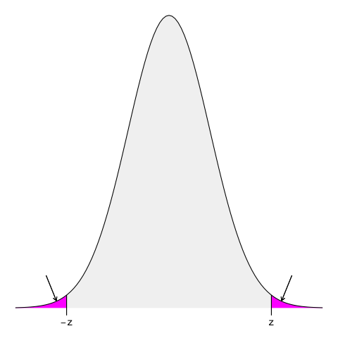
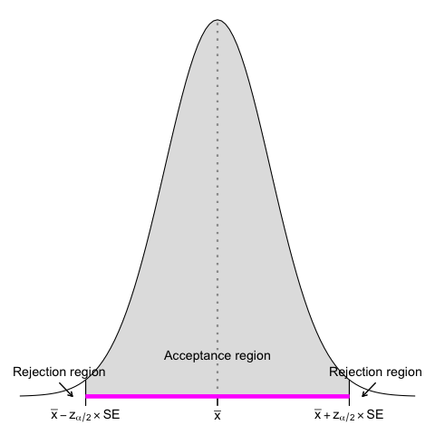
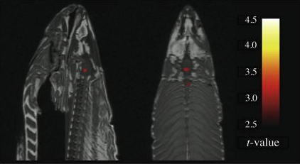

# Introduction to statistics

### (Day 3)

---

# Recap

---
## Recap

- When can't study a population, we select a representative sample

- Categorical variables  are described with absolute and relative frequencies, numerical variables are described with measures of central tendency (mode, median, mean) and dispersion (range, IQR, standard deviation)
- Parameters (calculated on the population) *vs*&nbsp; statistics (calculated on the sample)

---
## Recap

- Multiple phenomena and statistical distributions are normally distributed, and the Normal distribution describes both the probability of an observation and its proportion in the population

- We use statistics to estimate parameters (point estimates), with interval estimates (confidence intervals) estimating  their uncertainty
- 95% confidence intervals tell us the the true value has 95% probability of being inside the given range

<!-- 95% confidence intervals tell us the the true value has 95% probability of being inside the given range -->

---

# Making decision with data

<!-- Sino ad adesso siamo andati a raccogliere i dati, descriverli e fare stime di paramentri di popolazione partendo da campioni, ma fare stime non basta. Dobbiamo anche prendere decisioni. Se Florence Nightingale si fosse limitata a fare stime dei soldiati morti, il governo non avrebbe stanziato fondi per migliorare la situazione non solo dei soldati, ma anche dei malati in tempo di pace.

Vediamo quindi ora come usare dell'evidenza dai dati per prendere delle decisioni -->

---
## Learning objectives

- Make and test hypotheses
- Interpret P values
- Understand Type I and II errors 
- Understand the power of a study

---

Spiegelhalter, D., *The Art of Statistics: Learning From Data*, Pelican, 2019

<!-- The Analysis stage has traditionally been the main emphasis of statistics courses, and we shall cover a range of analytic techniques in this book.

Finally, the key to good statistical science is drawing appropriate Conclusions that fully acknowledge the limitations in the evidence, and communicating them clearly. Any conclusions generally raise more questions, and so the cycle starts over again
 -->

---
## Making hypotheses

> *A hypothesis can be defined as a proposed explanation for a phenomenon. It is not the absolute truth, but a provisional, working assumption, perhaps best thought of as a potential suspect in a criminal case.*

Spiegelhalter, D., *The Art of Statistics: Learning From Data*, Pelican, 2019

<!-- 
Ogni studio inizia con un'ipotesi, quella che viene chiamata "domanda di ricerca"

A hypothesis can be defined as a proposed explanation for a phenomenon. It is not the absolute truth, but a provisional, working assumption, perhaps best thought of as a potential suspect in a criminal case. -->

---
## Making hypotheses

- The outcomes in the intervention and the control group are different
- The proportion of an event in the intervention and control group is different

---
### The falsification principle and the null hypothesis

- The outcomes in the intervention and the control group are <s>different</s> **the same**
- The proportion of an event in the intervention and control group is <s>different</s> **the same**

<!-- 
Nei pazienti con COVID-19 e sindrome da distress respiratorio acuto moderato o grave (ARDS), desametasone è efficace nell’aumentare il numero di giorni di respirazione autonoma?

Vogliamo rispondere a questa domanda perche' dobbiamo decidere se dobbiamo iniziare ad aggiungere dexametasone endovenoso per trattare i nostri pazienti con COVID.

Ogni studio inizia con un'ipotesi, quella che viene chiamata "domanda di ricerca"
Questo e' cosa ci aspettiamo di poter concludere come risultato del nostro test statistico 

Un'ipotesi puo' essere definita come una congettura su una o piu' popplaioni 

Tuttavia quello che andiamo a testaere e' un'affermazione diversa, il suo opposto: sono dexamethasone e la cura standard uguali? 

È più semplice trovare evidenze contro un’ipotesi piuttosto che evidenze a favore

Il metodo scientifico si basa sulla falsificazione delle ipotesi (K. Popper), infatti il fatto di aver trovato dell'evidenza in favore di un'ipotesi non vuold dire che non sara' mai possibile trovare ulteriore evidenza che la renda falsa -->

---
## The Falsification Principle

<!-- Per esempio non avendo mai trovato fossili che fossero compatibili con dinosauri con le piume, li abbiamo sempre immaginati come grossi lucertoloni coperti di squame -->

---
## The Falsification Principle

<!-- Ma poi abbiamo trovato dell'evidenza del contrario, abbiamo falsificato la nostra ipotesi.  -->

---
### Exercise #1

:question: &nbsp;&nbsp;&nbsp; Which is the null hypothesis of this study?

&nbsp;&nbsp;&nbsp;&nbsp;&nbsp;&nbsp;&nbsp;&nbsp;&nbsp; a) Dexamethasone plus standard care is  **more  effective** than standard care alone 
&nbsp;&nbsp;&nbsp;&nbsp;&nbsp;&nbsp;&nbsp;&nbsp;&nbsp; b) Dexamethasone plus standard care is  **less  effective** than standard care alone 
&nbsp;&nbsp;&nbsp;&nbsp;&nbsp;&nbsp;&nbsp;&nbsp;&nbsp; c) Dexamethasone plus standard care is **as effective** as standard care alone 
&nbsp;&nbsp;&nbsp;&nbsp;&nbsp;&nbsp;&nbsp;&nbsp;&nbsp; d) Dexamethasone plus standard care is not a **as effective** as  standard care alone 

<button id="countdown_exercise_1"></button>

Tomazini, B.M., *et al.*, Effect of dexamethasone on days alive and ventilator-free in patients with moderate or severe acute respiratory distress syndrome and COVID-19: the CoDEX randomized clinical trial.", JAMA, 2020, doi:10.1001/jama.2020.17021

---
### Exercise #1 -- Solution

:question: &nbsp;&nbsp;&nbsp; Which is the null hypothesis of this study?

&nbsp;&nbsp;&nbsp;&nbsp;&nbsp;&nbsp;&nbsp;&nbsp;&nbsp; a) Dexamethasone plus standard care is  **more  effective** than standard care alone 
&nbsp;&nbsp;&nbsp;&nbsp;&nbsp;&nbsp;&nbsp;&nbsp;&nbsp; b) Dexamethasone plus standard care is  **less  effective** than standard care alone 
&nbsp;&nbsp;&nbsp;&nbsp;&nbsp;&nbsp;&nbsp;&nbsp;&nbsp; c) Dexamethasone plus standard care is **as effective** as standard care alone &nbsp;&nbsp; :white_check_mark:
&nbsp;&nbsp;&nbsp;&nbsp;&nbsp;&nbsp;&nbsp;&nbsp;&nbsp; d) Dexamethasone plus standard care is not a **as effective** as  standard care alone 

---
### Exercise #2

:question: &nbsp;&nbsp;&nbsp; If one **doesn't** reject the null hypothesis it means that...

&nbsp;&nbsp;&nbsp;&nbsp;&nbsp;&nbsp;&nbsp;&nbsp;&nbsp; a) the null hypothesis is true
&nbsp;&nbsp;&nbsp;&nbsp;&nbsp;&nbsp;&nbsp;&nbsp;&nbsp; b) the null hypothesis is false
&nbsp;&nbsp;&nbsp;&nbsp;&nbsp;&nbsp;&nbsp;&nbsp;&nbsp; c) the observations are compatible with the null hypothesis
&nbsp;&nbsp;&nbsp;&nbsp;&nbsp;&nbsp;&nbsp;&nbsp;&nbsp; d) the observations aren't compatible with the null hypothesis
&nbsp;&nbsp;&nbsp;&nbsp;&nbsp;&nbsp;&nbsp;&nbsp;&nbsp; e) it depends on the research question

<button id="countdown_exercise_2"></button>

---
### Exercise #2 -- Solution

:question: &nbsp;&nbsp;&nbsp; If one **doesn't** reject the null hypothesis it means that...

&nbsp;&nbsp;&nbsp;&nbsp;&nbsp;&nbsp;&nbsp;&nbsp;&nbsp; a) the null hypothesis is true
&nbsp;&nbsp;&nbsp;&nbsp;&nbsp;&nbsp;&nbsp;&nbsp;&nbsp; b) the null hypothesis is false
&nbsp;&nbsp;&nbsp;&nbsp;&nbsp;&nbsp;&nbsp;&nbsp;&nbsp; c) the observations are compatible with the null hypothesis  &nbsp;:white_check_mark:
&nbsp;&nbsp;&nbsp;&nbsp;&nbsp;&nbsp;&nbsp;&nbsp;&nbsp; d) the observations aren't compatible with the null hypothesis
&nbsp;&nbsp;&nbsp;&nbsp;&nbsp;&nbsp;&nbsp;&nbsp;&nbsp; e) it depends on the research question

<!-- Il metodo statistico formalizza questa idea (È più semplice trovare evidenze contro un’ipotesi piuttosto che evidenze a favore) attraverso l’ipotesi nulla, 

HO ci dice che non ci sono differenze. I gemelli mono e di pesano uguale

L’ipotesi nulla (𝐻_0 )  è l’ipotesi considerata vera finché non vengono presentate delle prove (evidenza empirica) per mostrare che non lo è

Non possiamo provare una teoria, ma possiamo falsificare delle affermazioni -->

---
### Exercise #3

:question: &nbsp;&nbsp;&nbsp; How do you define the null hypothesis in this study?

&nbsp;&nbsp;&nbsp;&nbsp;&nbsp;&nbsp;&nbsp;&nbsp;&nbsp; a) $\mu_\text{i}-\mu_\text{c} = 0$ 
&nbsp;&nbsp;&nbsp;&nbsp;&nbsp;&nbsp;&nbsp;&nbsp;&nbsp; b) $\mu_\text{i}-\mu_\text{c} \neq 0$
&nbsp;&nbsp;&nbsp;&nbsp;&nbsp;&nbsp;&nbsp;&nbsp;&nbsp; c) $\bar{x}_\text{i}-\bar{x}_\text{c} = 0$
&nbsp;&nbsp;&nbsp;&nbsp;&nbsp;&nbsp;&nbsp;&nbsp;&nbsp; d) $\bar{x}_\text{i}-\bar{x}_\text{c} \neq 0$

<button id="countdown_exercise_3"></button>

---
### Exercise #3 -- Solution

:question: &nbsp;&nbsp;&nbsp; How do you define the null hypothesis in this study?

&nbsp;&nbsp;&nbsp;&nbsp;&nbsp;&nbsp;&nbsp;&nbsp;&nbsp; a) $\mu_\text{i}-\mu_\text{c} = 0$ &nbsp;&nbsp; :white_check_mark:
&nbsp;&nbsp;&nbsp;&nbsp;&nbsp;&nbsp;&nbsp;&nbsp;&nbsp; b) $\mu_\text{i}-\mu_\text{c} \neq 0$
&nbsp;&nbsp;&nbsp;&nbsp;&nbsp;&nbsp;&nbsp;&nbsp;&nbsp; c) $\bar{x}_\text{i}-\bar{x}_\text{c} = 0$
&nbsp;&nbsp;&nbsp;&nbsp;&nbsp;&nbsp;&nbsp;&nbsp;&nbsp; d) $\bar{x}_\text{i}-\bar{x}_\text{c} \neq 0$

---
## Making hypotheses

:pushpin: &nbsp;&nbsp;&nbsp; Dexamethasone plus standard care is  **as effective as** standard care

&nbsp;&nbsp;&nbsp;&nbsp;&nbsp;&nbsp;&nbsp;&nbsp;&nbsp; $n_{\text{i}}=151, \bar{x}_{\text{i}}=6.6, s_{\text{i}}=10.0$ 
&nbsp;&nbsp;&nbsp;&nbsp;&nbsp;&nbsp;&nbsp;&nbsp;&nbsp; $n_{\text{c}}=148, \bar{x}_{\text{c}}=4.0, s_{\text{c}}=8.7$ 

&nbsp;&nbsp;&nbsp;&nbsp;&nbsp;&nbsp;&nbsp;&nbsp;&nbsp; $\mu_{\text{i}} - \mu_{\text{c}} = 0$ 
&nbsp;&nbsp;&nbsp;&nbsp;&nbsp;&nbsp;&nbsp;&nbsp;&nbsp;&nbsp;&nbsp;&nbsp;&nbsp;&nbsp;&nbsp;&nbsp;&nbsp;&nbsp;&nbsp;&nbsp;&nbsp;&nbsp; $\rightarrow \text{Null hypothesis} \text{ } (\mathcal{H}_0)$

<!-- Il metodo statistico formalizza questa idea (È più semplice trovare evidenze contro un’ipotesi piuttosto che evidenze a favore) attraverso l’ipotesi nulla, 

HO ci dice che non ci sono differenze. Dexamethasome ha la stessa efficacia della terapia standard e non aumenta il numero di giorni di respirazione autonoma.

L’ipotesi nulla (𝐻_0 )  è l’ipotesi considerata vera finché non vengono presentate delle prove (evidenza empirica) per mostrare che non lo è

come per i dinosauri: non ganno piume sino a che non ne troviamo uno che ce l'ha

Non possiamo provare una teoria, ma possiamo falsificare delle affermazioni -->

---
## Making hypotheses

:pushpin: &nbsp;&nbsp;&nbsp; Dexamethasone plus standard care is  **as effective as** standard care

&nbsp;&nbsp;&nbsp;&nbsp;&nbsp;&nbsp;&nbsp;&nbsp;&nbsp; $n_{\text{i}}=151, \bar{x}_{\text{i}}=6.6, s_{\text{i}}=10.0$ 
&nbsp;&nbsp;&nbsp;&nbsp;&nbsp;&nbsp;&nbsp;&nbsp;&nbsp; $n_{\text{c}}=148, \bar{x}_{\text{c}}=4.0, s_{\text{c}}=8.7$ 

&nbsp;&nbsp;&nbsp;&nbsp;&nbsp;&nbsp;&nbsp;&nbsp;&nbsp; $\mu_{\text{i}} - \mu_{\text{c}}  = 0$
&nbsp;&nbsp;&nbsp;&nbsp;&nbsp;&nbsp;&nbsp;&nbsp;&nbsp;&nbsp;&nbsp;&nbsp;&nbsp;&nbsp;&nbsp;&nbsp;&nbsp;&nbsp;&nbsp;&nbsp;&nbsp;&nbsp; $\rightarrow \text{Null hypothesis} \text{ } (\mathcal{H}_0)$

&nbsp;&nbsp;&nbsp;&nbsp;&nbsp;&nbsp;&nbsp;&nbsp;&nbsp; $\mu_{\text{i}} - \mu_{\text{c}} \neq 0$ 
&nbsp;&nbsp;&nbsp;&nbsp;&nbsp;&nbsp;&nbsp;&nbsp;&nbsp;&nbsp;&nbsp;&nbsp;&nbsp;&nbsp;&nbsp;&nbsp;&nbsp;&nbsp;&nbsp;&nbsp;&nbsp;&nbsp; $\rightarrow \text{Alternative hypothesis} \text{ } (\mathcal{H}_1/\mathcal{H}_A)$

<!-- e l'ipotesti alternativa (la nostra congettura).
Le due ipotesi sono complementari: insieme esauriscono tutte i possibili valori assunti dal parametro studiato

ATtENZIONE: com il test di ipotesi non si fa la DIMOSTRAZIONE di un'ipotesi, si ha semplicemente un'indicazione sul fatto che l'ipotesi sia o meno supportata dai dati.

Non rifiutando l'ipotesi nulla, non diciamo che essa sia vera, ma che potrebbe essere vera 

ATTENZIONE ad un ultimo punto: i dati su cui andiamo a testare la nostra ipotesi sono quelli di un campione, ma l'ipotesi viene fatta sull'intera popolazione -->

---
## Testing hypotheses

:pushpin: &nbsp;&nbsp;&nbsp; Dexamethasone plus standard care is  **as effective as** standard care

&nbsp;&nbsp;&nbsp;&nbsp;&nbsp;&nbsp;&nbsp;&nbsp; $n_{\text{i}}= 151, \text{ } \text{ } \text{ } \text{ } \bar{x}_{\text{i}}= 6.6, \text{ } \text{ } \text{ }  s_\text{i} = 10.0$ 
&nbsp;&nbsp;&nbsp;&nbsp;&nbsp;&nbsp;&nbsp;&nbsp; $n_{\text{c}}= 148, \text{ } \text{ }  \text{ } \text{ }  \bar{x}_{\text{c}}= 4.0, \text{ } \text{ }  s_\text{c} = 8.7$ 

  Tomazini B.M., *et al.*, *Effect of Dexamethasone on Days Alive and Ventilator-Free in Patients With  Moderate or Severe Acute Respiratory Distress Syndrome and COVID-19*, JAMA, 2020

---
## Testing hypotheses

:pushpin: &nbsp;&nbsp;&nbsp; Dexamethasone plus standard care is  **as effective as** standard care

&nbsp;&nbsp;&nbsp;&nbsp;&nbsp;&nbsp;&nbsp;&nbsp;&nbsp; $n_{\text{i}}=151, \bar{x}_{\text{i}}=6.6, s_{\text{i}}=10.0$ 
&nbsp;&nbsp;&nbsp;&nbsp;&nbsp;&nbsp;&nbsp;&nbsp;&nbsp; $n_{\text{c}}=148, \bar{x}_{\text{c}}=4.0, s_{\text{c}}=8.7$ 

&nbsp;&nbsp;&nbsp;&nbsp;&nbsp;&nbsp;&nbsp;&nbsp;&nbsp; $\mu_{\text{i}} - \mu_{\text{c}} = 0$ &nbsp;&nbsp;&nbsp; $\leftarrow$
&nbsp;&nbsp;&nbsp;&nbsp;&nbsp;&nbsp;&nbsp;&nbsp;&nbsp; $\bar{x}_i - \bar{x}_c = 6.6 - 4.0 = 2.6$

---
## Testing hypotheses

:pushpin: &nbsp;&nbsp;&nbsp; Dexamethasone plus standard care is  **as effective as** standard care

&nbsp;&nbsp;&nbsp;&nbsp;&nbsp;&nbsp;&nbsp;&nbsp;&nbsp; $n_{\text{i}}=151, \bar{x}_{\text{i}}=6.6, s_{\text{i}}=10.0$ 
&nbsp;&nbsp;&nbsp;&nbsp;&nbsp;&nbsp;&nbsp;&nbsp;&nbsp; $n_{\text{c}}=148, \bar{x}_{\text{c}}=4.0, s_{\text{c}}=8.7$ 

&nbsp;&nbsp;&nbsp;&nbsp;&nbsp;&nbsp;&nbsp;&nbsp;&nbsp; $\mu_{\text{i}} - \mu_{\text{c}} = 0$ &nbsp;&nbsp;&nbsp; $\leftarrow$
&nbsp;&nbsp;&nbsp;&nbsp;&nbsp;&nbsp;&nbsp;&nbsp;&nbsp; $\bar{x}_i - \bar{x}_c = 6.6 - 4.0 = 2.6$

:question: &nbsp;&nbsp;&nbsp; What is the probability of observing a difference of 2.6 days
&nbsp;&nbsp;&nbsp;&nbsp;&nbsp;&nbsp;&nbsp;&nbsp;  if $\mu_{\text{d}} - \mu_{\text{m}} = 0$?

<!-- Se &egrave; abbastanza probabile, tipo 1 caso su 10, vuol dire che e' abbastanza vicino, se invece e' 1 su 1000 allora e' alquanto improbabile, e di conseguenza vuol dire che e' "sufficientemente lontano".

Se vi dico probabilita' di osservare, quale argomento passato vi viene in mente? -->

---
## Let's take a step back

1. The Normal distribution is defined by its mean and standard deviation and corresponds to a probability distribution
&nbsp;&nbsp;&nbsp;&nbsp;&nbsp;&nbsp;&nbsp;&nbsp;&nbsp; $\rightarrow$ &nbsp;&nbsp;&nbsp; Area $Z$ $\equiv$ probability $\mathcal{P}$
2. Sampling distributions (including the difference of means) show a Normal distribution (CLT)

---
## Let's take a step back

1. The Normal distribution is defined by its mean and standard deviation and corresponds to a probability distribution
&nbsp;&nbsp;&nbsp;&nbsp;&nbsp;&nbsp;&nbsp;&nbsp;&nbsp; $\rightarrow$ &nbsp;&nbsp;&nbsp; Area $Z$ $\equiv$ probability $\mathcal{P}$
2. Sampling distributions (including the difference of means) show a Normal distribution (CLT)

For the difference of means:

&nbsp;&nbsp;&nbsp;&nbsp;&nbsp;&nbsp;&nbsp;&nbsp; $\mathcal{N} = (\mu_1 - \mu_2, \frac{\sigma_1^2}{n_1} + \frac{\sigma_2^2}{n_2})$ with 
&nbsp;&nbsp;&nbsp;&nbsp;&nbsp;&nbsp;&nbsp;&nbsp; $\sqrt{ \frac{\sigma_1^2}{n_1} + \frac{\sigma_2^2}{n_2} } \text{ }\text{ }\rightarrow$ &nbsp; standard error

---
## Testing hypotheses

:pushpin: &nbsp;&nbsp;&nbsp; Dexamethasone plus standard care is  **as effective as** 
&nbsp;&nbsp;&nbsp;&nbsp;&nbsp;&nbsp;&nbsp;&nbsp; standard care  alone

&nbsp;&nbsp;&nbsp;&nbsp;&nbsp;&nbsp;&nbsp;&nbsp;&nbsp; $n_{\text{i}}=151, \bar{x}_{\text{i}}=6.6, s_{\text{i}}=10.0$ 
&nbsp;&nbsp;&nbsp;&nbsp;&nbsp;&nbsp;&nbsp;&nbsp;&nbsp; $n_{\text{c}}=148, \bar{x}_{\text{c}}=4.0, s_{\text{c}}=8.7$ 

&nbsp;&nbsp;&nbsp;&nbsp;&nbsp;&nbsp;&nbsp;&nbsp;&nbsp; $\mu_{\text{c}} - \mu_{\text{i}} = 0$ &nbsp;&nbsp;&nbsp; $\leftarrow$
&nbsp;&nbsp;&nbsp;&nbsp;&nbsp;&nbsp;&nbsp;&nbsp;&nbsp; $\bar{x}_{\text{c}} - \bar{x}_{\text{i}} = 6.6 - 4.0 = 2.6$

<!-- 

 -->

&nbsp;&nbsp;&nbsp;&nbsp;&nbsp;&nbsp;&nbsp;&nbsp; $\mathcal{N} = (\mu_{\text{c}} - \mu_{\text{i}}, \frac{\sigma_c^2}{n_c} + \frac{\sigma_i^2}{n_i}) \text{  } \rightarrow  \text{  } \mu_{\text{c}} - \mu_{\text{i}} = 0 \text{ and } \hat{\text{SE}}= \sqrt{\frac{s_\text{c}^2}{n_\text{c}} + \frac{s_\text{i}^2}{n_\text{i}}} = 1.08$ 

---
## Testing hypotheses

:pushpin: &nbsp;&nbsp;&nbsp; Dexamethasone plus standard care is  **as effective as** standard care

&nbsp;&nbsp;&nbsp;&nbsp;&nbsp;&nbsp;&nbsp;&nbsp;&nbsp; $\mu_{\text{c}} - \mu_{\text{i}} = 0$
&nbsp;&nbsp;&nbsp;&nbsp;&nbsp;&nbsp;&nbsp;&nbsp;&nbsp; $\hat{\text{SE}}=1.08$

&nbsp;&nbsp;&nbsp;&nbsp;&nbsp;&nbsp;&nbsp;&nbsp;&nbsp; $\bar{x}_{\text{c}} - \bar{x}_{\text{i}} = 6.6 - 4.0 = 2.6$

:question: &nbsp;&nbsp;&nbsp; What is the probability of 
&nbsp;&nbsp;&nbsp;&nbsp;&nbsp;&nbsp;&nbsp;&nbsp; observing a difference of 2.6 
&nbsp;&nbsp;&nbsp;&nbsp;&nbsp;&nbsp;&nbsp;&nbsp; days if $\mu_{\text{c}} - \mu_{\text{i}} = 0$?

&nbsp;&nbsp;&nbsp;&nbsp;&nbsp;&nbsp;&nbsp;&nbsp;&nbsp; $z = \frac{(\bar{x}_{\text{c}} - \bar{x}_{\text{i}}) - (\mu_{\text{c}} - \mu_{\text{i}})}{\hat{SE}} = \frac{2.6-0}{1.08} = 2.4$

---
## Testing hypotheses

:pushpin: &nbsp;&nbsp;&nbsp; Dexamethasone plus standard care is  **as effective as** standard care

&nbsp;&nbsp;&nbsp;&nbsp;&nbsp;&nbsp;&nbsp;&nbsp;&nbsp; $\mu_{\text{c}} - \mu_{\text{i}} = 0$
&nbsp;&nbsp;&nbsp;&nbsp;&nbsp;&nbsp;&nbsp;&nbsp;&nbsp; $\hat{\text{SE}}=1.08$

&nbsp;&nbsp;&nbsp;&nbsp;&nbsp;&nbsp;&nbsp;&nbsp;&nbsp; $\bar{x}_{\text{c}} - \bar{x}_{\text{i}} = 6.6 - 4.0 = 2.6$

:question: &nbsp;&nbsp;&nbsp; What is the probability of 
&nbsp;&nbsp;&nbsp;&nbsp;&nbsp;&nbsp;&nbsp;&nbsp; observing a difference of 2.6 
&nbsp;&nbsp;&nbsp;&nbsp;&nbsp;&nbsp;&nbsp;&nbsp; days if $\mu_{\text{c}} - \mu_{\text{i}} = 0$?

&nbsp;&nbsp;&nbsp;&nbsp;&nbsp;&nbsp;&nbsp;&nbsp;&nbsp; $z = \frac{(\bar{x}_{\text{c}} - \bar{x}_{\text{i}}) - (\mu_{\text{c}} - \mu_{\text{i}})}{\hat{SE}} = \frac{2.6-0}{1.08} = 2.4$ &nbsp;&nbsp; $\rightarrow$ &nbsp;&nbsp; $\mathcal{P} = 2 \times 0.0082 = 0.0164$

<!-- P = 1.4e-16 

Usando il P-value, che ci dice quanto sono improbabili i risultati ottenuti da questo campione dato che l'ipotesi nulla &egrave; vera.

Un P-value molto piccolo ci dice quindi che sia molto improbabile che H0 sia vera dandoci una forte ragione per dubitare che le due medie siano uguali 

-->

---
## P-value

:dart: &nbsp;&nbsp;&nbsp; The P-value measures the discrepancy between the data and the null 
&nbsp;&nbsp;&nbsp;&nbsp;&nbsp;&nbsp;&nbsp;&nbsp; hypothesis $\mathcal{H}_0$ and correspond to the probability of observing 
&nbsp;&nbsp;&nbsp;&nbsp;&nbsp;&nbsp;&nbsp;&nbsp; such an extreme value, if  $\mathcal{H}_0$ was true

<!-- Il P-value misura la discrepanza tra i dati e $\mathcal{H}_0$ e corrisponde alla probabilit&agrave; di ottenere un risultato tanto estremo quanto quello  ottenuto se l'ipotesi nulla fosse vera. -->

---
## P-value

:dart: &nbsp;&nbsp;&nbsp; The P-value measures the discrepancy between the data and the null 
&nbsp;&nbsp;&nbsp;&nbsp;&nbsp;&nbsp;&nbsp;&nbsp; hypothesis $\mathcal{H}_0$ and correspond to the probability of observing 
&nbsp;&nbsp;&nbsp;&nbsp;&nbsp;&nbsp;&nbsp;&nbsp; such an extreme value, if  $\mathcal{H}_0$ was true

&nbsp;&nbsp;&nbsp;&nbsp;&nbsp;&nbsp;&nbsp;&nbsp;&nbsp;&nbsp;&nbsp;&nbsp;&nbsp;&nbsp;&nbsp;&nbsp;&nbsp;&nbsp; $\text{P-value} = 0.5 \rightarrow 50\% \rightarrow 1 \text{ sample out of } 2$
&nbsp;&nbsp;&nbsp;&nbsp;&nbsp;&nbsp;&nbsp;&nbsp;&nbsp;&nbsp;&nbsp;&nbsp;&nbsp;&nbsp;&nbsp;&nbsp;&nbsp;&nbsp; $\text{P-value} = 0.1 \rightarrow 10\% \rightarrow 1 \text{ sample out of } 10$
&nbsp;&nbsp;&nbsp;&nbsp;&nbsp;&nbsp;&nbsp;&nbsp;&nbsp;&nbsp;&nbsp;&nbsp;&nbsp;&nbsp;&nbsp;&nbsp;&nbsp;&nbsp; $\text{P-value} = 0.05 \rightarrow 5\% \rightarrow 1 \text{ sample out of } 20$
&nbsp;&nbsp;&nbsp;&nbsp;&nbsp;&nbsp;&nbsp;&nbsp;&nbsp;&nbsp;&nbsp;&nbsp;&nbsp;&nbsp;&nbsp;&nbsp;&nbsp;&nbsp; $\text{P-value} = 0.01 \rightarrow 1\% \rightarrow 1 \text{ sample out of } 100$
&nbsp;&nbsp;&nbsp;&nbsp;&nbsp;&nbsp;&nbsp;&nbsp;&nbsp;&nbsp;&nbsp;&nbsp;&nbsp;&nbsp;&nbsp;&nbsp;&nbsp;&nbsp; $\text{P-value} = 0.005 \rightarrow 0.5\% \rightarrow 1 \text{ sample out of } 200$

 <!-- ci dice quanto e' probabile fare un errore (il peso alla nascita e' diverso) se accettiamo l'ipotesi nulla 
  
  Se p-value = 0.02
  Se l’ipotesi nulla fosse vera, la probabilità di osservare il risultato che abbiamo ottenuto, o una differenza ancora maggiore, sarebbe solo dell’2%
  Se il farmaco non fosse efficace (ipotesi nulla fosse vera) solo in 2 campione ogni 100 avremmo il risultato osservato 

  In modo molto informale. L’espressione statisticamente significativo vuol dire che sono state raccolte prove sufficienti per rifiutare l’ipotesi nulla 
  
 -->

---
## P-value e statistical significance

:dart: &nbsp;&nbsp;&nbsp; The P-value measures the discrepancy between the data and the null 
&nbsp;&nbsp;&nbsp;&nbsp;&nbsp;&nbsp;&nbsp;&nbsp; hypothesis $\mathcal{H}_0$ and correspond to the probability of observing 
&nbsp;&nbsp;&nbsp;&nbsp;&nbsp;&nbsp;&nbsp;&nbsp; such an extreme value, if  $\mathcal{H}_0$ was true

&nbsp;&nbsp;&nbsp;&nbsp;&nbsp;&nbsp;&nbsp;&nbsp; If the P-value is less than some pre-specified level $\alpha$, we consider  
&nbsp;&nbsp;&nbsp;&nbsp;&nbsp;&nbsp;&nbsp;&nbsp; the observed difference as statistically significant 

&nbsp;&nbsp;&nbsp;&nbsp;&nbsp;&nbsp;&nbsp;&nbsp;&nbsp;&nbsp;&nbsp;&nbsp;&nbsp;&nbsp;&nbsp;&nbsp;&nbsp;&nbsp; $\alpha = 0.05 \text{ or } 0.01$

<!-- 
In modo molto informale. L’espressione statisticamente significativo vuol dire che sono state raccolte prove sufficienti per rifiutare l’ipotesi nulla 

Ronald Fisher used P < 0.05 and P < 0.01 as convenient critical thresholds for indicating significance, and produced tables of the critical values of test statistics needed to achieve these levels of significance. The popularity of these tables led to 0.05 and 0.01 becoming established conventions, although it is now recommended that exact P-values should be reported. 

The standard thresholds for declaring ‘significance’, P < 0.05 and P < 0.01, were fairly arbitrary choices by Ronald Fisher for his tables, back in the days when calculating exact P-values was not possible using the mechanical and electrical calculators available. 

And it is important to emphasize that the exact P-value is conditional not only on the truth of the null hypothesis, but also on all other assumptions underlying the statistical model, such as lack of systematic bias, independent observations, and so on.

--->

---
## Hypothesis testing, one step at a time

<!-- This whole process has become known as Null Hypothesis Significance Testing (NHST) and, as we shall see below, it has become a source of major controversy. But first we should examine how Fisher’s ideas are used in practice.

Ronald Fisher was an extraordinary, but difficult, man. He was extraordinary because he is regarded as a pioneering figure in two distinct fields – genetics and statistics. Yet he had a notorious temper and could be extremely critical of anyone who he felt questioned his ideas, while his support for eugenics and his public criticism of the evidence for the link between smoking and lung cancer damaged his standing. His personal reputation has suffered as his financial connections with the tobacco industry have been revealed, but his scientific reputation is undiminished, as his ideas find repeated new applications in the analysis of large data sets. --> -->

---
## Hypothesis testing, one step at a time

1. Define a null hypothesis $(\mathcal{H_0})$

&nbsp;&nbsp;&nbsp;&nbsp;&nbsp;&nbsp;&nbsp;&nbsp;&nbsp;&nbsp; Dexamethasone plus standard care is  **as effective as** standard care

&nbsp;&nbsp;&nbsp;&nbsp;&nbsp;&nbsp;&nbsp;&nbsp;&nbsp;&nbsp; $\mathcal{H_0} : \mu_\text{c} - \mu_\text{i} = 0$

---
## Hypothesis testing, one step at a time

1. Define a null hypothesis $(\mathcal{H_0})$
2. Choose a test statistic that estimates something that, if extreme enough, would lead one to doubt $\mathcal{H_0}$

&nbsp;&nbsp;&nbsp;&nbsp;&nbsp;&nbsp;&nbsp;&nbsp;&nbsp;&nbsp; $t$-test$^{(*)}$ for differences in mean

We are using the $t$-test for differences in mean and not the $z$-test because we don't know the standard deviation in the population (and are using the sample's standard deviation instead).

---
## Hypothesis testing, one step at a time

1. Define a null hypothesis $(\mathcal{H_0})$
2. Choose a test statistic that estimates something that, if extreme enough, would lead one to doubt $\mathcal{H_0}$
3. Generate the sampling distribution of the chosen test statistic, assuming $\mathcal{H_0}$ to be true

&nbsp;&nbsp;&nbsp;&nbsp;&nbsp;&nbsp;&nbsp;&nbsp;&nbsp;&nbsp; $\mathcal{N} = (\mu_\text{c} - \mu_\text{i}, \text{SE})$, with $\mu_{\text{c}} - \mu_{\text{i}} = 0 \text{ and } \hat{\text{SE}}= \sqrt{\frac{s_\text{c}^2}{n_\text{c}} + \frac{s_\text{i}^2}{n_\text{i}}}$

---
## Hypothesis testing, one step at a time

1. Define a null hypothesis $(\mathcal{H_0})$
2. Choose a test statistic that estimates something that, if extreme enough, would lead one to doubt $\mathcal{H_0}$
3. Generate the sampling distribution of the chosen test statistic, assuming $\mathcal{H_0}$ to be true
4. Check whether the observed statistic lies in the tails of this distribution, and calculate a probability (P-value) for this event

&nbsp;&nbsp;&nbsp;&nbsp;&nbsp;&nbsp;&nbsp;&nbsp;&nbsp;&nbsp; $\mathcal{P} = 2 \times 0.0082 = 0.0164$

<!-- P-value: the probability, were the null hypothesis true, of observing such an extreme statistic. The P-value is therefore a particular tail-area. -->

---
## Hypothesis testing, one step at a time

1. Define a null hypothesis $(\mathcal{H_0})$
2. Choose a test statistic that estimates something that, if extreme enough, would lead one to doubt $\mathcal{H_0}$
3. Generate the sampling distribution of the chosen test statistic, assuming $\mathcal{H_0}$ to be true
4. Check whether the observed statistic lies in the tails of this distribution, and calculate a probability (P-value) for this event
5. Declare the result statistically significant if the P-value is below some critical threshold $\alpha$

&nbsp;&nbsp;&nbsp;&nbsp;&nbsp;&nbsp;&nbsp;&nbsp;&nbsp;&nbsp; $\mathcal{P} = 2 \times 0.0082 = 0.0164 < \alpha = 0.05$ &nbsp;&nbsp; $\rightarrow$ &nbsp;&nbsp; one rejects $\mathcal{H_0}$

<!-- P-value measures how likely it is that we would have observed such an extreme value were the null hypothesis really true. -->

---
### Exercize #4

:question: &nbsp;&nbsp;&nbsp; In a randomised control trial, the P-value for one of the outcomes is 0.48.
&nbsp;&nbsp;&nbsp;&nbsp;&nbsp;&nbsp;&nbsp;&nbsp; With an $\alpha$ level of 5%, are there statistically significant differences in
&nbsp;&nbsp;&nbsp;&nbsp;&nbsp;&nbsp;&nbsp;&nbsp; the outcome between the two arms of the trial?

&nbsp;&nbsp;&nbsp;&nbsp;&nbsp;&nbsp;&nbsp;&nbsp;&nbsp; a) Yes, because the P value is lower than the $\alpha$ level
&nbsp;&nbsp;&nbsp;&nbsp;&nbsp;&nbsp;&nbsp;&nbsp;&nbsp; b) Yes, because the P value is greater than the $\alpha$ level
&nbsp;&nbsp;&nbsp;&nbsp;&nbsp;&nbsp;&nbsp;&nbsp;&nbsp; c) No, because the P value is lower than the $\alpha$ level
&nbsp;&nbsp;&nbsp;&nbsp;&nbsp;&nbsp;&nbsp;&nbsp;&nbsp; d) No, because the P value is greater than the $\alpha$ level

<button id="countdown_exercise_4"></button>

---
### Exercize #4 -- Solution

:question: &nbsp;&nbsp;&nbsp; In a randomised control trial, the P-value for one of the outcomes is 0.48.
&nbsp;&nbsp;&nbsp;&nbsp;&nbsp;&nbsp;&nbsp;&nbsp; With an $\alpha$ level of 5%, are there statistically significant differences in
&nbsp;&nbsp;&nbsp;&nbsp;&nbsp;&nbsp;&nbsp;&nbsp; the outcome between the two arms of the trial?

&nbsp;&nbsp;&nbsp;&nbsp;&nbsp;&nbsp;&nbsp;&nbsp;&nbsp; a) Yes, because the P value is lower than the $\alpha$ level
&nbsp;&nbsp;&nbsp;&nbsp;&nbsp;&nbsp;&nbsp;&nbsp;&nbsp; b) Yes, because the P value is greater than the $\alpha$ level
&nbsp;&nbsp;&nbsp;&nbsp;&nbsp;&nbsp;&nbsp;&nbsp;&nbsp; c) No, because the P value is lower than the $\alpha$ level
&nbsp;&nbsp;&nbsp;&nbsp;&nbsp;&nbsp;&nbsp;&nbsp;&nbsp; d) No, because the P value is greater than the $\alpha$ level &nbsp;&nbsp; :white_check_mark:

---
## One- and two-tailed tests

:dart: &nbsp;&nbsp;&nbsp; $\mathcal{H}_1$: &nbsp;&nbsp;&nbsp; $\mu_{\text{i}} - \mu_{\text{c}} \neq 0$
&nbsp;&nbsp;&nbsp;&nbsp;&nbsp;&nbsp;&nbsp;&nbsp; $\mathcal{H}_0$: &nbsp;&nbsp;&nbsp; $\mu_{\text{i}} - \mu_{\text{c}} = 0$
&nbsp;&nbsp;&nbsp;&nbsp;&nbsp;&nbsp;&nbsp;&nbsp;&nbsp;&nbsp;&nbsp;&nbsp;&nbsp;&nbsp;&nbsp;&nbsp;&nbsp;&nbsp;&nbsp;&nbsp;&nbsp;&nbsp;&nbsp;&nbsp;&nbsp; $\rightarrow$ two-tailed test

<!-- a one-sided hypothesis test is used when a null hypothesis specifies that, say, the effect of a medical treatment is negative. This would only be rejected by large positive values of a test statistic representing an estimated treatment effect. A two-sided test would be appropriate for a null hypothesis that a treatment effect, say, is exactly zero, and so both positive and negative estimates would lead to the null being rejected. -->

---
## One- and two-tailed tests

:dart: &nbsp;&nbsp;&nbsp; $\mathcal{H}_1$: &nbsp;&nbsp;&nbsp; $\mu_{\text{i}} - \mu_{\text{c}} \neq 0$
&nbsp;&nbsp;&nbsp;&nbsp;&nbsp;&nbsp;&nbsp;&nbsp; $\mathcal{H}_0$: &nbsp;&nbsp;&nbsp; $\mu_{\text{i}} - \mu_{\text{c}} = 0$
&nbsp;&nbsp;&nbsp;&nbsp;&nbsp;&nbsp;&nbsp;&nbsp;&nbsp;&nbsp;&nbsp;&nbsp;&nbsp;&nbsp;&nbsp;&nbsp;&nbsp;&nbsp;&nbsp;&nbsp;&nbsp;&nbsp;&nbsp;&nbsp;&nbsp; $\rightarrow$ two-tailed test

&nbsp;&nbsp;&nbsp;&nbsp;&nbsp;&nbsp;&nbsp;&nbsp; $\mathcal{H}_1$: &nbsp;&nbsp;&nbsp; $\mu_{\text{i}} - \mu_{\text{c}} < 0$
&nbsp;&nbsp;&nbsp;&nbsp;&nbsp;&nbsp;&nbsp;&nbsp; $\mathcal{H}_0$: &nbsp;&nbsp;&nbsp; $\mu_{\text{i}} - \mu_{\text{c}} \geq  0$
&nbsp;&nbsp;&nbsp;&nbsp;&nbsp;&nbsp;&nbsp;&nbsp;&nbsp;&nbsp;&nbsp;&nbsp;&nbsp;&nbsp;&nbsp;&nbsp;&nbsp;&nbsp;&nbsp;&nbsp;&nbsp;&nbsp;&nbsp;&nbsp;&nbsp;&nbsp;&nbsp;  
&nbsp;&nbsp;&nbsp;&nbsp;&nbsp;&nbsp;&nbsp;&nbsp;&nbsp; 
&nbsp;&nbsp;&nbsp;&nbsp;&nbsp;&nbsp;&nbsp;&nbsp;&nbsp; 
&nbsp;&nbsp;&nbsp;&nbsp;&nbsp;&nbsp;&nbsp;&nbsp;&nbsp;&nbsp;&nbsp;&nbsp;&nbsp;&nbsp;&nbsp;&nbsp;&nbsp;&nbsp;&nbsp;&nbsp;&nbsp;&nbsp;&nbsp;&nbsp;&nbsp; $\rightarrow$ one-tailed test

<!-- a one-sided hypothesis test is used when a null hypothesis specifies that, say, the effect of a medical treatment is negative. This would only be rejected by large positive values of a test statistic representing an estimated treatment effect. A two-sided test would be appropriate for a null hypothesis that a treatment effect, say, is exactly zero, and so both positive and negative estimates would lead to the null being rejected. -->

---
## One- and two-tailed tests

:dart: &nbsp;&nbsp;&nbsp; $\mathcal{H}_1$: &nbsp;&nbsp;&nbsp; $\mu_{\text{i}} - \mu_{\text{c}} \neq 0$
&nbsp;&nbsp;&nbsp;&nbsp;&nbsp;&nbsp;&nbsp;&nbsp; $\mathcal{H}_0$: &nbsp;&nbsp;&nbsp; $\mu_{\text{i}} - \mu_{\text{c}} = 0$
&nbsp;&nbsp;&nbsp;&nbsp;&nbsp;&nbsp;&nbsp;&nbsp;&nbsp;&nbsp;&nbsp;&nbsp;&nbsp;&nbsp;&nbsp;&nbsp;&nbsp;&nbsp;&nbsp;&nbsp;&nbsp;&nbsp;&nbsp;&nbsp;&nbsp; $\rightarrow$ two-tailed test

&nbsp;&nbsp;&nbsp;&nbsp;&nbsp;&nbsp;&nbsp;&nbsp; $\mathcal{H}_1$: &nbsp;&nbsp;&nbsp; $\mu_{\text{i}} - \mu_{\text{c}} < 0$
&nbsp;&nbsp;&nbsp;&nbsp;&nbsp;&nbsp;&nbsp;&nbsp; $\mathcal{H}_0$: &nbsp;&nbsp;&nbsp; $\mu_{\text{i}} - \mu_{\text{c}} \geq  0$
&nbsp;&nbsp;&nbsp;&nbsp;&nbsp;&nbsp;&nbsp;&nbsp;&nbsp;&nbsp;&nbsp;&nbsp;&nbsp;&nbsp;&nbsp;&nbsp;&nbsp;&nbsp;&nbsp;&nbsp;&nbsp;&nbsp;&nbsp;&nbsp;&nbsp;  or
&nbsp;&nbsp;&nbsp;&nbsp;&nbsp;&nbsp;&nbsp;&nbsp; $\mathcal{H}_1$: &nbsp;&nbsp;&nbsp; $\mu_{\text{i}} - \mu_{\text{c}} > 0$
&nbsp;&nbsp;&nbsp;&nbsp;&nbsp;&nbsp;&nbsp;&nbsp; $\mathcal{H}_0$: &nbsp;&nbsp;&nbsp; $\mu_{\text{i}} - \mu_{\text{c}} \leq 0$
&nbsp;&nbsp;&nbsp;&nbsp;&nbsp;&nbsp;&nbsp;&nbsp;&nbsp;&nbsp;&nbsp;&nbsp;&nbsp;&nbsp;&nbsp;&nbsp;&nbsp;&nbsp;&nbsp;&nbsp;&nbsp;&nbsp;&nbsp;&nbsp;&nbsp; $\rightarrow$ one-tailed test

<!-- a one-sided hypothesis test is used when a null hypothesis specifies that, say, the effect of a medical treatment is negative. This would only be rejected by large positive values of a test statistic representing an estimated treatment effect. A two-sided test would be appropriate for a null hypothesis that a treatment effect, say, is exactly zero, and so both positive and negative estimates would lead to the null being rejected. -->

---
## Hypothesis testing & confidence intervals

:dart: &nbsp;&nbsp;&nbsp; A 95% confidence interval is the set of null hypotheses that are not  
&nbsp;&nbsp;&nbsp;&nbsp;&nbsp;&nbsp;&nbsp;&nbsp; rejected with $\alpha = 0.05$

| Confidence Level | $\alpha$ | $\alpha/2$ | $z_{\alpha/2}$ |
| ----: | ----- | ---- | ----|
| 95% | 5% | 2.5% | 1.96 |

---
## Hypothesis testing & confidence intervals

:dart: &nbsp;&nbsp;&nbsp; A 95% confidence interval is the set of null hypotheses that are not  
&nbsp;&nbsp;&nbsp;&nbsp;&nbsp;&nbsp;&nbsp;&nbsp; rejected with $\alpha = 0.05$

&nbsp;&nbsp;&nbsp;&nbsp;&nbsp;&nbsp;&nbsp;&nbsp;&nbsp; In a two-sided test, $\text{P-value} <0.05$
&nbsp;&nbsp;&nbsp;&nbsp;&nbsp;&nbsp;&nbsp;&nbsp;&nbsp; if the 95% confidence interval does
&nbsp;&nbsp;&nbsp;&nbsp;&nbsp;&nbsp;&nbsp;&nbsp;&nbsp; not include the null hypothesis 
&nbsp;&nbsp;&nbsp;&nbsp;&nbsp;&nbsp;&nbsp;&nbsp;&nbsp; (usually 0).

<!-- This intimate link between hypothesis testing and confidence intervals should stop people misinterpreting results that are not statistically significantly different from 0 – this does not mean that the null hypothesis is actually true, but simply that a confidence interval for the true value includes 0. Unfortunately, as we shall see later, this lesson is often ignored. -->

---
### Exercise #5

:question: &nbsp;&nbsp;&nbsp; Is Zidovudine better than placebo to reduce mother-infant HIV transmission?

&nbsp;&nbsp;&nbsp;&nbsp;&nbsp;&nbsp;&nbsp;&nbsp; $n_{\text{i}}= 180, \text{ } \text{ } \text{ } \text{ } m_{\text{i}}= 13, \text{ } \text{ } \text{ }  p_\text{i} = \frac{m_\text{i}}{n_\text{i}} = \frac{13}{180} = 0.07$ 
&nbsp;&nbsp;&nbsp;&nbsp;&nbsp;&nbsp;&nbsp;&nbsp; $n_{\text{c}}= 183, \text{ } \text{ }  \text{ } \text{ }  m_{\text{c}}= 40, \text{ } \text{ }  p_\text{c} = \frac{m_\text{c}}{n_\text{c}} = \frac{40}{183} = 0.22$ 

&nbsp;&nbsp;&nbsp;&nbsp;&nbsp;&nbsp;&nbsp;&nbsp; $\mathcal{N} = (\pi_{\text{i}} - \pi_{\text{c}}, \frac{\pi_i \times (1-\pi_i)}{n_i}+\frac{\pi_c \times (1-\pi_c)}{n_c})$ 

<button id="countdown_exercise_5"></button>

  Connor, E.M. *et al.*, *Reduction of Maternal-Infant Transmission of Human Immunodeficiency Virus Type 1 with Zidovudine Treatment*, NEJM, 1994

---
### Exercise 5 -- Solution

:question: &nbsp;&nbsp;&nbsp; Is Zidovudine better than placebo to reduce mother-infant HIV transmission?

&nbsp;&nbsp;&nbsp;&nbsp;&nbsp;&nbsp;&nbsp;&nbsp; $n_{\text{i}}= 180, \text{ } \text{ } \text{ } \text{ } m_{\text{i}}= 13, \text{ } \text{ } \text{ }  p_\text{i} = \frac{m_\text{i}}{n_\text{i}} = \frac{13}{180} = 0.07$ 
&nbsp;&nbsp;&nbsp;&nbsp;&nbsp;&nbsp;&nbsp;&nbsp; $n_{\text{c}}= 183, \text{ } \text{ }  \text{ } \text{ }  m_{\text{c}}= 40, \text{ } \text{ }  p_\text{c} = \frac{m_\text{c}}{n_\text{c}} = \frac{40}{183} = 0.22$ 

&nbsp;&nbsp;&nbsp;&nbsp;&nbsp;&nbsp;&nbsp;&nbsp; $\mathcal{N} = (\pi_{\text{i}} - \pi_{\text{c}}, \frac{\pi_i \times (1-\pi_i)}{n_i}+\frac{\pi_c \times (1-\pi_c)}{n_c})$ 

&nbsp;&nbsp;&nbsp;&nbsp;&nbsp;&nbsp;&nbsp;&nbsp;&nbsp; 1. Define a null hypothesis $(\mathcal{H_0})$ 
&nbsp;&nbsp;&nbsp;&nbsp;&nbsp;&nbsp;&nbsp;&nbsp;&nbsp;&nbsp;&nbsp;&nbsp;&nbsp; Zidovudine is **as effective as** placebo to reduce mother-infant 
&nbsp;&nbsp;&nbsp;&nbsp;&nbsp;&nbsp;&nbsp;&nbsp;&nbsp;&nbsp;&nbsp;&nbsp;&nbsp; HIV transmission
&nbsp;&nbsp;&nbsp;&nbsp;&nbsp;&nbsp;&nbsp;&nbsp;&nbsp;&nbsp;&nbsp;&nbsp;&nbsp;&nbsp;&nbsp;&nbsp;&nbsp; $\rightarrow$ &nbsp; $\mathcal{H}_0: \pi_\text{i} - \pi_\text{c} = 0$

<!-- Primo passo, andiamo a costruire la nostra ipotesi nulla. Notiamo che H1 e' la conclusione a cui vogliamo arrivare.  -->

---
### Exercise 5 -- Solution

:question: &nbsp;&nbsp;&nbsp; Is Zidovudine better than placebo to reduce mother-infant HIV transmission?

&nbsp;&nbsp;&nbsp;&nbsp;&nbsp;&nbsp;&nbsp;&nbsp; $n_{\text{i}}= 180, \text{ } \text{ } \text{ } \text{ } m_{\text{i}}= 13, \text{ } \text{ } \text{ }  p_\text{i} = \frac{m_\text{i}}{n_\text{i}} = \frac{13}{180} = 0.07$ 
&nbsp;&nbsp;&nbsp;&nbsp;&nbsp;&nbsp;&nbsp;&nbsp; $n_{\text{c}}= 183, \text{ } \text{ }  \text{ } \text{ }  m_{\text{c}}= 40, \text{ } \text{ }  p_\text{c} = \frac{m_\text{c}}{n_\text{c}} = \frac{40}{183} = 0.22$ 

&nbsp;&nbsp;&nbsp;&nbsp;&nbsp;&nbsp;&nbsp;&nbsp; $\mathcal{N} = (\pi_{\text{i}} - \pi_{\text{c}}, \frac{\pi_i \times (1-\pi_i)}{n_i}+\frac{\pi_c \times (1-\pi_c)}{n_c})$ 

&nbsp;&nbsp;&nbsp;&nbsp;&nbsp;&nbsp;&nbsp;&nbsp;&nbsp; 2. Choose a test statistic that estimates something that, if extreme 
&nbsp;&nbsp;&nbsp;&nbsp;&nbsp;&nbsp;&nbsp;&nbsp;&nbsp;&nbsp;&nbsp;&nbsp;&nbsp; enough, would lead one to doubt $\mathcal{H_0}$
&nbsp;&nbsp;&nbsp;&nbsp;&nbsp;&nbsp;&nbsp;&nbsp;&nbsp;&nbsp;&nbsp;&nbsp;&nbsp;&nbsp;&nbsp;&nbsp;&nbsp; $\rightarrow$ &nbsp; $t$-test$^{(*)}$ for differences in proportion

We are using the $t$-test for differences in proportion and not the $z$-test because we don't know the standard deviation in the population (and are using the sample's standard deviation instead).

<!-- Decisiamo per un livello di significativita; di 0.05. Non vi ho detto nulla, quindi anche 0.01 o 0.1 vanno benissimo. -->

---
### Exercise 5 -- Solution

:question: &nbsp;&nbsp;&nbsp; Is Zidovudine better than placebo to reduce mother-infant HIV transmission?

&nbsp;&nbsp;&nbsp;&nbsp;&nbsp;&nbsp;&nbsp;&nbsp; $n_{\text{i}}= 180, \text{ } \text{ } \text{ } \text{ } m_{\text{i}}= 13, \text{ } \text{ } \text{ }  p_\text{i} = \frac{m_\text{i}}{n_\text{i}} = \frac{13}{180} = 0.07$ 
&nbsp;&nbsp;&nbsp;&nbsp;&nbsp;&nbsp;&nbsp;&nbsp; $n_{\text{c}}= 183, \text{ } \text{ }  \text{ } \text{ }  m_{\text{c}}= 40, \text{ } \text{ }  p_\text{c} = \frac{m_\text{c}}{n_\text{c}} = \frac{40}{183} = 0.22$ 

&nbsp;&nbsp;&nbsp;&nbsp;&nbsp;&nbsp;&nbsp;&nbsp; $\mathcal{N} = (\pi_{\text{i}} - \pi_{\text{c}}, \frac{\pi_i \times (1-\pi_i)}{n_i}+\frac{\pi_c \times (1-\pi_c)}{n_c})$ 

&nbsp;&nbsp;&nbsp;&nbsp;&nbsp;&nbsp;&nbsp;&nbsp;&nbsp; 3. Generate the sampling distribution of the chosen test statistic, 
&nbsp;&nbsp;&nbsp;&nbsp;&nbsp;&nbsp;&nbsp;&nbsp;&nbsp;&nbsp;&nbsp;&nbsp;&nbsp; assuming $\mathcal{H_0}$ to be true

&nbsp;&nbsp;&nbsp;&nbsp;&nbsp;&nbsp;&nbsp;&nbsp;&nbsp;&nbsp;&nbsp;&nbsp;&nbsp; $\mathcal{N} = (\pi_\text{i} - \pi_\text{c}, \text{SE})$, with $\pi_{\text{i}} - \pi_{\text{c}} = 0 \text{ and } \hat{\text{SE}}= \sqrt{\frac{\pi_i \times (1-\pi_i)}{n_i}+\frac{\pi_c \times (1-\pi_c)}{n_c})}$
&nbsp;&nbsp;&nbsp;&nbsp;&nbsp;&nbsp;&nbsp;&nbsp;&nbsp;&nbsp;&nbsp;&nbsp;&nbsp; $\hat{\text{SE}} =  \sqrt{\frac{0.15 \times (1-0.15)}{180}+\frac{0.15 \times (1-0.15)}{183}} = 0.037$ &nbsp;&nbsp;&nbsp; $\rightarrow$ &nbsp;&nbsp;&nbsp; $\mathcal{N} = (0, 0.037)$,

<!-- Per quello che ci siamo detti sul C:T e sulle distribuzioni campuionarie, sappiamo che la media campionaria e' una normale com media 0 e SD = varianza devinita da questa formula, e che l'area di accettazione (o non rifiuto) corrisponde a 1.96 x SE. 

Quindi andiamo ad accettare H0 se la statistica del test cade nella regione +/- 16.68 -->

---
### Exercise 5 -- Solution

:question: &nbsp;&nbsp;&nbsp; Is Zidovudine better than placebo to reduce mother-infant HIV transmission?

&nbsp;&nbsp;&nbsp;&nbsp;&nbsp;&nbsp;&nbsp;&nbsp; $n_{\text{i}}= 180, \text{ } \text{ } \text{ } \text{ } m_{\text{i}}= 13, \text{ } \text{ } \text{ }  p_\text{i} = \frac{m_\text{i}}{n_\text{i}} = \frac{13}{180} = 0.07$ 
&nbsp;&nbsp;&nbsp;&nbsp;&nbsp;&nbsp;&nbsp;&nbsp; $n_{\text{c}}= 183, \text{ } \text{ }  \text{ } \text{ }  m_{\text{c}}= 40, \text{ } \text{ }  p_\text{c} = \frac{m_\text{c}}{n_\text{c}} = \frac{40}{183} = 0.22$ 

&nbsp;&nbsp;&nbsp;&nbsp;&nbsp;&nbsp;&nbsp;&nbsp;&nbsp; 4. Check whether the observed statistic lies in the tails of this 
&nbsp;&nbsp;&nbsp;&nbsp;&nbsp;&nbsp;&nbsp;&nbsp;&nbsp;&nbsp;&nbsp;&nbsp;&nbsp; distribution, and calculate a probability (P-value) for this event

&nbsp;&nbsp;&nbsp;&nbsp;&nbsp;&nbsp;&nbsp;&nbsp;&nbsp;&nbsp;&nbsp;&nbsp;&nbsp; $\mathcal{N} = (0, 0.037)$,
&nbsp;&nbsp;&nbsp;&nbsp;&nbsp;&nbsp;&nbsp;&nbsp;&nbsp;&nbsp;&nbsp;&nbsp;&nbsp; $z = \frac{(\bar{p}_{\text{s}} - \bar{p}_{\text{c}}) - (\pi_{\text{c}} - \pi_{\text{i}})}{\hat{SE}} = \frac{(0.07-0.22)-0}{0.037} = \frac{-0.15}{0.037} = 4.06$

&nbsp;&nbsp;&nbsp;&nbsp;&nbsp;&nbsp;&nbsp;&nbsp;&nbsp;&nbsp;&nbsp;&nbsp;&nbsp; $\mathcal{P}(|(\bar{p}_{\text{s}} - \bar{p}_{\text{c}})| \geq 4.06)= 2 \times 0.00005 = 0.0001 = 1 \times 10^{-4}$

---
### Exercise 5 -- Solution

:question: &nbsp;&nbsp;&nbsp; Is Zidovudine better than placebo to reduce mother-infant HIV transmission?

&nbsp;&nbsp;&nbsp;&nbsp;&nbsp;&nbsp;&nbsp;&nbsp; $n_{\text{i}}= 180, \text{ } \text{ } \text{ } \text{ } m_{\text{i}}= 13, \text{ } \text{ } \text{ }  p_\text{i} = \frac{m_\text{i}}{n_\text{i}} = \frac{13}{180} = 0.07$ 
&nbsp;&nbsp;&nbsp;&nbsp;&nbsp;&nbsp;&nbsp;&nbsp; $n_{\text{c}}= 183, \text{ } \text{ }  \text{ } \text{ }  m_{\text{c}}= 40, \text{ } \text{ }  p_\text{c} = \frac{m_\text{c}}{n_\text{c}} = \frac{40}{183} = 0.22$ 

&nbsp;&nbsp;&nbsp;&nbsp;&nbsp;&nbsp;&nbsp;&nbsp;&nbsp; 5. Declare the result statistically significant if the P-value is below 
&nbsp;&nbsp;&nbsp;&nbsp;&nbsp;&nbsp;&nbsp;&nbsp;&nbsp;&nbsp;&nbsp;&nbsp;&nbsp; some critical threshold $\alpha$

&nbsp;&nbsp;&nbsp;&nbsp;&nbsp;&nbsp;&nbsp;&nbsp;&nbsp;&nbsp;&nbsp;&nbsp;&nbsp; $\mathcal{P} = 2 \times 0.00005 = 0.0001 = 1 \times 10^{-4} < \alpha = 0.05$ &nbsp;&nbsp; $\rightarrow$ &nbsp;&nbsp; one rejects $\mathcal{H_0}$

---
## Pearson's $\chi^2$ test

:question: &nbsp;&nbsp;&nbsp; Is Zidovudine better than placebo to reduce mother-infant HIV transmission?

&nbsp;&nbsp;&nbsp;&nbsp;&nbsp;&nbsp;&nbsp;&nbsp; $n_{\text{i}}= 180, \text{ } \text{ } \text{ } \text{ } m_{\text{i}}= 13, \text{ } \text{ } \text{ }  p_\text{i} = \frac{m_\text{i}}{n_\text{i}} = \frac{13}{180} = 0.07$ 
&nbsp;&nbsp;&nbsp;&nbsp;&nbsp;&nbsp;&nbsp;&nbsp; $n_{\text{c}}= 183, \text{ } \text{ }  \text{ } \text{ }  m_{\text{c}}= 40, \text{ } \text{ }  p_\text{c} = \frac{m_\text{c}}{n_\text{c}} = \frac{40}{183} = 0.22$ 

Let's use another test to compare differences in proportion!

<!-- Proviamo ora a calcolare se l'uso di zidovudine influisce sulla trasmissione del virus dell'HIV da madre a bambino usando un test diverso, il Pearson\s chi2, un testo usato comunemente per testare le differenze tra variabili categoriche

Di nuovo andiamo a definire H0 come proporzione di bambini che contraggio il virus essere la stessa tra chi ha assunto il medicinale e chi no (ipotesi di indipendenza) e H1 proporzione di infetti diversi tra chi a preso il farmaco o meno (ipotesi di associazione)

non le riporto nelle slide perche' tra poco diventeranno parecchio piene! -->

---
## Pearson's $\chi^2$ test

:question: &nbsp;&nbsp;&nbsp; Is Zidovudine better than placebo to reduce mother-infant HIV transmission?

&nbsp;&nbsp;&nbsp;&nbsp;&nbsp;&nbsp;&nbsp;&nbsp; $n_{\text{i}}= 180, \text{ } \text{ } \text{ } \text{ } m_{\text{i}}= 13, \text{ } \text{ } \text{ }  p_\text{i} = \frac{m_\text{i}}{n_\text{i}} = \frac{13}{180} = 0.07$ 
&nbsp;&nbsp;&nbsp;&nbsp;&nbsp;&nbsp;&nbsp;&nbsp; $n_{\text{c}}= 183, \text{ } \text{ }  \text{ } \text{ }  m_{\text{c}}= 40, \text{ } \text{ }  p_\text{c} = \frac{m_\text{c}}{n_\text{c}} = \frac{40}{183} = 0.22$ 

&nbsp;&nbsp;&nbsp;&nbsp;&nbsp;&nbsp;&nbsp;&nbsp;&nbsp; 1. Define a null hypothesis $(\mathcal{H_0})$ 
&nbsp;&nbsp;&nbsp;&nbsp;&nbsp;&nbsp;&nbsp;&nbsp;&nbsp;&nbsp;&nbsp;&nbsp;&nbsp; Zidovudine is **as effective as** placebo to reduce mother-infant 
&nbsp;&nbsp;&nbsp;&nbsp;&nbsp;&nbsp;&nbsp;&nbsp;&nbsp;&nbsp;&nbsp;&nbsp;&nbsp; HIV transmission
&nbsp;&nbsp;&nbsp;&nbsp;&nbsp;&nbsp;&nbsp;&nbsp;&nbsp;&nbsp;&nbsp;&nbsp;&nbsp;&nbsp;&nbsp;&nbsp;&nbsp; $\rightarrow$ &nbsp; $\mathcal{H}_0: \pi_\text{i} - \pi_\text{c} = 0$

---
## Pearson's $\chi^2$ test

:question: &nbsp;&nbsp;&nbsp; Is Zidovudine better than placebo to reduce mother-infant HIV transmission?

&nbsp;&nbsp;&nbsp;&nbsp;&nbsp;&nbsp;&nbsp;&nbsp; $n_{\text{i}}= 180, \text{ } \text{ } \text{ } \text{ } m_{\text{i}}= 13, \text{ } \text{ } \text{ }  p_\text{i} = \frac{m_\text{i}}{n_\text{i}} = \frac{13}{180} = 0.07$ 
&nbsp;&nbsp;&nbsp;&nbsp;&nbsp;&nbsp;&nbsp;&nbsp; $n_{\text{c}}= 183, \text{ } \text{ }  \text{ } \text{ }  m_{\text{c}}= 40, \text{ } \text{ }  p_\text{c} = \frac{m_\text{c}}{n_\text{c}} = \frac{40}{183} = 0.22$ 

&nbsp;&nbsp;&nbsp;&nbsp;&nbsp;&nbsp;&nbsp;&nbsp;&nbsp; 2. Choose a test statistic that estimates something that, if extreme 
&nbsp;&nbsp;&nbsp;&nbsp;&nbsp;&nbsp;&nbsp;&nbsp;&nbsp;&nbsp;&nbsp;&nbsp;&nbsp; enough, would lead one to doubt $\mathcal{H_0}$
&nbsp;&nbsp;&nbsp;&nbsp;&nbsp;&nbsp;&nbsp;&nbsp;&nbsp;&nbsp;&nbsp;&nbsp;&nbsp;&nbsp;&nbsp;&nbsp;&nbsp; $\rightarrow$ &nbsp; Pearson's $\chi^2$ test for categorical data

---
## Pearson's $\chi^2$ test

:question: &nbsp;&nbsp;&nbsp; Is Zidovudine better than placebo to reduce mother-infant HIV transmission?

&nbsp;&nbsp;&nbsp;&nbsp;&nbsp;&nbsp;&nbsp;&nbsp; $n_{\text{i}}= 180, \text{ } \text{ } \text{ } \text{ } m_{\text{i}}= 13, \text{ } \text{ } \text{ }  p_\text{i} = \frac{m_\text{i}}{n_\text{i}} = \frac{13}{180} = 0.07$ 
&nbsp;&nbsp;&nbsp;&nbsp;&nbsp;&nbsp;&nbsp;&nbsp; $n_{\text{c}}= 183, \text{ } \text{ }  \text{ } \text{ }  m_{\text{c}}= 40, \text{ } \text{ }  p_\text{c} = \frac{m_\text{c}}{n_\text{c}} = \frac{40}{183} = 0.22$ 

&nbsp;&nbsp;&nbsp;&nbsp;&nbsp;&nbsp;&nbsp;&nbsp;&nbsp; 3. Generate the sampling distribution of the chosen test statistic, 
&nbsp;&nbsp;&nbsp;&nbsp;&nbsp;&nbsp;&nbsp;&nbsp;&nbsp;&nbsp;&nbsp;&nbsp;&nbsp; assuming $\mathcal{H_0}$ to be true

---
## Pearson's $\chi^2$ test

:question: &nbsp;&nbsp;&nbsp; Is Zidovudine better than placebo to reduce mother-infant HIV transmission?

&nbsp;&nbsp;&nbsp;&nbsp;&nbsp;&nbsp;&nbsp;&nbsp; $n_{\text{i}}= 180, \text{ } \text{ } \text{ } \text{ } m_{\text{i}}= 13, \text{ } \text{ } \text{ }  p_\text{i} = \frac{m_\text{i}}{n_\text{i}} = \frac{13}{180} = 0.07$ 
&nbsp;&nbsp;&nbsp;&nbsp;&nbsp;&nbsp;&nbsp;&nbsp; $n_{\text{c}}= 183, \text{ } \text{ }  \text{ } \text{ }  m_{\text{c}}= 40, \text{ } \text{ }  p_\text{c} = \frac{m_\text{c}}{n_\text{c}} = \frac{40}{183} = 0.22$ 

&nbsp;&nbsp;&nbsp;&nbsp;&nbsp;&nbsp;&nbsp;&nbsp;&nbsp; 3. Generate the sampling distribution of the chosen test statistic, 
&nbsp;&nbsp;&nbsp;&nbsp;&nbsp;&nbsp;&nbsp;&nbsp;&nbsp;&nbsp;&nbsp;&nbsp;&nbsp; assuming $\mathcal{H_0}$ to be true

:question: &nbsp;&nbsp;&nbsp; Let's fill ths contingency table

| Treatment/Infected | Yes | No | Total |
| ----: | -----: | ----: | ----: |
| Zidovudine |   |    |    |
| Placebo |   |    |  |
| Total |  |   |  |

<!-- Andiamo a definire H0 come proporzione di bambini che muoiono in Bristol essere la stessa che nel resto dello UK (ipotesi di indipendenza) e H1 proporzione di morti diversa (ipotesi di associazione)

non le riporto nelle slide perche' tra poco diventeranno parecchio piene! -->

---
## Pearson's $\chi^2$ test

:question: &nbsp;&nbsp;&nbsp; Is Zidovudine better than placebo to reduce mother-infant HIV transmission?

&nbsp;&nbsp;&nbsp;&nbsp;&nbsp;&nbsp;&nbsp;&nbsp; $n_{\text{i}}= 180, \text{ } \text{ } \text{ } \text{ } m_{\text{i}}= 13, \text{ } \text{ } \text{ }  p_\text{i} = \frac{m_\text{i}}{n_\text{i}} = \frac{13}{180} = 0.07$ 
&nbsp;&nbsp;&nbsp;&nbsp;&nbsp;&nbsp;&nbsp;&nbsp; $n_{\text{c}}= 183, \text{ } \text{ }  \text{ } \text{ }  m_{\text{c}}= 40, \text{ } \text{ }  p_\text{c} = \frac{m_\text{c}}{n_\text{c}} = \frac{40}{183} = 0.22$ 

&nbsp;&nbsp;&nbsp;&nbsp;&nbsp;&nbsp;&nbsp;&nbsp;&nbsp; 3. Generate the sampling distribution of the chosen test statistic, 
&nbsp;&nbsp;&nbsp;&nbsp;&nbsp;&nbsp;&nbsp;&nbsp;&nbsp;&nbsp;&nbsp;&nbsp;&nbsp; assuming $\mathcal{H_0}$ to be true

&nbsp;&nbsp;&nbsp;&nbsp;&nbsp;&nbsp;&nbsp;&nbsp;&nbsp; Observed values

| Treatment/Infected | Yes | No | Total |
| ----: | -----: | ----: | ----: |
| Zidovudine |  13 |  167  |  180  |
| Placebo | 40  | 143   | 183 |
| Total | 53 |  310 | 363 |

<!-- Andiamo innanzitutto a costruirci una tabella di contingenza, dove andiamo ad indicare le dimensioni dei due campioni -->

---
## Pearson's $\chi^2$ test

:question: &nbsp;&nbsp;&nbsp; Is Zidovudine better than placebo to reduce mother-infant HIV transmission?

&nbsp;&nbsp;&nbsp;&nbsp;&nbsp;&nbsp;&nbsp;&nbsp;&nbsp; $\Pi = \frac{tot_\text{infected}}{total} = \frac{53}{363} = 0.146$

&nbsp;&nbsp;&nbsp;&nbsp;&nbsp;&nbsp;&nbsp;&nbsp;&nbsp; Observed values

| Treatment/Infected | Yes | No | Total |
| ----: | -----: | ----: | ----: |
| Zidovudine |  13 |  167  |  180  |
| Placebo | 40  | 143   | 183 |
| Total | 53 |  310 | 363 |

<!-- Se non ci fosse differenza tra i due gruppi (ovvero se H0 fosse vera), la proporzione di infetti nei due campioni sarebbe la stessa, e sarebbe la stessa osservata nel Total -->

---
## Pearson's $\chi^2$ test

:question: &nbsp;&nbsp;&nbsp; Is Zidovudine better than placebo to reduce mother-infant HIV transmission?

&nbsp;&nbsp;&nbsp;&nbsp;&nbsp;&nbsp;&nbsp;&nbsp;&nbsp; $\Pi = \frac{tot_\text{infected}}{total} = \frac{53}{363} = 0.146$

&nbsp;&nbsp;&nbsp;&nbsp;&nbsp;&nbsp;&nbsp;&nbsp;&nbsp; Observed values

| Treatment/Infected | Yes | No | Total |
| ----: | -----: | ----: | ----: |
| Zidovudine |  13 |  167  |  180  |
| Placebo | 40  | 143   | 183 |
| Total | 53 |  310 | 363 |

&nbsp;&nbsp;&nbsp;&nbsp;&nbsp;&nbsp;&nbsp;&nbsp;&nbsp; Expected values

| Treatment/Infected | Yes | No | Total |
| ----: | -----: | ----: | ----: |
| Zidovudine |  180*0.146 |    |  180  |
| Placebo | 183*0.146 |    | 183 |
| Total | 53 | 310  | 363 |

<!-- Andiamo quindi a costruire una nuova tabella di contingenza, che non rappresenta piu' le condizioni osservate ma quelle attese se la nosrra ipotesi fosse vera -->

---
## Pearson's $\chi^2$ test

:question: &nbsp;&nbsp;&nbsp; Is Zidovudine better than placebo to reduce mother-infant HIV transmission?

&nbsp;&nbsp;&nbsp;&nbsp;&nbsp;&nbsp;&nbsp;&nbsp;&nbsp; $\Pi = \frac{tot_\text{infected}}{total} = \frac{53}{363} = 0.146$

&nbsp;&nbsp;&nbsp;&nbsp;&nbsp;&nbsp;&nbsp;&nbsp;&nbsp; Observed values

| Treatment/Infected | Yes | No | Total |
| ----: | -----: | ----: | ----: |
| Zidovudine |  13 |  167  |  180  |
| Placebo | 40  | 143   | 183 |
| Total | 53 |  310 | 363 |

&nbsp;&nbsp;&nbsp;&nbsp;&nbsp;&nbsp;&nbsp;&nbsp;&nbsp; Expected values

| Treatment/Infected | Yes | No | Total |
| ----: | -----: | ----: | ----: |
| Zidovudine |  26.28 |    |  180  |
| Placebo | 26.72 |    | 183 |
| Total | 53 | 310  | 363 |

<!-- Attenzione che le somme ai margini devono essere le stesse del dataset originario  -->

---
## Pearson's $\chi^2$ test

:question: &nbsp;&nbsp;&nbsp; Is Zidovudine better than placebo to reduce mother-infant HIV transmission?

&nbsp;&nbsp;&nbsp;&nbsp;&nbsp;&nbsp;&nbsp;&nbsp;&nbsp; $\Pi = \frac{tot_\text{infected}}{total} = \frac{53}{363} = 0.146$

&nbsp;&nbsp;&nbsp;&nbsp;&nbsp;&nbsp;&nbsp;&nbsp;&nbsp; Observed values

| Treatment/Infected | Yes | No | Total |
| ----: | -----: | ----: | ----: |
| Zidovudine |  13 |  167  |  180  |
| Placebo | 40  | 143   | 183 |
| Total | 53 |  310 | 363 |

&nbsp;&nbsp;&nbsp;&nbsp;&nbsp;&nbsp;&nbsp;&nbsp;&nbsp; Expected values

| Treatment/Infected | Yes | No | Total |
| ----: | -----: | ----: | ----: |
| Zidovudine |  26.28 | 153.72   |  180  |
| Placebo | 26.72 |  156.28  | 183 |
| Total | 53 | 310  | 363 |

<!-- L'idea alla ase del chi2 test e' che Tanto maggiore è la differenza tra frequenze osservate ed attese, tanto meno plausibile è l'ipotesi nulla, cioè tanto più improbabile è che la frequenza di decessi sia indipendente dall'ospedale dove e' avvenuto l'intervento -->

---
## Pearson's $\chi^2$ test

:question: &nbsp;&nbsp;&nbsp; Is Zidovudine better than placebo to reduce mother-infant HIV transmission?

&nbsp;&nbsp;&nbsp;&nbsp;&nbsp;&nbsp;&nbsp;&nbsp;&nbsp; $\Pi = \frac{tot_\text{infected}}{total} = \frac{53}{363} = 0.146$

&nbsp;&nbsp;&nbsp;&nbsp;&nbsp;&nbsp;&nbsp;&nbsp;&nbsp; Observed values

| Treatment/Infected | Yes | No | Total |
| ----: | -----: | ----: | ----: |
| Zidovudine |  13 |  167  |  180  |
| Placebo | 40  | 143   | 183 |
| Total | 53 |  310 | 363 |

&nbsp;&nbsp;&nbsp;&nbsp;&nbsp;&nbsp;&nbsp;&nbsp;&nbsp; Expected values

| Treatment/Infected | Yes | No | Total |
| ----: | -----: | ----: | ----: |
| Zidovudine |  26.28 | 153.72   |  180  |
| Placebo | 26.72 |  156.28  | 183 |
| Total | 53 | 310  | 363 |

$\chi^2 = \sum \frac{(Observed- Expected)^2}{Expected} = \frac{(13-26.28)^2}{26.28} + \frac{(167-153.72)^2}{153.72} +\frac{(40-26.72)^2}{26.72} + \frac{(143-156.28)^2}{156.28} = 15.57$

<!-- Andiamo quindi a calcolarci queste differenze fra la i valori attesi e quelli osservati secondo questa formula -->

---
## Pearson's $\chi^2$ test

:question: &nbsp;&nbsp;&nbsp; Is Zidovudine better than placebo to reduce mother-infant HIV transmission?

&nbsp;&nbsp;&nbsp;&nbsp;&nbsp;&nbsp;&nbsp;&nbsp;&nbsp; $\Pi = \frac{tot_\text{infected}}{total} = \frac{53}{363} = 0.146$

&nbsp;&nbsp;&nbsp;&nbsp;&nbsp;&nbsp;&nbsp;&nbsp;&nbsp; Observed values

| Treatment/Infected | Yes | No | Total |
| ----: | -----: | ----: | ----: |
| Zidovudine |  13 |  167  |  180  |
| Placebo | 40  | 143   | 183 |
| Total | 53 |  310 | 363 |

&nbsp;&nbsp;&nbsp;&nbsp;&nbsp;&nbsp;&nbsp;&nbsp;&nbsp; Expected values

| Treatment/Infected | Yes | No | Total |
| ----: | -----: | ----: | ----: |
| Zidovudine |  26.28 | 153.72   |  180  |
| Placebo | 26.72 |  156.28  | 183 |
| Total | 53 | 310  | 363 |

$\chi^2 = \sum \frac{(Observed- Expected)^2}{Expected} = \frac{(13-26.28)^2}{26.28} + \frac{(167-153.72)^2}{153.72} +\frac{(40-26.72)^2}{26.72} + \frac{(143-156.28)^2}{156.28} = 15.57$

$\text{df}= (n_\text{righe}-1) \times (n_\text{colonne}-1) = 1$

---
## Pearson's $\chi^2$ test

:question: &nbsp;&nbsp;&nbsp; Is Zidovudine better than placebo to reduce mother-infant HIV transmission?

&nbsp;&nbsp;&nbsp;&nbsp;&nbsp;&nbsp;&nbsp;&nbsp;&nbsp; $\Pi = \frac{tot_\text{infected}}{total} = \frac{53}{363} = 0.146$

4. Check whether the observed statistic lies in the tails of this distribution, and calculate a probability (P-value) for this event

&nbsp;&nbsp;&nbsp;&nbsp;&nbsp;&nbsp;&nbsp;&nbsp;&nbsp; $\chi^2 = 15.57$ &nbsp;&nbsp;&nbsp; $\text{df} = 1$ &nbsp;&nbsp;&nbsp; $\rightarrow$ &nbsp;&nbsp;&nbsp; $\text{P} < 0.001 = 7.9 \times 10^{-5}$

<!-- Il chi2 e' di nuovo una distribuzione di probabilita' per cui esistono delle tavole. Come la distribuzione t, amche la chi2 e' una famiglia di distribuzioni, 1 per ogni grado di liberta'. Nel nostro caso, in cui abbiamo uan tabella 2x2 abbiamo 1 grado di liberta'. Infatti dobbiamo definire il valore di solo 3 celle perche' tutte e 4 siano definite 

I GdL sono numero di righe -1 * numero di colonne -1 -->

---
## Pearson's $\chi^2$ test

:question: &nbsp;&nbsp;&nbsp; Is Zidovudine better than placebo to reduce mother-infant HIV transmission?

&nbsp;&nbsp;&nbsp;&nbsp;&nbsp;&nbsp;&nbsp;&nbsp;&nbsp; $\Pi = \frac{tot_\text{infected}}{total} = \frac{53}{363} = 0.146$

4.  Declare the result statistically significant if the P-value is below some critical threshold $\alpha$

&nbsp;&nbsp;&nbsp;&nbsp;&nbsp;&nbsp;&nbsp;&nbsp;&nbsp; $\chi^2 = 15.57$ &nbsp;&nbsp;&nbsp; $\text{df} = 1$ &nbsp;&nbsp;&nbsp; $\rightarrow$ &nbsp;&nbsp;&nbsp; $\text{P} < 0.001 = 7.9 \times 10^{-5} < \alpha = 0.05 \rightarrow$ reject $\mathcal{H}_0$

---
## Pearson's $\chi^2$ test

:pushpin: &nbsp;&nbsp;&nbsp; Does education level influences physical activity frequency?

&nbsp;&nbsp;&nbsp;&nbsp;&nbsp;&nbsp;&nbsp;&nbsp;&nbsp;&nbsp;&nbsp; Observed values

| | No Exercise |  Sporadic Exercise | Regular Exercise | Total
| :---- | -----: | ----: | ----: | ----- |
Primary education | |  |  | 
Secondary education |  |  | 
Bachelor/Master |  |  |  |
Doctorate | | | |
Total | | | |

<!-- E' pressoche' equivalente al z-test per confrontare due popolazioni, ,a puo' essere esteso a piu' di due gruppi e con piu' di due categorie (anche se qui ci siamo limitati ad usarne 2 per comodita' e per confronto con z-test)

ATTENSIONE: funziona bene con "grandi" sample size (>5 in each cell) -> se meno di questo uso il Fisher's test 
-->

---
## Pearson's $\chi^2$ test

:pushpin: &nbsp;&nbsp;&nbsp; Does education level influences physical activity frequency?

&nbsp;&nbsp;&nbsp;&nbsp;&nbsp;&nbsp;&nbsp;&nbsp;&nbsp;&nbsp;&nbsp; Expected values

| | No Exercise |  Sporadic Exercise | Regular Exercise | Total
| :---- | -----: | ----: | ----: | ----- |
Primary education | $\frac{\Sigma \text{Row}_1 \times \Sigma \text{Column}_1}{\text{Total}}$ | $\frac{\Sigma \text{Row}_1 \times \Sigma \text{Column}_2}{\text{Total}}$ | $\frac{\Sigma \text{Row}_1 \times \Sigma \text{Column}_3}{\text{Total}}$ | $\Sigma \text{Row}_1$
Secondary education | $\frac{\Sigma \text{Row}_2 \times \Sigma \text{Column}_1}{\text{Total}}$ | ... | ... |  $\Sigma \text{Row}_2$
Bachelor/Master | $\frac{\Sigma \text{Row}_3 \times \Sigma \text{Column}_1}{\text{Total}}$ | ... | ... |  $\Sigma \text{Row}_3$
Doctorate  | $\frac{\Sigma \text{Row}_4 \times \Sigma \text{Column}_1}{\text{Total}}$ | ... | ... |  $\Sigma \text{Row}_4$
Total | $\Sigma \text{Column}_1$ | $\Sigma \text{Column}_2$ | $\Sigma \text{Column}_3$ | Total

:question: &nbsp;&nbsp;&nbsp; $\text{df} = \text{ ?}$

---
## Pearson's $\chi^2$ test

:pushpin: &nbsp;&nbsp;&nbsp; Does education level influences physical activity frequency?

&nbsp;&nbsp;&nbsp;&nbsp;&nbsp;&nbsp;&nbsp;&nbsp;&nbsp;&nbsp;&nbsp; Expected values

| | No Exercise |  Sporadic Exercise | Regular Exercise | Total
| :---- | -----: | ----: | ----: | ----- |
Primary education | $\frac{\Sigma \text{Row}_1 \times \Sigma \text{Column}_1}{\text{Total}}$ | $\frac{\Sigma \text{Row}_1 \times \Sigma \text{Column}_2}{\text{Total}}$ | $\frac{\Sigma \text{Row}_1 \times \Sigma \text{Column}_3}{\text{Total}}$ | $\Sigma \text{Row}_1$
Secondary education | $\frac{\Sigma \text{Row}_2 \times \Sigma \text{Column}_1}{\text{Total}}$ | ... | ... |  $\Sigma \text{Row}_2$
Bachelor/Master | $\frac{\Sigma \text{Row}_3 \times \Sigma \text{Column}_1}{\text{Total}}$ | ... | ... |  $\Sigma \text{Row}_3$
Doctorate  | $\frac{\Sigma \text{Row}_4 \times \Sigma \text{Column}_1}{\text{Total}}$ | ... | ... |  $\Sigma \text{Row}_4$
Total | $\Sigma \text{Column}_1$ | $\Sigma \text{Column}_2$ | $\Sigma \text{Column}_3$ | Total

:question: &nbsp;&nbsp;&nbsp; $\text{df} = (n_\text{row}-1) \times (n_\text{column}-1) = (4 - 1) \times (3 - 1) = 3 \times 2 = 6$

---
### Exercise #6

:question: &nbsp;&nbsp;&nbsp; Does the area of practice influences drinking habits of Italian healthcare workers?

&nbsp;&nbsp;&nbsp;&nbsp;&nbsp;&nbsp;&nbsp;&nbsp; Out of 279, 230, and 130 healthcare professionals working in medicine, surgery, 
&nbsp;&nbsp;&nbsp;&nbsp;&nbsp;&nbsp;&nbsp;&nbsp; and other wards, 122, 107, and 51 were non-drinkers, respectively.

<button id="countdown_exercise_6"></button>

  Albano, L. *et al.*, *Alcohol consumption in a sample of Italian healthcare workers: A cross-sectional study*, Archives of Environmental & Occupational Health, 2020

---
### Exercise #6 -- Solution

:question: &nbsp;&nbsp;&nbsp; Does the area of practice influences drinking habits of Italian healthcare workers?

&nbsp;&nbsp;&nbsp;&nbsp;&nbsp;&nbsp;&nbsp;&nbsp; Out of 279, 230, and 130 healthcare professionals working in medicine, surgery, 
&nbsp;&nbsp;&nbsp;&nbsp;&nbsp;&nbsp;&nbsp;&nbsp; and other wards, 122, 107, and 51 were non-drinkers, respectively.

&nbsp;&nbsp;&nbsp;&nbsp;&nbsp;&nbsp;&nbsp;&nbsp; $\mathcal{H}_0$: The area of practice **does not** influence drinking habits

---
### Exercise #6 -- Solution

:question: &nbsp;&nbsp;&nbsp; Does the area of practice influences drinking habits of Italian healthcare workers?

&nbsp;&nbsp;&nbsp;&nbsp;&nbsp;&nbsp;&nbsp;&nbsp; Out of 279, 230, and 130 healthcare professionals working in medicine, surgery, 
&nbsp;&nbsp;&nbsp;&nbsp;&nbsp;&nbsp;&nbsp;&nbsp; and other wards, 122, 107, and 51 were non-drinkers, respectively.

&nbsp;&nbsp;&nbsp;&nbsp;&nbsp;&nbsp;&nbsp;&nbsp; $\mathcal{H}_0$: The area of practice **does not** influence drinking habits

&nbsp;&nbsp;&nbsp;&nbsp;&nbsp;&nbsp;&nbsp;&nbsp;&nbsp;&nbsp;&nbsp; Observed values

| Ward/Drinking | No |  Yes | Total |
| ----: | -----: | ----: | ----: |
| Medicine | 122  |  157  |  279  |
| Surgery | 107  | 123   | 230 |
| Others | 51 |  79 | 130 |
| Total | 280 | 359  | 639 |

<!-- H0 la proporzione di soggetti che sono favorevoli, contrari o indifferenti all'uso di concezionali e' la stessa nei due sessi (indipendenza) 

H1: la proporzione di soggetti bla bla e' diversa (associazione)
-->

---
### Exercise #6 -- Solution

:question: &nbsp;&nbsp;&nbsp; Does the area of practice influences drinking habits of Italian healthcare workers?

&nbsp;&nbsp;&nbsp;&nbsp;&nbsp;&nbsp;&nbsp;&nbsp; $\mathcal{H}_0$: The area of practice **does not** influence drinking habits

&nbsp;&nbsp;&nbsp;&nbsp;&nbsp;&nbsp;&nbsp;&nbsp;&nbsp;&nbsp;&nbsp; Observed values

| Ward/Drinking | No |  Yes | Total |
| ----: | -----: | ----: | ----: |
| Medicine | 122  |  157  |  279  |
| Surgery | 107  | 123   | 230 |
| Others | 51 |  79 | 130 |
| Total | 280 | 359  | 639 |

<!-- H0 la proporzione di soggetti che sono favorevoli, contrari o indifferenti all'uso di concezionali e' la stessa nei due sessi (indipendenza)  -->

---
### Exercise #6 -- Solution

:question: &nbsp;&nbsp;&nbsp; Does the area of practice influences drinking habits of Italian healthcare workers?

&nbsp;&nbsp;&nbsp;&nbsp;&nbsp;&nbsp;&nbsp;&nbsp; $\mathcal{H}_0$: The area of practice **does not** influence drinking habits

&nbsp;&nbsp;&nbsp;&nbsp;&nbsp;&nbsp;&nbsp;&nbsp;&nbsp;&nbsp;&nbsp; Observed values

| Ward/Drinking | No |  Yes | Total |
| ----: | -----: | ----: | ----: |
| Medicine | 122  |  157  |  279  |
| Surgery | 107  | 123   | 230 |
| Others | 51 |  79 | 130 |
| Total | 280 | 359  | 639 |

&nbsp;&nbsp;&nbsp;&nbsp;&nbsp;&nbsp;&nbsp;&nbsp;&nbsp;&nbsp;&nbsp; Expected values

<!-- 
 -->

<!-- 
 -->

| Ward/Drinking | No |  Yes | Total |
| ----: | -----: | ----: | ----: |
| Medicine |  $\frac{279 \times 280}{639}$ | $\frac{279 \times 359}{639}$  |  279  |
| Surgery | $\frac{230 \times 280}{639}$ |  $\frac{230 \times 359}{639}$  | 230 |
| Others | $\frac{130 \times 280}{639}$ |  $\frac{130 \times 359}{639}$ | 130 |
| Total |  280 | 359  | 639 |

<!--  Andiamo a calcolare le frequenze osservate con la tabella di contingenza

Se non ci fosse differenza tra i due gruppi, la proporzione di infetti nei due campioni sarebbe la stessa, e sarebbe la stessa osservata nel totale -->

---
### Exercise #6 -- Solution

:question: &nbsp;&nbsp;&nbsp; Does the area of practice influences drinking habits of Italian healthcare workers?

&nbsp;&nbsp;&nbsp;&nbsp;&nbsp;&nbsp;&nbsp;&nbsp; $\mathcal{H}_0$: The area of practice **does not** influence drinking habits

&nbsp;&nbsp;&nbsp;&nbsp;&nbsp;&nbsp;&nbsp;&nbsp;&nbsp;&nbsp;&nbsp; Observed values

| Ward/Drinking | No |  Yes | Total |
| ----: | -----: | ----: | ----: |
| Medicine | 122  |  157  |  279  |
| Surgery | 107  | 123   | 230 |
| Others | 51 |  79 | 130 |
| Total | 280 | 359  | 639 |

&nbsp;&nbsp;&nbsp;&nbsp;&nbsp;&nbsp;&nbsp;&nbsp;&nbsp; $\chi^2 = \sum \frac{(Observed- Expected)^2}{Expected}$

&nbsp;&nbsp;&nbsp;&nbsp;&nbsp;&nbsp;&nbsp;&nbsp;&nbsp;&nbsp;&nbsp; Expected values

<!-- 
 -->

<!-- 
 -->

| Ward/Drinking | No |  Yes | Total |
| ----: | -----: | ----: | ----: |
| Medicine |  122.25 | 156.75  |  279  |
| Surgery | 100.78 |  129.22  | 230 |
| Others | 56.96 |  73.04 | 130 |
| Total |  280 | 359  | 639 |

<!-- Andiamo quindi a calcolare le frequenze attese, sottp H0 e il valre del chi2-->

---
### Exercise #6 -- Solution

:question: &nbsp;&nbsp;&nbsp; Does the area of practice influences drinking habits of Italian healthcare workers?

&nbsp;&nbsp;&nbsp;&nbsp;&nbsp;&nbsp;&nbsp;&nbsp;&nbsp;&nbsp;&nbsp; Observed values

| Ward/Drinking | No |  Yes | Total |
| ----: | -----: | ----: | ----: |
| Medicine | 122  |  157  |  279  |
| Surgery | 107  | 123   | 230 |
| Others | 51 |  79 | 130 |
| Total | 280 | 359  | 639 |

&nbsp;&nbsp;&nbsp;&nbsp;&nbsp;&nbsp;&nbsp;&nbsp;&nbsp;&nbsp;&nbsp; Expected values

<!-- 
 -->

<!-- 
 -->

| Ward/Drinking | No |  Yes | Total |
| ----: | -----: | ----: | ----: |
| Medicine |  122.25 | 156.75  |  279  |
| Surgery | 100.78 |  129.22  | 230 |
| Others | 56.96 |  73.04 | 130 |
| Total |  280 | 359  | 639 |

$\chi^2=\frac{(122-122.25)^2}{122.25} + \frac{(107-100.78)^2}{100.78} + \frac{(51-56.96)^2}{56.96} + \frac{(157-156.75)^2}{156.75} + \frac{(123-129.22)^2}{129.22} + \frac{(79-73.04)^2}{73.04}  = 1.17$

$\text{df}= (n_\text{row}-1) \times (n_\text{column}-1) = 2$

---
### Exercise #6 -- Solution

:question: &nbsp;&nbsp;&nbsp; Does the area of practice influences drinking habits of Italian healthcare workers?

&nbsp;&nbsp;&nbsp;&nbsp;&nbsp;&nbsp;&nbsp;&nbsp; $\mathcal{H}_0$: The area of practice **does not** influence drinking habits

&nbsp;&nbsp;&nbsp;&nbsp;&nbsp;&nbsp;&nbsp;&nbsp;&nbsp;&nbsp;&nbsp; $\chi^2= 1.17$, &nbsp;&nbsp;&nbsp;&nbsp;&nbsp;&nbsp;&nbsp;&nbsp;&nbsp;&nbsp;&nbsp; $\text{df}=2$

<!-- Abbiamo ora il nostro valore xhi, il GdL, con alpga == 00.5 il rapporto critico sarebbe 3.84, che e' meno estremo di quello che osserviamo nei nostri dati, che infatti corrisponde a un pvalue di 0.03 

P-value di 0.03 ci dice che se l’ipotesi nulla fosse vera, la probabilità di osservare il risultato che abbiamo ottenuto, o una differenza ancora maggiore, sarebbe solo dell’3% -->

---
### Exercise #6 -- Solution

:question: &nbsp;&nbsp;&nbsp; Does the area of practice influences drinking habits of Italian healthcare workers?

&nbsp;&nbsp;&nbsp;&nbsp;&nbsp;&nbsp;&nbsp;&nbsp; $\mathcal{H}_0$: The area of practice **does not** influence drinking habits

&nbsp;&nbsp;&nbsp;&nbsp;&nbsp;&nbsp;&nbsp;&nbsp;&nbsp;&nbsp;&nbsp; $\chi^2= 1.17$, &nbsp;&nbsp;&nbsp;&nbsp;&nbsp;&nbsp;&nbsp;&nbsp;&nbsp;&nbsp;&nbsp; $\text{df}=2$ &nbsp;&nbsp;&nbsp; $\rightarrow$ &nbsp;&nbsp;&nbsp; $\text{P} > 0.20 = 0.41 > \alpha = 0.05 \rightarrow$ does not reject $\mathcal{H}_0$

<!-- Abbiamo ora il nostro valore xhi, il GdL, con alpga == 00.5 il rapporto critico sarebbe 3.84, che e' meno estremo di quello che osserviamo nei nostri dati, che infatti corrisponde a un pvalue di 0.03 

P-value di 0.03 ci dice che se l’ipotesi nulla fosse vera, la probabilità di osservare il risultato che abbiamo ottenuto, o una differenza ancora maggiore, sarebbe solo dell’3% -->

---
## Pearson's $\chi^2$ test -- Yates' correction

:dart: &nbsp;&nbsp;&nbsp; $\chi^2 = \sum \frac{(Observed- Expected)^2}{Expected}$

&nbsp;&nbsp;&nbsp;&nbsp;&nbsp;&nbsp;&nbsp;&nbsp;&nbsp;&nbsp;&nbsp;&nbsp;&nbsp;&nbsp;&nbsp;&nbsp;&nbsp;&nbsp;&nbsp;&nbsp;&nbsp;&nbsp;&nbsp;&nbsp;&nbsp;&nbsp;&nbsp;&nbsp;&nbsp;&nbsp;&nbsp;&nbsp;&nbsp;&nbsp;&nbsp;&nbsp;&nbsp;&nbsp;&nbsp;&nbsp;&nbsp;&nbsp;&nbsp;&nbsp;&nbsp; $\downarrow$

&nbsp;&nbsp;&nbsp;&nbsp;&nbsp;&nbsp;&nbsp;&nbsp; $\chi^2 = \sum \frac{(|Observed- Expected|-0.5)^2}{Expected}$

<!-- I valori osservati in una tabella sono frequenze (valori interi) La distribuzione chi-quadrato è invece una distribuzione continua. E’ stata proposta una correzione  -->

---
## Multiple testing comparisons

:pushpin: &nbsp;&nbsp;&nbsp;  A research group showed to a single subject (*) a series of pics
&nbsp;&nbsp;&nbsp;&nbsp;&nbsp;&nbsp;&nbsp;&nbsp; of humans expressing different emotions while carrying out brain 
&nbsp;&nbsp;&nbsp;&nbsp;&nbsp;&nbsp;&nbsp;&nbsp; imaging (fMRI). They identified 16 brain regions showing a  
&nbsp;&nbsp;&nbsp;&nbsp;&nbsp;&nbsp;&nbsp;&nbsp; significant response at $\text{P} < 0.001$.  

<!-- Un gruppo di ricerca ha effettuato fMRI su un singolo soggetto (*)  mentre gli venivano mostrate delle fotografie in cui le persone fotografate esprimevano diverse emozioni. Sedici regioni cerebrali risultano statisticamente significative con $\text{P} < 0.001$.    -->

---
## Multiple testing comparisons

:pushpin: &nbsp;&nbsp;&nbsp;  A research group showed to a single subject (*) a series of pics
&nbsp;&nbsp;&nbsp;&nbsp;&nbsp;&nbsp;&nbsp;&nbsp; of humans expressing different emotions while carrying out brain 
&nbsp;&nbsp;&nbsp;&nbsp;&nbsp;&nbsp;&nbsp;&nbsp; imaging (fMRI). They identified 16 brain regions showing a  
&nbsp;&nbsp;&nbsp;&nbsp;&nbsp;&nbsp;&nbsp;&nbsp; significant response at $\text{P} < 0.001$. 

&nbsp;&nbsp;&nbsp;&nbsp;&nbsp;&nbsp;&nbsp;&nbsp;&nbsp; (*) Atlantic salmon, *'not alive at 
&nbsp;&nbsp;&nbsp;&nbsp;&nbsp;&nbsp;&nbsp;&nbsp;&nbsp;&nbsp;&nbsp;&nbsp;&nbsp;&nbsp; the time of scanning'*

  Bennett, C. M., Miller M.B., and Wolford G.L.,. *Neural correlates of interspecies perspective taking in the post-mortem Atlantic Salmon: An argument for multiple comparisons correction.* Neuroimage 47.Suppl 1 (2009) doi:10.1016/S1053-8119(09)71202-9

---
## Multiple testing comparisons

:pushpin: &nbsp;&nbsp;&nbsp; $\alpha = 0.05  \rightarrow 5\%$ chance one rejects $\mathcal{H}_0$ when is true
&nbsp;&nbsp;&nbsp;&nbsp;&nbsp;&nbsp;&nbsp;&nbsp; $\mathcal{P} = 1 - 0.95 = 0.05$

<!-- Suppose a drug truly does not work; that the null hypothesis is true. If we do one clinical trial, we will declare the result as statistically significant if the P-value is less than 0.05 and, since the drug is ineffective, the chance of this happening is 0.05 or 5% – that is the definition of a P-value. This would be considered a false-positive result, since we incorrectly believe the drug is effective.  -->

---
## Multiple testing comparisons

:pushpin: &nbsp;&nbsp;&nbsp; $\alpha = 0.05 \rightarrow 5\%$ chance of rejecting $\mathcal{H}_0$ when is true
&nbsp;&nbsp;&nbsp;&nbsp;&nbsp;&nbsp;&nbsp;&nbsp; $\mathcal{P} = 1 - 0.95 = 0.05$

&nbsp;&nbsp;&nbsp;&nbsp;&nbsp;&nbsp;&nbsp;&nbsp;&nbsp; with 2 tests, the chance of getting at least 1 significant ($\text{P} < 0.05$) is:
&nbsp;&nbsp;&nbsp;&nbsp;&nbsp;&nbsp;&nbsp;&nbsp;&nbsp; $\mathcal{P} = 1 - 0.95 \times 0.95 = 1 - 0.95^2 = 0.0975 \rightarrow \text{ } \approx 10\%$

&nbsp;&nbsp;&nbsp;&nbsp;&nbsp;&nbsp;&nbsp;&nbsp;&nbsp; with 3 tests, the chance of getting at least 1 significant is:
&nbsp;&nbsp;&nbsp;&nbsp;&nbsp;&nbsp;&nbsp;&nbsp;&nbsp; $\mathcal{P} = 1 - 0.95^3 = 0.145 \rightarrow \text{ } \approx 14\%$

&nbsp;&nbsp;&nbsp;&nbsp;&nbsp;&nbsp;&nbsp;&nbsp;&nbsp; with 10 tests, the chance of getting at least 1 significant is:
&nbsp;&nbsp;&nbsp;&nbsp;&nbsp;&nbsp;&nbsp;&nbsp;&nbsp; $\mathcal{P} = 1 - 0.95^{10} = 0.40 \rightarrow \text{ } \approx 40\%$

<!--  If we do two trials, and look at the most extreme, the chance of getting at least one significant – and hence false-positive – result is close to 0.10 or 10%.fn5 The chance of getting at least one false-positive result increases quickly as we do more trials; if we do ten trials of useless drugs the chance of getting at least one significant at P < 0.05 gets as high as 40%. This is known as the problem of multiple testing, and occurs whenever many significance tests are carried out and then the most significant result is reported. -->

---
## Multiple testing correction

:dart: &nbsp;&nbsp;&nbsp; When one carries out multiple testing comparisons, they should ask for a
&nbsp;&nbsp;&nbsp;&nbsp;&nbsp;&nbsp;&nbsp;&nbsp;  smaller $\alpha$

&nbsp;&nbsp;&nbsp;&nbsp;&nbsp;&nbsp;&nbsp;&nbsp;&nbsp; **Bonferroni-correction**: $\alpha=\frac{0.05}{N_\text{test}}$

&nbsp;&nbsp;&nbsp;&nbsp;&nbsp;&nbsp;&nbsp;&nbsp;&nbsp; with 10 tests, the chance of getting at least 1 significant ($\text{P} < \frac{0.05}{10}$):
&nbsp;&nbsp;&nbsp;&nbsp;&nbsp;&nbsp;&nbsp;&nbsp;&nbsp;&nbsp;&nbsp;&nbsp;&nbsp;&nbsp;&nbsp;&nbsp;&nbsp;&nbsp; $\mathcal{P} = 1 - 0.995^{10} = 0.049 \rightarrow \text{ } \approx 5\%$

<!-- One way around this problem is to demand a very low P-value at which significance is declared, and the simplest method, known as the Bonferroni correction, is to use a threshold of 0.05/n, where n is number of tests done. So, for example, the tests at each site of the salmon’s brain could be carried out demanding a P-value of 0.05/8,000 = 0.00000625, or 1 in 160,000. This technique has become standard practice when searching the human genome for sites with association with diseases: since there are roughly 1,000,000 sites for genes, a P-value smaller than 0.05/1,000,000 = 1 in 20 million is routinely demanded before claiming a discovery. 

Moltp stringente
-->

---
## Multiple testing correction

:dart: &nbsp;&nbsp;&nbsp; When one carries out multiple testing comparisons, they should ask for a
&nbsp;&nbsp;&nbsp;&nbsp;&nbsp;&nbsp;&nbsp;&nbsp;  smaller $\alpha$
&nbsp;&nbsp;&nbsp;&nbsp;&nbsp;&nbsp;&nbsp;&nbsp; When one carries out multiple testing comparisons,  they should fix the 
&nbsp;&nbsp;&nbsp;&nbsp;&nbsp;&nbsp;&nbsp;&nbsp;  expected proportion of "discoveries" that are false 

&nbsp;&nbsp;&nbsp;&nbsp;&nbsp;&nbsp;&nbsp;&nbsp;&nbsp; **False discovery rate (FDR, Benjamini–Hochberg procedure)**:
&nbsp;&nbsp;&nbsp;&nbsp;&nbsp;&nbsp;&nbsp;&nbsp;&nbsp;&nbsp;&nbsp;&nbsp;&nbsp;&nbsp;&nbsp;&nbsp;&nbsp;&nbsp; 1. Sort test results from the smallest to the largest P-value
&nbsp;&nbsp;&nbsp;&nbsp;&nbsp;&nbsp;&nbsp;&nbsp;&nbsp;&nbsp;&nbsp;&nbsp;&nbsp;&nbsp;&nbsp;&nbsp;&nbsp;&nbsp; 2. For a given $\alpha$,  find the largest $k$ such that $\mathcal{P}(k) \leq  {\frac{k}{m}}\alpha$
&nbsp;&nbsp;&nbsp;&nbsp;&nbsp;&nbsp;&nbsp;&nbsp;&nbsp;&nbsp;&nbsp;&nbsp;&nbsp;&nbsp;&nbsp;&nbsp;&nbsp;&nbsp; 3. Reject the null hypothesis for $i=1,\ldots ,k$

<!--

So when large numbers of hypotheses are being tested at the same time, as in brain imaging or genomics, the Bonferroni method can be used to decide whether the most extreme findings are significant. Simple techniques have also been developed that slightly relax the Bonferroni criterion for the second most extreme result, the third most extreme and so on, that are designed to control the overall proportion of ‘discoveries’ that turn out to be false claims – the so-called false discovery rate.

FDR intuitivamente ci dice quale proporzione di falso positivi andiamo ad accettare (FDR = FP/(FP+TP) ) 
Un FDR del 5%, per esempio, ci dice che accettiamo che oni 100 volte che "chiamiamo" un risultato (diciamo che un test e' significativo), in 5 stiamo facendo un errore -->

---
## Errors in decision making 

:dart: &nbsp;&nbsp;&nbsp; $p < \alpha \rightarrow \text{reject } \mathcal{H}_0$
&nbsp;&nbsp;&nbsp;&nbsp;&nbsp;&nbsp;&nbsp;&nbsp; $p \geq \alpha \rightarrow \text{does not reject } \mathcal{H}_0$
&nbsp;&nbsp;&nbsp;&nbsp;&nbsp;&nbsp;&nbsp;&nbsp; $\alpha = 0.05 \rightarrow 5\%$ chance of rejecting $\mathcal{H}_0$ when is true

<!-- alpha is the chance of rejecting $\mathcal{H}_0$ when &egrave; true -->

---
## Errors in decision making 

:dart: &nbsp;&nbsp;&nbsp; $p < \alpha \rightarrow \text{reject } \mathcal{H}_0$
&nbsp;&nbsp;&nbsp;&nbsp;&nbsp;&nbsp;&nbsp;&nbsp; $p \geq \alpha \rightarrow \text{does not reject } \mathcal{H}_0$
&nbsp;&nbsp;&nbsp;&nbsp;&nbsp;&nbsp;&nbsp;&nbsp; $\alpha = 0.05 \rightarrow 5\%$ chance of rejecting $\mathcal{H}_0$ when is true

| $\mathcal{H}_0$ is | Not rejected | Rejected | 
| :---- | -----: | ----: | 
True  | &nbsp;&nbsp;&nbsp;&nbsp;&nbsp;&nbsp;&nbsp;&nbsp;&nbsp;&nbsp;&nbsp;&nbsp;&nbsp;&nbsp;&nbsp;&nbsp;&nbsp;&nbsp;&nbsp; &nbsp; | |  
False |                |  &nbsp;&nbsp;&nbsp;&nbsp;&nbsp;&nbsp;&nbsp;&nbsp;&nbsp;&nbsp;&nbsp;&nbsp;&nbsp;&nbsp;&nbsp;&nbsp;&nbsp;&nbsp;&nbsp; &nbsp;   | 

<!-- Their framework required specification of not only a null hypothesis, but also an alternative hypothesis which represents a more complex explanation for the data. They then considered the possible decisions after a hypothesis test, which are either to reject a null hypothesis in favour of the alternative, or not to reject the null. -->

---
## Errors in decision making  

:dart: &nbsp;&nbsp;&nbsp; $p < \alpha \rightarrow \text{reject } \mathcal{H}_0$
&nbsp;&nbsp;&nbsp;&nbsp;&nbsp;&nbsp;&nbsp;&nbsp; $p \geq \alpha \rightarrow \text{does not reject } \mathcal{H}_0$
&nbsp;&nbsp;&nbsp;&nbsp;&nbsp;&nbsp;&nbsp;&nbsp; $\alpha = 0.05 \rightarrow 5\%$ chance of rejecting $\mathcal{H}_0$ when is true

| $\mathcal{H}_0$ is | Not rejected | Rejected | 
| :---- | :----- | :---- | 
True  |  | False  positive |  
False | False  negative   |   | 

<!-- Two types of mistake are therefore possible: a Type I error is made when we reject a null hypothesis when it is true, and a Type II error is made when we do not reject a null hypothesis when in fact the alternative hypothesis holds. -->

---
## Errors in decision making 

&nbsp;&nbsp;&nbsp; 
&nbsp;&nbsp;&nbsp;&nbsp;&nbsp;&nbsp;&nbsp;&nbsp; 
&nbsp;&nbsp;&nbsp;&nbsp;&nbsp;&nbsp;&nbsp;&nbsp;

| Suspect is | Absolved | Convicted | 
| :---- | :----- | :---- | 
Innocent |  | One convicts an  innocent  |  
Guilty | One absolve an  offender |  | 

<!-- There is a strong legal analogy which is illustrated in Table 10.6 – a Type I legal error is to falsely convict an innocent person, and a Type II error is to find someone ‘not guilty’ when in fact they did commit the crime.  

Un falso positivo (o errore del primo tipo) occorre quando H0 e' corretta, ma il test conduce a un risultato significativo. E quanto e' probabile questo errore?

Se usiamo un livello si significativita' del 5% abbiamo 5% di possibilita' di dichiarare nulla H0 quando non lo &egrave;. 
-->

---
## Errors in decision making 

:dart: &nbsp;&nbsp;&nbsp; $p < \alpha \rightarrow \text{reject } \mathcal{H}_0$
&nbsp;&nbsp;&nbsp;&nbsp;&nbsp;&nbsp;&nbsp;&nbsp; $p \geq \alpha \rightarrow \text{does not reject } \mathcal{H}_0$
&nbsp;&nbsp;&nbsp;&nbsp;&nbsp;&nbsp;&nbsp;&nbsp; $\alpha = 0.05 \rightarrow 5\%$ chance of rejecting $\mathcal{H}_0$ when is true

| $\mathcal{H}_0$ is | Not rejected | Rejected | 
| :---- | :----- | :---- | 
True  |  | Type I error ($\alpha$) |  
False | Type II error ($\beta$)  |   | 

<!-- Two types of mistake are therefore possible: a Type I error is made when we reject a null hypothesis when it is true, and a Type II error is made when we do not reject a null hypothesis when in fact the alternative hypothesis holds. -->

--- 
### Exercise #7

:question: &nbsp;&nbsp;&nbsp; There was a shepherd boy who repeatedly cried wolf when there   
&nbsp;&nbsp;&nbsp;&nbsp;&nbsp;&nbsp;&nbsp;&nbsp;  was no wolf. Yet, each time, villagers went to help him. Then, the  
&nbsp;&nbsp;&nbsp;&nbsp;&nbsp;&nbsp;&nbsp;&nbsp;  wolf arrived, but, when the boy cried wolf, no villager helped.

&nbsp;&nbsp;&nbsp;&nbsp;&nbsp;&nbsp;&nbsp;&nbsp; First we see an example of a... 

&nbsp;&nbsp;&nbsp;&nbsp;&nbsp;&nbsp;&nbsp;&nbsp;&nbsp; a) Type I error, then Type II error
&nbsp;&nbsp;&nbsp;&nbsp;&nbsp;&nbsp;&nbsp;&nbsp;&nbsp; b) Type II error, then Type I error
&nbsp;&nbsp;&nbsp;&nbsp;&nbsp;&nbsp;&nbsp;&nbsp;&nbsp; c) Null error, then alternative error
&nbsp;&nbsp;&nbsp;&nbsp;&nbsp;&nbsp;&nbsp;&nbsp;&nbsp; d) None of the above 

<button id="countdown_exercise_7"></button>

---
### Exercise #7 -- Solution

:question: &nbsp;&nbsp;&nbsp; There was a shepherd boy who repeatedly cried wolf when there   
&nbsp;&nbsp;&nbsp;&nbsp;&nbsp;&nbsp;&nbsp;&nbsp;  was no wolf. Yet, each time, villagers went to help him. Then, the  
&nbsp;&nbsp;&nbsp;&nbsp;&nbsp;&nbsp;&nbsp;&nbsp;  wolf arrived, but, when the boy cried wolf, no villager helped.

&nbsp;&nbsp;&nbsp;&nbsp;&nbsp;&nbsp;&nbsp;&nbsp; First we see an example of a... 

&nbsp;&nbsp;&nbsp;&nbsp;&nbsp;&nbsp;&nbsp;&nbsp;&nbsp; a) Type I error, then Type II error &nbsp;&nbsp; :white_check_mark: 
&nbsp;&nbsp;&nbsp;&nbsp;&nbsp;&nbsp;&nbsp;&nbsp;&nbsp; b) Type II error, then Type I error
&nbsp;&nbsp;&nbsp;&nbsp;&nbsp;&nbsp;&nbsp;&nbsp;&nbsp; c) Null error, then alternative error
&nbsp;&nbsp;&nbsp;&nbsp;&nbsp;&nbsp;&nbsp;&nbsp;&nbsp; d) None of the above 

---
## The power of a study

| $\mathcal{H}_0$ is | Not rejected | Rejected | 
| :---- | :-----: | :----: | 
True  |  | $\alpha$ |  
False | $\beta$  |  $1 - \beta$   Statistical power |

<!-- quello interessante e' il TP, op 1-beta, che e' anche la potenza di uno studio, ovvero la probabilita' di rifiutare G0 quando e' falsa -->

---
## The power of a study

:dart: &nbsp;&nbsp;&nbsp;  The power is increased by:
&nbsp;&nbsp;&nbsp;&nbsp;&nbsp;&nbsp;&nbsp;&nbsp;&nbsp;&nbsp;&nbsp;&nbsp; - larger $\alpha$

<!-- - scegliere alfa piu' grande (sposta il valore critico a sx) -->

---
## The power of a study

:dart: &nbsp;&nbsp;&nbsp;  The power is increased by:
&nbsp;&nbsp;&nbsp;&nbsp;&nbsp;&nbsp;&nbsp;&nbsp;&nbsp;&nbsp;&nbsp;&nbsp; - larger $\alpha$
&nbsp;&nbsp;&nbsp;&nbsp;&nbsp;&nbsp;&nbsp;&nbsp;&nbsp;&nbsp;&nbsp;&nbsp; - larger  $\mu_i - \mu_c$

<!-- - spostare la curva rossa a dx (ovvero aumentare la differenz tra le medie) -->

---
## The power of a study

:dart: &nbsp;&nbsp;&nbsp;  The power is increased by:
&nbsp;&nbsp;&nbsp;&nbsp;&nbsp;&nbsp;&nbsp;&nbsp;&nbsp;&nbsp;&nbsp;&nbsp; - larger $\alpha$
&nbsp;&nbsp;&nbsp;&nbsp;&nbsp;&nbsp;&nbsp;&nbsp;&nbsp;&nbsp;&nbsp;&nbsp; - larger  $\mu_i - \mu_c$
&nbsp;&nbsp;&nbsp;&nbsp;&nbsp;&nbsp;&nbsp;&nbsp;&nbsp;&nbsp;&nbsp;&nbsp; - smaller $\sigma^2$

<!-- - avere le curve meno sovvrapposte, quindi con una standard deviation piu bassa -> gruppi piu' omogenei (e eterogenei tra di loro) -->

---
## The power of a study

:dart: &nbsp;&nbsp;&nbsp;  The power is increased by:
&nbsp;&nbsp;&nbsp;&nbsp;&nbsp;&nbsp;&nbsp;&nbsp;&nbsp;&nbsp;&nbsp;&nbsp; - larger $\alpha$
&nbsp;&nbsp;&nbsp;&nbsp;&nbsp;&nbsp;&nbsp;&nbsp;&nbsp;&nbsp;&nbsp;&nbsp; - larger  $\mu_i - \mu_c$
&nbsp;&nbsp;&nbsp;&nbsp;&nbsp;&nbsp;&nbsp;&nbsp;&nbsp;&nbsp;&nbsp;&nbsp; - smaller $\sigma^2$
&nbsp;&nbsp;&nbsp;&nbsp;&nbsp;&nbsp;&nbsp;&nbsp;&nbsp;&nbsp;&nbsp;&nbsp; - larger sample size $n$

<!-- - avere campioni piu' grandi (piu' informazioni sulla popolazione, SE piu' piccolo, piu' precisione nelle conclusioni) -->

--- 
### Exercise #8

:question: &nbsp;&nbsp;&nbsp; If one'd like to increase the power of their study, which factor(s)  
&nbsp;&nbsp;&nbsp;&nbsp;&nbsp;&nbsp;&nbsp;&nbsp; could modify?

&nbsp;&nbsp;&nbsp;&nbsp;&nbsp;&nbsp;&nbsp;&nbsp;&nbsp; a) the level of significance $\alpha$
&nbsp;&nbsp;&nbsp;&nbsp;&nbsp;&nbsp;&nbsp;&nbsp;&nbsp; b) the difference $\mu_i - \mu_c$
&nbsp;&nbsp;&nbsp;&nbsp;&nbsp;&nbsp;&nbsp;&nbsp;&nbsp; c) the samples' $\sigma^2$
&nbsp;&nbsp;&nbsp;&nbsp;&nbsp;&nbsp;&nbsp;&nbsp;&nbsp; d) the samples' size $n$

<button id="countdown_exercise_8"></button>

--- 
### Exercise #8 -- Solution

:question: &nbsp;&nbsp;&nbsp; If one'd like to increase the power of their study, which factor(s)  
&nbsp;&nbsp;&nbsp;&nbsp;&nbsp;&nbsp;&nbsp;&nbsp; could modify?

&nbsp;&nbsp;&nbsp;&nbsp;&nbsp;&nbsp;&nbsp;&nbsp;&nbsp; a) the level of significance $\alpha$ &nbsp;&nbsp; :white_check_mark:
&nbsp;&nbsp;&nbsp;&nbsp;&nbsp;&nbsp;&nbsp;&nbsp;&nbsp; b) the difference $\mu_i - \mu_c$
&nbsp;&nbsp;&nbsp;&nbsp;&nbsp;&nbsp;&nbsp;&nbsp;&nbsp; c) the samples' $\sigma^2$
&nbsp;&nbsp;&nbsp;&nbsp;&nbsp;&nbsp;&nbsp;&nbsp;&nbsp; d) the samples' size $n$ &nbsp;&nbsp; :white_check_mark:

<!--  Cosa vuol dire in pratica? Che per raggiunger una data potenza (80%) devo andare a decidere un livello di significativita; alfa dato le differenze in media e std delle mie popolazioni e poi a calcolare quante persone mi servono per raggiungere la potenza prefissata -->

---
## Independent and paired samples

<!-- Sino ad ora abbiamo lavorato su Campioni indipendenti: non vi è relazione tra osservazioni appartenenti a campioni diversi

Esistiono pero' anche campioni appaiati, in cui dati di un campione sono associati con quelli dell’altro. Ad ogni osservazione nel primo gruppo corrisponde un’osservazione nel secondo

Indipendenti> peso nei pazienti diabetici e nei sani
Appaiati: peso nei pazienti diabetici alla diagnosi e dopo 10 anni -->

---
## Independent and paired samples

<!-- I capioni appaiati possono anche essere essere persone diverse ma matchate per caratteristiche salienti (eta', sesso, peso corporeo, ...)  -->

---
## Non-parametric tests

<!-- I test studiati finora sulle variabili quantitative partono dal presupposto che i dati si distribuiscano nei campioni studiati seguendo una certa distribuzione (normale, di Student)

Sono detti parametrici perché dipendono da determinati parametri (media, deviazione standard, varianza …) che devo stimare nel campione e che devo “inferire” alla popolazione

Cosa succede quando le nostre assunzioni sulla distribuzione sono violate? Per esempio i nostri dati sono chiaramente non normali? 
 -->

---
## Non-parametric tests

| Sample | Data type | $\mathcal{H}_0$ | Non-parametric test |
| ---- | ---- |  ----- | ---- | 
| Independent | Numerical | $\mu_1 = \mu_2$ |  Mann-Whitney's test |
| Paired | Numerical | $\mu_1 = \mu_2$ |  Wilcoxon's test |
| Independent | Categorical | $\pi_1 = \pi_2$ | Fisher's test |
| Paired | Categorical | $\pi_1 = \pi_2$ |  McNemar's test |

<!-- Andiamo ad utilizzare dei test alternativi -->

---

## Summary

- The P-value measures the discrepancy between the data and the null hypothesis  $\mathcal{H}_0$, and correspond to the probability of observing such an extreme value, if  $\mathcal{H}_0$ was true
- Historically, $P < 0.05$ or $< 0.01$ are considered as statistically significant, but these $\alpha$ levels should be corrected by the number of tests
- There is a relationship between CI and P-values: if the 95% CI doesn't include the null hypothesis, one can reject it at $\alpha=0.05$
- Type I errors (false positive) depend on  $\alpha$ 
- There is a relationship between type II errors (false negative, $\beta$) and the power of a study
- When data have non-Normal distribution, one can use non-parametric tests

---

# Wrap up

---
## The PARACHUTE trial 

---
## The PARACHUTE trial 

<!-- Significativita' clinica \neq significativita' statistica -->

---
## Closing remarks

> *To consult the statistician after an experiment is finished is often merely to ask him to conduct a post mortem examination. He can perhaps say what the experiment died of.*

R. Fisher

---

# Thank you
